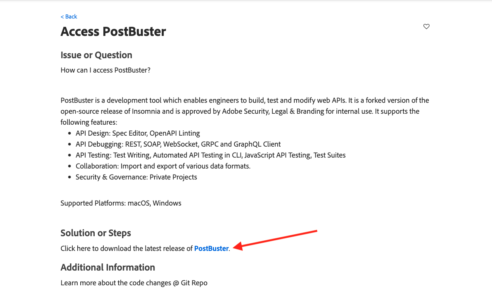
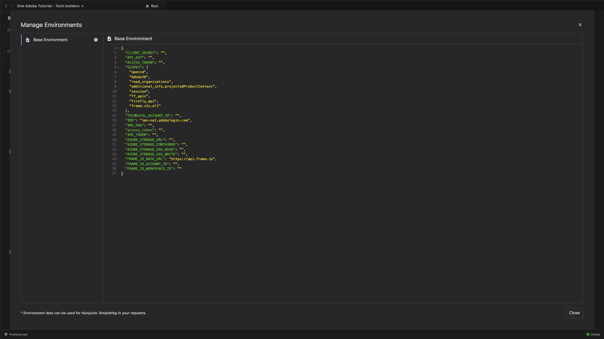

# Option 2: PostBuster-Einrichtung

>[!IMPORTANT]
>
>Wenn Sie kein Adobe-Mitarbeiter sind, befolgen Sie die Anweisungen zum [&#x200B; von Postman](./ex7.md){target="_blank"}. Die folgenden Anweisungen sind nur für Adobe-Mitarbeiter gedacht.

## Video

In diesem Video erhalten Sie eine Erklärung und Demonstration aller Schritte, die an dieser Übung beteiligt sind.

>[!VIDEO](https://video.tv.adobe.com/v/3476496?quality=12&learn=on)

## Installieren von PostBuster

Navigieren Sie zu [https://adobe.service-now.com/esc?id=adb_esc_kb_article&sysparm_article=KB0020542](https://adobe.service-now.com/esc?id=adb_esc_kb_article&sysparm_article=KB0020542){target="_blank"}.

Klicken Sie hier, um die neueste Version von **PostBuster** herunterzuladen.



Laden Sie die richtige Version für Ihr Betriebssystem herunter.


Sobald der Download abgeschlossen ist und installiert wurde, öffnen Sie PostBuster. Sie sollten das dann sehen. Klicken Sie **Importieren**.


Laden Sie [postbuster.json.zip](./../../../assets/postman/postbuster.json.zip){target="_blank"} herunter und extrahieren Sie es auf Ihrem Desktop.


Klicken Sie **Datei wählen**.


Wählen Sie die Datei **postbuster.json** aus. Klicken Sie auf **Öffnen**.


Sie sollten das dann sehen. Klicken Sie auf **Scannen**.


Klicken Sie **Importieren**.


Sie sollten das dann sehen. Klicken Sie, um die importierte Sammlung zu öffnen.


Jetzt sehen Sie Ihre Sammlung. Sie müssen weiterhin eine Umgebung für einige Umgebungsvariablen konfigurieren.


Klicken Sie auf **Basisumgebung** und dann auf das Symbol **Bearbeiten**.


Sie sollten das dann sehen.



Kopieren Sie den Platzhalter unter Umgebung und fügen Sie ihn in die **Basisumgebung** ein, indem Sie die vorhandene ersetzen.

```json
{
	"CLIENT_SECRET": "",
	"API_KEY": "",
	"ACCESS_TOKEN": "",
	"SCOPES": [
		"openid",
		"AdobeID",
		"read_organizations", 
		"additional_info.projectedProductContext", 
		"session",
		"ff_apis",
		"firefly_api",
		"frame.s2s.all"
	],
	"TECHNICAL_ACCOUNT_ID": "",
	"IMS": "ims-na1.adobelogin.com",
	"IMS_ORG": "",
	"access_token": "",
	"IMS_TOKEN": "",
	"AZURE_STORAGE_URL": "",
	"AZURE_STORAGE_CONTAINER": "",
	"AZURE_STORAGE_SAS_READ": "",
	"AZURE_STORAGE_SAS_WRITE": "",
	"FRAME_IO_BASE_URL": "https://api.frame.io",
	"FRAME_IO_ACCOUNT_ID": "",
	"FRAME_IO_WORKSPACE_ID": ""
}
```

Sie sollten dann diese haben.


## Adobe I/O-Variablen eingeben

Wechseln Sie zu [https://developer.adobe.com/console/home](https://developer.adobe.com/console/home){target="_blank"} und öffnen Sie Ihr Projekt.


Wechseln Sie zu **OAuth Server-zu-Server**.


Jetzt müssen Sie die folgenden Werte aus Ihrem Adobe I/O-Projekt kopieren und in Ihre PostBuster-Basisumgebung einfügen.

- Client-ID
- Client-Geheimnis (klicken Sie **Client-Geheimnis abrufen**)
- ID des technischen Kontos
- Organisations-ID (scrollen Sie nach unten, um Ihre Organisations-ID zu finden)


Kopieren Sie die oben genannten Variablen einzeln und fügen Sie sie in Ihre **Basisumgebung** in PostBuster ein.

| Variablenname in Adobe I/O | Variablenname in der PostBuster-Basisumgebung |
|:-------------:| :---------------:| 
| Client-ID | `API_KEY` |
| Client-Geheimnis | `CLIENT_SECRET` |
| ID des technischen Kontos | `TECHNICAL_ACCOUNT_ID` |
| Organisations-ID | `IMS_ORG` |

Nachdem Sie diese Variablen einzeln kopiert haben, sollte Ihre PostBuster-Basisumgebung wie folgt aussehen.

Klicken Sie auf **Schließen**.


Wählen Sie in der Sammlung **Adobe IO - OAuth** die Anfrage mit dem Namen **POST - Zugriffstoken abrufen** und klicken Sie auf **Senden**.


Es sollte eine ähnliche Antwort mit den folgenden Informationen angezeigt werden:

| Schlüssel | Wert |
|:-------------:| :---------------:| 
| token_type | **Bearer** |
| access_token | **eyJhbGciOiJS…** |
| expires_in | **86399** |

Das Adobe I/O **Bearer-Token** hat einen bestimmten Wert (das sehr lange Zugriffs-Token) und ein Gültigkeitsfenster und ist jetzt 24 Stunden lang gültig. Wenn Sie also nach 24 Stunden Postman zur Interaktion mit Adobe-APIs verwenden möchten, müssen Sie ein neues Token generieren, indem Sie diese Anfrage erneut ausführen.


Ihre PostBuster-Umgebung ist jetzt konfiguriert und funktioniert. Sie haben jetzt diese Übung abgeschlossen.

## Nächste Schritte

Gehen Sie zu [Anwendungen zu installieren](./ex9.md){target="_blank"}

Zurück zu [Erste Schritte](./getting-started.md){target="_blank"}

Zurück zu [Alle Module](./../../../overview.md){target="_blank"}
