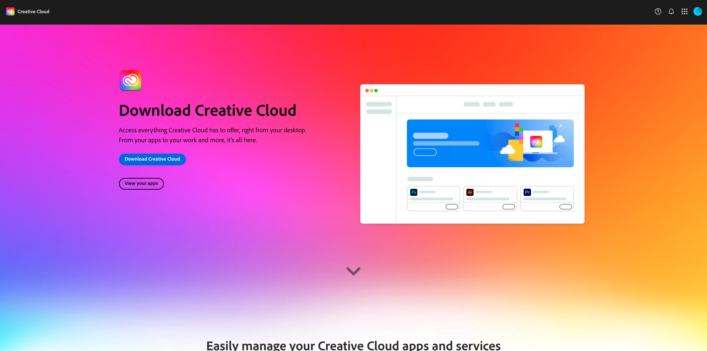

# Zu installierende Anwendungen

Nachstehend finden Sie einen Überblick über die Vorbereitung, die vor der Teilnahme an einem Live-Workshop erforderlich ist.

## Adobe Creative Cloud

Navigieren Sie zu [https://creativecloud.adobe.com/apps/download/creative-cloud](https://creativecloud.adobe.com/apps/download/creative-cloud).

## Photoshop

Öffnen Sie die App **Adobe Creative Cloud** und navigieren Sie zu **Apps**. Installieren Sie Photoshop auf Ihrem Computer.

## Visual Studio Code

Wechseln Sie zu [https://code.visualstudio.com/](https://code.visualstudio.com/){target="_blank"}, laden Sie (Visual Studio Code **herunter und installieren Sie**.

## Texteditor

Wenn Sie keine Texteditor-App haben, können Sie zu [https://www.sublimetext.com/](https://www.sublimetext.com/){target="_blank"} gehen und diesen Texteditor herunterladen und installieren.

## GitHub-Konto

Wenn Sie noch kein GitHub-Konto haben, navigieren Sie zu [https://github.com/](https://github.com/){target="_blank"} und klicken Sie auf **Registrieren**. Verwenden Sie Ihre persönliche E-Mail-Adresse und erstellen Sie Ihr Konto.

## GitHub-Desktop

Wechseln Sie zu [https://desktop.github.com/download/](https://desktop.github.com/download/){target="_blank"}, laden Sie (GitHub **) herunter und installieren Sie**.

## Azure Storage-Explorer

[Laden Sie den Microsoft Azure Storage Explorer herunter, um Ihre Dateien zu verwalten](https://azure.microsoft.com/en-us/products/storage/storage-explorer#Download-4){target="_blank"}. Wählen Sie die richtige Version für Ihr Betriebssystem aus, laden Sie sie herunter und installieren Sie sie.

{zoomable="yes"}

Sie haben jetzt das Modul „Erste Schritte“ abgeschlossen.

## Nächste Schritte

Zurück zu [Erste Schritte](./getting-started.md){target="_blank"}

Zurück zu [Alle Module](./../../../overview.md){target="_blank"}./images