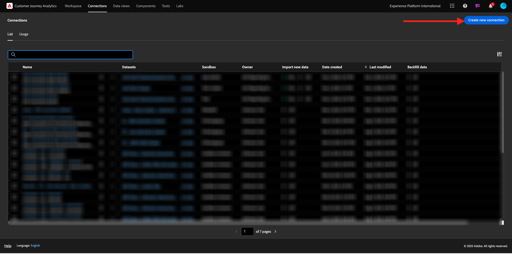
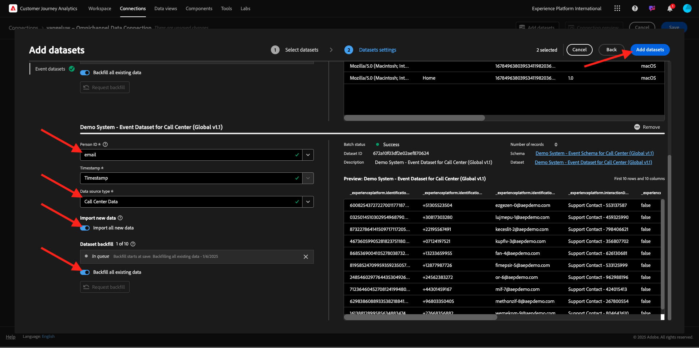

# 1.1.2 Verbinden von Adobe Experience Platform-Datensätzen in Customer Journey Analytics

## Ziele

- Grundlegendes zur Datenverbindungs-Benutzeroberfläche
- Adobe Experience Platform-Daten in CJA importieren
- Personen-ID und Datenzuordnung verstehen
- Lernen Sie das Konzept des Daten-Streaming in Customer Journey Analytics kennen

## 1.1.2.1

Navigieren Sie zu [analytics.adobe.com](https://analytics.adobe.com), um auf Customer Journey Analytics zuzugreifen.

Gehen Sie auf der Customer Journey Analytics-Homepage zu **Verbindungen**.

Hier können Sie die verschiedenen Verbindungen sehen, die zwischen CJA und Platform hergestellt wurden. Diese Verbindungen verfolgen dasselbe Ziel wie Report Suites in Adobe Analytics. Die Erfassung der Daten ist jedoch völlig anders. Alle Daten stammen aus Adobe Experience Platform-Datensätzen.

Erstellen wir Ihre erste Verbindung. Klicken Sie **Neue Verbindung erstellen**.

Anschließend wird die Benutzeroberfläche **Verbindung erstellen** angezeigt.

Sie können der Verbindung jetzt einen Namen geben.

Bitte diese Namenskonvention verwenden: `--aepUserLdap-- – Omnichannel Data Connection`.

Sie müssen außerdem die richtige zu verwendende Sandbox auswählen. Wählen Sie im Menü Sandbox Ihre Sandbox aus, die `--aepSandboxName--` werden soll. In diesem Beispiel lautet die Sandbox **Tech Insiders**. Sie müssen auch die **durchschnittliche Anzahl der täglichen Ereignisse** auf **weniger als 1 Million)**.

Nachdem Sie Ihre Sandbox ausgewählt haben, können Sie mit dem Hinzufügen von Datensätzen beginnen. Klicken Sie **Datensätze hinzufügen**.

## 1.1.2.2 Adobe Experience Platform-Datensätze auswählen

Suchen Sie nach der `Demo System - Event Dataset for Website (Global v1.1)`. Aktivieren Sie das Kästchen für diesen Datensatz, um ihn dieser Verbindung hinzuzufügen.

Im selben Bildschirm verbleiben und jetzt das Kontrollkästchen nach `Demo System - Event Dataset for Call Center (Global v1.1)` durchsuchen und aktivieren.

Dann hast du das hier. Klicken Sie auf **Weiter**.

## 1.1.2.3 Personen-ID und Datenzuordnung

### Personen-ID

Das Ziel besteht nun darin, diese Datensätze zusammenzuführen. Für jeden ausgewählten Datensatz wird ein Feld mit dem Namen **Personen-ID** angezeigt. Jeder Datensatz verfügt über ein eigenes Personen-ID-Feld.

Wie Sie sehen können, ist bei den meisten Personen-IDs automatisch ausgewählt. Dies liegt daran, dass in jedem Schema in Adobe Experience Platform eine Primäre Identität ausgewählt ist. Hier finden Sie beispielsweise das Schema für `Demo System - Event Schema for Website (Global v1.1)`, in dem Sie sehen können, dass die Primäre Identität auf `ecid` festgelegt ist.

Sie können jedoch weiterhin beeinflussen, welche Kennung zum Zusammenfügen von Datensätzen für Ihre Verbindung verwendet wird. Sie können eine beliebige Kennung verwenden, die im mit Ihrem Datensatz verknüpften Schema konfiguriert ist. Klicken Sie auf das Dropdown-Menü, um die für jeden Datensatz verfügbaren IDs zu untersuchen.

Wie bereits erwähnt, können Sie für jeden Datensatz unterschiedliche Personen-IDs festlegen. Auf diese Weise können Sie verschiedene Datensätze aus verschiedenen Ursprüngen in CJA zusammenführen. Stellen Sie sich vor, NPS- oder Umfragedaten einzubringen, die sehr interessant und hilfreich wären, um den Kontext zu verstehen und warum etwas passiert ist.

Der Name des Personen-ID-Feldes ist nicht wichtig, solange der Wert in den Personen-ID-Feldern übereinstimmt. Angenommen, wir haben `email` in einem Datensatz und `emailAddress` in einem anderen Datensatz, der als Personen-ID definiert ist. Wenn `delaigle@adobe.com` für das Personen-ID-Feld in beiden Datensätzen denselben Wert aufweist, kann CJA die Daten zusammenfügen.

Lesen Sie die häufig gestellten Fragen zu CJA hier, um die Feinheiten beim Identitätszuordnen zu verstehen: [FAQ](https://experienceleague.adobe.com/docs/analytics-platform/using/cja-overview/cja-faq.html?lang=de).

### Daten mithilfe der Personen-ID zusammenfügen

Nachdem Sie nun das Konzept des Zusammenfügens von Datensätzen mit der Personen-ID verstanden haben, wählen wir `email` als Personen-ID für jeden Datensatz aus.

Gehen Sie zu jedem Datensatz, um die Personen-ID zu aktualisieren. Füllen Sie jetzt das Feld Personen-ID aus, indem Sie die `email` in der Dropdown-Liste auswählen.

Nachdem Sie die beiden Datensätze zugeordnet haben, können Sie fortfahren.

| datensatz | Personen-ID |
| ----------------- |-------------| 
| Demosystem - Ereignisdatensatz für eine Website (Global v1.1) | email |
| Demosystem - Ereignisdatensatz für Callcenter (Global v1.1) | email |

Sie müssen außerdem sicherstellen, dass diese Optionen für beide Datensätze aktiviert sind:

- Alle neuen Daten importieren
- Alle vorhandenen Daten aufstocken

(Vergessen Sie nicht, beide Optionen für den zweiten Datensatz zu aktivieren.)

Außerdem müssen Sie für jeden Datensatz **Datenquellentyp** auswählen.

Dies sind die Einstellungen für den Datensatz **Demosystem - Ereignisdatensatz für die Website (Global v1.1)**.

Dies sind die Einstellungen für den Datensatz **Demosystem - Ereignisdatensatz für die Website (Global v1.1)**.

Klicken Sie **Datensätze hinzufügen**.

Klicken Sie **Speichern** und gehen Sie zur nächsten Übung.

Nachdem Sie Ihre **Verbindung** erstellt haben, kann es einige Stunden dauern, bis Ihre Daten in CJA verfügbar sind.

## Nächste Schritte

Navigieren Sie zu [1.1.3 Datenansicht erstellen](./ex3.md){target="_blank"}

Zurück zu [Customer Journey Analytics](./customer-journey-analytics-build-a-dashboard.md){target="_blank"}

Zurück zu [Alle Module](./../../../../overview.md){target="_blank"}
