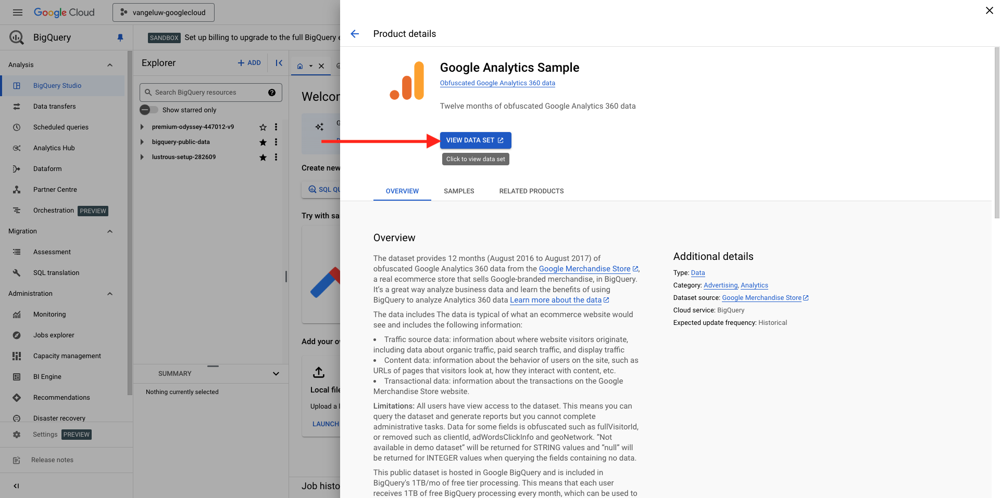

# 1.2.1 Verwenden der Google Cloud Platform

>[!NOTE]
>
>Für diese Übung benötigen Sie Zugriff auf eine Google Cloud Platform-Umgebung. Wenn Sie noch keinen Zugriff auf GCP haben, erstellen Sie ein neues Konto mit Ihrer persönlichen E-Mail-Adresse.

## 1.2.1.1 Warum Google BigQuery mit Adobe Experience Platform verbinden, um Google Analytics-Daten zu erhalten

Google Cloud Platform (GCP) ist eine Suite öffentlicher Cloud-Computing-Services, die von Google angeboten wird. Die Google Cloud-Plattform umfasst eine Reihe gehosteter Services für die Rechen-, Speicher- und Anwendungsentwicklung, die auf Google-Hardware ausgeführt werden.

BigQuery ist einer dieser Services und ist immer in Google Analytics 360 enthalten. Google Analytics-Daten werden häufig berechnet, wenn wir versuchen, Daten direkt aus ihnen abzurufen (z. B. API). Deshalb enthält Google BigQuery, um nicht abgetastete Daten zu erhalten, sodass Marken erweiterte Analysen mithilfe von SQL durchführen und von der Leistungsfähigkeit von GCP profitieren können.

Google Analytics-Daten werden täglich über einen Batch-Mechanismus in BigQuery geladen. Daher ist es nicht sinnvoll, diese GCP/BigQuery-Integration für Anwendungsfälle der Echtzeit-Personalisierung und -Aktivierung zu verwenden.

Wenn eine Marke Anwendungsfälle für die Personalisierung in Echtzeit bereitstellen möchte, die auf Google Analytics-Daten basieren, kann sie diese Daten auf der Website mit Google Tag Manager erfassen und dann in Echtzeit an Adobe Experience Platform streamen.

Der GCP/BigQuery Source Connector sollte verwendet werden, um…

- Verfolgen Sie das gesamte Kundenverhalten auf der Website und laden Sie diese Daten in Adobe Experience Platform für Anwendungsfälle für Analyse, Datenwissenschaft und Personalisierung, die keine Echtzeit-Aktivierung erfordern.
- Laden Sie historische Google Analytics-Daten in Adobe Experience Platform, ebenfalls für Anwendungsfälle zur Analyse und Datenwissenschaft

## 1.2.1.2 Ihres Google-Kontos

>[!NOTE]
>
>Für diese Übung benötigen Sie Zugriff auf eine Google Cloud Platform-Umgebung. Wenn Sie noch keinen Zugriff auf GCP haben, erstellen Sie ein neues Konto mit Ihrer persönlichen E-Mail-Adresse.

## 1.2.1.3 Projekt auswählen oder erstellen

Navigieren Sie zu [https://console.cloud.google.com/](https://console.cloud.google.com/).

Klicken Sie anschließend auf **Projekt auswählen** oder klicken Sie auf ein vorhandenes Projekt.

Wenn Sie noch kein Projekt haben, klicken Sie auf &quot;**PROJEKT**. Wenn Sie bereits über ein Projekt verfügen, können Sie dieses auswählen und mit dem nächsten Schritt fortfahren.

Benennen Sie Ihr Projekt nach dieser Namenskonvention. Klicken Sie **ERSTELLEN**.

| Konvention |
| ----------------- |
| `--aepUserLdap---googlecloud` |

Warten Sie, bis die Benachrichtigung oben rechts im Bildschirm anzeigt, dass die Erstellung abgeschlossen ist. Klicken Sie dann auf **PROJEKT AUSWÄHLEN**.

Navigieren Sie dann oben im Bildschirm zur Suchleiste und geben Sie „BigQuery **ein**. Das erste Ergebnis auswählen.

Ziel dieses Moduls ist es, Google Analytics-Daten in Adobe Experience Platform zu importieren. Dazu benötigen Sie zunächst Platzhalterdaten in einem Google Analytics-Datensatz.

Klicken Sie auf **+ Hinzufügen** und klicken Sie dann im **Menü auf**&#x200B;Öffentliche Datensätze.

Daraufhin wird dieses Fenster angezeigt:

Geben Sie den Suchbegriff **Google Analytics Sample** in die Suchleiste ein und klicken Sie auf das erste Suchergebnis.

Daraufhin wird der folgende Bildschirm mit einer Beschreibung des Datensatzes angezeigt. Klicken Sie auf **DATENSATZ ANZEIGEN**.

Sie werden dann zu BigQuery weitergeleitet, wo Sie diesen Datensatz **bigquery-public-data** unter **Explorer** sehen.

In **Explorer** sollten jetzt mehrere Tabellen angezeigt werden. Erkunden Sie sie einfach. Gehe zu `google_analytics_sample`.

Klicken, um die `ga_sessions` zu öffnen.

Bevor Sie mit der nächsten Übung fortfahren, notieren Sie sich folgende Dinge in einer separaten Textdatei auf Ihrem Computer:

| Anmeldedaten | Benennung | Beispiel |
| ----------------- |-------------| -------------|
| Projektname | `--aepUserLdap---googlecloud` | vangeluw-googlecloud |
| Projekt-ID | random | possible-bee-447102-h3 |

Sie können Ihren Projektnamen und Ihre Projekt-ID finden, indem Sie auf **Projektname** in der oberen Menüleiste klicken:

Auf der rechten Seite sehen Sie dann Ihre Projekt-ID:

Sie können jetzt mit der nächsten Übung fortfahren, bei der Sie sich die Hände schmutzig machen, indem Sie Google Analytics-Daten abfragen.

## Nächste Schritte

Navigieren Sie zu [1.2.2 Erstellen Sie Ihre erste Abfrage in BigQuery](./ex2.md){target="_blank"}

Gehen Sie zurück zu [Aufnehmen und Analysieren von Google Analytics-Daten in Adobe Experience Platform mit dem BigQuery Source Connector](./customer-journey-analytics-bigquery-gcp.md){target="_blank"}

Zurück zu [Alle Module](./../../../../overview.md){target="_blank"}
