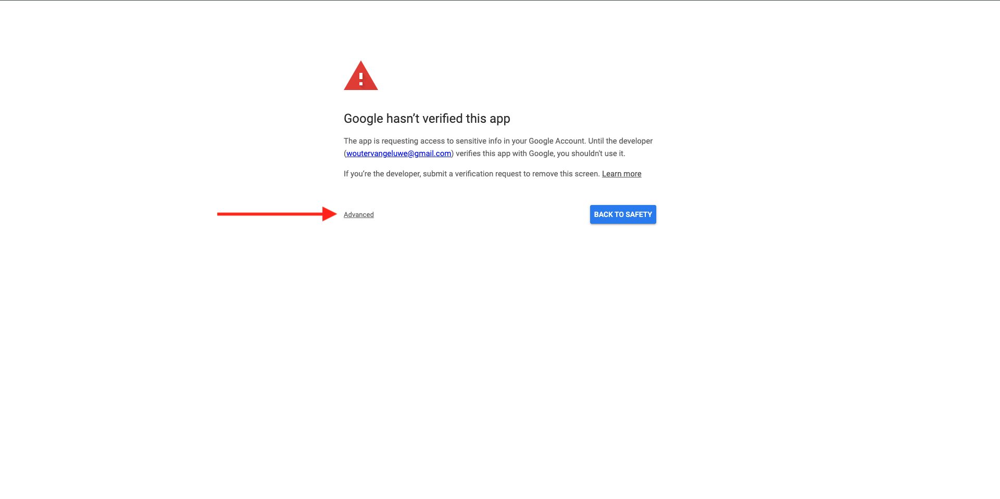
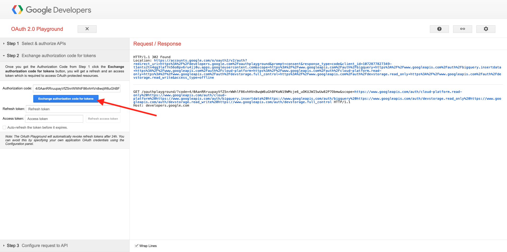

# 1.2.3 Verbinden von GCP und BigQuery mit Adobe Experience Platform

## Ziele

- Erkunden der API und Services in Google Cloud Platform
- Kennenlernen von OAuth Playground zum Testen von Google-APIs
- Erstellen Ihrer ersten BigQuery-Verbindung in Adobe Experience Platform

## Kontext

Adobe Experience Platform bietet einen Connector in **Sources**, der Ihnen dabei hilft, BigQuery-Datensätze in Adobe Experience Platform zu importieren. Dieser Daten-Connector basiert auf der Google BigQuery-API. Daher ist es wichtig, Ihre Google Cloud Platform und Ihre BigQuery-Umgebung ordnungsgemäß auf den Empfang von API-Aufrufen von Adobe Experience Platform vorzubereiten.

Zum Konfigurieren des BigQuery Source-Connectors in Adobe Experience Platform benötigen Sie die folgenden vier Werte:

- Projekt
- clientId
- clientSecret
- refreshToken

Bisher haben Sie nur die erste, die **Projekt-ID**. Dieser **Projekt-ID**-Wert ist eine zufällige ID, die von Google beim Erstellen Ihres BigQuery-Projekts während Übung 12.1 generiert wurde.

Bitte Projekt-ID in eine separate Textdatei kopieren.

| Anmeldedaten | Benennung | Beispiel |
| ----------------- |-------------| -------------|
| Projekt-ID | random | possible-bee-447102-h3 |

Sie können Ihre Projekt-ID jederzeit überprüfen, indem Sie auf **Projektname** in der oberen Menüleiste klicken:

Auf der rechten Seite sehen Sie Ihre Projekt-ID:

In dieser Übung erfahren Sie, wie Sie die anderen drei erforderlichen Felder abrufen:

- clientId
- clientSecret
- refreshToken

## 1.2.3.1 Google-Authentifizierungsplattform

Navigieren Sie zunächst zurück zur Startseite von Google Cloud Platform. Klicken Sie dazu einfach auf das Logo oben links im Bildschirm.

Sobald Sie sich auf der Startseite befinden, suchen Sie in der Suchleiste nach **0}Google-Authentifizierungsplattform.** Klicken Sie auf das erste Ergebnis, um es zu öffnen.

Jetzt sehen Sie die Startseite der **Google-**. Klicken Sie auf **GET GESTARTET**.

Verwenden Sie für **App-**&quot; Folgendes:

| Benennung | Beispiel |
| ----------------- |-------------| 
| `--aepUserLdap-- - AEP BigQuery Connector` | vangeluw - AEP BigQuery-Connector |

Wählen Sie Ihre E-Mail-Adresse für das Feld **Support-E-Mail** aus.

Klicken Sie **WEITER**.

Wählen Sie **Extern** aus und klicken Sie auf **WEITER**.

Geben Sie Ihre E-Mail-Adresse ein und klicken Sie auf **WEITER**.

Aktivieren Sie das Kontrollkästchen und klicken Sie auf **WEITER**. Klicken Sie dann auf **ERSTELLEN**.

## 1.2.3.2 OAuth-Client erstellen

Klicken Sie **OAUTH-CLIENT ERSTELLEN**.

Sie werden es dann sehen.

Wählen Sie **Web-Anwendung** aus.

Es werden mehrere neue Felder angezeigt. Sie müssen jetzt den **Namen** der OAuth-Client-ID und auch die (**Umleitungs-URIs)**.

Verwenden Sie für das Feld **Name** Folgendes:

| Feld | Wert | Beispiel |
| ----------------- |-------------| -------------| 
| Name | ldap - AEP BigQuery-Connector | vangeluw - Platform BigQuery-Connector |

Klicken Sie unter **Autorisierte Umleitungs** URIs **auf**+ URI hinzufügen . Fügen Sie den folgenden neuen URI hinzu.

| Feld | Wert |
| ----------------- |-------------| 
| Autorisierte Weiterleitungs-URIs | https://developers.google.com/oauthplayground |

Das Feld **Autorisierte Weiterleitungs-URIs** ist ein sehr wichtiges Feld, da Sie es später benötigen werden, um das RefreshToken zu erhalten, das Sie benötigen, um die Einrichtung des BigQuery Source-Connectors in Adobe Experience Platform abzuschließen.

Klicken Sie auf **Erstellen**.

Ihre OAuth-Client-ID wurde erstellt. Klicken Sie darauf, um nun Ihre Client-ID und Ihr Client-Geheimnis anzuzeigen.

Anschließend sehen Sie die Werte für Client-ID und Client-Geheimnis.

Bitte diese beiden Felder kopieren und in eine Textdatei auf Ihrem Desktop einfügen. Sie können jederzeit zu einem späteren Zeitpunkt auf diese Anmeldeinformationen zugreifen, es ist jedoch einfacher, wenn Sie sie in einer Textdatei neben Ihrer BigQuery-Projekt-ID speichern.

Zusammenfassend für Ihr BigQuery Source Connector-Setup in Adobe Experience Platform stehen Ihnen jetzt die folgenden Werte bereits zur Verfügung:

| BigQuery Connector-Anmeldedaten | Wert |
| ----------------- |-------------| 
| Projekt-ID | Ihre eigene Projekt-ID (z. B.: possible-bee-447102-h3) |
| clientId | yourClientID |
| clientSecret | yourClientSecret |

Als Nächstes müssen Sie Ihre OAuth-App veröffentlichen. Gehen Sie zu **Zielgruppe** und klicken Sie auf **APP VERÖFFENTLICHEN**.

Klicken Sie **BESTÄTIGEN**.

Ihnen fehlt noch das **refreshToken**. Das refreshToken ist aus Sicherheitsgründen erforderlich. In der Welt der APIs laufen Token normalerweise alle 24 Stunden ab. Daher wird **refreshToken** benötigt, um das Sicherheits-Token alle 24 Stunden zu aktualisieren, damit Ihr Source Connector-Setup weiterhin eine Verbindung zu Google Cloud Platform und BigQuery herstellen kann.

## 1.2.3.3 der BigQuery-API und des refreshToken

Es gibt viele Möglichkeiten, ein refreshToken für den Zugriff auf Google Cloud Platform-APIs zu erhalten. Eine dieser Optionen ist beispielsweise die Verwendung von Postman.
Google hat jedoch etwas entwickelt, das einfacher zu testen und mit seinen APIs zu spielen ist, ein Tool namens **OAuth 2.0 Playground**.

Um auf **OAuth 2.0 Playground** zuzugreifen, gehen Sie zu [https://developers.google.com/oauthplayground](https://developers.google.com/oauthplayground).

Anschließend sehen Sie die Homepage **OAuth 2.0**.

Klicken Sie auf **Zahnrad**-Symbol oben rechts im Bildschirm. Achten Sie darauf, dass Ihre Einstellungen mit denen im Bild oben übereinstimmen.

Aktivieren Sie das Kontrollkästchen: **Eigene OAuth-Anmeldeinformationen verwenden**

Es werden zwei Felder angezeigt.

Bitte die Felder dieser Tabelle ausfüllen:

| Playground-API-Einstellungen | Ihre Google API-Anmeldedaten |
| ----------------- |-------------| 
| OAuth Client-ID | Ihre eigene Client-ID (in der Textdatei auf Ihrem Desktop) |
| OAuth-Client-Geheimnis | Ihr eigenes Client-Geheimnis (in der Textdatei auf Ihrem Desktop) |

Nachdem Sie Ihre Anmeldedaten ausgefüllt haben, klicken Sie auf **Schließen**.

Im linken Menü sehen Sie alle verfügbaren Google-APIs. Suchen Sie nach **BigQuery API v2** und klicken Sie darauf, um sie zu öffnen.

Wählen Sie als Nächstes den Umfang aus, wie in der folgenden Abbildung dargestellt. Sie müssen auf jede der verfügbaren APIs klicken, damit für jede ausgewählte API ein Häkchen angezeigt wird.

Klicken Sie anschließend auf **APIs zulassen**.

Klicken Sie auf die E-Mail-Adresse, die Sie zum Einrichten von GCP und BigQuery verwendet haben.

Dann wird eine große Warnung angezeigt: **Diese App ist nicht verifiziert**. Dies geschieht, weil Ihr Platform BigQuery Connector noch nicht formal überprüft wurde, sodass Google nicht weiß, ob es eine authentische App ist oder nicht.

Klicken Sie auf **Erweitert**.

Klicken Sie anschließend auf **Wechseln zu —aepUserLdap— - AEP BigQuery Connector (unsicher)**.

Anschließend wird eine Eingabeaufforderung für den Zugriff angezeigt. Klicken Sie **Alle auswählen**.

Scrollen Sie nach unten und klicken Sie auf **Weiter**.

Sie werden jetzt zurück zum OAuth 2.0-Playground gesendet und Sie sehen dies. Klicken Sie auf **Autorisierungs-Code für Token austauschen**.

Nach einigen Sekunden wird die Ansicht **Schritt 2 - Autorisierungs-Code für Token austauschen** automatisch geschlossen und Sie sehen **Schritt 3 - Anfrage an API konfigurieren**.

Sie müssen zurück zu **Schritt 2 Austausch-Autorisierungs-Code für Token**, klicken Sie also erneut auf **Schritt 2 Austausch-Autorisierungs-Code für**-Token, um das **Token aktualisieren** zu visualisieren.

Daraufhin wird die Meldung &quot;**Token“**.

Kopieren Sie das **Aktualisierungstoken** und fügen Sie es zusammen mit den anderen BigQuery Source Connector-Anmeldeinformationen in die Textdatei auf Ihrem Desktop ein:

| BigQuery Source Connector-Anmeldedaten | Wert |
| ----------------- |-------------| 
| Projekt-ID | Ihre eigene zufällige Projekt-ID (z. B.: apt-summer-273608) |
| clientId | yourClientID |
| clientSecret | yourClientSecret |
| refreshToken | yourRefreshToken |

Als Nächstes richten wir Ihren Source-Connector in Adobe Experience Platform ein.

## 1.2.3.5 - Verbinden von Platform mit Ihrer eigenen BigQuery-Tabelle

Melden Sie sich über die folgende URL bei Adobe Experience Platform an: [https://experience.adobe.com/platform](https://experience.adobe.com/platform).

Nach dem Login landen Sie auf der Homepage von Adobe Experience Platform.

Bevor Sie fortfahren, müssen Sie eine **Sandbox“**. Die auszuwählende Sandbox hat den Namen ``--aepSandboxName--``. Nach Auswahl der entsprechenden Sandbox wird der Bildschirm geändert und Sie befinden sich nun in Ihrer dedizierten Sandbox.

Navigieren Sie im linken Menü zu Quellen . Anschließend wird die Homepage **Quellen** angezeigt. Klicken Sie **Menü** Quellen“ auf **Datenbanken**. Klicken Sie auf die Karte **Google BigQuery**. Klicken Sie anschließend auf **Einrichten**.

Sie sollten jetzt eine neue Verbindung erstellen.

Klicken Sie auf **Neues Konto**. Jetzt müssen Sie alle folgenden Felder ausfüllen, basierend auf der Einrichtung, die Sie in GCP und BigQuery vorgenommen haben.

Beginnen wir mit der Benennung der Verbindung:

Bitte diese Namenskonvention verwenden:

| BigQuery Connector-Anmeldedaten | Wert | Beispiel |
| ----------------- |-------------| -------------| 
| Kontoname | `--aepUserLdap-- - BigQuery Connection` | vangeluw - BigQuery-Verbindung |
| Beschreibung | `--aepUserLdap-- - BigQuery Connection` | vangeluw - BigQuery-Verbindung |

Sie erhalten dann Folgendes:

Füllen Sie anschließend die GCP- und BigQuery-API **Kontoauthentifizierung**-Details aus, die Sie in einer Textdatei auf Ihrem Desktop gespeichert haben:

| BigQuery Connector-Anmeldedaten | Wert |
| ----------------- |-------------| 
| Projekt-ID | Ihre eigene zufällige Projekt-ID (z. B.: possible-bee-447102-h3) |
| clientId | ... |
| clientSecret | ... |
| refreshToken | ... |

Ihre **Kontoauthentifizierung**-details sollten jetzt wie folgt aussehen. Klicken Sie auf **Mit Quelle verbinden**.

Wenn Ihre **Kontoauthentifizierung** korrekt ausgefüllt wurden, sollten Sie jetzt eine visuelle Bestätigung sehen, dass die Verbindung ordnungsgemäß funktioniert, indem Sie die Bestätigung **Verbunden** sehen. Klicken Sie auf **Weiter**.

Jetzt wird der BigQuery-Datensatz angezeigt, den Sie in der vorherigen Übung erstellt haben.

Gut gemacht! In der nächsten Übung laden Sie Daten aus dieser Tabelle und ordnen sie einem Schema und Datensatz in Adobe Experience Platform zu.

## Nächste Schritte

Navigieren Sie zu [1.2.4 Daten von BigQuery in Adobe Experience Platform laden](./ex4.md){target="_blank"}

Gehen Sie zurück zu [Aufnehmen und Analysieren von Google Analytics-Daten in Adobe Experience Platform mit dem BigQuery Source Connector](./customer-journey-analytics-bigquery-gcp.md){target="_blank"}

Zurück zu [Alle Module](./../../../../overview.md){target="_blank"}
