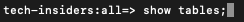

# 2.1.3 Verwenden des Abfrage-Service

## Ziel

- Datensätze suchen und untersuchen
- Erfahren Sie, wie Sie Experience-Datenmodellobjekte und -attribute in Ihren Abfragen adressieren

## Kontext

In diesem Video erfahren Sie, wie Sie mit PSQL Informationen zu den verfügbaren Datensätzen abrufen, Abfragen für das Experience-Datenmodell (XDM) schreiben und Ihre ersten einfachen Berichtsabfragen mithilfe der Datensätze Query Service und Citi Signal schreiben können.

## Grundlegende Abfragen

In diesem Video erfahren Sie, wie Sie Informationen zu den verfügbaren Datensätzen abrufen und wie Sie Daten mit einer Abfrage aus einem XDM-Datensatz ordnungsgemäß abrufen können.

Alle Datensätze, die wir Anfang 1 über Adobe Experience Platform untersucht haben, stehen auch über eine SQL-Schnittstelle als Tabellen zur Verfügung. Zum Auflisten dieser Tabellen können Sie den Befehl **Tabellen anzeigen;** verwenden.

Führen Sie `show tables;` in Ihrer **PSQL-Befehlszeilenschnittstelle“**. (Vergessen Sie nicht, den Befehl mit einem Semikolon zu beenden).

Kopieren Sie den `show tables;` und fügen Sie ihn an der Eingabeaufforderung ein:



Es wird das folgende Ergebnis angezeigt:

```text
tech-insiders:all=> show tables;
                               name                               |                                                  dataSetId                                                   |                                       dataSet                                        | description |        labels        
------------------------------------------------------------------+--------------------------------------------------------------------------------------------------------------+--------------------------------------------------------------------------------------+-------------+----------------------
 ajo_bcc_feedback_event_dataset                                   | 672a07cb7728e82aefa1ec56                                                                                     | AJO BCC Feedback Event Dataset                                                       |             | 
 ajo_classification_dataset                                       | 672a07cab55b0d2aef6f9626                                                                                     | AJO Classification Dataset                                                           |             | 
 ajo_consent_service_dataset                                      | 672a07c80fd5fd2aee4155ca                                                                                     | AJO Consent Service Dataset                                                          |             | 'PROFILE'
 ajo_email_tracking_experience_event_dataset                      | 672a07c926d57d2aef020230                                                                                     | AJO Email Tracking Experience Event Dataset                  :
                               name                               |                                                  dataSetId                                                   |                                       dataSet                                        | description |        labels        
------------------------------------------------------------------+--------------------------------------------------------------------------------------------------------------+--------------------------------------------------------------------------------------+-------------+----------------------
 ajo_bcc_feedback_event_dataset                                   | 672a07cb7728e82aefa1ec56                                                                                     | AJO BCC Feedback Event Dataset                                                       |             | 
 ajo_classification_dataset                                       | 672a07cab55b0d2aef6f9626                                                                                     | AJO Classification Dataset                                                           |             | 
 ajo_consent_service_dataset                                      | 672a07c80fd5fd2aee4155ca                                                                                     | AJO Consent Service Dataset                                                          |             | 'PROFILE'
 ajo_email_tracking_experience_event_dataset                      | 672a07c926d57d2aef020230                                                                                     | AJO Email Tracking Experience Event Dataset   
```

Drücken Sie am Doppelpunkt die Leertaste, um die nächste Seite der Ergebnismenge anzuzeigen, oder geben Sie `q` ein, um zur Eingabeaufforderung zurückzukehren.

Jeder Datensatz in AEP verfügt über die entsprechende Abfrage-Service-Tabelle. Die Tabelle eines Datensatzes finden Sie über die Benutzeroberfläche Datensätze :


Die `demo_system_event_dataset_for_website_global_v1_1` ist die Abfrage-Service-Tabelle, die dem `Demo System - Event Schema for Website (Global v1.1)` Datensatz entspricht.

Um Informationen darüber abzufragen, wo ein Produkt angesehen wurde, wählen Sie die **geo**-Informationen aus.

Kopieren Sie die unten stehende Abfrage, fügen Sie sie an der Eingabeaufforderung in die **PSQL-Befehlszeilenschnittstelle ein** drücken Sie die Eingabetaste:

```sql
select placecontext.geo
from   demo_system_event_dataset_for_website_global_v1_1
where  eventType = 'commerce.productViews'
and placecontext.geo.countryCode <> ''
limit 1;
```

In Ihrem Abfrageergebnis werden Sie feststellen, dass Spalten im Experience-Datenmodell (XDM) komplexe Typen sein können und nicht nur skalare Typen. In der obigen Abfrage möchten wir die geografischen Standorte identifizieren, an denen **commerce.productViews** stattgefunden hat. Um ein **commerce.productViews** zu identifizieren, müssen wir mithilfe der **durch das XDM-Modell navigieren.** (Punkt).

```text
tech-insiders:all=> select placecontext.geo
from   demo_system_event_dataset_for_website_global_v1_1
where  eventType = 'commerce.productViews'
and placecontext.geo.countryCode <> ''
limit 1;
                 geo                  
--------------------------------------
 ("(51.59119,-1.407848)",Charlton,GB)
(1 row)
```

Beachten Sie, dass das Ergebnis eher ein flaches Objekt als ein einzelner Wert ist? Das **placeContext.geo**-Objekt enthält vier Attribute: Schema, Land und Stadt. Wenn ein Objekt als Spalte deklariert wird, wird das gesamte Objekt als Zeichenfolge zurückgegeben. Das XDM-Schema mag komplexer sein als das, was Sie kennen, aber es ist sehr leistungsstark und wurde entwickelt, um viele Lösungen, Kanäle und Anwendungsfälle zu unterstützen.

Um die individuellen Eigenschaften eines Objekts auszuwählen, verwenden Sie die **.** (Punkt).

Kopieren Sie die unten stehende Anweisung und fügen Sie sie an der Eingabeaufforderung in die **PSQL-Befehlszeilenschnittstelle ein**:

```sql
select placecontext.geo._schema.longitude
      ,placecontext.geo._schema.latitude
      ,placecontext.geo.city
      ,placecontext.geo.countryCode
from   demo_system_event_dataset_for_website_global_v1_1
where  eventType = 'commerce.productViews'
and placecontext.geo.countryCode <> ''
limit 1;
```

Das Ergebnis der obigen Abfrage sollte wie folgt aussehen.
Das Ergebnis ist jetzt ein Satz einfacher Werte:

```text
tech-insiders:all=> select placecontext.geo._schema.longitude
      ,placecontext.geo._schema.latitude
      ,placecontext.geo.city
      ,placecontext.geo.countryCode
from   demo_system_event_dataset_for_website_global_v1_1
where  eventType = 'commerce.productViews'
and placecontext.geo.countryCode <> ''
limit 1;
 longitude | latitude |   city   | countrycode 
-----------+----------+----------+-------------
 -1.407848 | 51.59119 | Charlton | GB
(1 row)
```

Keine Sorge, es gibt eine einfache Möglichkeit, den Pfad zu einer bestimmten Eigenschaft zu erhalten. Im folgenden Teil erfahren Sie, wie.

Sie müssen eine Abfrage bearbeiten, öffnen wir also zuerst einen Editor.

Unter Windows: Verwenden **Notepad**

Auf Mac: Installieren Sie eine beliebige Texteditor-App und öffnen Sie sie.

Kopieren Sie die folgende Anweisung in Ihren Texteditor:

```sql
select your_attribute_path_here
from   demo_system_event_dataset_for_website_global_v1_1
where  eventType = 'commerce.productViews'
and placecontext.geo.countryCode <> ''
limit 1;
```

Wechseln Sie zurück zu Ihrer Adobe Experience Platform-Benutzeroberfläche (sollte in Ihrem Browser geöffnet sein) oder zu [Adobe Experience Platform](https://experience.adobe.com/platform).

Wählen Sie **Schemata** aus, geben Sie `Demo System - Event Schema for Website` in das Feld **Suche** ein und klicken Sie, um die `Demo System - Event Schema for Website (Global v1.1) Schema` zu öffnen.


Erkunden Sie das XDM-Modell für **Demosystem - Ereignisschema für Website (Global v1.1)**, indem Sie auf ein Objekt klicken. Erweitern Sie die Struktur für **placeContext**, **geo** und **schema**. Wenn Sie das tatsächliche Attribut **Längengrad** auswählen, wird der vollständige Pfad im hervorgehobenen roten Feld angezeigt. Um den Pfad des Attributs zu kopieren, klicken Sie auf das Symbol Pfad kopieren .


Wechseln Sie zu Ihrem Editor/Ihren Klammern und entfernen Sie **your_attribute_path_here** aus der ersten Zeile. Positionieren Sie den Cursor nach **select** auf der ersten Zeile und fügen Sie ihn ein (STRG+V).


Kopieren Sie die geänderte Anweisung, fügen Sie sie an der Eingabeaufforderung in die **PSQL-Befehlszeilenschnittstelle ein** drücken Sie die Eingabetaste.

Das Ergebnis sollte wie folgt aussehen:

```text
tech-insiders:all=> select placeContext.geo._schema.longitude
from   demo_system_event_dataset_for_website_global_v1_1
where  eventType = 'commerce.productViews'
and placecontext.geo.countryCode <> ''
limit 1;
 longitude 
-----------
 -1.407848
(1 row)
```

## Nächste Schritte

Navigieren Sie zu [2.1.4 Abfragen, Abfragen … und Abwanderungsanalyse](./ex4.md){target="_blank"}

Zurück zu [Abfrage-Service](./query-service.md){target="_blank"}

Zurück zu [Alle Module](./../../../../overview.md){target="_blank"}
