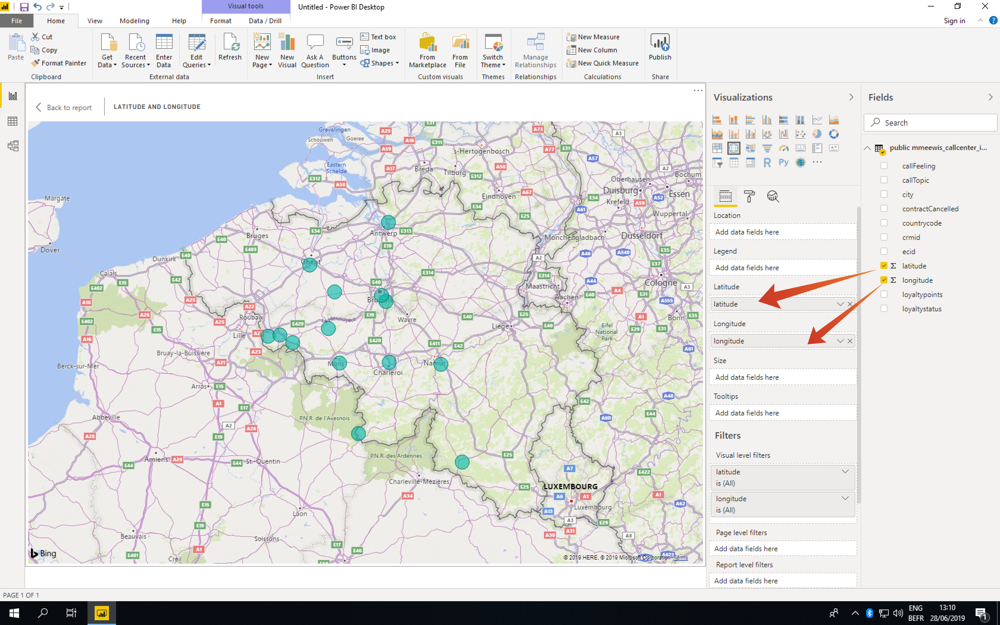
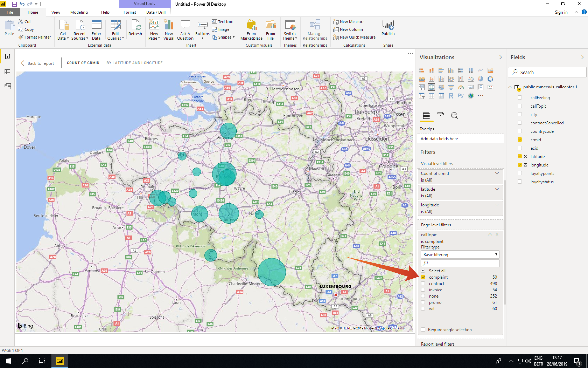

# 2.1.6 Query Service und Power BI

Öffnen Sie Microsoft Power BI Desktop.

Klicken Sie **Daten abrufen**.

Suchen Sie nach **postgres** (1), wählen Sie **Postgres** (2) aus der Liste aus und **Verbinden** (3).

Wechseln Sie zu Adobe Experience Platform, zu **Abfragen** und zu **Anmeldeinformationen**.

Kopieren Sie auf der Seite **Anmeldeinformationen** in Adobe Experience Platform den **Host**, fügen Sie ihn in das Feld **Server** ein, kopieren Sie den **Database** und fügen Sie ihn in das Feld **Database** in PowerBI ein. Klicken Sie dann auf OK (2).

>[!IMPORTANT]
>
>Stellen Sie sicher, dass Sie Port **:80** am Ende des Server-Werts einschließen, da der Abfrage-Service derzeit nicht den standardmäßigen PostgreSQL-Port 5432 verwendet.

Füllen Sie im nächsten Dialogfeld den Benutzernamen und das Kennwort mit Ihrem Benutzernamen und Kennwort aus den **Anmeldeinformationen** von Abfragen in Adobe Experience Platform.

Legen Sie im Navigator-Dialogfeld Ihren **LDAP** in das Suchfeld (1), um Ihre CTAS-Datensätze zu finden, und aktivieren Sie das Kontrollkästchen neben jedem (2). Klicken Sie anschließend auf Laden (3).

Stellen Sie sicher **dass die Registerkarte** Bericht) (1) ausgewählt ist.

Wählen Sie die Zuordnung (1) aus und vergrößern Sie nach dem Hinzufügen zur Reporting-Arbeitsfläche die Zuordnung (2).

Als Nächstes müssen wir die Kennzahlen und Dimensionen definieren. Ziehen Sie dazu Felder aus dem Abschnitt **Felder** auf die entsprechenden Platzhalter (unter **Visualisierungen**), wie unten angegeben:

Als Kennzahl verwenden wir die Anzahl **customerId**. Ziehen Sie das Feld **crmid** aus dem Abschnitt **fields** in den **Size**-Platzhalter:

Ziehen wir zum Schluss **callTopic**-Analyse das Feld **callTopic** auf den Platzhalter **Filter auf Seitenebene** (Sie müssen möglicherweise im Abschnitt **Visualisierungen** scrollen);

Wählen/deaktivieren Sie **callTopics** zur Untersuchung aus:

Sie haben jetzt diese Übung beendet.

## Nächste Schritte

Wechseln Sie zur Abfrage[Service-API 2.1.8](./ex8.md){target="_blank"}

Zurück zu [Abfrage-Service](./query-service.md){target="_blank"}

Zurück zu [Alle Module](./../../../../overview.md){target="_blank"}
