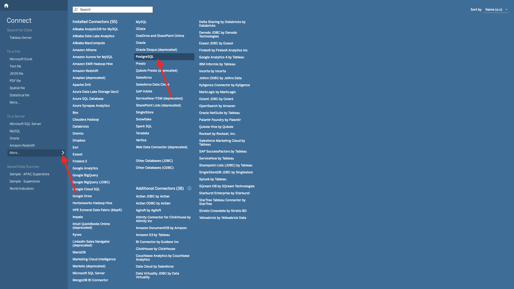

# 2.1.7 Query Service und Tableau

Tableau öffnen.

Klicken Sie **Mit Server verbinden** auf **Mehr** und dann auf **PostgreSQL**.

Wenn Sie PostgeSQL noch nicht mit Tableau verwendet haben, sehen Sie dies möglicherweise. Klicken Sie **Treiber herunterladen**.

Folgen Sie den Anweisungen, um den PostgreSQL-Treiber herunterzuladen und zu installieren.

Sobald Sie die Installation des Treibers abgeschlossen haben, beenden Sie Tableau Desktop und starten Sie es neu. Navigieren Sie nach dem Neustart erneut zu **Mit Server verbinden** und klicken Sie auf **Mehr** und anschließend erneut auf **PostgreSQL**.

Sie werden es dann sehen.

Wechseln Sie zu Adobe Experience Platform, zu **Abfragen** und zu **Anmeldeinformationen**.

Kopieren Sie auf der Seite **Anmeldeinformationen** in Adobe Experience Platform den **Host**, fügen Sie ihn in das Feld **Server** ein, kopieren Sie den **Datenbank** und fügen Sie ihn in das Feld **Datenbank** in Tableau ein, kopieren Sie den **Port** und fügen Sie ihn in das Feld **Port** in Tableau ein. Gehen Sie genauso vor für **Benutzername** und **Kennwort**. Klicken Sie anschließend auf **Anmelden**.

Suchen Sie in der Liste der verfügbaren Tabellen die Tabelle, die Sie in der vorherigen Übung erstellt haben und die `--aepUserLdap--_callcenter_interaction_analysis` heißt. Ziehen Sie es auf die Arbeitsfläche.

Sie werden es dann sehen. Klicken Sie **Jetzt aktualisieren**.

Anschließend sehen Sie, wie die Daten von AEP in Tableau verfügbar werden. Klicken Sie auf **Blatt 1**, um mit den Daten zu arbeiten.

Um Ihre Daten auf der Karte zu visualisieren, müssen Sie Längen- und Breitengrade in Dimensionen konvertieren. Klicken Sie **Kennzahlen** mit der rechten Maustaste auf **Breitengrad** und wählen Sie **In Dimension konvertieren** im Menü aus. Tun Sie dasselbe für die Messung **Längengrad**.

Ziehen Sie das **Längengrad**-Maß auf **Spalten** und das **Breitengrad**-Maß auf **Zeilen**. Die Karte von **Belgien** wird automatisch mit kleinen Punkten angezeigt, die die Städte in unserem Datensatz darstellen.

Wählen Sie **Kennzahlnamen** aus und klicken Sie auf **Zu Blatt hinzufügen**.

Sie erhalten nun eine Karte mit Punkten in verschiedenen Größen. Die Größe gibt die Anzahl der Callcenter-Interaktionen für diese bestimmte Stadt an. Um die Größe der Punkte zu ändern, navigieren Sie zum rechten Bedienfeld und öffnen Sie **Werte messen** (mithilfe des Dropdown-Symbols). Wählen Sie aus der Dropdown-Liste **Größe bearbeiten** aus. Spielen Sie mit verschiedenen Größen.

Ziehen Sie die Dimension **&#x200B;**&#x200B;Thema aufrufen **auf „Seiten**, um die Daten pro **Thema aufzurufen**. Navigieren Sie durch die verschiedenen **Anrufthemen** mithilfe des **Anrufthemas** auf der rechten Seite des Bildschirms:

Sie haben jetzt diese Übung beendet.

## Nächste Schritte

Wechseln Sie zur Abfrage[Service-API 2.1.8](./ex8.md){target="_blank"}

Zurück zu [Abfrage-Service](./query-service.md){target="_blank"}

Zurück zu [Alle Module](./../../../../overview.md){target="_blank"}
