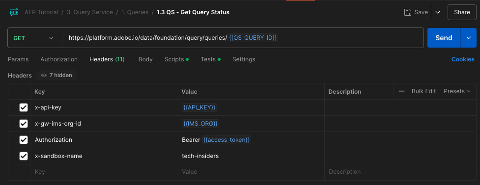

# 2.1.8 Abfrage-Service-API

## Ziel

- Verwenden Sie die Abfrage-Service-API, um Abfragevorlagen und Abfragezeitpläne zu verwalten

## Kontext

In dieser Übung führen Sie API-Aufrufe aus, um Abfragevorlagen und Abfragezeitpläne mithilfe einer Postman-Sammlung zu verwalten. Sie definieren Abfragevorlagen, führen reguläre Abfragen und CTAS-Abfragen aus. Eine **CTAS**-Abfrage (Tabelle als Auswahlabfrage erstellen) speichert ihren Ergebnissatz in einem expliziten Datensatz. Während reguläre Abfragen in einem impliziten (oder systemgenerierten) Datensatz gespeichert werden, der normalerweise im Parquet-Dateiformat exportiert wird.

## Dokumentation

- [Hilfe zum Adobe Experience Platform-Abfrage-Service](https://experienceleague.adobe.com/docs/experience-platform/query/api/getting-started.html?lang=de)
- [Query Service-API](https://www.adobe.io/apis/experienceplatform/home/api-reference.html#!acpdr/swagger-specs/qs-api.yaml)

## Abfrage-Service-API

Mit der Abfrage-Service-API können Sie nicht interaktive Abfragen für den Data Lake von Adobe Experience Platform verwalten.

Nicht interaktiv bedeutet, dass eine Anfrage zum Ausführen einer Abfrage nicht zu einer sofortigen Antwort führt. Die Abfrage wird verarbeitet und ihr Ergebnissatz wird in einem impliziten oder expliziten Datensatz (CTAS: Tabelle als Auswahl erstellen) gespeichert.

## Beispielabfrage

Als Beispielabfrage verwenden Sie die erste in [4.3 - Abfragen, Abfragen, Abfragen… und Abwanderungsanalyse aufgeführte Abfrage](./ex3.md):

Wie viele Produktansichten haben wir täglich?

**SQL**

```sql
select date_format( timestamp , 'yyyy-MM-dd') AS Day,
       count(*) AS productViews
from   demo_system_event_dataset_for_website_global_v1_1
where  --aepTenantId--.demoEnvironment.brandName IN ('Citi Signal')
and eventType = 'commerce.productViews'
group by Day
limit 10;
```

## Abfragen

>[!IMPORTANT]
>
>Wenn Sie ein Adobe-Mitarbeiter sind, befolgen Sie bitte die Anweisungen hier zur Verwendung von [PostBuster](./../../../../modules/getting-started/gettingstarted/ex8.md).

Öffnen Sie Postman auf Ihrem Computer. Im Rahmen von Modul 2.1 haben Sie eine Postman-Umgebung erstellt und eine Postman-Sammlung importiert. Befolgen Sie die Anweisungen [Übung 2.1.3](./../../../../modules/delivery-activation/rtcdp-b2c/rtcdpb2c-1/ex3.md) falls Sie dies noch nicht getan haben.

Als Teil der von Ihnen importierten Postman-Sammlung wird der Ordner **3 angezeigt. Abfrage-**. Wenn dieser Ordner nicht angezeigt wird, laden Sie die [Postman-Sammlung erneut &#x200B;](./../../../../assets/postman/postman_profile.zip) und importieren Sie diese Sammlung erneut in Postman, wie in [Übung 2.1.3](./../../../../modules/delivery-activation/rtcdp-b2c/rtcdpb2c-1/ex3.md) beschrieben.


>[!NOTE]
>
>Derzeit wird nur der Ordner **1. Abfragen** enthält Anfragen. Andere Anfragen werden zu einem späteren Zeitpunkt hinzugefügt.

Öffnen Sie diesen Ordner und lernen Sie die Abfrage-Service-API-Aufrufe kennen, um den Abfrageergebnissatz auszuführen, zu überwachen und herunterzuladen.

Ein POST-Aufruf an [/query] mit der folgenden Payload führt zu einem Trigger bei der Ausführung unserer Abfrage.

### Abfrage erstellen

Klicken Sie auf die Anfrage mit dem Namen **1.1 QS - Abfrage erstellen** und navigieren Sie zu **Headers**. Sie sehen dann Folgendes:


Konzentrieren wir uns auf dieses Kopfzeilenfeld:

| Schlüssel | Wert |
| ----------- | ----------- |
| x-sandbox-name | `--aepSandboxName--` |

>[!NOTE]
>
>Sie müssen den Namen der von Ihnen verwendeten Adobe Experience Platform-Sandbox angeben. Das Kopfzeilenfeld **x-sandbox-name** sollte `--aepSandboxName--` werden.

Rufen Sie den **Hauptteil** dieser Anfrage auf. Im **Hauptteil** dieser Anfrage wird Folgendes angezeigt:


```sql
{
    "name" : "ldap - QS API demo - Citi Signal - Product Views Per Day",
	"description": "ldap - QS API demo - Citi Signal - Product Views Per Day",
	"dbName": "--aepSandboxName--:all",
	"sql": "select date_format( timestamp , 'yyyy-MM-dd') AS Day, count(*) AS productViews from demo_system_event_dataset_for_website_global_v1_1 where --aepTenantId--.demoEnvironment.brandName IN ('Citi Signal') and eventType = 'commerce.productViews' group by Day limit 10"
}
```

Achtung: Aktualisieren Sie die Variable **name** in der folgenden Anfrage, indem Sie **ldap** durch Ihre spezifische **- aepUserLdap -**.

Nach dem Hinzufügen Ihrer spezifischen **ldap** sollte der Textkörper in etwa wie folgt aussehen:

```json
{
    "name" : "vangeluw - QS API demo - Citi Signal - Product Views Per Day",
	"description": "vangeluw - QS API demo - Citi Signal - Product Views Per Day",
	"dbName": "tech-insiders:all",
	"sql": "select date_format( timestamp , 'yyyy-MM-dd') AS Day, count(*) AS productViews from demo_system_event_dataset_for_website_global_v1_1 where _experienceplatform.demoEnvironment.brandName IN ('Citi Signal') and eventType = 'commerce.productViews' group by Day limit 10"
}
```

>[!NOTE]
>
>Der Schlüssel **dbName** im obigen JSON-Hauptteil bezieht sich auf die Sandbox, die in Ihrer Adobe Experience Platform-Instanz verwendet wird. Wenn Sie die PROD Sandbox verwenden, sollte der dbName **prod:all** lauten. Wenn Sie eine andere Sandbox verwenden, wie z. B. **tech-insiders**, sollte der dbName gleich **tech-insiders:all** sein.

Klicken Sie anschließend auf die blaue **Senden**-Schaltfläche, um das Segment zu erstellen und die Ergebnisse anzuzeigen.


Bei Erfolg gibt die POST-Anfrage die folgende Antwort zurück:

```json
{
    "isInsertInto": false,
    "request": {
        "dbName": "module7:all",
        "sql": "select date_format( timestamp , 'yyyy-MM-dd') AS Day, count(*) AS productViews from demo_system_event_dataset_for_website_global_v1_1 where _experienceplatform.demoEnvironment.brandName IN ('Luma Telco', 'Citi Signal') and eventType = 'commerce.productViews' group by Day limit 10",
        "name": "vangeluw - QS API demo - Citi Signal - Product Views Per Day",
        "description": "vangeluw - QS API demo - Citi Signal - Product Views Per Day"
    },
    "clientId": "5a143b5ae4aa4631a1f3b09cd051333f",
    "state": "SUBMITTED",
    "rowCount": 0,
    "errors": [],
    "isCTAS": false,
    "version": 1,
    "id": "8f0d7f25-f7aa-493b-9792-290f884a7e5b",
    "elapsedTime": 0,
    "updated": "2021-01-20T13:23:13.951Z",
    "client": "API",
    "userId": "A3392DB95FFF08EE0A495E87@techacct.adobe.com",
    "created": "2021-01-20T13:23:13.951Z",
    "_links": {
        "self": {
            "href": "https://platform-va7.adobe.io/data/foundation/query/queries/8f0d7f25-f7aa-493b-9792-290f884a7e5b",
            "method": "GET"
        },
        "soft_delete": {
            "href": "https://platform-va7.adobe.io/data/foundation/query/queries/8f0d7f25-f7aa-493b-9792-290f884a7e5b",
            "method": "PATCH",
            "body": "{ \"op\": \"soft_delete\"}"
        },
        "cancel": {
            "href": "https://platform-va7.adobe.io/data/foundation/query/queries/8f0d7f25-f7aa-493b-9792-290f884a7e5b",
            "method": "PATCH",
            "body": "{ \"op\": \"cancel\"}"
        }
    }
}
```

Der aktuelle **(Status** der Abfrage lautet **GESENDET**, nach der Ausführung wird ihr Status zu **SUCCESS**.

Sie können auch über die Adobe Experience Platform-Benutzeroberfläche gesendete Abfragen nachschlagen, [Adobe Experience Platform](https://experience.adobe.com/#/@experienceplatform/platform/home) öffnen, zu **Abfragen** navigieren, zu **Log** und Ihre Abfrage auswählen:


### Abfragen abrufen

Klicken Sie auf die Anfrage mit dem Namen **1.2 QS - Abfragen abrufen** und navigieren Sie zu **Headers**. Sie sehen dann Folgendes:


Konzentrieren wir uns auf dieses Kopfzeilenfeld:

| Schlüssel | Wert |
| ----------- | ----------- |
| x-sandbox-name | `--aepSandboxName--` |

>[!NOTE]
>
>Sie müssen den Namen der von Ihnen verwendeten Adobe Experience Platform-Sandbox angeben. Das Kopfzeilenfeld **x-sandbox-name** sollte `--aepSandboxName--` werden.

Navigieren Sie zu **Parameter**. Sie sehen dann Folgendes:


Mit dem **orderby**-Parameter können Sie eine Sortierreihenfolge auf der Grundlage der **created**-Eigenschaft angeben. Beachten Sie das **-&#39;**-Zeichen vor „Erstellt“, was bedeutet, dass die Reihenfolge, in der die Liste der Abfragen zurückgegeben wird, das Erstellungsdatum in **absteigender** Reihenfolge verwendet. Ihre Abfrage sollte an oberster Stelle der Liste stehen.

Klicken Sie anschließend auf die blaue **Senden**-Schaltfläche, um das Segment zu erstellen und die Ergebnisse anzuzeigen.


Bei Erfolg gibt die Anfrage eine ähnliche Antwort wie die folgende zurück. Der **Status** der Antwort kann **EINGEREICHT**, **IN_PROGRESS** oder **SUCCESS**. Es kann einige Minuten dauern, bevor die Abfrage den Status **ERFOLGREICH** annimmt. Sie können den Versand dieser Anfrage mehrmals wiederholen, bis Sie den Status **ERFOLG** sehen.

```json
{
    "queries": [
        {
            "isInsertInto": false,
            "sessionType": "HTTP_SESSION",
            "request": {
                "dbName": "tech-insiders:all",
                "sql": "select date_format( timestamp , 'yyyy-MM-dd') AS Day, count(*) AS productViews from demo_system_event_dataset_for_website_global_v1_1 where _experienceplatform.demoEnvironment.brandName IN ('Citi Signal') and eventType = 'commerce.productViews' group by Day limit 10",
                "name": "vangeluw - QS API demo - Citi Signal - Product Views Per Day",
                "description": "vangeluw - QS API demo - Citi Signal - Product Views Per Day"
            },
            "computeMetrics": null,
            "clientId": "b7d8a1fc396242889bb31dc83644e91d",
            "state": "IN_PROGRESS",
            "rowCount": 0,
            "isService": false,
            "errors": [],
            "isCTAS": false,
            "version": 1,
            "id": "a535234e-dc0c-42ea-bcad-eb09c5997d76",
            "elapsedTime": 8088,
            "updated": "2024-12-04T14:17:10.627Z",
            "client": "API",
            "effectiveSQL": "select date_format( timestamp , 'yyyy-MM-dd') AS Day, count(*) AS productViews from demo_system_event_dataset_for_website_global_v1_1 where _experienceplatform.demoEnvironment.brandName IN ('Citi Signal') and eventType = 'commerce.productViews' group by Day limit 10",
            "userId": "8CD31E54673C49EE0A495E05@techacct.adobe.com",
            "isParentLevel": true,
            "created": "2024-12-04T14:14:22.637Z",
                "version": 1,
    "_links": {
        "next": {
            "href": "https://platform-va7.adobe.io/data/foundation/query/queries?orderby=-created&start=2024-11-22T00:32:04.505Z"
        },
        "prev": {
            "href": "https://platform-va7.adobe.io/data/foundation/query/queries?orderby=-created&start=2024-12-04T14:14:22.637Z&isPrevLink=true"
        }
    }
}
```

Wenn der Status &quot;**&quot;**, fahren Sie mit der nächsten Anfrage fort.

### Abfragestatus abrufen

Klicken Sie auf die Anfrage mit dem Namen **1.3 QS - Abfragestatus abrufen** und navigieren Sie zu **Headers**. Sie sehen dann Folgendes:



Konzentrieren wir uns auf dieses Kopfzeilenfeld:

| Schlüssel | Wert |
| ----------- | ----------- |
| x-sandbox-name | `--aepSandboxName--` |

>[!NOTE]
>
>Sie müssen den Namen der von Ihnen verwendeten Adobe Experience Platform-Sandbox angeben. Das Kopfzeilenfeld **x-sandbox-name** sollte `--aepSandboxName--` werden.

Klicken Sie anschließend auf die blaue **Senden**-Schaltfläche, um das Segment zu erstellen und die Ergebnisse anzuzeigen.


Bei Erfolg gibt die Anfrage eine ähnliche Antwort wie die folgende zurück.

```json
{
    "isInsertInto": false,
    "sessionType": "HTTP_SESSION",
    "request": {
        "dbName": "tech-insiders:all",
        "sql": "select date_format( timestamp , 'yyyy-MM-dd') AS Day, count(*) AS productViews from demo_system_event_dataset_for_website_global_v1_1 where _experienceplatform.demoEnvironment.brandName IN ('Citi Signal') and eventType = 'commerce.productViews' group by Day limit 10",
        "name": "vangeluw - QS API demo - Citi Signal - Product Views Per Day",
        "description": "vangeluw - QS API demo - Citi Signal - Product Views Per Day"
    },
    "computeMetrics": {
        "executorVMSeconds": 138,
        "clusterCpuSeconds": 3312,
        "clusterVMHours": 0.07666666805744171,
        "driverVMSeconds": 138,
        "clusterVMSeconds": 276
    },
    "clientId": "b7d8a1fc396242889bb31dc83644e91d",
    "state": "SUCCESS",
    "rowCount": 1,
    "isService": false,
    "errors": [],
    "isCTAS": false,
    "version": 1,
    "id": "a535234e-dc0c-42ea-bcad-eb09c5997d76",
    "elapsedTime": 199219,
    "updated": "2024-12-04T14:17:41.856Z",
    "client": "API",
    "effectiveSQL": "select date_format( timestamp , 'yyyy-MM-dd') AS Day, count(*) AS productViews from demo_system_event_dataset_for_website_global_v1_1 where _experienceplatform.demoEnvironment.brandName IN ('Citi Signal') and eventType = 'commerce.productViews' group by Day limit 10",
    "userId": "8CD31E54673C49EE0A495E05@techacct.adobe.com",
    "isParentLevel": true,
    "created": "2024-12-04T14:14:22.637Z",
    "_links": {
        "self": {
            "href": "https://platform-va7.adobe.io/data/foundation/query/queries/a535234e-dc0c-42ea-bcad-eb09c5997d76",
            "method": "GET"
        },
        "soft_delete": {
            "href": "https://platform-va7.adobe.io/data/foundation/query/queries/a535234e-dc0c-42ea-bcad-eb09c5997d76",
            "method": "PATCH",
            "body": "{ \"op\": \"soft_delete\"}"
        },
        "referenced_datasets": [
            {
                "id": "672a10b1074ceb2af0aa7034",
                "href": "https://platform-va7.adobe.io/data/foundation/catalog/dataSets/672a10b1074ceb2af0aa7034"
            }
        ]
    }
}
```

Wenn eine Abfrage den Status **SUCCESS** erreicht, gibt die Antwort auch die Anzahl der Zeilen an, die von der Abfrage über die Eigenschaft **rowCount** abgerufen wurden. In unserem Beispiel werden von der Abfrage 10 Zeilen zurückgegeben. Im nächsten Abschnitt sehen wir, wie wir die 10 Zeilen abrufen können.

### Abfrageergebnis abrufen

Die **SUCCESS**-Antwort oben enthält eine **references_datasets**-Eigenschaft, die auf den impliziten Datensatz verweist, in dem das Abfrageergebnis gespeichert wird. Um Zugriff auf das Ergebnis zu erhalten, verwenden wir seine **href** oder **id**-Eigenschaft.

Klicken Sie auf die Anfrage mit dem Namen **1.4 QS - Get Query Result** und gehen Sie zu **Headers**. Sie sehen dann Folgendes:


Konzentrieren wir uns auf dieses Kopfzeilenfeld:

| Schlüssel | Wert |
| ----------- | ----------- |
| x-sandbox-name | `--aepSandboxName--` |

>[!NOTE]
>
>Sie müssen den Namen der von Ihnen verwendeten Adobe Experience Platform-Sandbox angeben. Das Kopfzeilenfeld **x-sandbox-name** sollte `--aepSandboxName--` werden.

Klicken Sie anschließend auf die blaue **Senden**-Schaltfläche, um das Segment zu erstellen und die Ergebnisse anzuzeigen.


Die Antwort dieser Anfrage verweist auf die Datensatzdateien:

```json
{
    "672a10b1074ceb2af0aa7034": {
        "name": "Demo System - Event Dataset for Website (Global v1.1)",
        "description": "Demo System - Event Dataset for Website (Global v1.1)",
        "enableErrorDiagnostics": false,
        "tags": {
            "adobe/siphon/partition/definition": [
                "day(timestamp, _ACP_DATE)",
                "identity(_ACP_BATCHID)"
            ],
            "adobe/siphon/meta": [
                "acpBufferedFlag::false"
            ],
            "aep/siphon/partitions": [
                "_ACP_DATE",
                "_ACP_BATCHID"
            ],
            "acp_granular_plugin_validation_flags": [
                "identity:enabled",
                "profile:disabled"
            ],
            "adobe/pqs/table": [
                "demo_system_event_dataset_for_website_global_v1_1"
            ],
            "acp_granular_validation_flags": [
                "requiredFieldCheck:enabled"
            ],
            "aep/siphon/cleanup/trash/timestamp": [
                "1733302532212"
            ],
            "acp_validationContext": [
                "enabled"
            ],
            "adobe/siphon/table/format": [
                "delta"
            ],
            "unifiedProfile": [
                "enabled:true",
                "enabledAt:2024-11-05 12:33:59"
            ],
            "aep/siphon/cleanup/meta/timestamp": [
                "1733302532287"
            ],
            "unifiedIdentity": [
                "enabled:true"
            ]
        },
        "state": "ACTIVE",
        "imsOrg": "907075E95BF479EC0A495C73@AdobeOrg",
        "sandboxId": "79e3c8b2-0609-4564-a3c8-b20609a5648c",
        "extensions": {
            "adobe_lakeHouse": {
                "metrics": {
                    "storageSize": 810709,
                    "rowCount": 1141,
                    "asOf": 1732494676514
                }
            },
            "adobe_unifiedProfile": {}
        },
        "version": "1.0.21",
        "created": 1730810034023,
        "updated": 1733302532348,
        "createdClient": "d75039d36ca543c78612f7aac18e6c2b",
        "createdUser": "53FB1E5E66CDC87D0A495FC0@techacct.adobe.com",
        "updatedUser": "acp_foundation_dataTracker@AdobeID",
        "classification": {
            "dataBehavior": "time-series",
            "managedBy": "CUSTOMER"
        },
        "viewId": "672a10b2074ceb2af0aa7035",
        "fileDescription": {
            "format": "parquet"
        },
        "files": "@/dataSetFiles?dataSetId=672a10b1074ceb2af0aa7034",
        "schemaRef": {
            "id": "https://ns.adobe.com/experienceplatform/schemas/d9b88a044ad96154637965a97ed63c7b20bdf2ab3b4f642e",
            "contentType": "application/vnd.adobe.xed-full+json;version=1"
        }
    }
}
```

## Nächste Schritte

Wechseln Sie zu [Zusammenfassung und Vorteile](./summary.md){target="_blank"}

Zurück zu [Abfrage-Service](./query-service.md){target="_blank"}

Zurück zu [Alle Module](./../../../../overview.md){target="_blank"}
