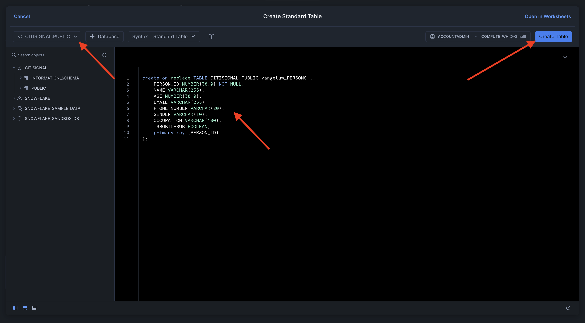

# 3.1.1 Einrichten der Snowflake-Umgebung

## 3.1.1.1 Konto erstellen

Navigieren Sie zu [https://snowflake.com](https://snowflake.com). Klicken Sie **KOSTENLOS STARTEN**.


Geben Sie Ihre Details ein und klicken Sie auf **Weiter**.


Geben Sie Ihre Details ein, wählen Sie Ihren Cloud-Anbieter aus und klicken Sie auf **Erste Schritte**.


Geben Sie Ihre Details ein oder klicken Sie **Überspringen** (2 x).


Sie werden es dann sehen. Überprüfen Sie Ihre E-Mail und klicken Sie auf die Bestätigungs-E-Mail, die an Sie gesendet wurde.


Klicken Sie auf den Link in der Bestätigungs-E-Mail, um Ihr Konto zu aktivieren, definieren Sie Ihren Benutzernamen und Ihr Kennwort. Klicken Sie auf **Get Started**. Sie müssen diesen Benutzernamen und dieses Kennwort in der nächsten Übung verwenden.


Sie werden dann beim Snowflake angemeldet. Klicken Sie **Vorerst überspringen**.


## 3.1.1.2 Datenbank erstellen

Navigieren Sie **Daten > Datenbanken**. Klicken Sie auf **+ Datenbank**.


Verwenden Sie den Namen **CITISIGNAL** für Ihre Datenbank. Klicken Sie **ERSTELLEN**.


## 3.1.1.3 Erstellen von Tabellen

Jetzt können Sie mit der Erstellung Ihrer Tabellen in Snowflake beginnen. Unten finden Sie Skripte, die zum Erstellen Ihrer Tabellen ausgeführt werden.

### Tabelle CK_PERSONS

Klicken Sie auf **+ Erstellen**, dann auf **Tabelle** und anschließend auf **Standard**.


Sie werden es dann sehen. Kopieren Sie die folgende Abfrage und fügen Sie sie in Snowflake ein. Achten Sie darauf, die **CITISIGNAL**-Datenbank in der oberen linken Ecke Ihres Bildschirms auszuwählen, bevor Sie Ihre Tabelle erstellen.

```sql
create or replace TABLE CITISIGNAL.PUBLIC.CK_PERSONS (
	PERSON_ID NUMBER(38,0) NOT NULL,
	NAME VARCHAR(255),
	AGE NUMBER(38,0),
	EMAIL VARCHAR(255),
	PHONE_NUMBER VARCHAR(20),
	GENDER VARCHAR(10),
	OCCUPATION VARCHAR(100),
	ISATTMOBILESUB BOOLEAN,
	primary key (PERSON_ID)
);
```

Klicken Sie **Tabelle erstellen**.



Nach Ausführung des Scripts finden Sie Ihre Tabelle unter **Datenbanken > CITISIGNAL > PUBLIC**.


### Tabelle CK_HOUSEHOLDS

Klicken Sie auf **+ Erstellen**, dann auf **Tabelle** und anschließend auf **Standard**.


Sie werden es dann sehen. Kopieren Sie die folgende Abfrage und fügen Sie sie in Snowflake ein. Achten Sie darauf, die **CITISIGNAL**-Datenbank in der oberen linken Ecke Ihres Bildschirms auszuwählen, bevor Sie Ihre Tabelle erstellen.

```sql
create or replace TABLE CITISIGNAL.PUBLIC.CK_HOUSEHOLDS (
	HOUSEHOLD_ID NUMBER(38,0) NOT NULL,
	ADDRESS VARCHAR(255),
	CITY VARCHAR(100),
	STATE VARCHAR(50),
	POSTAL_CODE VARCHAR(20),
	COUNTRY VARCHAR(100),
	ISELIGIBLEFORFIBER BOOLEAN,
	PRIMARY_PERSON_ID NUMBER(38,0),
	ISFIBREENABLED BOOLEAN,
	primary key (HOUSEHOLD_ID)
);
```

Klicken Sie **Tabelle erstellen**.


Nach Ausführung des Scripts finden Sie Ihre Tabelle unter **Datenbanken > CITISIGNAL > PUBLIC**.


### Tabelle CK_USERS

Klicken Sie auf **+ Erstellen**, dann auf **Tabelle** und anschließend auf **Standard**.


Sie werden es dann sehen. Kopieren Sie die folgende Abfrage und fügen Sie sie in Snowflake ein. Achten Sie darauf, die **CITISIGNAL**-Datenbank in der oberen linken Ecke Ihres Bildschirms auszuwählen, bevor Sie Ihre Tabelle erstellen.

```sql
create or replace TABLE CITISIGNAL.PUBLIC.CK_USERS (
	USER_ID NUMBER(38,0) NOT NULL,
	PERSON_ID NUMBER(38,0),
	HOUSEHOLD_ID NUMBER(38,0),
	primary key (USER_ID),
	foreign key (PERSON_ID) references CITISIGNAL.PUBLIC.CK_PERSONS(PERSON_ID),
	foreign key (HOUSEHOLD_ID) references CITISIGNAL.PUBLIC.CK_HOUSEHOLDS(HOUSEHOLD_ID)
);
```

Klicken Sie **Tabelle erstellen**.


Nach Ausführung des Scripts finden Sie Ihre Tabelle unter **Datenbanken > CITISIGNAL > PUBLIC**.


### Tabelle CK_MONTHLY_DATA_USAGE

Klicken Sie auf **+ Erstellen**, dann auf **Tabelle** und anschließend auf **Standard**.


Sie werden es dann sehen. Kopieren Sie die folgende Abfrage und fügen Sie sie in Snowflake ein. Achten Sie darauf, die **CITISIGNAL**-Datenbank in der oberen linken Ecke Ihres Bildschirms auszuwählen, bevor Sie Ihre Tabelle erstellen.

```sql
create or replace TABLE CITISIGNAL.PUBLIC.CK_MONTHLY_DATA_USAGE (
	USAGE_ID NUMBER(38,0) NOT NULL autoincrement start 1 increment 1 noorder,
	USER_ID NUMBER(38,0),
	MONTH DATE,
	DATA_USAGE_GB NUMBER(10,2),
	primary key (USAGE_ID)
);
```

Klicken Sie **Tabelle erstellen**.


Nach Ausführung des Scripts finden Sie Ihre Tabelle unter **Datenbanken > CITISIGNAL > PUBLIC**.


### Tabelle CK_MOBILE_DATA_USAGE

Klicken Sie auf **+ Erstellen**, dann auf **Tabelle** und anschließend auf **Standard**.


Sie werden es dann sehen. Kopieren Sie die folgende Abfrage und fügen Sie sie in Snowflake ein. Achten Sie darauf, die **CITISIGNAL**-Datenbank in der oberen linken Ecke Ihres Bildschirms auszuwählen, bevor Sie Ihre Tabelle erstellen.


```sql
create or replace TABLE CITISIGNAL.PUBLIC.CK_MOBILE_DATA_USAGE (
	USAGE_ID NUMBER(38,0) NOT NULL autoincrement start 1 increment 1 noorder,
	USER_ID NUMBER(38,0),
	DATE DATE,
	TIME TIME(9),
	APP_NAME VARCHAR(255),
	DATA_USAGE_MB NUMBER(10,2),
	NETWORK_TYPE VARCHAR(50),
	DEVICE_TYPE VARCHAR(50),
	COUNTRY_CODE VARCHAR(10),
	primary key (USAGE_ID)
);
```

Klicken Sie **Tabelle erstellen**.


Nach Ausführung des Scripts finden Sie Ihre Tabelle unter **Datenbanken > CITISIGNAL > PUBLIC**.


Alle Tabellen werden jetzt erstellt.


## 3.1.1.4 Aufnehmen von Beispieldaten

Sie können jetzt mit dem Laden von Beispieldaten in Ihre Datenbank beginnen.

...

Sie haben jetzt das Setup in Snowflake abgeschlossen.


Nächster Schritt: [3.1.2 Erstellen Sie Schemata, Datenmodelle und Links](./ex2.md)

[Zurück zum Modul 3.1](./fac.md)

[Zurück zu „Alle Module“](../../../overview.md)
