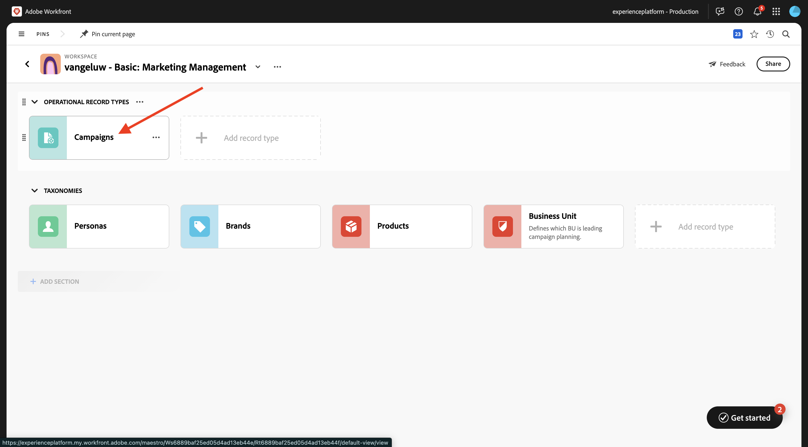
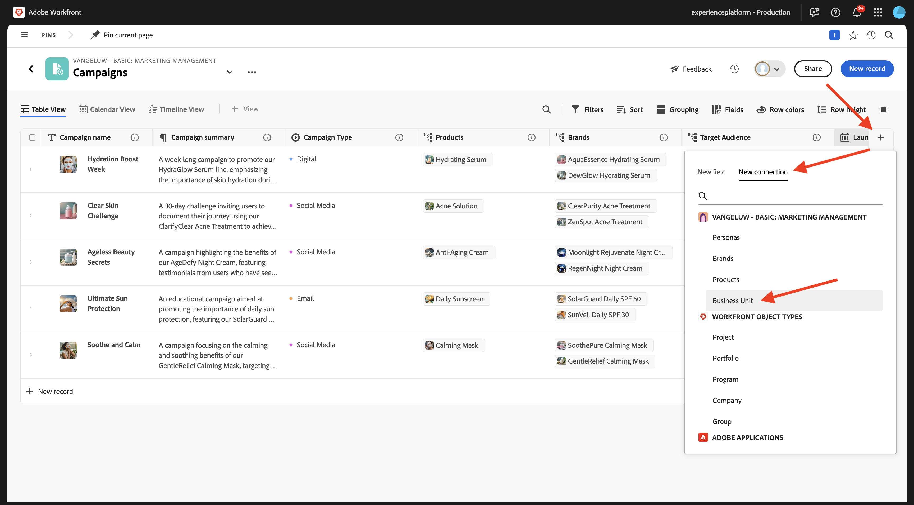
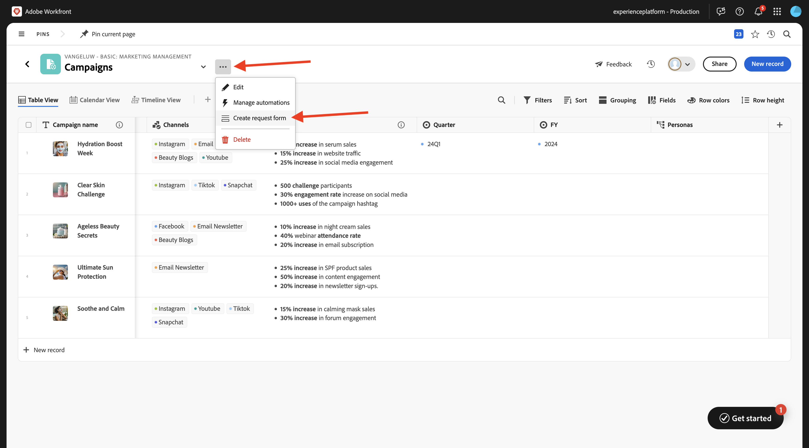
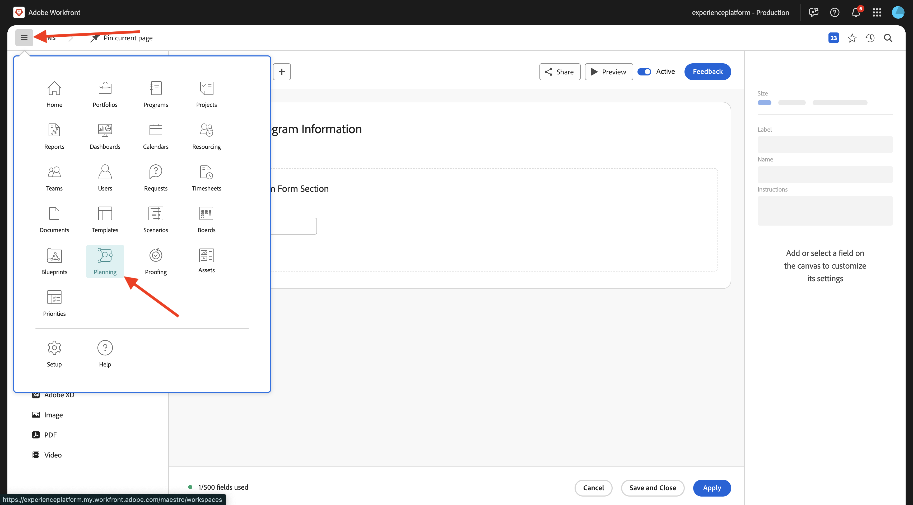
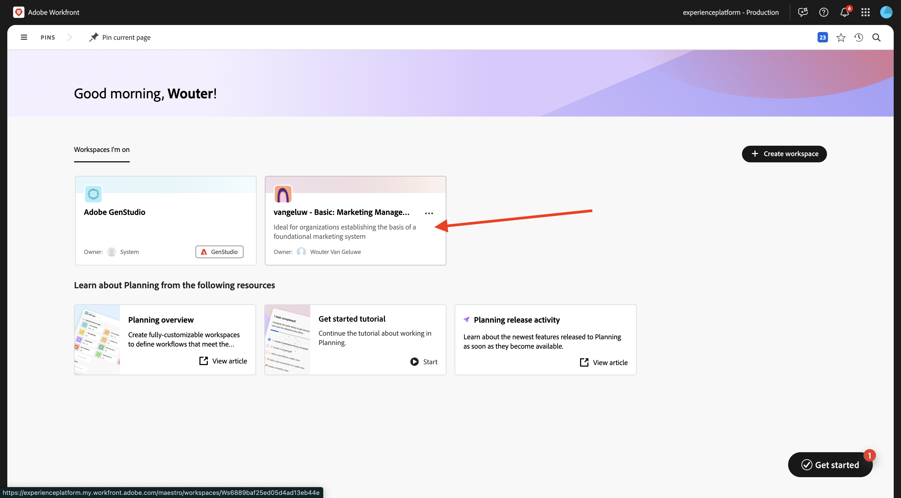

# 1.1.1 Erste Schritte mit Workfront Planning

## 1.1.1.1 Workfront-Planungsterminologie

Im Folgenden finden Sie die wichtigsten Workfront-Planungsobjekte und -konzepte:

| Begriff | Erklärung |
| --- | ---|
| **Workspace** | Eine Sammlung von Datensatztypen, die den Betriebslebenszyklus einer bestimmten Organisation definieren. Ein Arbeitsbereich ist der Arbeitsrahmen einer Organisationseinheit. |
| **Datensatztyp** | Der Name der Objekttypen in Workfront Planning. Datensatztypen befüllen Arbeitsbereiche. Im Gegensatz zum Workfront-Workflow, bei dem die Objekttypen vordefiniert sind, können Sie in Workfront Planning Ihre eigenen Objekttypen erstellen. |
| **Eintrag** | Eine Instanz eines Datensatztyps. |
| **Workspace-Vorlage** | Sie können einen Arbeitsbereich mithilfe vordefinierter Vorlagen erstellen. Sie können die vordefinierten Datensatztypen und Felder in einer Vorlage verwenden oder eigene hinzufügen. |
| **Felder** | Felder sind Attribute, die Sie Datensatztypen hinzufügen können. Felder enthalten Informationen über den Datensatztyp. |

>[!NOTE]
>
>Es gibt Einschränkungen für die Anzahl der Workfront Planning-Objekte, die Sie erstellen können. Weitere Informationen finden Sie unter Übersicht über Adobe Workfront Planning-Objektbeschränkungen .

Sie werden nun praktisch anfangen, einige dieser Objekte selbst zu erstellen.

## 1.1.1.2 Workspace, Datensatztyp, Felder

Navigieren Sie zu [https://experience.adobe.com/](https://experience.adobe.com/){target="_blank"}. Klicken, um **Workfront zu**.


Klicken Sie in Workfront auf , um das Menü zu öffnen, und wählen Sie dann **Planung** aus.


Sie sollten das dann sehen. Klicken Sie **Workspace erstellen**.


Klicken Sie auf **Vorlage verwenden** für die Vorlage **Einfache Marketing-Verwaltung**.


Es wird jetzt ein neuer Arbeitsbereich erstellt. Bevor Sie fortfahren, müssen Sie den Namen des Arbeitsbereichs ändern. Klicken Sie auf die 3 Punkte **…** und wählen Sie **Bearbeiten**.


Ändern Sie den Namen in `--aepUserLdap-- - Basic: Marketing Management`. Klicken Sie auf **Speichern**.


Sie sollten dann diese haben.


## 1.1.1.3-Taxonomien: Datensatztyp und Felder

Klicken **unter &quot;**&quot; auf **+ Datensatztyp hinzufügen** wählen Sie dann **Manuell hinzufügen** aus.


Anschließend sollte das Popup **Datensatztyp hinzufügen** angezeigt werden.


Aktualisieren Sie die folgenden Informationen auf der Registerkarte **Erscheinungsbild**:

- Ersetzen **Nicht benannter Datensatztyp** durch `Business Unit`.
- Beschreibung: `Defines which BU is leading campaign planning.`.
- Wählen Sie eine Farbe und eine Form für das Symbol Ihrer Wahl

Klicken Sie auf **Speichern**.


Klicken Sie, um den neu erstellten Datensatztyp **Geschäftseinheit** zu öffnen.


Es wird jetzt eine leere Tabellenansicht angezeigt, da für den neu erstellten Datensatztyp noch kein Feld definiert wurde.


Klicken Sie auf die Dropdown-Schaltfläche im Feld **Startdatum** und wählen Sie dann **Löschen**.


Wählen Sie **Löschen** aus.


Klicken Sie auf die Dropdown-Schaltfläche im Feld **Enddatum** und wählen Sie dann **Löschen**.


Wählen Sie **Löschen** aus.


Klicken Sie anschließend auf das Symbol **+** , um ein neues Feld hinzuzufügen. Scrollen Sie in der Liste der verfügbaren Feldtypen nach unten und wählen Sie **Personen** aus.


Legen Sie **Name** des Felds auf `Business Unit Lead` fest und legen Sie die Beschreibung des Felds auf `Business Unit Lead responsible for budget and resources (VP, Head).` fest

Klicken Sie auf **Speichern**.


Sie haben jetzt einen neuen Datensatztyp erstellt und sowohl Felder gelöscht als auch erstellt. Kehren Sie zum Workspace-Übersichtsbildschirm zurück, indem Sie auf den Pfeil oben links klicken.


Sie sollten das dann sehen.


## 1.1.1.4 operative Datensatztypen: Felder

Zum Öffnen hier klicken **Kampagnen**.



Klicken Sie auf das Symbol **+** , um ein neues Feld zu erstellen. Wählen Sie **Neue Verbindung** und dann **Personas** aus.



Behalten Sie die Standardeinstellungen bei. Klicken Sie auf **Erstellen**.


Wählen Sie **Überspringen** aus.


Das neue Feld wird dann in der Tabellenansicht angezeigt.


## 1.1.1.5 Erstellen eines Anfrageformulars

Klicken Sie im Bildschirm Kampagnen - Überblick auf die 3 Punkte **…** und wählen Sie dann **Anfrageformular erstellen**.



Ändern Sie den Namen in `Campaign Request Form`. Klicken Sie auf **Speichern**.


In diesem Moment ist es nicht erforderlich, Änderungen am Formular vorzunehmen. Sie werden es ohne Änderungen verwenden. Klicken Sie zunächst auf **Speichern** und dann auf **Veröffentlichen**.


Klicken Sie auf den Pfeil oben links, um zum Bildschirm Forms anfragen zurückzukehren.


Klicken Sie auf den Pfeil oben links, um zum Bildschirm Kampagnen - Übersicht zurückzukehren.


## 1.1.1.6 Senden eines neuen Datensatzes mit dem Anfrageformular

Klicken Sie im Bildschirm Kampagnenübersicht auf **+ Neuer Datensatz**.


Wählen Sie **Anfrage senden** und klicken Sie auf **Weiter**.


`vangeluw - New Campaign Creation Request`

`vangeluw - CitiSignal Fiber Launch`

```
The CitiSignal Fiber Launch campaign introduces CitiSignal’s flagship fiber internet service—CitiSignal Fiber Max—to key residential markets. This campaign is designed to build awareness, drive sign-ups, and establish CitiSignal as the go-to provider for ultra-fast, reliable, and future-ready internet. The campaign will highlight the product’s benefits for remote professionals, online gamers, and smart home families, using persona-driven messaging across digital and physical channels.
```

Klicken Sie **Senden-Anfrage**.


Klicken Sie auf **X**, um das Popup zu schließen.


In der Übersicht sollte dann die neu erstellte Kampagne zu sehen sein.


## Automatisierung 1.1.1.7

Im nächsten Schritt erstellen Sie eine Automatisierung, die Informationen aus der in Workfront Planning erstellten Kampagne übernimmt und diese Informationen in Workfront zum Erstellen eines Programms verwendet. Bevor Sie die Automatisierung erstellen können, müssen Sie in Workfront zunächst zwei Dinge konfigurieren: ein Portfolio und ein benutzerdefiniertes Formular.

Um das Portfolio zu erstellen, öffnen Sie das Menü und klicken Sie auf **Portfolios**.


Klicken Sie auf **+ Neue Portfolio**.


Legen Sie den Namen des Portfolios auf `--aepUserLdap-- - Marketing` fest.


Öffnen Sie anschließend das Menü und klicken Sie auf **Setup**, um das benutzerdefinierte Formular zu erstellen.


Wechseln Sie im linken Menü zu **Benutzerdefinierte Forms**, zu **Forms** und klicken Sie dann auf **+ Neues benutzerdefiniertes Formular**.


Wählen Sie **Programm** aus und klicken Sie auf **Weiter**.


Ändern Sie den Namen des Formulars in `--aepUserLdap-- Program Information`.


Gehen Sie dann zu **Feldbibliothek** und suchen Sie nach `budget`. Ziehen Sie das vorhandene Feld **Budget** auf das Formular.

Klicken Sie auf **Übernehmen**.


Die Konfiguration Ihres benutzerdefinierten Formulars wurde jetzt gespeichert.


## Automatisierung 1.1.1.8

Nachdem das Portfolio und das benutzerdefinierte Formular erstellt wurden, können Sie nun die Automatisierung erstellen.

Klicken Sie, um das Menü zu öffnen, und wählen Sie dann **Planung** aus.



Klicken Sie auf , um den zuvor erstellten Arbeitsbereich mit dem Namen `--aepUserLdap-- - Basic: Marketing Management` zu öffnen.



Zum Öffnen hier klicken **Kampagnen**.


Klicken Sie im Bildschirm Kampagnen - Überblick auf die 3 Punkte **…** und wählen Sie dann **Automatisierungen verwalten**.


Klicken Sie auf **Neue Automatisierung**.


Legen Sie den Namen der Automatisierung auf `Campaign to Program` fest.

Legen Sie die Beschreibung auf `This automation will convert a Planning Campaign record to a Workfront Program.` fest

Klicken Sie auf **Speichern**.


Legen Sie **Aktion** auf **Programm erstellen** fest. Klicken Sie auf **+ Verbundenes Feld hinzufügen**.


Wählen Sie das **Programm-Portfolio**: `--aepUserLdap-- - Marketing`.

Wählen Sie dieses **benutzerdefinierte Formular** aus: `--aepUserLdap-- Program information`.

Klicken Sie auf **Speichern**.


Sie sollten das dann sehen. Klicken Sie auf den Pfeil, um zum Bildschirm Kampagnen - Übersicht zurückzukehren.


Aktivieren Sie das Kontrollkästchen vor der Kampagne, die Sie zuvor erstellt haben. Klicken Sie dann auf die Automatisierung **Kampagne in Programm**.


Nach einigen Sekunden sollte eine Bestätigung angezeigt werden, dass die Automatisierung erfolgreich abgeschlossen wurde. Das bedeutet, dass auf der Grundlage des Campaign-Objekts in Workfront Planning ein Programm in Workfront erstellt wurde.


Um das Programm in Workfront zu überprüfen, öffnen Sie das Menü und klicken Sie auf **Portfolios**.


Öffnen Sie Ihr Portfolio, das den Namen `--aepUserLdap-- - Marketing` erhalten soll.


Navigieren Sie **Programme** und Sie sollten dann das Programm sehen, das gerade von der von Ihnen konfigurierten Automatisierung erstellt wurde.


Nächster Schritt: [1.2.2 TBD](./ex1.md){target="_blank"}

Zurück zu [Einführung in Workfront Planning](./wfplanning.md){target="_blank"}

[Zurück zu „Alle Module“](./../../../overview.md){target="_blank"}
