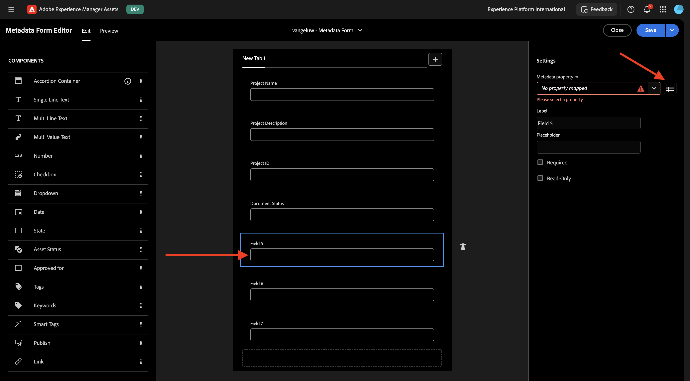
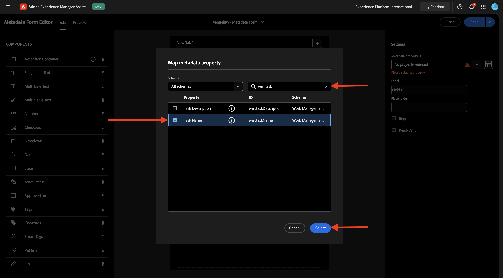

# 1.2.1 Integration von Workfront- und AEM Assets CS-Metadaten

>[!IMPORTANT]
>
>Um diese Übung abzuschließen, benötigen Sie Zugriff auf eine funktionierende AEM Assets CS Author-Umgebung.
>
>Es gibt zwei Optionen:
>
>- Wenn Sie am Workshop zur technischen Aktivierung von GenStudio für CSC teilnehmen, haben Ihre Kursleiter eine AEM Assets CS Author-Umgebung für Sie erstellt. Bitte überprüfen Sie mit ihnen, wie der Name lautet und wie Sie fortfahren.
>
>- Wenn Sie den vollständigen Pfad des Tutorials „One Adobe&quot; befolgen, gehen Sie zu Übung [Adobe Experience Manager Cloud Service und Edge Delivery Services](./../../../modules/asset-mgmt/module2.1/aemcs.md){target="_blank"}. Folgen Sie den Anweisungen dort, und Sie haben Zugriff auf eine solche Umgebung.

>[!IMPORTANT]
>
>Wenn Sie zuvor ein AEM CS-Programm mit einer AEM Assets CS-Umgebung konfiguriert haben, kann es sein, dass Ihre AEM CS-Sandbox in den Ruhezustand versetzt wurde. Da der Ruhezustand einer solchen Sandbox 10-15 Minuten dauert, ist es ratsam, den Ruhezustand jetzt zu beenden, damit Sie nicht zu einem späteren Zeitpunkt warten müssen.

## Terminologie 1.2.1.1 Workfront-Workflows

Im Folgenden finden Sie die wichtigsten Workfront-Objekte und -Konzepte:

| Name | Letzte Aktualisierung |
| ---------------------- | ------------ | 
| Portfolio | Eine Sammlung von Projekten mit einheitlichen Merkmalen. Diese Projekte konkurrieren normalerweise um dieselben Ressourcen, Budgets oder Zeitfenster. |
| Programm | Eine Untergruppe innerhalb eines Portfolios, in der ähnliche Projekte gruppiert werden können, um einen klar definierten Nutzen zu erzielen. |
| Projekt | Ein großer Arbeitsaufwand, der innerhalb eines bestimmten Zeitrahmens abgeschlossen werden muss und ein bestimmtes Budget und eine bestimmte Anzahl von Ressourcen erfordern muss. Um es überschaubar zu machen, unterteilen Sie das Projekt in eine Reihe von Aufgaben. Das Abschließen aller Aufgaben führt zum Abschluss des Projekts. |
| Projektvorlage | Sie können Projektvorlagen verwenden, um die meisten wiederholbaren Prozesse, Informationen und Einstellungen zu erfassen, die mit den Projekten in Ihrer Organisation verbunden sind. Nach dem Erstellen von Vorlagen können Sie sie an vorhandene Projekte anhängen oder zum Erstellen neuer Projekte verwenden. |
| Aufgabe | Eine Aktivität, die als Schritt zum Erreichen eines endgültigen Ziels (Abschluss des Projekts) ausgeführt werden muss. Aufgaben können niemals unabhängig voneinander existieren. Sie sind immer Teil eines Projekts. |
| Zuweisung | Ein Benutzer, ein Aufgabengebiet oder ein Team, das bzw. das einem Problem oder einer Aufgabe zugewiesen ist. Projekte, Portfolios oder Programme dürfen keine Zuweisungen haben. |
| Dokument/Version | Jede Datei, die an ein Objekt in Workfront angehängt ist. Jedes Mal, wenn dasselbe Dokument in dasselbe Objekt hochgeladen wird, wird ihm eine Versionsnummer zugewiesen. Benutzer können mehrere Optionen für eine frühere Version eines Dokuments anzeigen und ändern. |
| Validierung | Für ein bestimmtes Arbeitselement, z. B. eine Aufgabe, ein Dokument oder eine Arbeitszeittabelle, kann es erforderlich sein, dass ein Verantwortlicher oder ein anderer Benutzer das Arbeitselement abzeichnet. Dieser Prozess der Abzeichnung wird als Genehmigung bezeichnet. |

Navigieren Sie zu [https://experience.adobe.com/](https://experience.adobe.com/){target="_blank"}. Klicken, um **Workfront zu**.

Sie werden es dann sehen.

## 1.2.1.1 Konfigurieren der AEM Assets-Integration

Klicken Sie auf **Menü** und wählen Sie dann **Setup** aus.

Scrollen Sie im linken Menü nach unten zu **Dokumente** und klicken Sie dann auf **Experience Manager Assets**. Klicken Sie auf **+ Experience Manager-Integration**.

Verwenden Sie für den Namen Ihrer Integration `--aepUserLdap-- - CitiSignal AEM`.

Öffnen Sie das Dropdown-**&#x200B;** Experience Manager-Repository und wählen Sie Ihre AEM CS-Instanz aus, die `--aepUserLdap-- - CitiSignal` benannt werden soll.

Konfigurieren **unter &quot;**&quot; die folgende Zuordnung:

| Workfront-Feld | Experience Manager Assets-Feld |
| --------------- | ------------------------------ | 
| **Dokument** > **Name** | **wm:documentName** |
| **Projekt** > **Name** | **wm:projectName** |
| **Projekt** > **Beschreibung** | **wm:projectDescription** |
| **Dokumentanforderung** > **Status** | **wm:wm:documentStatus** |
| **Aufgabe** > **Name** | **wm:taskName** |
| **Aufgabe** > **Beschreibung** | **wm:taskDescription** |
| **Projekt** > **ID** | **wm:projectId** |

Aktivieren Sie den Schalter für **Objektmetadaten synchronisieren**.

Klicken Sie auf **Speichern**.

Ihre Integration von Workfront in AEM Assets CS ist jetzt konfiguriert.

## 1.2.1.2 Konfigurieren der Metadatenintegration mit AEM Assets

Als Nächstes müssen Sie AEM Assets CS so konfigurieren, dass die Metadatenfelder aus dem Asset in Workfront für AEM Assets CS freigegeben werden.

Navigieren Sie dazu zu [https://experience.adobe.com/](https://experience.adobe.com/). Auf **Experience Manager Assets**.

Klicken Sie, um Ihre AEM Assets-Umgebung auszuwählen, die `--aepUserLdap-- - CitiSignal dev` benannt werden sollte.

Sie sollten das dann sehen. Wechseln Sie im linken Menü zu **Assets**.

Klicken Sie anschließend auf **Ordner erstellen**.

Benennen Sie den Ordner `--aepUserLdap-- - CitiSignal Fiber Launch Assets` und klicken Sie auf **Erstellen**.

Navigieren Sie dann im linken Menü zu **Metadaten-** Forms) und klicken Sie auf **Erstellen**.

Verwenden Sie den `--aepUserLdap-- - Metadata Form` und klicken Sie auf **Erstellen**.

Fügen Sie 7 neue **Einzeiliger Text**-Felder in das Formular ein und wählen Sie das erste Feld aus. Klicken Sie dann für **erste Feld auf** Schema **neben dem Feld** Metadateneigenschaft“.

Dann sehen Sie dieses Popup. Geben Sie im Suchfeld `wm:project` ein und wählen Sie dann das Feld **Projektname** aus. Klicken Sie auf **Auswählen**.

Ändern Sie die Bezeichnung des Felds in `Project Name`. Klicken Sie auf **Speichern**.

Wechseln Sie zum zweiten Feld und klicken Sie auf das Symbol **Schema** neben dem Feld **Metadateneigenschaft**.

Geben Sie im Suchfeld `wm:project` ein und wählen Sie dann das Feld **Projektbeschreibung** aus. Klicken Sie auf **Auswählen**.

Ändern Sie die Bezeichnung des Felds in `Project Description`.

Wählen Sie als Nächstes das dritte Feld aus und klicken Sie erneut auf **Schema** neben dem Feld **Metadateneigenschaft** .

Anschließend wird dieses Popup erneut angezeigt. Geben Sie im Suchfeld `wm:project` ein und wählen Sie dann das Feld **Projekt-ID** aus. Klicken Sie auf **Auswählen**.

Ändern Sie die Bezeichnung des Felds in `Project ID`.

Wählen Sie als Nächstes das vierte Feld aus und klicken Sie erneut auf **Schema** neben dem Feld **Metadateneigenschaft** .

Anschließend wird dieses Popup erneut angezeigt. Geben Sie im Suchfeld `wm:document` ein und wählen Sie dann das Feld **Projekt-ID** aus. Klicken Sie auf **Auswählen**.

Ändern Sie die Bezeichnung des Felds in `Document Status`.

Wählen Sie als Nächstes das fünfte Feld aus und klicken Sie erneut auf **Schema** neben dem Feld **Metadateneigenschaft** .

Anschließend wird dieses Popup erneut angezeigt. Geben Sie im Suchfeld `wm:document` ein und wählen Sie dann das Feld **Projekt-ID** aus. Klicken Sie auf **Auswählen**.

Ändern Sie die Bezeichnung des Felds in `Document Name`.

Wählen Sie als Nächstes das sechste Feld aus und klicken Sie erneut auf **Schema** neben dem Feld **Metadateneigenschaft** .

Anschließend wird dieses Popup erneut angezeigt. Geben Sie im Suchfeld `wm:task` ein und wählen Sie dann das Feld **Aufgabenname** aus. Klicken Sie auf **Auswählen**.

Ändern Sie die Bezeichnung des Felds in `Task Name`.

Wählen Sie als Nächstes das siebte Feld aus und klicken Sie erneut auf **Schema**-Symbol neben dem Feld **Metadateneigenschaft**.

Anschließend wird dieses Popup erneut angezeigt. Geben Sie im Suchfeld `wm:task` ein und wählen Sie dann das Feld **Aufgabenbeschreibung** aus. Klicken Sie auf **Auswählen**.

Ändern Sie die Bezeichnung des Felds in `Task Description`.

Ändern Sie den **Registerkartennamen** im Formular in `--aepUserLdap-- - Workfront Metadata`.

Klicken Sie auf **Speichern** und **Schließen**.

Ihr **Metadatenformular** ist jetzt konfiguriert.

Als Nächstes müssen Sie das Metadatenformular dem Ordner zuweisen, den Sie zuvor erstellt haben. Aktivieren Sie das Kontrollkästchen für Ihr Metadatenformular und klicken Sie auf **Ordner zuweisen**.

Wählen Sie den Ordner aus, der `--aepUserLdap-- - CitiSignal Fiber Launch Assets` benannt werden soll. Klicken Sie **Zuweisen**.

Das Metadatenformular wurde jetzt erfolgreich Ihrem Ordner zugewiesen.

Nächster Schritt: [1.2.2 Proofing mit Workfront](./ex2.md){target="_blank"}

Zurück zu [Workflow-Verwaltung mit Adobe Workfront](./workfront.md){target="_blank"}

[Zurück zu „Alle Module“](./../../../overview.md){target="_blank"}
