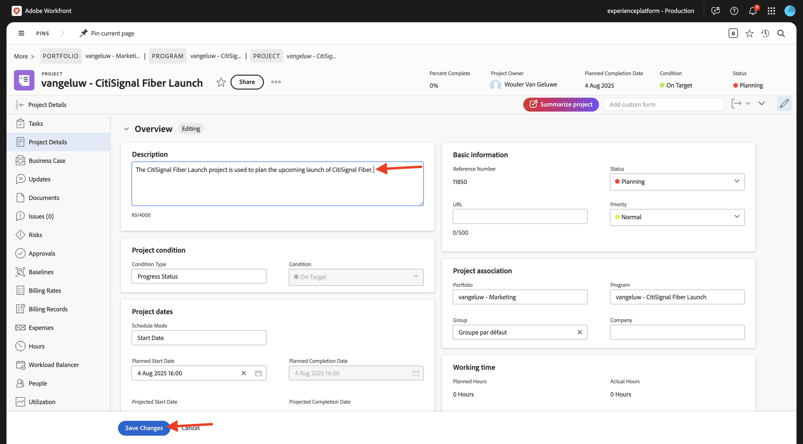
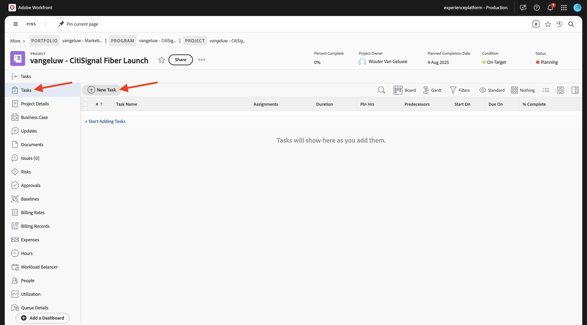
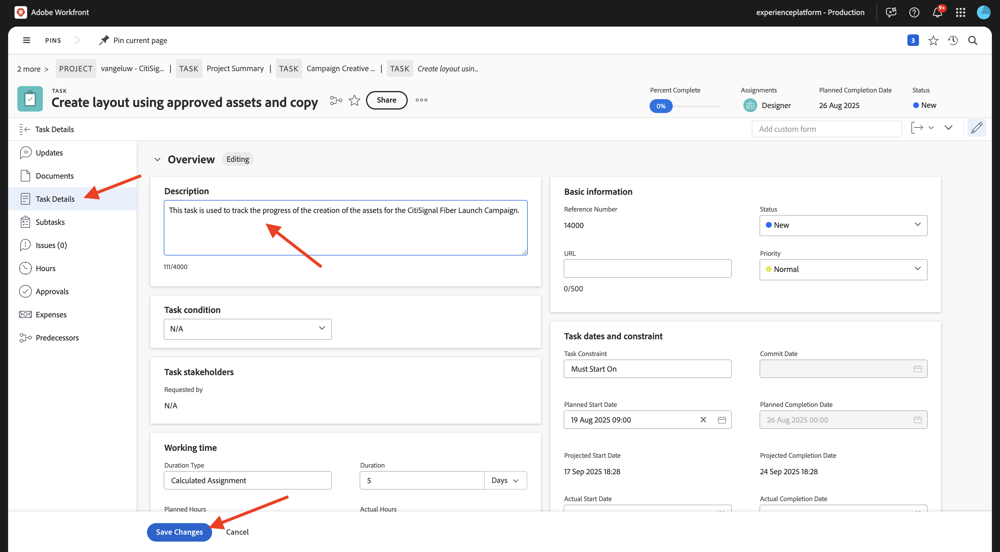
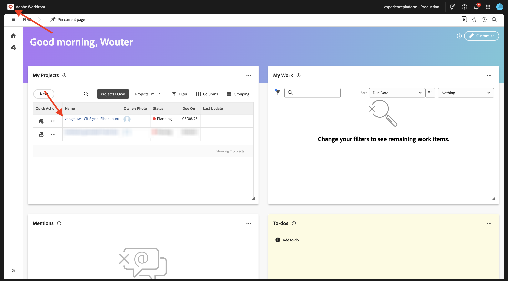
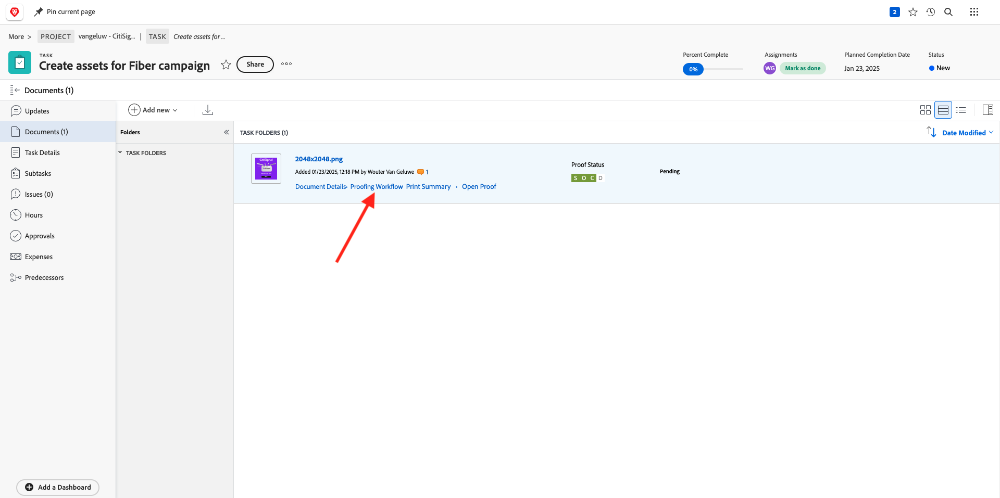
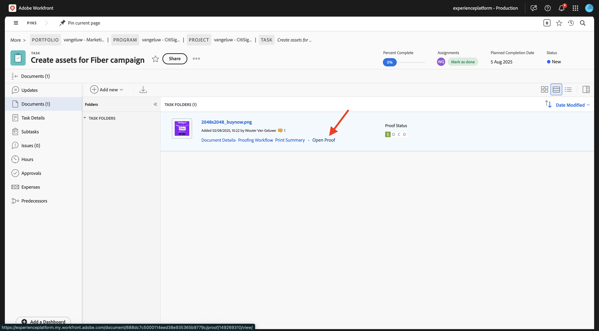
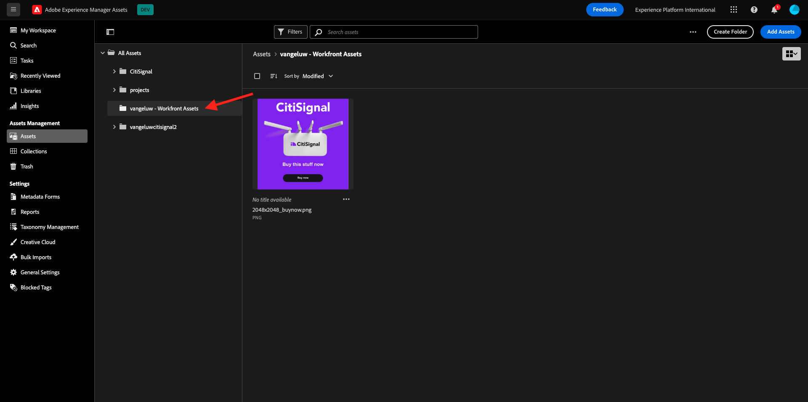

# 1.2.2 Proofing mit Workfront

>[!IMPORTANT]
>
>Wenn Sie zuvor ein AEM CS-Programm mit einer AEM Assets CS-Umgebung konfiguriert haben, kann es sein, dass Ihre AEM CS-Sandbox in den Ruhezustand versetzt wurde. Da der Ruhezustand einer solchen Sandbox 10-15 Minuten dauert, ist es ratsam, den Ruhezustand jetzt zu beenden, damit Sie nicht zu einem späteren Zeitpunkt warten müssen.

## 1.2.2.1 Erstellen eines neuen Genehmigungsflusses

Zurück zu **Adobe Workfront**. Klicken Sie auf **Menü** und wählen Sie **Proofing** aus.

Gehen Sie zu **Workflows**, klicken Sie auf **+ Neu** und wählen Sie dann **Neue Vorlage**.

Legen Sie den **Vorlagennamen** auf `--aepUserLdap-- - Approval Workflow` fest und legen Sie den **Vorlagenbesitzer** auf sich selbst fest.

Scrollen Sie nach unten und fügen Sie sich unter **Schritte** > **Schritt 1** mit der **Rolle** von **Prüfer und Genehmiger** hinzu.

Klicken Sie auf **Erstellen**.

Ihr einfacher Genehmigungs-Workflow kann jetzt verwendet werden.

## 1.2.2.2 Neues Projekt erstellen

Öffnen Sie das **Menü** und navigieren Sie zu **Programme**.

Klicken Sie auf , um das zuvor erstellte Programm mit dem Namen `--aepUserLdap-- CitiSignal Fiber Launch` anzuzeigen.

>[!NOTE]
>
>Sie haben im Rahmen der Übung zu [Workfront Planning](./../module1.1/ex1.md) mit der von Ihnen erstellten und ausgeführten Automatisierung ein Programm erstellt. Wenn ihr das noch nicht getan habt, könnt ihr die Anleitung dort finden.

Navigieren Sie in Ihrem Programm zu **Projekte**. Klicken Sie auf **+ Neues Projekt** und wählen Sie dann **Neues Projekt** aus.

Sie sollten das dann sehen. Ändern Sie den Namen in `--aepUserLdap-- - CitiSignal Fiber Launch`.

Gehen Sie zu **Projektdetails**. Klicken Sie auf **+** unter **Beschreibung**.

Legen Sie die Beschreibung auf `The CitiSignal Fiber Launch project is used to plan the upcoming launch of CitiSignal Fiber.` fest

Klicken Sie **Änderungen speichern**.

Ihr Projekt ist jetzt erstellt.

## 1.2.2.3 Neue Aufgabe erstellen

Navigieren Sie zu **Aufgaben** und klicken Sie auf **+ Neue Aufgabe**.

Geben Sie diesen Namen für Ihre Aufgabe ein: `Create assets for Fiber campaign`.

Legen Sie das Feld **Beschreibung** wie folgt fest: `This task is used to track the progress of the creation of the assets for the CitiSignal Fiber Launch Campaign.`

Klicken Sie **Aufgabe erstellen**.

Sie sollten das dann sehen.

Fügen Sie in der Spalte **Zuweisung** Ihren eigenen Namen hinzu.

Die Aufgabe wird dann Ihnen zugewiesen.

## 1.2.2.4 Ein neues Dokument zu Ihrer Aufgabe hinzufügen, durchlaufen Sie den Genehmigungsfluss

Klicken Sie auf das Workfront **-Logo von**, um zur Übersichtsseite zurückzukehren. Anschließend sollte das soeben erstellte Projekt in der Übersicht angezeigt werden. Klicken Sie auf das Projekt, um es zu öffnen.

Klicken **in &quot;**&quot;, um die Aufgabe zu öffnen.

Navigieren Sie zu **Dokumente**. Klicken Sie auf **+ Neu hinzufügen** wählen Sie dann **Dokument** aus.

Laden Sie [diese Datei](./images/2048x2048.png) auf Ihren Desktop herunter.

{width="50px" align="left"}

Wählen Sie die Datei **2048x2048.png** aus und klicken Sie auf **Öffnen**.

Sie sollten dann diese haben. Bewegen Sie den Mauszeiger über das hochgeladene Dokument. Klicken Sie **Korrekturabzug erstellen** und wählen Sie dann **Erweiterter Korrekturabzug**.

Wählen Sie im Fenster **Neuer Korrekturabzug** die Option **Automatisiert** und wählen Sie dann die zuvor erstellte Workflow-Vorlage aus, die `--aepUserLdap-- - Approval Workflow` benannt werden soll. Klicken Sie **Korrekturabzug erstellen**.

Klicken Sie **Bearbeiten**.

Klicken Sie **Korrekturabzug öffnen**

Sie können den Korrekturabzug jetzt überprüfen. Wählen Sie **Kommentar hinzufügen** aus, um eine Anmerkung hinzuzufügen, für die das Dokument geändert werden muss.

Geben Sie Ihren Kommentar ein und klicken Sie auf **Posten**. Klicken Sie auf **Schließen**.

Als Nächstes müssen Sie Ihre Rolle von &quot;**&quot; in &quot;** und **&quot;**. Gehen Sie dazu zurück zu Ihrer Aufgabe und klicken Sie auf **Proofing-Workflow**.

Ändern Sie Ihre Rolle von **Prüfer** in **Prüfer und Genehmiger**.

Kehren Sie zu Ihrer Aufgabe zurück und öffnen Sie den Korrekturabzug erneut. Jetzt sehen Sie eine neue Schaltfläche **Entscheidung treffen**. Klicken Sie darauf.

Wählen Sie **Änderungen erforderlich** und klicken Sie auf **Entscheidung treffen**.

Gehen Sie zurück zu Ihrer **Aufgabe** und dem **Dokument**. Sie müssen jetzt ein zweites Bild hochladen, das die angegebenen Kommentare berücksichtigt.

Laden Sie [diese Datei](./images/2048x2048_buynow.png) auf Ihren Desktop herunter.

{width="50px" align="left"}

Wählen Sie in Ihrer Aufgabenansicht die alte Bilddatei aus, die nicht genehmigt wurde. Klicken Sie dann auf **+ Neu hinzufügen** wählen Sie **Version** und dann **Dokument** aus.

Wählen Sie die Datei **2048x2048_buynow.png** und klicken Sie auf **Öffnen**.

Sie sollten dann diese haben. Klicken Sie **Korrekturabzug erstellen** und wählen Sie dann erneut **Erweiterter** aus.

Sie werden es dann sehen. Die **Workflow-Vorlage** ist jetzt vorausgewählt, da Workfront davon ausgeht, dass der vorherige Genehmigungs-Workflow weiterhin gültig ist. Klicken Sie **Korrekturabzug erstellen**.

Wählen Sie **Korrekturabzug öffnen** aus.

Sie können nun zwei Versionen der Datei nebeneinander sehen.

Klicken Sie **Entscheidung treffen**, wählen Sie **Genehmigt** und klicken Sie erneut **Entscheidung treffen**.

Klicken Sie auf **Aufgabenname**, um zur Aufgabenübersicht zurückzukehren.

Sie werden dann mit einem genehmigten Asset wieder in Ihrer Aufgabenansicht angezeigt. Dieses Asset muss jetzt für AEM Assets freigegeben werden.

Wählen Sie das genehmigte Dokument aus. Klicken Sie auf das **Freigabe** Pfeilsymbol und wählen Sie Ihre AEM Assets-Integration aus, die `--aepUserLdap-- - CitiSignal AEM` benannt werden soll.

Doppelklicken Sie auf den zuvor erstellten Ordner, der `--aepUserLdap-- - CitiSignal Fiber Launch Assets` benannt werden soll.

Klicken Sie **Ordner auswählen**.

Nach 1-2 Minuten wird Ihr Dokument jetzt in AEM Assets veröffentlicht. Neben Ihrem Dokumentnamen wird ein AEM-Symbol angezeigt.

## 1.2.2.5 Datei in AEM Assets anzeigen

Navigieren Sie zu Ihrem Ordner in AEM Assets CS mit dem Namen `--aepUserLdap-- - CitiSignal Fiber Launch Assets`.

Wählen Sie das Bild aus und klicken Sie auf **Details**.

Anschließend sehen Sie das zuvor erstellte Metadatenformular mit den Werten, die automatisch durch die Integration zwischen Workfront und AEM Assets ausgefüllt wurden.

Zurück zu [Workflow-Verwaltung mit Adobe Workfront](./workfront.md){target="_blank"}

[Zurück zu „Alle Module“](./../../../overview.md){target="_blank"}
