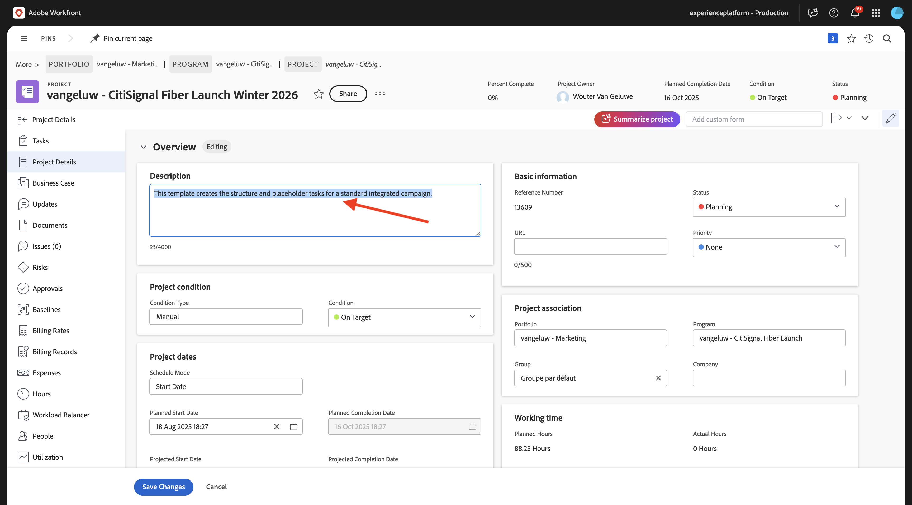
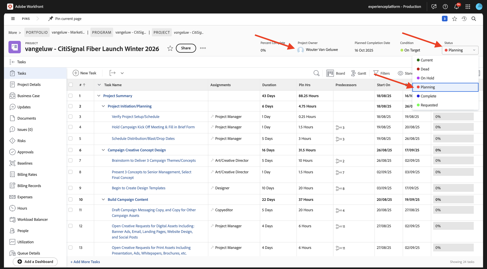
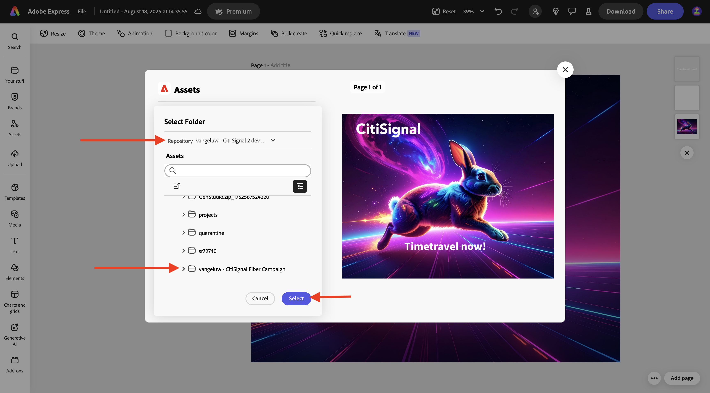
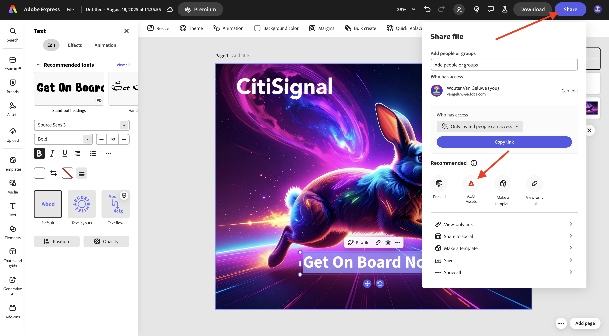
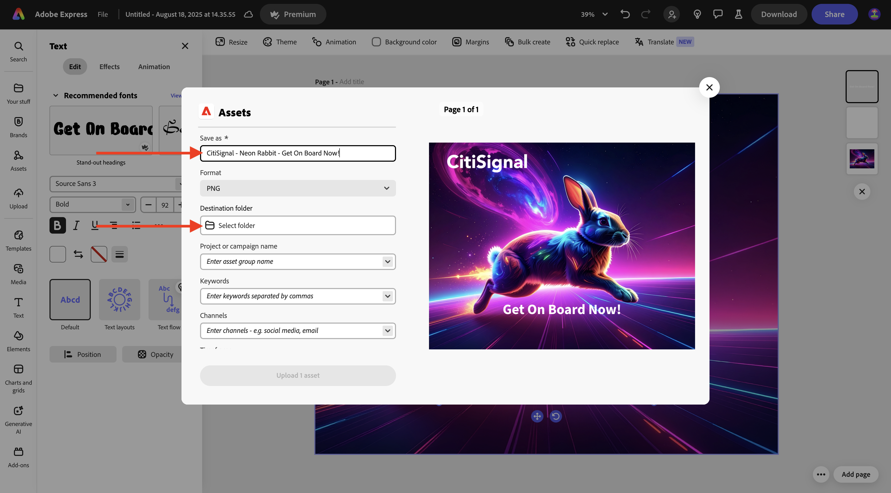

# 1.2.2 Proofing mit Workfront

>[!IMPORTANT]
>
>Wenn Sie zuvor ein AEM CS-Programm mit einer AEM Assets CS-Umgebung konfiguriert haben, kann es sein, dass Ihre AEM CS-Sandbox in den Ruhezustand versetzt wurde. Da der Ruhezustand einer solchen Sandbox 10-15 Minuten dauert, ist es ratsam, den Ruhezustand jetzt zu beenden, damit Sie nicht zu einem späteren Zeitpunkt warten müssen.

## 1.2.2.1 Erstellen eines neuen Genehmigungsflusses

Zurück zu **Adobe Workfront**. Klicken Sie auf **Menü** und wählen Sie **Proofing** aus.

Gehen Sie zu **Workflows**, klicken Sie auf **+ Neu** und wählen Sie dann **Neue Vorlage**.

Legen Sie den **Vorlagennamen** auf `--aepUserLdap-- - Approval Workflow` fest und legen Sie den **Vorlagenbesitzer** auf sich selbst fest.

Scrollen Sie nach unten und ändern Sie unter **Schritte** > **Schritt 1** die Rolle **Korrekturabzugsersteller** in **Prüfende und genehmigende Person**. Sie können auch jede andere Person hinzufügen. Fügen Sie sich beispielsweise selbst hinzu, indem Sie Ihre Benutzerin bzw. Ihren Benutzer auswählen und die **Rolle** von **Prüfende und genehmigende Person** festlegen.

Klicken Sie auf **Erstellen**.

Ihr einfacher Genehmigungs-Workflow kann jetzt verwendet werden.

## 1.2.2.2 Workfront Blueprint aktivieren

Im nächsten Schritt erstellen Sie ein neues Projekt mithilfe einer Vorlage. Adobe Workfront stellt eine Reihe verfügbarer Blueprints bereit, die nur aktiviert werden müssen.

Für den Anwendungsfall von CitiSignal ist die Blueprint **Integrierte Kampagnenausführung** zu verwenden.

Um diese Blueprint zu installieren, öffnen Sie das Menü und wählen Sie **Blueprints**.

Wählen Sie den Filter **Marketing** und scrollen Sie dann nach unten, um den Blueprint **Integrierte Kampagnenausführung** zu finden. Klicken Sie auf **Installieren**.

Klicken Sie auf **Fortfahren**.

Klicken Sie **Unverändert installieren…**.

Sie sollten das dann sehen. Die Installation kann einige Minuten dauern.

Nach einigen Minuten wird die Blueprint installiert.

## 1.2.2.3 Neues Projekt erstellen

Öffnen Sie das **Menü** und navigieren Sie zu **Programme**.

Klicken Sie auf , um das zuvor erstellte Programm mit dem Namen `--aepUserLdap-- CitiSignal Fiber Launch` anzuzeigen.

>[!NOTE]
>
>Sie haben im Rahmen der Übung zu [Workfront Planning](./../module1.1/ex1.md) mit der von Ihnen erstellten und ausgeführten Automatisierung ein Programm erstellt. Wenn ihr das noch nicht getan habt, könnt ihr die Anleitung dort finden.

Navigieren Sie in Ihrem Programm zu **Projekte**. Klicken Sie auf **+ Neues Projekt** und wählen Sie dann **Neues Projekt aus Vorlage**.

Wählen Sie die Vorlage **Integrierte Kampagnenausführung** und klicken Sie auf **Vorlage verwenden**.

Sie sollten das dann sehen. Ändern Sie den Namen in `--aepUserLdap-- - CitiSignal Fiber Launch Winter 2026` und klicken Sie auf **Projekt erstellen**.

Ihr Projekt ist jetzt erstellt. Gehen Sie zu **Projektdetails**.

Gehen Sie zu **Projektdetails**. Klicken Sie, um den aktuellen Text unter **Beschreibung** auszuwählen.

Legen Sie die Beschreibung auf `The CitiSignal Fiber Launch project is used to plan the upcoming launch of CitiSignal Fiber.` fest

Klicken Sie **Änderungen speichern**.

Ihr Projekt kann jetzt verwendet werden.

Die Aufgaben und Abhängigkeiten im Projekt wurden auf der Grundlage der von Ihnen ausgewählten Vorlage erstellt und als festgelegt. Projektbesitzer. Der Status des Projekts wurde auf &quot;**&quot;**. Sie können den Status des Projekts ändern, indem Sie einen anderen Wert in der Liste auswählen.

## 1.2.2.4 Neue Aufgabe erstellen

Bewegen Sie den Mauszeiger über die Aufgabe **Beginnen Sie mit dem Erstellen von Design** Vorlagen und klicken Sie auf die 3 Punkte **…**.

Wählen Sie die Option **Aufgabe unten einfügen**.

Geben Sie diesen Namen für Ihre Aufgabe ein: `Create layout using approved assets and copy`.

Legen Sie das Feld **Arbeitsaufträge** auf die Rolle **Designer** fest.
Legen Sie das Feld **Dauer** auf **5 Tage** fest.
Setzen Sie den Vorgänger des Feldes auf **9**.
Geben Sie ein Datum für die Felder **Start am** und **Fällig am** ein.

Klicken Sie auf eine andere Stelle im Bildschirm, um die neue Aufgabe zu speichern.

Sie sollten das dann sehen. Klicken Sie auf die Aufgabe, um sie zu öffnen.

Gehen Sie zu **Aufgabendetails** und legen Sie das Feld **Beschreibung** auf: `This task is used to track the progress of the creation of the assets for the CitiSignal Fiber Launch Campaign.`

Klicken Sie **Änderungen speichern**.

Sie sollten das dann sehen. Klicken Sie auf das **Projekt**, um zu Ihrem Projekt zurückzukehren.

Wechseln Sie in **Projekt** Ansicht zu **Workload-Balancer**.

Klicken Sie **Massenzuweisungen**.

Wählen Sie die **Rollenzuweisung** von **Designer** und klicken Sie dann auf das Feld **Zu zuweisender Benutzer**. Dadurch werden alle Benutzenden angezeigt, die in Ihrer Workfront-Instanz über eine **Designer**-Rolle verfügen. Wählen Sie in diesem Fall die fiktive Benutzerin **Melissa Jenkins**.

Klicken Sie **Zuweisen**. Der ausgewählte Benutzer wird nun den Aufgaben im Projekt zugewiesen, die mit der Rolle **Designer** verknüpft sind.

Die Aufgaben sind jetzt zugewiesen. Klicken Sie auf **Aufgaben**, um zur Übersichtsseite **Aufgaben** zurückzukehren.

Klicken Sie auf die erstellte Aufgabe mit dem Namen .
**Erstellen eines Layouts mit genehmigten Assets und Kopieren**.

Sie werden nun im Rahmen dieser Übung mit der Arbeit an dieser Aufgabe beginnen. Sie können sehen, dass Melissa Jenkins im Moment mit dieser Aufgabe betraut ist. Um dies für sich selbst zu ändern, klicken Sie auf das Feld **Arbeitsaufträge** und wählen Sie **Mir zuweisen** aus.

Klicken Sie auf **Speichern**.

Klicken Sie **Bearbeiten**.

Sie sollten das dann sehen.

Im Rahmen dieser Aufgabe müssen Sie ein neues Bild erstellen und es dann als Dokument in Workfront hochladen. Sie erstellen dieses Asset jetzt selbst mit Adobe Express.

## 1.2.2.5 Erstellen von Assets mit Adobe Firely Services und Adobe Express

Navigieren Sie zu [https://firefly.adobe.com/](https://firefly.adobe.com/){target="_blank"}. Geben Sie den `a neon rabbit running very fast through space` ein und klicken Sie auf **Generieren**.

Anschließend werden mehrere Bilder generiert. Wählen Sie das Bild aus, das Ihnen am besten gefällt, klicken Sie auf das Symbol **Freigeben** auf dem Bild und wählen Sie dann **In Adobe Express öffnen**.

Anschließend wird das soeben generierte Bild in Adobe Express zur Bearbeitung verfügbar. Jetzt müssen Sie das CitiSignal-Logo auf dem Bild hinzufügen. Navigieren Sie dazu zu **Marken**.

Anschließend sollte eine CitiSignal-Markenvorlage angezeigt werden. die in GenStudio for Performance Marketing erstellt wurden, erscheinen in Adobe Express. Klicken Sie, um eine Markenvorlage auszuwählen, deren Name `CitiSignal` enthält.

Gehen Sie zu **Logos** und klicken Sie auf das **weiß** Citisignal-Logo, um es auf dem Bild abzulegen.

Positionieren Sie das CitiSignal-Logo oben auf Ihrem Bild, nicht zu weit von der Mitte entfernt.

Navigieren Sie zu **Text**.

Klicken Sie **Text hinzufügen**.

Geben Sie die `Timetravel now!` ein, ändern Sie die Schriftfarbe und Schriftgröße, legen Sie den Text auf **Fett** fest, sodass Sie ein Bild wie dieses haben.

Klicken Sie anschließend auf **Freigeben**.

**AEM Assets**.

Ändern Sie den Dateinamen in `CitiSignal - Neon Rabbit - Timetravel now!`.
Klicken Sie **Ordner auswählen**.

Wählen Sie Ihr AEM Assets CS-Repository mit dem Namen `--aepUserLdap-- - CitiSignal` und dann die `--aepUserLdap-- - CitiSignal Fiber Campaign` aus. Klicken Sie auf **Auswählen**.

Sie sollten das dann sehen. Klicken Sie **1 Asset hochladen**. Ihr Bild wird jetzt in AEM Assets CS hochgeladen.

## 1.2.2.6 Ein neues Dokument zu Ihrer Aufgabe hinzufügen und den Genehmigungsfluss starten

Kehren Sie zum Bildschirm **Aufgabendetails** zurück. Navigieren Sie zu **Dokumente**. Klicken Sie auf **+ Neu hinzufügen** wählen Sie dann Ihr AEM Assets CS-Repository aus, das `--aepUserLdap-- - CitiSignal` benannt werden soll.

Doppelklicken Sie, um die `--aepUserLdap-- CitiSignal Fiber Campaign` zu öffnen.

Wählen Sie die Datei aus, die Sie im vorherigen Schritt erstellt haben. Sie heißt **CitiSignal - Neon Rabbit - Timetravel Now!PNG**. Klicken Sie auf **Auswählen**.

{width="50px" align="left"}

Sie sollten dann diese haben. Bewegen Sie den Mauszeiger über das hochgeladene Dokument. Klicken Sie **Korrekturabzug erstellen** und wählen Sie dann **Erweiterter Korrekturabzug**.

Wählen Sie im Fenster **Neuer Korrekturabzug** die Option **Automatisiert** und wählen Sie dann die zuvor erstellte Workflow-Vorlage aus, die `--aepUserLdap-- - Approval Workflow` benannt werden soll. Klicken Sie **Korrekturabzug erstellen**.

Klicken Sie **Korrekturabzug öffnen**

Sie können den Korrekturabzug jetzt überprüfen. Wählen Sie **Kommentar hinzufügen** aus, um eine Anmerkung hinzuzufügen, für die das Dokument geändert werden muss.

Geben Sie Ihren Kommentar ein und klicken Sie auf **Posten**. Klicken Sie anschließend auf **Entscheidung treffen**.

Wählen Sie **Änderungen erforderlich** und klicken Sie auf **Entscheidung treffen**.

Gehen Sie zurück zu Ihrer **Aufgabe** und dem **Dokument**. Dort wird auch der Text **Änderungen erforderlich** angezeigt.

Jetzt müssen Sie Design-Änderungen vornehmen, was Sie in Adobe Express tun werden.

## 1.2.2.7 Vornehmen von Design-Änderungen in Adobe Express

Wechseln Sie zu [https://new.express.adobe.com/your-stuff/files](https://new.express.adobe.com/your-stuff/files) und öffnen Sie das zuvor erstellte Bild erneut.

Ändern Sie den CTA-Text in `Get On Board Now!`.

Klicken Sie auf **Freigeben** und wählen Sie dann **AEM Assets** aus.

Geben Sie den `CitiSignal - Neon Rabbit - Get On Board Now!` ein und klicken Sie dann auf **Ordner auswählen**, um einen Zielordner auszuwählen.

Wählen Sie Ihr AEM Assets CS-Repository mit dem Namen `--aepUserLdap-- - CitiSignal` und dann die `--aepUserLdap-- - CitiSignal Fiber Campaign` aus. Klicken Sie auf **Auswählen**.

Klicken Sie auf **1 Asset hochladen**.

Ihr neues Asset wird jetzt in AEM Assets erstellt und gespeichert.

## 1.2.2.8 Neue Version des Dokuments zu Ihrer Aufgabe hinzufügen

Wählen Sie in Ihrer Aufgabenansicht in Adobe Workfront die alte Bilddatei aus, die nicht genehmigt wurde. Klicken Sie dann auf **+ Neu hinzufügen**, wählen Sie **Version** und wählen Sie dann Ihr AEM Assets CS-Repository aus, das `--aepUserLdap-- - CitiSignal` benannt werden soll.

Navigieren Sie zur `--aepUserLdap-- CitiSignal Fiber Campaign` und wählen Sie die `CitiSignal - Neon Rabit - Get On Board Now!.png` aus. Klicken Sie auf **Auswählen**.

Sie sollten dann diese haben. Klicken Sie **Korrekturabzug erstellen** und wählen Sie dann erneut **Erweiterter** aus.

Sie werden es dann sehen. Die **Workflow-Vorlage** ist jetzt vorausgewählt, da Workfront davon ausgeht, dass der vorherige Genehmigungs-Workflow weiterhin gültig ist. Klicken Sie **Korrekturabzug erstellen**.

Wählen Sie **Korrekturabzug öffnen** aus.

Sie können nun zwei Versionen der Datei nebeneinander sehen. Klicken Sie auf die **Korrekturabzüge vergleichen**.

Anschließend sollten beide Versionen des Bildes nebeneinander angezeigt werden. Klicken Sie **Entscheidung treffen**.

Wählen Sie **Genehmigt** und klicken Sie erneut **Entscheidung**.

Schließen Sie die Ansicht **Korrekturabzüge vergleichen**, indem Sie die linke Version des Bildes schließen. Klicken Sie auf **Aufgabenname**, um zur Aufgabenübersicht zurückzukehren.

Sie werden dann mit einem genehmigten Asset wieder in Ihrer Aufgabenansicht angezeigt. Dieses Asset muss jetzt für AEM Assets freigegeben werden.

Wählen Sie das genehmigte Dokument aus. Klicken Sie auf das **Freigabe** Pfeilsymbol und wählen Sie Ihre AEM Assets-Integration aus, die `--aepUserLdap-- - CitiSignal AEM` benannt werden soll.

Doppelklicken Sie auf den zuvor erstellten Ordner, der `--aepUserLdap-- - CitiSignal Fiber Launch Assets` benannt werden soll.

Klicken Sie **Ordner auswählen**.

Nach 1-2 Minuten wird Ihr Dokument jetzt in AEM Assets veröffentlicht. Neben Ihrem Dokumentnamen wird ein AEM-Symbol angezeigt.

Klicken Sie **Als erledigt markieren**, um diese Aufgabe abzuschließen.

Sie sollten das dann sehen.

## 1.2.2.9 Datei in AEM Assets anzeigen

Navigieren Sie zu Ihrem Ordner in AEM Assets CS mit dem Namen `--aepUserLdap-- - CitiSignal Fiber Launch Assets`.

Wählen Sie das Bild aus und klicken Sie auf **Details**.

Anschließend sehen Sie das zuvor erstellte Metadatenformular mit den Werten, die automatisch durch die Integration zwischen Workfront und AEM Assets ausgefüllt wurden.

Zurück zu [Workflow-Verwaltung mit Adobe Workfront](./workfront.md){target="_blank"}

[Zurück zu „Alle Module“](./../../../overview.md){target="_blank"}
