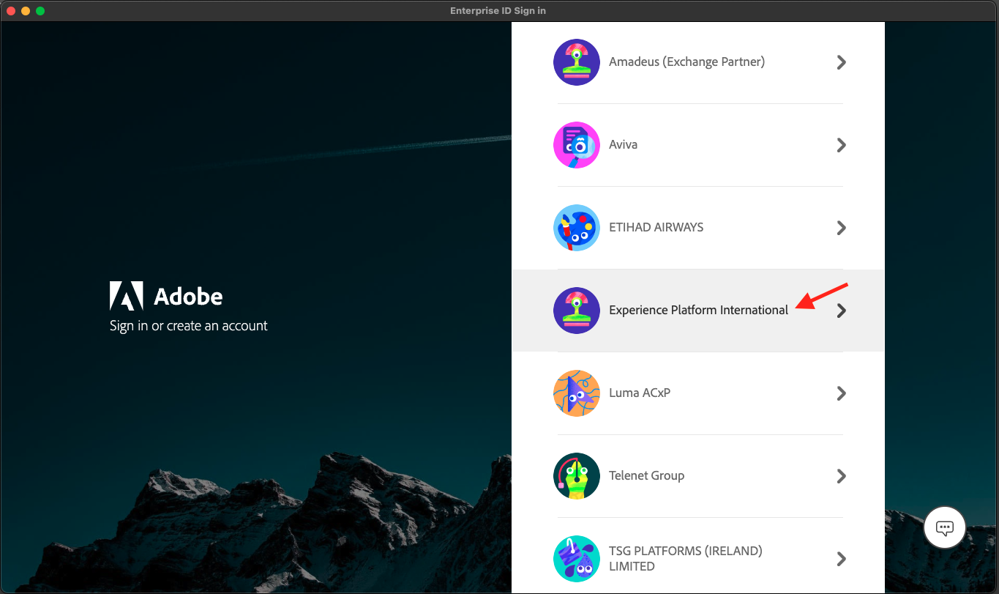
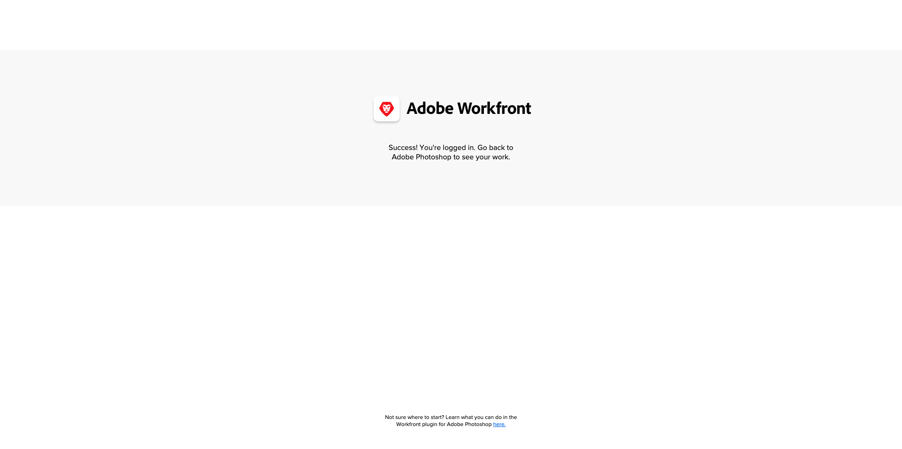

# 1.2.5 Photoshop- und Workfront-Plug-in einrichten

## Plug-in 1.2.5.1 Installieren von Workfront für Photoshop

Um die Integration zwischen Workfront und Photoshop einzurichten, installieren Sie die Creative Cloud-Anwendung auf Ihrem Computer. Melden Sie sich mit Ihrer Adobe ID an.

Wählen Sie **Firmen- oder Schulkonto** aus und authentifizieren Sie sich.

Wählen Sie ein Profil aus, um sich anzumelden.

Dann bist du hier. Gehen Sie zu **Stock &amp; Marketplace**.

Klicken Sie auf **Plug-ins** und dann auf **Plug-ins verwalten**. Klicken Sie **der** **Adobe Workfront für Photoshop** auf „Installieren“.

Klicken Sie auf **OK**.

Sie werden es dann sehen.

## 1.2.5.2 Konfigurieren des Plug-ins in Photoshop

Öffnen Sie Photoshop. Gehen Sie in der Taskleiste zu **Plug-ins** > **Workfront für Adobe Photoshop** > klicken Sie auf **Adobe Workfront**.

Sie werden es dann sehen.

Geben Sie die Domain Ihrer Adobe Workfront-Instanz ein. Klicken Sie **Anmelden**.

Klicken Sie **Zulassen**.

Melden Sie sich mit Ihrer **Adobe ID** an.

Wählen Sie **Firmen- oder Schulkonto**.

Klicken Sie **Zugriff zulassen**.

Sie sehen dann diese Bestätigung.

Gehen Sie zurück zu Photoshop. Sie sehen, dass das Plug-in jetzt einsatzbereit ist und Ihre aktiven Aufgaben anzeigt.

Zurück zu [Workflow-Verwaltung mit Adobe Workfront](./workfront.md){target="_blank"}

[Zurück zu „Alle Module“](./../../../overview.md){target="_blank"}
