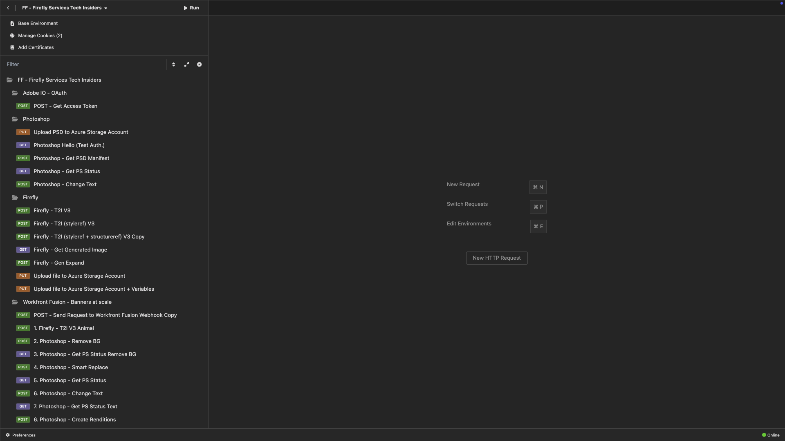
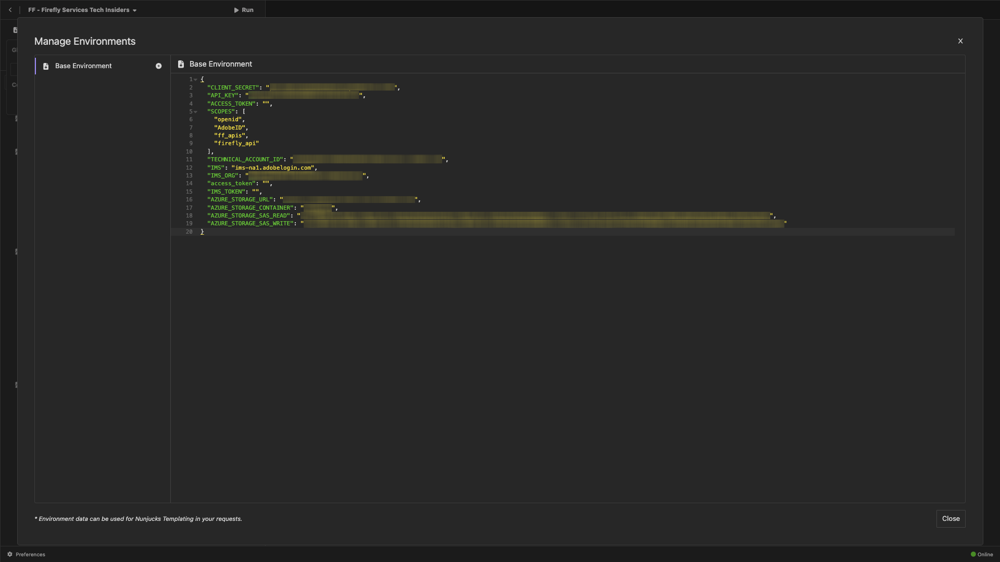

# PostBuster

>[!IMPORTANT]
>
>Die nachfolgenden Hinweise sind nur für Adobe-Mitarbeiter gedacht.

## Installieren von PostBuster

Navigieren Sie zu [https://adobe.service-now.com/esc?id=adb_esc_kb_article&amp;sysparm_article=KB0020542](https://adobe.service-now.com/esc?id=adb_esc_kb_article&amp;sysparm_article=KB0020542).

Klicken Sie hier, um die neueste Version von **PostBuster** herunterzuladen.


Laden Sie die richtige Version für Ihr Betriebssystem herunter.


Sobald der Download abgeschlossen ist und installiert wurde, öffnen Sie PostBuster. Sie sollten das dann sehen. Klicken Sie **Importieren**.


Laden Sie [postbuster.json.zip](./assets/postman/postbuster.json.zip) herunter und extrahieren Sie es auf Ihrem Desktop.


Klicken Sie **Datei wählen**.


Wählen Sie die Datei **postbuster.json** aus. Klicken Sie auf **Öffnen**.


Sie sollten das dann sehen. Klicken Sie auf **Scannen**.


Klicken Sie **Importieren**.


Sie sollten das dann sehen. Klicken Sie, um die importierte Sammlung zu öffnen.


Jetzt sehen Sie Ihre Sammlung. Sie müssen weiterhin eine Umgebung für einige Umgebungsvariablen konfigurieren.



Klicken Sie auf **Basisumgebung** und dann auf das Symbol **Bearbeiten**.


Sie sollten das dann sehen.


Kopieren Sie den Platzhalter unter der Umgebung und fügen Sie ihn in die **Basisumgebung** ein.

```json
{
	"CLIENT_SECRET": "",
	"API_KEY": "",
	"ACCESS_TOKEN": "",
	"SCOPES": [
		"openid",
		"AdobeID",
		"ff_apis",
		"firefly_api"
	],
	"TECHNICAL_ACCOUNT_ID": "",
	"IMS": "ims-na1.adobelogin.com",
	"IMS_ORG": "",
	"access_token": "",
	"IMS_TOKEN": "",
	"AZURE_STORAGE_URL": "",
	"AZURE_STORAGE_CONTAINER": "",
	"AZURE_STORAGE_SAS_READ": "",
	"AZURE_STORAGE_SAS_WRITE": ""
}
```

Sie sollten dann diese haben.


Nachdem Sie das Modul **Firefly-Services** durchlaufen haben, sollte Ihre Umgebung wie folgt aussehen. Sie müssen dies nicht jetzt tun. Dies wird zu einem späteren Zeitpunkt angesprochen.



>[!NOTE]
>
>{width="50px" align="left"}
>
>Wenn Sie Fragen haben oder ein allgemeines Feedback zu künftigen Inhalten geben möchten, wenden Sie sich bitte direkt an Tech Insiders, indem Sie eine E-Mail an **techinsiders@adobe.com senden**.

[Zurück zu „Alle Module“](./overview.md)
