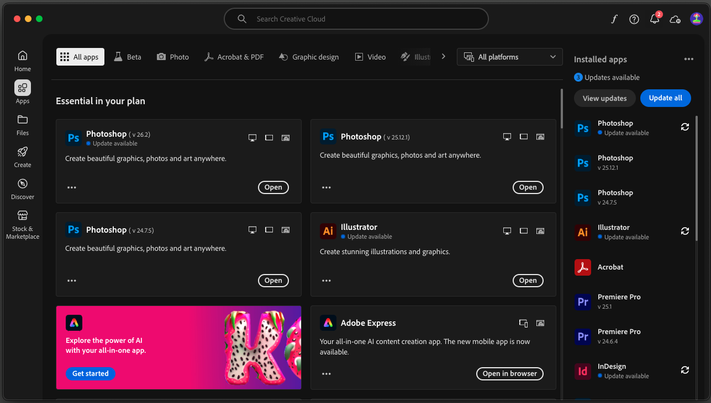

# Vorbereitung

Nachstehend finden Sie einen Überblick über die Vorbereitung, die vor der Teilnahme an einem Live-Workshop erforderlich ist.

## 1. Installieren von Adobe Creative Cloud

Navigieren Sie zu [https://creativecloud.adobe.com/apps/download/creative-cloud](https://creativecloud.adobe.com/apps/download/creative-cloud).

## 2. Photoshop

Öffnen Sie die App **Adobe Creative Cloud** und navigieren Sie zu **Apps**. Installieren Sie Photoshop auf Ihrem Computer.

## 3. API

>[!NOTE]
>
>Wenn Sie Adobe-Mitarbeiter sind, befolgen Sie die Anweisungen hier zum Herunterladen und Installieren [PostBuster](./postbuster.md)

Navigieren Sie zu [https://www.postman.com/downloads/](https://www.postman.com/downloads/).

Laden Sie die entsprechende Version von Postman für Ihr Betriebssystem herunter und installieren Sie sie.

Melden Sie sich mit Ihrem persönlichen Konto bei Postman an.

## 4. Visual Studio Code

Wechseln Sie zu [https://code.visualstudio.com/](https://code.visualstudio.com/){target="_blank"}, laden Sie (Visual Studio Code **herunter und installieren Sie**.

## 5. Ein Texteditor der Wahl

Wenn Sie keine Texteditor-App haben, können Sie zu [https://www.sublimetext.com/](https://www.sublimetext.com/){target="_blank"} gehen und diesen Texteditor herunterladen und installieren.

## 6. GitHub-Konto

Wenn Sie noch kein GitHub-Konto haben, navigieren Sie zu [https://github.com/](https://github.com/){target="_blank"} und klicken Sie auf **Registrieren**. Verwenden Sie Ihre persönliche E-Mail-Adresse und erstellen Sie Ihr Konto.

## 7. GitHub-Desktop

Wechseln Sie zu [https://desktop.github.com/download/](https://desktop.github.com/download/){target="_blank"}, laden Sie (GitHub **) herunter und installieren Sie**.

>[!NOTE]
>
>{width="50px" align="left"}
>
>Wenn Sie Fragen haben oder ein allgemeines Feedback zu künftigen Inhalten geben möchten, wenden Sie sich bitte direkt an Tech Insiders, indem Sie eine E-Mail an **techinsiders@adobe.com senden**.

[Zurück zu „Alle Module“](./overview.md)
