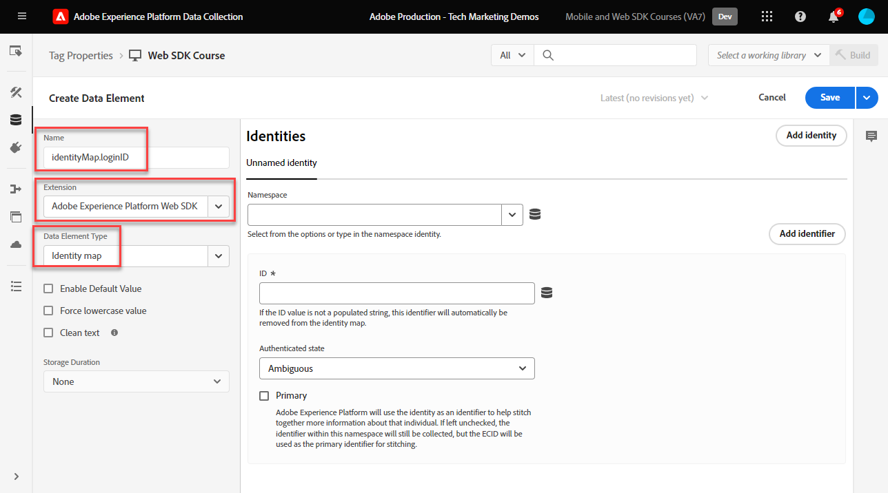

# Erstellen von Identitäten

Erfahren Sie, wie Sie Identitäten mit dem Experience Platform Web SDK erfassen. Erfassen Sie sowohl nicht authentifizierte als auch authentifizierte Identitätsdaten auf der [Demosite &quot;Luma&quot;](https://luma.enablementadobe.com/content/luma/us/en.html). Erfahren Sie, wie Sie die zuvor erstellten Datenelemente zum Erfassen authentifizierter Daten mit einem Platform Web SDK-Datenelementtyp namens Identity Map verwenden.

Es gibt vier neue Datenelementtypen, die durch die Platform Web SDK-Tag-Erweiterung eingeführt werden:

1. Ereigniszusammenführungs-ID
1. Identitätszuordnung
1. Variable
1. XDM-Objekt

Diese Lektion konzentriert sich auf das Datenelement Identitätszuordnung . Sie ordnen Datenelemente mit einer authentifizierten Benutzer-ID und Authentifizierungsstatus XDM zu.

## Lernziele

Am Ende dieser Lektion können Sie:

* den Unterschied zwischen Experience Cloud ID (ECID) und Erstanbieter-Geräte-ID verstehen
* den Unterschied zwischen nicht authentifizierten und authentifizierten IDs verstehen
* Erstellen eines Identitätszuordnungs-Datenelements

## Voraussetzungen

Sie wissen, was eine Datenschicht ist, und kennen die [Demosite &quot;Luma&quot;](https://luma.enablementadobe.com/content/luma/us/en.html){target="_blank"} und wissen, wie Datenelemente in Tags referenziert werden. Sie müssen die folgenden vorherigen Schritte im Tutorial ausgeführt haben:

* [Konfigurieren eines XDM-Schemas](configure-schemas.md)
* [Identitäts-Namespace konfigurieren](configure-identities.md)
* [Konfigurieren eines Datenstroms](configure-datastream.md)
* [In der Tag-Eigenschaft installierte Web SDK-Erweiterung](install-web-sdk.md)
* [Erstellen von Datenelementen](create-data-elements.md)

>[!IMPORTANT]
>
>Die [Experience Cloud ID-Diensterweiterung](https://exchange.adobe.com/experiencecloud.details.100160.adobe-experience-cloud-id-launch-extension.html) ist bei der Implementierung des Adobe Experience Platform Web SDK nicht erforderlich, da die ID-Dienst-Funktion in das Platform Web SDK integriert ist.

## Experience Cloud ID

Die [Experience Cloud ID (ECID)](https://experienceleague.adobe.com/docs/experience-platform/identity/ecid.html?lang=en) ist ein freigegebener Identitäts-Namespace, der in Adobe Experience Platform- und Adobe Experience Cloud-Anwendungen verwendet wird. ECID bildet die Grundlage für die Kundenidentität und ist die Standardidentität für digitale Eigenschaften. Dadurch ist ECID die ideale Kennung für die Verfolgung von nicht authentifiziertem Benutzerverhalten, da es immer vorhanden ist.


<!-- FYI I commented this out because it was breaking the build - Jack
>[!TIP]
>
> When you use the Experience Platform Web SDK to set up Adobe applications on your digital properties, the ECID is generated at the Adobe Edge server level. As such, ECID is not viewable on the client-side network request payload. You can view the ECID by seeing the Preview tab of the network request, or by using the [Adobe Experience Platform Debugger Edge Trace](set-up-analytics.md#experience-cloud-id-validation).
>
-->

Weitere Informationen zum [ECIDs werden mithilfe des Platform Web SDK verfolgt.](https://experienceleague.adobe.com/docs/experience-platform/edge/identity/overview.html?lang=en).

ECIDs werden mithilfe einer Kombination aus Erstanbieter-Cookies und Platform Edge Network festgelegt. Standardmäßig werden die Erstanbieter-Cookies vom Web SDK gesetzt. Um Browserbeschränkungen für Cookie-Lebenszyklen zu berücksichtigen, können Sie stattdessen Ihre eigenen Erstanbieter-Cookies festlegen und verwalten. Diese werden als Erstanbieter-Geräte-IDs (FPIDs) bezeichnet.

## Erstanbieter-Geräte-ID (FPID)

FPIDs sind Erstanbieter-Cookies _Sie legen mithilfe Ihrer eigenen Webserver fest._ welche Adobe verwendet, um die ECID festzulegen, anstatt das vom Web SDK festgelegte Erstanbieter-Cookie zu verwenden. Erstanbieter-Cookies sind am effektivsten, wenn sie mit einem Server gesetzt werden, der einen DNS-A-Datensatz (für IPv4) oder einen AAAA-Datensatz (für IPv6) nutzt, im Gegensatz zu einem DNS-CNAME oder JavaScript-Code.

Sobald ein FPID-Cookie gesetzt ist, kann der zugehörige Wert abgerufen und an Adobe gesendet werden, während Ereignisdaten erfasst werden. Erfasste FPIDs werden als Samen verwendet, um ECIDs im Platform Edge Network zu generieren, die weiterhin die Standardkennungen in Adobe Experience Cloud-Anwendungen sind.

Mehr dazu [Erstanbieter-Geräte-IDs im Platform Web SDK](https://experienceleague.adobe.com/docs/experience-platform/edge/identity/first-party-device-ids.html?lang=de)

>[!CAUTION]
>
> FPID ist eine alternative Methode zur Generierung der ECID mithilfe eines von Ihren Webservern gesetzten Cookies. Sie wird nicht zur Identifizierung authentifizierter Benutzer verwendet.

## Authentifizierte ID

Wie oben erwähnt, wird allen Besuchern Ihrer digitalen Eigenschaften bei Verwendung des Platform Web SDK eine ECID von Adobe zugewiesen. Dadurch wird ECID zur Standardidentität für die Verfolgung nicht authentifizierter digitaler Verhaltensweisen.

Sie können auch eine authentifizierte Benutzer-ID senden, damit Platform [Identitätsdiagramme](https://experienceleague.adobe.com/docs/platform-learn/tutorials/identities/understanding-identity-and-identity-graphs.html?lang=de), kann Target seinen Drittanbieter einstellen. Dies geschieht mithilfe der [!UICONTROL Identity Map] Datenelementtyp.

So erstellen Sie die [!UICONTROL Identity Map] Datenelement:

1. Navigieren Sie zu **[!UICONTROL Datenelemente]** und wählen **[!UICONTROL Datenelement hinzufügen]**

1. **[!UICONTROL Name]** das Datenelement `identityMap.loginID`

1. Als **[!UICONTROL Erweiterung]** auswählen `Adobe Experience Platform Web SDK`

1. Als **[!UICONTROL Datenelementtyp]** auswählen `Identity map`

1. Dadurch wird ein Bildschirmbereich rechts neben dem **[!UICONTROL Datenerfassungsoberfläche]** für die Konfiguration der Identität:

   

1. Als  **[!UICONTROL Namespace]**, wählen Sie die `lumaCrmId` Namespace, den Sie zuvor in der [Identitäten konfigurieren](configure-identities.md) Lektion.

   >[!NOTE]
   >
   >    Wenn Sie Ihre `lumaCrmId` -Namespace verwenden, überprüfen Sie, ob Sie ihn auch in Ihrer standardmäßigen Produktions-Sandbox erstellt haben. Derzeit werden im Dropdown-Menü Namespace nur Namespaces angezeigt, die in der standardmäßigen Produktions-Sandbox erstellt wurden.

1. Nach dem **[!UICONTROL Namespace]** ausgewählt ist, muss eine ID festgelegt werden. Wählen Sie die `user.profile.attributes.username` Datenelement, das zuvor im [Erstellen von Datenelementen](create-data-elements.md#create-data-elements-to-capture-the-data-layer) -Lektion, die eine ID erfasst, wenn Benutzer bei der Site &quot;Luma&quot;angemeldet sind.

   <!--  >[!TIP]
    >
    >You can verify the **[!UICONTROL Luma CRM ID]** is collected in a data element on the web property by going to the [Luma Demo site](https://luma.enablementadobe.com/content/luma/us/en.html), logging in, [switching the tag environment](validate-with-debugger.md#use-the-experience-platform-debugger-to-map-to-your-tag-property) to your own, and typing `_satellite.getVar("user.profile.attributes.username")` in the web browser developer console.
    >
    >   
    -->

1. Als **[!UICONTROL Authentifizierter Status]** auswählen **[!UICONTROL Authentifiziert]**
1. Auswählen **[!UICONTROL Primär]**

1. Wählen Sie **[!UICONTROL Speichern]** aus

   

>[!TIP]
>
> Adobe empfiehlt, Identitäten zu senden, die eine Person repräsentieren, z. B. `Luma CRM Id`als [!UICONTROL primary] Identität.
>
> Wenn die Identitätszuordnung die Personenkennung enthält (z. B. `Luma CRM Id`), wird die Personen-ID zur [!UICONTROL primary] Identität. Andernfalls `ECID` wird [!UICONTROL primary] Identität.


<!--
1. Once the data element is configured in **[!UICONTROL Data Collection interface]**, it can be tested on the Luma web property like any other Data Element. Enter the following script in the browser developer console
   
   
   ```
   _satellite.getVar('identityMap.loginID')
   ```  

   
   
   >[!NOTE]
   >
   >ECID identifier will NOT populate in the Data Element, as this is configured already with Platform Web SDK.   
-->

Am Ende dieser Schritte sollten die folgenden Datenelemente erstellt werden:

| Datenelemente der CORE-Erweiterung | Platform Web SDK-Datenelemente |
-----------------------------|-------------------------------
| `cart.orderId` | `identityMap.loginID` |
| `page.pageInfo.hierarchie1` | `xdm.variable.content` |
| `page.pageInfo.pageName` | |
| `page.pageInfo.server` | |
| `user.profile.attributes.loggedIn` | |
| `user.profile.attributes.username` | |

Wenn diese Datenelemente vorhanden sind, können Sie mit dem Senden von Daten an Platform Edge Network über das XDM-Objekt beginnen, indem Sie eine Regel in Tags erstellen.

[Weiter: ](create-tag-rule.md)

>[!NOTE]
>
>Vielen Dank, dass Sie Ihre Zeit investiert haben, um mehr über das Adobe Experience Platform Web SDK zu erfahren. Wenn Sie Fragen haben, ein allgemeines Feedback teilen möchten oder Vorschläge zu künftigen Inhalten haben, teilen Sie diese bitte mit. [Experience League Community-Diskussionsbeitrag](https://experienceleaguecommunities.adobe.com/t5/adobe-experience-platform-launch/tutorial-discussion-implement-adobe-experience-cloud-with-web/td-p/444996)
