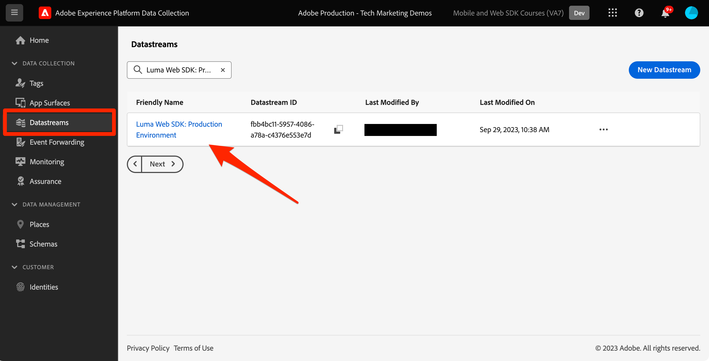
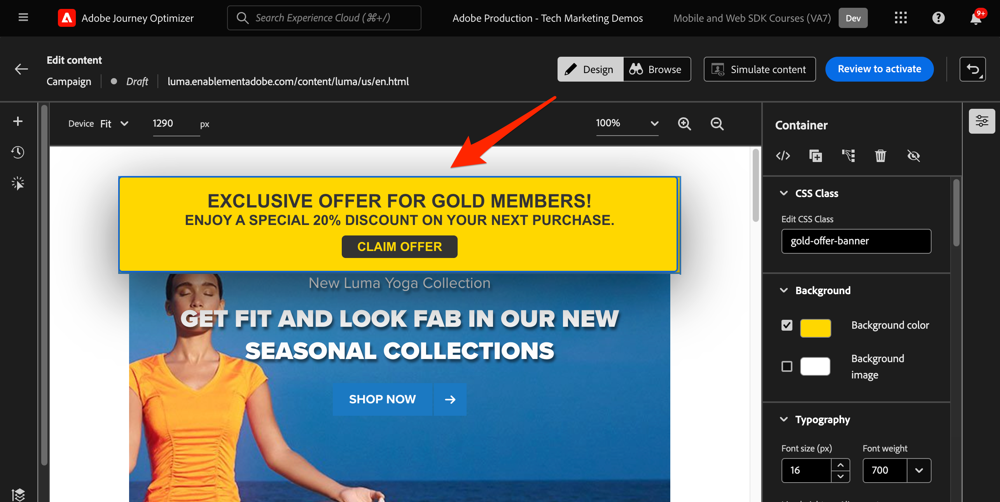
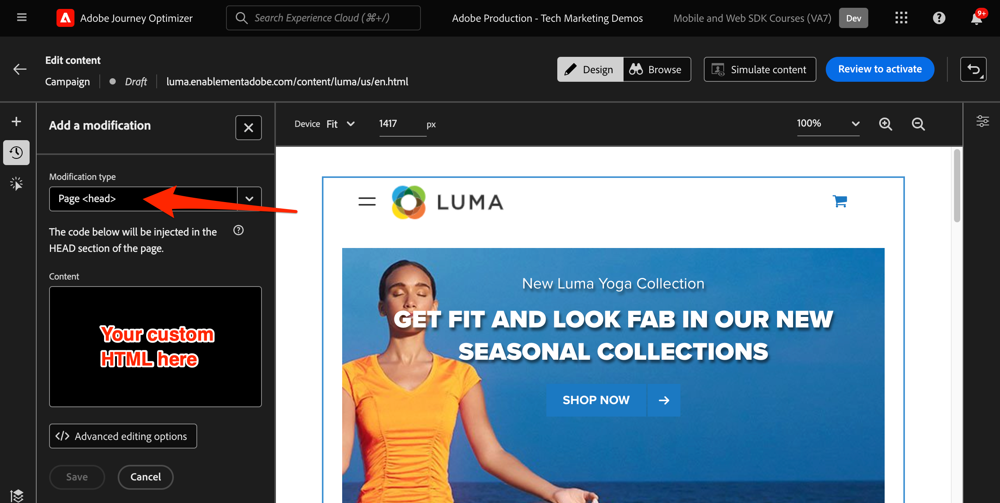

# Webkanal mit dem Platform Web SDK einrichten

Erfahren Sie, wie Sie den Webkanal mit dem Platform Web SDK implementieren. In diesem Handbuch werden die grundlegenden Webkanal-Voraussetzungen, detaillierte Konfigurationsschritte und ein tiefer Einblick in einen Anwendungsfall zum Treuestatus gegeben.

Anhand dieses Handbuchs können Journey Optimizer-Benutzer mithilfe von Journey Optimizer Web Designer effektiv den Webkanal für eine erweiterte Online-Personalisierung anwenden.

## Lernziele

Am Ende dieser Lektion können Sie:

* Erfahren Sie mehr über die Funktion und Bedeutung des Web SDK bei der Bereitstellung des Webkanalerlebnisses.
* Machen Sie sich mit dem Erstellen einer Webkanal-Kampagne von Anfang bis Ende vertraut, indem Sie das Anwendungsbeispiel &quot;Prämien für Treue zu Luma&quot;verwenden.
* Konfigurieren Sie die Kampagneneigenschaften, Aktionen und Zeitpläne auf der Benutzeroberfläche.
* Machen Sie sich mit der Funktionalität und den Vorteilen der Adobe Experience Cloud Visual Editing Helper-Erweiterung vertraut.
* Erfahren Sie, wie Sie mit Web Designer Webseiteninhalte bearbeiten, einschließlich Bildern, Kopfzeilen und anderen Elementen.
* Erfahren Sie, wie Sie mithilfe der Komponente Angebotsentscheidung Angebote in eine Webseite einfügen.
* Machen Sie sich mit Best Practices vertraut, um die Qualität und den Erfolg einer Webkanalkampagne sicherzustellen.

## Voraussetzungen

Um die Lektionen in diesem Abschnitt abzuschließen, müssen Sie zunächst:

* Stellen Sie sicher, dass die Adobe Experience Platform Web SDK-Tag-Erweiterungsversion 2.16 oder höher ist.
* Wenn Sie den Journey Optimizer-Webdesigner verwenden, um Ihr Webkanalerlebnis zu erstellen, stellen Sie sicher, dass Sie entweder die Google Chrome- oder Microsoft® Edge-Browser verwenden.
* Stellen Sie außerdem sicher, dass Sie die Browsererweiterung Adobe Experience Cloud Visual Editing Helper heruntergeladen haben. Aktivieren Sie die Visual Editing Helper-Browsererweiterung in der Browser-Symbolleiste, bevor Sie das Webkanalerlebnis erstellen.
   * Im Journey Optimizer-Webdesigner können bestimmte Websites aus einem der folgenden Gründe nicht zuverlässig geöffnet werden:
      1. Die Website hat strenge Sicherheitsrichtlinien.
      1. Die Website ist in einen iframe eingebettet.
      1. Die QA- oder Staging-Site des Kunden ist nicht extern zugänglich (es handelt sich um eine interne Site).
* Stellen Sie sicher, dass in Ihrem Browser Drittanbieter-Cookies zulässig sind. Es kann erforderlich sein, auch alle Anzeigensperren in Ihrem Browser zu deaktivieren.
* Beim Erstellen von Web-Erlebnissen und Einschließen von Inhalten aus der Adobe Experience Manager Assets Essentials-Bibliothek muss die Subdomain für die Veröffentlichung dieses Inhalts konfiguriert werden. [Weitere Informationen](https://experienceleague.adobe.com/docs/journey-optimizer/using/web/web-delegated-subdomains.html?lang=en).
* Stellen Sie bei Verwendung der Inhaltsexperimentierungsfunktion sicher, dass Ihr Webdatensatz auch in Ihrer Berichtskonfiguration enthalten ist.
* Derzeit werden zwei Arten von Implementierungen unterstützt, um die Erstellung und Bereitstellung von Webkanalkampagnen in Ihren Webeigenschaften zu ermöglichen:
   * Nur Client-seitig: Um Ihre Website zu ändern, müssen Sie das Adobe Experience Platform Web SDK implementieren.
   * Hybridmodus: Sie können die Platform Edge Network Server-API verwenden, um eine serverseitige Personalisierung anzufordern. Die Antwort von der API wird dann dem Adobe Experience Platform Web SDK zur Client-seitigen Wiedergabe von Änderungen bereitgestellt. Weitere Informationen finden Sie in der Dokumentation zur Adobe Experience Platform Edge Network Server API . Weitere Details und Implementierungsbeispiele für den Hybridmodus finden Sie in diesem Blogpost.

>[!NOTE]
>
>Die serverseitige Implementierung wird derzeit nicht unterstützt.

## Terminologie

Zunächst sollten Sie die in Webkanalkampagnen verwendete Terminologie verstehen.

* **Webkanal**: Medium für die Kommunikation oder die Bereitstellung von Inhalten über das Internet. Im Kontext dieses Handbuchs bezieht sich es auf den Mechanismus, mit dem personalisierte Inhalte mithilfe des Platform Web SDK innerhalb von Adobe Journey Optimizer an Website-Besucher bereitgestellt werden.
* **Weboberfläche**: Bezieht sich auf eine Webeigenschaft, die durch eine URL identifiziert wird, in der Inhalte bereitgestellt werden. Sie kann eine oder mehrere Webseiten umfassen.
* **Journey Optimizer Web Designer**: Ein bestimmtes Tool oder eine bestimmte Benutzeroberfläche in der Journey Optimizer, über das Benutzer ihre Webkanalerlebnisse entwerfen können.
* **Adobe Experience Cloud Visual Editing Helper**: Eine Browsererweiterung, die beim visuellen Bearbeiten und Entwerfen von Webkanalerlebnissen unterstützt.
* **Datastream**: Eine Konfiguration innerhalb des Adobe Experience Platform-Dienstes, die sicherstellt, dass Webkanalerlebnisse bereitgestellt werden können.
* **Zusammenführungsrichtlinie**: Eine Konfiguration, die die genaue Aktivierung und Veröffentlichung eingehender Kampagnen sicherstellt.
* **Zielgruppe**: Ein bestimmtes Segment von Benutzern oder Site-Besuchern, die bestimmte Kriterien erfüllen.
* **Web Designer**: Eine Benutzeroberfläche oder ein Tool, die bei der visuellen Bearbeitung und Gestaltung von Web-Erlebnissen hilft, ohne tief in den Code einzutauchen.
* **Ausdruckseditor**: Ein Tool im Web Designer, mit dem Benutzer Web-Inhalten Personalisierungen hinzufügen können, die möglicherweise auf Datenattributen oder anderen Kriterien basieren.
* **Komponente für Angebotsentscheidungen**: Eine Komponente im Web Designer, die bei der Entscheidung unterstützt, welches Angebot für die Anzeige an einen bestimmten Besucher basierend auf der Entscheidungsverwaltung am besten geeignet ist.
* **Inhaltstest**: Eine Methode zum Testen verschiedener Inhaltsvarianten, um herauszufinden, welche die beste Leistung im Hinblick auf die gewünschte Metrik erzielt, z. B. eingehende Klicks.
* **Behandlung**: Im Rahmen von Inhaltsprüfungen bezieht sich eine Behandlung auf eine bestimmte Inhaltsvariante, die mit einer anderen getestet wird.
* **Simulation**: Ein Vorschaumechanismus zur Visualisierung des Webkanalerlebnisses, bevor es für Live-Zielgruppen aktiviert wird.

## Konfigurieren des Datenspeichers

Stellen Sie sicher, dass im Adobe Experience Platform-Dienst ein Datastream definiert ist und dass die Option Adobe Journey Optimizer aktiviert ist. Dies muss konfiguriert werden, bevor ein Webkanal-Erlebnis vom Platform Web SDK bereitgestellt werden kann.

So konfigurieren Sie Adobe Journey Optimizer im Datastream:

1. Navigieren Sie zu [Datenerfassung](https://experience.adobe.com/#/data-collection){target="blank"} -Schnittstelle.
1. Wählen Sie im linken Navigationsbereich die Option **[!UICONTROL Datenspeicher]**.
1. Wählen Sie den zuvor erstellten Datenspeicher des Luma Web SDK aus.

   

1. Auswählen **[!UICONTROL Bearbeiten]** innerhalb des Adobe Experience Platform-Dienstes.

   

1. Überprüfen Sie die **[!UICONTROL Adobe Journey Optimizer]** ankreuzen.

   

1. Wählen Sie **[!UICONTROL Speichern]** aus.

Dadurch wird sichergestellt, dass eingehende Ereignisse für Journey Optimizer vom Adobe Experience Platform Edge ordnungsgemäß verarbeitet werden.

## Zusammenführungsrichtlinie konfigurieren

Stellen Sie sicher, dass eine Zusammenführungsrichtlinie mit der **[!UICONTROL Richtlinie zur aktiven Zusammenführung auf Edge]** aktiviert ist. Diese Option für Zusammenführungsrichtlinien wird von eingehenden Journey Optimizer-Kanälen verwendet, um die genaue Aktivierung und Veröffentlichung eingehender Kampagnen am Edge-Server sicherzustellen.

So konfigurieren Sie die Option in der Zusammenführungsrichtlinie:

1. Navigieren Sie zu **[!UICONTROL Kunde]** > **[!UICONTROL Profile]** -Seite in der Experience Platform- oder Journey Optimizer-Benutzeroberfläche.
1. Wählen Sie die **[!UICONTROL Zusammenführungsrichtlinien]** Registerkarte.
1. Wählen Sie Ihre Richtlinie aus und schalten Sie die **[!UICONTROL Richtlinie zur aktiven Zusammenführung auf Edge]** -Option innerhalb der **[!UICONTROL Konfigurieren]** Schritt.

   

## Konfigurieren des Webdatensatzes für Inhaltsexperimente

Um Inhaltsexperimente in Webkanalkampagnen zu verwenden, müssen Sie sicherstellen, dass der verwendete Webdatensatz auch in Ihrer Berichtskonfiguration enthalten ist. Das Journey Optimizer-Berichterstattungssystem verwendet den Datensatz schreibgeschützt, um native Inhaltsexperimentierungsberichte auszufüllen.

[Das Hinzufügen von Datensätzen für Inhaltsexperimentberichte wird in diesem Abschnitt beschrieben.](https://experienceleague.adobe.com/docs/journey-optimizer/using/campaigns/content-experiment/reporting-configuration.html?lang=en#add-datasets).

## Nutzungsszenario - Überblick über Treuebelohnungen

In dieser Lektion wird ein Anwendungsbeispiel für Treuebelohnungen verwendet, um die Implementierung eines Webkanalerlebnisses mit dem Web SDK detailliert zu beschreiben.

In diesem Anwendungsbeispiel wird veranschaulicht, wie Journey Optimizer mithilfe der Journey Optimizer-Kampagnen und des Web-Designers dazu beitragen kann, Ihren Kunden die besten eingehenden Erlebnisse bereitzustellen.

>[!NOTE]
>
>Da dieses Tutorial auf Implementierer ausgerichtet ist, ist zu beachten, dass diese Lektion umfangreiche Arbeit an der Benutzeroberfläche in Journey Optimizer erfordert. Während solche Aufgaben in der Regel von Marketing-Experten verarbeitet werden, können Implementierer Einblicke in den Prozess erhalten, selbst wenn sie nicht für die Erstellung von Webkanal-Kampagnen am Ende verantwortlich sind.

### Kampagne &quot;Treuebelohnungen erstellen&quot;

Erstellen wir zunächst die Webkanalkampagne &quot;Loyalitätsbelohnungen&quot;in Adobe Journey Optimizer.

So erstellen Sie die Beispielkampagne:

1. Navigieren Sie zu **[!UICONTROL Journey-Management]** > **[!UICONTROL Kampagnen]** in der linken Navigation
1. Klicks **[!UICONTROL Kampagne erstellen]** oben rechts.
1. Geben Sie im Abschnitt **[!UICONTROL Eigenschaften]** an, wann Sie die Kampagne ausführen möchten. Wählen Sie für den Anwendungsfall Treuebelohnungen die Option **Geplant**.

   

1. Im **[!UICONTROL Aktionen]** wählen Sie die **[!UICONTROL Webkanal]**. Als  **[!UICONTROL Weboberfläche]** auswählen **[!UICONTROL Seiten-URL]**.

>[!NOTE]
>
>Eine Weboberfläche bezieht sich auf eine Webeigenschaft, die durch eine URL identifiziert wird, in der Inhalte bereitgestellt werden. Sie kann einer einzelnen Seiten-URL entsprechen oder mehrere Seiten umfassen, sodass Sie Änderungen auf eine oder mehrere Webseiten anwenden können.

Wählen Sie die **[!UICONTROL Seiten-URL]** Weboberflächen-Option, um das Erlebnis auf einer Seite für diese Kampagne bereitzustellen. Geben Sie die URL für die Seite &quot;Luma&quot;ein.

1. Nachdem die Weboberfläche definiert wurde, wählen Sie **[!UICONTROL Erstellen]**.

   

1. Fügen Sie nun einige zusätzliche Details zur neuen Webkanalkampagne hinzu. Benennen Sie zuerst die Kampagne. Aufrufen `Luma Loyalty Rewards – Gold Status – October 2023`. Optional können Sie der Kampagne eine Beschreibung hinzufügen. Auch hinzufügen **[!UICONTROL Tags]** zur Verbesserung der allgemeinen Kampagnentaxonomie.

   

1. Standardmäßig ist die Kampagne für alle Site-Besucher aktiv. Für die Zwecke dieses Anwendungsbeispiels sollte nur Mitgliedern mit Gold-Status-Belohnungen das Erlebnis angezeigt werden. Klicken Sie zur Aktivierung auf **[!UICONTROL Zielgruppe auswählen]** und wählen Sie `Luma Loyalty Rewards – Gold Status` Zielgruppe.

1. Im **[!UICONTROL Identitäts-Namespace]** den Namespace zur Identifizierung von Einzelanwendern im ausgewählten Segment auswählen. Da Sie die Kampagne auf der Site &quot;Luma&quot;bereitstellen, können Sie den ECID-Namespace auswählen. Profile innerhalb der `Luma Loyalty Rewards – Gold Status` Zielgruppe, der der ECID-Namespace unter ihren verschiedenen Identitäten fehlt, wird von der Webkanalkampagne nicht angesprochen.

   

1. Planen Sie den Beginn der Kampagne am 1. Dezember mithilfe des **[!UICONTROL Kampagnenstart]** und am 31. Dezember unter Verwendung der **[!UICONTROL Kampagnenende]** -Option.

   

>[!NOTE]
>
>Beachten Sie, dass bei Webkanal-Kampagnen das Web-Erlebnis angezeigt wird, wenn der Besucher die Seite öffnet. Im Gegensatz zu anderen Kampagnentypen in Adobe Journey Optimizer ist die **[!UICONTROL Action Triggers]** nicht konfigurierbar ist.

### Experimentieren mit Treuebelohnungsinhalten

Im **[!UICONTROL Aktion]** -Abschnitt können Sie optional ein Experiment erstellen, um zu testen, welche Inhalte für die `Luma Loyalty Rewards – Gold Status` Zielgruppe. Erstellen und testen wir zwei Behandlungen als Komponente der Kampagnenkonfiguration.

So erstellen Sie das Inhaltsexperiment:

1. Klicks **[!UICONTROL Experiment erstellen]**.

   

1. Wählen Sie zuerst eine **[!UICONTROL Erfolgsmetrik]**. Dies ist die Metrik zur Bestimmung der Inhaltseffizienz. Auswählen **[!UICONTROL Eindeutige eingehende Klicks]**, um zu sehen, welche Inhaltsbehandlung mehr Klicks auf den Web-Erlebnis-CTA generiert.

   

1. Beim Einrichten eines Experiments mit einem Webkanal und Auswählen der **[!UICONTROL Eingehende Klicks]**, **[!UICONTROL Eindeutige eingehende Klicks]**, **[!UICONTROL Seitenansichten]** oder **[!UICONTROL Einzelseitenansichten]** Metriken, die **[!UICONTROL Aktion auswählen]** -Dropdown-Liste ermöglicht es Ihnen, Klicks und Ansichten auf bestimmten Seiten genau zu verfolgen und zu überwachen.

1. Optional können Sie eine **[!UICONTROL Holdout]** die keine der beiden Behandlungen erhalten. Lassen Sie das vorerst deaktiviert.

1. Wählen Sie optional auch **[!UICONTROL Gleichmäßig verteilen]**. Aktivieren Sie diese Option, um sicherzustellen, dass die Behandlungsaufteilungen immer gleichmäßig aufgeteilt sind.

[Erfahren Sie mehr über Inhaltsexperimente im Adobe Journey Optimizer-Webkanal](https://experienceleague.adobe.com/docs/journey-optimizer/using/campaigns/content-experiment/get-started-experiment.html?lang=en).

### Bearbeiten von Inhalten mit Visual Helper

Lassen Sie uns nun das Webkanalerlebnis erstellen. Verwenden Sie dazu die Adobe Experience Cloud **[!UICONTROL Visual Helper]**. Dieses Tool ist eine Browsererweiterung, die mit Google Chrome und Microsoft® Edge kompatibel ist. Vergewissern Sie sich, dass Sie die Erweiterung heruntergeladen haben, bevor Sie versuchen, Ihre Erlebnisse zu erstellen. Stellen Sie außerdem sicher, dass die Webseite das Web SDK enthält.

1. Innerhalb der **[!UICONTROL Aktion]** im Tab der Kampagne klicken Sie auf **[!UICONTROL Inhalt bearbeiten]**. Da Sie eine einseitige URL als Oberfläche eingegeben haben, sollten Sie bereit sein, mit der Arbeit im Composer zu beginnen.

   

1. Jetzt klicken **[!UICONTROL Webseite bearbeiten]** , um mit dem Authoring zu beginnen.

   

1. Bearbeiten Sie zunächst einige Elemente mithilfe des Web Composer. Bearbeiten Sie über das Kontextmenü die Kopfzeile des Luma-Hero-Bilds. Passen Sie den Stil des Kontextbereichs auf der rechten Seite an.

   

1. Fügen Sie dem Container außerdem mithilfe der **[!UICONTROL Ausdruckseditor]**.

   

1. Stellen Sie sicher, dass das Erlebnis ordnungsgemäß nach Klicks verfolgt wird. Auswählen **[!UICONTROL Element verfolgen]** aus dem Kontextmenü aus.

   

1. Verwenden Sie die **[!UICONTROL Komponente für Angebotsentscheidungen]** , um Angebote in die Webseite einzufügen. Diese Komponente verwendet **[!UICONTROL Entscheidungsverwaltung]** , um das beste Angebot für Luma-Besucher auszuwählen.

### HTML-Designänderungen

Es gibt einige Methoden, wenn Sie erweiterte oder benutzerdefinierte Änderungen an der Site als Komponente der Kampagne &quot;Treuebelohnungen&quot;vornehmen möchten.

Verwenden Sie die **[!UICONTROL Komponenten]** -Bereich, um HTML oder anderen Inhalt direkt zur Site &quot;Luma&quot;hinzuzufügen.

Fügen Sie oben auf der Seite eine neue HTML-Komponente hinzu. Bearbeiten Sie die HTML innerhalb der Komponente über die Design-Oberfläche oder **[!UICONTROL Kontextuell]** -Bereich.

Alternativ können Sie HTML-Bearbeitungen über die **[!UICONTROL Änderungen]** -Bereich. In diesem Bereich können Sie eine Komponente auf der Seite auswählen und sie über die Designer-Benutzeroberfläche bearbeiten.

Fügen Sie im Editor die HTML für die `Luma Loyalty Rewards – Gold Status` Zielgruppe. Auswählen **[!UICONTROL Bestätigen]**.

Überprüfen Sie jetzt die neue benutzerdefinierte HTML-Komponente für &quot;fit and Feeling&quot;.

Bearbeiten Sie eine bestimmte Komponente mithilfe der **[!UICONTROL CSS-Selektortyp]** Änderung.

Fügen Sie benutzerspezifischen Code mithilfe der **Seite `<head>` type** Änderung.

Die Möglichkeiten sind endlos, wenn Sie die **[!UICONTROL Visual Helper]**.

### Inhalt der Treuebelohnungen simulieren

Sehen Sie sich eine Vorschau der geänderten Webseite an, bevor Sie die Kampagne aktivieren. Beachten Sie, dass Sie Testprofile für die Simulation von Webkanalerlebnissen konfiguriert haben müssen.

So simulieren Sie das Erlebnis:

1. Auswählen **[!UICONTROL Inhalt simulieren]** innerhalb der Kampagne.

   

1. Wählen Sie ein Testprofil aus, um die Simulation zu erhalten. Beachten Sie, dass das Testprofil im `Luma Loyalty Rewards – Gold Status` Zielgruppe die richtige Behandlung zu erhalten.

1. Die Vorschau wird für das Testprofil angezeigt.

### Aktivieren der Kampagne &quot;Treuebelohnungen&quot;

Aktivieren Sie abschließend die Webkanal-Kampagne.

1. Auswählen **Aktivieren**.

1. Sie werden aufgefordert, die Kampagnendetails ein letztes Mal zu bestätigen. Auswählen **[!UICONTROL Aktivieren]**. Es kann bis zu 15 Minuten dauern, bis die Kampagne auf der Site live ist.

### Treuebelohnungen QA

Als Best Practice wird empfohlen, die **[!UICONTROL Web]** in den Live- und globalen Berichten der Kampagne für die Kampagnen-spezifischen KPIs. Überwachen Sie für diese Kampagne Erlebnisimpressionen und Klickrate.

### Webkanalüberprüfung mit Adobe Experience Platform Debugger

Die Adobe Experience Platform Debugger-Erweiterung, die sowohl für Chrome als auch für Firefox verfügbar ist, analysiert Ihre Webseiten, um Probleme bei der Implementierung von Adobe Experience Cloud-Lösungen zu identifizieren.

Sie können den Debugger auf der Site &quot;Luma&quot;verwenden, um das Webkanalerlebnis in der Produktion zu überprüfen. Dies ist eine Best Practice, sobald der Anwendungsfall &quot;Loyalitätsbelohnungen&quot;aktiv ist, um sicherzustellen, dass alles korrekt konfiguriert ist.

[Erfahren Sie hier, wie Sie den Debugger in Ihrem Browser mithilfe des Handbuchs konfigurieren](https://experienceleague.adobe.com/docs/platform-learn/data-collection/debugger/overview.html?lang=en).

So starten Sie die Validierung mit dem Debugger:

1. Navigieren Sie zur Webseite &quot;Luma&quot;mit dem Webkanal-Erlebnis.
   <!--
    
    -->
1. Öffnen Sie auf der Webseite die **[!UICONTROL Adobe Experience Platform Debugger]**.
   <!--
    
    -->
1. Navigieren Sie zu **Zusammenfassung**. Stellen Sie sicher, dass **[!UICONTROL Datenspeicher-ID]** entspricht der **[!UICONTROL datastream]** in **[!UICONTROL Adobe-Datenerfassung]** für die Sie Adobe Journey Optimizer aktiviert haben.
   <!--
    
    -->
1. Sie können sich dann mit verschiedenen Treuekonten von Luma bei der Site anmelden und den Debugger verwenden, um die an das Adobe Experience Platform Edge Network gesendeten Anfragen zu validieren.
   <!--
    
    -->
1. under **[!UICONTROL Lösungen]** Navigieren Sie zum **[!UICONTROL Experience Platform Web SDK]**.
   <!--
    
    -->
1. Innerhalb der **Konfiguration** Registerkarte, aktivieren **[!UICONTROL Aktivieren des Debuggens]**. Dies ermöglicht die Protokollierung für die Sitzung in einer **[!UICONTROL Adobe Experience Platform Assurance]** Sitzung.
   <!--
    
    -->
1. Melden Sie sich mit verschiedenen Treuekonten von Luma bei der Site an und überprüfen Sie mithilfe des Debuggers die an die **[!UICONTROL Adobe Experience Platform Edge-Netzwerk]**. Alle diese Anforderungen sollten in **[!UICONTROL Assurance]** für die Protokollierung.
<!--
   
-->