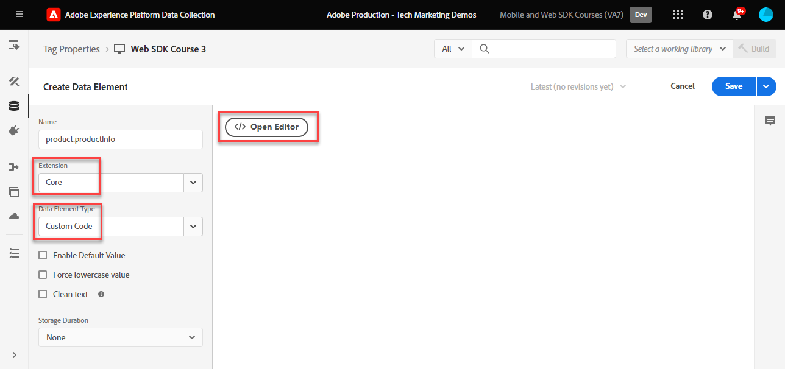
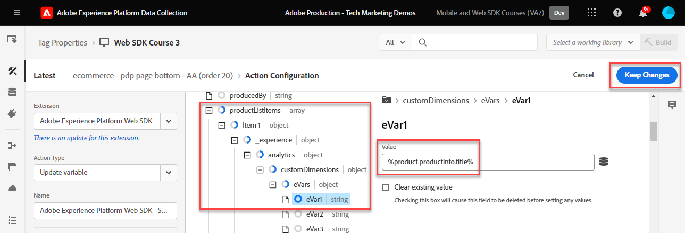
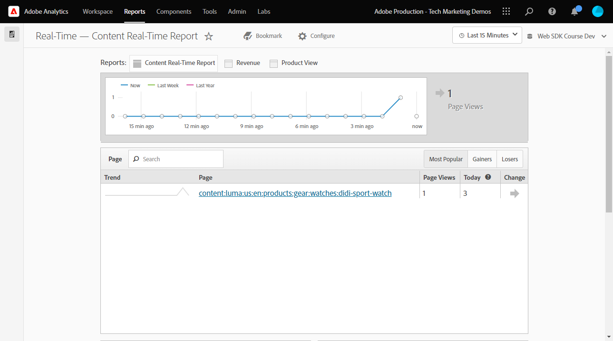

# Einrichten von Adobe Analytics mit dem Platform Web SDK

Erfahren Sie, wie Sie Adobe Analytics mit [Experience Platform Web SDK](https://experienceleague.adobe.com/docs/platform-learn/data-collection/web-sdk/overview.html?lang=de)erstellen Tag-Regeln, um Daten an Adobe Analytics zu senden, und überprüfen, ob Analytics Daten erwartungsgemäß erfasst.

[Adobe Analytics](https://experienceleague.adobe.com/docs/analytics.html?lang=de) ist eine branchenführende Anwendung, mit der Sie Ihre Kunden besser verstehen und Ihr Geschäft mit Customer Intelligence steuern können.

## Lernziele

Am Ende dieser Lektion können Sie:

* Konfigurieren eines XDM-Schemas für Adobe Analytics
* den Unterschied zwischen automatisch zugeordneten und manuell zugeordneten XDM-Variablen für Analytics verstehen
* Konfigurieren eines Datenspeichers zur Aktivierung von Adobe Analytics
* Datensatz überschreiben, um Daten an eine andere Adobe Analytics Report Suite zu senden
* Ordnen Sie einzelne oder komplette Array-Datenelemente dem XDM-Objekt zu.
* Verwenden Sie den Aktionstyp Variable-Regel aktualisieren , um mehrere Regeln in einem XDM-Ereignis zu stapeln.
* Erfassen von Seitenansichten in Adobe Analytics mit dem XDM-Objekt
* Erfassen von E-Commerce-Daten mit dem XDM-Objekt für die Adobe Analytics-Produktzeichenfolge
* Festlegen eines Merchandising-eVar mit Produktsyntax mit XDM
* Überprüfen, ob Adobe Analytics-Variablen mit dem XDM-Objekt mithilfe von Experience Platform Debugger festgelegt werden
* Verwenden von Adobe Analytics-Verarbeitungsregeln zum Festlegen benutzerdefinierter Variablen
* Daten überprüfen wird von Adobe Analytics mithilfe von Adobe Experience Platform Assurance erfasst
* Daten mithilfe von Echtzeitberichten von Adobe Analytics überprüfen

## Voraussetzungen

Sie kennen Tags, Adobe Analytics und die [Demosite &quot;Luma&quot;](https://luma.enablementadobe.com/content/luma/us/en.html){target="_blank"} Anmelde- und Einkaufsfunktionen.

Sie benötigen mindestens eine Test-/Entwicklungs-Report Suite-ID. Wenn Sie nicht über eine Report Suite für Tests/Entwicklung verfügen, die Sie für dieses Tutorial verwenden können, [erstellen Sie bitte eine](https://experienceleague.adobe.com/docs/analytics/admin/manage-report-suites/new-report-suite/t-create-a-report-suite.html?lang=de).

Sie müssen alle Schritte aus den vorherigen Abschnitten des Tutorials abgeschlossen haben:

* Erstkonfiguration
   * [Konfigurieren eines XDM-Schemas](configure-schemas.md)
   * [Identitäts-Namespace konfigurieren](configure-identities.md)
   * [Konfigurieren eines Datenstroms](configure-datastream.md)
* Tag-Konfiguration
   * [Installieren der Web SDK-Erweiterung](install-web-sdk.md)
   * [Erstellen von Datenelementen](create-data-elements.md)
   * [Erstellen von Identitäten](create-identities.md)
   * [Tag-Regel erstellen](create-tag-rule.md)
   * [Überprüfen mit dem Adobe Experience Platform-Debugger](validate-with-debugger.md)

Sie müssen auch [Benutzerzugriff auf Adobe Experience Platform Assurance aktivieren](https://experienceleague.adobe.com/docs/experience-platform/assurance/user-access.html) damit Sie Ihre Adobe Analytics-Daten mit Adobe Experience Platform Assurance überprüfen können. (Wenn Sie Zugriff auf Schemas, Identitäts-Namespaces und Datenspeicher haben, haben Sie bereits Zugriff auf Assurance.)

## XDM-Schemata und Analytics-Variablen

Herzlichen Glückwunsch! Sie haben bereits ein mit Adobe Analytics kompatibles Schema im [Schema konfigurieren](configure-schemas.md) Lektion! Für Adobe Analytics gibt es jedoch zwei allgemeine Ansätze zum Definieren des XDM für Adobe Analytics.

<!-- Implementing Platform Web SDK should be as product-agnostic as possible. For Adobe Analytics, mapping eVars, props, and events doesn't occur during schema creation, nor during the tag rules configuration as it has been done traditionally. Instead, every XDM key-value pair becomes a Context Data Variable that maps to an Analytics variable in one of two ways: 

1. Automatically mapped variables using reserved XDM fields
1. Manually mapped variables using Analytics Processing Rules

To understand what XDM variables are auto-mapped to Adobe Analytics, please see [Variables automatically mapped in Analytics](https://experienceleague.adobe.com/docs/experience-platform/edge/data-collection/adobe-analytics/automatically-mapped-vars.html?lang=en). Any variable that is not auto-mapped must be manually mapped. -->

1. **Produktagnostisches XDM**: Pflege eines semantischen Schlüssel-Wert-Paares XDM-Schema und Verwendung [Adobe Analytics-Verarbeitungsregeln](https://experienceleague.adobe.com/docs/analytics/admin/admin-tools/manage-report-suites/edit-report-suite/report-suite-general/c-processing-rules/processing-rules.html) um die XDM-Felder eVars, Props usw. zuzuordnen. Mit einem semantischen XDM-Schema meinen wir, dass die Feldnamen selbst eine Bedeutung haben. Beispielsweise der Feldname `web.webPageDetails.pageName` hat mehr Bedeutung als sagen `prop1` oder `evar3`.

   >[!IMPORTANT]
   >
   > Alle Felder im XDM-Schema stehen Adobe Analytics als Kontextdatenvariablen mit dem folgenden Präfix zur Verfügung `a.x.`. Beispiel: `a.x.web.webinteraction.region`

1. **Analytics-spezifisches XDM**: Verwenden Sie eine speziell erstellte Adobe Analytics-Feldergruppe im XDM-Schema namens `Adobe Analytics ExperienceEvent Template`

Der Ansatz, den Adobe den Kunden vorgezogen hat, ist der **Analytics-spezifisches XDM**, da der Zuordnungsschritt in der Benutzeroberfläche der Adobe Analytics-Verarbeitungsregeln übersprungen wird. Die Schritte in dieser Lektion verwenden die **Analytics-spezifisches XDM** Ansatz.

## Zuordnen von XDM zu Adobe Analytics

Viele XDM-Felder werden automatisch Analytics-Variablen zugeordnet.

Das Schema, das im [Schema konfigurieren](configure-schemas.md) Die Lektion enthält einige automatisch zugeordnete Analytics-Variablen, wie in dieser Tabelle beschrieben:

| Automatisch zugeordnete Variablen von XDM zu Analytics | Adobe Analytics-Variable |
|-------|---------|
| `identitymap.ecid.[0].id` | mid |
| `web.webPageDetails.name` | s.pageName |
| `web.webPageDetails.server` | s.server |
| `web.webPageDetails.siteSection` | s.channel |
| `commerce.productViews.value` | prodView |
| `commerce.productListViews.value` | scView |
| `commerce.checkouts.value` | scCheckout |
| `commerce.purchases.value` | Kauf |
| `commerce.order.currencyCode` | s.currencyCode |
| `commerce.order.purchaseID` | s.purchaseID |
| `productListItems[].SKU` | s.products=;product name;;; (primary - siehe Hinweis unten) |
| `productListItems[].name` | s.products=;product name;;; (Fallback - siehe Hinweis unten) |
| `productListItems[].quantity` | s.products=;;Produktmenge;; |
| `productListItems[].priceTotal` | s.product=;;;Produktpreis; |

>[!NOTE]
>
>Die einzelnen Abschnitte der Analytics-Produktzeichenfolge werden durch verschiedene XDM-Variablen unter der `productListItems` -Objekt.
>Am 18. August 2022 `productListItems[].SKU` hat Priorität für die Zuordnung zum Produktnamen in der Variablen s.products .
>Der auf `productListItems[].name` nur dann dem Produktnamen zugeordnet wird, wenn `productListItems[].SKU` existiert nicht. Andernfalls ist sie nicht zugeordnet und in Kontextdaten verfügbar.
>Setzen Sie keine leere Zeichenfolge oder null auf  `productListItems[].SKU`. Dies hat den unerwünschten Effekt, dass die Zuordnung zum Produktnamen in der Variablen s.products vorgenommen wird.

Die aktuellste Liste der Zuordnungen finden Sie unter [Analytics-Variablenzuordnung in Adobe Experience Edge](https://experienceleague.adobe.com/docs/experience-platform/edge/data-collection/adobe-analytics/automatically-mapped-vars.html?lang=de).

Verwenden Sie für XDM-Variablen, die nicht automatisch zugeordnet werden, den `Adobe Analytics ExperienceEvent Template` Feldergruppe, wie im folgenden Abschnitt beschrieben.


## Konfigurieren des Datenspeichers

Das Platform Web SDK sendet Daten von Ihrer Website an das Platform Edge Network. Ihr Datastream teilt dann dem Platform Edge Network mit, an welche Ihrer Adobe Analytics Report Suites diese Daten weitergeleitet werden sollen.

1. Navigieren Sie zu [Datenerfassung](https://experience.adobe.com/#/data-collection){target="blank"} Benutzeroberfläche
1. Wählen Sie im linken Navigationsbereich die Option **[!UICONTROL Datenspeicher]**
1. Wählen Sie die zuvor erstellte `Luma Web SDK: Development Environment` datastream

   

1. Wählen Sie **[!UICONTROL Service hinzufügen]** aus
   
1. Auswählen **[!UICONTROL Adobe Analytics]** als **[!UICONTROL Dienst]**
1. Geben Sie die  **[!UICONTROL Report Suite-ID]** Ihrer Entwicklungs-Report Suite
1. Wählen Sie **[!UICONTROL Speichern]** aus

   

   >[!TIP]
   >
   >Hinzufügen weiterer Report Suites durch Auswahl von **[!UICONTROL Report Suite hinzufügen]** entspricht Multi-Suite-Tagging.

>[!WARNING]
>
>In diesem Tutorial konfigurieren Sie nur die Adobe Analytics Report Suite für Ihre Entwicklungsumgebung. Wenn Sie Datenspeicher für Ihre eigene Website erstellen, erstellen Sie zusätzliche Datenspeicher und Report Suites für Ihre Staging- und Produktionsumgebungen.

### Überschreiben der Report Suite eines Datastreams konfigurieren

Möglicherweise möchten Sie ändern, an welche Adobe Analytics Report Suite-Daten gesendet werden, wenn sich Besucher auf bestimmten Seiten befinden. So konfigurieren Sie eine Einstellung zur Außerkraftsetzung eines Datastreams für Adobe Analytics:

1. Bearbeiten Sie die **[!UICONTROL Adobe Analytics]** Konfiguration durch Öffnen der  Menü und anschließend **[!UICONTROL Bearbeiten]**

   

1. Wählen Sie die **[!UICONTROL Erweiterte Optionen]** zum Öffnen **[!UICONTROL Report Suite - Überschreibungen]**

1. Wählen Sie die Report Suites aus, die Sie überschreiben möchten. In diesem Fall `Web SDK Course Dev` und `Web SDK Course Stg`

1. Speichern

   

Später in dieser Lektion [eine Regel erstellen, um eine Seitenansicht an eine andere Report Suite mit Datastream-Überschreibung zu senden](setup-analytics.md###send-a-page-view-to-a-different-report-suite-with-datastream-override).

## Zusätzliche E-Commerce-Datenelemente erstellen

Erfassen Sie als Nächstes zusätzliche Daten aus der Datenschicht &quot;Luma&quot;und senden Sie sie an das Platform Edge Network. Während sich die Lektion auf allgemeine Adobe Analytics-Anforderungen konzentriert, können alle erfassten Daten basierend auf Ihrer Datastream-Konfiguration einfach an andere Ziele gesendet werden. Wenn Sie beispielsweise die Adobe Experience Platform-Lektion abgeschlossen haben, werden die zusätzlichen Daten, die Sie in dieser Lektion erfassen, auch an Platform gesendet.

Während der Lektion Datenelemente erstellen [erstellte JavaScript-Datenelemente](create-data-elements.md#create-data-elements-to-capture-the-data-layer) , die Inhalte und Identitätsdetails erfasst haben. Jetzt erstellen Sie zusätzliche Datenelemente, um E-Commerce-Daten zu erfassen. Da die [Demosite &quot;Luma&quot;](https://luma.enablementadobe.com/content/luma/us/en.html){target="_blank"} verwendet verschiedene Datenschichtstrukturen für Produktdetailseiten und Produkte im Warenkorb, müssen Sie für jedes Szenario separate Datenelemente erstellen. Verwenden Sie Datenelemente mit benutzerdefiniertem Code, um die benötigten Daten aus der Luma-Datenschicht abzurufen, was bei der Implementierung auf Ihrer eigenen Site erforderlich sein kann oder nicht. In diesem Fall müssen Sie eine Reihe von Warenkorbelementen durchlaufen, um spezifische Details zu den einzelnen Produkten abzurufen. Verwenden Sie die unten angegebenen Code-Snippets:

1. Öffnen Sie die Tag-Eigenschaft, die Sie für das Tutorial verwenden

1. Navigieren Sie zu **[!UICONTROL Datenelemente]**

1. Auswählen **[!UICONTROL Datenelement hinzufügen]**

1. Benennen Sie ihn **`product.productInfo.sku`**

1. Verwenden Sie die **[!UICONTROL Benutzerspezifischer Code]** **[!UICONTROL Datenelementtyp]**

1. Lassen Sie Kontrollkästchen für **[!UICONTROL Kleinbuchstaben erzwingen Wert]** und **[!UICONTROL Text bereinigen]** deaktiviert

1. Urlaub `None` als **[!UICONTROL Speicherdauer]** Einstellung, da dieser Wert auf jeder Seite unterschiedlich ist

1. Auswählen **[!UICONTROL Editor öffnen]**

   

1. Kopieren Sie den folgenden Code und fügen Sie ihn ein


   ```javascript
   var cart = digitalData.product;
   var cartItem;
   cart.forEach(function(item){
   cartItem = item.productInfo.sku;
   });
   return cartItem;
   ```

1. Auswählen **[!UICONTROL Speichern]** , um den benutzerspezifischen Code zu speichern

1. Auswählen **[!UICONTROL Speichern]** Speichern des Datenelements

Führen Sie dieselben Schritte aus, um diese zusätzlichen Datenelemente zu erstellen:

* **`product.productInfo.title`**

  ```javascript
  var cart = digitalData.product;
  var cartItem;
  cart.forEach(function(item){
  cartItem = item.productInfo.title;
  });
  return cartItem;
  ```

<!--* **`product.productInfo.name`**

    ```javascript
    var cart = digitalData.product;
    var cartItem;
    cart.forEach(function(item){
    cartItem = item.productInfo.name;
    });
    return cartItem;
    ```-->

<!--* **`cart.productInfo`**

    ```javascript
    var cart = digitalData.cart.cartEntries; 
    var cartItem = [];
    cart.forEach(function(item, index, array){
    var qty;
    if(window.location.pathname.includes("thank-you.html")){
    qty = parseInt(item.qty);
    }else{
    qty = "";
    }
    var price = parseInt(item.price);
    cartItem.push({
    "SKU": item.sku,
    "quantity": qty,
    "priceTotal": price
    });
    });
    return cartItem; 
    ```-->

* **`cart.productInfo`**

  ```javascript
  var cart = digitalData.cart.cartEntries; 
  var cartItem = [];
  cart.forEach(function(item, index, array){
  cartItem.push({
  "SKU": item.sku
  });
  });
  return cartItem; 
  ```

* **`cart.productInfo.purchase`**

  ```javascript
  var cart = digitalData.cart.cartEntries; 
  var cartItem = [];
  cart.forEach(function(item, index, array){
  var qty = parseInt(item.qty);
  var price = parseInt(item.price);
  cartItem.push({
  "SKU": item.sku,
  "quantity": qty,
  "priceTotal": price
  });
  });
  return cartItem; 
  ```

  >[!TIP]
  >
  > Dieses Codefragment enthält eine benutzerdefinierte Einstellung für eVar1, die während der Lektion zu Produkt-Merchandising-eVars verwendet wird

Nachdem Sie diese Datenelemente hinzugefügt und die vorherigen Elemente in der [Erstellen von Datenelementen](create-data-elements.md) -Lektion verwenden, sollten Sie über die folgenden Datenelemente verfügen:

| Datenelemente |
-----------------------------|
| `cart.orderId` |
| `cart.productInfo` |
| `cart.productInfo.purchase` |
| `identityMap.loginID` |
| `page.pageInfo.hierarchie1` |
| `page.pageInfo.pageName` |
| `page.pageInfo.server` |
| `product.productInfo.sku` |
| `product.productInfo.title` |
| `user.profile.attributes.loggedIn` |
| `user.profile.attributes.username` |
| `xdm.variable.content` |

<!-- 
>[!IMPORTANT]
>
>In this tutorial, you will create a different XDM object for each event. That means you must remap variables that would be considered to be "globally" available on every hit, such as page name and identityMap. However, you may [Merge Objects](https://experienceleague.adobe.com/docs/experience-platform/tags/extensions/adobe/core/overview.html#merged-objects) or use [Mapping Tables](https://exchange.adobe.com/experiencecloud.details.103136.mapping-table.html) to manage your XDM objects more efficiently in a real-life situation. For this lesson, the global variables are considered as:
>
>* **[!UICONTROL identityMap]** to capture the authenticated ID as per the [Create Identity Map Data Element](create-data-elements.md#create-identity-map-data-element) exercise in the [Create Data Elements](create-data-elements.md) lesson.
>* **[!UICONTROL web]** object to capture content as per the [content XDM object](create-data-elements.md#map-content-data-elements-to-XDM-Schema-individually) exercise in the [Create Data Elements](create-data-elements.md) lesson on every data element above. 
-->

## Erstellen zusätzlicher Regeln

Im [Tag-Regel erstellen](create-tag-rule.md) Lektion erstellen Sie eine `all pages global content variables - page bottom - AA (order 1)` Regel [Erstellen eines XDM-Grundlinienobjekts mithilfe der **[!UICONTROL Variable aktualisieren]** **[!UICONTROL Aktionstypen]**](create-tag-rule.md#create-tag-rule). Die folgenden Übungen bereichern das XDM-Objekt, um zusätzliche Daten zu erfassen, die für bestimmte Seiten spezifisch sind.

### Erhöhen der Seitenansichten

Da Sie jetzt Daten an Adobe Analytics senden, empfehlen wir, ein zusätzliches XDM-Feld zuzuordnen, um einen Seitenaufruf anzuzeigen. Obwohl es für Analytics technisch nicht erforderlich ist, ein Beacon als Seitenansicht zu verarbeiten, ist es nützlich, eine Standardmethode zur Anzeige einer Seitenansicht für andere nachgelagerte Anwendungen zu verwenden.

1. Öffnen Sie die `all pages global content variables - page bottom - AA (order 1)` Regel
1. Öffnen Sie die **[!UICONTROL Variable aktualisieren]** action
1. Scrollen Sie nach unten und wählen Sie zum Öffnen aus, bis `web.webPageDetails`
1. Zum Öffnen der **[!UICONTROL pageViews]** Objekt
1. Satz **[!UICONTROL value]** nach `1`
1. Auswählen **[!UICONTROL Änderungen beibehalten]**

   


### Seitenansicht an eine andere Report Suite mit Datastream-Überschreibung senden

Erstellen Sie eine Regel, um einen zusätzlichen Seitenansichtsaufruf an eine andere Report Suite zu senden. Verwenden Sie die Funktion zur Außerkraftsetzung des Datenspeichers, um die Report Suite für eine Seite mithilfe der Variablen **[!UICONTROL Ereignis senden]** Aktion.

1. Neue Regel erstellen, sie benennen `homepage report suite override - page bottom - AA (order 51)`

1. Wählen Sie das Pluszeichen unter **[!UICONTROL Ereignis]** , um einen neuen Trigger hinzuzufügen

1. under **[!UICONTROL Erweiterung]** auswählen **[!UICONTROL Core]**

1. under **[!UICONTROL Ereignistyp]** auswählen **[!UICONTROL Seitenende]**

1. Benennen Sie ihn `Core - Page Bottom - order 51`

1. Zum Öffnen auswählen **[!UICONTROL Erweiterte Optionen]**, Typ in `51`. Dadurch wird sichergestellt, dass die Regel nach dem `all pages global content variables - page bottom - AA (order 50)` , das das Grundlinien-XDM mit der **[!UICONTROL Variable aktualisieren]** Aktionstyp.

   

1. under **[!UICONTROL Bedingungen]**, wählen Sie **[!UICONTROL Hinzufügen]**

1. Urlaub **[!UICONTROL Logiktyp]** as **[!UICONTROL Normal]**

1. Urlaub **[!UICONTROL Erweiterungen]** as **[!UICONTROL Core]**

1. Auswählen **[!UICONTROL Bedingungstyp]** as **[!UICONTROL Pfad ohne Abfragezeichenfolge]**

1. Lassen Sie rechts die **[!UICONTROL Regex]** Umschalten deaktiviert

1. under **[!UICONTROL path equals]** set `/content/luma/us/en.html`. Auf der Demosite &quot;Luma&quot;wird sichergestellt, dass die Regel nur Trigger auf der Startseite enthält.

1. Auswählen **[!UICONTROL Änderungen beibehalten]**

   

1. under **[!UICONTROL Aktionen]** select **[!UICONTROL Hinzufügen]**

1. Als **[!UICONTROL Erweiterung]** auswählen **[!UICONTROL Adobe Experience Platform Web SDK]**

1. Als **[!UICONTROL Aktionstyp]** auswählen **[!UICONTROL Ereignis senden]**

1. Als **[!UICONTROL Typ]** auswählen `web.webpagedetails.pageViews`

1. Als **[!UICONTROL XDM-Daten]**, wählen Sie die `xdm.variable.content` die Sie in der [Erstellen von Datenelementen](create-data-elements.md) Lektion

   

1. Scrollen Sie nach unten zum **[!UICONTROL Überschreibungen von Datenspeicherkonfigurationen]** Abschnitt

1. Lassen Sie die **[!UICONTROL Entwicklung]** ausgewählt ist.

   >[!TIP]
   >
   >    Diese Registerkarte bestimmt, in welcher Tagumgebung das Außerkraftsetzen erfolgt. Für diese Übung geben Sie nur die Entwicklungsumgebung an. Denken Sie jedoch daran, dies auch in der **[!UICONTROL Produktion]** Umgebung.


1. Wählen Sie die **[!UICONTROL Datastream]** in diesem Fall `Luma Web SDK: Development Environment`

1. under **[!UICONTROL Report Suites]** wählen Sie die Report Suite aus, für die Sie die Site überschreiben möchten. In diesem Fall, `tmd-websdk-course-stg`.


   >[!TIP]
   >
   >Die hier angezeigte Liste der Report Suites wird durch die Variable [Konfigurieren einer Datastream-Report Suite-Überschreibung](configure-datastream.md###configure-a-datastream-report-suite-override) Schritt. Das Hinzufügen einer Report Suite entspricht dem Multi-Suite-Tagging.

1. Auswählen **[!UICONTROL Änderungen beibehalten]**

1. und **[!UICONTROL Speichern]** Ihre Regel

   

### Anreicherung des XDM-Objekts mit der Variable &quot;Update&quot;

Verwenden der **[!UICONTROL Variable aktualisieren]** Aktionstyp: Sie können zusätzliche Regeln erstellen, um das &quot;globale Inhalts-XDM&quot;anzureichern, bevor es an die [!UICONTROL Platform Edge Network]. Schließen Sie dies ab, indem Sie die neuen Regeln vor dem `all pages send event - page bottom - AA (order 50)` sendet das Ereignis [!UICONTROL Platform Edge Network].

>[!TIP]
>
>Die Regelreihenfolge bestimmt, welche Regel beim Auslösen eines Ereignisses zuerst ausgeführt wird. Wenn zwei Regeln denselben Ereignistyp aufweisen, wird zuerst die Regel mit der niedrigsten Nummer ausgeführt.
> 
>

## Produktzeichenfolge festlegen

Bevor Sie der Produktzeichenfolge zuordnen, müssen Sie wissen, dass es im XDM-Schema zwei Hauptobjekte gibt, die zur Erfassung von E-Commerce-Daten verwendet werden, die besondere Beziehungen zu Adobe Analytics haben:

1. Die `commerce` -Objekt legt Analytics-Ereignisse wie `prodView`, `scView`, und `purchase`
1. Die `productListItems` -Objekt legt Analytics-Dimensionen wie `productID`.

Siehe [Erfassen von Commerce- und Produktdaten](https://experienceleague.adobe.com/docs/experience-platform/edge/data-collection/collect-commerce-data.html?lang=en) für weitere Details.


Beginnen Sie mit der Verfolgung von Produktansichten auf der Produktdetailseite von Luma.

1. Wählen Sie in der linken Navigation die Option **[!UICONTROL Regeln]** und wählen Sie **[!UICONTROL Regel hinzufügen]**
1. Benennen Sie ihn  [!UICONTROL `ecommerce - pdp page bottom - AA (order 20)`]
1. Wählen Sie die  unter Ereignis zum Hinzufügen eines neuen Triggers
1. under **[!UICONTROL Erweiterung]** auswählen **[!UICONTROL Core]**
1. under **[!UICONTROL Ereignistyp]** auswählen **[!UICONTROL Seitenende]**
1. Benennen Sie ihn `Core - Page Bottom - order 20`
1. Zum Öffnen auswählen **[!UICONTROL Erweiterte Optionen]**, Typ in `20`. Dadurch wird sichergestellt, dass die Regel nach dem `all pages global content variables - page bottom - AA (order 1)` , das die globalen Inhaltsvariablen festlegt, jedoch vor dem `all pages send event - page bottom - AA (order 50)` sendet das XDM-Ereignis.

   

1. under **[!UICONTROL Bedingungen]**, wählen Sie **[!UICONTROL Hinzufügen]**
1. Urlaub **[!UICONTROL Logiktyp]** as **[!UICONTROL Normal]**
1. Urlaub **[!UICONTROL Erweiterungen]** as **[!UICONTROL Core]**
1. Auswählen **[!UICONTROL Bedingungstyp]** as **[!UICONTROL Pfad ohne Abfragezeichenfolge]**
1. Aktivieren Sie rechts die Option **[!UICONTROL Regex]** Umschalten
1. under **[!UICONTROL path equals]** set `/products/`. Auf der Demosite &quot;Luma&quot;wird sichergestellt, dass die Regel nur Trigger auf Produktseiten enthält.
1. Auswählen **[!UICONTROL Änderungen beibehalten]**

   

1. under **[!UICONTROL Aktionen]** select **[!UICONTROL Hinzufügen]**
1. Auswählen **[!UICONTROL Adobe Experience Platform Web SDK]** Erweiterung
1. Auswählen **[!UICONTROL Aktionstyp]** as **[!UICONTROL Variable aktualisieren]**
1. Scrollen Sie nach unten zum `commerce` -Objekt ein und wählen Sie aus, um es zu öffnen.
1. Öffnen Sie die **[!UICONTROL productViews]** -Objekt und -set **[!UICONTROL value]** nach `1`

   

   >[!TIP]
   >
   >Wenn Sie commerce.productViews.value=1 in XDM festlegen, wird dies automatisch dem `prodView` -Ereignis in Analytics

Es ist auch wichtig zu verstehen, dass Sie **[!UICONTROL Bereitstellen einzelner Attribute]** zu einzelnen XDM-Feldern oder **[!UICONTROL Bereitstellung eines gesamten Arrays]** in ein XDM-Objekt ein.


### Zuordnen einzelner Attribute zu einem XDM-Objekt

Aufgrund der Datenschichtstruktur auf Luma können Sie einzelnen Variablen zuordnen, um Daten auf der Produktdetailseite der Demosite &quot;Luma&quot;zu erfassen.

1. Scrollen Sie nach unten zu und wählen Sie `productListItems` array
1. Auswählen **[!UICONTROL Bereitstellen einzelner Elemente]**
1. Auswählen **[!UICONTROL Element hinzufügen]**

   

   >[!CAUTION]
   >
   >Die **`productListItems`** ist `array` -Datentyp, sodass erwartet wird, dass Daten als Sammlung von Elementen eingehen. Aufgrund der Datenschichtstruktur der Demosite &quot;Luma&quot;und da es nur möglich ist, ein Produkt gleichzeitig auf der Site &quot;Luma&quot;anzuzeigen, fügen Sie Elemente einzeln hinzu. Bei der Implementierung auf Ihrer eigenen Website können Sie je nach Datenschichtstruktur möglicherweise ein ganzes Array bereitstellen.

1. Zum Öffnen auswählen **[!UICONTROL Posten 1]**
1. Zuordnung von **`productListItems.item1.SKU`** nach `%product.productInfo.sku%`

   

1. Suchen `eventType` und legen Sie `commerce.productViews`

1. Wählen Sie Änderungen noch nicht beibehalten aus

### Festlegen eines Merchandising-eVar in der Produktzeichenfolge

Durch Verwendung der Variablen `Adobe Analytics ExperienceEvent Template` Feldergruppe zum Definieren des XDM-Schemas, können Sie Variablen Merchandising-eVars oder Ereignissen innerhalb der Produktzeichenfolge zuordnen. Dies wird auch als Einstellung **Merchandising mit Produktsyntax**. Beachten Sie die `_experience` Objekt unter `productListItems` > `Item 1`. Festlegen einer Variablen unter dieser [!UICONTROL Objekt] setzt Produktsyntax-eVars oder -Ereignisse.

1. Zum Öffnen auswählen `_experience > analytics > customDimensions > eVars > eVar1`

1. Legen Sie die **[!UICONTROL Wert]** nach `%product.productInfo.title%`

1. Auswählen **[!UICONTROL Änderungen beibehalten]**

   

1. Auswählen **[!UICONTROL Speichern]** zum Speichern der Regel

<!--
1. The **[!UICONTROL Type]** field has a drop-down list of values to choose from. Select `[!UICONTROL commerce.productViews]`

    [!TIP]
    >
    >The value selected here has no effect on how data is mapped to Analytics, however it is recommended to thoughtfully apply this variable, as it is used in Adobe Experience Platform's segment builder interface. The value selected is available to use in the `[!UICONTROL c.a.x.eventtype]` context data variable downstream.

1. Under **[!UICONTROL XDM Data]**, select the `[!UICONTROL xdm.commerce.prodView]` XDM object data element
1. Select **[!UICONTROL Keep Changes]**

    

1. Your rule should look similar to the below. Select **[!UICONTROL Save]**

     -->


### Ordnen Sie das gesamte Array einem XDM-Objekt zu

Wie bereits erwähnt, verwendet die Site &quot;Luma Demo&quot;eine andere Datenschichtstruktur für Produkte im Warenkorb. Das Datenelement des benutzerspezifischen Codes `cart.productInfo` Sie haben frühere Schleifen durch `digitalData.cart.cartEntries` Datenschichtobjekt und übersetzt es in das erforderliche XDM-Objektschema. Das neue Format **muss exakt übereinstimmen** das von der `productListItems` -Objekt des XDM-Schemas.

Sehen Sie sich dazu den unten stehenden Vergleich der Datenschicht der Site &quot;Luma&quot;(links) mit dem übersetzten Datenelement (rechts) an:


Das Datenelement mit dem `productListItems` Struktur (Hinweis, sollte übereinstimmen).

>[!IMPORTANT]
>
>Beachten Sie, wie numerische Variablen übersetzt werden, wobei Zeichenfolgenwerte in der Datenschicht wie `price` und `qty` in Zahlen im Datenelement umformatiert. Diese Formatanforderungen sind für die Datenintegrität in Platform wichtig und werden während der [Schemas konfigurieren](configure-schemas.md) Schritt. Im Beispiel **[!UICONTROL quantity]** verwendet die **[!UICONTROL Ganzzahl]** Datentyp.
> 

Zurück zur Zuordnung des XDM-Objekts zu einem ganzen Array. Wiederholen Sie die gleichen Schritte wie beim Erstellen der `ecommerce - pdp page bottom - AA (order 20)` Regel:

1. Benennen Sie ihn  [!UICONTROL `ecommerce - cart page bottom - AA (order 20)`]
1. Wählen Sie die  unter Ereignis zum Hinzufügen eines neuen Triggers
1. under **[!UICONTROL Erweiterung]** auswählen **[!UICONTROL Core]**
1. under **[!UICONTROL Ereignistyp]** auswählen **[!UICONTROL Seitenende]**
1. Benennen Sie ihn `Core - Page Bottom - order 20`
1. Zum Öffnen auswählen **[!UICONTROL Erweiterte Optionen]**, Typ in `20`
1. Auswählen **[!UICONTROL Änderungen beibehalten]**

   

1. under **[!UICONTROL Bedingungen]**, wählen Sie **[!UICONTROL Hinzufügen]**
1. Urlaub **[!UICONTROL Logiktyp]** as **[!UICONTROL Normal]**
1. Urlaub **[!UICONTROL Erweiterungen]** as **[!UICONTROL Core]**
1. Auswählen **[!UICONTROL Bedingungstyp]** as **[!UICONTROL Pfad ohne Abfragezeichenfolge]**
1. rechts: **nicht** aktivieren die **[!UICONTROL Regex]** Umschalten
1. under **[!UICONTROL path equals]** set `/content/luma/us/en/user/cart.html`. Auf der Demosite &quot;Luma&quot;wird sichergestellt, dass die Regel nur Trigger auf der Warenkorbseite enthält.
1. Auswählen **[!UICONTROL Änderungen beibehalten]**

   

1. under **[!UICONTROL Aktionen]** select **[!UICONTROL Hinzufügen]**
1. Auswählen **[!UICONTROL Adobe Experience Platform Web SDK]** Erweiterung
1. Auswählen **[!UICONTROL Aktionstyp]** as **[!UICONTROL Variable aktualisieren]**
1. Scrollen Sie nach unten zum `commerce` -Objekt ein und wählen Sie aus, um es zu öffnen.
1. Öffnen Sie die **[!UICONTROL productListViews]** -Objekt und -set **[!UICONTROL value]** nach `1`

   

   >[!TIP]
   >
   >Wenn Sie commerce.productListViews.value=1 in XDM festlegen, wird dies automatisch dem `scView` -Ereignis in Analytics

<!--1. Create an **[!UICONTROL XDM object]** **[!UICONTROL Data Element Type]** named **`xdm.commerce.cartView`**
1. Select the same Platform sandbox and XDM schema you are using for this tutorial
1. Open the **[!UICONTROL commerce]** object
1. Open the **[!UICONTROL productListViews]** object and set `value` to `1`

    >[!TIP]
    >
    >This step is equivalent to setting `scView` event in Analytics -->

1. Scrollen Sie nach unten zu und wählen Sie **[!UICONTROL productListItems]** array

1. Auswählen **[!UICONTROL Gesamtes Array bereitstellen]**

1. Zuordnung zu **`cart.productInfo`** Datenelement

1. Auswählen `eventType` und auf `commerce.productListViews`

1. Auswählen **[!UICONTROL Änderungen beibehalten]**

1. Auswählen **[!UICONTROL Speichern]** zum Speichern der Regel

Erstellen Sie zwei weitere Regeln für Checkout und Kauf nach demselben Muster mit den folgenden Unterschieden:

**Regelname**: `ecommerce - checkout page bottom - AA (order 20)`

* **[!UICONTROL Bedingung]**: /content/luma/us/en/user/checkout.html
* Stellen Sie `eventType` auf `commerce.checkouts` ein.
* Satz **XDM-Commerce-Ereignis**: commerce.checkout.value to `1`

  >[!TIP]
  >
  >Dies entspricht der Einstellung `scCheckout` -Ereignis in Analytics

**Regelname**: `ecommerce - purchase page bottom - AA (order 20)`

* **[!UICONTROL Bedingung]**: /content/luma/us/en/user/checkout/order/thank-you.html
* Stellen Sie `eventType` auf `commerce.purchases` ein.
* Satz **XDM-Commerce-Ereignis**: commerce.purchases.value to `1`

  >[!TIP]
  >
  >Dies entspricht der Einstellung `purchase` -Ereignis in Analytics

Es gibt zusätzliche Schritte zum Erfassen aller erforderlichen `purchase` Ereignisvariablen:

1. Öffnen **[!UICONTROL commerce]** Objekt
1. Öffnen Sie die **[!UICONTROL bestellen]** Objekt
1. Zuordnung **[!UICONTROL purchaseID]** der `cart.orderId` Datenelement
1. Satz **[!UICONTROL currencyCode]** zum hartcodierten Wert `USD`

   

   >[!TIP]
   >
   >Dies entspricht der Einstellung `s.purchaseID` und `s.currencyCode` Variablen in Analytics


1. Scrollen Sie nach unten zu und wählen Sie **[!UICONTROL productListItems]** array
1. Auswählen **[!UICONTROL Gesamtes Array bereitstellen]**
1. Zuordnung zu **`cart.productInfo.purchase`** Datenelement
1. Wählen Sie **[!UICONTROL Speichern]** aus

Wenn Sie fertig sind, sollten die folgenden Regeln erstellt werden.


<!--
## Create additional rules for Platform Web SDK

With the **[!UICONTROL Update variabl]**e and **[!UICONTROL Send Event]** Action Types of Platform Web SDK, its possible to sequence the **[!UICONTROL Send Event]** action to trigger after all **[!UICONTROL Update variable]** action types run. This is called Rule Stacking, and you use it to customize the baseline XDM created depending on the type of page you are on.  

In this exercise, you create individual rules per e-commerce event and use conditions so the rules fire on the right pages. 

Repeat the same for all other e-commerce events using the following parameters:

**Rule name**: cart view - library load - AA

* **[!UICONTROL Event Type]**: Library Loaded (Page Top)
* **[!UICONTROL Condition]**: /content/luma/us/en/user/cart.html
* **Type value under Web SDK - Send Action**: commerce.productListViews
* **XDM data for Web SDK - Send Action:** `%xdm.commerce.cartView%`

**Rule name**: checkout - library load - AA

* **[!UICONTROL Event Type]**: Library Loaded (Page Top)
* **[!UICONTROL Condition]** /content/luma/us/en/user/checkout.html
* **Type for Web SDK - Send Action**: commerce.checkouts
* **XDM data for Web SDK - Send Action:** `%xdm.commerce.checkout%`

**Rule name**: purchase - library load - AA

* **[!UICONTROL Event Type]**: Library Loaded (Page Top)
* **[!UICONTROL Condition]** /content/luma/us/en/user/checkout/order/thank-you.html
* **Type for Web SDK - Send Action**: commerce.purchases
* **XDM data for Web SDK - Send Action:** `%xdm.commerce.purchase%`
-->


## Erstellen der Entwicklungsumgebung

Fügen Sie Ihre neuen Datenelemente und Regeln zu Ihren `Luma Web SDK Tutorial` -Tag-Bibliothek und erstellen Sie Ihre Entwicklungsumgebung neu.

Herzlichen Glückwunsch! Der nächste Schritt besteht darin, Ihre Adobe Analytics-Implementierung über das Experience Platform Web SDK zu validieren.

## Adobe Analytics für Platform Web SDK überprüfen

Im [Debugger](validate-with-debugger.md) In der Lektion haben Sie erfahren, wie Sie die clientseitige XDM-Anforderung mit dem Platform Debugger und der Browser-Entwicklerkonsole überprüfen, die dem Debugging einer `AppMeasurement.js` Analytics-Implementierung. Sie haben auch erfahren, wie Sie Server-seitige Anfragen für Platform Edge Network überprüfen, die an Adobe-Anwendungen gesendet werden, und wie Sie eine vollständig verarbeitete Payload mithilfe von Assurance anzeigen.

Um zu überprüfen, ob Analytics Daten ordnungsgemäß über das Experience Platform Web SDK erfasst, müssen Sie zwei Schritte weiter gehen:

1. Validieren Sie mithilfe der Edge Trace-Funktion des Experience Platform Debuggers, wie Daten vom XDM-Objekt im Platform Edge Network verarbeitet werden.
1. Validieren der Datenverarbeitung durch Analytics mithilfe von Verarbeitungsregeln und Echtzeitberichten
1. Überprüfen der vollständigen Verarbeitung von Daten durch Analytics mithilfe von Adobe Experience Platform Assurance

### Verwenden von Edge Trace

Erfahren Sie, wie Sie mit der Funktion &quot;Edge Trace&quot;des Experience Platform Debuggers überprüfen, ob Adobe Analytics die ECID, Seitenansichten, die Produktzeichenfolge und E-Commerce-Ereignisse erfasst.

### Experience Cloud ID-Überprüfung

1. Navigieren Sie zu [Demosite &quot;Luma&quot;](https://luma.enablementadobe.com/content/luma/us/en.html){target="_blank"}
1. Wählen Sie die Anmelde-Schaltfläche oben rechts aus und verwenden Sie die Anmeldeinformationen u: test@adobe.com p: test to authentication
1. Öffnen Sie den Experience Platform Debugger und [Ändern Sie die Tag-Eigenschaft auf der Site in Ihre eigene Entwicklungseigenschaft.](validate-with-debugger.md#use-the-experience-platform-debugger-to-map-to-your-tags-property)


1. Um den Edge Trace zu aktivieren, gehen Sie zum Experience Platform Debugger und wählen Sie im linken Navigationsmenü die Option **[!UICONTROL Protokolle]** und wählen Sie dann die **[!UICONTROL Edge]** und wählen Sie **[!UICONTROL Verbinden]**

   

1. Es ist vorerst leer

   

1. Aktualisieren Sie die Seite &quot;Luma&quot;und aktivieren Sie Experience Platform Debugger erneut. Sie sollten sehen, dass Daten vorliegen. Die Zeile beginnt mit **[!UICONTROL Automatische Zuordnung von Analytics]** ist das Adobe Analytics-Beacon
1. Wählen Sie aus, um beide `[!UICONTROL mappedQueryParams]` Dropdown und das zweite Dropdown-Menü zur Ansicht von Analytics-Variablen

   

   >[!TIP]
   >
   >Das zweite Dropdown-Menü entspricht der Analytics Report Suite-ID, an die Sie Daten senden. Sie sollte mit Ihrer eigenen Report Suite übereinstimmen, nicht mit der im Screenshot.

1. Scrollen Sie nach unten, um `[!UICONTROL c.a.x.identitymap.ecid.[0].id]`. Es handelt sich dabei um eine Kontextdatenvariable, die ECID erfasst
1. Scrollen Sie nach unten, bis Analytics angezeigt wird. `[!UICONTROL mid]` -Variable. Beide IDs stimmen mit der Experience Cloud-ID Ihres Geräts überein.
1. Auf der Site &quot;Luma&quot;:

   

   >[!NOTE]
   >
   >Da Sie angemeldet sind, nehmen Sie sich einen Moment Zeit, um die authentifizierte ID zu validieren `112ca06ed53d3db37e4cea49cc45b71e` für den Benutzer **`test@adobe.com`** wird auch im `[!UICONTROL c.a.x.identitymap.lumacrmid.[0].id]`

### Überschreibungen von Report Suites

Oben haben Sie eine Datastream-Überschreibung für die [Startseite von Luma](https://luma.enablementadobe.com/content/luma/us/en.html).  Überprüfen dieser Konfiguration

1. Suchen nach einer Zeile mit **[!UICONTROL Datastream-Konfiguration nach Anwendung der Außerkraftsetzung]**. Hier finden Sie die primäre Report Suite und die zusätzlichen Report Suites, die für die Report Suite-Überschreibung konfiguriert wurden.

   

1. Scrollen Sie nach unten zu der Zeile, beginnend mit **[!UICONTROL Automatische Zuordnung von Analytics]**  und überprüfen Sie, dass `[!UICONTROL reportSuiteIds]` zeigt die Report Suite an, die Sie in Ihren Überschreibungskonfigurationen angegeben haben

   

### Inhaltsseitenansichten

Rufen Sie eine Produktseite auf, z. B. [Didi Sport Watch-Produktseite](https://luma.enablementadobe.com/content/luma/us/en/products/gear/watches/didi-sport-watch.html#24-WG02).  Überprüfen Sie, ob die Seitenansichten des Inhalts von Analytics erfasst werden.

1. Suchen nach `[!UICONTROL c.a.x.web.webpagedetails.pageviews.value]=1`.
1. Scrollen Sie nach unten, um die `[!UICONTROL gn]` -Variable. Dies ist die dynamische Analytics-Syntax für die `[!UICONTROL s.pageName]` -Variable. Sie erfasst den Seitennamen aus der Datenschicht.

   

### Produktzeichenfolgen und E-Commerce-Ereignisse

Da Sie sich bereits auf einer Produktseite befinden, verwendet diese Übung weiterhin denselben Edge Trace, um Produktdaten zu überprüfen, die von Analytics erfasst werden. Sowohl die Produktzeichenfolge als auch die E-Commerce-Ereignisse werden Analytics automatisch XDM-Variablen zugeordnet. Solange Sie dem entsprechenden `productListItem` XDM-Variable während [Konfigurieren eines XDM-Schemas für Adobe Analytics](setup-analytics.md#configure-an-xdm-schema-for-adobe-analytics), kümmert sich das Platform Edge Network um die Zuordnung der Daten zu den richtigen Analysevariablen.

**Überprüfen Sie zunächst, ob die `Product String` festgelegt ist**

1. Suchen nach `[!UICONTROL c.a.x.productlistitems.][0].[!UICONTROL sku]`. Die Variable erfasst den Datenelementwert, den Sie der Variablen `productListItems.item1.sku` früher in dieser Lektion
1. Suchen Sie auch nach `[!UICONTROL c.a.x.productlistitems.][0].[!UICONTROL _experience.analytics.customdimensions.evars.evar1]`. Die Variable erfasst den Datenelementwert, dem Sie zugeordnet sind `productListItems.item1._experience.analytics.customdimensions.evars.evar1`
1. Scrollen Sie nach unten, um die `[!UICONTROL pl]` -Variable. Dies ist die dynamische Syntax der Analytics-Variablen mit der Produktzeichenfolge .
1. Beachten Sie, dass der Produktname aus der Datenschicht dem `[!UICONTROL c.a.x.productlistitems.][0].[!UICONTROL sku]` und `[!UICONTROL product]` -Parameter der Produktzeichenfolge.  Darüber hinaus wird der Produktname aus der Datenschicht der Merchandising-evar1 in der Produktzeichenfolge zugeordnet.

   

   Die Edge Trace-Behandlung `commerce` Ereignisse geringfügig anders als `productList` Dimensionen. Es wird keine Kontextdatenvariable angezeigt, die auf die gleiche Weise zugeordnet ist wie der Produktname, der `[!UICONTROL c.a.x.productlistitem.[0].name]` höher. Stattdessen zeigt Edge Trace die endgültige automatische Ereigniszuordnung in Analytics an `event` -Variable. Das Platform Edge-Netzwerk ordnet es entsprechend zu, solange Sie dem entsprechenden XDM zuordnen `commerce` Variable während [Konfiguration des Schemas für Adobe Analytics](setup-analytics.md#configure-an-xdm-schema-for-adobe-analytics); in diesem Fall die `commerce.productViews.value=1`.

1. Scrollen Sie im Experience Platform Debugger-Fenster nach unten zum `[!UICONTROL events]` festgelegt ist, wird `[!UICONTROL prodView]`

1. Hinweis `[!UICONTROL c.a.x.eventType]` auf `commerce.productViews` da Sie sich auf einer Produktseite befinden.

   >[!TIP]
   >
   > Die `ecommerce - pdp page bottom - AA (order 20)` -Regel überschreibt den Wert von `eventType` festgelegt durch `all pages global content variables - page bottom - AA (order 1)` -Regel, da sie später in der Sequenz auf &quot;Trigger&quot;festgelegt ist.


   

**Überprüfen, ob die restlichen E-Commerce-Ereignisse und Produktzeichenfolgen für Analytics festgelegt sind**

1. Hinzufügen [Didi Sport Watch](https://luma.enablementadobe.com/content/luma/us/en/products/gear/watches/didi-sport-watch.html#24-WG02) in den Warenkorb
1. Navigieren Sie zu [Einkaufswagenseite](https://luma.enablementadobe.com/content/luma/us/en/user/cart.html), aktivieren Sie Edge Trace für

   * `eventType` ist auf `commerce.productListViews` festgelegt
   * `[!UICONTROL events: "scView"]`, und
   * die Produktzeichenfolge festgelegt ist

   

1. Fahren Sie mit dem Checkout fort und suchen Sie nach Edge Trace für

   * `eventType` ist auf `commerce.checkouts` festgelegt
   * `[!UICONTROL events: "scCheckout"]`, und
   * die Produktzeichenfolge festgelegt ist

   

1. Füllen Sie nur die **Vorname** und **Nachname** Felder im Versandformular und wählen Sie **Weiter**. Wählen Sie auf der nächsten Seite **Bestellung platzieren**
1. Überprüfen Sie auf der Bestätigungsseite Edge Trace auf

   * `eventType` ist auf `commerce.purchases` festgelegt
   * Kaufereignis festgelegt `[!UICONTROL events: "purchase"]`
   * Währungscode-Variable festgelegt `[!UICONTROL cc: "USD"]`
   * Kauf-ID festgelegt in `[!UICONTROL pi]`
   * Produktzeichenfolge `[!UICONTROL pl]` Festlegen von Produktname, Menge und Preis

   

## Verarbeitungsregeln und Echtzeitberichte

Nachdem Sie die Analytics-Beacons jetzt mit Edge Trace validiert haben, können Sie auch überprüfen, ob die Daten von Analytics mithilfe der Echtzeitberichte verarbeitet werden. Bevor Sie die Echtzeitberichte überprüfen, müssen Sie Verarbeitungsregeln für Analytics konfigurieren `props` nach Bedarf.

### Verarbeitungsregeln für benutzerdefinierte Analytics-Zuordnungen

In dieser Übung ordnen Sie eine XDM-Variable einer Prop zu, damit Sie sie in Echtzeitberichten anzeigen können. Führen Sie dieselben Schritte für jede benutzerdefinierte Zuordnung aus, die Sie für jede `eVar`, `prop`, `event`oder Variablen, auf die über Verarbeitungsregeln zugegriffen werden kann.

1. Navigieren Sie in der Analytics-Benutzeroberfläche zu [!UICONTROL Admin] > [!UICONTROL Admin Tools] > [!UICONTROL Report Suites]
1. Wählen Sie die Report Suite dev/test aus, die Sie für das Tutorial verwenden > [!UICONTROL Einstellungen bearbeiten] > [!UICONTROL Allgemein] > [!UICONTROL Verarbeitungsregeln]

   

1. Erstellen Sie eine Regel für **[!UICONTROL Wert von überschreiben]** `[!UICONTROL Product SKU (prop1)]` nach `a.x.productlistitems.0.sku`. Denken Sie daran, Ihren Hinweis hinzuzufügen, warum Sie die Regel erstellen, und nennen Sie Ihren Regeltitel. Wählen Sie **[!UICONTROL Speichern]** aus

   

   >[!IMPORTANT]
   >
   >Wenn Sie eine Verarbeitungsregel zum ersten Mal zuordnen, zeigt die Benutzeroberfläche die Kontextdatenvariablen aus dem XDM-Objekt nicht an. Um das Problem zu beheben, bei dem ein beliebiger Wert ausgewählt wurde, speichern Sie und kehren Sie zur Bearbeitung zurück. Alle XDM-Variablen sollten jetzt angezeigt werden.

1. Navigieren Sie zu [!UICONTROL Einstellungen bearbeiten] >  [!UICONTROL Echtzeit]. Konfigurieren Sie alle drei Parameter mit den folgenden Parametern, die unten angezeigt werden, damit Sie Inhaltsseitenansichten, Produktansichten und Käufe überprüfen können.

   

1. Wiederholen Sie die Validierungsschritte und Sie sollten sehen, dass Echtzeitberichte Daten entsprechend ausfüllen.

   **Seitenansichten**
   

   **Produktansichten**
   

   **Käufe**
   

1. Erstellen Sie in der Workspace-Benutzeroberfläche eine Tabelle, um den vollständigen E-Commerce-Fluss des gekauften Produkts anzuzeigen

   

Weitere Informationen zum Zuordnen von XDM-Feldern zu Analytics-Variablen finden Sie im Video [Web SDK-Variablen in Adobe Analytics zuordnen](https://experienceleague.adobe.com/docs/analytics-learn/tutorials/analysis-use-cases/internal-site-search/map-web-sdk-variables-into-adobe-analytics.html).

## Validieren von Adobe Analytics mithilfe von Adobe Experience Platform Assurance

Adobe Experience Platform Assurance ist ein Produkt aus Adobe Experience Cloud, mit dem Sie die Datenerfassung und Bereitstellung von Erlebnissen auf Ihrer Website und in Ihrer mobilen Anwendung überprüfen, testen, simulieren und validieren können.

Oben haben Sie überprüft, ob Adobe Analytics die ECID, Seitenansichten, die Produktzeichenfolge und E-Commerce-Ereignisse mit der Edge Trace-Funktion des Experience Platform Debuggers erfasst.  Sie haben diese Zuordnung von prop1 auch mithilfe von Verarbeitungsregeln und Echtzeitberichten überprüft.  Als Nächstes validieren Sie dieselben Ereignisse mit Adobe Experience Platform Assurance.

>[!NOTE]
>
>Um Ihre Adobe Analytics-Daten mit Adobe Experience Platform Assurance zu validieren, müssen Sie [Benutzerzugriff auf Adobe Experience Platform Assurance aktivieren](https://experienceleague.adobe.com/docs/experience-platform/assurance/user-access.html)

### Zugriff auf Adobe Experience Platform Assurance

Es gibt mehrere Möglichkeiten, auf die Zuverlässigkeitserklärung zuzugreifen:

1. Über die Adobe Experience Platform-Benutzeroberfläche
1. Über die Datenerfassungsschnittstelle von Adobe Experience Platform
1. Über Protokolle im Adobe Experience Platform Debugger (empfohlen)

Scrollen Sie nach unten und wählen Sie **[!UICONTROL Assurance]** im linken Navigationsbereich unter **[!UICONTROL DATENERFASSUNG]**.  Wählen Sie die **[!UICONTROL &quot;Web SDK-Tutorial 3&quot;]** -Sitzung, um auf die im vorherigen Abschnitt generierten Ereignisse zuzugreifen.


Um über die Adobe Experience Platform-Datenerfassung auf die Zuverlässigkeit zuzugreifen, wählen Sie **[!UICONTROL Assurance]** im linken Navigationsbereich unter **[!UICONTROL DATENERFASSUNG]**.  Wählen Sie die **[!UICONTROL &quot;Web SDK-Tutorial 3&quot;]** -Sitzung, um auf die im vorherigen Abschnitt generierten Ereignisse zuzugreifen.\


Um über Adobe Experience Platform Debugger auf die Zuverlässigkeit zuzugreifen, navigieren Sie zu Experience Platform Debugger und wählen Sie im linken Navigationsmenü die Option **[!UICONTROL Protokolle]** und wählen Sie dann die **[!UICONTROL Edge]** und wählen Sie **[!UICONTROL Verbinden]**.  Nachdem die Verbindung zum Edge-Netzwerk hergestellt wurde, wählen Sie das Symbol für einen externen Link aus. Es wird empfohlen, über den Debugger auf &quot;Assurance&quot;zuzugreifen, da Websitzungen derzeit über den Debugger gestartet werden müssen.


Innerhalb der **[!UICONTROL &quot;Web SDK-Tutorial 3&quot;]** Sitzungseintrag **[!UICONTROL &quot;hitdebugger&quot;]** in die Ereignissuchleiste, um die Ergebnisse nach den Adobe Analytics-Nachbearbeitungs-Daten zu filtern.


### Experience Cloud ID-Validierung mit Assurance

Um zu überprüfen, ob Adobe Analytics die ECID erfasst, wählen Sie ein Beacon aus und öffnen Sie die Payload.  Der Anbieter für dieses Beacon sollte **[!UICONTROL com.adobe.analytics.hitdebugger]**


Scrollen Sie dann nach unten zu **[!UICONTROL mcvisId]** , um zu überprüfen, ob die ECID korrekt erfasst wurde


### Validierung von Inhaltsseitenansichten mit Assurance

Überprüfen Sie mit demselben Beacon, ob die Seitenansichten des Inhalts der richtigen Adobe Analytics-Variablen zugeordnet sind.
Nach unten scrollen zu **[!UICONTROL pageName]** , um zu überprüfen, dass die `Page Name` korrekt erfasst wurde


### Validierung von Produktzeichenfolgen und E-Commerce-Ereignissen mit &quot;Assurance&quot;

Nach denselben Validierungsanwendungsfällen, die bei der obigen Validierung mit dem Experience Platform Debugger verwendet werden, verwenden Sie dasselbe Beacon zur Validierung der `Ecommerce Events` und `Product String`.

1. Suchen Sie nach Payload , wobei die **[!UICONTROL events]** contain `prodView`
   
1. Nach unten scrollen zu **[!UICONTROL product-string]** validieren Sie die `Product String`.
   * Beachten Sie die `Product SKU` und `Merchandizing eVar1`.
1. Scrollen Sie weiter nach unten und überprüfen Sie, ob `prop1`, die Sie mithilfe der Verarbeitungsregeln im vorherigen Abschnitt konfiguriert haben, enthält die `Product SKU`\
   

Überprüfen Sie weiterhin Ihre Implementierung, indem Sie sich die Warenkorb-, Checkout- und Kaufereignisse ansehen.

1. Suchen Sie nach Payload , wobei die **[!UICONTROL events]** contain `scView` und validieren Sie die Produktzeichenfolge.
   
1. Suchen Sie nach Payload , wobei die **[!UICONTROL events]** contain `scCheckout` und validieren Sie die Produktzeichenfolge.
   
1. Suchen Sie nach Payload , wobei die **[!UICONTROL events]** contain `purchase`
   
1. Bei der Validierung der `purchase` -Ereignis, beachten Sie, dass die `Product String` sollte enthalten `Product SKU`, `Product Quantity` , und `Product Total Price`.
1. Darüber hinaus gilt für die `purchase` überprüfen, ob die `purchase-id` und/oder `purchaseId` festgelegt sind


Herzlichen Glückwunsch! Du hast es getan! Dies ist das Ende der Lektion und jetzt können Sie Adobe Analytics mit dem Platform Web SDK für Ihre eigene Website implementieren.

[Weiter: ](setup-audience-manager.md)

>[!NOTE]
>
>Vielen Dank, dass Sie Ihre Zeit investiert haben, um mehr über das Adobe Experience Platform Web SDK zu erfahren. Wenn Sie Fragen haben, ein allgemeines Feedback teilen möchten oder Vorschläge zu künftigen Inhalten haben, teilen Sie diese bitte mit. [Experience League Community-Diskussionsbeitrag](https://experienceleaguecommunities.adobe.com/t5/adobe-experience-platform-launch/tutorial-discussion-implement-adobe-experience-cloud-with-web/td-p/444996)
