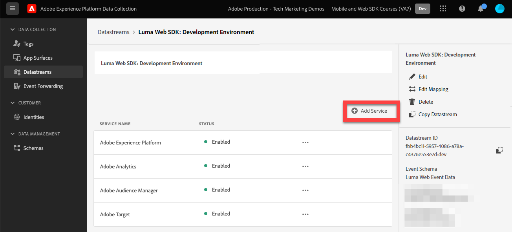
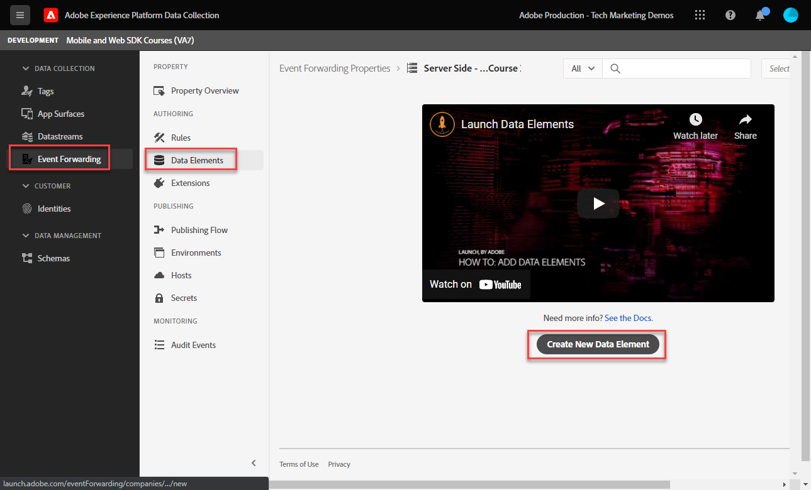

# Einrichten einer Ereignisweiterleitungs-Eigenschaft

Erfahren Sie, wie Sie die Ereignisweiterleitungs-Eigenschaft mithilfe von Experience Platform Web SDK-Daten verwenden.

Die Ereignisweiterleitung ist ein neuer Eigenschaftstyp, der in der Datenerfassung verfügbar ist. Mit der Ereignisweiterleitung können Sie Daten direkt vom Adobe Experience Platform Edge Network an Drittanbieter senden, die keine Adobe sind, und nicht an den herkömmlichen Client-seitigen Browser. Erfahren Sie mehr über die Vorteile der Ereignisweiterleitung im [Übersicht über die Ereignisweiterleitung](https://experienceleague.adobe.com/docs/experience-platform/tags/event-forwarding/overview.html?lang=en).

Um die Ereignisweiterleitung in Adobe Experience Platform zu verwenden, müssen Daten zunächst mit einer oder mehreren der folgenden drei Optionen an Adobe Experience Platform Edge Network gesendet werden:

* [Adobe Experience Platform Web SDK](overview.md)
* [Adobe Experience Platform Mobile SDK](https://developer.adobe.com/client-sdks/documentation/)
  <!--* [Server-to-Server API](https://experienceleague.adobe.com/docs/audience-manager/user-guide/api-and-sdk-code/dcs/dcs-apis/dcs-s2s.html?lang=en)-->

>[!NOTE]
>Das Platform Web SDK und Platform Mobile SDK erfordern keine Implementierung über Tags. Es wird jedoch empfohlen, zum Bereitstellen dieser SDKs Tags zu verwenden.

Nach Abschluss der vorherigen Lektionen in diesem Tutorial sollten Sie mithilfe des Web SDK Daten an Platform Edge Network senden. Sobald sich die Daten im Platform Edge Network befinden, können Sie die Ereignisweiterleitung aktivieren und eine Ereignisweiterleitungseigenschaft verwenden, um Daten an Nicht-Adobe-Lösungen zu senden.

## Lernziele

Am Ende dieser Lektion können Sie:

* Erstellen einer Ereignisweiterleitungs-Eigenschaft
* Verknüpfen einer Ereignisweiterleitungs-Eigenschaft mit einem Platform Web SDK-Datenspeicher
* Machen Sie sich mit den Unterschieden zwischen den Datenelementen und Regeln der Tag-Eigenschaft und den Datenelementen und Regeln der Ereignisweiterleitung vertraut.
* Erstellen eines Datenelements für die Ereignisweiterleitung
* Ereignisweiterleitungsregel konfigurieren
* Überprüfen, ob eine Ereignisweiterleitungseigenschaft Daten erfolgreich sendet

## Voraussetzungen

* Eine Softwarelizenz, die die Ereignisweiterleitung enthält. Die Ereignisweiterleitung ist eine gebührenpflichtige Funktion der Datenerfassung. Weitere Informationen erhalten Sie von Ihrem Adobe-Account-Team.
* Die Ereignisweiterleitung wurde in Ihrer Experience Cloud-Organisation aktiviert.
* Benutzerberechtigung für die Ereignisweiterleitung. (in [Admin Console](https://adminconsole.adobe.com/), unter dem Adobe Experience Platform Launch-Produkt, Berechtigungselemente für[!UICONTROL Plattformen] > [!UICONTROL Edge] und alle [!UICONTROL Eigenschaftsrechte]). Nach der Erteilung sollte [!UICONTROL Ereignisweiterleitung] im linken Navigationsbereich der Datenerfassungsoberfläche:
  

* Adobe Experience Platform Web oder Mobile SDK konfiguriert, um Daten an Edge Network zu senden. Sie müssen die folgenden Lektionen dieses Tutorials abgeschlossen haben:

   * Erstkonfiguration

      * [Konfigurieren eines XDM-Schemas](configure-schemas.md)
      * [Identitäts-Namespace konfigurieren](configure-identities.md)
      * [Konfigurieren eines Datenstroms](configure-datastream.md)

   * Tag-Konfiguration

      * [Installieren der Web SDK-Erweiterung](install-web-sdk.md)
      * [Erstellen von Datenelementen](create-data-elements.md)
      * [Erstellen von Identitäten](create-identities.md)
      * [Erstellen von Tag-Regeln](create-tag-rule.md)
      * [Überprüfen mit dem Adobe Experience Platform-Debugger](validate-with-debugger.md)

## Erstellen einer Ereignisweiterleitungs-Eigenschaft

Erstellen Sie zunächst eine Ereignisweiterleitungs-Eigenschaft:

1. Öffnen Sie die [Datenerfassungsoberfläche](https://experience.adobe.com/#/data-collection)
1. Auswählen **[!UICONTROL Ereignisweiterleitung]** über die linke Navigation
1. Wählen Sie **[!UICONTROL Neue Eigenschaft]** aus.
   

1. Benennen Sie die Eigenschaft. In diesem Fall `Server-Side - Web SDK Course`

1. Wählen Sie **[!UICONTROL Speichern]** aus.
   

## Konfigurieren des Datenspeichers

Damit die Ereignisweiterleitung die an das Edge-Netzwerk gesendeten Daten verwenden kann, müssen Sie die neu erstellte Ereignisweiterleitungs-Eigenschaft mit demselben Datastream verknüpfen, der zum Senden von Daten an Adobe-Lösungen verwendet wird.

So konfigurieren Sie Target im Datastream:

1. Navigieren Sie zu [Datenerfassung](https://experience.adobe.com/#/data-collection){target="blank"} Benutzeroberfläche
1. Wählen Sie im linken Navigationsbereich die Option **[!UICONTROL Datenspeicher]**
1. Wählen Sie die zuvor erstellte `Luma Web SDK: Development Environment` datastream

   

1. Wählen Sie **[!UICONTROL Service hinzufügen]** aus
   
1. Auswählen **[!UICONTROL Ereignisweiterleitung]** als **[!UICONTROL Dienst]**

1. Unter dem **[!UICONTROL Eigenschafts-ID]** Dropdown-Liste den Namen auswählen, den Sie Ihrer Ereignisweiterleitungs-Eigenschaft gegeben haben, in diesem Fall `Server-Side - Web SDK Course`

1. Unter dem **[!UICONTROL Umgebungs-ID]** Dropdown-Liste die Tag-Umgebung auswählen, mit der Sie die Ereignisweiterleitungsumgebung verknüpfen, in diesem Fall `Development`

   >[!TIP]
   >
   >    Um Daten an eine Ereignisweiterleitungsumgebung außerhalb der Adobe-Org zu senden, wählen Sie **[!UICONTROL IDs manuell eingeben]** und fügen Sie eine ID ein. Die ID wird bereitgestellt, wenn Sie eine Ereignisweiterleitungs-Eigenschaft erstellen.

1. Wählen Sie **[!UICONTROL Speichern]** aus.

   

Wiederholen Sie diese Schritte für Staging- und Produktionsdatenspeicher, wenn Sie bereit sind, Ihre Änderungen durch den Veröffentlichungsfluss zu fördern.

## Weiterleiten von Daten vom Platform Edge Network an eine Nicht-Adobe-Lösung

In dieser Übung erfahren Sie, wie Sie ein Datenelement für die Ereignisweiterleitung einrichten, eine Ereignisweiterleitungsregel konfigurieren und mit einem Tool des dritten Teils, dem so genannten [webhook.site](https://webhook.site/).

>[!NOTE]
>
>Ein Webhook ist eine Möglichkeit, verschiedene Systeme in halbEchtzeit zu integrieren. [webhook.site](https://webhook.site/) ist ein Tool von Drittanbietern, mit dem Sie eingehende HTTP-Anfragen oder E-Mails einfach überprüfen, testen und automatisieren können (mit dem visuellen benutzerdefinierten Aktionen-Builder oder WebhookScript).

>[!IMPORTANT]
>
>Sie müssen bereits Datenelemente erstellt und einem XDM-Objekt zugeordnet sowie konfigurierte Tag-Regeln erstellt und diese Änderungen in einer Bibliothek in eine Tag-Umgebung erstellt haben, um fortfahren zu können. Ist dies nicht der Fall, lesen Sie den Abschnitt **Tag-Konfiguration** Schritte in [Voraussetzungen](setup-event-forwarding.md#prerequisites) Abschnitt. Diese Schritte stellen sicher, dass Daten an das Platform Edge Network gesendet werden, und von dort können Sie eine Ereignisweiterleitungs-Eigenschaft konfigurieren, um Daten an eine Nicht-Adobe-Lösung weiterzuleiten.

### Erstellen eines Datenelements für die Ereignisweiterleitung

Das XDM-Objekt, das Sie zuvor mit der Platform Web SDK-Tag-Erweiterung konfiguriert haben, wird zur Datenquelle für Datenelemente in einer Ereignisweiterleitungs-Eigenschaft. Sie verwenden dieselben Daten, die Sie bereits in der Tag-Eigenschaft konfiguriert haben, als Datenquelle für die Ereignisweiterleitung.

>[!IMPORTANT]
>
>Es gibt einen wichtigen Syntaxunterschied beim Referenzieren von XDM-Feldern in der Ereignisweiterleitung gegenüber anderen Kontexten. Um Daten in einer Ereignisweiterleitungs-Eigenschaft zu referenzieren, muss der Datenelementpfad die Variable `arc.event` prefix:
>
> * `arc` steht für Adobe Response Context.
> * Beispiel: `arc.event.xdm.web.webPageDetails.URL`
>
>Wenn dieser Pfad falsch angegeben ist, werden keine Daten erfasst.

In dieser Übung leiten Sie die Höhe des Browser-Viewports und die Experience Cloud-ID vom XDM-Objekt an einen Webhook weiter. Der Pfad des XDM-Felds wird durch das XDM-Schema bestimmt, das während der [Konfigurieren eines XDM-Schemas](configure-schemas.md) Lektion.

>[!TIP]
>
>Sie können den Pfad des XDM-Objekts auch mithilfe Ihrer Webbrowser-Netzwerkwerkzeuge finden, indem Sie nach `/ee` Anforderungen, Beacon öffnen [!UICONTROL **Nutzlast**] und bohren bis zur gesuchten Variablen. Klicken Sie dann mit der rechten Maustaste und wählen Sie &quot;Eigenschaftspfad kopieren&quot;. Im Folgenden finden Sie ein Beispiel für die Höhe des Browser Viewports:
> 

1. Navigieren Sie zu **[!UICONTROL Ereignisweiterleitung]** -Eigenschaft, die Sie kürzlich erstellt haben

1. Wählen Sie im linken Navigationsbereich die Option **[!UICONTROL Datenelemente]**

1. Auswählen **[!UICONTROL Neues Datenelement erstellen]**

   

1. **[!UICONTROL Name]** das Datenelement `environment.browserDetails.viewportHeight`

1. under **[!UICONTROL Erweiterung]**, verlassen `CORE`

1. under **[!UICONTROL Datenelementtyp]** auswählen `Path`

1. Geben Sie den XDM-Objektpfad ein, der die Höhe des Browser-Viewports enthält. `arc.event.xdm.environment.browserDetails.viewportHeight`

1. Wählen Sie **[!UICONTROL Speichern]** aus

   

1. Erstellen eines weiteren Datenelements

1. **[!UICONTROL Name]** it `ecid`

1. under **[!UICONTROL Erweiterung]**, verlassen `CORE`

1. under **[!UICONTROL Datenelementtyp]** auswählen `Path`

1. Geben Sie den XDM-Objektpfad ein, der die Experience Cloud-ID enthält `arc.event.xdm.identityMap.ECID.0.id`

1. Wählen Sie **[!UICONTROL Speichern]** aus

   

   >[!CAUTION]
   >
   > Stellen Sie sicher, dass Sie die `arc.event.` -Präfix im Pfad. Achten Sie außerdem darauf, den genauen Fall als XDM-Objektfeldname zu befolgen. Der ECID-Namespace muss in Großbuchstaben sein.

   >[!TIP]
   >
   >Wenn Sie mit Ihrer eigenen Website arbeiten, können Sie den XDM-Objektpfad mit Ihren Webbrowser-Netzwerkwerkzeugen finden und nach `/ee` Anforderungen, Beacon öffnen [!UICONTROL **Nutzlast**] und bohren bis zur gesuchten Variablen. Klicken Sie dann mit der rechten Maustaste und wählen Sie &quot;Eigenschaftspfad kopieren&quot;. Im Folgenden finden Sie ein Beispiel für die Höhe des Browser Viewports:
   > 

### Installieren der Adobe Cloud Connector-Erweiterung

Um Daten an Drittanbieterstandorte zu senden, installieren Sie zunächst die [!UICONTROL Adobe Cloud Connector] -Erweiterung.

1. Auswählen **[!UICONTROL Erweiterungen]** im linken Navigationsbereich

1. Wählen Sie die **[!UICONTROL Katalog]** tab

1. Suchen Sie nach **[!UICONTROL Adobe Cloud Connector]** auswählen **[!UICONTROL Installieren]**

   

Es ist keine Erweiterungskonfiguration erforderlich. Mit dieser Erweiterung können Sie jetzt Daten an eine Nicht-Adobe-Lösung weiterleiten!

### Erstellen einer Ereignisweiterleitungsregel

Es gibt einige Hauptunterschiede zwischen dem Konfigurieren von Regeln in einer Tag-Eigenschaft und einer Regel in einer Ereignisweiterleitungs-Eigenschaft:

* **[!UICONTROL Veranstaltungen] &amp; [!UICONTROL Bedingungen]**:

   * **Tags**: Alle Regeln werden durch ein Ereignis ausgelöst, das in der Regel angegeben werden muss, beispielsweise `Library Loaded - Page Top`. Bedingungen sind optional.
   * **Ereignisweiterleitung**: Es wird davon ausgegangen, dass jedes Ereignis, das an Platform Edge Network gesendet wird, ein Trigger zum Weiterleiten von Daten ist. Daher gibt es keine [!UICONTROL Veranstaltungen] muss in Ereignisweiterleitungsregeln ausgewählt werden. Um zu verwalten, welche Ereignisse Trigger einer Ereignisweiterleitungsregel sind, müssen Sie Bedingungen konfigurieren.

* **Tokenisierung von Datenelementen**:

   * **Tags**: Datenelementnamen werden mit einem -Token versehen. `%` am Anfang und am Ende des Datenelementnamens, wenn dieser in einer Regel verwendet wird. Beispiel: `%viewportHeight%`.

   * **Ereignisweiterleitung**: Datenelementnamen werden mit einem -Token versehen. `{{` am Anfang und `}}` am Ende des Datenelementnamens, wenn dieser in einer Regel verwendet wird. Beispiel: `{{viewportHeight}}`.

* **Sequenz von Regelaktionen**:

   * Der Abschnitt Aktionen einer Ereignisweiterleitungsregel wird immer nacheinander ausgeführt. Stellen Sie also beim Speichern einer Regel sicher, dass die Reihenfolge der Aktionen korrekt ist. Diese Ausführungsreihenfolge kann im Gegensatz zu Tags nicht asynchron ausgeführt werden.

<!--
  * **Tags**: Rule actions can easily be reordered using drag-and-drop functionality.
  * **Event forwarding**: Rule actions are always executed sequentially. Make sure the order of actions is correct when you save a rule.
-->

Um eine Regel zum Weiterleiten von Daten an Ihren Webhook zu konfigurieren, müssen Sie zunächst Ihren persönlichen Webhook abrufen:

1. Navigieren Sie zu [webhook.site](https://webhook.site)

1. Suchen **Ihre eindeutige URL** verwenden, werden Sie dies als URL-Anfrage in Ihrer Ereignisweiterleitungsregel verwenden.

1. Auswählen **[!UICONTROL In Zwischenablage kopieren]**

1. Lassen Sie dieses Fenster geöffnet, da Sie die Ereignisweiterleitungsdaten in Echtzeit überprüfen können, die von Webhook erfasst werden

   

1. Zurück **[!UICONTROL Datenerfassung]** > **[!UICONTROL Ereignisweiterleitung]** > **[!UICONTROL Regeln]** über die linke Navigation

1. Auswählen **[!UICONTROL Neue Regel erstellen]**

   

1. Benennen Sie ihn `all events - ad cloud connector - webhook`

1. Hinzufügen einer Aktion

1. under **[!UICONTROL Erweiterung]** auswählen **[!UICONTROL Adobe Cloud Connector]**

1. under **[!UICONTROL Aktionstyp]** auswählen **[!UICONTROL Abrufen eines Aufrufs]**

1. Fügen Sie Ihre Webhook-URL in die **[!UICONTROL URL]** field

   

1. under **[Abfrageparameter]**, fügen Sie beide zuvor erstellten Datenelemente hinzu.

1. Im **[!UICONTROL Schlüssel]** Spaltentyp in `viewPortHeight`. Im **[!UICONTROL Wert]** die Spalte `{{environment.browserDetails.viewportHeight}}` Datenelement durch Eingabe in oder Auswahl über das Symbol für die Datenelementauswahl

1. Auswählen [!UICONTROL **+ Hinzufügen weiterer**] Hinzufügen eines weiteren Abfrageparameters

1. Im **[!UICONTROL Schlüssel]** Spaltentyp in `ecid`. Geben Sie in der Spalte Wert die `{{ecid}}` Datenelement

1. Auswählen **[!UICONTROL Änderungen beibehalten]**

   

1. Ihre Regel sollte wie unten aussehen

1. Wählen Sie **[!UICONTROL Speichern]** aus

   

### Erstellen und Erstellen der Bibliothek

Erstellen Sie eine Bibliothek und erstellen Sie alle Änderungen an Ihrer Entwicklungsumgebung für die Ereignisweiterleitung, wie Sie es normalerweise in einer Tag-Eigenschaft tun würden.

>[!NOTE]
>
>Wenn Sie die Eigenschaften für die Staging- und Produktions-Ereignisweiterleitung nicht mit Ihrem Datastream verknüpft haben, sehen Sie die Entwicklungsumgebung als einzige Option zum Erstellen einer Bibliothek für .

## Validieren der Ereignisweiterleitungsregel

Jetzt können Sie Ihre Eigenschaft für die Ereignisweiterleitung mit dem Platform Debugger und Webhook.site validieren:

1. Führen Sie die Schritte aus, um [Tag-Bibliothek wechseln](validate-with-debugger.md#use-the-experience-platform-debugger-to-map-to-your-tag-property) auf [Demosite &quot;Luma&quot;](https://luma.enablementadobe.com/content/luma/us/en/men.html) zur Web SDK-Tag-Eigenschaft, der Sie Ihre Eigenschaft für die Ereignisweiterleitung im Datastream zugeordnet haben.

1. Bevor Sie die Seite neu laden, öffnen Sie auf dem Experience Platform Debugger **[!UICONTROL Protokolle]** über die linke Navigation

1. Wählen Sie die **[!UICONTROL Edge]** Registerkarte und wählen Sie **[!UICONTROL Verbinden]** Anzeigen der Anforderungen des Platform Edge Network

   

1. Seite neu laden

1. Es werden zusätzliche Anfragen angezeigt, die Ihnen einen Einblick in die serverseitigen Anforderungen geben, die vom Platform Edge Network an WebHook gesendet werden.

1. Die Anfrage, die Validierung auf zu konzentrieren, zeigt die vollständig erstellte URL, die vom Edge-Netzwerk gesendet wird.

   

1. Beachten Sie die Abfragezeichenfolgenparameter viewPortHeight und ecid .

   

1. Sie stimmen mit den im XDM-Objekt angezeigten Daten überein.

   

1. Überprüfen Sie abschließend die Datenübereinstimmungen in [webhook.site](https://webhook.site) sowie durch Ansicht des geöffneten Webhook-Fensters

   

Herzlichen Glückwunsch! Sie haben die Ereignisweiterleitung konfiguriert!

[Weiter: ](conclusion.md)

>[!NOTE]
>
>Vielen Dank, dass Sie Ihre Zeit investiert haben, um mehr über das Adobe Experience Platform Web SDK zu erfahren. Wenn Sie Fragen haben, ein allgemeines Feedback teilen möchten oder Vorschläge zu künftigen Inhalten haben, teilen Sie diese bitte mit. [Experience League Community-Diskussionsbeitrag](https://experienceleaguecommunities.adobe.com/t5/adobe-experience-platform-launch/tutorial-discussion-implement-adobe-experience-cloud-with-web/td-p/444996)