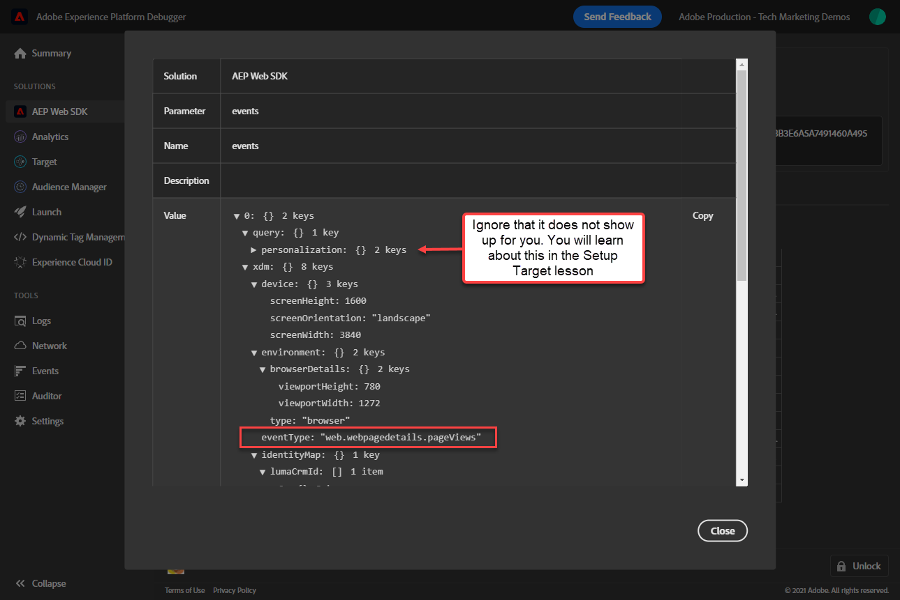

# WebSDK-Implementierungen mit Experience Platform Debugger validieren

Erfahren Sie, wie Sie Ihre Platform Web SDK-Implementierung mit Adobe Experience Platform Debugger validieren.

Der Experience Platform Debugger ist eine Erweiterung, die für Chrome- und Firefox-Browser verfügbar ist und Ihnen dabei hilft, die auf Ihren Webseiten implementierte Adobe-Technologie zu sehen. Laden Sie die Version für Ihren bevorzugten Browser herunter:

* [Firefox-Erweiterung](https://addons.mozilla.org/de/firefox/addon/adobe-experience-platform-dbg/)
* [Chrome-Erweiterung](https://chrome.google.com/webstore/detail/adobe-experience-platform/bfnnokhpnncpkdmbokanobigaccjkpob)

Wenn Sie den Debugger noch nie verwendet haben und dieser sich vom älteren Adobe Experience Cloud Debugger unterscheidet, sollten Sie sich dieses fünfminütige Übersichtsvideo ansehen:

>[!VIDEO](https://video.tv.adobe.com/v/32156?learn=on)

In dieser Lektion verwenden Sie die [Adobe Experience Cloud Debugger-Erweiterung](https://chrome.google.com/webstore/detail/adobe-experience-cloud-de/ocdmogmohccmeicdhlhhgepeaijenapj) , um die Tag-Eigenschaft zu ersetzen, die auf der fest codiert ist. [Demosite &quot;Luma&quot;](https://luma.enablementadobe.com/content/luma/us/en.html) mit Ihrer eigenen Eigenschaft.

Diese Technik wird als Umgebungswechsel bezeichnet und ist später hilfreich, wenn Sie mit Tags auf Ihrer eigenen Website arbeiten. Sie können Ihre Produktions-Website in Ihren Browser laden, jedoch mit Ihrem *development* Tagumgebung. Mit dieser Funktion können Sie sicher Änderungen an Tags vornehmen und überprüfen - unabhängig von Ihren normalen Codeversionen. Schließlich ist diese Trennung der Marketing-Tag-Versionen von Ihren normalen Codeversionen einer der Hauptgründe, warum Kunden Tags überhaupt verwenden!

## Lernziele

Am Ende dieser Lektion können Sie den Debugger für Folgendes verwenden:

* Alternative Tag-Bibliothek laden
* Validieren Sie, ob das clientseitige XDM-Ereignis Daten erfasst und wie erwartet an Platform Edge Network sendet.
* Aktivieren Sie Edge Trace, um serverseitige Anforderungen anzuzeigen, die vom Platform Edge Network gesendet werden.
* Starten Sie eine Adobe Experience Platform Assurance-Sitzung, um eine vom Platform Edge Network generierte Experience Cloud-ID anzuzeigen.

## Voraussetzungen

Sie kennen Datenerfassungs-Tags und die [Demosite &quot;Luma&quot;](https://luma.enablementadobe.com/content/luma/us/en.html){target="_blank"} und haben die folgenden vorherigen Lektionen im Tutorial abgeschlossen:

* [Konfigurieren eines XDM-Schemas](configure-schemas.md)
* [Identitäts-Namespace konfigurieren](configure-identities.md)
* [Konfigurieren eines Datenstroms](configure-datastream.md)
* [In der Tag-Eigenschaft installierte Web SDK-Erweiterung](install-web-sdk.md)
* [Erstellen von Datenelementen](create-data-elements.md)
* [Erstellen von Identitäten](create-identities.md)
* [Tag-Regel erstellen](create-tag-rule.md)

## Alternative Tag-Bibliotheken mit Debugger laden

Dieses Tutorial verwendet eine öffentlich gehostete Version des [Demowebsite für Luma](https://luma.enablementadobe.com/content/luma/us/en.html). Öffnen Sie die Homepage und markieren Sie sie mit einem Lesezeichen.

Der Experience Platform Debugger verfügt über eine coole Funktion, mit der Sie eine vorhandene Tag-Bibliothek durch eine andere ersetzen können. Diese Technik ist für die Validierung nützlich und ermöglicht es uns, viele Implementierungsschritte in diesem Tutorial zu überspringen.

1. Stellen Sie sicher, dass die Site &quot;Luma&quot;geöffnet ist, und wählen Sie das Symbol für die Experience Platform Debugger-Erweiterung aus.
1. Der Debugger wird geöffnet und zeigt einige Details zur hartcodierten Implementierung an, die nicht mit diesem Tutorial in Zusammenhang steht (Sie müssen die Site &quot;Luma&quot;möglicherweise neu laden, nachdem Sie den Debugger geöffnet haben).
1. Vergewissern Sie sich, dass der Debugger &quot;**[!UICONTROL Verbunden mit Luma]**&quot;, wie unten dargestellt, und wählen Sie dann &quot;**[!UICONTROL lock]**&quot;, um den Debugger mit der Site &quot;Luma&quot;zu sperren.
1. Wählen Sie die **[!UICONTROL Anmelden]** und melden Sie sich mit Ihrer Adobe ID bei Adobe Experience Cloud an.
1. Gehen Sie jetzt zu **[!UICONTROL Experience Platform-Tags]** in der linken Navigation

   

1. Wählen Sie die **[!UICONTROL Konfiguration]** tab
1. Rechts neben dem Ort, an dem Sie die **[!UICONTROL Seiten-Einbettungscodes]**, öffnen Sie die **[!UICONTROL Aktionen]** und wählen Sie **[!UICONTROL Ersetzen]**

   

1. Da Sie authentifiziert sind, ruft der Debugger Ihre verfügbaren Tag-Eigenschaften und -Umgebungen ab. Wählen Sie Ihre Eigenschaft aus. In diesem Fall `Web SDK Course 3`
1. Wählen Sie `Development` Umgebung
1. Wählen Sie die **[!UICONTROL Anwenden]** button

   

1. Die Luma-Website wird jetzt neu geladen _mit einer eigenen Tag-Eigenschaft_.

   

Während Sie das Tutorial fortsetzen, verwenden Sie diese Methode, um die Site &quot;Luma&quot;Ihrer eigenen Tag-Eigenschaft zuzuordnen und Ihre Platform Web SDK-Implementierung zu validieren. Wenn Sie mit der Verwendung von Tags auf Ihrer Produktions-Website beginnen, können Sie dieselbe Methode verwenden, um Änderungen zu validieren.

## Clientseitige Netzwerkanfragen mit Experience Platform Debugger überprüfen

Sie können den Debugger verwenden, um Client-seitige Beacons zu überprüfen, die von Ihrer Platform Web SDK-Implementierung ausgelöst wurden, um die an Platform Edge Network gesendeten Daten anzuzeigen:

1. Navigieren Sie zu **[!UICONTROL Zusammenfassung]** in der linken Navigation, um die Details Ihrer Tag-Eigenschaft anzuzeigen

   

1. Gehen Sie jetzt zu **[!UICONTROL Experience Platform Web SDK]** in der linken Navigation, um die **[!UICONTROL Netzwerkanforderungen]**
1. Öffnen Sie die **[!UICONTROL events]** row

   

1. Beachten Sie, dass die `web.webpagedetails.pageView` Ereignistyp, den Sie in Ihrer [!UICONTROL Variable aktualisieren] und anderen nativen Variablen, die der `AEP Web SDK ExperienceEvent` Feldergruppe

   

1. Scrollen Sie nach unten zum `web` -Objekt, wählen Sie aus, um es zu öffnen und die `webPageDetails.name`, `webPageDetails.server`, und `webPageDetails.siteSection`. Sie sollten mit dem entsprechenden übereinstimmen `digitalData` Datenschichtvariablen auf der Homepage

>[!TIP]
>
> Anzeigen und Vergleichen von `digitalData` Datenschicht auf der Homepage:
>
> 1. Öffnen Sie auf der Startseite von Luma die Browser-Entwicklertools. Wählen Sie im Fall von Chrome die Schaltfläche `F12` auf der Tastatur
> 1. Wählen Sie die **[!UICONTROL Konsole]** tab
> 1. Eingabe `digitalData` und wählen `Enter` auf der Tastatur zum Anzeigen der Datenschichtwerte

Sie können auch die Identitätszuordnungsdetails überprüfen:

1. Melden Sie sich mit den Anmeldedaten bei der Site &quot;Luma&quot;an `test@adobe.com`/`test`

1. Kehren Sie zur [Startseite „Luma“](https://luma.enablementadobe.com/content/luma/us/en.html) zurück.

1. Öffnen Sie die **[!UICONTROL Experience Platform Web SDK]** im linken Navigationsbereich

   

1. Wählen Sie die **[!UICONTROL events]** Zeile zum Öffnen von Details in einem Popup-Fenster

   

1. Suchen Sie nach **identityMap** innerhalb des Popup-Fensters. Hier sollten Sie sehen `lumaCrmId` mit drei Schlüsseln von authenticatedState, id und primary:
   

### Clientseitige Anforderungen mit Browserdev-Tools überprüfen

Diese Arten von Anforderungsdetails sind auch in den Webentwickler-Tools des Browsers sichtbar. **Netzwerk** Registerkarte (vorausgesetzt, die Website lädt Ihre Tag-Bibliothek).

1. Öffnen Sie die Webentwickler-Tools des Browsers. **Netzwerk** und laden Sie die Seite neu. Filtern von Aufrufen mit `/ee` Um den Aufruf zu finden, wählen Sie ihn aus und sehen Sie sich dann im **Kopfzeilen** und **Nutzlast** tab

   

1. Navigieren Sie zu **Reaktion** und beachten Sie, wie der ECID-Wert in der Antwort enthalten ist. Kopieren Sie diesen Wert, da Sie ihn verwenden werden, um die Profilinformationen in der nächsten Übung zu überprüfen.

   

## Serverseitige Netzwerkanforderungen mit Experience Platform Debugger überprüfen

Wie Sie in der [Konfigurieren eines Datenspeichers](configure-datastream.md) Lektion: Das Platform Web SDK sendet zunächst Daten aus Ihrer digitalen Eigenschaft an Platform Edge Network. Anschließend sendet das Platform Edge Network zusätzliche serverseitige Anfragen an die entsprechenden Dienste, die in Ihrem Datastream aktiviert sind.

Sie können serverseitige Anforderungen überprüfen, indem Sie Edge Trace im Debugger aktivieren. Darüber hinaus können Sie die vollständig verarbeitete Payload validieren, nachdem sie eine Adobe-Anwendung erreicht hat, indem Sie [Adobe Experience Platform Assurance](https://experienceleague.adobe.com/docs/experience-platform/assurance/home.html?lang=en).

In den nächsten beiden Übungen aktivieren Sie Edge Trace und zeigen die Experience Cloud-ID an, die mithilfe von Assurance vom Platform Edge Network generiert wurde.

### Edge Trace aktivieren

So aktivieren Sie den Edge Trace

1. In der linken Navigation von **[!UICONTROL Experience Platform Debugger]** select **[!UICONTROL Protokolle]**
1. Wählen Sie die **[!UICONTROL Edge]** und wählen Sie **[!UICONTROL Verbinden]**

   

1. Derzeit ist er leer

   

1. Aktualisieren Sie die [Luma-Homepage](https://luma.enablementadobe.com/) und überprüfen **[!UICONTROL Experience Platform Debugger]** erneut anzeigen, um zu sehen, wie Daten durchkommen.

   

Sie können zu diesem Zeitpunkt keine Platform Edge Network-Anfragen für eine Adobe-Anwendung anzeigen, da Sie im Datastream keine aktiviert haben. In zukünftigen Lektionen verwenden Sie Edge Trace, um die ausgehenden serverseitigen Anforderungen an Adobe-Anwendungen anzuzeigen. Mit Assurance können Sie jedoch weiterhin die Experience Cloud-ID anzeigen, die vom Platform Edge Network generiert wurde.

### Starten einer Assurance-Sitzung

Adobe Experience Platform Assurance ist ein Produkt aus Adobe Experience Cloud, mit dem Sie die Datenerfassung und Bereitstellung von Erlebnissen überprüfen, testen, simulieren und validieren können.

Mehr dazu [Adobe Assurance](https://experienceleague.adobe.com/docs/experience-platform/assurance/home.html?lang=en).

Jedes Mal, wenn Sie Edge Trace aktivieren, wird eine Zuverlässigkeitssitzung im Hintergrund gestartet.

So zeigen Sie die Assurance-Sitzung an:

1. Wenn Edge Trace aktiviert ist, sehen Sie oben ein Symbol für einen ausgehenden Link. Wählen Sie das Symbol aus, um &quot;Versicherung&quot;zu öffnen. Eine neue Registerkarte in Ihrem Browser wird geöffnet.

   

1. Wählen Sie die Zeile mit dem Ereignis Adobe Response Handle aus.
1. Rechts wird ein Menü angezeigt. Wählen Sie die `+` neben `[!UICONTROL ACPExtensionEvent]`
1. Drilldown durch Auswahl von `[!UICONTROL payload > 0 > payload > 0 > namespace]`. Die unter der letzten `0` entspricht `ECID`. Sie wissen dies anhand des Wertes, der unter `namespace` Abgleich `ECID`

   

   >[!CAUTION]
   >
   >Aufgrund der Breite Ihres Fensters wird möglicherweise ein abgeschnittener ECID-Wert angezeigt. Wählen Sie einfach die Griffleiste in der Benutzeroberfläche aus und ziehen Sie sie nach links, um die gesamte ECID anzuzeigen.

In zukünftigen Lektionen verwenden Sie Assurance, um vollständig verarbeitete Payloads zu validieren und eine Adobe-Anwendung zu erreichen, die in Ihrem Datastream aktiviert ist.

Da jetzt ein XDM-Objekt auf einer Seite ausgelöst wird und Sie wissen, wie Sie Ihre Datenerfassung überprüfen können, können Sie die einzelnen Adobe-Anwendungen mithilfe des Platform Web SDK einrichten.

[Weiter: ](setup-experience-platform.md)

>[!NOTE]
>
>Vielen Dank, dass Sie Ihre Zeit investiert haben, um mehr über das Adobe Experience Platform Web SDK zu erfahren. Wenn Sie Fragen haben, ein allgemeines Feedback teilen möchten oder Vorschläge zu künftigen Inhalten haben, teilen Sie diese bitte mit. [Experience League Community-Diskussionsbeitrag](https://experienceleaguecommunities.adobe.com/t5/adobe-experience-platform-launch/tutorial-discussion-implement-adobe-experience-cloud-with-web/td-p/444996)