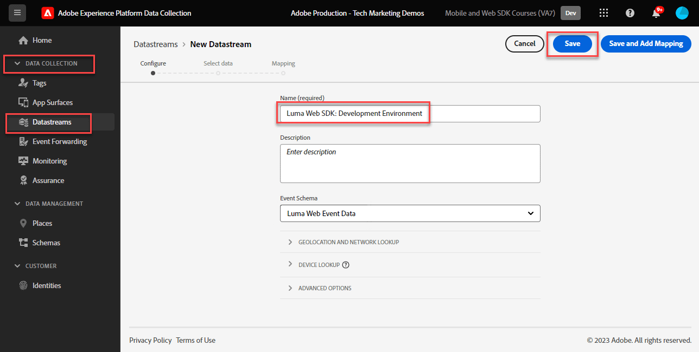

# Konfigurieren eines Datenstroms

Erfahren Sie, wie Sie einen Datastrom für das Adobe Experience Platform Web SDK konfigurieren.

[Datastreams](https://experienceleague.adobe.com/de/docs/experience-platform/datastreams/overview) gibt Adobe Experience Platform Edge Network an, wohin vom Platform Web SDK erfasste Daten gesendet werden sollen. In der Konfiguration der Datenspeicher aktivieren Sie Ihre Experience Cloud-Anwendungen, Ihr Experience Platform-Konto und die Ereignisweiterleitung.

## Lernziele

Am Ende dieser Lektion können Sie:

* Erstellen eines Datenspeichers
* Erste Schritte mit Datastream-Überschreibungen

## Voraussetzungen

Bevor Sie Ihren Datastream konfigurieren, müssen Sie bereits die folgenden Lektionen abgeschlossen haben:

* [Schema konfigurieren](configure-schemas.md)
* [Identitäts-Namespace konfigurieren](configure-identities.md)

## Erstellen eines Datenspeichers

Jetzt können Sie einen Datastream erstellen, um Platform Edge Network mitzuteilen, wohin vom Web SDK erfasste Daten gesendet werden sollen.

**So erstellen Sie einen Datastream:**

1. Öffnen Sie die [Datenerfassungsschnittstelle](https://launch.adobe.com/){target="_blank"} .
1. Vergewissern Sie sich, dass Sie sich in der richtigen Sandbox befinden

   >[!NOTE]
   >
   >Wenn Sie Platform-basierte Anwendungen wie Real-Time CDP oder Journey Optimizer nutzen, empfehlen wir für dieses Tutorial die Verwendung einer Entwicklungs-Sandbox. Ist dies nicht der Fall, verwenden Sie die Sandbox **[!UICONTROL Prod]** .

1. Navigieren Sie in der linken Navigation zu **[!UICONTROL Datastreams]** .
1. Wählen Sie **[!UICONTROL New Datastream]** aus.
1. Geben Sie `Luma Web SDK: Development Environment` als **[!UICONTROL Name]** ein. Dieser Name wird später referenziert, wenn Sie die Web SDK-Erweiterung in Ihrer Tag-Eigenschaft konfigurieren.
1. Wählen Sie **[!UICONTROL Speichern]** aus.

   

   >[!NOTE]
   >
   >Sie müssen kein Schema auswählen. Eine Schemaauswahl ist nur erforderlich, wenn Sie die Funktion [Datenvorbereitung für die Datenerfassung](/help/data-collection/edge/data-prep.md) verwenden.

Auf dem nächsten Bildschirm können Sie Dienste wie Adobe-Anwendungen zum Datastream hinzufügen. Sie werden jedoch zu diesem Zeitpunkt keine Dienste hinzufügen. Sie werden dies später in den Lektionen [Einrichten von Experience Platform](setup-experience-platform.md), [Einrichten von Analytics](setup-analytics.md), [Einrichten von Audience Manager](setup-audience-manager.md), [Einrichten von Target](setup-target.md) oder [Weiterleitung von Ereignissen](setup-event-forwarding.md) tun.

>[!NOTE]
>
>Bei der Implementierung des Platform Web SDK auf Ihrer eigenen Website sollten Sie drei Datenspeicher erstellen, die Ihren drei Tag-Umgebungen (Entwicklung, Staging und Produktion) zugeordnet werden. Wenn Sie das Platform Web SDK mit Platform-basierten Anwendungen wie Adobe Real-time Customer Data Platform oder Adobe Journey Optimizer verwenden, sollten Sie sicherstellen, dass Sie diese Datenspeicher in den entsprechenden Platform-Sandboxes erstellen.

## Überschreiben eines Datastreams

Mit [Datastream overrides](https://experienceleague.adobe.com/en/docs/experience-platform/datastreams/overrides) können Sie zusätzliche Konfigurationen für Ihren Datenspeicher definieren und dann Ihre Standardkonfiguration unter bestimmten Bedingungen überschreiben.

Die Außerkraftsetzung der Datastream-Konfiguration erfolgt in zwei Schritten:

1. Zunächst definieren Sie in der Konfiguration des Datastream-Dienstes Überschreibungen von Datastream. Sie können beispielsweise alternative Analytics Report Suites, Target-Arbeitsbereiche oder Platform-Datensätze definieren, die als Überschreibungen verwendet werden sollen.
1. Anschließend senden Sie die Überschreibungen entweder mit einer Web SDK-Sendeereignisaktion oder durch eine Konfiguration in der Web SDK-Tag-Erweiterung an das Edge Network.

In der Lektion [Einrichten von Adobe Analytics](setup-analytics.md) überschreiben Sie die Report Suite für eine Seite mit der Plattform Web SDK-Sendeereignisaktion.

Sie können jetzt die Platform Web SDK-Erweiterung in Ihrer Tag-Eigenschaft installieren!

[Weiter: ](install-web-sdk.md)

>[!NOTE]
>
>Vielen Dank, dass Sie Ihre Zeit investiert haben, um mehr über das Adobe Experience Platform Web SDK zu erfahren. Wenn Sie Fragen haben, ein allgemeines Feedback teilen oder Anregungen zu künftigen Inhalten haben möchten, teilen Sie diese bitte in diesem [Experience League Community-Diskussionsbeitrag](https://experienceleaguecommunities.adobe.com/t5/adobe-experience-platform-data/tutorial-discussion-implement-adobe-experience-cloud-with-web/td-p/444996) mit.
