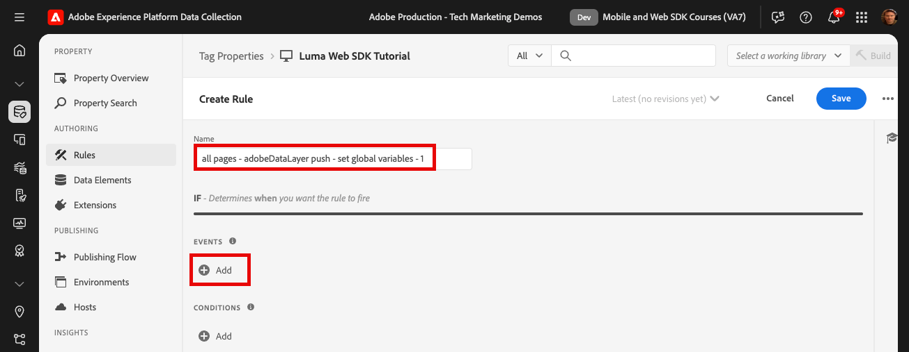
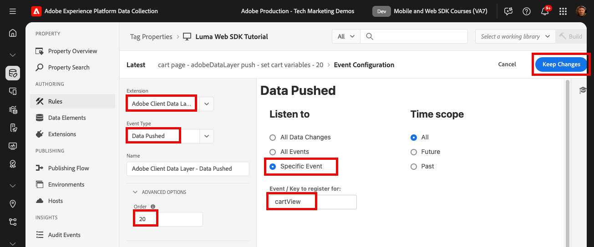
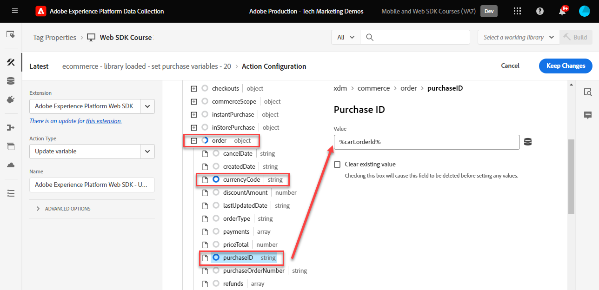
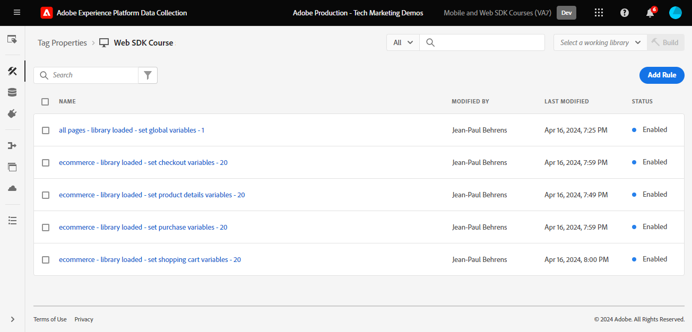

# Tag-Regeln erstellen

Erfahren Sie, wie Sie Ereignisse mithilfe von Tag-Regeln mit Ihrem XDM-Objekt an Adobe Experience Platform Edge Network senden. Eine Tag-Regel ist eine Kombination aus Ereignissen, Bedingungen und Aktionen, die die Tag-Eigenschaft anweist, etwas zu tun. Bei Platform Web SDK werden Regeln verwendet, um Ereignisse mit den richtigen Daten an Platform Edge Network zu senden.

## Lernziele

Am Ende dieser Lektion können Sie:

* Verwenden einer Namenskonvention zum Verwalten von Regeln in Tags
* Senden eines Ereignisses mit XDM-Feldern mithilfe der Aktionen „Variable aktualisieren“ und „Ereignis senden“
* Stapeln mehrerer Sätze von XDM-Feldern über mehrere Regeln hinweg
* Ordnen Sie einzelne oder gesamte Array-Datenelemente dem XDM-Objekt zu
* Veröffentlichen einer Tag-Regel in einer Entwicklungsbibliothek

## Voraussetzungen

Sie sind mit Datenerfassungs-Tags und der [Demo-Site von Luma](https://newluma.enablementadobe.com) vertraut und haben die vorherigen Lektionen im Tutorial abgeschlossen:

* [Konfigurieren eines XDM-Schemas](configure-schemas.md)
* [Konfigurieren eines Identity-Namespace](configure-identities.md)
* [Konfigurieren eines Datenstroms](configure-datastream.md)
* [Installieren der Web SDK-Erweiterung](install-web-sdk.md)
* [Datenelemente erstellen](create-data-elements.md)
* [Erstellen von Identitäten](create-identities.md)

## Benennungskonventionen

Um Regeln in Tags zu verwalten, wird empfohlen, eine standardmäßige Namenskonvention zu befolgen. In diesem Tutorial wird eine fünfteilige Namenskonvention verwendet:

* [**Location**] - [**Event**] - [**Purpose**] - [**order**]

wenn:

1. **location** die Seite(n) auf der Site, auf der die Regel ausgelöst wird
1. **event** ist der Trigger für die Regel
1. **Zweck** ist die Hauptaktion, die von der Regel ausgeführt wird
1. **order** ist die Reihenfolge, in der die Regel im Verhältnis zu anderen Regeln ausgelöst werden soll
<!-- minor update -->

## Hinzufügen der Adobe Client-Datenschicht-Erweiterung

Die Luma-Website verwendet eine ereignisgesteuerte Datenschicht namens Adobe Client Data Layer (ACDL). Jedes Mal, wenn ein Ereignis auftritt, wird es in das `adobeDataLayer`-Array verschoben. Wir werden diese Ereignisse verwenden, um unsere Regeln zu erstellen, obwohl es viele vordefinierte Optionen gibt.

1. Navigieren Sie zu **[!UICONTROL Erweiterungen]**
1. Nach **[!UICONTROL Adobe Client-Datenschicht filtern]**
1. Wählen Sie **[!UICONTROL Installieren]**

   

1. Standardeinstellungen beibehalten
1. Wählen Sie **[!UICONTROL Speichern]**

## Tag-Regeln erstellen

In Tags werden Regeln verwendet, um Aktionen (Feueraufrufe) unter verschiedenen Bedingungen auszuführen. Die Platform Web SDK Tags-Erweiterung umfasst zwei Aktionen, die in Regeln verwendet werden:

* **[!UICONTROL Variable aktualisieren]** ordnet Datenelemente Ihren XDM- oder Datenvariablen zu
* **[!UICONTROL Ereignis senden]** sendet die Daten an Experience Platform Edge Network

Im weiteren Verlauf dieser Lektion werden wir:

1. Verwenden Sie die Aktion **[!UICONTROL Variable aktualisieren]**, um eine „globale Konfiguration“ von XDM-Feldern zu definieren.

1. Verwenden Sie die Aktion **[!UICONTROL Variable aktualisieren]** die unsere „globale Konfiguration“ überschreiben und unter bestimmten Bedingungen zusätzliche XDM-Felder bereitstellen (z. B. Hinzufügen von Produktdetails auf Produktseiten).

1. Verwenden Sie die Aktion **[!UICONTROL Ereignis senden]** um alle Daten, die wir an Adobe Experience Platform Edge Network senden möchten, zu senden.

Alle diese Regeln werden ordnungsgemäß mit der Option &quot;[!UICONTROL &quot; &#x200B;].

In diesem Video erhalten Sie einen Überblick über den Prozess:

>[!VIDEO](https://video.tv.adobe.com/v/3427710/?learn=on&enablevpops)

### Globale Konfigurationsfelder

Erstellen einer Tag-Regel für die globalen XDM-Felder:

1. Öffnen Sie die Tag-Eigenschaft, die Sie für dieses Tutorial verwenden

1. Navigieren Sie **[!UICONTROL linken Navigationsbereich zu]** Regeln“

1. Klicken Sie auf **[!UICONTROL Schaltfläche „Neue Regel]**&quot;

   

1. Geben Sie einen Namen für die Regel ein `all pages - adobeDataLayer push - set global variables - 1`.

1. Wählen Sie **[!UICONTROL Abschnitt]** Ereignisse“ **[!UICONTROL Hinzufügen]**

   

1. Verwenden Sie die Erweiterung **[!UICONTROL Adobe Client Data Layer]** und wählen Sie **[!UICONTROL Data Push]** als **[!UICONTROL Ereignistyp]**

1. Wählen Sie **[!UICONTROL Dropdown-]** „Erweitert“ aus und geben Sie `1` als **[!UICONTROL ein]**

   >[!NOTE]
   >
   > Je niedriger die Ordnungszahl, desto früher wird sie ausgeführt. Daher geben wir unserer „globalen Konfiguration“ eine niedrige Bestellnummer.

1. Überwachen von **[!UICONTROL Alle Ereignisse]**
1. Wählen Sie **[!UICONTROL Änderungen beibehalten]** aus, um zum Hauptbildschirm für Regeln zurückzukehren
   

1. Wählen Sie **[!UICONTROL Abschnitt]** Aktionen“ **[!UICONTROL Hinzufügen]**

1. Wählen Sie als **[!UICONTROL Erweiterung]** die Option **[!UICONTROL Adobe Experience Platform Web SDK]**

1. Wählen Sie als **[!UICONTROL Aktionstyp]** die Option **[!UICONTROL Variable aktualisieren]**

1. Wählen **[!UICONTROL als]** das `xdm.variable.content` aus, das Sie in der Lektion [Datenelemente erstellen](create-data-elements.md) erstellt haben

   

1. Geben Sie nun die XDM-Felder an, indem Sie sie entsprechenden Werten zuordnen:

   | XDM-Feld | Zuordnen zu |
   |---|---|
   | `eventType` | `Web Webpagedetails Page Views` (fangen Sie mit der Eingabe an, um die vorgeschlagenen Werte anzuzeigen) |
   | `identityMap` | `Identity Map` Datenelement |
   | `web.webPageDetails.name` | `Page Name` Datenelement |
   | `web.webPageDetails.pageViews.value` | `1` |

   >[!TIP]
   >
   > XDM-Felder werden nicht in die Netzwerkanfrage aufgenommen, wenn das Datenelement null ist. Wenn der Benutzer nicht authentifiziert ist und das `Identity Map` Datenelement null ist, wird daher das `identityMap`-Objekt nicht gesendet. Deshalb können wir sie in unserer „globalen Konfiguration“ definieren.

   >[!TIP]
   >
   > Obwohl weder `eventType` auf `web.webpagedetails.pageViews` noch `web.webPageDetails.pageViews.value` festgelegt sind, damit Adobe Analytics ein Beacon als Seitenansicht verarbeiten kann, ist es sinnvoll, eine Standardmethode zur Anzeige einer Seitenansicht für andere nachgelagerte Anwendungen zu verwenden.

1. Wenn Sie fertig sind, sieht Ihr `XDM Variable` in etwa so aus. Beachten Sie, dass die ausgefüllten und teilweise ausgefüllten Felder durch blaue Kreise gekennzeichnet sind:
   
1. Wählen Sie **[!UICONTROL Änderungen beibehalten]** und dann **[!UICONTROL Speichern]** die Regel im nächsten Bildschirm aus, um die Regel abzuschließen

### Felder der Produktseite

Beginnen Sie jetzt mit der Verwendung von **[!UICONTROL Variable aktualisieren]** in zusätzlichen, sequenziellen Regeln, um das XDM-Objekt anzureichern, bevor Sie es an [!UICONTROL Platform Edge Network] senden.

>[!TIP]
>
>Die Regelreihenfolge bestimmt, welche Regel zuerst ausgeführt wird, wenn ein Ereignis ausgelöst wird. Wenn zwei Regeln denselben Ereignistyp aufweisen, wird zuerst die Regel mit der niedrigsten Zahl ausgeführt.
> 

Beginnen Sie, indem Sie die Produktansichten auf der Produktdetailseite von Luma verfolgen:

1. Wählen Sie **[!UICONTROL Regel hinzufügen]**
1. Benennen Sie ihn [!UICONTROL `product detail pages - adobeDataLayer push - set product details variables - 20`]
1. Wählen Sie das Symbol  Ereignis aus, um einen neuen Trigger hinzuzufügen
1. Wählen **[!UICONTROL unter &quot;]**&quot; die Option **[!UICONTROL Adobe Client-Datenschicht]**
1. Wählen **[!UICONTROL unter &quot;]**&quot; die Option **[!UICONTROL Daten gepusht]**
1. Wählen Sie zum Öffnen **[!UICONTROL Erweiterte Optionen]** die `20` aus. Dieser Reihenfolgenwert stellt sicher, dass die Regel _nach)_ globalen Variablenregel ausgeführt wird.
1. Überwachen eines **[!UICONTROL spezifischen Ereignisses]**
1. Geben Sie `productView` als **[!UICONTROL Ereignis/Schlüssel für die Registrierung ein]**
1. Wählen **[!UICONTROL Änderungen beibehalten]**

   

1. Wählen **[!UICONTROL unter Aktionen]** die Option **[!UICONTROL Hinzufügen]**
1. Erweiterung **[!UICONTROL Adobe Experience Platform Web SDK]** auswählen
1. Wählen Sie **[!UICONTROL Aktionstyp]** als **[!UICONTROL Variable aktualisieren]**
1. Wählen Sie `XDM Variable` als **[!UICONTROL Datenelement]**
1. Ordnen Sie diese XDM-Felder entsprechenden Werten zu:

   | XDM-Feld | Zuordnen zu |
   |---|---|
   | `eventType` | `Commerce Product Views` (fangen Sie mit der Eingabe an, um die vorgeschlagenen Werte anzuzeigen) |
   | `commerce.productViews.value` | `1` |
   | `productListItems.name` | `Ecommerce Product Name` (Wählen Sie **[!UICONTROL Einzeln bereitstellen]** und zuerst **[!UICONTROL Element hinzufügen]** aus) |
   | `productListItems.sku` | `Ecommerce Product Id` |

1. Wählen **[!UICONTROL Änderungen beibehalten]**

1. Wählen **[!UICONTROL Speichern]**, um die Regel zu speichern

   >[!NOTE]
   >
   >Da diese Regel eine höhere Reihenfolge hat, überschreibt sie die in der Regel „Globale Konfiguration“ festgelegte `eventType`. `eventType` darf nur einen Wert enthalten, und es wird empfohlen, ihn auf das Ereignis mit dem höchsten Wert festzulegen.

   >[!TIP]
   >
   >Das Festlegen von „commerce.productViews.value=1“ in XDM wird automatisch dem `prodView`-Ereignis in Analytics zugeordnet

### Warenkorbfelder

Sie können ein ganzes Array einem XDM-Objekt zuordnen, sofern das Array dem Format des XDM-Schemas entspricht. Das von `Ecommerce Cart Products` erstellte Datenelement für benutzerspezifischen Code durchläuft das `adobeDataLayer.ecommerce.cart.items` Datenschichtobjekt auf der Luma-Website und übersetzt es in das erforderliche Format des `productListItems` des XDM-Schemas.

Zur Veranschaulichung sehen Sie sich den unten stehenden Vergleich der Datenschicht der Luma-Site (links) mit dem übersetzten Datenelement (rechts) an:

Vergleichen Sie das Datenelement mit der `productListItems` (Hinweis, es sollte übereinstimmen).

>[!IMPORTANT]
>
>Beachten Sie, wie numerische Variablen übersetzt werden und Zeichenfolgenwerte in der Datenschicht, wie `price` und `qty`, im Datenelement in Zahlen umformatiert werden. Diese Formatanforderungen sind für die Datenintegrität in Platform wichtig und werden im Schritt [Schemas konfigurieren](configure-schemas.md) festgelegt. Im Beispiel verwendet **[!UICONTROL quantity]** den Datentyp **[!UICONTROL Integer]**.
> 

Ordnen wir nun unser Array dem XDM-Objekt zu:

1. Erstellen Sie eine neue Regel mit dem Namen `cart page - adobeDataLayer push - set cart variables - 20`
1. Wählen Sie das Symbol  Ereignis aus, um einen neuen Trigger hinzuzufügen
1. Wählen **[!UICONTROL unter &quot;]**&quot; die Option **[!UICONTROL Adobe Client-Datenschicht]**
1. Wählen **[!UICONTROL unter &quot;]**&quot; die Option **[!UICONTROL Daten gepusht]**
1. Wählen Sie zum Öffnen **[!UICONTROL Erweiterte Optionen]** die `20` aus. Dieser Reihenfolgenwert stellt sicher, dass die Regel _nach)_ globalen Variablenregel ausgeführt wird.
1. Überwachen eines **[!UICONTROL spezifischen Ereignisses]**
1. Geben Sie `cartView` als **[!UICONTROL Ereignis/Schlüssel für die Registrierung ein]**
1. Wählen **[!UICONTROL Änderungen beibehalten]**

   

1. Wählen **[!UICONTROL unter Aktionen]** die Option **[!UICONTROL Hinzufügen]**
1. Erweiterung **[!UICONTROL Adobe Experience Platform Web SDK]** auswählen
1. Wählen Sie **[!UICONTROL Aktionstyp]** als **[!UICONTROL Variable aktualisieren]**
1. Wählen Sie `XDM Variable` als **[!UICONTROL Datenelement]**
1. Ordnen Sie diese XDM-Felder entsprechenden Werten zu:

   | XDM-Feld | Zuordnen zu |
   |---|---|
   | `eventType` | `Commerce Product List (Cart) Views` (fangen Sie mit der Eingabe an, um die vorgeschlagenen Werte anzuzeigen) |
   | `commerce.productListViews.value` | `1` |
   | `productListItems.name` | `Ecommerce Product Name` (Wählen Sie **[!UICONTROL Einzeln bereitstellen]** und zuerst **[!UICONTROL Element hinzufügen]** aus) |
   | `productListItems.sku` | `Ecommerce Product Id` |

   >[!TIP]
   >
   >Das Festlegen von „commerce.productListViews.value=1“ in XDM wird automatisch dem `scView`-Ereignis in Analytics zugeordnet

1. `eventType` auswählen und auf `commerce.productListViews` setzen

1. Scrollen Sie nach unten zum Array **[!UICONTROL productListItems]** und wählen Sie es aus.

1. Wählen Sie **[!UICONTROL Gesamtes Array bereitstellen]**

1. Zu **`cart.productInfo`** Datenelement zuordnen

1. Wählen **[!UICONTROL Änderungen beibehalten]**

1. Wählen **[!UICONTROL Speichern]**, um die Regel zu speichern

Erstellen Sie zwei weitere Regeln für Checkout und Kauf nach demselben Muster mit den folgenden Unterschieden:

**Regelname**: `ecommerce  - library loaded - set checkout variables - 20`

1. **[!UICONTROL condition]**: /content/luma/us/en/user/checkout.html
1. Stellen Sie `eventType` auf `commerce.checkouts` ein.
1. Stellen Sie `commerce.checkout.value` auf `1` ein.

   >[!TIP]
   >
   >Dies entspricht dem Festlegen `scCheckout` Ereignisses in Analytics

**Regelname**: `ecommerce - library loaded - set purchase variables -  20`

1. **[!UICONTROL condition]**: /content/luma/us/en/user/checkout/order/thank-you.html
1. Stellen Sie `eventType` auf `commerce.purchases` ein.
1. Stellen Sie `commerce.purchases.value` auf `1` ein.

   >[!TIP]
   >
   >Dies entspricht dem Festlegen `purchase` Ereignisses in Analytics

1. `commerce.order.purchaseID` auf das `cart.orderId` Datenelement festlegen
1. `commerce.order.currencyCode` auf den hartcodierten Wert `USD`

   

   >[!TIP]
   >
   >Dies entspricht dem Festlegen von `s.purchaseID`- und `s.currencyCode` in Analytics

1. Scrollen Sie nach unten zum Array **[!UICONTROL productListItems]** und wählen Sie es aus.
1. Wählen Sie **[!UICONTROL Gesamtes Array bereitstellen]**
1. Zu **`cart.productInfo.purchase`** Datenelement zuordnen
1. Wählen **[!UICONTROL Änderungen beibehalten]**
1. Wählen Sie **[!UICONTROL Speichern]**

Wenn Sie fertig sind, sollten Sie die folgenden Regeln erstellt sehen.

### Ereignisregel senden

Nachdem Sie die Variablen festgelegt haben, können Sie mit der Aktion „Ereignis senden **[!UICONTROL die Regel erstellen, um das vollständige XDM-Objekt]** Platform Edge Network zu senden.

1. Klicken Sie auf der rechten Seite auf **[!UICONTROL Regel hinzufügen]**, um eine weitere Regel zu erstellen

1. Geben Sie einen Namen für die Regel ein `all pages - library loaded - send event - 50`.

1. Wählen Sie **[!UICONTROL Abschnitt]** Ereignisse“ **[!UICONTROL Hinzufügen]**

1. Verwenden Sie die **[!UICONTROL Core]** Erweiterung und wählen Sie `Library Loaded (Page Top)` als **[!UICONTROL Ereignistyp]**

1. Wählen Sie **[!UICONTROL Dropdown-]** „Erweitert“ aus und geben Sie `50` in **[!UICONTROL Reihenfolge]** ein. Dadurch wird sichergestellt, dass diese Regel nach allen anderen von Ihnen konfigurierten Regeln ausgelöst wird (die `1` oder `20` hatten [!UICONTROL order]).

1. Wählen Sie **[!UICONTROL Änderungen beibehalten]** aus, um zum Hauptbildschirm für Regeln zurückzukehren
   

1. Wählen Sie **[!UICONTROL Abschnitt]** Aktionen“ **[!UICONTROL Hinzufügen]**

1. Wählen Sie als **[!UICONTROL Erweiterung]** die Option **[!UICONTROL Adobe Experience Platform Web SDK]**

1. Wählen Sie als **[!UICONTROL Aktionstyp]** die Option **[!UICONTROL Ereignis senden]**

1. Wählen Sie als **[!UICONTROL XDM]** das in der vorherigen Lektion erstellte `xdm.variable.content`-Datenelement aus

1. Wählen Sie **[!UICONTROL Änderungen beibehalten]** aus, um zum Hauptbildschirm für Regeln zurückzukehren

   
1. Wählen **[!UICONTROL Speichern]**, um die Regel zu speichern

   

## Regeln in einer Bibliothek veröffentlichen

Als Nächstes veröffentlichen Sie die Regel in Ihrer Entwicklungsumgebung, damit Sie überprüfen können, ob sie funktioniert.

So erstellen Sie eine Bibliothek:

1. Navigieren Sie **[!UICONTROL linken Navigationsbereich]** Veröffentlichungsfluss &quot;&quot;.

1. Wählen Sie **[!UICONTROL Bibliothek hinzufügen]**

   
1. Geben Sie für **[!UICONTROL Name]** den Wert `Luma Web SDK Tutorial`
1. Wählen Sie für **[!UICONTROL Umgebung]** die Option `Development`
1. Wählen Sie **[!UICONTROL Alle geänderten Ressourcen hinzufügen]**

   >[!NOTE]
   >
   >    Sie sollten alle Tag-Komponenten sehen, die in vorherigen Lektionen erstellt wurden. Die Haupterweiterung enthält die Basis-JavaScript, die für alle Web-Tag-Eigenschaften erforderlich ist.

1. Wählen Sie **[!UICONTROL Für Entwicklung speichern und erstellen]**

   

Es kann einige Minuten dauern, bis die Bibliothek erstellt ist. Nach Abschluss wird links neben dem Bibliotheksnamen ein grüner Punkt angezeigt:

Wie Sie auf dem Bildschirm [!UICONTROL Publishing-Ablauf] sehen können, gibt es sehr viel mehr am Publishing-Prozess, was den Rahmen dieses Tutorials sprengt. Dieses Tutorial verwendet nur eine einzige Bibliothek in Ihrer Entwicklungsumgebung.

Jetzt können Sie die Daten in der Anfrage mithilfe der Adobe Experience Platform Debugger validieren.

>[!NOTE]
>
>Vielen Dank, dass Sie sich Zeit genommen haben, um mehr über Adobe Experience Platform Web SDK zu erfahren. Wenn Sie Fragen haben, allgemeines Feedback geben möchten oder Vorschläge für zukünftige Inhalte haben, teilen Sie diese bitte auf diesem [Experience League Community-Diskussionsbeitrag](https://experienceleaguecommunities.adobe.com/t5/adobe-experience-platform-data/tutorial-discussion-implement-adobe-experience-cloud-with-web/td-p/444996)
