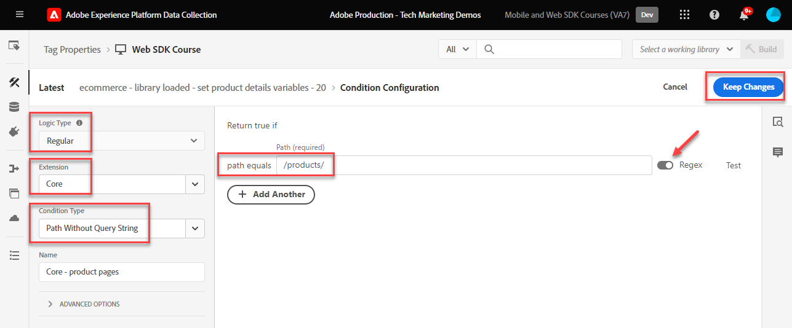
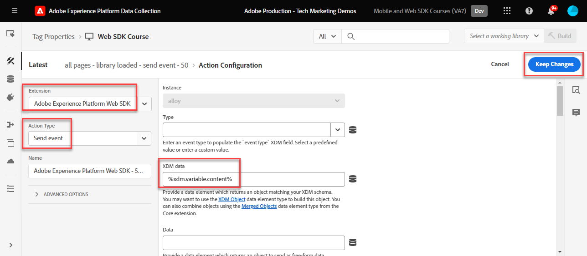

# Erstellen von Tag-Regeln

Erfahren Sie, wie Sie mithilfe von Tag-Regeln Ereignisse mit Ihrem XDM-Objekt an das Adobe Experience Platform-Edge Network senden. Eine Tag-Regel ist eine Kombination aus Ereignissen, Bedingungen und Aktionen, die die Tag-Eigenschaft anweist, etwas zu tun. Mit dem Platform Web SDK werden Regeln verwendet, um Ereignisse mit den richtigen Daten an Platform Edge Network zu senden.

## Lernziele

Am Ende dieser Lektion können Sie:

* Verwenden einer Benennungskonvention zum Verwalten von Regeln innerhalb von Tags
* Ereignis mit XDM-Feldern mit den Aktionen &quot;Variable aktualisieren&quot;und &quot;Ereignis senden&quot;senden
* Mehrere Sätze von XDM-Feldern über mehrere Regeln hinweg stapeln
* Ordnen Sie einzelne oder komplette Array-Datenelemente dem XDM-Objekt zu.
* Publish einer Tag-Regel in einer Entwicklungsbibliothek

## Voraussetzungen

Sie sind mit Datenerfassungs-Tags und der [Demosite &quot;Luma&quot;](https://luma.enablementadobe.com/content/luma/us/en.html) vertraut und haben die vorherigen Lektionen im Tutorial abgeschlossen:

* [Konfigurieren eines XDM-Schemas](configure-schemas.md)
* [Identitäts-Namespace konfigurieren](configure-identities.md)
* [Konfigurieren eines Datenstroms](configure-datastream.md)
* [Installieren der Web SDK-Erweiterung](install-web-sdk.md)
* [Erstellen von Datenelementen](create-data-elements.md)
* [Erstellen von Identitäten](create-identities.md)

## Benennungskonventionen

Um Regeln in Tags zu verwalten, wird empfohlen, eine standardmäßige Namenskonvention einzuhalten. In diesem Tutorial wird eine fünfteilige Namenskonvention verwendet:

* [**location**] - [**event**] - [**zweck**] - [**order**]

wo;

1. **location** ist die Seite oder die Seiten auf der Site, auf der die Regel ausgelöst wird.
1. **event** ist der Trigger für die Regel
1. **Zweck** ist die Hauptaktion, die von der Regel ausgeführt wird
1. **order** ist die Reihenfolge, in der die Regel im Verhältnis zu anderen Regeln ausgelöst werden soll
<!-- minor update -->

## Erstellen von Tag-Regeln

In -Tags werden Regeln verwendet, um unter verschiedenen Bedingungen Aktionen (Aufrufe auslösen) auszuführen. Die Platform Web SDK-Tag-Erweiterung umfasst zwei Aktionen, die in dieser Lektion verwendet werden:

* **[!UICONTROL Variable aktualisieren]** ordnet Datenelemente Eigenschaften in einem XDM-Objekt zu
* **[!UICONTROL Ereignis senden]** sendet das XDM-Objekt an das Experience Platform-Edge Network

Im Rest dieser Lektion werden wir:

1. Erstellen Sie eine Regel mit der Aktion **[!UICONTROL Variable aktualisieren]** , um eine &quot;globale Konfiguration&quot;von XDM-Feldern zu definieren.

1. Erstellen Sie mit der Aktion **[!UICONTROL Variable aktualisieren]** zusätzliche Regeln, die unsere &quot;globale Konfiguration&quot;außer Kraft setzen und unter bestimmten Bedingungen zusätzliche XDM-Felder hinzufügen (z. B. Produktdetails zu Produktseiten hinzufügen).

1. Erstellen Sie eine weitere Regel mit der Aktion **[!UICONTROL Ereignis senden]** , die das vollständige XDM-Objekt an das Adobe Experience Platform-Edge Network sendet.

Alle diese Regeln werden mithilfe der Option &quot;[!UICONTROL order]&quot; ordnungsgemäß sequenziert.

In diesem Video erhalten Sie einen Überblick über den Prozess:

>[!VIDEO](https://video.tv.adobe.com/v/3427710/?learn=on)

### Globale Konfigurationsfelder

So erstellen Sie eine Tag-Regel für die globalen XDM-Felder:

1. Öffnen Sie die Tag-Eigenschaft, die Sie für dieses Tutorial verwenden

1. Navigieren Sie im linken Navigationsbereich zu **[!UICONTROL Regeln]** .

1. Wählen Sie die Schaltfläche **[!UICONTROL Neue Regel erstellen]** aus

   

1. Geben Sie einen Namen für die Regel ein `all pages - library loaded - set global variables - 1`.

1. Wählen Sie im Abschnitt **[!UICONTROL Ereignisse]** die Option **[!UICONTROL Hinzufügen]**

   

1. Verwenden Sie die **[!UICONTROL Haupterweiterung]** und wählen Sie **[!UICONTROL Bibliothek geladen (Seitenanfang)]** als **[!UICONTROL Ereignistyp]** aus.

1. Wählen Sie das Dropdown-Menü **[!UICONTROL Erweitert]** aus und geben Sie `1` als **[!UICONTROL Reihenfolge]** ein.

   >[!NOTE]
   >
   > Je niedriger die Bestellnummer ist, desto früher wird sie ausgeführt. Deshalb geben wir unserer &quot;globalen Konfiguration&quot; eine niedrige Bestellnummer.

1. Wählen Sie **[!UICONTROL Änderungen beibehalten]** aus, um zum Hauptregelbildschirm zurückzukehren.
   

1. Wählen Sie im Abschnitt **[!UICONTROL Aktionen]** die Option **[!UICONTROL Hinzufügen]**

1. Wählen Sie als **[!UICONTROL Erweiterung]** **[!UICONTROL Adobe Experience Platform Web SDK]** aus.

1. Wählen Sie als **[!UICONTROL Aktionstyp]** **[!UICONTROL Variable aktualisieren]** aus.

1. Wählen Sie als **[!UICONTROL Datenelement]** die `xdm.variable.content` aus, die Sie in der Lektion [Datenelemente erstellen](create-data-elements.md) erstellt haben

   

Ordnen Sie nun Ihre [!UICONTROL Datenelemente] dem vom XDM-Objekt verwendeten [!UICONTROL Schema] zu. Sie können einzelnen Eigenschaften oder ganzen Objekten zuordnen. In diesem Beispiel ordnen Sie die einzelnen Eigenschaften zu:

1. Suchen Sie das Feld eventType und wählen Sie es aus.

1. Geben Sie den Wert `web.webpagedetails.pageViews` ein.

   >[!TIP]
   >
   > Um zu verstehen, welche Werte im Feld `eventType` eingegeben werden sollen, müssen Sie auf die Schemaseite gehen und das Feld `eventType` auswählen, um die vorgeschlagenen Werte in der rechten Leiste anzuzeigen. Sie können bei Bedarf auch einen neuen Wert eingeben.
   > 

1. Suchen Sie anschließend das Objekt `identityMap` im Schema und wählen Sie es aus

1. Dem `identityMap.loginID`-Datenelement zuordnen

   

   >[!TIP]
   >
   > XDM-Felder werden nicht in die Netzwerkanforderung aufgenommen, wenn das Datenelement null ist. Wenn der Benutzer nicht authentifiziert ist und das Datenelement `identityMap.loginID` null ist, wird daher das Objekt `identityMap` nicht gesendet. Deshalb können wir sie in unserer &quot;globalen Konfiguration&quot; definieren.

1. Scrollen Sie nach unten, bis Sie das Objekt **`web`** erreichen.

1. Auswahl zum Öffnen

1. Ordnen Sie die folgenden Datenelemente den entsprechenden `web` XDM-Variablen zu

   * **`web.webPageDetials.name`** bis `%page.pageInfo.pageName%`
   * **`web.webPageDetials.server`** bis `%page.pageInfo.server%`
   * **`web.webPageDetials.siteSection`** bis `%page.pageInfo.hierarchie1%`

1. Stellen Sie `web.webPageDetials.pageViews.value` auf `1` ein.

   

   >[!TIP]
   >
   > Während weder `eventType` auf `web.webpagedetails.pageViews` noch `web.webPageDetails.pageViews.value` festgelegt ist, damit Adobe Analytics ein Beacon als Seitenansicht verarbeiten kann, ist es nützlich, eine Standardmethode zur Anzeige einer Seitenansicht für andere nachgelagerte Anwendungen zu verwenden.

1. Wählen Sie **[!UICONTROL Änderungen beibehalten]** und dann **[!UICONTROL Speichern]** die Regel im nächsten Bildschirm, um die Erstellung der Regel abzuschließen

### Felder für Produktseiten

Beginnen Sie jetzt mit der Verwendung von **[!UICONTROL Variable aktualisieren]** in zusätzlichen, sequenzierten Regeln, um das XDM-Objekt anzureichern, bevor es an [!UICONTROL Platform-Edge Network] gesendet wird.

>[!TIP]
>
>Die Regelreihenfolge bestimmt, welche Regel beim Auslösen eines Ereignisses zuerst ausgeführt wird. Wenn zwei Regeln denselben Ereignistyp aufweisen, wird zuerst die Regel mit der niedrigsten Nummer ausgeführt.
> 

Beginnen Sie mit der Verfolgung der Produktansichten auf der Produktdetailseite von Luma:

1. Wählen Sie **[!UICONTROL Regel hinzufügen]**
1. Benennen Sie es [!UICONTROL `ecommerce - library loaded - set product details variables - 20`]
1. Wählen Sie unter Ereignis das  aus, um einen neuen Trigger hinzuzufügen.
1. Wählen Sie unter **[!UICONTROL Erweiterung]** **[!UICONTROL Core]** aus.
1. Wählen Sie unter **[!UICONTROL Ereignistyp]** die Option **[!UICONTROL Bibliothek geladen (Seitenanfang)]** aus.
1. Wählen Sie diese Option aus, um **[!UICONTROL Erweiterte Optionen]** zu öffnen, und geben Sie in `20` ein. Dieser Bestellwert stellt sicher, dass die Regel _nach_ dem `all pages - library loaded - set global variables - 1` ausgeführt wird, der die globale Konfiguration festlegt.
1. Wählen Sie **[!UICONTROL Änderungen beibehalten]** aus

   

1. Wählen Sie unter **[!UICONTROL Bedingungen]** die Option &quot;**[!UICONTROL Hinzufügen]**&quot;
1. Belassen Sie **[!UICONTROL Logiktyp]** als **[!UICONTROL Normal]**.
1. Belassen Sie **[!UICONTROL Extension]** als **[!UICONTROL Core]**.
1. Wählen Sie **[!UICONTROL Bedingungstyp]** als **[!UICONTROL Pfad ohne Abfragezeichenfolge]** aus.
1. Aktivieren Sie rechts den Umschalter **[!UICONTROL Regex]** .
1. Legen Sie unter **[!UICONTROL path equals]** `/products/` fest. Auf der Demosite &quot;Luma&quot;wird sichergestellt, dass die Regel nur Trigger auf Produktseiten enthält.
1. Wählen Sie **[!UICONTROL Änderungen beibehalten]** aus

   

1. Wählen Sie unter **[!UICONTROL Aktionen]** die Option **[!UICONTROL Hinzufügen]** aus.
1. Wählen Sie die Erweiterung **[!UICONTROL Adobe Experience Platform Web SDK]**
1. Wählen Sie **[!UICONTROL Aktionstyp]** als **[!UICONTROL Variable aktualisieren]** aus.
1. Wählen Sie `xdm.variable.content` als **[!UICONTROL Datenelement]** aus.
1. Scrollen Sie nach unten zum Objekt `commerce`
1. Öffnen Sie das Objekt **[!UICONTROL productViews]** und setzen Sie **[!UICONTROL value]** auf `1`

   

   >[!TIP]
   >
   >Wenn Sie commerce.productViews.value=1 in XDM festlegen, wird dies automatisch dem `prodView` -Ereignis in Analytics zugeordnet

1. Scrollen Sie nach unten zu `eventType` und setzen Sie es auf `commerce.productViews`

   >[!NOTE]
   >
   >Da diese Regel eine höhere Reihenfolge aufweist, wird der in der Regel &quot;globale Konfiguration&quot;festgelegte `eventType`-Wert überschrieben. `eventType` kann nur einen Wert enthalten. Es wird empfohlen, ihn mit dem wertvollsten Ereignis festzulegen.

1. Scrollen Sie nach unten zu und wählen Sie `productListItems` Array aus.
1. Wählen Sie **[!UICONTROL Bereitstellen einzelner Elemente]** aus.
1. Wählen Sie **[!UICONTROL Element hinzufügen]**

   

   >[!CAUTION]
   >
   >Der Datentyp **`productListItems`** ist ein `array` , sodass erwartet wird, dass Daten als Kollektion von Elementen eingehen. Aufgrund der Datenschichtstruktur der Demosite &quot;Luma&quot;und da es nur möglich ist, ein Produkt gleichzeitig auf der Site &quot;Luma&quot;anzuzeigen, fügen Sie Elemente einzeln hinzu. Bei der Implementierung auf Ihrer eigenen Website können Sie je nach Datenschichtstruktur möglicherweise ein ganzes Array bereitstellen.

1. Wählen Sie aus, um **[!UICONTROL Element 1]** zu öffnen
1. Zuordnung **`productListItems.item1.SKU`** zu `%product.productInfo.sku%`

   

1. Wählen Sie **[!UICONTROL Änderungen beibehalten]** aus

1. Wählen Sie **[!UICONTROL Speichern]** aus, um die Regel zu speichern

### Felder im Warenkorb

Sie können das gesamte Array einem XDM-Objekt zuordnen, vorausgesetzt, das Array entspricht dem Format des XDM-Schemas. Das zuvor erstellte Datenelement des benutzerspezifischen Codes `cart.productInfo` durchläuft das Datenschichtobjekt `digitalData.cart.cartEntries` auf Luma und übersetzt es in das erforderliche Format des Objekts `productListItems` des XDM-Schemas.

Sehen Sie sich dazu den unten stehenden Vergleich der Datenschicht der Site &quot;Luma&quot;(links) mit dem übersetzten Datenelement (rechts) an:

Vergleichen Sie das Datenelement mit der Struktur `productListItems` (Tipp: Es sollte übereinstimmen).

>[!IMPORTANT]
>
>Beachten Sie, wie numerische Variablen übersetzt werden, wobei Zeichenfolgenwerte in der Datenschicht wie `price` und `qty` in Zahlen im Datenelement umformatiert sind. Diese Formatanforderungen sind für die Datenintegrität in Platform wichtig und werden während des Schritts [Schemas konfigurieren](configure-schemas.md) bestimmt. Im Beispiel verwendet **[!UICONTROL quantity]** den Datentyp **[!UICONTROL Integer]**.
> 

Zuordnen des Arrays zum XDM-Objekt:

1. Neue Regel mit dem Namen `ecommerce - library loaded - set shopping cart variables - 20` erstellen
1. Wählen Sie unter Ereignis das  aus, um einen neuen Trigger hinzuzufügen.
1. Wählen Sie unter **[!UICONTROL Erweiterung]** **[!UICONTROL Core]** aus.
1. Wählen Sie unter **[!UICONTROL Ereignistyp]** die Option **[!UICONTROL Bibliothek geladen (Seitenanfang)]** aus.
1. Wählen Sie diese Option aus, um **[!UICONTROL Erweiterte Optionen]** zu öffnen, geben Sie in `20` ein.
1. Wählen Sie **[!UICONTROL Änderungen beibehalten]** aus

   

1. Wählen Sie unter **[!UICONTROL Bedingungen]** die Option &quot;**[!UICONTROL Hinzufügen]**&quot;
1. Belassen Sie **[!UICONTROL Logiktyp]** als **[!UICONTROL Normal]**.
1. Belassen Sie **[!UICONTROL Erweiterungen]** als **[!UICONTROL Core]** .
1. Wählen Sie **[!UICONTROL Bedingungstyp]** als **[!UICONTROL Pfad ohne Abfragezeichenfolge]** aus.
1. rechts: **nicht** aktivieren den Umschalter **[!UICONTROL Regex]**
1. Legen Sie unter **[!UICONTROL path equals]** `/content/luma/us/en/user/cart.html` fest. Auf der Demosite &quot;Luma&quot;wird sichergestellt, dass die Regel nur Trigger auf der Warenkorbseite enthält.
1. Wählen Sie **[!UICONTROL Änderungen beibehalten]** aus

   

1. Wählen Sie unter **[!UICONTROL Aktionen]** die Option **[!UICONTROL Hinzufügen]** aus.
1. Wählen Sie die Erweiterung **[!UICONTROL Adobe Experience Platform Web SDK]**
1. Wählen Sie **[!UICONTROL Aktionstyp]** als **[!UICONTROL Variable aktualisieren]** aus.
1. Wählen Sie `xdm.variable.content` als **[!UICONTROL Datenelement]** aus.
1. Scrollen Sie nach unten zum Objekt `commerce` und wählen Sie aus, um es zu öffnen.
1. Öffnen Sie das Objekt **[!UICONTROL productListViews]** und setzen Sie **[!UICONTROL value]** auf `1`

   

   >[!TIP]
   >
   >Wenn Sie commerce.productListViews.value=1 in XDM festlegen, wird dies automatisch dem `scView` -Ereignis in Analytics zugeordnet

1. Wählen Sie `eventType` aus und setzen Sie auf `commerce.productListViews`

1. Scrollen Sie nach unten zum Array **[!UICONTROL productListItems]** und wählen Sie es aus.

1. Wählen Sie **[!UICONTROL Gesamtes Array bereitstellen]**

1. Dem **`cart.productInfo`**-Datenelement zuordnen

1. Wählen Sie **[!UICONTROL Änderungen beibehalten]** aus

1. Wählen Sie **[!UICONTROL Speichern]** aus, um die Regel zu speichern

Erstellen Sie zwei weitere Regeln für Checkout und Kauf nach demselben Muster mit den folgenden Unterschieden:

**Regelname**: `ecommerce  - library loaded - set checkout variables - 20`

1. **[!UICONTROL Bedingung]**: /content/luma/us/en/user/checkout.html
1. Stellen Sie `eventType` auf `commerce.checkouts` ein.
1. Stellen Sie `commerce.checkout.value` auf `1` ein.

   >[!TIP]
   >
   >Dies entspricht der Einstellung des `scCheckout` -Ereignisses in Analytics

**Regelname**: `ecommerce - library loaded - set purchase variables -  20`

1. **[!UICONTROL Bedingung]**: /content/luma/us/en/user/checkout/order/thank-you.html
1. Stellen Sie `eventType` auf `commerce.purchases` ein.
1. Stellen Sie `commerce.purchases.value` auf `1` ein.

   >[!TIP]
   >
   >Dies entspricht der Einstellung des `purchase` -Ereignisses in Analytics

1. Setzen Sie `commerce.order.purchaseID` auf das Datenelement `cart.orderId`
1. Setzen Sie `commerce.order.currencyCode` auf den hartcodierten Wert `USD`

   

   >[!TIP]
   >
   >Dies entspricht dem Festlegen von `s.purchaseID` - und `s.currencyCode` -Variablen in Analytics

1. Scrollen Sie nach unten zum Array **[!UICONTROL productListItems]** und wählen Sie es aus.
1. Wählen Sie **[!UICONTROL Gesamtes Array bereitstellen]**
1. Dem **`cart.productInfo.purchase`**-Datenelement zuordnen
1. Wählen Sie **[!UICONTROL Änderungen beibehalten]** aus
1. Wählen Sie **[!UICONTROL Speichern]** aus.

Wenn Sie fertig sind, sollten die folgenden Regeln erstellt werden.

### Ereignisregel senden

Nachdem Sie die Variablen festgelegt haben, können Sie die Regel erstellen, um das vollständige XDM-Objekt mit der Aktion **[!UICONTROL Ereignis senden]** an Platform Edge Network zu senden.

1. Wählen Sie rechts **[!UICONTROL Regel hinzufügen]** aus, um eine weitere Regel zu erstellen

1. Geben Sie einen Namen für die Regel ein `all pages - library loaded - send event - 50`.

1. Wählen Sie im Abschnitt **[!UICONTROL Ereignisse]** die Option **[!UICONTROL Hinzufügen]**

1. Verwenden Sie die **[!UICONTROL Haupterweiterung]** und wählen Sie `Library Loaded (Page Top)` als **[!UICONTROL Ereignistyp]** aus.

1. Wählen Sie das Dropdown-Menü **[!UICONTROL Erweitert]** aus und geben Sie `50` in **[!UICONTROL Reihenfolge]** ein. Dadurch wird sichergestellt, dass diese Regel ausgelöst wird, nachdem alle anderen Regeln, die Sie konfiguriert haben (die `1` oder `20` als ihren [!UICONTROL Auftrag] hatten), ausgelöst wurden.

1. Wählen Sie **[!UICONTROL Änderungen beibehalten]** aus, um zum Hauptregelbildschirm zurückzukehren.
   

1. Wählen Sie im Abschnitt **[!UICONTROL Aktionen]** die Option **[!UICONTROL Hinzufügen]**

1. Wählen Sie als **[!UICONTROL Erweiterung]** **[!UICONTROL Adobe Experience Platform Web SDK]** aus.

1. Wählen Sie als **[!UICONTROL Aktionstyp]** **[!UICONTROL Ereignis senden]** aus.

1. Wählen Sie als **[!UICONTROL XDM]** das in der vorherigen Lektion erstellte `xdm.variable.content`-Datenelement aus.

1. Wählen Sie **[!UICONTROL Änderungen beibehalten]** aus, um zum Hauptregelbildschirm zurückzukehren.

   
1. Wählen Sie **[!UICONTROL Speichern]** aus, um die Regel zu speichern

   

## Regeln in einer Bibliothek Publish

Veröffentlichen Sie dann die Regel in Ihrer Entwicklungsumgebung, damit Sie überprüfen können, ob sie funktioniert.

So erstellen Sie eine Bibliothek:

1. Navigieren Sie im linken Navigationsbereich zu **[!UICONTROL Veröffentlichungsfluss]** .

1. Wählen Sie **[!UICONTROL Bibliothek hinzufügen]**

   
1. Geben Sie für den **[!UICONTROL Namen]** `Luma Web SDK Tutorial` ein.
1. Wählen Sie für die **[!UICONTROL Umgebung]** `Development` aus.
1. Wählen Sie **[!UICONTROL Alle geänderten Ressourcen hinzufügen]** aus.

   >[!NOTE]
   >
   >    Sie sollten alle Tag-Komponenten sehen, die in vorherigen Lektionen erstellt wurden. Die Haupterweiterung enthält die grundlegende JavaScript, die für alle Web-Tag-Eigenschaften erforderlich ist.

1. Wählen Sie **[!UICONTROL Speichern und für Entwicklung erstellen]**

   

Die Erstellung der Bibliothek kann einige Minuten dauern. Wenn sie abgeschlossen ist, wird links neben dem Bibliotheksnamen ein grüner Punkt angezeigt:

Wie Sie auf dem Bildschirm &quot;[!UICONTROL Veröffentlichungsfluss]&quot;sehen, gibt es viel mehr im Veröffentlichungsprozess, was über den Rahmen dieses Tutorials hinausgeht. In diesem Tutorial wird nur eine einzige Bibliothek in Ihrer Entwicklungsumgebung verwendet.

Jetzt können Sie die Daten in der Anfrage mithilfe des Adobe Experience Platform Debuggers überprüfen.

[Weiter ](validate-with-debugger.md)

>[!NOTE]
>
>Vielen Dank, dass Sie Ihre Zeit investiert haben, um mehr über das Adobe Experience Platform Web SDK zu erfahren. Wenn Sie Fragen haben, ein allgemeines Feedback teilen oder Anregungen zu künftigen Inhalten haben möchten, teilen Sie diese bitte in diesem [Experience League Community-Diskussionsbeitrag](https://experienceleaguecommunities.adobe.com/t5/adobe-experience-platform-data/tutorial-discussion-implement-adobe-experience-cloud-with-web/td-p/444996) mit.
