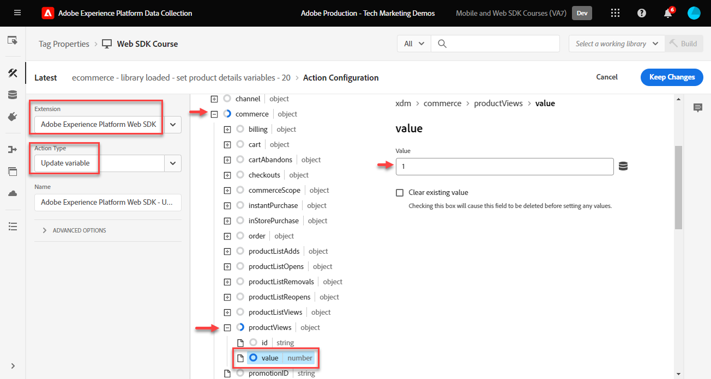

# Tag-Regeln erstellen

Erfahren Sie, wie Sie Ereignisse mithilfe von Tag-Regeln mit Ihrem XDM-Objekt an Adobe Experience Platform Edge Network senden. Eine Tag-Regel ist eine Kombination aus Ereignissen, Bedingungen und Aktionen, die die Tag-Eigenschaft anweist, etwas zu tun. Bei Platform Web SDK werden Regeln verwendet, um Ereignisse mit den richtigen Daten an Platform Edge Network zu senden.

## Lernziele

Am Ende dieser Lektion können Sie:

* Verwenden einer Namenskonvention zum Verwalten von Regeln in Tags
* Senden eines Ereignisses mit XDM-Feldern mithilfe der Aktionen „Variable aktualisieren“ und „Ereignis senden“
* Stapeln mehrerer Sätze von XDM-Feldern über mehrere Regeln hinweg
* Ordnen Sie einzelne oder gesamte Array-Datenelemente dem XDM-Objekt zu
* Veröffentlichen einer Tag-Regel in einer Entwicklungsbibliothek

## Voraussetzungen

Sie sind mit Datenerfassungs-Tags und der [Demo-Site von Luma](https://luma.enablementadobe.com/content/luma/us/en.html) vertraut und haben die vorherigen Lektionen im Tutorial abgeschlossen:

* [Konfigurieren eines XDM-Schemas](configure-schemas.md)
* [Konfigurieren eines Identity-Namespace](configure-identities.md)
* [Konfigurieren eines Datenstroms](configure-datastream.md)
* [Installieren der Web SDK-Erweiterung](install-web-sdk.md)
* [Datenelemente erstellen](create-data-elements.md)
* [Erstellen von Identitäten](create-identities.md)

## Benennungskonventionen

Um Regeln in Tags zu verwalten, wird empfohlen, eine standardmäßige Namenskonvention zu befolgen. In diesem Tutorial wird eine fünfteilige Namenskonvention verwendet:

* [**Location**] - [**Event**] - [**Purpose**] - [**order**]

wenn:

1. **location** die Seite(n) auf der Site, auf der die Regel ausgelöst wird
1. **event** ist der Trigger für die Regel
1. **Zweck** ist die Hauptaktion, die von der Regel ausgeführt wird
1. **order** ist die Reihenfolge, in der die Regel im Verhältnis zu anderen Regeln ausgelöst werden soll
<!-- minor update -->

## Tag-Regeln erstellen

In Tags werden Regeln verwendet, um Aktionen (Feueraufrufe) unter verschiedenen Bedingungen auszuführen. Die Platform Web SDK Tags-Erweiterung umfasst zwei Aktionen, die in dieser Lektion verwendet werden:

* **[!UICONTROL Variable aktualisieren]** ordnet Datenelemente Eigenschaften in einem XDM-Objekt zu
* **[!UICONTROL Ereignis senden]** sendet das XDM-Objekt an Experience Platform Edge Network

Im weiteren Verlauf dieser Lektion werden wir:

1. Erstellen Sie eine Regel mit der Aktion **[!UICONTROL Variable aktualisieren]** um eine „globale Konfiguration“ von XDM-Feldern zu definieren.

1. Erstellen Sie zusätzliche Regeln mit der Aktion **[!UICONTROL Variable aktualisieren]** die unsere „globale Konfiguration“ überschreiben und unter bestimmten Bedingungen zusätzliche XDM-Felder bereitstellen (z. B. Hinzufügen von Produktdetails auf Produktseiten).

1. Erstellen Sie eine weitere Regel mit der Aktion **[!UICONTROL Ereignis senden]** die das vollständige XDM-Objekt an Adobe Experience Platform Edge Network sendet.

Alle diese Regeln werden ordnungsgemäß mit der Option &quot;[!UICONTROL &quot; &#x200B;].

In diesem Video erhalten Sie einen Überblick über den Prozess:

>[!VIDEO](https://video.tv.adobe.com/v/3427710/?learn=on&enablevpops)

### Globale Konfigurationsfelder

Erstellen einer Tag-Regel für die globalen XDM-Felder:

1. Öffnen Sie die Tag-Eigenschaft, die Sie für dieses Tutorial verwenden

1. Navigieren Sie **[!UICONTROL linken Navigationsbereich zu]** Regeln“

1. Klicken Sie auf **[!UICONTROL Schaltfläche „Neue Regel]**&quot;

   

1. Geben Sie einen Namen für die Regel ein `all pages - library loaded - set global variables - 1`.

1. Wählen Sie **[!UICONTROL Abschnitt]** Ereignisse“ **[!UICONTROL Hinzufügen]**

   

1. Verwenden Sie die **[!UICONTROL Core]** Erweiterung und wählen Sie **[!UICONTROL Bibliothek geladen (Seitenanfang)]** als **[!UICONTROL Ereignistyp]**

1. Wählen Sie **[!UICONTROL Dropdown-]** „Erweitert“ aus und geben Sie `1` als **[!UICONTROL ein]**

   >[!NOTE]
   >
   > Je niedriger die Ordnungszahl, desto früher wird sie ausgeführt. Daher geben wir unserer „globalen Konfiguration“ eine niedrige Bestellnummer.

1. Wählen Sie **[!UICONTROL Änderungen beibehalten]** aus, um zum Hauptbildschirm für Regeln zurückzukehren
   

1. Wählen Sie **[!UICONTROL Abschnitt]** Aktionen“ **[!UICONTROL Hinzufügen]**

1. Wählen Sie als **[!UICONTROL Erweiterung]** die Option **[!UICONTROL Adobe Experience Platform Web SDK]**

1. Wählen Sie als **[!UICONTROL Aktionstyp]** die Option **[!UICONTROL Variable aktualisieren]**

1. Wählen **[!UICONTROL als]** das `xdm.variable.content` aus, das Sie in der Lektion [Datenelemente erstellen](create-data-elements.md) erstellt haben

   

Ordnen Sie nun Ihre [!UICONTROL Datenelemente] dem [!UICONTROL Schema] zu, das von Ihrem XDM-Objekt verwendet wird. Sie können einzelne Eigenschaften oder ganze Objekte zuordnen. In diesem Beispiel ordnen Sie einzelne Eigenschaften zu:

1. Suchen Sie das Feld eventType und wählen Sie es

1. Wert eingeben `web.webpagedetails.pageViews`

   >[!TIP]
   >
   > Um zu verstehen, welche Werte in das Feld `eventType` eingefügt werden sollen, müssen Sie auf die Seite Schema gehen und das Feld `eventType` auswählen, um die vorgeschlagenen Werte in der rechten Leiste anzuzeigen. Sie können bei Bedarf auch einen neuen Wert eingeben.
   > 

1. Suchen Sie anschließend das `identityMap` im Schema und wählen Sie es aus.

1. Dem `identityMap.loginID` Datenelement zuordnen

   

   >[!TIP]
   >
   > XDM-Felder werden nicht in die Netzwerkanfrage aufgenommen, wenn das Datenelement null ist. Wenn der Benutzer nicht authentifiziert ist und das `identityMap.loginID` Datenelement null ist, wird daher das `identityMap`-Objekt nicht gesendet. Deshalb können wir sie in unserer „globalen Konfiguration“ definieren.

1. Scrollen Sie nach unten, bis Sie das **`web`** erreichen

1. Auswählen, um es zu öffnen

1. Ordnen Sie die folgenden Datenelemente den entsprechenden `web` XDM-Variablen zu

   * **`web.webPageDetials.name`** zu `%page.pageInfo.pageName%`
   * **`web.webPageDetials.server`** zu `%page.pageInfo.server%`
   * **`web.webPageDetials.siteSection`** zu `%page.pageInfo.hierarchie1%`

1. Stellen Sie `web.webPageDetials.pageViews.value` auf `1` ein.

   

   >[!TIP]
   >
   > Obwohl weder `eventType` auf `web.webpagedetails.pageViews` noch `web.webPageDetails.pageViews.value` festgelegt sind, damit Adobe Analytics ein Beacon als Seitenansicht verarbeiten kann, ist es sinnvoll, eine Standardmethode zur Anzeige einer Seitenansicht für andere nachgelagerte Anwendungen zu verwenden.

1. Wählen Sie **[!UICONTROL Änderungen beibehalten]** und dann **[!UICONTROL Speichern]** die Regel im nächsten Bildschirm aus, um die Erstellung der Regel abzuschließen

### Felder der Produktseite

Beginnen Sie jetzt mit der Verwendung von **[!UICONTROL Variable aktualisieren]** in zusätzlichen, sequenziellen Regeln, um das XDM-Objekt anzureichern, bevor Sie es an [!UICONTROL Platform Edge Network] senden.

>[!TIP]
>
>Die Regelreihenfolge bestimmt, welche Regel zuerst ausgeführt wird, wenn ein Ereignis ausgelöst wird. Wenn zwei Regeln denselben Ereignistyp aufweisen, wird zuerst die Regel mit der niedrigsten Zahl ausgeführt.
> 

Beginnen Sie, indem Sie die Produktansichten auf der Produktdetailseite von Luma verfolgen:

1. Wählen Sie **[!UICONTROL Regel hinzufügen]**
1. Benennen Sie ihn [!UICONTROL `ecommerce - library loaded - set product details variables - 20`]
1. Wählen Sie das Symbol  Ereignis aus, um einen neuen Trigger hinzuzufügen
1. Wählen **[!UICONTROL unter &quot;]**&quot; die Option **[!UICONTROL Core]**
1. Wählen **[!UICONTROL unter „Ereignistyp]** die Option **[!UICONTROL Bibliothek geladen (Seitenanfang)]**
1. Wählen Sie zum Öffnen **[!UICONTROL Erweiterte Optionen]** die `20` aus. Dieser Reihenfolgenwert stellt sicher, dass die Regel _dem `all pages - library loaded - set global variables - 1` ausgeführt wird_ der die globale Konfiguration festlegt.
1. Wählen **[!UICONTROL Änderungen beibehalten]**

   

1. Wählen **[!UICONTROL unter „Bedingungen]** die Option zum **[!UICONTROL Hinzufügen]** aus
1. Behalten **[!UICONTROL Logiktyp]** bei **[!UICONTROL Regular]**
1. Belassen **[!UICONTROL extension]** als **[!UICONTROL core]**
1. Wählen Sie **[!UICONTROL Bedingungstyp]** als **[!UICONTROL Pfad ohne Abfragezeichenfolge]**
1. Aktivieren Sie auf der rechten Seite den Umschalter **[!UICONTROL Regex]**.
1. Legen **[!UICONTROL unter „Pfad]**&quot; `/products/` fest. Für die Demo-Site von Luma wird sichergestellt, dass die Regel nur Trigger auf Produktseiten enthält
1. Wählen **[!UICONTROL Änderungen beibehalten]**

   

1. Wählen **[!UICONTROL unter Aktionen]** die Option **[!UICONTROL Hinzufügen]**
1. Erweiterung **[!UICONTROL Adobe Experience Platform Web SDK]** auswählen
1. Wählen Sie **[!UICONTROL Aktionstyp]** als **[!UICONTROL Variable aktualisieren]**
1. Wählen Sie `xdm.variable.content` als **[!UICONTROL Datenelement]**
1. Scrollen Sie nach unten zum `commerce`
1. Öffnen Sie das **[!UICONTROL productViews]**-Objekt und legen Sie **[!UICONTROL value]** auf `1`

   

   >[!TIP]
   >
   >Das Festlegen von „commerce.productViews.value=1“ in XDM wird automatisch dem `prodView`-Ereignis in Analytics zugeordnet

1. Scrollen Sie nach unten zu `eventType` und setzen Sie es auf `commerce.productViews`

   >[!NOTE]
   >
   >Da diese Regel eine höhere Reihenfolge hat, überschreibt sie die in der Regel „Globale Konfiguration“ festgelegte `eventType`. `eventType` darf nur einen Wert enthalten, und es wird empfohlen, ihn auf das Ereignis mit dem höchsten Wert festzulegen.

1. Scrollen Sie nach unten zu und wählen Sie `productListItems` Array aus
1. Wählen Sie **[!UICONTROL Einzeln bereitstellen]**
1. Wählen Sie **[!UICONTROL Element hinzufügen]**

   

   >[!CAUTION]
   >
   >Der **`productListItems`** ist ein `array` Datentyp. Daher erwartet er, dass Daten als eine Sammlung von Elementen eingehen. Aufgrund der Datenschichtstruktur der Demo-Site von Luma und da es nur möglich ist, jeweils ein Produkt auf der Site von Luma anzuzeigen, fügen Sie Elemente einzeln hinzu. Bei der Implementierung auf Ihrer eigenen Website können Sie je nach Datenschichtstruktur möglicherweise ein ganzes Array bereitstellen.

1. Zum Öffnen auswählen **[!UICONTROL Element 1]**
1. **`productListItems.item1.SKU`** `%product.productInfo.sku%` zuordnen

   

1. Wählen **[!UICONTROL Änderungen beibehalten]**

1. Wählen **[!UICONTROL Speichern]**, um die Regel zu speichern

### Warenkorbfelder

Sie können ein ganzes Array einem XDM-Objekt zuordnen, sofern das Array dem Format des XDM-Schemas entspricht. Das von `cart.productInfo` erstellte Datenelement für benutzerspezifischen Code durchläuft das `digitalData.cart.cartEntries` Datenschichtobjekt auf Luma und übersetzt es in das erforderliche Format des `productListItems` des XDM-Schemas.

Zur Veranschaulichung sehen Sie sich den unten stehenden Vergleich der Datenschicht der Luma-Site (links) mit dem übersetzten Datenelement (rechts) an:

Vergleichen Sie das Datenelement mit der `productListItems` (Hinweis, es sollte übereinstimmen).

>[!IMPORTANT]
>
>Beachten Sie, wie numerische Variablen übersetzt werden und Zeichenfolgenwerte in der Datenschicht, wie `price` und `qty`, im Datenelement in Zahlen umformatiert werden. Diese Formatanforderungen sind für die Datenintegrität in Platform wichtig und werden im Schritt [Schemas konfigurieren](configure-schemas.md) festgelegt. Im Beispiel verwendet **[!UICONTROL quantity]** den Datentyp **[!UICONTROL Integer]**.
> 

Ordnen wir nun unser Array dem XDM-Objekt zu:

1. Erstellen Sie eine neue Regel mit dem Namen `ecommerce - library loaded - set shopping cart variables - 20`
1. Wählen Sie das Symbol  Ereignis aus, um einen neuen Trigger hinzuzufügen
1. Wählen **[!UICONTROL unter &quot;]**&quot; die Option **[!UICONTROL Core]**
1. Wählen **[!UICONTROL unter „Ereignistyp]** die Option **[!UICONTROL Bibliothek geladen (Seitenanfang)]**
1. Wählen Sie zum Öffnen **[!UICONTROL Erweiterte Optionen]** die folgende Option aus`20`
1. Wählen **[!UICONTROL Änderungen beibehalten]**

   

1. Wählen **[!UICONTROL unter „Bedingungen]** die Option zum **[!UICONTROL Hinzufügen]** aus
1. Behalten **[!UICONTROL Logiktyp]** bei **[!UICONTROL Regular]**
1. **[!UICONTROL Erweiterungen]** als &quot;**[!UICONTROL &quot;]**
1. Wählen Sie **[!UICONTROL Bedingungstyp]** als **[!UICONTROL Pfad ohne Abfragezeichenfolge]**
1. Aktivieren Sie auf der rechten Seite **nicht** den Umschalter **[!UICONTROL Regex]**.
1. Legen **[!UICONTROL unter „Pfad]**&quot; `/content/luma/us/en/user/cart.html` fest. Für die Demo-Site von Luma wird sichergestellt, dass die Regel nur Trigger auf der Warenkorbseite enthält
1. Wählen **[!UICONTROL Änderungen beibehalten]**

   

1. Wählen **[!UICONTROL unter Aktionen]** die Option **[!UICONTROL Hinzufügen]**
1. Erweiterung **[!UICONTROL Adobe Experience Platform Web SDK]** auswählen
1. Wählen Sie **[!UICONTROL Aktionstyp]** als **[!UICONTROL Variable aktualisieren]**
1. Wählen Sie `xdm.variable.content` als **[!UICONTROL Datenelement]**
1. Scrollen Sie nach unten zum `commerce` und wählen Sie es aus, um es zu öffnen.
1. Öffnen Sie das **[!UICONTROL productListViews]**-Objekt und legen Sie **[!UICONTROL value]** auf `1` fest

   

   >[!TIP]
   >
   >Das Festlegen von „commerce.productListViews.value=1“ in XDM wird automatisch dem `scView`-Ereignis in Analytics zugeordnet

1. `eventType` auswählen und auf `commerce.productListViews` setzen

1. Scrollen Sie nach unten zum Array **[!UICONTROL productListItems]** und wählen Sie es aus.

1. Wählen Sie **[!UICONTROL Gesamtes Array bereitstellen]**

1. Zu **`cart.productInfo`** Datenelement zuordnen

1. Wählen **[!UICONTROL Änderungen beibehalten]**

1. Wählen **[!UICONTROL Speichern]**, um die Regel zu speichern

Erstellen Sie zwei weitere Regeln für Checkout und Kauf nach demselben Muster mit den folgenden Unterschieden:

**Regelname**: `ecommerce  - library loaded - set checkout variables - 20`

1. **[!UICONTROL condition]**: /content/luma/us/en/user/checkout.html
1. Stellen Sie `eventType` auf `commerce.checkouts` ein.
1. Stellen Sie `commerce.checkout.value` auf `1` ein.

   >[!TIP]
   >
   >Dies entspricht dem Festlegen `scCheckout` Ereignisses in Analytics

**Regelname**: `ecommerce - library loaded - set purchase variables -  20`

1. **[!UICONTROL condition]**: /content/luma/us/en/user/checkout/order/thank-you.html
1. Stellen Sie `eventType` auf `commerce.purchases` ein.
1. Stellen Sie `commerce.purchases.value` auf `1` ein.

   >[!TIP]
   >
   >Dies entspricht dem Festlegen `purchase` Ereignisses in Analytics

1. `commerce.order.purchaseID` auf das `cart.orderId` Datenelement festlegen
1. `commerce.order.currencyCode` auf den hartcodierten Wert `USD`

   

   >[!TIP]
   >
   >Dies entspricht dem Festlegen von `s.purchaseID`- und `s.currencyCode` in Analytics

1. Scrollen Sie nach unten zum Array **[!UICONTROL productListItems]** und wählen Sie es aus.
1. Wählen Sie **[!UICONTROL Gesamtes Array bereitstellen]**
1. Zu **`cart.productInfo.purchase`** Datenelement zuordnen
1. Wählen **[!UICONTROL Änderungen beibehalten]**
1. Wählen Sie **[!UICONTROL Speichern]**

Wenn Sie fertig sind, sollten Sie die folgenden Regeln erstellt sehen.

### Ereignisregel senden

Nachdem Sie die Variablen festgelegt haben, können Sie mit der Aktion „Ereignis senden **[!UICONTROL die Regel erstellen, um das vollständige XDM-Objekt]** Platform Edge Network zu senden.

1. Klicken Sie auf der rechten Seite auf **[!UICONTROL Regel hinzufügen]**, um eine weitere Regel zu erstellen

1. Geben Sie einen Namen für die Regel ein `all pages - library loaded - send event - 50`.

1. Wählen Sie **[!UICONTROL Abschnitt]** Ereignisse“ **[!UICONTROL Hinzufügen]**

1. Verwenden Sie die **[!UICONTROL Core]** Erweiterung und wählen Sie `Library Loaded (Page Top)` als **[!UICONTROL Ereignistyp]**

1. Wählen Sie **[!UICONTROL Dropdown-]** „Erweitert“ aus und geben Sie `50` in **[!UICONTROL Reihenfolge]** ein. Dadurch wird sichergestellt, dass diese Regel nach allen anderen von Ihnen konfigurierten Regeln ausgelöst wird (die `1` oder `20` hatten [!UICONTROL order]).

1. Wählen Sie **[!UICONTROL Änderungen beibehalten]** aus, um zum Hauptbildschirm für Regeln zurückzukehren
   

1. Wählen Sie **[!UICONTROL Abschnitt]** Aktionen“ **[!UICONTROL Hinzufügen]**

1. Wählen Sie als **[!UICONTROL Erweiterung]** die Option **[!UICONTROL Adobe Experience Platform Web SDK]**

1. Wählen Sie als **[!UICONTROL Aktionstyp]** die Option **[!UICONTROL Ereignis senden]**

1. Wählen Sie als **[!UICONTROL XDM]** das in der vorherigen Lektion erstellte `xdm.variable.content`-Datenelement aus

1. Wählen Sie **[!UICONTROL Änderungen beibehalten]** aus, um zum Hauptbildschirm für Regeln zurückzukehren

   
1. Wählen **[!UICONTROL Speichern]**, um die Regel zu speichern

   

## Regeln in einer Bibliothek veröffentlichen

Als Nächstes veröffentlichen Sie die Regel in Ihrer Entwicklungsumgebung, damit Sie überprüfen können, ob sie funktioniert.

So erstellen Sie eine Bibliothek:

1. Navigieren Sie **[!UICONTROL linken Navigationsbereich]** Veröffentlichungsfluss &quot;&quot;.

1. Wählen Sie **[!UICONTROL Bibliothek hinzufügen]**

   
1. Geben Sie für **[!UICONTROL Name]** den Wert `Luma Web SDK Tutorial`
1. Wählen Sie für **[!UICONTROL Umgebung]** die Option `Development`
1. Wählen Sie **[!UICONTROL Alle geänderten Ressourcen hinzufügen]**

   >[!NOTE]
   >
   >    Sie sollten alle Tag-Komponenten sehen, die in vorherigen Lektionen erstellt wurden. Die Haupterweiterung enthält die Basis-JavaScript, die für alle Web-Tag-Eigenschaften erforderlich ist.

1. Wählen Sie **[!UICONTROL Für Entwicklung speichern und erstellen]**

   

Es kann einige Minuten dauern, bis die Bibliothek erstellt ist. Nach Abschluss wird links neben dem Bibliotheksnamen ein grüner Punkt angezeigt:

Wie Sie auf dem Bildschirm [!UICONTROL Publishing-Ablauf] sehen können, gibt es sehr viel mehr am Publishing-Prozess, was den Rahmen dieses Tutorials sprengt. Dieses Tutorial verwendet nur eine einzige Bibliothek in Ihrer Entwicklungsumgebung.

Jetzt können Sie die Daten in der Anfrage mithilfe der Adobe Experience Platform Debugger validieren.

[Weiter ](validate-with-debugger.md)

>[!NOTE]
>
>Vielen Dank, dass Sie sich Zeit genommen haben, um mehr über Adobe Experience Platform Web SDK zu erfahren. Wenn Sie Fragen haben, allgemeines Feedback geben möchten oder Vorschläge für zukünftige Inhalte haben, teilen Sie diese bitte auf diesem [Experience League Community-Diskussionsbeitrag](https://experienceleaguecommunities.adobe.com/t5/adobe-experience-platform-data/tutorial-discussion-implement-adobe-experience-cloud-with-web/td-p/444996)
