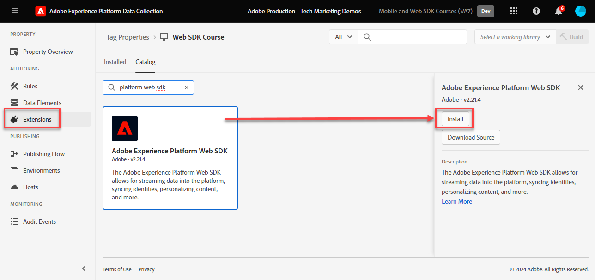

# Installieren der Adobe Experience Platform Web SDK-Tag-Erweiterung

Erfahren Sie, wie Sie die Adobe Experience Platform Web SDK-Tag-Erweiterung installieren und konfigurieren. Die einfachste Methode zur Implementierung des Web SDK besteht darin, den Tag-Manager, Tags (ehemals Launch), zu verwenden. Die Platform Web SDK-Tag-Erweiterung ist die _nur Tag-Erweiterung_ erforderlich ist, um Daten an _alle Adobe Experience Cloud-Anwendungen_, einschließlich [Analytics](setup-analytics.md), [Target](setup-target.md), [Audience Manager](setup-audience-manager.md), Real-time Customer Data Platform und [Journey Optimizer](setup-web-channel.md)!

## Lernziele

Am Ende dieser Lektion können Sie:

* Erstellen einer Tag-Eigenschaft in der Datenerfassungsoberfläche
* Installieren der Platform Web SDK-Tag-Erweiterung
* Zuordnen des zuvor erstellten Datenspeichers zur Erweiterung

## Voraussetzungen

Sie müssen die vorherigen Lektionen in diesem Tutorial abgeschlossen haben:

* [Konfigurieren eines Datenstroms](configure-datastream.md)

### Tag-Eigenschaft hinzufügen

Zuerst müssen Sie über eine Tag-Eigenschaft verfügen. Eine Eigenschaft ist ein Container für alle JavaScript-, Regeln- und anderen Funktionen, die zum Erfassen von Details von einer Webseite und zum Senden an verschiedene Speicherorte erforderlich sind.

Erstellen Sie eine neue Tag-Eigenschaft für das Tutorial:

1. Öffnen Sie die [Datenerfassungsoberfläche](https://launch.adobe.com/){target="_blank"}
1. Auswählen **[!UICONTROL Tags]** in der linken Navigation
1. Wählen Sie die **[!UICONTROL Neue Eigenschaft]** button
   
1. Als **[!UICONTROL Name]**, eingeben `Web SDK Course` (Fügen Sie am Ende Ihren Namen hinzu, wenn mehrere Personen aus Ihrem Unternehmen dieses Tutorial absolvieren)
1. Als **[!UICONTROL Domänen]**, eingeben `enablementadobe.com` (später erklärt)
1. Auswählen **[!UICONTROL Speichern]**
   

## Web SDK-Erweiterung hinzufügen

Nachdem Sie Ihr XDM-Schema, Ihren Datastream und Ihre Tag-Eigenschaft erstellt haben, können Sie die Platform Web SDK-Erweiterung installieren:

1. Öffnen Sie die neue Tag-Eigenschaft
1. Navigieren Sie zu **[!UICONTROL Erweiterungen]** > **[!UICONTROL Katalog]**
1. Suchen Sie nach `Adobe Experience Platform Web SDK`
1. Auswählen **[!UICONTROL Installieren]**

   

## Verknüpfen der Erweiterung mit Ihrem Datastream

Behalten Sie die meisten Standardeinstellungen bei und aktualisieren Sie sie bei Bedarf später. Sie müssen jetzt nur die Erweiterung mit Ihrem Datastream verknüpfen:

1. under **[!UICONTROL Datenspeicher]**, wählen Sie die **[!UICONTROL Aus Liste auswählen]** Eingabemethode
1. Wählen Sie die Sandbox aus, in der Sie das Schema, den Identitäts-Namespace und den Datenspeicher erstellt haben
1. Wählen Sie den zuvor erstellten Datastream aus. `Luma Web SDK`
1. Auswählen **[!UICONTROL Speichern]**

   >[!NOTE]
   >
   > Wenn Sie Ihren Datastream nicht finden können, gehen Sie zu [Konfigurieren eines Datenspeichers](configure-datastream.md) Lektion und befolgen Sie die Schritte zum Erstellen einer

   

Weitere Informationen zu den einzelnen Abschnitten der Erweiterung finden Sie unter [Konfigurieren der Adobe Experience Platform Web SDK-Erweiterung](https://experienceleague.adobe.com/en/docs/experience-platform/tags/extensions/client/web-sdk/web-sdk-extension-configuration).

>[!NOTE]
>
>Sie haben zwar keinen CNAME im [!UICONTROL Edge-Domäne] -Einstellung in dieser Lektion empfiehlt Adobe die Verwendung eines CNAME, wenn Sie das Platform Web SDK auf Ihrer eigenen Website implementieren. Auch wenn eine CNAME-Implementierung keine Vorteile hinsichtlich der Cookie-Lebensdauer bietet, kann sie andere Vorteile haben. Zu diesen Vorteilen gehören Anzeigensperren und seltener verwendete Browser, die verhindern, dass Daten an Domänen gesendet werden, die sie als Tracker klassifizieren. In diesen Fällen kann die Verwendung eines CNAME-Eintrags verhindern, dass Ihre Datenerfassung bei Benutzern unterbunden wird, die diese Tools verwenden.

>[!NOTE]
>
>In diesem Tutorial konfigurieren Sie nur einen Datastream und verknüpfen ihn mit allen Tag-Umgebungen (Entwicklung, Staging und Produktion). Wenn Sie das Platform Web SDK auf Ihrer eigenen Website implementieren, sollten Sie für jede Umgebung einen separaten Datastream konfigurieren und diese entsprechend in der Erweiterungskonfiguration zuordnen.

Nachdem Sie das Platform Web SDK installiert und mit dem Datastream verknüpft haben, können Sie mit der Datenerfassung beginnen.

[Weiter: ](create-data-elements.md)

>[!NOTE]
>
>Vielen Dank, dass Sie Ihre Zeit investiert haben, um mehr über das Adobe Experience Platform Web SDK zu erfahren. Wenn Sie Fragen haben, ein allgemeines Feedback teilen möchten oder Vorschläge zu künftigen Inhalten haben, teilen Sie diese bitte mit. [Experience League Community-Diskussionsbeitrag](https://experienceleaguecommunities.adobe.com/t5/adobe-experience-platform-data/tutorial-discussion-implement-adobe-experience-cloud-with-web/td-p/444996)
