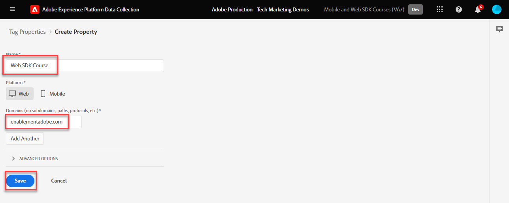

# Installieren der Adobe Experience Platform Web SDK-Tag-Erweiterung

Erfahren Sie, wie Sie die Platform Web SDK-Tag-Erweiterung in der Datenerfassungsoberfläche installieren und konfigurieren. Diese Tag-Erweiterung ist _nur Tag-Erweiterung_ erforderlich ist, um Daten an _alle Adobe Experience Cloud-Anwendungen_, einschließlich [Analytics](setup-analytics.md), [Target](setup-target.md), [Audience Manager](setup-audience-manager.md), Real-time Customer Data Platform und Journey Optimizer!

## Lernziele

Am Ende dieser Lektion können Sie:

* Erstellen einer Tag-Eigenschaft in der Datenerfassungsoberfläche
* Installieren der Platform Web SDK-Tag-Erweiterung
* Zuordnen des zuvor erstellten Datenspeichers zur Erweiterung

## Voraussetzungen

Sie müssen die vorherigen Lektionen in diesem Tutorial abgeschlossen haben:

* [Berechtigungen konfigurieren](configure-permissions.md)
* [Konfigurieren eines XDM-Schemas](configure-schemas.md)
* [Identitäts-Namespace konfigurieren](configure-identities.md)
* [Konfigurieren eines Datenstroms](configure-datastream.md)

## Installieren der Experience Platform Web SDK-Erweiterung

### Eigenschaft hinzufügen

Zunächst müssen Sie über eine Tag-Eigenschaft verfügen. Eine Eigenschaft ist ein Container für alle JavaScript-, Regeln- und anderen Funktionen, die zum Erfassen von Details von einer Webseite und zum Senden an verschiedene Speicherorte erforderlich sind.

Erstellen Sie eine neue Tag-Eigenschaft für das Tutorial:

1. Öffnen Sie die [Datenerfassungsoberfläche](https://launch.adobe.com/){target=&quot;_blank&quot;}
1. Auswählen **[!UICONTROL Tags]** in der linken Navigation
1. Klicken Sie auf die Schaltfläche **[!UICONTROL Neue Eigenschaft]**
   
1. Als **[!UICONTROL Name]**, eingeben `Web SDK Course` (Fügen Sie am Ende Ihren Namen hinzu, wenn mehrere Personen aus Ihrem Unternehmen dieses Tutorial absolvieren)
1. Als **[!UICONTROL Domänen]**, eingeben `enablementadobe.com` (später erklärt)
1. Wählen Sie **[!UICONTROL Speichern]** aus
   

## Web SDK-Erweiterung hinzufügen

Nachdem Sie Ihr XDM-Schema, Ihren Datastream und Ihre Tag-Eigenschaft erstellt haben, können Sie die Platform Web SDK-Erweiterung installieren:

1. Öffnen Sie die neue Tag-Eigenschaft
1. Navigieren Sie zu **[!UICONTROL Erweiterungen]** > **[!UICONTROL Katalog]**
1. Suchen Sie nach `Adobe Experience Platform Web SDK`.
1. Auswählen **[!UICONTROL Installieren]**

   

## Verknüpfen des Platform Web SDK mit Ihrem Datastream

Behalten Sie die meisten Standardeinstellungen bei und aktualisieren Sie sie bei Bedarf später. Sie müssen jetzt nur die Erweiterung mit Ihrem Datastream verknüpfen:

1. under **[!UICONTROL Datenspeicher]**, wählen Sie die **[!UICONTROL Aus Liste auswählen]** Eingabemethode
1. Wählen Sie den zuvor erstellten Datastream aus. `Luma Web SDK`
1. Wählen Sie **[!UICONTROL Speichern]** aus
   >[!NOTE]
   >
   > Wenn Sie Ihren Datastream nicht finden können, gehen Sie zu [Konfigurieren eines Datenspeichers](configure-datastream.md) Lektion und befolgen Sie die Schritte zum Erstellen einer

   

Nachdem Sie das Platform Web SDK installiert und mit dem Datastream verknüpft haben, können Sie mit der Zuordnung von Datenelementen zu einem XDM-Objekt mit dem erstellten Schema beginnen.

>[!NOTE]
>
>In diesem Tutorial konfigurieren Sie nur einen Datastream und verknüpfen ihn mit allen Tag-Umgebungen (Entwicklung, Staging und Produktion). Wenn Sie das Platform Web SDK auf Ihrer eigenen Website implementieren, sollten Sie für jede Umgebung einen separaten Datastraam konfigurieren und ihn mithilfe der **[!UICONTROL Eingabemethode]** > **[!UICONTROL Werte eingeben]**
>
>

>[!NOTE]
>
>Sie haben zwar keinen CNAME im [!UICONTROL Edge-Domäne] in dieser Lektion festzulegen, empfiehlt Adobe die Verwendung eines CNAME bei der Implementierung des Platform Web SDK auf Ihrer eigenen Website. Auch wenn eine CNAME-Implementierung keine Vorteile hinsichtlich der Cookie-Lebensdauer bietet, kann sie andere Vorteile haben. Zu den Vorteilen gehört die Umgehung der Funktionen von Ad-Blockern und selten verwendeten Browser, die keine Daten an Domains senden, die sie als Tracker klassifizieren. In diesen Fällen kann die Verwendung eines CNAME-Eintrags verhindern, dass Ihre Datenerfassung bei Benutzern unterbunden wird, die diese Tools verwenden.

Weitere Informationen zu den einzelnen Abschnitten der Erweiterung finden Sie unter [Konfigurieren der Adobe Experience Platform Web SDK-Erweiterung](https://experienceleague.adobe.com/docs/experience-platform/edge/extension/web-sdk-extension-configuration.html)

[Weiter: ](create-data-elements.md)

>[!NOTE]
>
>Vielen Dank, dass Sie Ihre Zeit investiert haben, um mehr über das Adobe Experience Platform Web SDK zu erfahren. Wenn Sie Fragen haben, ein allgemeines Feedback teilen möchten oder Vorschläge zu künftigen Inhalten haben, teilen Sie diese bitte mit. [Diskussionsbeitrag der Experience League](https://experienceleaguecommunities.adobe.com/t5/adobe-experience-platform-launch/tutorial-discussion-implement-adobe-experience-cloud-with-web/td-p/444996)
