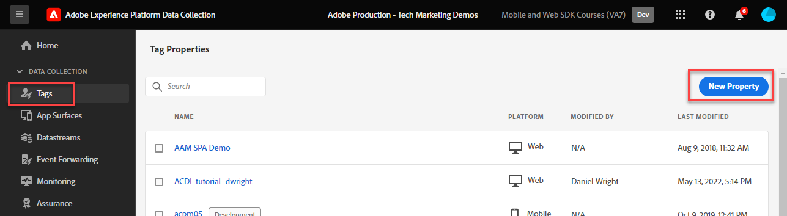

# Installieren der Tag-Erweiterung &quot;Adobe Experience Platform Web SDK&quot;

Erfahren Sie, wie Sie die Tag-Erweiterung &quot;Adobe Experience Platform Web SDK&quot; installieren und konfigurieren. Die einfachste Möglichkeit, Web SDK zu implementieren, besteht in der Verwendung des Tag-Managers von Adobe, Tags (ehemals Launch). Die Platform Web SDK-Tag-Erweiterung ist die _einzige Tag_ Erweiterung, die zum Senden von Daten an _alle Adobe Experience Cloud-_, einschließlich [Analytics](setup-analytics.md), [Target](setup-target.md), [Audience Manager](setup-audience-manager.md), Real-Time Customer Data Platform und [Journey Optimizer](setup-web-channel.md)!

>[!WARNING]
>
> Die in diesem Tutorial verwendete Luma-Website wird voraussichtlich in der Woche vom 16. Februar 2026 ersetzt. Die im Rahmen dieses Tutorials durchgeführten Arbeiten sind möglicherweise nicht auf die neue Website anwendbar.

## Lernziele

Am Ende dieser Lektion können Sie:

* Erstellen einer Tag-Eigenschaft in der Datenerfassungs-Oberfläche
* Installieren der Tag-Erweiterung von Platform Web SDK
* Zuordnen des zuvor erstellten Datenstroms zur Erweiterung

## Voraussetzungen

Sie müssen die vorherigen Lektionen in diesem Tutorial abgeschlossen haben:

* [Konfigurieren eines Datenstroms](configure-datastream.md)

### Hinzufügen einer Tag-Eigenschaft

Zunächst benötigen Sie eine Tag-Eigenschaft. Eine Eigenschaft ist ein Container für alle JavaScript, Regeln und anderen Funktionen, die erforderlich sind, um Details von einer Web-Seite zu erfassen und an verschiedene Orte zu senden.

Erstellen Sie eine neue Tag-Eigenschaft für das Tutorial:

1. Öffnen Sie die [Datenerfassungsschnittstelle](https://experience.adobe.com/data-collection/){target="_blank"}
1. Wählen **[!UICONTROL Tags]** im linken Navigationsbereich aus.
1. Klicken Sie auf **[!UICONTROL Schaltfläche „Neue Eigenschaft]**.
   
1. Geben **[!UICONTROL als]** Name`Web SDK Course` ein (fügen Sie am Ende Ihren Namen hinzu, wenn mehrere Personen in Ihrem Unternehmen an diesem Tutorial teilnehmen)
1. Geben Sie als **[!UICONTROL Domains]** den `enablementadobe.com` ein (siehe Erklärung weiter unten)
1. Wählen Sie **[!UICONTROL Speichern]**
   

## Hinzufügen der Web SDK-Erweiterung

Nachdem Sie Ihr XDM-Schema, Ihren Datenstrom und Ihre Tag-Eigenschaft erstellt haben, können Sie die Platform Web SDK-Erweiterung installieren:

1. Öffnen Sie Ihre neue Tag-Eigenschaft
1. Navigieren Sie **[!UICONTROL Erweiterungen]** > **[!UICONTROL Katalog]**
1. Nach `Adobe Experience Platform Web SDK` suchen
1. Wählen Sie **[!UICONTROL Installieren]**

   

## Verknüpfen der Erweiterung mit Ihrem Datenstrom

Behalten Sie die meisten Standardeinstellungen bei und aktualisieren Sie sie bei Bedarf später. Das einzige, was Sie jetzt tun müssen, ist, die Erweiterung mit Ihrem Datenstrom zu verknüpfen:

1. Wählen **[!UICONTROL unter]** die Eingabemethode **[!UICONTROL Aus Liste auswählen]** aus
1. Sandbox auswählen, in der Sie das Schema, den Identity-Namespace und den Datenstrom erstellt haben
1. Wählen Sie den zuvor erstellten Datenstrom aus, `Luma Web SDK`
1. Wählen Sie **[!UICONTROL Speichern]**

   >[!NOTE]
   >
   > Wenn Sie Ihren Datenstrom nicht finden können, gehen Sie zur Lektion [Konfigurieren eines &#x200B;](configure-datastream.md)) und führen Sie die Schritte aus, um einen zu erstellen

   

Weitere Informationen zu den einzelnen Abschnitten der Erweiterung finden Sie unter [Konfigurieren der Adobe Experience Platform Web SDK-Erweiterung](https://experienceleague.adobe.com/en/docs/experience-platform/tags/extensions/client/web-sdk/web-sdk-extension-configuration).

>[!NOTE]
>
>Obwohl Sie in dieser Lektion keinen CNAME in der Edge-Domain  konfiguriert haben, empfiehlt Adobe die Verwendung eines CNAME, wenn Sie Platform Web SDK auf Ihrer eigenen Website implementieren. Auch wenn eine CNAME-Implementierung keine Vorteile hinsichtlich der Cookie-Lebensdauer bietet, kann sie andere Vorteile haben. Zu diesen Vorteilen gehören Anzeigenblocker und weniger verbreitete Browser, die verhindern, dass Daten an Domains gesendet werden, die sie als Tracker klassifizieren. In diesen Fällen kann die Verwendung eines CNAME-Eintrags verhindern, dass Ihre Datenerfassung bei Benutzern unterbunden wird, die diese Tools verwenden.

>[!NOTE]
>
>In diesem Tutorial konfigurieren Sie nur einen Datenstrom und verknüpfen ihn mit allen Tag-Umgebungen (Entwicklung, Staging und Produktion). Wenn Sie Platform Web SDK auf Ihrer eigenen Website implementieren, sollten Sie für jede Umgebung einen separaten Datenstrom konfigurieren und ihn in der Erweiterungskonfiguration entsprechend zuordnen.

Nachdem Sie Platform Web SDK installiert und mit dem Datenstrom verknüpft haben, können Sie mit der Datenerfassung beginnen.

>[!NOTE]
>
>Vielen Dank, dass Sie sich Zeit genommen haben, um mehr über Adobe Experience Platform Web SDK zu erfahren. Wenn Sie Fragen haben, allgemeines Feedback geben möchten oder Vorschläge für zukünftige Inhalte haben, teilen Sie diese bitte auf diesem [Experience League Community-Diskussionsbeitrag](https://experienceleaguecommunities.adobe.com/t5/adobe-experience-platform-data/tutorial-discussion-implement-adobe-experience-cloud-with-web/td-p/444996)
