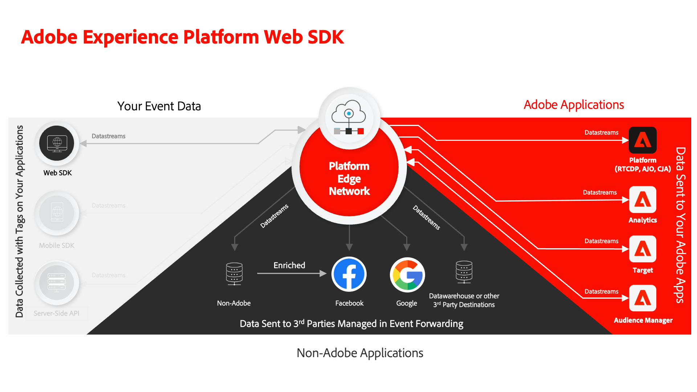

# Tutorial zur Implementierung von Adobe Experience Cloud mit Web SDK

Erfahren Sie, wie Sie Experience Cloud-Programme mit Adobe Experience Platform Web SDK implementieren. 

Experience Platform Web SDK ist eine Client-seitige JavaScript-Bibliothek, die es Kunden von Adobe Experience Cloud ermöglicht, sowohl mit Adobe-Anwendungen als auch mit Drittanbieter-Services über Adobe Experience Platform Edge Network zu interagieren. Adobe Experience Platform Weitere Informationen finden Sie unter [Übersicht über &#x200B;](https://experienceleague.adobe.com/en/docs/experience-platform/edge/home) Web SDK.

Dieses Tutorial führt Sie durch die Implementierung von Platform Web SDK auf einer Beispiel-Website für den Einzelhandel namens Luma. Die [Luma-Site](https://newluma.enablementadobe.com) verfügt über eine umfangreiche Datenschicht und Funktionen, mit denen Sie eine realistische Implementierung erstellen können. In diesem Tutorial haben Sie folgende Möglichkeiten:

* Erstellen Sie Ihre eigene Tag-Eigenschaft in Ihrem eigenen Konto mit einer Platform Web SDK-Implementierung für die Luma-Website.
* Konfigurieren Sie die wichtigsten Datenerfassungsfunktionen, die in Web-SDK-Implementierungen verwendet werden, z. B. Datenströme, Schemata und Identity-Namespaces.
* Fügen Sie die folgenden Adobe Experience Cloud-Programme hinzu:
   * **[Adobe Experience Platform](setup-experience-platform.md)** (und auf Platform aufbauende Anwendungen wie Adobe Real-Time Customer Data Platform, Adobe Journey Optimizer und Adobe Customer Journey Analytics)
   * **[Adobe Analytics](setup-analytics.md)**
   * **[Adobe Audience Manager](setup-audience-manager.md)**
   * **[Adobe Target](setup-target.md)**
* Implementieren Sie die Ereignisweiterleitung, um die von Web SDK erfassten Daten an Ziele zu senden, die nicht mit Adobe verbunden sind.
* Validieren Sie Ihre eigene Implementierung von Platform Web SDK mit Experience Platform Debugger und Assurance.

Nach Abschluss dieses Tutorials sollten Sie bereit sein, alle Ihre Marketing-Programme über Platform Web SDK auf Ihrer eigenen Website zu implementieren!

>[!NOTE]
>
>Ein ähnliches Tutorial ist auch für &quot;[&#x200B; SDK&quot; &#x200B;](../tutorial-mobile-sdk/overview.md).

## Voraussetzungen

Alle Experience Cloud-Kunden können Platform Web SDK verwenden. Es ist nicht erforderlich, eine plattformbasierte Anwendung wie Real-Time Customer Data Platform oder Journey Optimizer für die Verwendung von Web SDK zu lizenzieren.

In diesen Lektionen wird davon ausgegangen, dass Sie über ein Adobe-Benutzerkonto und die erforderlichen Berechtigungen zum Abschließen der Lektionen verfügen. Andernfalls müssen Sie sich an einen Experience Cloud-Administrator in Ihrem Unternehmen wenden, um Zugriff zu erhalten.

* Für **Datenerfassung** müssen Sie über Folgendes verfügen:
   * **[!UICONTROL Plattformen]** - Berechtigung für **[!UICONTROL Web]** und, falls lizenziert, **[!UICONTROL Edge]**
   * **[!UICONTROL Eigenschaftsrechte]** - Berechtigung zum **[!UICONTROL Genehmigen]**, **[!UICONTROL Entwickeln]**, **[!UICONTROL Eigenschaft bearbeiten]**, **[!UICONTROL Umgebungen verwalten]**, **[!UICONTROL Erweiterungen]** und **[!UICONTROL Veröffentlichen]**,
   * **[!UICONTROL Unternehmensrechte]** - Berechtigung zum **[!UICONTROL Verwalten von Eigenschaften]**

     Weitere Informationen zu Tag-Berechtigungen finden Sie unter [Dokumentation](https://experienceleague.adobe.com/en/docs/experience-platform/tags/admin/user-permissions).

* Für **Experience Platform** ist Folgendes erforderlich:

   * Zugriff auf die Sandbox **Standardproduktion**, **„Produktion“**.
   * Zugriff auf **[!UICONTROL Schemata verwalten]** und **[!UICONTROL Schemata anzeigen]** unter **[!UICONTROL Datenmodellierung]**.
   * Zugriff auf **[!UICONTROL Identity-Namespaces verwalten]** und **[!UICONTROL Identity-Namespaces]** **[!UICONTROL Identity Management]**.
   * Zugriff auf **[!UICONTROL Datenströme verwalten]** und **[!UICONTROL Datenströme anzeigen]** unter **[!UICONTROL Datenerfassung]**.
   * Wenn Sie Kunde einer Platform-basierten Anwendung sind und die Lektion [Einrichten von Experience Platform](setup-experience-platform.md) abschließen, sollten Sie auch über Folgendes verfügen:
      * Zugriff auf eine **Entwicklungs**-Sandbox.
      * Alle Berechtigungselemente unter **[!UICONTROL Datenverwaltung]** und **[!UICONTROL Profilverwaltung]**:

     Die erforderlichen Funktionen sollten für alle Experience Cloud-Kunden verfügbar sein, auch wenn Sie nicht Kunde einer plattformbasierten Anwendung wie Real-Time CDP sind.

     Weitere Informationen zur Platform-Zugriffssteuerung finden Sie unter [Dokumentation](https://experienceleague.adobe.com/de/docs/experience-platform/access-control/home).

* Für die optionale Lektion **Journey Optimizer** müssen Sie über Berechtigungselemente für die Berichte **[!UICONTROL Kampagnen verwalten]**, **[!UICONTROL Kampagnen veröffentlichen]** und **[!UICONTROL Kampagnen anzeigen]** verfügen.
  <!--
  * For the optional **Decisioning** lesson, you must have permission items to **[!UICONTROL Manage decisions]**, **[!UICONTROL View decisions]**, **[!UICONTROL Manage offers]**, **[!UICONTROL Manage ranking strategies]**.
  * See the documentation for more information on [Journey Optimizer permission configuration](https://experienceleague.adobe.com/en/docs/journey-optimizer/using/access-control/high-low-permissions#campaign-capability).
  -->

* Für die optionale Lektion **Adobe Analytics** benötigen Sie [Administratorzugriff auf Report Suite-Einstellungen, Verarbeitungsregeln und Analysis Workspace](https://experienceleague.adobe.com/en/docs/analytics/admin/admin-console/home)

* Für die optionale Lektion **Adobe Target** benötigen Sie [Editor- oder &#x200B;](https://experienceleague.adobe.com/en/docs/target/using/administer/manage-users/enterprise/properties-overview#section_8C425E43E5DD4111BBFC734A2B7ABC80)).

* Für die optionale Lektion **Audience Manager** benötigen Sie Zugriff zum Erstellen, Lesen und Schreiben von Eigenschaften, Segmenten und Zielen. Weitere Informationen finden Sie im Tutorial zur rollenbasierten Zugriffssteuerung in Audience Manager[.](https://experienceleague.adobe.com/en/docs/audience-manager-learn/tutorials/setup-and-admin/user-management/setting-permissions-with-role-based-access-control)

>[!NOTE]
>
>Es wird davon ausgegangen, dass Sie mit Frontend-Entwicklungssprachen wie HTML und JavaScript vertraut sind. Sie müssen kein Experte in diesen Sprachen sein, aber Sie erhalten mehr aus diesem Tutorial, wenn Sie Code lesen und verstehen können.

## Updates

* &#x200B;27. Februar 2026: Neue Luma-Website mit einer ereignisgesteuerten Datenschicht.
* &#x200B;24. April 2024: Wichtige Updates, einschließlich des Hinzufügens von „Variable festlegen“/„Variable aktualisieren“, Aufspaltungs-Personalisierungs- und Analytics-Anfragen, Journey Optimizer-Lektionen

## Laden der Luma-Website

Laden Sie die [Luma-Website](https://newluma.enablementadobe.com){target="blank"} in eine separate Browser-Registerkarte und setzen Sie ein Lesezeichen dafür, damit Sie sie während des Tutorials bei Bedarf einfach laden können. Sie benötigen keinen zusätzlichen Zugriff auf Luma, außer dass Sie unsere gehostete Produktions-Site laden können.

{target="blank"}

Fangen wir an! Weiter: [Erstellen eines XDM-Schemas für Web-Daten](configure-schemas.md)

>[!NOTE]
>
>Vielen Dank, dass Sie sich Zeit genommen haben, um mehr über Adobe Experience Platform Web SDK zu erfahren. Wenn Sie Fragen haben, allgemeines Feedback geben möchten oder Vorschläge für zukünftige Inhalte haben, teilen Sie diese bitte auf diesem [Experience League Community-Diskussionsbeitrag](https://experienceleaguecommunities.adobe.com/adobe-experience-platform-18/tutorial-discussion-implement-adobe-experience-cloud-with-web-sdk-tutorial-248848)
