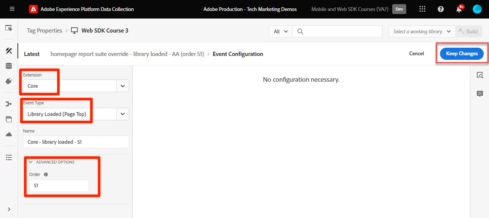
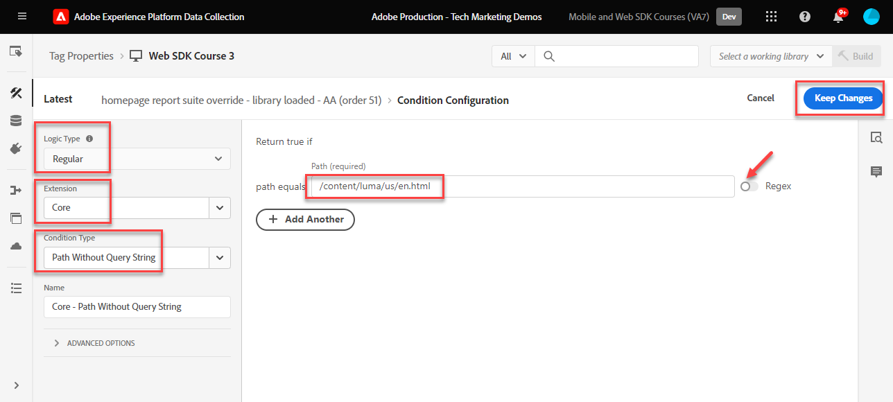
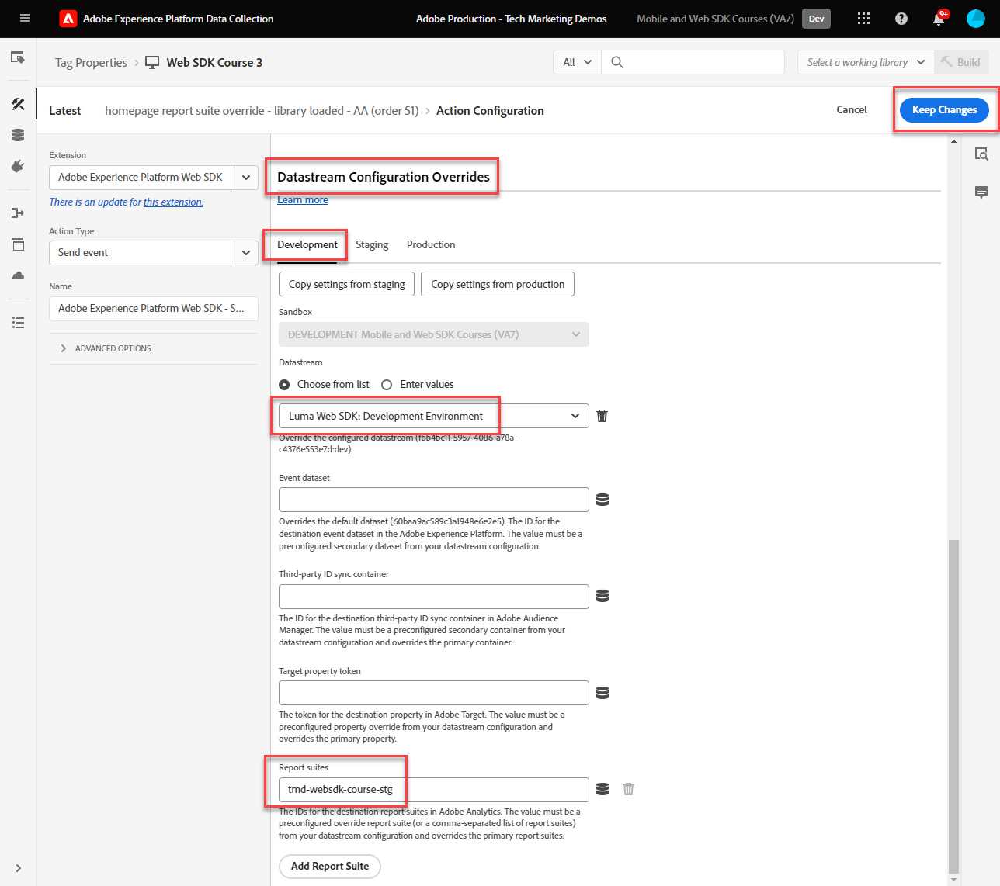
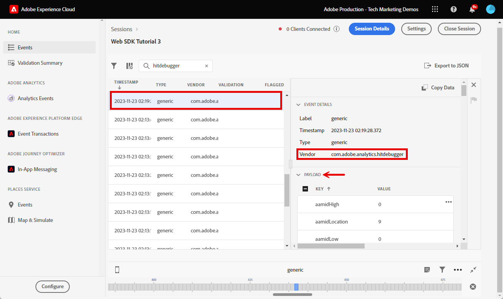
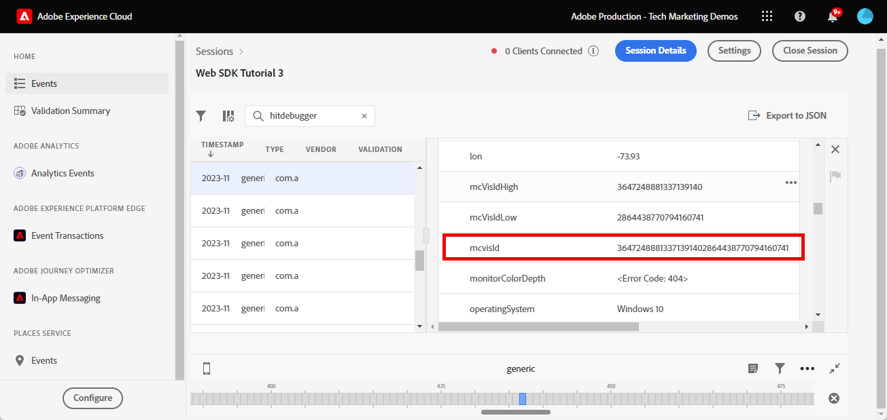
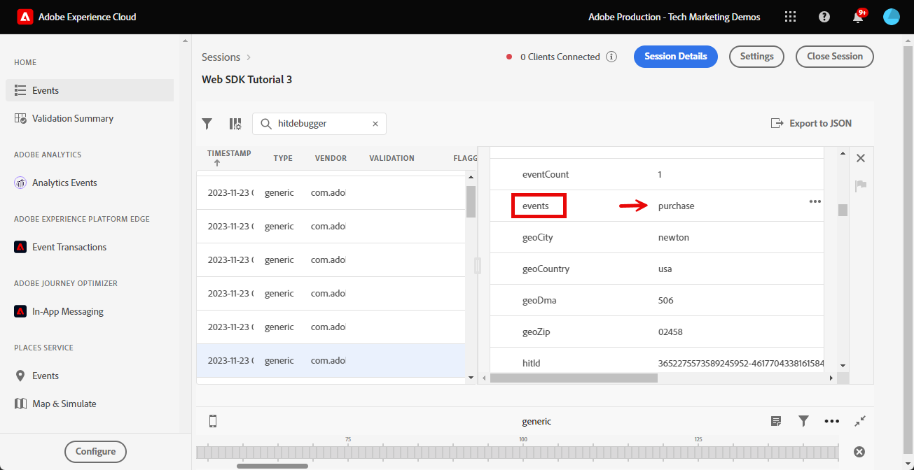

# Einrichten von Adobe Analytics mit Adobe Experience Platform Web SDK

Erfahren Sie, wie Sie Adobe Analytics mithilfe von [Adobe Experience Platform Web SDK](https://experienceleague.adobe.com/de/docs/platform-learn/data-collection/web-sdk/overview) einrichten, Tag-Regeln erstellen, um Daten an Adobe Analytics zu senden, und überprüfen, ob Analytics die Daten erwartungsgemäß erfasst.

[Adobe Analytics](https://experienceleague.adobe.com/de/docs/analytics) ist eine branchenführende Anwendung, mit der Sie Ihre Kunden als Mitarbeiter verstehen und Ihr Unternehmen mit Customer Intelligence steuern können.

>[!WARNING]
>
> Die in diesem Tutorial verwendete Luma-Website wird voraussichtlich in der Woche vom 16. Februar 2026 ersetzt. Die im Rahmen dieses Tutorials durchgeführten Arbeiten sind möglicherweise nicht auf die neue Website anwendbar.

## Lernziele

Am Ende dieser Lektion können Sie:

* Konfigurieren eines Datenstroms zur Aktivierung von Adobe Analytics
* Ermitteln, welche standardmäßigen XDM-Felder automatisch Analytics-Variablen zugeordnet werden
* Analytics-Variablen im Datenobjekt festlegen
* Senden von Daten an eine andere Report Suite durch Überschreiben des Datenstroms
* Validieren von Adobe Analytics-Variablen mit Debugger und Assurance

## Voraussetzungen

Um diese Lektion abzuschließen, müssen Sie zunächst:

* Machen Sie sich mit Adobe Analytics vertraut und haben Sie Zugriff darauf.

* Sie verfügen über mindestens eine Test-/Entwicklungs-Report Suite-ID. Wenn Sie keine Test-/Entwicklungs-Report Suite haben, die Sie für dieses Tutorial verwenden können, erstellen [&#x200B; eine](https://experienceleague.adobe.com/de/docs/analytics/admin/admin-tools/manage-report-suites/c-new-report-suite/t-create-a-report-suite).

* Die vorherigen Lektionen in den Abschnitten Erstkonfiguration und Tags-Konfiguration dieses Tutorials absolvieren.

## Konfigurieren des Datenstroms

Platform Web SDK sendet Daten von Ihrer Website an Platform Edge Network. Ihr Datenstrom teilt dann Platform Edge Network mit, an welche Adobe Analytics Report Suites Ihre Daten gesendet werden sollen.

1. Zur [Datenerfassung](https://experience.adobe.com/#/data-collection){target="blank"} wechseln
1. Wählen Sie in der linken Navigation **[!UICONTROL Datenströme]**
1. Wählen Sie den zuvor erstellten `Luma Web SDK: Development Environment` aus

   

1. Wählen Sie **[!UICONTROL Service hinzufügen]**
   
1. Wählen Sie **[!UICONTROL Adobe Analytics]** als **[!UICONTROL Service]**
1. Geben Sie die **[!UICONTROL Report Suite-ID]** Ihrer Entwicklungs-Report Suite ein
1. Wählen Sie **[!UICONTROL Speichern]**

   

   >[!TIP]
   >
   >Das Hinzufügen weiterer Report Suites durch Auswahl von **[!UICONTROL Report Suite hinzufügen]** entspricht dem Multi-Suite-Tagging.

>[!WARNING]
>
>In diesem Tutorial konfigurieren Sie nur die Adobe Analytics Report Suite für Ihre Entwicklungsumgebung. Wenn Sie Datenströme für Ihre eigene Website erstellen, sollten Sie zusätzliche Datenströme und Report Suites für Ihre Staging- und Produktionsumgebungen erstellen.

## Analytics-Variablen festlegen

Es gibt mehrere Möglichkeiten, Analytics-Variablen in einer Web SDK-Implementierung festzulegen:

1. Automatische Zuordnung von XDM-Feldern zu Analytics-Variablen (automatisch).
1. Legen Sie Felder im `data` fest (empfohlen).
1. Zuordnen von XDM-Feldern zu Analytics-Variablen in Analytics-Verarbeitungsregeln (nicht mehr empfohlen).
1. Zuordnen zu Analytics-Variablen direkt im XDM-Schema (nicht mehr empfohlen).

Ab Mai 2024 müssen Sie kein XDM-Schema mehr erstellen, um Adobe Analytics mit Platform Web SDK zu implementieren. Das `data` (und das `data.variable` Datenelement, das Sie in der Lektion [Datenelemente erstellen](create-data-elements.md) erstellt haben) können zum Festlegen aller benutzerdefinierten Analytics-Variablen verwendet werden. Das Festlegen dieser Variablen im Datenobjekt ist bestehenden Analytics-Kunden vertraut, ist effizienter als die Verwendung der Benutzeroberfläche für Verarbeitungsregeln und verhindert, dass unnötige Daten in Echtzeit-Kundenprofilen Speicherplatz belegen (wichtig, wenn Sie über Real-Time Customer Data Platform oder Journey Optimizer verfügen).

### Automatisch zugeordnete Felder

Viele XDM-Felder werden automatisch Analytics-Variablen zugeordnet. Die aktuelle Liste der Zuordnungen finden Sie unter [Analytics-Variablenzuordnung in Adobe Experience Edge](https://experienceleague.adobe.com/de/docs/experience-platform/edge/data-collection/adobe-analytics/automatically-mapped-vars).

Dies tritt auf, _(auch wenn Sie kein benutzerdefiniertes Schema definiert haben_. Experience Platform Web SDK erfasst automatisch einige Daten und sendet sie als XDM-Felder an Platform Edge Network. Beispielsweise liest Web SDK die URL der aktuellen Seite und sendet sie als XDM-`web.webPageDetails.URL`. Dieses Feld wird an Adobe Analytics weitergeleitet und die Seiten-URL-Berichte in Adobe Analytics werden automatisch ausgefüllt.

Wenn Sie Web SDK für Adobe Analytics mit einem XDM-Schema implementieren, wie Sie es in diesem Tutorial getan haben, verfügen einige der XDM-Felder, die Sie anwenderdefiniert implementiert haben, über eine automatische Zuordnung zu Analytics-Variablen, wie in dieser Tabelle beschrieben:

| Automatisches Zuordnen von XDM zu Analytics-Variablen | Adobe Analytics-Variable |
|-------|---------|
| `identitymap.ecid.[0].id` | Mitte |
| `web.webPageDetails.name` | s.pageName |
| `web.webPageDetails.server` | s.server |
| `web.webPageDetails.siteSection` | s.channel |
| `commerce.productViews.value` | prodView |
| `commerce.productListViews.value` | scView |
| `commerce.checkouts.value` | scCheckout |
| `commerce.purchases.value` | Kauf |
| `commerce.order.currencyCode` | s.currencyCode |
| `commerce.order.purchaseID` | s.purchaseID |
| `productListItems[].SKU` | s.products=;Produktname;;; (primär - siehe Hinweis unten) |
| `productListItems[].name` | s.products=;Produktname;;; (Fallback - siehe Hinweis unten) |
| `productListItems[].quantity` | s.products=;;Produktmenge;; |
| `productListItems[].priceTotal` | s.product=;;Produktpreis; |

Die einzelnen Abschnitte der Analytics-Produktzeichenfolge werden durch verschiedene XDM-Variablen unter dem `productListItems` festgelegt.

>[!NOTE]
>
>Seit dem 18. August 2022 hat `productListItems[].SKU` Priorität für die Zuordnung zum Produktnamen in der s.products-Variablen.
>Der auf `productListItems[].name` festgelegte Wert wird nur dann dem Produktnamen zugeordnet, wenn `productListItems[].SKU` nicht vorhanden ist. Andernfalls ist sie nicht zugeordnet und in Kontextdaten verfügbar.
>Legen Sie keine leere Zeichenfolge oder Null auf `productListItems[].SKU` fest. Dies hat den unerwünschten Effekt der Zuordnung zum Produktnamen in der s.products-Variablen.

### Festlegen von Variablen im Datenobjekt

Aber was ist mit eVars, Props und Ereignissen? Das Festlegen von Variablen im `data` ist die empfohlene Methode zum Festlegen dieser Analytics-Variablen mit Web SDK. Durch Festlegen von Variablen im Datenobjekt können auch alle automatisch zugeordneten Variablen überschrieben werden.

Erstens, was ist das `data`? In jedem Web-SDK-Ereignis können Sie zwei Objekte mit benutzerdefinierten Daten senden, das `xdm`-Objekt und das `data`-Objekt. Beide werden an Platform Edge Network gesendet, aber nur das `xdm` wird an den Experience Platform-Datensatz gesendet. Eigenschaften im `data` können in der Edge `xdm` Feldern mithilfe der Funktion „Datenvorbereitung für die Datenerfassung“ zugeordnet werden, werden andernfalls jedoch nicht an Experience Platform gesendet. Dies macht sie zu einer idealen Möglichkeit, Daten an Programme wie Analytics zu senden, die nicht nativ auf Experience Platform basieren.

Im Folgenden finden Sie die beiden Objekte in einem generischen Web-SDK-Aufruf:

Adobe Analytics ist so konfiguriert, dass im `data.__adobe.analytics`-Objekt nach Eigenschaften gesucht und diese für Analytics-Variablen verwendet werden.

Schauen wir uns an, wie das funktioniert. Legen wir `eVar1` und `prop1` mit unserem Seitennamen fest und sehen wir uns an, wie der XDM-zugeordnete Wert überschrieben werden kann

1. Öffnen Sie die Tag-Regel `all pages - library loaded - set global variables - 1`
1. Fügen Sie eine neue **[!UICONTROL Aktion“]**
1. Erweiterung **[!UICONTROL Adobe Experience Platform Web SDK]** auswählen
1. Wählen Sie **[!UICONTROL Aktionstyp]** als **[!UICONTROL Variable aktualisieren]**
1. Wählen Sie `data.variable` als **[!UICONTROL Datenelement]**
1. Wählen Sie das **[!UICONTROL analytics]**-Objekt aus
1. `eVar1` als `page.pageInfo.pageName` Datenelement festlegen
1. `prop1` festlegen, um den Wert von `eVar1` zu kopieren
1. Um das Überschreiben von XDM-zugeordneten Werten zu testen, legen Sie im Abschnitt **[!UICONTROL Zusätzliche Eigenschaft]** den Seitennamen als statischen Wert `test`
1. Speichern der Regel

Jetzt müssen wir das Datenobjekt in unsere Regel „Ereignis senden“ einschließen.

1. Öffnen Sie die Tag-Regel `all pages - library loaded - send event - 50`
1. Öffnen der Aktion **[!UICONTROL Ereignis senden]**
1. Wählen Sie `data.variable` als **[!UICONTROL Daten]**
1. Wählen **[!UICONTROL Änderungen beibehalten]**
1. Wählen Sie **[!UICONTROL Speichern]**

<!--

### Map to Analytics variables with processing rules

All fields in the XDM schema become available to Adobe Analytics as Context Data Variables with the following prefix `a.x.`. For example, `a.x.web.webinteraction.region`

In this exercise, you map one XDM variable to a prop. Follow these same steps for any custom mapping that you must do for any `eVar`, `prop`, `event`, or variable accessible via Processing Rules.

1. Go to the Analytics interface
1. Go to [!UICONTROL Admin] > [!UICONTROL Admin Tools] > [!UICONTROL Report Suites ]
1. Select the dev/test report suite that you are using for the tutorial > [!UICONTROL Edit Settings] > [!UICONTROL General] > [!UICONTROL Processing Rules]

       

1. Create a rule to **[!UICONTROL Overwrite value of]** `[!UICONTROL Product SKU (prop1)]` to `a.x.productlistitems.0.sku`. Remember to add a note about why you are creating the rule and name your rule title. Select **[!UICONTROL Save]**

       

    >[!IMPORTANT]
    >
    >The first time you map to a processing rule, the UI does not show you the context data variables from the XDM object. To fix that select any value, Save, and come back to edit. All XDM variables should now appear.

### Map to Analytics variables using the Adobe Analytics field group

An alternative to processing rules is to map to Analytics variables in the XDM schema using the `Adobe Analytics ExperienceEvent Template` field group. This approach has gained popularity because many users find it simpler than configuring processing rules, however, by increasing the size of the XDM payload it could in turn increase the profile size in other applications like Real-Time CDP.

To add the `Adobe Analytics ExperienceEvent Template` field group to your schema:

1. Open the [Data Collection](https://experience.adobe.com/#/data-collection){target="blank"} interface
1. Select **[!UICONTROL Schemas]** from the left navigation
1. Make sure you are in the sandbox you are using from the tutorial
1. Open your `Luma Web Event Data` schema
1. In the **[!UICONTROL Field Groups]** section, select **[!UICONTROL Add]**
1. Find the `Adobe Analytics ExperienceEvent Template` field group and add it to your schema

Now, set a merchandising eVar in the product string. With the `Adobe Analytics ExperienceEvent Template` field group, you are able to map variables to merchandising eVars or events within the product string. This is also known as setting **Product Syntax Merchandising**. 

1. Go back to your tag property

1. Open the rule `ecommerce - library loaded - set product details variables - 20`

1. Open the **[!UICONTROL Set Variable]** action

1. Select to open `_experience > analytics > customDimensions > eVars > eVar1`

1. Set the **[!UICONTROL Value]** to `%product.productInfo.title%`

1. Select **[!UICONTROL Keep Changes]**

    

1. Select **[!UICONTROL Save]** to save the rule

As you just saw, basically all of the Analytics variables can be set in the `Adobe Analytics ExperienceEvent Template` field group.

>[!NOTE]
>
> Notice the `_experience` object under `productListItems` > `Item 1`. Setting any variable under this [!UICONTROL object] sets Product Syntax eVars or Events.

-->

## Senden von Daten an eine andere Report Suite

Möglicherweise möchten Sie ändern, an welche Adobe Analytics Report Suite-Daten gesendet werden, wenn sich Besucher auf bestimmten Seiten befinden. Dies erfordert eine Konfiguration sowohl im Datenstrom als auch in einer Regel.

### Konfigurieren des Datenstroms für eine Report Suite-Überschreibung

So konfigurieren Sie die Einstellung &quot;Adobe Analytics Report Suite-Überschreibung“ im Datenstrom:

1. Öffnen des Datenstroms
1. Bearbeiten Sie die Konfiguration von **[!UICONTROL Adobe Analytics]**, indem Sie das Menü  öffnen und dann **[!UICONTROL Bearbeiten]** auswählen

   

1. Wählen Sie **[!UICONTROL Erweiterte Optionen]** aus, um **[!UICONTROL Report Suite-Überschreibungen]**

1. Wählen Sie die Report Suites aus, die Sie überschreiben möchten. In diesem Fall `Web SDK Course Dev` und `Web SDK Course Stg`

1. Wählen Sie **[!UICONTROL Speichern]**

   

### Konfigurieren einer Regel für eine Report Suite-Überschreibung

Erstellen wir eine Regel, um einen zusätzlichen Seitenansichtsaufruf an eine andere Report Suite zu senden. Verwenden Sie die Datenstrom-Überschreibungsfunktion, um die Report Suite für eine Seite mithilfe der Aktion **[!UICONTROL Ereignis senden]** zu ändern.

1. Neue Regel erstellen und `homepage - library loaded - AA report suite override - 51` benennen

1. Wählen Sie das Pluszeichen unter **[!UICONTROL Ereignis]** aus, um einen neuen Trigger hinzuzufügen

1. Wählen **[!UICONTROL unter &quot;]**&quot; die Option **[!UICONTROL Core]**

1. Wählen **[!UICONTROL unter „Ereignistyp]** die Option **[!UICONTROL Bibliothek geladen (Seitenanfang)]**

1. Wählen Sie zum Öffnen **[!UICONTROL Erweiterte Optionen]** die `51` aus. Dadurch wird sichergestellt, dass die Regel nach dem `all pages - library loaded - send event - 50` ausgeführt wird, der den Grundlinien-XDM mit dem Aktionstyp **[!UICONTROL Variable aktualisieren]** festlegt.
1. Wählen **[!UICONTROL Änderungen beibehalten]**

   

1. Wählen **[!UICONTROL unter „Bedingungen]** die Option zum **[!UICONTROL Hinzufügen]** aus

1. Behalten **[!UICONTROL Logiktyp]** bei **[!UICONTROL Regular]**

1. **[!UICONTROL Erweiterungen]** als &quot;**[!UICONTROL &quot;]**

1. Wählen Sie **[!UICONTROL Bedingungstyp]** als **[!UICONTROL Pfad ohne Abfragezeichenfolge]**

1. Lassen Sie rechts den Umschalter **[!UICONTROL Regex]** deaktiviert

1. Legen **[!UICONTROL unter „Pfad]**&quot; `/content/luma/us/en.html` fest. Für die Demo-Site von Luma wird sichergestellt, dass die Regel nur Trigger auf der Startseite enthält

1. Wählen **[!UICONTROL Änderungen beibehalten]**

   

1. Wählen **[!UICONTROL unter Aktionen]** die Option **[!UICONTROL Hinzufügen]**

1. Wählen Sie als **[!UICONTROL Erweiterung]** die Option **[!UICONTROL Adobe Experience Platform Web SDK]**

1. Wählen Sie als **[!UICONTROL Aktionstyp]** &quot;**[!UICONTROL senden]**

1. Wählen Sie als **[!UICONTROL XDM]** das `xdm.variable.content` Datenelement aus, das Sie in der Lektion [Datenelemente erstellen](create-data-elements.md) erstellt haben

1. Wählen **[!UICONTROL als]** das `data.variable` Datenelement aus, das Sie in der Lektion [Datenelemente erstellen](create-data-elements.md) erstellt haben

   

1. Scrollen Sie nach unten zum Abschnitt **[!UICONTROL Überschreibungen von Datenstromkonfigurationen]**

1. Lassen Sie die **[!UICONTROL Entwicklung]** ausgewählt.

   >[!TIP]
   >
   >    Diese Registerkarte bestimmt, in welcher Tag-Umgebung die Überschreibung erfolgt. Für diese Übung geben Sie nur die Entwicklungsumgebung an, denken Sie jedoch bei der Bereitstellung in der Produktionsumgebung daran, dies auch in der **[!UICONTROL Produktionsumgebung]** zu tun.

1. Wählen Sie die **[!UICONTROL Sandbox]** aus, die Sie für das Tutorial verwenden
1. Wählen Sie **[!UICONTROL Datenstrom]** aus, in diesem Fall `Luma Web SDK: Development Environment`

1. Wählen **[!UICONTROL unter „Report]**&quot; die Report Suite aus, die Sie überschreiben möchten. In diesem Fall, `tmd-websdk-course-stg`.

1. Wählen **[!UICONTROL Änderungen beibehalten]**

1. Und **[!UICONTROL Speichern]** Ihre Regel

   

## Erstellen der Entwicklungsumgebung

Fügen Sie Ihre aktualisierten Regeln zu Ihrer `Luma Web SDK Tutorial` Tag-Bibliothek hinzu und erstellen Sie Ihre Entwicklungsumgebung neu.

Herzlichen Glückwunsch! Der nächste Schritt besteht darin, Ihre Adobe Analytics-Implementierung über Experience Platform Web SDK zu validieren.

## Validieren von Adobe Analytics mit Debugger

Erfahren Sie, wie Sie überprüfen können, ob Adobe Analytics die ECID, Seitenansichten, die Produktzeichenfolge und E-Commerce-Ereignisse mit der Edge Trace-Funktion von Experience Platform Debugger erfasst.

In der [Debugger](validate-with-debugger.md)-Lektion haben Sie gelernt, wie Sie die Client-seitige XDM-Anfrage mit Platform Debugger und der Browser-Entwicklerkonsole überprüfen können, was dem Debuggen einer `AppMeasurement.js` Analytics-Implementierung ähnelt. Sie haben auch etwas über die Validierung von Server-seitigen Platform-Edge Network-Anfragen erfahren, die an Adobe-Programme gesendet werden, und darüber, wie Sie eine vollständig verarbeitete Payload mit Assurance anzeigen können.

Um zu überprüfen, ob Analytics Daten ordnungsgemäß über Experience Platform Web SDK erfasst, müssen Sie zwei Schritte weiter gehen, um:

1. Überprüfen Sie mithilfe der Edge Trace-Funktion von Experience Platform Debugger, wie Daten vom XDM-Objekt in Platform Edge Network verarbeitet werden
1. Überprüfen, wie Daten von Analytics mithilfe von Adobe Experience Platform Assurance vollständig verarbeitet werden

### Experience Cloud ID-Validierung

1. Navigieren Sie zur [Demo-Site von Luma](https://luma.enablementadobe.com/content/luma/us/en.html){target="_blank"}
1. Klicken Sie auf die Schaltfläche Anmelden oben rechts und verwenden Sie die Anmeldedaten u: test@test.com p: Test zur Authentifizierung
1. Öffnen Sie den Experience Platform-Debugger und [&#x200B; Sie die Tag-Eigenschaft auf der Site in Ihre eigene Entwicklungseigenschaft um](validate-with-debugger.md#use-the-experience-platform-debugger-to-map-to-your-tags-property)

1. Um den Edge-Trace zu aktivieren, wechseln Sie zum Experience Platform-Debugger, wählen Sie im linken Navigationsbereich **[!UICONTROL Protokolle]** und dann die Registerkarte **[!UICONTROL Edge]** aus und klicken Sie auf **[!UICONTROL Verbinden]**

   

1. Er wird vorerst leer sein

   

1. Aktualisieren Sie die Luma-Seite und überprüfen Sie Experience Platform Debugger erneut. Sie sollten Daten sehen, die durchlaufen werden. Die Zeile, die mit **[!UICONTROL Automatisches Analytics-Mapping]** beginnt, ist das Adobe Analytics-Beacon
1. Wählen Sie aus, um sowohl das Dropdown-Menü `[!UICONTROL mappedQueryParams]` als auch das zweite Dropdown-Menü zu öffnen und Analytics-Variablen anzuzeigen

   

   >[!TIP]
   >
   >Die zweite Dropdown-Liste entspricht der Analytics Report Suite-ID , an die Sie Daten senden. Sie sollte mit Ihrer eigenen Report Suite übereinstimmen, nicht mit der im Screenshot.

1. Scrollen Sie nach unten, um `[!UICONTROL c.a.x.identitymap.ecid.[0].id]` zu finden. Es ist eine Kontextdatenvariable, die ECID erfasst
1. Scrollen Sie nach unten, bis Sie die Variable Analytics-`[!UICONTROL mid]` sehen. Beide IDs stimmen mit der Experience Cloud ID Ihres Geräts überein.
1. Auf der Website von Luma:

   

   >[!NOTE]
   >
   >Da Sie angemeldet sind, sollten Sie kurz überprüfen, ob die authentifizierte ID `b642b4217b34b1e8d3bd915fc65c4452` für den Benutzer **`test@test.com`** auch in der `[!UICONTROL c.a.x.identitymap.lumacrmid.[0].id]` erfasst wird

### Validierung der Report Suite-Überschreibung

Oben haben Sie eine Datenstrom-Überschreibung für die (Luma[Homepage konfiguriert](https://luma.enablementadobe.com/content/luma/us/en.html).  So validieren Sie diese Konfiguration

1. Suchen Sie nach einer Zeile mit **[!UICONTROL Datastream-Konfiguration nach angewendeter Überschreibung]**. Hier finden Sie die primäre Report Suite und die zusätzlichen Report Suites, die für die Überschreibungen der Report Suite konfiguriert wurden.

   

1. Scrollen Sie nach unten zur Zeile, die mit **[!UICONTROL Automatisches Analytics-Mapping“ beginnt]** und stellen Sie sicher, dass im `[!UICONTROL reportSuiteIds]` die Report Suite angezeigt wird, die Sie in Ihren Überschreibungskonfigurationen angegeben haben

   

### Validierung der Inhaltsseitenansichten

Navigieren Sie zu einer Produktseite wie der [Didi Sport Watch-Produktseite](https://luma.enablementadobe.com/content/luma/us/en/products/gear/watches/didi-sport-watch.html#24-WG02).  Überprüfen Sie, ob Inhalts-Seitenansichten von Analytics erfasst werden.

1. Suchen Sie nach `[!UICONTROL c.a.x.web.webpagedetails.pageviews.value]=1`.
1. Scrollen Sie nach unten, um die Variable `[!UICONTROL gn]` anzuzeigen. Dies ist die dynamische Analytics-Syntax für die `[!UICONTROL s.pageName]`. Erfasst den Seitennamen aus der Datenschicht.

   >[!NOTE]
   >
   > Der `gn` kann `test` sein, wenn Sie das `xdm` in der vorherigen Übung mit dem `data` überschrieben haben.

   

### Validierung von Produktzeichenfolgen und E-Commerce-Ereignissen

Da Sie sich bereits auf einer Produktseite befinden, verwendet diese Übung weiterhin dieselbe Edge Trace, um zu überprüfen, ob Produktdaten von Analytics erfasst werden. Sowohl die Produktzeichenfolge als auch die E-Commerce-Ereignisse werden Analytics automatisch XDM-Variablen zugeordnet. Sofern Sie beim Konfigurieren `productListItem` XDM-Schemas für Adobe Analytics der richtigen [-XDM-Variablen zugeordnet haben](setup-analytics.md#configure-an-xdm-schema-for-adobe-analytics) übernimmt Platform Edge Network die Zuordnung der Daten zu den richtigen Analytics-Variablen.

**Überprüfen Sie zunächst, ob die `Product String` festgelegt ist**

1. Suchen Sie nach `[!UICONTROL c.a.x.productlistitems.][0].[!UICONTROL sku]`. Die Variable erfasst den Datenelementwert, den Sie der `productListItems.item1.sku` zuvor in dieser Lektion zugeordnet haben
1. Suchen Sie auch nach `[!UICONTROL c.a.x.productlistitems.][0].[!UICONTROL _experience.analytics.customdimensions.evars.evar1]`. Die Variable erfasst den Datenelementwert, den Sie `productListItems.item1._experience.analytics.customdimensions.evars.evar1` zugeordnet haben
1. Scrollen Sie nach unten, um die Variable `[!UICONTROL pl]` anzuzeigen. Dies ist die dynamische Syntax der Analytics-Produktzeichenfolgen-Variablen
1. Beachten Sie, dass der Produktname aus der Datenschicht sowohl dem `[!UICONTROL c.a.x.productlistitems.][0].[!UICONTROL sku]`- als auch dem `[!UICONTROL product]`-Parameter der Produktzeichenfolge zugeordnet ist.  Darüber hinaus wird der Produkttitel aus der Datenschicht Merchandising-eVar1 in der Produktzeichenfolge zugeordnet.

   

   Edge Trace behandelt `commerce` Ereignisse geringfügig anders als `productList` Dimensionen. Eine Kontextdatenvariable wird nicht auf die gleiche Weise zugeordnet angezeigt wie der Produktname, der `[!UICONTROL c.a.x.productlistitem.[0].name]` oben zugeordnet ist. Stattdessen zeigt Edge Trace die endgültige automatische Ereigniszuordnung in der Analytics-`event` an. Platform Edge Network ordnet sie entsprechend zu, solange Sie sie bei der `commerce`Konfiguration des Schemas für Adobe Analytics[&#x200B; der richtigen XDM-](setup-analytics.md#configure-an-xdm-schema-for-adobe-analytics)-Variablen zuordnen. In diesem Fall ist dies die `commerce.productViews.value=1`.

1. Führen Sie im Fenster Experience Platform Debugger einen Bildlauf nach unten zur Variablen `[!UICONTROL events]` durch. Sie ist auf `[!UICONTROL prodView]` festgelegt

1. Beachten Sie außerdem, dass `[!UICONTROL c.a.x.eventType]` auf `commerce.productViews` gesetzt ist, da Sie sich auf einer Produktseite befinden.

   >[!TIP]
   >
   > Die `ecommerce - library loaded - set product details variables - 20`-Regel überschreibt den Wert der `eventType`, die durch die `all pages - library loaded - set global variables - 1`-Regel festgelegt wird, da sie später in der Sequenz auf Trigger festgelegt wird

   

**Validieren Sie den Rest der E-Commerce-Ereignisse und Produktzeichenfolgen, die für Analytics festgelegt sind**

1. Add [Didi Sport Watch](https://luma.enablementadobe.com/content/luma/us/en/products/gear/watches/didi-sport-watch.html#24-WG02) to cart
1. Gehen Sie zur [Warenkorbseite](https://luma.enablementadobe.com/content/luma/us/en/user/cart.html) und überprüfen Sie Edge Trace auf

   * `eventType` festgelegt auf `commerce.productListViews`
   * `[!UICONTROL events: "scView"]` und
   * Die Produktzeichenfolge ist festgelegt

   

1. Zur Kasse gehen, Edge Trace überprüfen auf

   * `eventType` festgelegt auf `commerce.checkouts`
   * `[!UICONTROL events: "scCheckout"]` und
   * Die Produktzeichenfolge ist festgelegt

   

1. Füllen Sie nur die Felder **Vorname** und **Nachname** auf dem Versandformular aus und wählen Sie **Weiter**. Klicken Sie auf der nächsten Seite auf **Bestellung aufgeben**
1. Überprüfen Sie auf der Bestätigungsseite, ob Edge Trace

   * `eventType` festgelegt auf `commerce.purchases`
   * Kaufereignis wird `[!UICONTROL events: "purchase"]`
   * Währungs-Code-Variable, die `[!UICONTROL cc: "USD"]` wird
   * Kauf-ID wird in `[!UICONTROL pi]` festgelegt
   * Produktzeichenfolge `[!UICONTROL pl]` Festlegen von Produktname, Menge und Preis

   

## Validieren von Adobe Analytics mithilfe von Assurance

Mit Adobe Experience Platform Assurance können Sie die Art und Weise, wie Sie Daten erfassen oder Erlebnisse mit Ihrer Website und Mobile App bereitstellen, untersuchen, testen, simulieren und überprüfen.

In der vorherigen Übung haben Sie überprüft, ob Adobe Analytics die ECID, Seitenansichten, die Produktzeichenfolge und E-Commerce-Ereignisse mit der Edge Trace-Funktion von Experience Platform Debugger erfasst.  Als Nächstes validieren Sie dieselben Ereignisse mit Adobe Experience Platform Assurance, einer alternativen Schnittstelle für den Zugriff auf dieselben Daten in Edge Trace.

Wie Sie in der Lektion zu [Assurance](validate-with-assurance.md) gelernt haben, gibt es mehrere Möglichkeiten, eine Assurance-Sitzung zu starten. Da Adobe Experience Platform Debugger bereits mit einer Edge Trace-Sitzung geöffnet ist, die in der letzten Übung initiiert wurde, empfehlen wir, über den Debugger auf Assurance zuzugreifen:

Geben Sie im **[!UICONTROL „Web SDK Tutorial 3“]** Assurance Session **[!UICONTROL „hitdebugger“]** in die Ereignissuchleiste ein, um die Ergebnisse nach den in Adobe Analytics nachbearbeiteten Daten zu filtern.

### Experience Cloud ID-Validierung

Um zu überprüfen, ob Adobe Analytics die ECID erfasst, wählen Sie ein Beacon aus und öffnen Sie die Payload.  Der Anbieter dieses Beacons sollte **[!UICONTROL com.adobe.analytics.hitdebugger]** sein

Scrollen Sie dann nach unten zu **[!UICONTROL mcvisId]**, um zu überprüfen, ob die ECID korrekt erfasst wird

### Validierung der Inhaltsseitenansichten

Überprüfen Sie mithilfe desselben Beacons, ob die Inhaltsseitenansichten der richtigen Adobe Analytics-Variablen zugeordnet sind.
Scrollen Sie nach unten **[!UICONTROL pageName]**, um zu überprüfen, ob die `Page Name` korrekt erfasst wird:

    >[!NOTE]
    >
    > Der Wert „pageName“ könnte „test“ sein, wenn Sie in der vorherigen Übung das Objekt „xdm“ mit dem Objekt „data“ überschrieben haben.
    
    

### Validierung von Produktzeichenfolgen und E-Commerce-Ereignissen

Nach denselben Validierungsanwendungsfällen, die bei der Validierung mit dem Experience Platform Debugger oben verwendet wurden, verwenden Sie weiterhin denselben Beacon, um die `Ecommerce Events` und die `Product String` zu validieren.

1. Suchen Sie nach Payload, in der die **[!UICONTROL Ereignisse]** `prodView` enthalten
   
1. Scrollen Sie nach unten **[!UICONTROL product-string]**, um die `Product String` zu validieren.
   * Beachten Sie die `Product SKU` und `Merchandizing eVar1`.
1. Scrollen Sie weiter nach unten und überprüfen Sie, ob die `prop1`, die Sie mithilfe von Verarbeitungsregeln im vorherigen Abschnitt konfiguriert haben, die `Product SKU` enthält\
   

Validieren Sie Ihre Implementierung weiter, indem Sie die Warenkorb-, Checkout- und Kaufereignisse lesen.

1. Suchen Sie nach Payload, in der **[!UICONTROL Ereignisse]** `scView` enthalten, und validieren Sie die Produktzeichenfolge.
   
1. Suchen Sie nach Payload, in der **[!UICONTROL Ereignisse]** `scCheckout` enthalten, und validieren Sie die Produktzeichenfolge.
   
1. Suchen Sie nach Payload, in der die **[!UICONTROL Ereignisse]** `purchase` enthalten
   
1. Beachten Sie bei der Validierung des `purchase`-Ereignisses, dass die `Product String` die `Product SKU`, `Product Quantity` und `Product Total Price` enthalten sollte.
1. Überprüfen Sie für die `purchase` außerdem, ob die `purchase-id` und/oder `purchaseId` festgelegt sind

Herzlichen Glückwunsch! Du hast es geschafft! Dies ist das Ende der Lektion. Jetzt können Sie Adobe Analytics mit Platform Web SDK für Ihre eigene Website implementieren.

>[!NOTE]
>
>Vielen Dank, dass Sie sich Zeit genommen haben, um mehr über Adobe Experience Platform Web SDK zu erfahren. Wenn Sie Fragen haben, allgemeines Feedback geben möchten oder Vorschläge für zukünftige Inhalte haben, teilen Sie diese bitte auf diesem [Experience League Community-Diskussionsbeitrag](https://experienceleaguecommunities.adobe.com/t5/adobe-experience-platform-data/tutorial-discussion-implement-adobe-experience-cloud-with-web/td-p/444996?profile.language=de)
