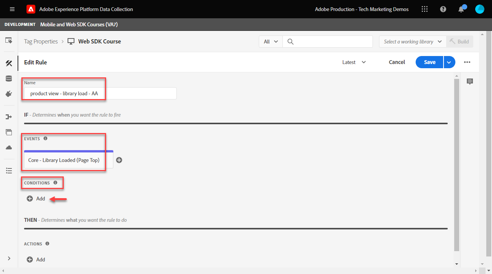

# Einrichten von Adobe Analytics mit dem Platform Web SDK

Erfahren Sie, wie Sie Adobe Analytics mit [Experience Platform Web SDK](https://experienceleague.adobe.com/docs/platform-learn/data-collection/web-sdk/overview.html), erstellen Sie Tag-Regeln, um Daten an Adobe Analytics zu senden, und überprüfen Sie, ob Analytics Daten erwartungsgemäß erfasst.

[Adobe Analytics](https://experienceleague.adobe.com/docs/analytics.html?lang=de) ist eine branchenführende Anwendung, mit der Sie Ihre Kunden besser verstehen und Ihr Geschäft mit Customer Intelligence steuern können.

## Lernziele

Am Ende dieser Lektion können Sie:

* Konfigurieren eines XDM-Schemas für Adobe Analytics und Erkennen des Unterschieds zwischen automatisch zugeordneten und manuell zugeordneten XDM-Variablen für Analytics
* Konfigurieren eines Datenspeichers zur Aktivierung von Adobe Analytics
* Ordnen Sie einzelne oder komplette Array-Datenelemente dem XDM-Objekt zu.
* Erfassen von Seitenansichten in Adobe Analytics mit dem XDM-Objekt
* Erfassen von E-Commerce-Daten mit dem XDM-Objekt für die Adobe Analytics-Produktzeichenfolge
* Überprüfen, ob Adobe Analytics-Variablen mit dem XDM-Objekt mithilfe von Experience Platform Debugger festgelegt werden
* Verwenden von Adobe Analytics-Verarbeitungsregeln zum Festlegen benutzerdefinierter Variablen
* Daten mithilfe von Echtzeitberichten von Adobe Analytics überprüfen

## Voraussetzungen

Sie kennen Tags, Adobe Analytics und die [Demosite &quot;Luma&quot;](https://luma.enablementadobe.com/content/luma/us/en.html){target=&quot;_blank&quot;} Anmelde- und Einkaufsfunktion.

Sie benötigen mindestens eine Test-/Entwicklungs-Report Suite-ID. Wenn Sie nicht über eine Report Suite für Tests/Entwicklung verfügen, die Sie für dieses Tutorial verwenden können, [erstellen Sie bitte eine](https://experienceleague.adobe.com/docs/analytics/admin/manage-report-suites/new-report-suite/t-create-a-report-suite.html?lang=de).

Sie müssen alle Schritte aus den vorherigen Abschnitten des Tutorials abgeschlossen haben:

* Erstkonfiguration
   * [Berechtigungen konfigurieren](configure-permissions.md)
   * [Konfigurieren eines XDM-Schemas](configure-schemas.md)
   * [Identitäts-Namespace konfigurieren](configure-identities.md)
   * [Konfigurieren eines Datenstroms](configure-datastream.md)
* Tag-Konfiguration
   * [Installieren der Web SDK-Erweiterung](install-web-sdk.md)
   * [Erstellen von Datenelementen](create-data-elements.md)
   * [Tag-Regel erstellen](create-tag-rule.md)
   * [Überprüfen mit dem Adobe Experience Platform-Debugger](validate-with-debugger.md)

## XDM-Schemata und Analytics-Variablen

Herzlichen Glückwunsch! Sie haben bereits ein mit Adobe Analytics kompatibles Schema im [Schema konfigurieren](configure-schemas.md) Lektion!

Die Implementierung des Platform Web SDK sollte so produktunabhängig wie möglich sein. Bei Adobe Analytics erfolgt die Zuordnung von eVars, Props und Ereignissen weder während der Schemaerstellung noch während der Tag-Regelkonfiguration, wie dies bisher der Fall war. Stattdessen wird jedes XDM-Schlüssel-Wert-Paar zu einer Kontextdatenvariablen, die auf zwei Arten einer Analytics-Variablen zugeordnet wird:

1. Automatisch zugeordnete Variablen mit reservierten XDM-Feldern
1. Manuelles Zuordnen von Variablen mithilfe von Analytics-Verarbeitungsregeln

Informationen dazu, welche XDM-Variablen automatisch Adobe Analytics zugeordnet werden, finden Sie unter [Automatisch in Analytics zugeordnete Variablen](https://experienceleague.adobe.com/docs/experience-platform/edge/data-collection/adobe-analytics/automatically-mapped-vars.html?lang=en). Jede Variable, die nicht automatisch zugeordnet ist, muss manuell zugeordnet werden.

Das im [Schema konfigurieren](configure-schemas.md) Die Lektion enthält einige automatisch zugeordnete Analytics-Variablen, wie in dieser Tabelle beschrieben:

| Automatisch zugeordnete Variablen von XDM zu Analytics | Adobe Analytics-Variable |
|-------|---------|
| `identitymap.ecid.[0].id` | mid |
| `web.webPageDetails.pageViews.value` | Aufruf von s.t() für Seitenansichten |
| `web.webPageDetails.name` | s.pageName |
| `web.webPageDetails.server` | s.server |
| `web.webPageDetails.siteSection` | s.channel |
| `commerce.productViews.value` | prodView |
| `commerce.productListViews.value` | scView |
| `commerce.checkouts.value` | scCheckout |
| `commerce.purchases.value` | Kauf |
| `commerce.order.currencyCode` | s.currencyCode |
| `commerce.order.purchaseID` | s.purchaseID |
| `productListItems[].SKU` | s.products=;product name;;; (primär - siehe Hinweis unten) |
| `productListItems[].name` | s.products=;product name;;; (Fallback - siehe Hinweis unten) |
| `productListItems[].quantity` | s.products=;;Produktmenge;; |
| `productListItems[].priceTotal` | s.product=;;;Produktpreis; |

>[!NOTE]
>
>Die einzelnen Abschnitte der Analytics-Produktzeichenfolge werden durch verschiedene XDM-Variablen unter der `productListItems` -Objekt.
>Am 18. August 2022 `productListItems[].SKU` hat Priorität für die Zuordnung zum Produktnamen in der Variablen s.products .
>Der auf `productListItems[].name` nur dann dem Produktnamen zugeordnet wird, wenn `productListItems[].SKU` existiert nicht. Andernfalls ist sie nicht zugeordnet und in Kontextdaten verfügbar.
>Setzen Sie keine leere Zeichenfolge oder null auf  `productListItems[].SKU`. Dies hat den unerwünschten Effekt, dass die Zuordnung zum Produktnamen in der Variablen s.products vorgenommen wird.


## Konfigurieren des Datenspeichers

Das Platform Web SDK sendet Daten von Ihrer Website an das Platform Edge Network. Ihr Datastream teilt dann dem Platform Edge Network mit, wohin diese Daten weitergeleitet werden sollen, in diesem Fall welche Ihrer Adobe Analytics Report Suites.

1. Navigieren Sie zu [Datenerfassung](https://experience.adobe.com/#/data-collection)Benutzeroberfläche von {target=&quot;blank&quot;}
1. Wählen Sie im linken Navigationsbereich die Option **[!UICONTROL Datenspeicher]**
1. Wählen Sie die zuvor erstellte `Luma Web SDK` datastream

   

1. Wählen Sie **[!UICONTROL Service hinzufügen]** aus

   
1. Auswählen **[!UICONTROL Adobe Analytics]** als **[!UICONTROL Diensleistung]**
1. Geben Sie die  **[!UICONTROL Report Suite-ID]** Ihrer Entwicklungs-Report Suite
1. Wählen Sie **[!UICONTROL Speichern]** aus

   

   >[!TIP]
   >
   >Hinzufügen weiterer Report Suites durch Auswahl von **[!UICONTROL Report Suite hinzufügen]** entspricht Multi-Suite-Tagging.

>[!WARNING]
>
>In diesem Tutorial konfigurieren Sie nur die Entwicklungs-Adobe Analytics-Report Suite. Wenn Sie Datenspeicher für Ihre eigene Website erstellen, erstellen Sie zusätzliche Datenspeicher und Report Suites für Ihre Staging- und Produktionsumgebungen.


## Erstellen zusätzlicher Datenelemente

Erfassen Sie als Nächstes zusätzliche Daten aus der Datenschicht &quot;Luma&quot;und senden Sie sie an das Platform Edge Network. Während sich die Lektion auf allgemeine Adobe Analytics-Anforderungen konzentriert, können alle erfassten Daten basierend auf Ihrer Datastream-Konfiguration einfach an andere Ziele gesendet werden. Wenn Sie beispielsweise die Adobe Experience Platform-Lektion abgeschlossen haben, werden die zusätzlichen Daten, die Sie in dieser Lektion erfassen, auch an Platform gesendet.

### Erstellen von E-Commerce-Datenelementen

Während der Lektion zum Erstellen von Datenelementen haben Sie folgende Möglichkeiten: [erstellte JavaScript-Datenelemente](create-data-elements.md#create-data-elements-to-capture-the-data-layer) , die Inhalte und Identitätsdetails erfasst haben. Jetzt erstellen Sie zusätzliche Datenelemente, um E-Commerce-Daten zu erfassen. Da die [Demosite &quot;Luma&quot;](https://luma.enablementadobe.com/content/luma/us/en.html){target=&quot;_blank&quot;} verwendet unterschiedliche Datenschichtstrukturen für Produktdetailseiten und Produkte im Warenkorb. Sie müssen Datenelemente für jedes Szenario erstellen. Sie müssen einige Datenelemente mit benutzerdefiniertem Code erstellen, um die benötigten Daten aus der Luma-Datenschicht abzurufen, was bei der Implementierung auf Ihrer eigenen Site erforderlich sein kann oder nicht. In diesem Fall müssen Sie eine Reihe von Warenkorbelementen durchlaufen, um spezifische Details zu den einzelnen Produkten abzurufen. Verwenden Sie die unten angegebenen Code-Snippets:

1. Öffnen Sie die Tag-Eigenschaft, die Sie für das Tutorial verwenden
1. Navigieren Sie zu **[!UICONTROL Datenelemente]**
1. Wählen Sie **[!UICONTROL Datenelement hinzufügen]** aus
1. Benennen Sie ihn **`product.productInfo.sku`**
1. Verwenden Sie die **[!UICONTROL Benutzerspezifischer Code]** **[!UICONTROL Datenelementtyp]**
1. Lassen Sie Kontrollkästchen für **[!UICONTROL Kleinbuchstaben erzwingen Wert]** und **[!UICONTROL Text bereinigen]** deaktiviert
1. Urlaub `None` als **[!UICONTROL Speicherdauer]** Einstellung, da dieser Wert auf jeder Seite unterschiedlich ist
1. Wählen Sie **[!UICONTROL Editor öffnen]**

   

1. Kopieren Sie den folgenden Code und fügen Sie ihn ein.

   ```javascript
   var cart = digitalData.product;
   var cartItem;
   cart.forEach(function(item){
   cartItem = item.productInfo.sku;
   });
   return cartItem;
   ```

1. Auswählen **[!UICONTROL Speichern]** , um den benutzerspezifischen Code zu speichern

   

1. Auswählen **[!UICONTROL Speichern]** Speichern des Datenelements

Führen Sie dieselben Schritte aus, um diese zusätzlichen Datenelemente zu erstellen:

* **`product.productInfo.title`**

   ```javascript
   var cart = digitalData.product;
   var cartItem;
   cart.forEach(function(item){
   cartItem = item.productInfo.title;
   });
   return cartItem;
   ```

* **`cart.productInfo`**

   ```javascript
   var cart = digitalData.cart.cartEntries;
   var cartItem = [];
   cart.forEach(function(item, index, array){
   var qty = parseInt(item.qty);
   var price = parseInt(item.price);
   cartItem.push({
   "SKU": item.sku,
   "name":item.title,
   "quantity":qty,
   "priceTotal":price
   });
   });
   return cartItem;
   ```

Nachdem Sie diese Datenelemente hinzugefügt und die vorherigen Elemente in der [Erstellen von Datenelementen](create-data-elements.md) -Lektion verwenden, sollten Sie über die folgenden Datenelemente verfügen:

| Datenelemente |
-----------------------------|
| `cart.orderId` |
| `cart.productInfo` |
| `identityMap.loginID` |
| `page.pageInfo.hierarchie1` |
| `page.pageInfo.pageName` |
| `page.pageInfo.server` |
| `product.productInfo.sku` |
| `product.productInfo.title` |
| `user.profile.attributes.loggedIn` |
| `user.profile.attributes.username` |
| `xdm.content` |

>[!IMPORTANT]
>
>In diesem Tutorial erstellen Sie für jedes Ereignis ein anderes XDM-Objekt. Das bedeutet, dass Sie Variablen übergeben müssen, die bei jedem Treffer als &quot;global&quot;verfügbar betrachtet werden, z. B. Seitenname und identityMap. Sie können jedoch [Objekte zusammenführen](https://experienceleague.adobe.com/docs/experience-platform/tags/extensions/adobe/core/overview.html#merged-objects) oder Verwendung [Zuordnungstabellen](https://exchange.adobe.com/experiencecloud.details.103136.mapping-table.html) um Ihre XDM-Objekte in einer Echtzeit-Situation effizienter zu verwalten. In dieser Lektion werden die globalen Variablen wie folgt betrachtet:
>
>* **[!UICONTROL identityMap]** zum Erfassen der authentifizierten ID gemäß [Identitätszuordnungs-Datenelement erstellen](create-data-elements.md#create-identity-map-data-element) in [Erstellen von Datenelementen](create-data-elements.md) Lektion.
>* **[!UICONTROL Web]** -Objekt zum Erfassen von Inhalten gemäß [Content XDM-Objekt](create-data-elements.md#map-content-data-elements-to-XDM-Schema-individually) in [Erstellen von Datenelementen](create-data-elements.md) Lektion zu jedem Datenelement oben.


### Erhöhen der Seitenansichten

In der Lektion zum Erstellen von Datenelementen haben Sie folgende Möglichkeiten: [erstellt `xdm.content` Datenelement](create-data-elements.md#map-content-data-elements-to-xdm-schema-individually) , um Inhaltsdimensionen zu erfassen. Da Sie jetzt Daten an Adobe Analytics senden, müssen Sie auch ein zusätzliches XDM-Feld zuordnen, um anzugeben, dass ein Beacon als Seitenansicht von Analytics verarbeitet werden soll.

1. Öffnen Sie Ihre `xdm.content` Datenelement
1. Scrollen Sie nach unten und wählen Sie zum Öffnen aus, bis `web.webPageDetails`
1. Wählen Sie aus, um die **[!UICONTROL pageViews]** Objekt
1. Satz **[!UICONTROL value]** nach `1`
1. Wählen Sie [!UICONTROL **Speichern**] aus

   

>[!TIP]
>
>Dieses Feld entspricht dem Senden einer **`s.t()`** Seitenansichts-Beacon für Analytics mit `AppMeasurement.js`. Legen Sie für ein Link-Klick-Beacon die `webInteraction.linkClicks.value` nach `1`


### Produktzeichenfolge festlegen

Bevor Sie der Produktzeichenfolge zuordnen, müssen Sie wissen, dass es im XDM-Schema zwei Hauptobjekte gibt, die zur Erfassung von E-Commerce-Daten verwendet werden, die besondere Beziehungen zu Adobe Analytics haben:

1. Die `commerce` -Objekt legt Analytics-Ereignisse wie `prodView`, `scView`und `purchase`
1. Die `productListItems` -Objekt legt Analytics-Dimensionen wie `productID`.

Siehe [Erfassen von Commerce- und Produktdaten](https://experienceleague.adobe.com/docs/experience-platform/edge/data-collection/collect-commerce-data.html?lang=en) für weitere Details.

Es ist auch wichtig zu verstehen, dass Sie **[!UICONTROL Bereitstellen einzelner Attribute]** zu einzelnen XDM-Feldern oder **[!UICONTROL Bereitstellung eines gesamten Arrays]** in ein XDM-Objekt ein.


### Zuordnen einzelner Attribute zu einem XDM-Objekt

Sie können einzelnen Variablen zuordnen, um Daten auf der Produktdetailseite der Demosite &quot;Luma&quot;zu erfassen:

1. Erstellen Sie eine **[!UICONTROL XDM-Objekt]** **[!UICONTROL Datenelementtyp]** benannt **`xdm.commerce.prodView`**
1. Wählen Sie dieselbe Platform-Sandbox und dasselbe XDM-Schema aus, die in vorherigen Lektionen verwendet wurden
1. Öffnen Sie die **[!UICONTROL commerce]** Objekt
1. Öffnen Sie die **[!UICONTROL productViews]** -Objekt und -set **[!UICONTROL value]** nach `1`

   

   >[!TIP]
   >
   >Dieser Schritt entspricht der Einstellung `prodView` -Ereignis in Analytics


1. Scrollen Sie nach unten zu und wählen Sie `productListItems` array
1. Auswählen **[!UICONTROL Bereitstellen einzelner Elemente]**
1. Auswählen **[!UICONTROL Element hinzufügen]**

   

   >[!CAUTION]
   >
   >Die **`productListItems`** ist `array` -Datentyp, sodass erwartet wird, dass Daten als Sammlung von Elementen eingehen. Aufgrund der Datenschichtstruktur der Demosite &quot;Luma&quot;und da es nur möglich ist, jeweils ein Produkt auf der Site &quot;Luma&quot;anzuzeigen, fügen Sie Elemente einzeln hinzu. Bei der Implementierung auf Ihrer eigenen Website können Sie je nach Datenschichtstruktur möglicherweise ein ganzes Array bereitstellen.

1. Zum Öffnen auswählen **[!UICONTROL Posten 1]**
1. Ordnen Sie die folgenden XDM-Variablen Datenelementen zu

   * **`productListItems.item1.SKU`** in `%product.productInfo.sku%`
   * **`productListItems.item1.name`** in `%product.productInfo.title%`

   

   >[!IMPORTANT]
   >
   >Bevor Sie dieses XDM-Objekt speichern, stellen Sie sicher, dass Sie auch die &quot;globalen&quot;Variablen und den Seitenansichtsinkrementer festlegen:
   >

1. Wählen Sie **[!UICONTROL Speichern]** aus

### Ordnen Sie das gesamte Array einem XDM-Objekt zu

Wie bereits erwähnt, verwendet die Site &quot;Luma Demo&quot;eine andere Datenschichtstruktur für Produkte im Warenkorb. Das Datenelement des benutzerspezifischen Codes `cart.productInfo` Das zuvor erstellte Datenelement durchläuft die `digitalData.cart.cartEntries` Datenschichtobjekt und übersetzt es in das erforderliche XDM-Objektschema. Das neue Format **muss exakt übereinstimmen** das von der `productListItems` -Objekt des XDM-Schemas.

Sehen Sie sich dazu den unten stehenden Vergleich der Datenschicht der Site &quot;Luma&quot;(links) mit dem übersetzten Datenelement (rechts) an:


Das Datenelement mit dem `productListItems` Struktur (Hinweis, sollte übereinstimmen).

>[!IMPORTANT]
>
>Beachten Sie, wie numerische Variablen übersetzt werden, wobei Zeichenfolgenwerte in der Datenschicht wie `price` und `qty` in Zahlen im Datenelement umformatiert. Diese Formatanforderungen sind für die Datenintegrität in Platform wichtig und werden während der [Schemas konfigurieren](configure-schemas.md) Schritt. Im Beispiel **[!UICONTROL quantity]** verwendet die **[!UICONTROL Ganzzahl]** Datentyp.
> 

Zurück zur Zuordnung des XDM-Objekts zu einem ganzen Array. Erstellen Sie ein XDM-Objektdatenelement, um Produkte auf der Warenkorbseite zu erfassen:

1. Erstellen Sie eine **[!UICONTROL XDM-Objekt]** **[!UICONTROL Datenelementtyp]** benannt **`xdm.commerce.cartView`**
1. Wählen Sie dasselbe Platform-Sandbox- und XDM-Schema aus, das Sie für dieses Tutorial verwenden
1. Öffnen Sie die **[!UICONTROL commerce]** Objekt
1. Öffnen Sie die **[!UICONTROL productListViews]** -Objekt und -set `value` nach `1`

   >[!TIP]
   >
   >Dieser Schritt entspricht der Einstellung `scView` -Ereignis in Analytics

1. Scrollen Sie nach unten zu und wählen Sie **[!UICONTROL productListItems]** array
1. Auswählen **[!UICONTROL Gesamtes Array bereitstellen]**
1. Zuordnung zu **`cart.productInfo`** Datenelement

   

   >[!IMPORTANT]
   >
   >Bevor Sie dieses XDM-Objekt speichern, stellen Sie sicher, dass Sie auch die &quot;globalen&quot;Variablen und den Seitenansichtsinkrementer festlegen:
   >

1. Wählen Sie **[!UICONTROL Speichern]** aus

Erstellen eines weiteren **[!UICONTROL XDM-Objekt]**  **[!UICONTROL Datenelementtyp]** für Checkouts mit `xdm.commerce.checkout`. Legen Sie die **[!UICONTROL commerce.checkouts.value]** nach `1`, map **[!UICONTROL productListItems]** nach **`cart.productInfo`** wie soeben, und fügen Sie die &quot;globalen&quot;Variablen und den Zähler für Seitenansichten hinzu.

>[!TIP]
>
>Dieser Schritt entspricht der Einstellung `scCheckout` -Ereignis in Analytics


Es gibt weitere Schritte zum Erfassen der `purchase` event:

1. Erstellen eines weiteren  **[!UICONTROL XDM-Objekt]**  **[!UICONTROL Datenelementtyp]** für Käufe aufgerufen `xdm.commerce.purchase`
1. Öffnen **[!UICONTROL commerce]** Objekt
1. Öffnen Sie die **[!UICONTROL order]** Objekt
1. Zuordnung **[!UICONTROL purchaseID]** der `cart.orderId` Datenelement
1. Satz **[!UICONTROL currencyCode]** zum hartcodierten Wert `USD`

   

   >[!TIP]
   >
   >Dies entspricht der Einstellung `s.purcahseID` und `s.currencyCode` Variablen in Analytics

1. Wählen Sie aus, um die `purchases` -Objekt und -set `value` nach `1`
   >[!TIP]
   >
   >Dies entspricht der Einstellung `purchase` -Ereignis in Analytics

   >[!IMPORTANT]
   >
   >Bevor Sie dieses XDM-Objekt speichern, stellen Sie sicher, dass Sie auch die &quot;globalen&quot;Variablen und den Seitenansichtsinkrementer festlegen:
   >

1. Wählen Sie **[!UICONTROL Speichern]** aus

Am Ende dieser Schritte sollten die folgenden fünf XDM-Objektdatenelemente erstellt werden:

| XDM-Objektdatenelemente |
-----------------------------|
| `xdm.commerce.cartView` |
| `xdm.commerce.checkout` |
| `xdm.commerce.prodView` |
| `xdm.commerce.purchase` |
| `xdm.content` |


## Erstellen zusätzlicher Regeln für das Platform Web SDK

Nachdem Sie mehrere XDM-Objektdatenelemente erstellt haben, können Sie die Beacons mithilfe von Regeln festlegen. In dieser Übung erstellen Sie individuelle Regeln pro E-Commerce-Ereignis und verwenden Bedingungen, damit die Regeln auf den richtigen Seiten ausgelöst werden. Beginnen wir mit einem Produktansichtsereignis.

1. Wählen Sie in der linken Navigation die Option **[!UICONTROL Regeln]** und wählen Sie **[!UICONTROL Regel hinzufügen]**
1. Benennen Sie ihn  [!UICONTROL `product view - library load - AA`]
1. under **[!UICONTROL Veranstaltungen]** auswählen **[!UICONTROL Bibliothek geladen (Seitenanfang)]**
1. under **[!UICONTROL Bedingungen]**, wählen Sie **[!UICONTROL Hinzufügen]**

   

1. Urlaub **[!UICONTROL Logiktyp]** as **[!UICONTROL Normal]**
1. Urlaub **[!UICONTROL Erweiterungen]** as **[!UICONTROL Core]**
1. Auswählen **[!UICONTROL Bedingungstyp]** as **[!UICONTROL Pfad ohne Abfragezeichenfolge]**
1. Aktivieren Sie rechts die Option **[!UICONTROL Regex]** Umschalten
1. under **[!UICONTROL path equals]** set `/products/`. Auf der Demosite &quot;Luma&quot;wird sichergestellt, dass die Regel nur Trigger auf Produktseiten enthält.
1. Wählen Sie **[!UICONTROL Änderungen beibehalten]** aus

   

1. under **[!UICONTROL Aktionen]** select **[!UICONTROL Hinzufügen]**
1. Auswählen **[!UICONTROL Adobe Experience Platform Web SDK]** Erweiterung
1. Auswählen **[!UICONTROL Aktionstyp]** as **[!UICONTROL Ereignis senden]**
1. Die **[!UICONTROL Typ]** verfügt über eine Dropdown-Liste mit Werten, aus denen Sie auswählen können. Auswählen `[!UICONTROL commerce.productViews]`

   >[!TIP]
   >
   >Der hier ausgewählte Wert hat keinen Einfluss darauf, wie Daten Analytics zugeordnet werden. Es wird jedoch empfohlen, diese Variable sorgfältig anzuwenden, da sie in der Segment Builder-Oberfläche von Adobe Experience Platform verwendet wird. Der ausgewählte Wert kann im `[!UICONTROL c.a.x.eventtype]` Kontextdatenvariable nachgelagert.

1. under **[!UICONTROL XDM-Daten]**, wählen Sie die `[!UICONTROL xdm.commerce.prodView]` XDM-Objektdatenelement
1. Wählen Sie **[!UICONTROL Änderungen beibehalten]** aus

   

1. Ihre Regel sollte in etwa wie unten dargestellt aussehen. Wählen Sie **[!UICONTROL Speichern]** aus

   


Wiederholen Sie dies für alle anderen E-Commerce-Ereignisse mit den folgenden Parametern:

**Regelname**: Warenkorbansicht - Bibliotheksladung - AA

* **[!UICONTROL Ereignistyp]**: Bibliothek geladen (Seitenanfang)
* **[!UICONTROL Bedingung]**: /content/luma/us/en/user/cart.html
* **Wert unter Web SDK - Aktion senden**: commerce.productListViews
* **XDM-Daten für Web SDK - Sendeaktion:** `%xdm.commerce.cartView%`

**Regelname**: Checkout - Bibliotheksladung - AA

* **[!UICONTROL Ereignistyp]**: Bibliothek geladen (Seitenanfang)
* **[!UICONTROL Bedingung]** /content/luma/us/en/user/checkout.html
* **Typ für Web SDK - Sendeaktion**: commerce.checkouts
* **XDM-Daten für Web SDK - Sendeaktion:** `%xdm.commerce.checkout%`

**Regelname**: purchase - Bibliotheksladung - AA

* **[!UICONTROL Ereignistyp]**: Bibliothek geladen (Seitenanfang)
* **[!UICONTROL Bedingung]** /content/luma/us/en/user/checkout/order/thank-you.html
* **Typ für Web SDK - Sendeaktion**: commerce.purchases
* **XDM-Daten für Web SDK - Sendeaktion:** `%xdm.commerce.purchase%`

Wenn Sie fertig sind, sollten die folgenden Regeln erstellt werden.


## Erstellen der Entwicklungsumgebung

Fügen Sie Ihre neuen Datenelemente und Regeln zu Ihren `Luma Web SDK Tutorial` -Tag-Bibliothek und erstellen Sie Ihre Entwicklungsumgebung neu.


## Adobe Analytics für Platform Web SDK überprüfen

Im [Debugger](validate-with-debugger.md) In der Lektion haben Sie gelernt, wie Sie das clientseitige XDM-Objekt-Beacon mit Platform Debugger und der Browser-Entwicklerkonsole überprüfen können, ähnlich wie beim Debugging eines `AppMeasurement.js` Analytics-Implementierung. Um zu überprüfen, ob Analytics Daten ordnungsgemäß über das Platform Web SDK erfasst, müssen Sie zwei Schritte weiter gehen:

1. Validieren Sie mithilfe der Edge Trace-Funktion des Experience Platform Debuggers, wie Daten vom XDM-Objekt im Platform Edge Network verarbeitet werden.
1. Validieren Sie, wie Daten von Analytics mithilfe von Verarbeitungsregeln und Echtzeitberichten verarbeitet werden.

### Verwenden von Edge Trace

Erfahren Sie, wie Sie mit der Funktion &quot;Edge Trace&quot;des Experience Platform Debuggers überprüfen, ob Adobe Analytics die ECID, Seitenansichten, die Produktzeichenfolge und E-Commerce-Ereignisse erfasst.

### Validierung der Experience Cloud-ID

1. Navigieren Sie zu [Demosite &quot;Luma&quot;](https://luma.enablementadobe.com/content/luma/us/en.html){target=&quot;_blank&quot;} und verwenden Sie den Experience Platform Debugger für [Ändern Sie die Tag-Eigenschaft auf der Site in Ihre eigene Entwicklungseigenschaft.](validate-with-debugger.md#use-the-experience-platform-debugger-to-map-to-your-tags-property)

   >[!WARNING]
   >
   >Bevor Sie weitermachen, stellen Sie sicher, dass Sie bei der Site &quot;Luma&quot;angemeldet sind.  Wenn Sie nicht angemeldet sind, können Sie auf der Site &quot;Luma&quot;nicht auschecken.
   >
   > 1. Wählen Sie unter &quot;Luma&quot;die Anmelde-Schaltfläche oben rechts aus und verwenden Sie die Anmeldeinformationen. **u: test@adobe.com p: test** zum Authentifizieren
   >
   > 1. Sie werden automatisch zum [Didi Sport Watch-Produktseite](https://luma.enablementadobe.com/content/luma/us/en/products/gear/watches/didi-sport-watch.html#24-WG02) beim nächsten Laden der Seite


1. Um den Edge Trace zu aktivieren, gehen Sie zum Experience Platform Debugger und wählen Sie im linken Navigationsmenü die Option **[!UICONTROL Protokolle]** und wählen Sie dann die **[!UICONTROL Edge]** und wählen Sie **[!UICONTROL Verbinden]**

   

1. Es ist vorerst leer

   

1. Aktualisieren Sie die [Didi Sport Watch-Produktseite](https://luma.enablementadobe.com/content/luma/us/en/products/gear/watches/didi-sport-watch.html#24-WG02) und erneut Experience Platform Debugger aktivieren, sollten die Daten angezeigt werden. Die Zeile, die mit **[!UICONTROL Automatische Zuordnung von RSIDs in Analytics]** ist das Adobe Analytics-Beacon
1. Wählen Sie aus, um beide `[!UICONTROL mappedQueryParams]` Dropdown und das zweite Dropdown-Menü zur Ansicht von Analytics-Variablen

   

   >[!TIP]
   >
   >Das zweite Dropdown-Menü entspricht der Analytics Report Suite-ID, an die Sie Daten senden. Sie sollte mit Ihrer eigenen Report Suite übereinstimmen, nicht mit der im Screenshot.

1. Scrollen Sie nach unten, um `[!UICONTROL c.a.x.identitymap.ecid.[0].id]`. Es handelt sich dabei um eine Kontextdatenvariable, die ECID erfasst
1. Scrollen Sie nach unten, bis Analytics angezeigt wird. `[!UICONTROL mid]` -Variable. Beide IDs stimmen mit der Experience Cloud-ID Ihres Geräts überein.

   

   >[!NOTE]
   >
   >Da Sie angemeldet sind, nehmen Sie sich einen Moment Zeit, um die authentifizierte ID zu validieren `112ca06ed53d3db37e4cea49cc45b71e` für den Benutzer **test@adobe.com** wird auch im `[!UICONTROL c.a.x.identitymap.lumacrmid.[0].id]`


### Inhaltsseitenansichten

Sie verwenden dasselbe Beacon, um zu überprüfen, ob Seitenansichten von Inhalten von Analytics erfasst werden.

1. Suchen nach `[!UICONTROL c.a.x.web.webpagedetails.pageviews.value]=1`. Es zeigt Ihnen, dass `s.t()` Seitenansichts-Beacon wird an Analytics gesendet
1. Scrollen Sie nach unten, um die `[!UICONTROL gn]` -Variable. Dies ist die dynamische Analytics-Syntax für die `[!UICONTROL s.pageName]` -Variable. Sie erfasst den Seitennamen aus der Datenschicht.

   

### Produktzeichenfolgen und E-Commerce-Ereignisse

Da Sie sich bereits auf einer Produktseite befinden, verwendet diese Übung weiterhin denselben Edge Trace, um Produktdaten zu überprüfen, die von Analytics erfasst werden. Sowohl die Produktzeichenfolge als auch die E-Commerce-Ereignisse werden Analytics automatisch XDM-Variablen zugeordnet. Solange Sie dem `productListItem` XDM-Variable während [Konfigurieren eines XDM-Schemas für Adobe Analytics](setup-analytics.md#configure-an-xdm-schema-for-adobe-analytics), kümmert sich das Platform Edge Network um die Zuordnung der Daten zu den richtigen Analysevariablen.

1. Überprüfen Sie zunächst, ob die `Product String` festgelegt ist
1. Suchen nach `[!UICONTROL c.a.x.productlistitems.][0].[!UICONTROL sku]`. Die Variable erfasst den Datenelementwert, den Sie der Variablen `productListItems.item1.sku` früher in dieser Lektion
1. Scrollen Sie nach unten, um die `[!UICONTROL pl]` -Variable. Dies ist die dynamische Syntax der Analytics-Variablen mit der Produktzeichenfolge .
1. Beide Werte stimmen mit dem Produktnamen überein, der in der Datenschicht verfügbar ist

   

Die Edge Trace-Behandlung `commerce` Ereignisse geringfügig anders als `productList` Dimensionen. Es wird keine Kontextdatenvariable angezeigt, die auf die gleiche Weise zugeordnet ist wie der Produktname, der `[!UICONTROL c.a.x.productlistitem.[0].name]` höher. Stattdessen zeigt Edge Trace die endgültige automatische Ereigniszuordnung in Analytics an `event` -Variable. Das Platform Edge Network ordnet es entsprechend zu, solange Sie dem entsprechenden XDM-Element zuordnen `commerce` Variable während [Konfiguration des Schemas für Adobe Analytics](setup-analytics.md#configure-an-xdm-schema-for-adobe-analytics); in diesem Fall `commerce.productViews.value=1`.

1. Scrollen Sie im Experience Platform Debugger-Fenster nach unten zum `[!UICONTROL event]` festgelegt ist, wird `[!UICONTROL prodView]`

   

Überprüfen Sie, ob die restlichen E-Commerce-Ereignisse und Produktzeichenfolgen für Analytics festgelegt sind.

1. Hinzufügen [Didi Sport Watch](https://luma.enablementadobe.com/content/luma/us/en/products/gear/watches/didi-sport-watch.html#24-WG02) zum Warenkorb
1. Navigieren Sie zu [Einkaufswagenseite](https://luma.enablementadobe.com/content/luma/us/en/user/cart.html), aktivieren Sie Edge Trace für `[!UICONTROL events: "scView"]` und die Produktzeichenfolge

   

1. Fahren Sie mit dem Checkout fort und suchen Sie nach Edge Trace für `[!UICONTROL events: "scCheckout"]` und die Produktzeichenfolge

   

1. Füllen Sie nur die **Vorname** und **Nachname** Felder im Versandformular und wählen Sie **Weiter**. Wählen Sie auf der nächsten Seite **Bestellung platzieren**
1. Überprüfen Sie auf der Bestätigungsseite Edge Trace auf

   * Kaufereignis festgelegt `[!UICONTROL events: "purchase"]`
   * Währungscode-Variable festgelegt `[!UICONTROL cc: "USD"]`
   * Kauf-ID festgelegt in `[!UICONTROL pi]`
   * Produktzeichenfolge `[!UICONTROL pl]` Festlegen von Produktname, Menge und Preis

   

## Verarbeitungsregeln und Echtzeitberichte

Nachdem Sie die Analytics-Beacons jetzt mit Edge Trace validiert haben, können Sie auch überprüfen, ob die Daten von Analytics mithilfe der Echtzeitberichte verarbeitet werden. Bevor Sie die Echtzeitberichte überprüfen, müssen Sie Verarbeitungsregeln für Analytics konfigurieren `props` nach Bedarf.

### Verarbeitungsregeln für benutzerdefinierte Analytics-Zuordnungen

In dieser Übung ordnen Sie eine XDM-Variable einer Prop zu, damit Sie sie in Echtzeitberichten anzeigen können. Führen Sie dieselben Schritte für jede benutzerdefinierte Zuordnung aus, die Sie für jede `eVar`, `prop`, `event`oder Variablen, auf die über Verarbeitungsregeln zugegriffen werden kann.

1. Navigieren Sie in der Analytics-Benutzeroberfläche zu [!UICONTROL Admin] > [!UICONTROL Admin Tools] > [!UICONTROL Report Suites ]
1. Wählen Sie die Entwicklungs-/Test-Report Suite aus, die Sie für das Tutorial verwenden > [!UICONTROL Einstellungen bearbeiten] > [!UICONTROL Allgemein] > [!UICONTROL Verarbeitungsregeln]

   

1. Erstellen Sie eine Regel für **[!UICONTROL Wert von überschreiben]** `[!UICONTROL Product Name (prop1)]` nach `a.x.productlistitems.0.name`. Denken Sie daran, Ihren Hinweis hinzuzufügen, warum Sie die Regel erstellen, und nennen Sie Ihren Regeltitel. Wählen Sie **[!UICONTROL Speichern]** aus

   

   >[!IMPORTANT]
   >
   >Wenn Sie eine Verarbeitungsregel zum ersten Mal zuordnen, zeigt die Benutzeroberfläche die Kontextdatenvariablen aus dem XDM-Objekt nicht an. Um das Problem zu beheben, bei dem ein beliebiger Wert ausgewählt wurde, speichern Sie und kehren Sie zur Bearbeitung zurück. Alle XDM-Variablen sollten jetzt angezeigt werden.

1. Navigieren Sie zu [!UICONTROL Einstellungen bearbeiten] >  [!UICONTROL Echtzeit]. Konfigurieren Sie alle drei Parameter mit den folgenden Parametern, die unten angezeigt werden, damit Sie Inhaltsseitenansichten, Produktansichten und Käufe überprüfen können

   

1. Wiederholen Sie die Validierungsschritte und Sie sollten sehen, dass Echtzeitberichte Daten entsprechend ausfüllen.

   **Page Views**
   

   **Produktansichten**
   

   **Käufe**
   

1. Erstellen Sie in der Workspace-Benutzeroberfläche eine Tabelle, um den vollständigen E-Commerce-Fluss des von Ihnen gekauften Produkts anzuzeigen

   

Weitere Informationen zum Zuordnen von XDM-Feldern zu Analytics-Variablen finden Sie im Video [Web SDK-Variablen in Adobe Analytics zuordnen](https://experienceleague.adobe.com/docs/analytics-learn/tutorials/analysis-use-cases/internal-site-search/map-web-sdk-variables-into-adobe-analytics.html).

Herzlichen Glückwunsch! Dies ist das Ende der Lektion und jetzt können Sie Adobe Analytics mit dem Platform Web SDK für Ihre eigene Website implementieren.

[Weiter: ](setup-audience-manager.md)

>[!NOTE]
>
>Vielen Dank, dass Sie Ihre Zeit investiert haben, um mehr über das Adobe Experience Platform Web SDK zu erfahren. Wenn Sie Fragen haben, ein allgemeines Feedback teilen möchten oder Vorschläge zu künftigen Inhalten haben, teilen Sie diese bitte mit. [Diskussionsbeitrag der Experience League](https://experienceleaguecommunities.adobe.com/t5/adobe-experience-platform-launch/tutorial-discussion-implement-adobe-experience-cloud-with-web/td-p/444996)
