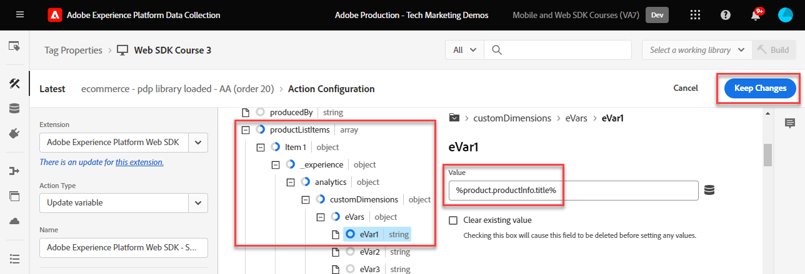
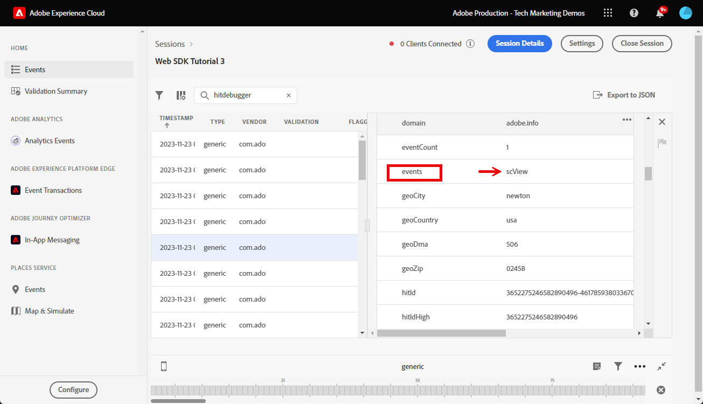

# Einrichten von Adobe Analytics mit dem Adobe Experience Platform Web SDK

Erfahren Sie, wie Sie Adobe Analytics mit dem [Adobe Experience Platform Web SDK](https://experienceleague.adobe.com/en/docs/platform-learn/data-collection/web-sdk/overview) einrichten, Tag-Regeln erstellen, um Daten an Adobe Analytics zu senden, und überprüfen Sie, ob Analytics Daten erwartungsgemäß erfasst.

[Adobe Analytics](https://experienceleague.adobe.com/de/docs/analytics) ist eine branchenführende Anwendung, mit der Sie Ihre Kunden besser verstehen und Ihr Geschäft mit Customer Intelligence steuern können.

## Lernziele

Am Ende dieser Lektion können Sie:

* Konfigurieren eines Datenspeichers zur Aktivierung von Adobe Analytics
* Ermitteln, welche Standard-XDM-Felder automatisch Analytics-Variablen zugeordnet werden
* Analytics-Variablen im Datenobjekt festlegen
* Senden von Daten an eine andere Report Suite durch Überschreiben des Datastreams
* Validieren von Adobe Analytics-Variablen mithilfe von Debugger und Assurance

## Voraussetzungen

Um diese Lektion abzuschließen, müssen Sie zunächst:

* Machen Sie sich mit Adobe Analytics vertraut und haben Sie Zugriff auf diese.

* Sie verfügen über mindestens eine Report Suite-ID für Tests/Entwicklung. Wenn Sie nicht über eine Report Suite für Tests/Entwicklung verfügen, die Sie für dieses Tutorial verwenden können, erstellen Sie [eine ](https://experienceleague.adobe.com/en/docs/analytics/admin/admin-tools/manage-report-suites/c-new-report-suite/t-create-a-report-suite).

* Schließen Sie die früheren Lektionen in den Abschnitten Erstkonfiguration und Tags-Konfiguration dieses Tutorials ab.

## Konfigurieren des Datenspeichers

Das Platform Web SDK sendet Daten von Ihrer Website an Platform Edge Network. Ihr Datastream teilt dann Platform Edge Network mit, an welche Adobe Analytics Report Suites Ihre Daten gesendet werden sollen.

1. Wechseln Sie zur Oberfläche [Datenerfassung](https://experience.adobe.com/#/data-collection){target="blank"} .
1. Wählen Sie im linken Navigationsbereich **[!UICONTROL Datastreams]** aus.
1. Wählen Sie den zuvor erstellten `Luma Web SDK: Development Environment`-Datastream aus.

   

1. Wählen Sie **[!UICONTROL Dienst hinzufügen]** aus
   
1. Wählen Sie **[!UICONTROL Adobe Analytics]** als **[!UICONTROL Dienst]** aus.
1. Geben Sie die **[!UICONTROL Report Suite-ID]** Ihrer Entwicklungs-Report Suite ein.
1. Wählen Sie **[!UICONTROL Speichern]** aus.

   

   >[!TIP]
   >
   >Das Hinzufügen weiterer Report Suites durch Auswahl von **[!UICONTROL Report Suite hinzufügen]** entspricht dem Multi-Suite-Tagging.

>[!WARNING]
>
>In diesem Tutorial konfigurieren Sie nur die Adobe Analytics Report Suite für Ihre Entwicklungsumgebung. Wenn Sie Datenspeicher für Ihre eigene Website erstellen, sollten Sie zusätzliche Datenspeicher und Report Suites für Ihre Staging- und Produktionsumgebungen erstellen.

## Analytics-Variablen festlegen

Es gibt mehrere Möglichkeiten, Analytics-Variablen in einer Web SDK-Implementierung festzulegen:

1. Automatische Zuordnung von XDM-Feldern zu Analytics-Variablen (automatisch).
1. Legen Sie Felder im Objekt `data` fest (empfohlen).
1. Ordnen Sie XDM-Felder Analytics-Variablen in Analytics-Verarbeitungsregeln zu (nicht mehr empfohlen).
1. Ordnen Sie Analytics-Variablen direkt im XDM-Schema zu (nicht mehr empfohlen).

Ab Mai 2024 müssen Sie kein XDM-Schema mehr erstellen, um Adobe Analytics mit dem Platform Web SDK zu implementieren. Mit dem Objekt `data` (und dem Datenelement `data.variable`, das Sie in der Lektion [Datenelemente erstellen](create-data-elements.md) erstellt haben) können Sie alle benutzerdefinierten Analytics-Variablen festlegen. Das Festlegen dieser Variablen im Datenobjekt ist für bestehende Analytics-Kunden bekannt, effizienter als die Verwendung der Benutzeroberfläche für Verarbeitungsregeln und verhindert, dass unnötige Daten in Echtzeit-Kundenprofilen Platz nehmen (wichtig bei Real-time Customer Data Platform oder Journey Optimizer).

### Automatisch zugeordnete Felder

Viele XDM-Felder werden automatisch Analytics-Variablen zugeordnet. Die aktuellste Liste der Zuordnungen finden Sie unter [Analytics-Variablenzuordnung unter Adobe Experience Edge](https://experienceleague.adobe.com/en/docs/experience-platform/edge/data-collection/adobe-analytics/automatically-mapped-vars).

Dies tritt auf, wenn _auch dann, wenn Sie kein benutzerdefiniertes Schema definiert haben_. Experience Platform Web SDK erfasst automatisch einige Daten und sendet sie als XDM-Felder an Platform Edge Network. Beispielsweise liest das Web SDK die aktuelle Seiten-URL und sendet sie als XDM-Feld `web.webPageDetails.URL`. Dieses Feld wird an Adobe Analytics weitergeleitet und füllt automatisch die Seiten-URL-Berichte in Adobe Analytics.

Wenn Sie das Web SDK für Adobe Analytics mit einem XDM-Schema implementieren, wie in diesem Tutorial beschrieben, weisen einige der XDM-Felder, die Sie benutzerdefiniert implementiert haben, automatisch Analytics-Variablen zu, wie in dieser Tabelle beschrieben:

| Automatisch zugeordnete Variablen von XDM zu Analytics | Adobe Analytics-Variable |
|-------|---------|
| `identitymap.ecid.[0].id` | mid |
| `web.webPageDetails.name` | s.pageName |
| `web.webPageDetails.server` | s.server |
| `web.webPageDetails.siteSection` | s.channel |
| `commerce.productViews.value` | prodView |
| `commerce.productListViews.value` | scView |
| `commerce.checkouts.value` | scCheckout |
| `commerce.purchases.value` | Kauf |
| `commerce.order.currencyCode` | s.currencyCode |
| `commerce.order.purchaseID` | s.purchaseID |
| `productListItems[].SKU` | s.products=;product name;;; (primary - siehe Hinweis unten) |
| `productListItems[].name` | s.products=;product name;;; (Fallback - siehe Hinweis unten) |
| `productListItems[].quantity` | s.products=;;Produktmenge;; |
| `productListItems[].priceTotal` | s.product=;;;Produktpreis; |

Die einzelnen Abschnitte der Analytics-Produktzeichenfolge werden durch verschiedene XDM-Variablen unter dem Objekt `productListItems` festgelegt.

>[!NOTE]
>
>Ab dem 18. August 2022 hat `productListItems[].SKU` Priorität für die Zuordnung zum Produktnamen in der Variablen s.products .
>Der auf `productListItems[].name` eingestellte Wert wird dem Produktnamen nur dann zugeordnet, wenn `productListItems[].SKU` nicht vorhanden ist. Andernfalls ist sie nicht zugeordnet und in Kontextdaten verfügbar.
>Setzen Sie keine leere Zeichenfolge oder null auf `productListItems[].SKU`. Dies hat den unerwünschten Effekt, dass die Zuordnung zum Produktnamen in der Variablen s.products vorgenommen wird.

### Festlegen von Variablen im Datenobjekt

Aber was ist mit eVars, Props und Ereignissen? Das Festlegen von Variablen im Objekt `data` ist die empfohlene Methode zum Festlegen dieser Analytics-Variablen mit dem Web SDK. Durch das Festlegen von Variablen im Datenobjekt können auch alle automatisch zugeordneten Variablen überschrieben werden.

Erstens, was ist das Objekt `data`? In jedem Web SDK-Ereignis können Sie zwei Objekte mit benutzerdefinierten Daten senden, das Objekt `xdm` und das Objekt `data`. Beide werden an Platform Edge Network gesendet, aber nur das `xdm` -Objekt wird an den Experience Platform-Datensatz gesendet. Eigenschaften im Objekt `data` können in der Edge mithilfe der Funktion &quot;Datenvorbereitung für Datenerfassung&quot;Feldern vom Typ `xdm` zugeordnet werden, werden aber ansonsten nicht an Experience Platform gesendet. Dadurch ist es ideal, Daten an Anwendungen wie Analytics zu senden, die nativ nicht auf Experience Platform basieren.

Im Folgenden finden Sie die beiden Objekte in einem allgemeinen Web SDK-Aufruf:

Adobe Analytics ist so konfiguriert, dass es nach Eigenschaften im Objekt `data.__adobe.analytics` sucht und diese für Analytics-Variablen verwendet.

Nun sehen wir, wie das funktioniert. Legen wir `eVar1` und `prop1` mit unserem Seitennamen fest und sehen Sie, wie XDM-mapped-Wert überschrieben werden kann

1. Öffnen Sie die Tag-Regel `all pages - library loaded - set global variables - 1`
1. Hinzufügen einer neuen **[!UICONTROL Aktion]**
1. Wählen Sie die Erweiterung **[!UICONTROL Adobe Experience Platform Web SDK]**
1. Wählen Sie **[!UICONTROL Aktionstyp]** als **[!UICONTROL Variable aktualisieren]** aus.
1. Wählen Sie `data.variable` als **[!UICONTROL Datenelement]** aus.
1. Auswählen des Objekts **[!UICONTROL analytics]**
1. Setzen Sie `eVar1` als `page.pageInfo.pageName`-Datenelement
1. Setzen Sie `prop1` , um den Wert von `eVar1` zu kopieren.
1. Um das Überschreiben von XDM-zugeordneten Werten zu testen, legen Sie im Abschnitt **[!UICONTROL Zusätzliche Eigenschaft]** den Seitennamen als statischen Wert `test` fest
1. Regel speichern

Jetzt müssen wir das Datenobjekt in unsere Versandereignisregel einbeziehen.

1. Öffnen Sie die Tag-Regel `all pages - library loaded - send event - 50`
1. Öffnen Sie die Aktion **[!UICONTROL Ereignis senden]** .
1. Wählen Sie `data.variable` als **[!UICONTROL Daten]** aus.
1. Wählen Sie **[!UICONTROL Änderungen beibehalten]** aus
1. Wählen Sie **[!UICONTROL Speichern]** aus.

<!--

### Map to Analytics variables with processing rules

All fields in the XDM schema become available to Adobe Analytics as Context Data Variables with the following prefix `a.x.`. For example, `a.x.web.webinteraction.region`

In this exercise, you map one XDM variable to a prop. Follow these same steps for any custom mapping that you must do for any `eVar`, `prop`, `event`, or variable accessible via Processing Rules.

1. Go to the Analytics interface
1. Go to [!UICONTROL Admin] > [!UICONTROL Admin Tools] > [!UICONTROL Report Suites ]
1. Select the dev/test report suite that you are using for the tutorial > [!UICONTROL Edit Settings] > [!UICONTROL General] > [!UICONTROL Processing Rules]

       

1. Create a rule to **[!UICONTROL Overwrite value of]** `[!UICONTROL Product SKU (prop1)]` to `a.x.productlistitems.0.sku`. Remember to add a note about why you are creating the rule and name your rule title. Select **[!UICONTROL Save]**

       

    >[!IMPORTANT]
    >
    >The first time you map to a processing rule, the UI does not show you the context data variables from the XDM object. To fix that select any value, Save, and come back to edit. All XDM variables should now appear.

### Map to Analytics variables using the Adobe Analytics field group

An alternative to processing rules is to map to Analytics variables in the XDM schema using the `Adobe Analytics ExperienceEvent Template` field group. This approach has gained popularity because many users find it simpler than configuring processing rules, however, by increasing the size of the XDM payload it could in turn increase the profile size in other applications like Real-Time CDP.

To add the `Adobe Analytics ExperienceEvent Template` field group to your schema:

1. Open the [Data Collection](https://experience.adobe.com/#/data-collection){target="blank"} interface
1. Select **[!UICONTROL Schemas]** from the left navigation
1. Make sure you are in the sandbox you are using from the tutorial
1. Open your `Luma Web Event Data` schema
1. In the **[!UICONTROL Field Groups]** section, select **[!UICONTROL Add]**
1. Find the `Adobe Analytics ExperienceEvent Template` field group and add it to your schema

Now, set a merchandising eVar in the product string. With the `Adobe Analytics ExperienceEvent Template` field group, you are able to map variables to merchandising eVars or events within the product string. This is also known as setting **Product Syntax Merchandising**. 

1. Go back to your tag property

1. Open the rule `ecommerce - library loaded - set product details variables - 20`

1. Open the **[!UICONTROL Set Variable]** action

1. Select to open `_experience > analytics > customDimensions > eVars > eVar1`

1. Set the **[!UICONTROL Value]** to `%product.productInfo.title%`

1. Select **[!UICONTROL Keep Changes]**

    

1. Select **[!UICONTROL Save]** to save the rule

As you just saw, basically all of the Analytics variables can be set in the `Adobe Analytics ExperienceEvent Template` field group.

>[!NOTE]
>
> Notice the `_experience` object under `productListItems` > `Item 1`. Setting any variable under this [!UICONTROL object] sets Product Syntax eVars or Events.

-->

## Daten an eine andere Report Suite senden

Möglicherweise möchten Sie ändern, an welche Adobe Analytics Report Suite-Daten gesendet werden, wenn sich Besucher auf bestimmten Seiten befinden. Dies erfordert eine Konfiguration sowohl im Datastream als auch in einer Regel.

### Konfigurieren des Datenspeichers für eine Report Suite-Überschreibung

So konfigurieren Sie die Einstellung zum Überschreiben der Adobe Analytics Report Suite im Datastream:

1. Datenspeicher öffnen
1. Bearbeiten Sie die **[!UICONTROL Adobe Analytics]**-Konfiguration, indem Sie das Menü  öffnen und dann **[!UICONTROL Bearbeiten]** auswählen.

   

1. Wählen Sie **[!UICONTROL Erweiterte Optionen]** aus, um **[!UICONTROL Report Suite-Überschreibung]** zu öffnen.

1. Wählen Sie die Report Suites aus, die Sie überschreiben möchten. In diesem Fall `Web SDK Course Dev` und `Web SDK Course Stg`

1. Wählen Sie **[!UICONTROL Speichern]** aus.

   

### Konfigurieren einer Regel für eine Report Suite-Überschreibung

Erstellen wir eine Regel, um einen zusätzlichen Seitenansichtsaufruf an eine andere Report Suite zu senden. Verwenden Sie die Funktion zum Überschreiben des Datastreams , um die Report Suite für eine Seite mithilfe der Aktion **[!UICONTROL Ereignis senden]** zu ändern.

1. Erstellen Sie eine neue Regel, nennen Sie sie &quot;`homepage - library loaded - AA report suite override - 51`&quot;

1. Wählen Sie das Pluszeichen unter **[!UICONTROL Ereignis]** aus, um einen neuen Trigger hinzuzufügen.

1. Wählen Sie unter **[!UICONTROL Erweiterung]** **[!UICONTROL Core]** aus.

1. Wählen Sie unter **[!UICONTROL Ereignistyp]** die Option **[!UICONTROL Bibliothek geladen (Seitenanfang)]** aus.

1. Wählen Sie diese Option aus, um **[!UICONTROL Erweiterte Optionen]** zu öffnen, und geben Sie in `51` ein. Dadurch wird sichergestellt, dass die Regel nach dem `all pages - library loaded - send event - 50` ausgeführt wird, der das Grundlinien-XDM mit dem Aktionstyp **[!UICONTROL Variable aktualisieren]** festlegt.
1. Wählen Sie **[!UICONTROL Änderungen beibehalten]** aus

   

1. Wählen Sie unter **[!UICONTROL Bedingungen]** die Option &quot;**[!UICONTROL Hinzufügen]**&quot;

1. Belassen Sie **[!UICONTROL Logiktyp]** als **[!UICONTROL Normal]**.

1. Belassen Sie **[!UICONTROL Erweiterungen]** als **[!UICONTROL Core]** .

1. Wählen Sie **[!UICONTROL Bedingungstyp]** als **[!UICONTROL Pfad ohne Abfragezeichenfolge]** aus.

1. Lassen Sie rechts den Umschalter **[!UICONTROL Regex]** deaktiviert

1. Legen Sie unter **[!UICONTROL path equals]** `/content/luma/us/en.html` fest. Auf der Demosite &quot;Luma&quot;wird sichergestellt, dass die Regel nur Trigger auf der Startseite enthält.

1. Wählen Sie **[!UICONTROL Änderungen beibehalten]** aus

   

1. Wählen Sie unter **[!UICONTROL Aktionen]** die Option **[!UICONTROL Hinzufügen]** aus.

1. Wählen Sie als **[!UICONTROL Erweiterung]** **[!UICONTROL Adobe Experience Platform Web SDK]** aus.

1. Wählen Sie als **[!UICONTROL Aktionstyp]** **[!UICONTROL Ereignis senden]** aus.

1. Wählen Sie als **[!UICONTROL XDM-Daten]** das `xdm.variable.content`-Datenelement aus, das Sie in der Lektion [Datenelemente erstellen](create-data-elements.md) erstellt haben

1. Wählen Sie als **[!UICONTROL Daten]** das `data.variable`-Datenelement aus, das Sie in der Lektion [Datenelemente erstellen](create-data-elements.md) erstellt haben

   

1. Scrollen Sie nach unten zum Abschnitt **[!UICONTROL Außerkraftsetzungen von Datastream-Konfigurationen]** .

1. Lassen Sie die Registerkarte **[!UICONTROL Entwicklung]** ausgewählt.

   >[!TIP]
   >
   >    Diese Registerkarte bestimmt, in welcher Tagumgebung das Außerkraftsetzen erfolgt. Für diese Übung geben Sie nur die Entwicklungsumgebung an. Denken Sie jedoch daran, dies auch in der Umgebung **[!UICONTROL Produktion]** zu tun, wenn Sie dies für die Produktion bereitstellen.

1. Wählen Sie die **[!UICONTROL Sandbox]** aus, die Sie für das Tutorial verwenden
1. Wählen Sie den **[!UICONTROL Datastream]** aus, in diesem Fall `Luma Web SDK: Development Environment`.

1. Wählen Sie unter **[!UICONTROL Report Suites]** die Report Suite aus, für die Sie die Site überschreiben möchten. In diesem Fall `tmd-websdk-course-stg`.

1. Wählen Sie **[!UICONTROL Änderungen beibehalten]** aus

1. Und **[!UICONTROL Speichern]** Ihre Regel

   

## Erstellen der Entwicklungsumgebung

Fügen Sie Ihre aktualisierten Regeln zu Ihrer `Luma Web SDK Tutorial` -Tag-Bibliothek hinzu und erstellen Sie Ihre Entwicklungsumgebung neu.

Herzlichen Glückwunsch! Der nächste Schritt besteht darin, Ihre Adobe Analytics-Implementierung über das Experience Platform Web SDK zu validieren.

## Adobe Analytics mit Debugger überprüfen

Erfahren Sie, wie Sie mit der Edge Trace-Funktion des Experience Platform Debuggers überprüfen, ob Adobe Analytics die ECID, Seitenansichten, die Produktzeichenfolge und E-Commerce-Ereignisse erfasst.

In der Lektion [Debugger](validate-with-debugger.md) haben Sie erfahren, wie Sie die clientseitige XDM-Anforderung mit dem Platform Debugger und der Browser-Entwicklerkonsole überprüfen, ähnlich wie beim Debugging einer `AppMeasurement.js` Analytics-Implementierung. Sie haben auch erfahren, wie Sie serverseitige Anfragen für Platform Edge Network, die an Adobe-Anwendungen gesendet werden, validieren und wie Sie eine vollständig verarbeitete Payload mithilfe von Assurance anzeigen.

Um zu überprüfen, ob Analytics Daten ordnungsgemäß über das Experience Platform Web SDK erfasst, müssen Sie zwei Schritte weiter gehen:

1. Validieren Sie mithilfe der Edge Trace-Funktion von Experience Platform Debugger, wie Daten vom XDM-Objekt im Platform-Edge Network verarbeitet werden.
1. Überprüfen der vollständigen Verarbeitung von Daten durch Analytics mithilfe von Adobe Experience Platform Assurance

### Experience Cloud ID-Überprüfung

1. Rufen Sie die [Demosite &quot;Luma&quot;](https://luma.enablementadobe.com/content/luma/us/en.html){target="_blank"} auf
1. Wählen Sie die Anmelde-Schaltfläche oben rechts aus und verwenden Sie die Anmeldeinformationen u: test@adobe.com p: test to authentication
1. Öffnen Sie den Experience Platform Debugger und wechseln Sie [die Tag-Eigenschaft auf der Site in Ihre eigene Entwicklungseigenschaft](validate-with-debugger.md#use-the-experience-platform-debugger-to-map-to-your-tags-property)

1. Um den Edge-Trace zu aktivieren, navigieren Sie zum Experience Platform-Debugger, wählen Sie im linken Navigationsbereich **[!UICONTROL Protokolle]**, wählen Sie dann die Registerkarte **[!UICONTROL Edge]** aus und klicken Sie auf **[!UICONTROL Verbinden]**

   

1. Es ist vorerst leer

   

1. Aktualisieren Sie die Seite &quot;Luma&quot;und aktivieren Sie Experience Platform Debugger erneut. Sie sollten sehen, dass Daten vorliegen. Die mit **[!UICONTROL Automatisches Analytics-Mapping]** beginnende Zeile ist das Adobe Analytics-Beacon
1. Wählen Sie diese Option aus, um sowohl das Dropdown-Menü `[!UICONTROL mappedQueryParams]` als auch das zweite Dropdown-Menü zum Anzeigen von Analytics-Variablen zu öffnen

   

   >[!TIP]
   >
   >Das zweite Dropdown-Menü entspricht der Analytics Report Suite-ID, an die Sie Daten senden. Sie sollte mit Ihrer eigenen Report Suite übereinstimmen, nicht mit der im Screenshot.

1. Scrollen Sie nach unten, um `[!UICONTROL c.a.x.identitymap.ecid.[0].id]` zu finden. Es handelt sich dabei um eine Kontextdatenvariable, die ECID erfasst
1. Scrollen Sie weiter nach unten, bis die Analytics-Variable `[!UICONTROL mid]` angezeigt wird. Beide IDs stimmen mit der Experience Cloud-ID Ihres Geräts überein.
1. Auf der Site &quot;Luma&quot;:

   

   >[!NOTE]
   >
   >Da Sie angemeldet sind, sollten Sie sich einen Moment Zeit nehmen, um die authentifizierte ID `112ca06ed53d3db37e4cea49cc45b71e` für den Benutzer **`test@adobe.com`** zu validieren, der ebenfalls in der `[!UICONTROL c.a.x.identitymap.lumacrmid.[0].id]` erfasst wird.

### Überprüfung der Report Suite-Überschreibung

Oben haben Sie eine Datastream-Überschreibung für die [Luma-Homepage](https://luma.enablementadobe.com/content/luma/us/en.html) konfiguriert.  Überprüfen dieser Konfiguration

1. Suchen Sie nach einer Zeile mit **[!UICONTROL Datastream-Konfiguration, nachdem die Überschreibung angewendet wurde]**. Hier finden Sie die primäre Report Suite und die zusätzlichen Report Suites, die für die Report Suite-Überschreibung konfiguriert wurden.

   

1. Scrollen Sie nach unten zu der Zeile, die mit **[!UICONTROL Automatisches Zuordnen von Analytics]** beginnt, und überprüfen Sie, ob die `[!UICONTROL reportSuiteIds]` die Report Suite anzeigt, die Sie in Ihren Überschreibungskonfigurationen angegeben haben.

   

### Überprüfung der Inhaltsseitenansichten

Gehen Sie zu einer Produktseite wie der Produktseite [Didi Sport Watch](https://luma.enablementadobe.com/content/luma/us/en/products/gear/watches/didi-sport-watch.html#24-WG02).  Überprüfen Sie, ob die Seitenansichten des Inhalts von Analytics erfasst werden.

1. Suchen Sie nach `[!UICONTROL c.a.x.web.webpagedetails.pageviews.value]=1`.
1. Scrollen Sie nach unten, um die Variable `[!UICONTROL gn]` anzuzeigen. Dies ist die dynamische Analytics-Syntax für die Variable &quot;`[!UICONTROL s.pageName]`&quot;. Sie erfasst den Seitennamen aus der Datenschicht.

   

### Validierung von Produktzeichenfolgen und E-Commerce-Ereignissen

Da Sie sich bereits auf einer Produktseite befinden, verwendet diese Übung weiterhin denselben Edge-Trace, um Produktdaten zu überprüfen, die von Analytics erfasst werden. Sowohl die Produktzeichenfolge als auch die E-Commerce-Ereignisse werden Analytics automatisch XDM-Variablen zugeordnet. Solange Sie während der Konfiguration eines XDM-Schemas für Adobe Analytics der entsprechenden XDM-Variablen `productListItem` zugeordnet haben, übernimmt das Platform-Edge Network die Zuordnung der Daten zu den entsprechenden Analytics-Variablen.

**Überprüfen Sie zunächst, ob der `Product String` festgelegt ist**

1. Suchen Sie nach `[!UICONTROL c.a.x.productlistitems.][0].[!UICONTROL sku]`. Die -Variable erfasst den Datenelementwert, den Sie zuvor in dieser Lektion dem `productListItems.item1.sku` zugeordnet haben
1. Suchen Sie auch nach `[!UICONTROL c.a.x.productlistitems.][0].[!UICONTROL _experience.analytics.customdimensions.evars.evar1]`. Die Variable erfasst den Datenelementwert, den Sie `productListItems.item1._experience.analytics.customdimensions.evars.evar1` zugeordnet haben
1. Scrollen Sie nach unten, um die Variable `[!UICONTROL pl]` anzuzeigen. Dies ist die dynamische Syntax der Analytics-Variablen mit der Produktzeichenfolge .
1. Beachten Sie, dass der Produktname aus der Datenschicht sowohl dem Parameter `[!UICONTROL c.a.x.productlistitems.][0].[!UICONTROL sku]` als auch dem Parameter `[!UICONTROL product]` der Produktzeichenfolge zugeordnet ist.  Darüber hinaus wird der Produktname aus der Datenschicht der Merchandising-evar1 in der Produktzeichenfolge zugeordnet.

   

   Die Edge Trace behandelt `commerce` -Ereignisse etwas anders als `productList` -Dimensionen. Es wird keine Kontextdatenvariable angezeigt, die auf die gleiche Weise zugeordnet ist wie der Produktname, der oben `[!UICONTROL c.a.x.productlistitem.[0].name]` zugeordnet ist. Stattdessen zeigt der Edge Trace die endgültige automatische Zuordnung des Ereignisses in der Analytics-Variablen `event` an. Platform Edge Network ordnet sie entsprechend zu, solange Sie der entsprechenden XDM `commerce`-Variablen zuordnen, während [das Schema für Adobe Analytics konfigurieren](setup-analytics.md#configure-an-xdm-schema-for-adobe-analytics); in diesem Fall die `commerce.productViews.value=1`.

1. Scrollen Sie im Fenster Experience Platform Debugger nach unten zur Variable `[!UICONTROL events]`, sie ist auf `[!UICONTROL prodView]` festgelegt.

1. Beachten Sie außerdem, dass `[!UICONTROL c.a.x.eventType]` auf `commerce.productViews` gesetzt ist, da Sie sich auf einer Produktseite befinden.

   >[!TIP]
   >
   > Die `ecommerce - pdp library loaded - AA (order 20)` -Regel überschreibt den durch die `all pages global content variables - library loaded - AA (order 1)` -Regel festgelegten Wert von `eventType`, da dieser auf Trigger später in der Sequenz eingestellt ist

   

**Überprüfen, ob der Rest der E-Commerce-Ereignisse und Produktzeichenfolgen für Analytics festgelegt ist**

1. Hinzufügen von [Didi Sport Watch](https://luma.enablementadobe.com/content/luma/us/en/products/gear/watches/didi-sport-watch.html#24-WG02) zum Warenkorb
1. Wechseln Sie zur Seite [Warenkorb](https://luma.enablementadobe.com/content/luma/us/en/user/cart.html) und suchen Sie nach Edge Trace für

   * `eventType` auf `commerce.productListViews` gesetzt
   * `[!UICONTROL events: "scView"]` und
   * die Produktzeichenfolge festgelegt ist

   

1. Fahren Sie mit dem Checkout fort und suchen Sie nach Edge Trace für

   * `eventType` auf `commerce.checkouts` gesetzt
   * `[!UICONTROL events: "scCheckout"]` und
   * die Produktzeichenfolge festgelegt ist

   

1. Füllen Sie nur die Felder **Vorname** und **Nachname** im Versandformular aus und wählen Sie **Weiter** aus. Wählen Sie auf der nächsten Seite **Auftrag platzieren** aus.
1. Überprüfen Sie auf der Bestätigungsseite Edge Trace auf

   * `eventType` auf `commerce.purchases` gesetzt
   * Kaufereignis auf `[!UICONTROL events: "purchase"]` gesetzt
   * Währungscode-Variable wird auf `[!UICONTROL cc: "USD"]` gesetzt
   * Kauf-ID wird in `[!UICONTROL pi]` festgelegt
   * Produktzeichenfolge `[!UICONTROL pl]` zum Festlegen von Produktname, Menge und Preis

   

## Validieren von Adobe Analytics mithilfe von Assurance

Mit Adobe Experience Platform Assurance können Sie die Datenerfassung und die Bereitstellung von Erlebnissen auf Ihrer Website und in Ihrer mobilen Anwendung überprüfen, testen, simulieren und validieren.

In der vorherigen Übung haben Sie überprüft, ob Adobe Analytics die ECID, Seitenansichten, die Produktzeichenfolge und E-Commerce-Ereignisse mit der Edge Trace-Funktion des Experience Platform Debuggers erfasst.  Als Nächstes validieren Sie dieselben Ereignisse mit Adobe Experience Platform Assurance, einer alternativen Schnittstelle für den Zugriff auf dieselben Daten in Edge Trace.

Wie Sie in der Lektion [Assurance](validate-with-assurance.md) gelernt haben, gibt es mehrere Möglichkeiten, eine Zuverlässigkeitssitzung zu initiieren. Da Sie bereits eine Adobe Experience Platform Debugger-Sitzung geöffnet haben, bei der eine Edge Trace-Sitzung von der letzten Übung aus initiiert wurde, empfehlen wir, über den Debugger auf &quot;Assurance&quot;zuzugreifen:

Geben Sie im Tutorial 3&quot;]**&quot;Web SDK Tutorial 3&quot;**[!UICONTROL  Assurance Session **[!UICONTROL &quot;hitdebugger&quot;]** in die Ereignissuchleiste ein, um die Ergebnisse nach den von Adobe Analytics Post verarbeiteten Daten zu filtern.

### Experience Cloud ID-Überprüfung

Um zu überprüfen, ob Adobe Analytics die ECID erfasst, wählen Sie ein Beacon aus und öffnen Sie die Payload.  Der Anbieter für dieses Beacon sollte **[!UICONTROL com.adobe.analytics.hitdebugger]** sein.

Scrollen Sie dann nach unten zu **[!UICONTROL mcvisId]**, um zu überprüfen, ob die ECID korrekt erfasst wurde.

### Überprüfung der Inhaltsseitenansichten

Überprüfen Sie mit demselben Beacon, ob die Seitenansichten des Inhalts der richtigen Adobe Analytics-Variablen zugeordnet sind.
Scrollen Sie nach unten zu **[!UICONTROL pageName]**, um zu überprüfen, ob die `Page Name` korrekt erfasst wurde.

### Validierung von Produktzeichenfolgen und E-Commerce-Ereignissen

Nach denselben Validierungsanwendungsfällen, die bei der Validierung mit dem obigen Experience Platform Debugger verwendet werden, verwenden Sie dasselbe Beacon zur Validierung von `Ecommerce Events` und `Product String`.

1. Suchen Sie nach Payload, wobei die **[!UICONTROL Ereignisse]** `prodView` enthalten.
   
1. Scrollen Sie nach unten zu **[!UICONTROL product-string]** , um die `Product String` zu validieren.
   * Beachten Sie die `Product SKU` und `Merchandizing eVar1`.
1. Scrollen Sie weiter nach unten und überprüfen Sie, ob `prop1`, das Sie mithilfe der Verarbeitungsregeln im vorherigen Abschnitt konfiguriert haben, den `Product SKU` enthält.\
   

Überprüfen Sie weiterhin Ihre Implementierung, indem Sie sich die Warenkorb-, Checkout- und Kaufereignisse ansehen.

1. Suchen Sie nach Payload, wobei die **[!UICONTROL Ereignisse]** `scView` enthalten, und überprüfen Sie die Produktzeichenfolge.
   
1. Suchen Sie nach Payload, wobei die **[!UICONTROL Ereignisse]** `scCheckout` enthalten, und überprüfen Sie die Produktzeichenfolge.
   
1. Suchen Sie nach Payload, wobei die **[!UICONTROL Ereignisse]** `purchase` enthalten.
   
1. Beachten Sie bei der Validierung des `purchase` -Ereignisses, dass die `Product String` die `Product SKU`, `Product Quantity` und `Product Total Price` enthalten sollten.
1. Überprüfen Sie außerdem für die `purchase` , ob die `purchase-id` und/oder `purchaseId` festgelegt sind.

Herzlichen Glückwunsch! Du hast es getan! Dies ist das Ende der Lektion und jetzt können Sie Adobe Analytics mit dem Platform Web SDK für Ihre eigene Website implementieren.

[Weiter: ](setup-audience-manager.md)

>[!NOTE]
>
>Vielen Dank, dass Sie Ihre Zeit investiert haben, um mehr über das Adobe Experience Platform Web SDK zu erfahren. Wenn Sie Fragen haben, ein allgemeines Feedback teilen oder Anregungen zu künftigen Inhalten haben möchten, teilen Sie diese bitte in diesem [Experience League Community-Diskussionsbeitrag](https://experienceleaguecommunities.adobe.com/t5/adobe-experience-platform-data/tutorial-discussion-implement-adobe-experience-cloud-with-web/td-p/444996) mit.
