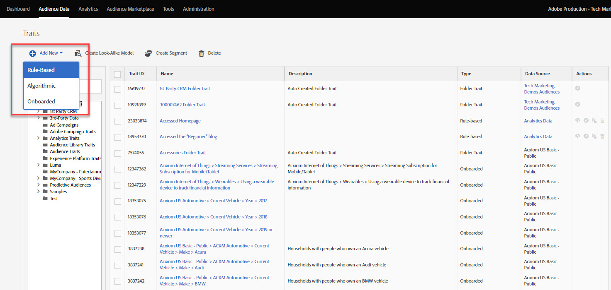
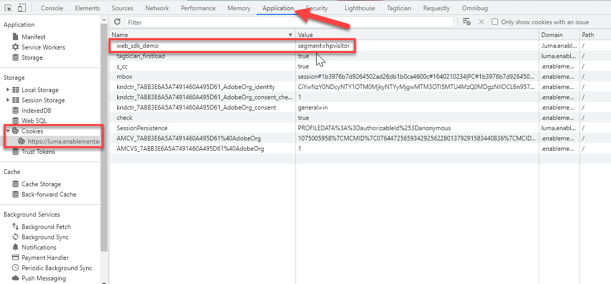

# Einrichten von Audience Manager mit dem Platform Web SDK

>[!CAUTION]
>
>Wir gehen davon aus, dass am Dienstag, dem 23. April 2024, wichtige Änderungen an diesem Tutorial veröffentlicht werden. Danach ändern sich viele Übungen und Sie müssen das Tutorial möglicherweise von Anfang an neu starten, um alle Lektionen abzuschließen.

Erfahren Sie, wie Sie Adobe Audience Manager mit dem Platform Web SDK einrichten und die Implementierung mit einem Cookie-Ziel validieren.

[Adobe Audience Manager](https://experienceleague.adobe.com/docs/audience-manager.html?lang=de) ist die Adobe Experience Cloud-Lösung, die alles bietet, was erforderlich ist, um geschäftlich relevante Informationen über Site-Besucher zu sammeln, vermarktbare Segmente zu erstellen und zielgruppengerechte Werbung und Inhalte für die richtige Zielgruppe bereitzustellen.

## Lernziele

Am Ende dieser Lektion können Sie:

* Konfigurieren eines Datenspeichers zum Aktivieren von Audience Manager
* Aktivieren eines Cookie-Ziels in Audience Manager
* Validieren der Audience Manager-Implementierung durch Bestätigung der Zielgruppenqualifizierung mit Adobe Experience Platform Debugger

## Voraussetzungen

Um diese Lektion abzuschließen, müssen Sie zunächst:

* Schließen Sie die früheren Lektionen in den Abschnitten Erstkonfiguration und Tags-Konfiguration dieses Tutorials ab.
* Sie haben Zugriff auf Adobe Audience Manager und die entsprechenden Berechtigungen zum Erstellen, Lesen und Schreiben von Eigenschaften, Segmenten und Zielen. Weitere Informationen finden Sie unter [Rollenbasierte Zugriffssteuerung des Audience Managers](https://experienceleague.adobe.com/docs/audience-manager-learn/tutorials/setup-and-admin/user-management/setting-permissions-with-role-based-access-control.html?lang=en).

## Konfigurieren des Datenspeichers

Die Implementierung des Audience Managers mit dem Platform Web SDK unterscheidet sich von der Implementierung mit [Serverseitige Weiterleitung (SSF)](https://experienceleague.adobe.com/docs/analytics/admin/admin-tools/server-side-forwarding/ssf.html?lang=de). Die serverseitige Weiterleitung übergibt Adobe Analytics-Anfragedaten an Audience Manager. Eine Platform Web SDK-Implementierung übergibt XDM-Daten, die an Platform Edge Network gesendet werden, an Audience Manager. Audience Manager ist im Datastream aktiviert:

1. Navigieren Sie zu [Datenerfassung](https://experience.adobe.com/#/data-collection){target="blank"} Benutzeroberfläche
1. Wählen Sie im linken Navigationsbereich die Option **[!UICONTROL Datenspeicher]**
1. Wählen Sie die zuvor erstellte `Luma Web SDK` datastream

   

1. Wählen Sie **[!UICONTROL Service hinzufügen]** aus
   
1. Auswählen **[!UICONTROL Adobe Audience Manager]** als **[!UICONTROL Dienst]**
1. Bestätigen Sie, dass **[!UICONTROL Cookie-Ziele aktiviert]** und **[!UICONTROL URL-Ziele aktiviert]** ausgewählt sind
1. Wählen Sie **[!UICONTROL Speichern]** aus
   

## Erstellen einer Datenquelle

Erstellen Sie als Nächstes eine [Datenquelle](https://experienceleague.adobe.com/docs/audience-manager/user-guide/features/data-sources/datasources-list-and-settings.html?lang=en), ein grundlegendes Tool zur Organisation von Daten in Audience Manager:

1. Navigieren Sie zu [Audience Manager](https://experience.adobe.com/#/audience-manager/) Benutzeroberfläche
1. Auswählen **[!UICONTROL Zielgruppendaten]** von der oberen Navigation
1. Wählen Sie die **[!UICONTROL Data Sources]** aus dem Dropdownmenü
1. Wählen Sie die **[!UICONTROL Neu hinzufügen]** -Schaltfläche oben auf der Data Sources-Seite

   

1. Geben Sie der Datenquelle einen Anzeigenamen und eine Beschreibung. Bei der Ersteinrichtung können Sie dies nennen`Platform Web SDK tutorial`.
1. Satz **[!UICONTROL ID-Typ]** nach **[!UICONTROL Cookie]**
1. Im **[!UICONTROL Datenexportkontrollen]** Bereich, wählen Sie **[!UICONTROL Keine Einschränkung]**

   

1. **[!UICONTROL Speichern]** die Datenquelle

## Erstellen einer Eigenschaft

Nachdem die Datenquelle gespeichert wurde, richten Sie eine [Eigenschaft](https://experienceleague.adobe.com/docs/audience-manager/user-guide/features/traits/traits-overview.html?lang=de). Eigenschaften sind eine Kombination aus einem oder mehreren Signalen in Audience Manager. Erstellen Sie eine Eigenschaft für Besucher der Homepage.

>[!NOTE]
>
>Alle XDM-Daten werden an Audience Manager gesendet, wenn sie im Datastream aktiviert sind. Die Daten können jedoch 24 Stunden dauern, bis sie im Bericht Nicht verwendete Signale verfügbar sind. Erstellen Sie explizite Eigenschaften für die XDM-Daten, die Sie sofort in Audience Manager verwenden möchten, wie in dieser Übung beschrieben.

1. Auswählen **[!UICONTROL Zielgruppendaten]** >  **[!UICONTROL Eigenschaften]**
1. Auswählen **[!UICONTROL Neu hinzufügen]** >  **[!UICONTROL Regelbasiert]** Eigenschaft

   

1. Geben Sie Ihrer Eigenschaft einen Anzeigenamen und eine Beschreibung, `Luma homepage view`
1. Wählen Sie die **[!UICONTROL Datenquelle]** die Sie im vorherigen Abschnitt erstellt haben.
1. **[!UICONTROL Ordner auswählen]** , in der Sie Ihre Eigenschaft im Bereich auf der rechten Seite speichern möchten. Sie können einen Ordner erstellen, indem Sie **Auswählen des Zeichens +** neben einem vorhandenen übergeordneten Ordner. Sie können diesen neuen Ordner benennen `Platform Web SDK tutorial`.
1. Erweitern Sie die **[!UICONTROL Eigenschaftsausdruck]** Caret und Auswahl **[!UICONTROL Expression Builder]** Sie müssen ein Schlüssel-Wert-Paar bereitstellen, das einen Homepage-Besuch angibt.
1. Öffnen Sie die [Startseite von Luma](https://luma.enablementadobe.com/content/luma/us/en.html) (Ihrer Tag-Eigenschaft zugeordnet) und der **Platform Web SDK Debugger** und aktualisieren Sie die Seite.
1. Sehen Sie sich die Netzwerkanforderungen und Ereignisdetails für das Platform Web SDK an, um den Schlüssel- und Namenswert für die Homepage zu finden.
   
1. Kehren Sie in der Audience Manager-Benutzeroberfläche zum Ausdrucksgenerator zurück und geben Sie den Schlüssel als **`web.webPageDetails.name`** und der Wert von **`content:luma:us:en`**. Dieser Schritt stellt sicher, dass Sie beim Laden der Startseite eine Eigenschaft auslösen.
1. **[!UICONTROL Speichern]** die Eigenschaft.

## Erstellen eines Segments

Der nächste Schritt besteht darin, eine **Segment** und weisen Sie diesem Segment Ihre neu definierte Eigenschaft zu.

1. Auswählen **[!UICONTROL Zielgruppendaten]** in der oberen Navigation und wählen Sie **[!UICONTROL Segmente]**
1. Auswählen **[!UICONTROL Neu hinzufügen]** oben links auf der Seite, um den Segment Builder zu öffnen
1. Geben Sie Ihrem Segment einen Anzeigenamen und eine Beschreibung, z. B. `Platform Web SDK - Homepage visitors`
1. **[!UICONTROL Ordner auswählen]** wo Ihr Segment im Bereich auf der rechten Seite gespeichert wird. Sie können einen Ordner erstellen, indem Sie **Auswählen des Zeichens +** neben einem vorhandenen übergeordneten Ordner. Sie können diesen neuen Ordner benennen `Platform Web SDK tutorial`.
1. Fügen Sie einen Integrationscode hinzu, bei dem es sich in diesem Fall um einen zufälligen Satz von Zahlen handelt. 1. Im **[!UICONTROL Datenquelle]** Bereich, wählen Sie **[!UICONTROL Audience Manager]** und der zuvor erstellten Datenquelle
1. Erweitern Sie die **[!UICONTROL Eigenschaften]** und suchen Sie nach der von Ihnen erstellten Eigenschaft
1. Auswählen **[!UICONTROL Eigenschaft hinzufügen]**.
1. Auswählen **[!UICONTROL Speichern]** unten auf der Seite

   

   

## Ziel erstellen

Erstellen Sie als Nächstes eine **Cookie-basiertes Ziel** mithilfe der **Zielgenerator**. Mit dem Destination Builder können Sie Cookie-, URL- und Server-zu-Server-Ziele erstellen und verwalten.

1. Öffnen Sie den Destination Builder durch Auswahl von **[!UICONTROL Ziele]** innerhalb der **Zielgruppendaten** Menü in der oberen Navigation
1. Auswählen **[!UICONTROL Ziel erstellen]**
1. Namen und Beschreibung eingeben `Platform Web SDK tutorial`
1. Als **[!UICONTROL Kategorie]** auswählen **[!UICONTROL Benutzerdefiniert]**
1. Als **[!UICONTROL Typ]** auswählen **[!UICONTROL Cookie]**

   

1. Öffnen Sie die **[!UICONTROL Konfiguration]** -Abschnitt, um Details zu Ihrem Cookie-Ziel einzugeben
1. Geben Sie Ihrem Cookie einen Anzeigenamen, `platform_web_sdk_tutorial`
1. Als **[!UICONTROL Cookie-Domäne]**, fügen Sie die Domäne der Site hinzu, auf der Sie die Integration planen. Geben Sie für das Tutorial die Domäne &quot;Luma&quot;ein. `luma.enablementadobe.com`
1. Als **[!UICONTROL Veröffentlichen von Daten in]** auswählen **[!UICONTROL Nur die ausgewählten Domänen]**
1. Domain auswählen, falls noch nicht hinzugefügt
1. Als **[!UICONTROL Datenformat]** auswählen **[!UICONTROL Einzelschlüssel]** und geben Sie Ihrem Cookie einen Schlüssel. Verwenden Sie für dieses Tutorial `segment` als Schlüsselwert.
1. Wählen Sie abschließend **[!UICONTROL Speichern]** , um die Details der Zielkonfiguration zu speichern.

   

<!--
   

   
-->

1. Im **[!UICONTROL Segmentzuordnungen]** -Abschnitt verwenden Sie die **[!UICONTROL Segmente suchen und hinzufügen]** Funktion zum Suchen nach Ihrer zuvor erstellten `Platform Web SDK - Homepage visitors` und wählen **[!UICONTROL Hinzufügen]**.

1. Nachdem Sie Ihr Segment hinzugefügt haben, wird ein Popup geöffnet, in dem Sie einen erwarteten Wert für Ihr Cookie angeben müssen. Geben Sie für diese Übung den Wert &quot;hpvisitor&quot;ein.

1. Wählen Sie **[!UICONTROL Speichern]** aus

1. Auswählen **[!UICONTROL Fertig]**
   

Für den Zeitraum der Segmentzuordnung müssen einige Stunden aktiviert werden. Nach Abschluss des Vorgangs können Sie die Benutzeroberfläche des Audience Managers aktualisieren und sehen, dass die **Zugeordnete Segmente** Liste aktualisiert.

## Validieren des Segments

Einige Stunden nach der ersten Erstellung des Segments können Sie überprüfen, ob es ordnungsgemäß funktioniert.

Bestätigen Sie zunächst, dass Sie sich für das Segment qualifizieren können.

1. Öffnen Sie die [Startseite der Demosite &quot;Luma&quot;](https://luma.enablementadobe.com/content/luma/us/en.html) mit dieser Ihrer Tag-Eigenschaft zugeordnet, um sich für Ihr neu erstelltes Segment zu qualifizieren.
1. Öffnen Sie die **Entwicklertools**  > **Netzwerk** tab
1. Filtern nach der Platform Web SDK-Anforderung mithilfe von `interact` als Textfilter
1. Wählen Sie einen Aufruf aus und öffnen Sie die **Vorschau** Registerkarte zum Anzeigen der Antwortdetails
1. Erweitern Sie die **Nutzlast** um die erwarteten Cookie-Details anzuzeigen, wie zuvor in Audience Manager konfiguriert. In diesem Beispiel wird der erwartete Cookie-Name angezeigt `platform_web_sdk_tutorial`.

   

1. Öffnen Sie die **Anwendung** und öffnen Sie **Cookies** aus dem **Speicherung** Menü.
1. Wählen Sie die **`https://luma.enablementadobe.com`** und überprüfen Sie, ob Ihr Cookie in der Liste richtig geschrieben ist.

   

Schließlich sollten Sie das Segment in der Audience Manager-Oberfläche öffnen und sicherstellen, dass die Variable **Segmentpopulationen** inkrementiert:

Nachdem Sie diese Lektion abgeschlossen haben, sollten Sie sehen können, wie das Platform Web SDK Daten an Audience Manager übergibt, und ein segmentspezifisches Erstanbieter-Cookie mit einem Cookie-Ziel setzen können.

[Weiter: ](setup-target.md)

>[!NOTE]
>
>Vielen Dank, dass Sie Ihre Zeit investiert haben, um mehr über das Adobe Experience Platform Web SDK zu erfahren. Wenn Sie Fragen haben, ein allgemeines Feedback oder Vorschläge zu künftigen Inhalten teilen möchten, teilen Sie diese hier mit. [Experience League Community-Diskussionsbeitrag](https://experienceleaguecommunities.adobe.com/t5/adobe-experience-platform-launch/tutorial-discussion-implement-adobe-experience-cloud-with-web/td-p/444996)
