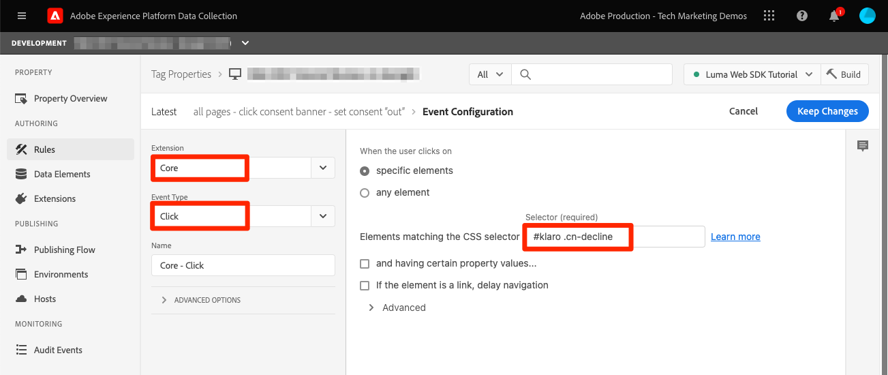

# Einrichten der Zustimmung mit dem Platform Web SDK


>[!CAUTION]
>
>Wir gehen davon aus, dass am Dienstag, dem 23. April 2024, wichtige Änderungen an diesem Tutorial veröffentlicht werden. Danach ändern sich viele Übungen und Sie müssen das Tutorial möglicherweise von Anfang an neu starten, um alle Lektionen abzuschließen.

Erfahren Sie, wie Sie die Datenschutzeinstellungen der Experience Platform Web SDK-Tag-Erweiterung konfigurieren. Legen Sie die Zustimmung basierend auf der Interaktion des Besuchers mit einem Banner von einer Consent Management Platform (CMP) fest.

>[!NOTE]
> 
>Zu Demonstrationszwecken verwendet dieses Tutorial [Klaro](https://heyklaro.com/){target="_blank"} als CMP. Sie können gerne mit Klaro oder dem CMP weitermachen, den Sie mit Ihrer Website verwenden.


## Lernziele

Am Ende dieser Lektion können Sie:

* Laden einer CMP mithilfe von Tags
* Datenschutzeinstellungen in der Experience Platform Web SDK-Tag-Erweiterung konfigurieren
* Festlegen der Zustimmung für das Experience Platform Web SDK basierend auf der Aktion des Besuchers

## Voraussetzungen

Sie sollten mit Tags und den Schritten zum Erstellen von Regeln, Datenelementen, Erstellen von Bibliotheken in Umgebungen und Wechseln von Tag-Bibliotheken mithilfe des Experience Platform Debugger vertraut sein.

Bevor Sie mit der Konfiguration der Datenschutzeinstellungen und der Erstellung der Regeln zum Festlegen der Einwilligung beginnen, stellen Sie sicher, dass Sie Ihr Plattformskript für die Einwilligungsverwaltung auf die Website eingefügt haben und ordnungsgemäß funktionieren. Eine CMP kann entweder direkt mithilfe von Site-Entwicklern in den Quellcode geladen oder über Tags selbst geladen werden. Diese Lektion zeigt den letzteren Ansatz.
>[!NOTE]
> 
>1. Eine Consent Management Platform (oder CMP) wird von Organisationen verwendet, um die Einwilligungsoptionen eines Besuchers gesetzlich zu dokumentieren und zu verwalten, bevor Besucherdaten aus Online-Quellen wie Websites und Apps erfasst, weitergegeben oder verkauft werden.
>
>2. Der empfohlene Ansatz für die Injektion einer CMP erfolgt direkt über den Quellcode vor dem Tag-Manager-Skript.

### Klaro konfigurieren

Bevor Sie in die Tag-Konfigurationen springen, erfahren Sie mehr über die in diesem Tutorial Klaro verwendete Zustimmungsverwaltungsplattform.

1. Besuch [Klaro](https://heyklaro.com/) und ein Konto einrichten.
1. Navigieren Sie zu **Privacy Manager** und erstellen Sie eine Instanz gemäß den Anweisungen.
1. Verwenden Sie die **Integrationscode** um Klaro in Ihre Tag-Eigenschaft zu injizieren (Anweisungen finden Sie in der nächsten Übung).
1. Überspringen **Scannen** -Abschnitt, da dadurch die Tag-Eigenschaft erkannt wird, die auf der Demowebsite von Luma fest codiert ist und nicht die Eigenschaft, die Sie für dieses Tutorial erstellt haben.
1. Hinzufügen eines Dienstes namens `aep web sdk` und aktivieren Sie die **Dienststandardstatus**. Wenn diese Option aktiviert ist, lautet der Standardwert für die Zustimmung `true`, andernfalls `false`. Diese Konfiguration ist nützlich, wenn Sie entscheiden möchten, welcher standardmäßige Zustimmungsstatus (vor der Zustimmung des Besuchers) für Ihre Webanwendung gelten soll. Beispiel:
   * Bei CCPA wird die Standardzustimmung normalerweise auf `true`. Sie werden dieses Szenario als **Implizites Opt-in** in diesem Tutorial
   * Für die DSGVO wird die standardmäßige Zustimmung normalerweise auf `false`. Sie werden dieses Szenario als **Implizites Opt-out** in diesem Tutorial.

<!--
    This consent value can be verified by returning the JavaScript object ```klaro.getManager().consents``` in the browser's developer console.
-->
    >[!NOTE]
    >
    >Im Allgemeinen werden die oben genannten Schritte vom Team oder von der Person durchgeführt und durchgeführt, die für die Verarbeitung des CMP verantwortlich ist, z. B. OneTrust oder TrustArc.

## CMP injizieren

>[!WARNING]
>
>Die Best Practice zur Implementierung einer Consent Management Platform besteht normalerweise darin, den CMP zu laden _before_ Laden Sie Ihren Tag-Manager. Um dieses Tutorial zu erleichtern, laden Sie den CMP _mit_ den Tag-Manager. In dieser Lektion erfahren Sie, wie Sie die Zustimmungsfunktionen im Platform Web SDK verwenden. Sie sollte nicht als Anleitung zur korrekten Konfiguration von Klaro oder anderen CMP verwendet werden.


Nachdem Sie mit den Konfigurationen von Klaro fertig sind, erstellen Sie eine Tag-Regel mit den folgenden Konfigurationen:

* [!UICONTROL Name]: `all pages - library load - Klaro`
* [!UICONTROL Ereignis]: [!UICONTROL Bibliothek geladen (Seitenanfang)] mit [!UICONTROL Erweiterte Optionen] > [!UICONTROL Bestellung] auf 1 gesetzt
* [!UICONTROL Aktion]: [!UICONTROL Benutzerspezifischer Code], [!UICONTROL Sprache]: HTML zum Laden des CMP-Skripts.


Der benutzerdefinierte Codeblock sollte in etwa wie folgt aussehen:


Speichern und erstellen Sie diese Regel jetzt in Ihrer Entwicklungsbibliothek. Überprüfen Sie, ob das Einwilligungsbanner angezeigt wird, indem Sie die Tag-Bibliothek von der Site &quot;Luma&quot;zu Ihrer eigenen wechseln. Auf der Website sollte ein CMP-Banner wie unten dargestellt angezeigt werden. Um die Zustimmung des aktuellen Besuchers zu überprüfen, können Sie folgendes Snippet in der Browser-Konsole verwenden.

```javascript
    klaro.getManager().consents 
```


Um in den Debug-Modus zu wechseln, aktivieren Sie im Adobe Experience Platform-Debugger das folgende Kontrollkästchen.


Außerdem müssen Sie möglicherweise während dieses Tutorials Ihre Cookies und Ihren lokalen Speicher mehrmals löschen, da der Wert für die Zustimmung des Besuchers dort gespeichert wird. Sie können dies einfach wie folgt tun:


## Einverständnisszenarios

Datenschutzgesetze wie die DSGVO, der CCPA und andere spielen eine entscheidende Rolle bei der Architektur der Implementierung der Einwilligung. In dieser Lektion erfahren Sie, wie ein Besucher mit dem Einwilligungsbanner unter zwei wichtigen Datenschutzaktionen interagieren kann.


### Szenario 1: Implizites Opt-in

Das implizite Opt-in bedeutet, dass das Unternehmen vor der Erfassung seiner Daten keine Zustimmung des Besuchers (oder die &quot;Opt-in&quot;-Option) einholen muss und daher alle Besucher der Website standardmäßig als angemeldet behandelt werden. Der Besucher kann sich jedoch abmelden, indem er die Cookies über das Einwilligungsbanner ablehnt. Dieser Anwendungsfall ähnelt dem CCPA.

Jetzt konfigurieren und implementieren Sie die Zustimmung für dieses Szenario:

1. Im **[!UICONTROL Datenschutz]** Stellen Sie sicher, dass die Experience Platform Web SDK-Tag-Erweiterung  **[!UICONTROL Standardzustimmung]** auf **[!UICONTROL In]** :


   

   >[!NOTE]
   > 
   >Wählen Sie für eine dynamische Lösung die Option &quot;Datenelement bereitstellen&quot;aus und übergeben Sie ein Datenelement, das den Wert von ```klaro.getManager().consents```
   >
   >Diese Option wird verwendet, wenn der CMP in den Quellcode eingefügt wird. *before* den Tag-Einbettungscode, damit die standardmäßige Zustimmung verfügbar ist, bevor die Experience Platform Web SDK-Erweiterung geladen wird. In unserem Beispiel können wir diese Option nicht verwenden, da die CMP mit Tags und nicht vor Tags geladen wird.


2. Speichern und erstellen Sie diese Änderung in Ihrer Tag-Bibliothek.
3. Laden der Tag-Bibliothek auf der Demosite &quot;Luma&quot;
4. Aktivieren Sie das Debugging von Tags auf der Site &quot;Luma&quot;und laden Sie die Seite neu. In der Entwicklerkonsole Ihres Browsers sollte der Wert defaultConsent gleich **[!UICONTROL In]**
5. Mit dieser Konfiguration sendet die Experience Platform Web SDK-Erweiterung weiterhin Netzwerkanforderungen, es sei denn, ein Besucher entscheidet, die Cookies abzulehnen und abzumelden:

   


Wenn ein Besucher sich entscheidet, sich abzumelden (Tracking-Cookies abzulehnen), müssen Sie die Zustimmung ändern in **[!UICONTROL Out]**. Ändern Sie die Zustimmungseinstellung, indem Sie die folgenden Schritte ausführen:

<!--
1. Create a data element to store the consent value of the visitor. Let's call it `klaro consent value`. Use the code snippet to create a custom code type data element:
    
    ```javascript
    return klaro.getManager().consents["aep web sdk"]
    ```

    


1. Create another custom code data element, `consent confirmed`, with the following snippet which returns ```true``` only after a visitor confirms consent:

    
    ```javascript
    return klaro.getManager().confirmed
    ```

    
-->

1. Erstellen Sie eine Regel, die Trigger beim Klicken auf **I fall**.  Benennen Sie diese Regel wie folgt: `all pages - click consent banner - set consent "out"`

1. Als **[!UICONTROL Ereignis]**, verwenden **[!UICONTROL Klicks]** on **[!UICONTROL Elemente, die mit der CSS-Auswahl übereinstimmen]** `#klaro .cn-decline`

   

1. Verwenden Sie jetzt das Experience Platform Web SDK, [!UICONTROL Einverständnis festlegen] [!UICONTROL Aktionstyp] um die Zustimmung als &quot;out&quot;festzulegen:

   

1. Auswählen **[!UICONTROL In Bibliothek speichern und erstellen]**:

   

Wenn sich ein Besucher abmeldet, löst die oben konfigurierte Regel aus und legt die Web SDK-Zustimmung als **[!UICONTROL Out]**.

Validieren Sie, indem Sie zur Site &quot;Luma Demo&quot;gehen, Cookies ablehnen und bestätigen Sie, dass keine Web SDK-Anforderung ausgelöst wird, nachdem Sie sich abgemeldet haben.

### Szenario 2: Implizites Opt-out


Implizites Opt-out bedeutet, dass Besucher standardmäßig als Opt-out behandelt werden und keine Cookies gesetzt werden sollten. Web SDK-Anfragen sollten nur ausgelöst werden, wenn sich Besucher manuell anmelden und die Cookies über das Zustimmungsbanner akzeptieren. Möglicherweise müssen Sie sich in der Region der Europäischen Union, in der die DSGVO gilt, mit einem solchen Anwendungsfall befassen.

So können Sie die Konfiguration für ein implizites Opt-out-Szenario einrichten:

1. In Klaro, schalten Sie den **Dienststandardstatus** in `aep web sdk` und speichern Sie die aktualisierte Konfiguration.

1. In **[!UICONTROL Datenschutz]** Abschnitt der Experience Platform Web SDK-Erweiterung, setzen Sie die Standardzustimmung auf **[!UICONTROL Out]** oder **[!UICONTROL Ausstehend]** nach Bedarf.

   

1. **Speichern** die aktualisierte Konfiguration in Ihre Tag-Bibliothek ein und erstellen sie neu.

   Mit dieser Konfiguration stellt das Experience Platform Web SDK sicher, dass keine Anfrage ausgelöst wird, es sei denn, die Zustimmungsberechtigung ändert sich in **[!UICONTROL In]**. Dies kann daran liegen, dass ein Besucher die Cookies manuell akzeptiert, indem er sich anmeldet.

1. Stellen Sie im Debugger sicher, dass die Site &quot;Luma&quot;Ihrer Tag-Eigenschaft zugeordnet ist und dass die Protokollierung der Tags in der Konsole aktiviert ist.
1. Verwenden Sie die Entwicklerkonsole Ihres Browsers, um **Site-Daten löschen** in **Anwendung** > **Speicherung**

1. Laden Sie die Site &quot;Luma&quot;neu und Sie sollten sehen, dass `defaultConsent` auf **[!UICONTROL Out]** und es wurden keine Web SDK-Anfragen gestellt

   

Wenn sich ein Besucher für eine Teilnahme entscheidet (Annahme der Tracking-Cookies), müssen Sie die Zustimmung ändern und festlegen auf **[!UICONTROL In]**. So können Sie dies mit einer Regel durchführen:

1. Erstellen Sie eine Regel, die Trigger beim Klicken auf **Das ist in Ordnung**.  Benennen Sie diese Regel wie folgt: `all pages - click consent banner - set consent "in"`

1. Als **[!UICONTROL Ereignis]**, verwenden **[!UICONTROL Klicks]** on **[!UICONTROL Elemente, die mit der CSS-Auswahl übereinstimmen]** `#klaro .cm-btn-success`

   

1. Hinzufügen einer Aktion mit dem Experience Platform Web SDK [!UICONTROL Erweiterung], **[!UICONTROL Aktionstyp]** von **[!UICONTROL Einverständnis festlegen]**, **[!UICONTROL Allgemeine Zustimmung]** as **[!UICONTROL In]**.

   

   Beachten Sie hier Folgendes: [!UICONTROL Einverständnis festlegen] -Aktion wird die erste Anfrage sein, die gesendet wird und Identität feststellt. Daher kann es wichtig sein, Identitäten für die erste Anfrage selbst zu synchronisieren. Die Identitätszuordnung kann zu [!UICONTROL Einverständnis festlegen] Aktion durch Übergabe eines Datenelements vom Typ Identität.

1. Auswählen **[!UICONTROL In Bibliothek speichern und erstellen]**:

   

1. **[!UICONTROL Speichern]** die Regel in Ihre Bibliothek aufnehmen und neu erstellen.

Sobald Sie diese Regel eingerichtet haben, sollte die Erfassung von Ereignissen beginnen, wenn sich ein Besucher anmeldet.


Weitere Informationen zur Zustimmung im Web SDK finden Sie unter [Unterstützen von Zustimmungsvoreinstellungen von Kunden](https://experienceleague.adobe.com/docs/experience-platform/edge/consent/supporting-consent.html?lang=en).


Weitere Informationen über [!UICONTROL Einverständnis festlegen] Aktion, siehe [Einverständnis festlegen](https://experienceleague.adobe.com/docs/experience-platform/edge/extension/action-types.html?lang=en#set-consent).

[Weiter: ](setup-event-forwarding.md)

>[!NOTE]
>
>Vielen Dank, dass Sie Ihre Zeit investiert haben, um mehr über das Adobe Experience Platform Web SDK zu erfahren. Wenn Sie Fragen haben, ein allgemeines Feedback oder Vorschläge zu künftigen Inhalten teilen möchten, teilen Sie diese hier mit. [Experience League Community-Diskussionsbeitrag](https://experienceleaguecommunities.adobe.com/t5/adobe-experience-platform-launch/tutorial-discussion-implement-adobe-experience-cloud-with-web/td-p/444996)
