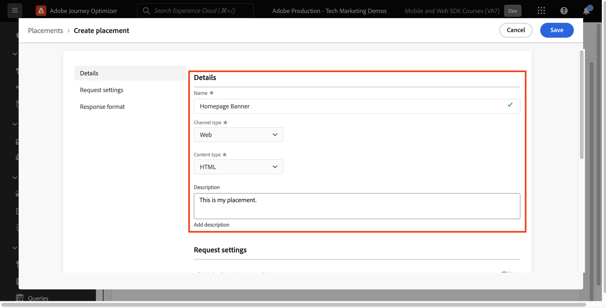
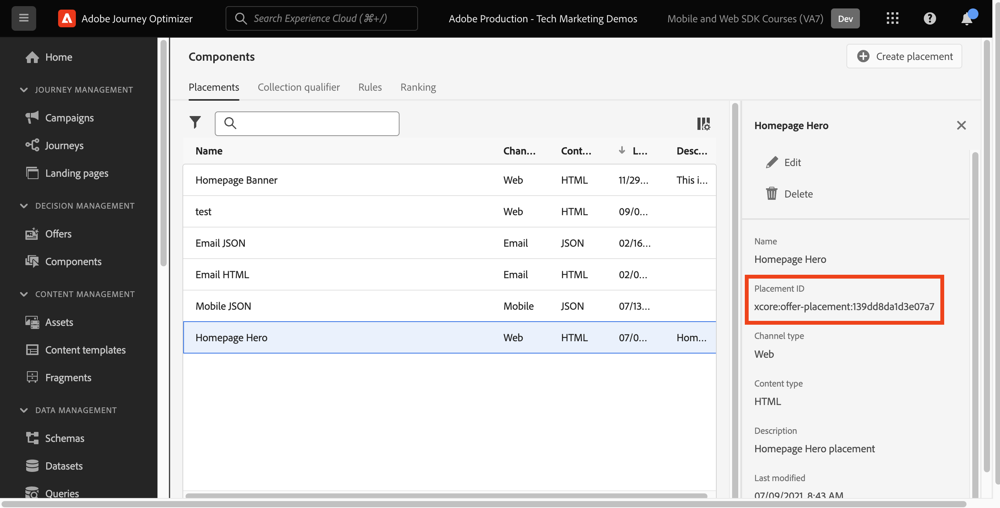

# Entscheidungsverwaltung mit dem Platform Web SDK einrichten

Erfahren Sie, wie Sie die Entscheidungsverwaltung mit dem Platform Web SDK implementieren. In diesem Handbuch werden die grundlegenden Entscheidungsverwaltungsvoraussetzungen, detaillierte Konfigurationsschritte und ein tiefer Einblick in einen Anwendungsfall zum Treuestatus gegeben.

In diesem Tutorial können Journey Optimizer-Benutzer offer decisioning-Funktionen effektiv anwenden, um die Personalisierung und Relevanz ihrer Kundeninteraktionen zu verbessern.


## Lernziele

Am Ende dieser Lektion können Sie:

* Machen Sie sich mit den Kernkonzepten der Entscheidungsverwaltung in der Adobe Journey Optimizer und ihrer Integration in das Adobe Experience Platform Web SDK vertraut.

* Erfahren Sie Schritt für Schritt, wie Sie das Web SDK für Offer decisioning konfigurieren und so eine nahtlose Integration mit Journey Optimizer sicherstellen.

* Erfahren Sie mehr über einen detaillierten Anwendungsfall, der sich auf Treuestatus-Angebote konzentriert und Einblicke in die effektive Erstellung und Verwaltung von Angeboten, Entscheidungen und Platzierungen bietet.

* Machen Sie sich mit wesentlichen Begriffen und deren Auswirkungen im Rahmen der Entscheidungsverwaltung vertraut.

* Machen Sie sich mit der Bedeutung von Entscheidungsregeln, Sammlungsqualifizierern und Fallback-Angeboten für die Bereitstellung des richtigen Angebots für den richtigen Benutzer vertraut.

* Erfahren Sie mehr über erweiterte Themen wie Simulationen und die Datenerfassung für benutzerdefinierte Ereignisse, mit denen Sie Ihre Mechanismen zur Angebotsbereitstellung testen, validieren und erweitern können.

## Voraussetzungen

Um die Lektionen in diesem Abschnitt abzuschließen, müssen Sie zunächst:

* Stellen Sie sicher, dass Ihr Unternehmen Zugriff auf Adobe Journey Optimizer Ultimate (Journey Optimizer und Offer decisioning) oder Adobe Experience Platform und das Offer decisioning Application Service-Add-on hat.

* Schließen Sie alle Lektionen für die Erstkonfiguration des Platform Web SDK ab.

* Aktivieren Sie Ihr Unternehmen für Edge Decisioning.

* Erfahren Sie, wie Sie eine Platzierung konfigurieren und Platzierungs- und Aktivitäts-IDs in Ihrer JSON-Entscheidungsbereich-JSON instanziieren.

## Einschränkungen

Beachten Sie die folgende Einschränkung:

* Ereignisbasierte Angebote werden in Adobe Journey Optimizer derzeit nicht unterstützt. Wenn Sie eine auf einem Ereignis basierende Entscheidungsregel erstellen, können Sie sie nicht auf ein Angebot anwenden.

## Zugriff auf das Entscheidungs-Management gewähren

Um Zugriff auf die Entscheidungsverwaltungsfunktionen zu gewähren, müssen Sie eine **Produktprofil** und weisen Sie Ihren Benutzern die entsprechenden Berechtigungen zu. [Weitere Informationen zum Verwalten von Journey Optimizer-Benutzern und -Berechtigungen finden Sie in diesem Abschnitt .](https://experienceleague.adobe.com/en/docs/journey-optimizer/using/access-control/privacy/high-low-permissions#decisions-permissions).

## Konfigurieren des Datenspeichers

Offer decisioning muss im **datastream** -Konfiguration, bevor Entscheidungsverwaltungsaktivitäten vom Platform Web SDK bereitgestellt werden können.

So konfigurieren Sie Offer decisioning im Datastream:

1. Navigieren Sie zu [Datenerfassung](https://experience.adobe.com/#/data-collection) -Schnittstelle.

1. Wählen Sie im linken Navigationsbereich die Option **Datenspeicher**.

1. Wählen Sie den zuvor erstellten Datenspeicher des Luma Web SDK aus.

   

1. Auswählen **Bearbeiten** innerhalb der **Adobe Experience Platform-Dienst**.

   

1. Überprüfen Sie die **Offer decisioning** ankreuzen.

   

1. Wählen Sie **Speichern** aus.

Dadurch wird sichergestellt, dass eingehende Ereignisse für Journey Optimizer von der **Adobe Experience Platform Edge**.

## SDK für die Entscheidungsverwaltung konfigurieren

Die Entscheidungsverwaltung erfordert je nach Ihrem Web SDK-Implementierungstyp zusätzliche SDK-Schritte. Es gibt zwei verfügbare Optionen zum Konfigurieren des SDK für die Entscheidungsverwaltung.

* Eigenständige SDK-Installation
   1. Konfigurieren Sie die `sendEvent` Aktion mit `decisionScopes`.

      ```javascript
      alloy("sendEvent", {
         ...
         "decisionScopes": [
            "[DECISION SCOPE 1]",
            "[DECISION SCOPE 2]"
         ]
      })
      ```

* Installation von SDK-Tags
   1. Wechseln Sie zur Datenerfassungsoberfläche.

   1. Wählen Sie im linken Navigationsbereich die Option **Tags**.

      

   1. Wählen Sie die **Tag-Eigenschaft**.

   1. Erstellen Sie Ihre **Regeln**.
      * Hinzufügen eines Platform Web SDK **Ereignisaktion senden** und fügen Sie die entsprechenden `decisionScopes` zur Konfiguration dieser Aktion hinzugefügt.

   1. Erstellen und veröffentlichen Sie eine **Bibliothek** alle relevanten **Regeln**, **Datenelemente**, und **Erweiterungen** Sie haben konfiguriert.

## Terminologie

Zunächst sollten Sie die in der Benutzeroberfläche für die Entscheidungsverwaltung verwendete Terminologie verstehen.

* **Begrenzung**: Eine Begrenzung, die angibt, wie oft ein Angebot angezeigt wird. Zwei Typen:
   * Höchstwerte für die Gesamtanzahl: Maximale Anzahl der Wiedergaben eines Angebots in der gesamten Zielgruppe.
   * Profilbegrenzung: Die Zeiten, in denen ein Angebot einem bestimmten Benutzer angezeigt werden kann.
* **Sammlungen**: Untergruppen von Angeboten, die nach bestimmten, von einem Marketing-Experten festgelegten Bedingungen gruppiert sind, z. B. Angebotskategorien.
* **Entscheidung**: Logik, die die Auswahl eines Angebots vorschreibt.
* **Entscheidungsregel**: Einschränkungen bei Angeboten, um die Eignung eines Benutzers zu ermitteln.
* **Geeignetes Angebot**: Ein Angebot, das den vordefinierten Begrenzungen entspricht und einem Benutzer angezeigt werden kann.
* **Entscheidungsverwaltung**: Das System zum Erstellen und Verteilen personalisierter Angebote mithilfe von Geschäftslogik und Entscheidungsregeln.
* **Fallback-Angebote**: Das Standardangebot, das angezeigt wird, wenn ein Benutzer sich für keine Angebote in einer Sammlung qualifiziert.
* **Angebot**: Eine Marketing-Nachricht mit potenziellen Eignungsregeln, die die Viewer bestimmen.
* **Angebotsbibliothek**: Ein zentrales Repository, das Angebote, Entscheidungen und zugehörige Regeln verwaltet.
* **Personalisierte Angebote**: Benutzerdefinierte Marketing-Nachrichten, die auf Eignungsbegrenzungen basieren.
* **Praktika**: Die Einstellung oder das Szenario, in der einem Benutzer ein Angebot angezeigt wird.
* **Priorität**: Rangmetrik für Angebote unter Berücksichtigung verschiedener Einschränkungen wie Eignung und Begrenzung.
* **Darstellungen**: Kanalspezifische Informationen, z. B. Ort oder Sprache, die die Anzeige eines Angebots lenken.

## Nutzungsszenario - Überblick über Treuebelohnungen

In dieser Lektion implementieren Sie ein Anwendungsbeispiel für Treuebelohnungen , um die Entscheidungsverwaltung mithilfe des Web SDK zu verstehen.

In diesem Anwendungsbeispiel wird erläutert, wie Journey Optimizer mithilfe der zentralisierten Angebotsbibliothek und des Entscheidungs-Moduls für Angebote das beste Angebot für Ihre Kunden bereitstellen kann.

>[!NOTE]
>
> Da dieses Tutorial auf Implementierer ausgerichtet ist, ist zu beachten, dass diese Lektion umfangreiche Arbeit an der Benutzeroberfläche in Journey Optimizer erfordert. Während solche Aufgaben in der Regel von Marketingexperten verarbeitet werden, können Implementoren Einblicke in den Prozess erhalten, selbst wenn sie langfristig nicht für die Erstellung von Entscheidungskampagnen verantwortlich sind.

## Komponenten

Bevor Sie mit der Erstellung der Angebote beginnen, müssen Sie mehrere Voraussetzungen definieren.

### Erstellen einer Platzierung für Treueangebote

**Praktika** sind Container, die zur Präsentation der Angebote verwendet werden. In diesem Beispiel erstellen Sie eine Platzierung am Anfang der Site &quot;Luma&quot;.

Die Liste der Platzierungen ist im Menü **Komponenten** verfügbar. Es gibt Filter, mit denen Sie Platzierungen nach einem bestimmten Kanal oder Inhalt abrufen können.


Gehen Sie wie folgt vor, um die Platzierung zu erstellen:

1. Klicken Sie auf **Platzierung erstellen**.

   

1. Definieren Sie die Eigenschaften der Platzierung:
   * **Name**: der Name der Platzierung. Rufen wir die Beispielplatzierung auf *&quot;Homepage-Banner&quot;*.
   * **Kanaltyp**: Der Kanal, für den die Platzierung verwendet wird. Verwenden wir *&#39;Web&#39;* da die Angebote auf der Luma-Website angezeigt werden.
   * **Inhaltstyp**: Der Inhaltstyp, den die Platzierung anzeigen darf: Text, HTML, Bild-Link oder JSON. Sie können *&quot;HTML&quot;* für das Angebot.
   * **Beschreibung**: eine Beschreibung der Platzierung (optional).

   

1. Klicken Sie auf **Speichern**.
1. Nachdem die Platzierung erstellt wurde, wird sie in der Platzierungsliste angezeigt.
1. Wählen Sie die Zeile aus, die Ihre neue Platzierung enthält, und notieren Sie sich die Platzierungs-ID, da dies für die Konfiguration in Ihrem Entscheidungsbereich erforderlich sein kann.

   

### Entscheidungsregeln für den Treuestatus

**Entscheidungsregeln** legen die Bedingungen fest, unter denen die Angebote unterbreitet werden. In diesem Beispiel erstellen Sie Entscheidungsregeln, die abhängig vom Treuestatus eines Benutzers für verschiedene Angebote gelten.

Die Liste der Entscheidungsregeln ist im **Komponenten** Menü.

Gehen Sie wie folgt vor, um die Entscheidungsregeln zu erstellen:

1. Navigieren Sie zum **Regeln** und klicken Sie auf **Regel erstellen**.

   

1. Nennen wir die erste Regel &quot;*Gold-Treuestatus-Regel*&quot;. Sie können XDM-Felder verwenden, um die Regel zu definieren. Die Adobe Experience Platform **Segment Builder** ist eine intuitive Benutzeroberfläche, mit der Sie Regelbedingungen erstellen können.

   

1. Klicks **Speichern** , um die Regelbedingung zu bestätigen.
1. Das neu gespeicherte *Gold-Treuestatus-Regel*&quot; wird im **Regelliste**. Wählen Sie es aus, um seine Eigenschaften anzuzeigen.

   

1. Erstellen Sie nun die verbleibenden Bedingungen für die Treueangebotsregel für den Anwendungsfall.


### Sammlungskennungen

**Sammlungsbezeichner** können Sie Angebote in der Angebotsbibliothek einfach organisieren und suchen. In diesem Beispiel fügen Sie den Angeboten &quot;Treuebelohnungen&quot;Sammlungsbezeichner hinzu, um die Organisation des Angebots zu verbessern.

Die Liste der Sammlungsbezeichner ist im Abschnitt **Komponenten** Menü.

Gehen Sie wie folgt vor, um den Sammlungsbezeichner &quot;Treuebelohnungen&quot;zu erstellen:

1. Navigieren Sie zum **Sammlungsbezeichner** und klicken Sie auf **Kollektionsqualifikation erstellen**.

   

1. Benennen wir den Sammlungsbezeichner &quot;*Treuebelohnungen*&#39;

   

1. Der neue Sammlungsbezeichner sollte jetzt im **Sammlungsbezeichner** tab

## Angebote

Jetzt ist es an der Zeit, die Angebote für Treuebelohnungen zu erstellen.

Die Liste der Angebote ist im Abschnitt **Angebote** Menü.


### Erstellen von Angeboten für verschiedene Treueebenen

Erstellen Sie zunächst personalisierte Angebote für die verschiedenen Treueebenen in Luma.

So erstellen Sie die erste **Angebot** führen Sie die folgenden Schritte aus:

1. Klicken Sie auf **Angebot erstellen** und wählen Sie dann **Personalisiertes Angebot** aus.

1. Nennen wir das erste Angebot &quot;*Treueebene für Luma - Gold*&quot;. Sie müssen ein Start-/Enddatum und eine Uhrzeit für dieses Angebot angeben. Sie sollten auch die **Sammlungsbezeichner** &#39;*Treuebelohnungen*&#39; auf das Angebot, sodass Sie die Organisation innerhalb der **Angebotsbibliothek**. Klicken Sie anschließend auf **Nächste**.

   

1. Jetzt müssen Sie **Darstellungen** , um festzulegen, wo das Angebot angezeigt wird. Wählen wir die **Webkanal**. Wählen wir auch &quot;*Startseiten-Banner*&#39; **placement** zuvor konfiguriert haben. Die ausgewählte **placement** ist HTML-type, sodass Sie HTML-, JSON- oder TEXTinhalte direkt zum Editor hinzufügen können, um das Angebot mithilfe der **Benutzerdefiniert** Optionsfeld.

   

1. Bearbeiten Sie den Angebotsinhalt direkt mit dem **Ausdruckseditor**. Denken Sie daran, dass Sie dieser Platzierung HTML-, JSON- oder TEXTinhalte hinzufügen können. Stellen Sie sicher, dass Sie die richtige **mode** am unteren Rand des Editors, je nach Inhaltstyp. Sie können auch **validate** , um sicherzustellen, dass keine Fehler auftreten.

   

1. Sie können auch den Ausdruckseditor verwenden, um in Adobe Experience Platform gespeicherte Attribute abzurufen. Fügen wir den Vornamen eines Profils zum Angebotsinhalt hinzu, um die Mitglieder des Treueprogramms auf 1:1-Ebene besser zu personalisieren.

   

1. Fügen Sie Begrenzungen hinzu, um das Angebot nur Profilen anzuzeigen, die für die *Gold-Treuestatus-Regel*&quot;.

   

1. Klicken Sie nach Abschluss der Angebotsüberprüfung auf **Beenden**. Wählen Sie **Speichern und genehmigen** aus.

Erstellen Sie nun den Rest der Angebote für die verschiedenen Loyalitätsstufen von Luma

### Fallback-Angebote

Sie möchten weiterhin ein Angebot für Besucher ohne Luma-Treueprogramm auf der Site &quot;Luma&quot;bereitstellen. Dazu können Sie eine **Fallback-Angebot** für die Kampagne.

Gehen Sie wie folgt vor, um das Fallback-Angebot zu erstellen:

1. Klicken Sie auf **Angebot erstellen** und wählen Sie dann **Fallback-Angebot** aus.
   <!--
      
   -->
1. Benennen wir das Fallback-Angebot &quot;*Treue außerhalb von Luma*&quot;. Sie können auch die zuvor erstellte **Sammlungsbezeichner**, &#39;*Treuebelohnungen*&#39; in das Fallback-Angebot ein, um die Organisation des Angebots zu vereinfachen.
   <!--
      
   -->
1. Hinzufügen des Fallback-Angebotsinhalts zum **Ausdruckseditor**. Denken Sie daran, dass Sie dieser Platzierung HTML-, JSON- oder TEXTinhalte hinzufügen können. Stellen Sie sicher, dass Sie die richtige **mode** am unteren Rand des Editors, je nach Inhaltstyp. Sie können auch **validate** , um sicherzustellen, dass keine Fehler auftreten.
   <!--
      
   -->
1. Wenn alles korrekt konfiguriert ist, drücken Sie **Beenden** und dann **Speichern und genehmigen**.
<!--
   
-->

## Entscheidungen

**Entscheidungen** sind Container für Angebote, die je nach Zielgruppe das beste für einen Kunden verfügbare Angebot auswählen.

Die Liste der Entscheidungen ist im **Entscheidungen** des **Angebote** Menü.
<!--
   
-->

### Erstellen einer Entscheidung für Treueangebote

Erstellen wir eine Entscheidung für den Anwendungsfall &quot;Loyalitätsbelohnungen für Luma&quot;.

Gehen Sie wie folgt vor, um die Entscheidung zu erstellen:

1. Klicks **Entscheidung erstellen**.
   <!--
      
   -->
1. Nennen wir die Entscheidung: &quot;*Treueangebote für Dezember Luma*&quot;. Die Angebote sollten einen Monat lang ausgeführt werden. Legen wir also fest, dass dies hier der Fall ist.
   <!--
      
   -->
1. Definieren Sie nun die **Entscheidungsbereiche**. Wählen Sie zuerst eine Platzierung aus. Sie können die zuvor erstellte *Startseiten-Banner*&quot;.
   <!--
      
   -->
1. Als Nächstes müssen Sie **Bewertungskriterien** für den Entscheidungsbereich. Klicks **Hinzufügen** und wählen Sie die zuvor erstellte *Treuebelohnungen*&#39; **collection** enthält alle zu berücksichtigenden Treueangebote.
   <!--
      
   -->
1. Innerhalb von *Treuebelohnungen*&#39; Sammlung, können Sie das Feld &quot;Eignung&quot;verwenden, um den Versand des Angebots auf eine Untergruppe von Luma-Besuchern zu beschränken. Für diesen Anwendungsfall möchten Sie jedoch, dass jeder Besucher eines der Angebote erhält. Denken Sie daran, dass Sie eine **Fallback-Angebot** für alle Besucher ohne Treueprogramm. Setzen Sie die Berechtigung auf &quot;Keine&quot;.
   <!--
      
   -->
1. Außerdem können Sie die **Rangmethode** -Feld, um das beste Angebot für jeden Luma-Besucher auszuwählen, wenn mehrere Angebote für die Benutzer-/Platzierungskombination infrage kommen. Für diesen Anwendungsfall können Sie die Variable **Angebotspriorität** -Methode, die die in den Angeboten definierten Werte verwendet, um das beste Angebot bereitzustellen.
   <!--
      
   -->
1. Fügen Sie nun die **Fallback-Angebot** der Entscheidung. Beachten Sie, dass das Fallback-Angebot das Standardangebot ist, das Luma-Besuchern angezeigt wird, wenn sie keiner der Zielgruppen vom Typ &quot;Treue zu Luma&quot;angehören. Auswählen &quot;*Treue außerhalb von Luma*&#39; aus der Liste der verfügbaren Fallback-Angebote für &#39;*Startseiten-Banner* Platzierung.
   <!--
      
   -->
1. Bevor wir die Entscheidung aktivieren, überprüfen wir den Umfang der Entscheidung, das Fallback-Angebot, zeigen eine Vorschau der verfügbaren Angebote an und schätzen die qualifizierten Profile. Sobald alles gut aussieht, können Sie auf **Beenden** und **Speichern und aktivieren**.
<!--
   
-->

## Simulationen

Als Best Practice sollten Sie die Entscheidungslogik für das Treueprogramm von Luma validieren, um sicherzustellen, dass die richtigen Angebote für die richtigen Loyalitätszielgruppen bereitgestellt werden. Verwenden Sie dazu **Testprofile**. Außerdem ist es empfehlenswert, Änderungen an Angeboten über Testprofile zu testen, bevor neue Angebotsversionen in die Produktion gepusht werden.

Um den Test zu starten, wählen Sie die **Simulationen** Registerkarte aus **Angebote** Menü.

### Testen von Treueangeboten

1. Wählen Sie ein Testprofil aus, das für die Simulation verwendet werden soll. Klicks **Profil verwalten**. [Um ein neues Testprofil für Angebotstests zu erstellen oder zu bestimmen, befolgen Sie dieses Handbuch](https://experienceleague.adobe.com/en/docs/journeys/using/building-journeys/about-journey-building/creating-test-profiles#create-test-profiles-csv).
   <!--
      
   -->
1. Fügen Sie ein oder mehrere Testprofile zur Simulation hinzu und speichern Sie Ihre Auswahl. Für die Falltests sollten Sie sicherstellen, dass Sie Testprofile für jede Luma Loyalty Rewards-Zielgruppe konfiguriert haben.
   <!--
      
   -->
1. Wählen Sie den zu testenden Entscheidungsbereich aus. Wählen Sie **Entscheidungsumfang hinzufügen** aus.
   <!--
      
   -->
1. Wählen Sie die zuvor erstellte *Startseiten-Banner* Platzierung.
   <!--
      
   -->
1. Die verfügbaren Entscheidungen werden angezeigt. Wählen Sie die zuvor erstellte *Treueangebote für Dezember Luma*&quot; und klicken Sie auf **Hinzufügen**.
   <!--
      
   -->
1. Klicken Sie nach Auswahl eines Testprofils auf **Ergebnisse anzeigen**. Das beste verfügbare Angebot wird dem ausgewählten Testprofil für das *Treueangebote für Dezember Luma*&quot;.
   <!--
      
   -->
1. Wählen Sie ein anderes Testprofil aus und klicken Sie auf **Ergebnisse anzeigen**. Idealerweise sollte ein anderes simuliertes Angebot angezeigt werden, das der Treuestufe des Testprofils entspricht.

## Validierung der Entscheidungsverwaltung mithilfe von Adobe Experience Platform Debugger

Die **Adobe Experience Platform Debugger** -Erweiterung, die sowohl für Chrome als auch für Firefox verfügbar ist, analysiert Ihre Webseiten, um Probleme bei der Implementierung von Adobe Experience Cloud-Lösungen zu identifizieren.

Sie können den Debugger auf der Site &quot;Luma&quot;verwenden, um die Entscheidungslogik in der Produktion zu überprüfen. Dies ist eine Best Practice, sobald der Anwendungsfall &quot;Loyalitätsbelohnungen&quot;aktiv ist, um sicherzustellen, dass alles korrekt konfiguriert ist.

[Erfahren Sie hier, wie Sie den Debugger in Ihrem Browser mithilfe des Handbuchs konfigurieren](https://experienceleague.adobe.com/en/docs/platform-learn/data-collection/debugger/overview).

So starten Sie die Validierung mit dem Debugger:

1. Navigieren Sie mit der Angebotsplatzierung zur Webseite &quot;Luma&quot;.
   <!--
      
   -->
1. Öffnen Sie auf der Webseite die **Adobe Experience Platform Debugger**.
   <!--
      
   -->
1. Navigieren Sie zu **Zusammenfassung**. Stellen Sie sicher, dass **Datenspeicher-ID** entspricht der **datastream** in **Adobe-Datenerfassung** für die Sie Offer decisioning aktiviert haben.
   <!--
      
   -->
1. under **Lösungen** Navigieren Sie zum **Experience Platform Web SDK**.
   <!--
      
   -->
1. Innerhalb der **Konfiguration** Registerkarte, aktivieren **Aktivieren des Debuggens**. Dies ermöglicht die Protokollierung für die Sitzung in einer **Adobe Experience Platform Assurance** Sitzung.
   <!--
      
   -->
1. Sie können sich dann mit verschiedenen Treuekonten von Luma bei der Site anmelden und den Debugger verwenden, um die an die **Adobe Experience Platform Edge-Netzwerk**. Alle diese Anforderungen sollten in **Assurance** für die Protokollierung.
<!--
   
-->

[Weiter: ](setup-consent.md)

>[!NOTE]
>
>Vielen Dank, dass Sie Ihre Zeit investiert haben, um mehr über das Adobe Experience Platform Web SDK zu erfahren. Wenn Sie Fragen haben, ein allgemeines Feedback teilen möchten oder Vorschläge zu künftigen Inhalten haben, teilen Sie diese bitte mit. [Experience League Community-Diskussionsbeitrag](https://experienceleaguecommunities.adobe.com/t5/adobe-experience-platform-launch/tutorial-discussion-implement-adobe-experience-cloud-with-web/td-p/444996)
