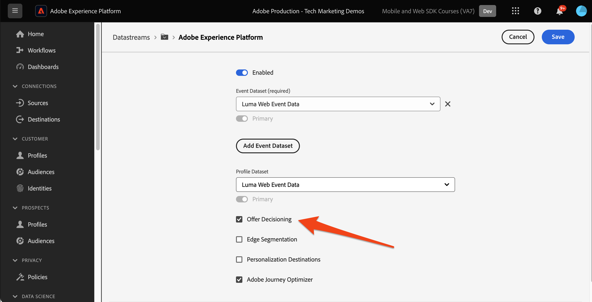

# Einrichten des Entscheidungs-Managements mit Platform Web SDK

Erfahren Sie, wie Sie die Entscheidungs-Management-Funktionen von Adobe Journey Optimizer mithilfe von Platform Web SDK implementieren. In diesem Handbuch werden die grundlegenden Voraussetzungen für das Entscheidungs-Management, detaillierte Schritte für die Konfiguration und ein detaillierter Einblick in einen Anwendungsfall mit Schwerpunkt auf dem Treuestatus behandelt.

In diesem Tutorial können Journey Optimizer-Benutzende Entscheidungs-Management-Funktionen verwenden, die die Personalisierung und Relevanz ihrer Kundeninteraktionen verbessern.


## Lernziele

Am Ende dieser Lektion können Sie:

* Machen Sie sich mit den Kernkonzepten des Entscheidungs-Managements in Adobe Journey Optimizer und seiner Integration mit Adobe Experience Platform Web SDK vertraut.

* Erfahren Sie mehr über den schrittweisen Prozess zum Konfigurieren der Web-SDK für Offer Decisioning, um eine nahtlose Integration in Journey Optimizer sicherzustellen.

* Erkunden Sie ein detailliertes Anwendungsbeispiel, in dem es um Treuestatus-Angebote geht und erhalten Sie Einblicke in die Erstellung und Verwaltung von Angeboten, Entscheidungen und Platzierungen effektiv.

* Machen Sie sich mit den wichtigsten Begriffen und ihren Auswirkungen im Rahmen des Entscheidungs-Managements vertraut.

* Machen Sie sich mit der Bedeutung von Entscheidungsregeln, Sammlungsqualifizierern und Fallback-Angeboten für die Bereitstellung des richtigen Angebots für den richtigen Benutzer vertraut.

* Erfahren Sie mehr über erweiterte Themen wie Simulationen und die Erfassung benutzerdefinierter Ereignisdaten, die es Ihnen ermöglichen, Ihre Mechanismen zur Angebotsbereitstellung zu testen, zu validieren und zu verbessern.

## Voraussetzungen

Um die Lektionen in diesem Abschnitt abzuschließen, müssen Sie zunächst:

* Stellen Sie sicher, dass Ihr Unternehmen Zugriff auf Adobe Journey Optimizer Ultimate (Journey Optimizer und Offer Decisioning) oder Adobe Experience Platform und das Offer Decisioning-Add-on hat.

* Schließen Sie alle Lektionen für die Erstkonfiguration von Platform Web SDK ab.

* Aktivieren Sie Ihr Unternehmen für Edge Decisioning.

* Erfahren Sie, wie Sie eine Platzierung konfigurieren und Platzierungs- und Aktivitäts-IDs innerhalb Ihrer Entscheidungsumfang-JSON instanziieren.

## Einschränkungen

Ereignisbasierte Angebote werden derzeit in Adobe Journey Optimizer nicht unterstützt. Wenn Sie eine Entscheidungsregel basierend auf einem Ereignis erstellen, können Sie sie nicht in einem Angebot anwenden.

## Zugriff auf das Entscheidungs-Management gewähren

Um Zugriff auf die Funktionen des Entscheidungs-Managements zu gewähren, müssen Sie ein **Produktprofil** erstellen und den Benutzern die entsprechenden Berechtigungen zuweisen. [&#x200B; Weitere Informationen zur Verwaltung von Journey Optimizer-Benutzern und -Berechtigungen finden Sie in diesem Abschnitt &#x200B;](https://experienceleague.adobe.com/de/docs/journey-optimizer/using/access-control/privacy/high-low-permissions#decisions-permissions).

## Konfigurieren des Datenstroms

Offer Decisioning muss in der Konfiguration **Datenstrom** aktiviert werden, bevor Entscheidungs-Management-Aktivitäten von Platform Web SDK bereitgestellt werden können.

So konfigurieren Sie Offer Decisioning im Datenstrom:

1. Navigieren Sie zur [Datenerfassung](https://experience.adobe.com/#/data-collection).

1. Wählen Sie in der linken Navigation **Datenströme** aus.

1. Wählen Sie den zuvor erstellten Luma Web SDK-Datenstrom aus.

   

1. Wählen Sie **Bearbeiten** im **Adobe Experience Platform-Service**.

   

1. Aktivieren Sie das Kontrollkästchen **&#x200B;**&#x200B;Offer Decisioning.

   

1. Wählen Sie **Speichern** aus.

Dadurch wird sichergestellt, dass eingehende Ereignisse für Journey Optimizer korrekt von der **Adobe Experience Platform Edge verarbeitet**.

## Konfigurieren der SDK für das Entscheidungs-Management

Das Entscheidungs-Management erfordert je nach Implementierungstyp von Web SDK zusätzliche SDK-Schritte. Es gibt zwei verfügbare Optionen zum Konfigurieren der SDK für das Entscheidungs-Management.

* Eigenständige SDK-Installation
   1. Konfigurieren Sie die `sendEvent` mit Ihren `decisionScopes`.

      ```javascript
      alloy("sendEvent", {
         ...
         "decisionScopes": [
            "[DECISION SCOPE 1]",
            "[DECISION SCOPE 2]"
         ]
      })
      ```

* SDK Tags-Installation
   1. Wechseln Sie zur Datenerfassungs-Oberfläche.

   1. Wählen Sie in der linken Navigation **Tags** aus.

      

   1. Wählen Sie die **Tag-Eigenschaft** aus.

   1. Erstellen Sie Ihre **Regeln**.
      * Fügen Sie eine Platform Web SDK **Aktion „Ereignis senden** hinzu und fügen Sie der Konfiguration dieser Aktion die entsprechenden `decisionScopes` hinzu.

   1. Erstellen und veröffentlichen Sie eine **Bibliothek** mit allen relevanten **Regeln**, **Datenelementen** und **Erweiterungen** die Sie konfiguriert haben.

## Terminologie

Zunächst sollten Sie die in der Benutzeroberfläche des Entscheidungs-Managements verwendete Terminologie verstehen.

* **Begrenzung**: Eine Begrenzung, die bestimmt, wie oft ein Angebot angezeigt wird. Zwei Typen:
   * Obergrenzen insgesamt: Maximale Anzahl der Fälle, in denen ein Angebot für die gesamte Zielgruppe angezeigt werden kann.
   * Profilbegrenzung: Gibt an, wie oft ein Angebot einem bestimmten Benutzer angezeigt werden kann.
* **Sammlungen**: Untergruppen von Angeboten, gruppiert nach bestimmten Bedingungen, die von einem Marketing-Experten festgelegt wurden, z. B. Angebotskategorie.
* **Entscheidung**: Logik, die die Auswahl eines Angebots bestimmt.
* **Entscheidungsregel**: Einschränkungen bei Angeboten, um die Eignung eines Benutzers herauszufinden.
* **Geeignetes Angebot**: Ein Angebot, das den vordefinierten Einschränkungen entspricht und einem Benutzer angezeigt werden kann.
* **Entscheidungs-Management**: Das System zur Erstellung und Verteilung personalisierter Angebote mithilfe von Business-Logik und Entscheidungsregeln.
* **Fallback-Angebote**: Das Standardangebot, das angezeigt wird, wenn ein Benutzer für keine Angebote in einer Sammlung qualifiziert ist.
* **Angebot**: Eine Marketing-Nachricht mit potenziellen Eignungsregeln, die die Viewer bestimmen.
* **Angebotsbibliothek**: Ein zentrales Repository zum Verwalten von Angeboten, Entscheidungen und zugehörigen Regeln.
* **Personalisierte Angebote**: Benutzerdefinierte Marketing-Nachrichten, die auf der Grundlage von Eignungsbegrenzungen zugeschnitten sind.
* **Platzierungen**: Die Einstellung oder das Szenario, in dem einem Benutzer ein Angebot angezeigt wird.
* **Priorität**: Rangfolgenmetrik für Angebote unter Berücksichtigung verschiedener Einschränkungen wie Eignung und Begrenzung.
* **Darstellungen**: Kanalspezifische Informationen, z. B. Ort oder Sprache, die die Anzeige eines Angebots lenken.

## Anwendungsfall - Übersicht - Treueprämien

In dieser Lektion implementieren Sie ein Beispiel für einen Anwendungsfall mit Treueprämien, um das Entscheidungs-Management mit der Web-SDK zu verstehen.

In diesem Anwendungsbeispiel erfahren Sie, wie Journey Optimizer Ihren Kunden mithilfe der zentralen Angebotsbibliothek und der Entscheidungs-Management-Engine das beste Angebot unterbreiten kann.

>[!NOTE]
>
> Da sich dieses Tutorial an Implementierer richtet, sollten Sie beachten, dass diese Lektion umfangreiche Schnittstellenarbeiten in Journey Optimizer umfasst. Obwohl diese Schnittstellenaufgaben normalerweise von Marketing-Experten durchgeführt werden, kann es für Implementierer von Vorteil sein, insight in den Prozess zu integrieren, auch wenn sie langfristig nicht für die Erstellung von Entscheidungs-Management-Kampagnen verantwortlich sind.

## Komponenten

Bevor Sie mit der Erstellung der Angebote beginnen, müssen Sie mehrere vorausgesetzte Komponenten definieren.

### Erstellen einer Platzierung für Treueangebote

**Platzierungen** sind Container, mit denen die Angebote präsentiert werden. In diesem Beispiel erstellen Sie eine Platzierung oben auf der Luma-Site.

Die Liste der Platzierungen ist im Menü **Komponenten** verfügbar. Es gibt Filter, mit denen Sie Platzierungen nach einem bestimmten Kanal oder Inhalt abrufen können.


Gehen Sie wie folgt vor, um die Platzierung zu erstellen:

1. Klicken Sie auf **Platzierung erstellen**.

   

1. Definieren Sie die Eigenschaften der Platzierung:
   * **Name**: der Name der Platzierung. Rufen wir die Beispielplatzierung *&#39;Homepage Banner&#39;*.
   * **Kanaltyp** Der Kanal, für den die Platzierung verwendet wird. Verwenden wir *&#39;Web&#39;*, da die Angebote auf der Luma-Website angezeigt werden.
   * **Content-**: Der Inhaltstyp, den die Platzierung anzeigen darf: Text, HTML, Bild-Link oder JSON. Für das Angebot können Sie *HTML* verwenden.
   * **Beschreibung**: eine Beschreibung der Platzierung (optional).

   

1. Klicken Sie auf **Speichern**.
1. Nachdem die Platzierung erstellt wurde, wird sie in der Liste der Platzierungen angezeigt.
1. Wählen Sie die Zeile aus, die Ihre neue Platzierungs-ID enthält, und notieren Sie sich die Platzierungs-ID, da dies für die Konfiguration in Ihrem Entscheidungsumfang erforderlich sein kann.

   

### Entscheidungsregeln für den Treuestatus

**Entscheidungsregeln** geben die Bedingungen an, unter denen die Angebote unterbreitet werden. In diesem Beispiel erstellen Sie Entscheidungsregeln, die je nach Treuestatus eines Benutzers verschiedene Angebote bereitstellen.

Die Liste der Entscheidungsregeln ist im Menü **Komponenten** verfügbar.

Gehen Sie wie folgt vor, um die Entscheidungsregeln zu erstellen:

1. Navigieren Sie zur Registerkarte **Regeln** und klicken Sie auf **Regel erstellen**.

   

1. Nennen wir die erste Regel &quot;*Gold-Treuestatus-Regel*. Sie können XDM-Felder verwenden, um die Regel zu definieren. Adobe Experience Platform **Segment Builder** ist eine intuitive Benutzeroberfläche zum Erstellen der Regelbedingungen.

   

1. Klicken Sie **Speichern**, um die Regelbedingung zu bestätigen.
1. Die neu gespeicherte *Gold-Treuestatus-Regel* wird in der **Regelliste** angezeigt. Wählen Sie diese aus, um ihre Eigenschaften anzuzeigen.

   

1. Erstellen Sie jetzt die verbleibenden Bedingungen für die Treueangebotsregel für den Anwendungsfall.


### Sammlungskennzeichner

**Sammlungsqualifizierer** ermöglichen es Ihnen, Angebote in der Angebotsbibliothek einfach zu organisieren und zu suchen. In diesem Beispiel fügen Sie den Treueprämien-Angeboten Sammlungsqualifizierer hinzu, um die Angebotsorganisation zu verbessern.

Die Liste der Sammlungsqualifizierer ist im Menü **Komponenten** verfügbar.

Gehen Sie wie folgt vor, um den Sammlungsqualifizierer für Treueprämien zu erstellen:

1. Navigieren Sie zur Registerkarte **Sammlungsqualifizierer** und klicken Sie auf **Sammlungsqualifizierer erstellen**.

   

1. Geben wir dem Sammlungsqualifizierer den Namen *Treueprämien*.

   

1. Der neue Sammlungskennzeichner sollte jetzt auf der Registerkarte **Sammlungskennzeichner“ angezeigt**.

## Angebote

Jetzt ist es an der Zeit, die Treueprämien-Angebote zu erstellen.

Die Liste der Angebote ist im Menü **Angebote** verfügbar.


### Erstellen von Angeboten für verschiedene Treuestufen

Erstellen Sie zunächst personalisierte Angebote für die verschiedenen Luma-Treuestufen.

Gehen Sie wie **vor, um das erste** Angebot“ zu erstellen:

1. Klicken Sie auf **Angebot erstellen** und wählen Sie dann **Personalisiertes Angebot** aus.

1. Nennen wir das erste Angebot &quot;*Loyalty Tier - Gold*. Sie müssen ein Start-/Enddatum und eine Uhrzeit für dieses Angebot angeben. Sie sollten auch den **Sammlungsqualifizierer** &quot;*Treueprämien* mit dem Angebot verknüpfen, damit Sie es in der **Angebotsbibliothek“ besser organisieren**. Klicken Sie anschließend auf **Weiter**.

   

1. Jetzt müssen Sie &quot;**&quot; hinzufügen** um festzulegen, wo das Angebot angezeigt wird. Wählen wir den **Webkanal**. Wählen wir auch das zuvor konfigurierte &quot;*Homepage-Banner&#x200B;***aus**. Die ausgewählte **Platzierung** ist vom Typ HTML, sodass Sie HTML-, JSON- oder TEXT-Inhalte direkt zum Editor hinzufügen können, um das Angebot mithilfe des **Benutzerdefiniert**-Optionsfelds zu erstellen.

   

1. Bearbeiten Sie den Angebotsinhalt direkt mit dem **Ausdruckseditor**. Denken Sie daran, dass Sie dieser Platzierung HTML-, JSON- oder TEXT-Inhalte hinzufügen können. Stellen Sie sicher, dass Sie **Modus** am unteren Rand des Editors abhängig von Ihrem Inhaltstyp auswählen. Sie können auch auf **validate** klicken, um sicherzustellen, dass keine Fehler auftreten.

   

1. Außerdem können Sie mit dem Ausdruckseditor in Adobe Experience Platform gespeicherte Attribute abrufen. Fügen wir den Vornamen eines Profils zum Angebotsinhalt hinzu, um die Mitglieder des Treueprogramms auf 1::1-Ebene besser zu personalisieren.

   

1. Fügen Sie Einschränkungen hinzu, um das Angebot nur Profilen anzuzeigen, die sich für die &quot;*Gold-Treuestatus-Regel“*.

   

1. Nachdem Sie Ihr Angebot überprüft haben, klicken Sie auf **Beenden**. Wählen Sie **Speichern und genehmigen** aus.

Erstellen Sie nun den Rest der Angebote für die verschiedenen Luma-Treuestufen

### Fallback-Angebote

Sie möchten auch weiterhin ein Angebot für Nicht-Luma-Besucher des Treueprogramms für die Luma-Site bereitstellen. Zu diesem Zweck können Sie ein **Fallback-Angebot** für die Kampagne konfigurieren.

Gehen Sie wie folgt vor, um das Fallback-Angebot zu erstellen:

1. Klicken Sie auf **Angebot erstellen** und wählen Sie dann **Fallback-Angebot** aus.
   <!--
      
   -->
1. Nennen wir das Fallback-Angebot &quot;*Loyalität gegenüber Luma*&quot;. Sie können auch den zuvor erstellten **Sammlungsqualifizierer**, &quot;*Treueprämien“,* Fallback-Angebot verknüpfen, um die Organisation von Angeboten zu vereinfachen.
   <!--
      
   -->
1. Fügen Sie den Fallback-Angebotsinhalt zum **Ausdruckseditor“**. Denken Sie daran, dass Sie dieser Platzierung HTML-, JSON- oder TEXT-Inhalte hinzufügen können. Stellen Sie sicher, dass Sie **Modus** am unteren Rand des Editors abhängig von Ihrem Inhaltstyp auswählen. Sie können auch auf **validate** klicken, um sicherzustellen, dass keine Fehler auftreten.
   <!--
      
   -->
1. Wenn alles korrekt konfiguriert ist, klicken Sie auf **Beenden** und dann auf **Speichern und genehmigen**.
<!--
   
-->

## Entscheidungen

**Entscheidungen** sind Container für Angebote, die das beste Angebot auswählen, das je nach Zielgruppe für einen Kunden verfügbar ist.

Die Liste der Entscheidungen ist auf der Registerkarte **Entscheidungen** des Menüs **Angebote** verfügbar.
<!--
   
-->

### Erstellen einer Entscheidung für Treueangebote

Erstellen wir eine Entscheidung für den Anwendungsfall „Luma-Treueprämien“.

Gehen Sie wie folgt vor, um die Entscheidung zu erstellen:

1. Klicken Sie **Entscheidung erstellen**.
   <!--
      
   -->
1. Rufen wir die Entscheidung „Dezember *Treueangebote für Luma“*. Die Angebote sollten einen Monat lang sein. Geben wir das also hier an.
   <!--
      
   -->
1. Jetzt müssen Sie die **Entscheidungsumfänge“**. Wählen Sie zuerst eine Platzierung aus. Sie können das zuvor erstellte &quot;*Homepage-Banner* verwenden.
   <!--
      
   -->
1. Als Nächstes müssen Sie **Bewertungskriterien** für den Entscheidungsumfang hinzufügen. Klicken Sie **Hinzufügen** und wählen Sie die zuvor erstellte Sammlung *Treueprämien* aus, ** alle zu berücksichtigenden Treueangebote enthält.
   <!--
      
   -->
1. Innerhalb der Sammlung *Treueprämien* können Sie das Eignungsfeld verwenden, um den Versand von Angeboten auf eine Untergruppe von Luma-Besuchern zu beschränken. In diesem Anwendungsfall soll jedoch jeder Besucher eines der Angebote erhalten. Denken Sie daran, dass Sie ein **Fallback-Angebot** für alle Besucher konfiguriert haben, die keine Treueprogramm sind. Die Berechtigung auf „Keine“ festlegen.
   <!--
      
   -->
1. Außerdem können Sie das Feld **Rangfolgenmethode** verwenden, um das beste Angebot für jeden Luma-Besucher auszuwählen, wenn mehrere Angebote für die Kombination Benutzer/Platzierung geeignet sind. Für diesen Anwendungsfall können Sie die Methode **Angebotspriorität** verwenden, die die in den Angeboten definierten Werte verwendet, um das beste Angebot zu unterbreiten.
   <!--
      
   -->
1. Fügen Sie nun das **Fallback-Angebot** zur Entscheidung hinzu. Erinnern Sie sich daran, dass das Fallback-Angebot das Standardangebot ist, das Luma-Besuchern angezeigt wird, wenn sie nicht in eine der Zielgruppen „Luma-Treue“ fallen. Wählen Sie *Nicht-Luma-Treue* aus der Liste der verfügbaren Fallback-Angebote für die Platzierung *Homepage-*&quot; aus.
   <!--
      
   -->
1. Vor der Aktivierung der Entscheidung sollten wir den Entscheidungsumfang, das Fallback-Angebot, die Vorschau der verfügbaren Angebote und die Schätzung der qualifizierten Profile überprüfen. Sobald alles gut aussieht, können Sie auf &quot;**&quot;** &quot;**und aktivieren** klicken.
<!--
   
-->

## Simulationen

Als Best Practice sollten Sie die Entscheidungslogik für die Treue zu Luma validieren, um sicherzustellen, dass die richtigen Angebote für die richtigen Treueprogramm-Zielgruppen bereitgestellt werden. Sie können diese Validierung mithilfe von **Testprofilen“**. Außerdem empfiehlt es sich, Änderungen an Angeboten über Testprofile zu testen, bevor neue Angebotsversionen in die Produktion verschoben werden.

Um mit dem Testen zu beginnen, wählen Sie die **Simulationen** aus dem Menü **Angebote** aus.

### Testen von Treueangeboten

1. Testprofil auswählen, das für die Simulation verwendet werden soll. Klicken Sie **Profil verwalten**. [Um ein neues Testprofil für Angebotstests zu erstellen oder festzulegen, folgen Sie diesem Handbuch](https://experienceleague.adobe.com/de/docs/journeys/using/building-journeys/about-journey-building/creating-test-profiles#create-test-profiles-csv).
   <!--
      
   -->
1. Fügen Sie ein oder mehrere Testprofile zur Simulation hinzu und speichern Sie Ihre Auswahl. Für die Anwendungsfalltests sollten Sie sicherstellen, dass Sie Testprofile für jede Zielgruppe mit Luma-Treueprämien konfiguriert haben.
   <!--
      
   -->
1. Wählen Sie den zu testenden Entscheidungsumfang aus. Wählen Sie **Entscheidungsumfang hinzufügen** aus.
   <!--
      
   -->
1. Wählen Sie die zuvor erstellte Platzierung *Homepage-*&quot; aus.
   <!--
      
   -->
1. Die verfügbaren Entscheidungen werden angezeigt. Wählen Sie die zuvor erstellte Entscheidung *Dezember Luma-Treueangebote* und klicken Sie auf **Hinzufügen**.
   <!--
      
   -->
1. Klicken Sie nach Auswahl eines Testprofils auf **Ergebnisse anzeigen**. Das beste verfügbare Angebot wird dem ausgewählten Testprofil für die Entscheidung &quot;*Dezember Luma-Treueangebote* angezeigt.
   <!--
      
   -->
1. Wählen Sie ein anderes Testprofil aus und klicken Sie auf **Ergebnisse anzeigen**. Idealerweise sollte ein anderes simuliertes Angebot angezeigt werden, das der Treuestufe des Testprofils entspricht.

## Validierung des Entscheidungs-Managements mit Adobe Experience Platform Debugger

Die Erweiterung **Adobe Experience Platform Debugger**, die für Chrome und Firefox verfügbar ist, analysiert Ihre Web-Seiten, um Probleme bei der Implementierung von Adobe Experience Cloud-Lösungen zu identifizieren.

Sie können den Debugger auf der Luma-Site verwenden, um die Entscheidungslogik in der Produktion zu validieren. Diese Validierung empfiehlt sich, sobald der Anwendungsfall „Treueprämien“ ausgeführt wird, um sicherzustellen, dass alles korrekt konfiguriert ist.

[Hier erfahren Sie, wie Sie den Debugger in Ihrem Browser mithilfe des Handbuchs konfigurieren](https://experienceleague.adobe.com/de/docs/platform-learn/data-collection/debugger/overview).

So starten Sie die Validierung mit dem Debugger:

1. Navigieren Sie zur Web-Seite von Luma mit der Platzierung des Angebots.
   <!--
      
   -->
1. Öffnen Sie auf der Webseite den **Adobe Experience Platform-Debugger**.
   <!--
      
   -->
1. Navigieren Sie zu **Zusammenfassung**. Überprüfen Sie, ob **Datenstrom-ID** mit dem **Datenstrom** in der **Adobe-** übereinstimmt, für den Sie Offer Decisioning aktiviert haben.
   <!--
      
   -->
1. Navigieren **unter &quot;**&quot; zur **Experience Platform Web SDK**.
   <!--
      
   -->
1. Schalten Sie auf der **Konfiguration** die Option **Debugging aktivieren** ein. Dadurch wird die Protokollierung für die Sitzung innerhalb einer **Adobe Experience Platform Assurance**-Sitzung aktiviert.
   <!--
      
   -->
1. Sie können sich dann mit verschiedenen Luma-Treuekonten bei der Website anmelden und den Debugger verwenden, um die an das **Adobe Experience Platform Edge-Netzwerk gesendeten Anfragen zu**. Alle diese Anfragen sollten zur Protokollverfolgung in **Assurance** erfasst werden.
<!--
   
-->

>[!NOTE]
>
>Vielen Dank, dass Sie sich Zeit genommen haben, um mehr über Adobe Experience Platform Web SDK zu erfahren. Wenn Sie Fragen haben, allgemeines Feedback geben möchten oder Vorschläge für zukünftige Inhalte haben, teilen Sie diese bitte auf diesem [Experience League Community-Diskussionsbeitrag](https://experienceleaguecommunities.adobe.com/t5/adobe-experience-platform-data/tutorial-discussion-implement-adobe-experience-cloud-with-web/td-p/444996?profile.language=de)
