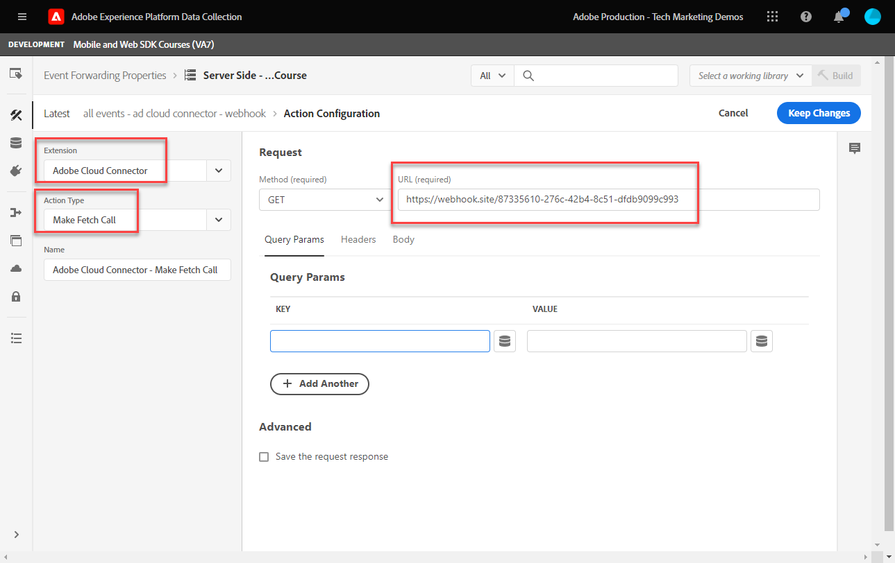

# Einrichten der Ereignisweiterleitung mit Platform Web SDK-Daten

Erfahren Sie, wie Sie die Ereignisweiterleitung mit Daten von Adobe Experience Platform Web SDK verwenden.

Die Ereignisweiterleitung ist ein neuer Eigenschaftstyp, der in der Datenerfassung verfügbar ist. Die Ereignisweiterleitung bietet Ihnen die Möglichkeit, Daten direkt über Adobe Experience Platform Edge Network anstelle des herkömmlichen Client-seitigen Browsers an Drittanbieter, die nicht mit Adobe verbunden sind, zu senden. Erfahren Sie mehr über die Vorteile der Ereignisweiterleitung in der [Übersicht über die Ereignisweiterleitung](https://experienceleague.adobe.com/en/docs/experience-platform/tags/event-forwarding/overview).

>[!WARNING]
>
> Die in diesem Tutorial verwendete Luma-Website wird voraussichtlich in der Woche vom 16. Februar 2026 ersetzt. Die im Rahmen dieses Tutorials durchgeführten Arbeiten sind möglicherweise nicht auf die neue Website anwendbar.

Um die Ereignisweiterleitung in Adobe Experience Platform zu verwenden, müssen Daten zuerst mit einer oder mehreren der folgenden drei Optionen an Adobe Experience Platform Edge Network gesendet werden:

* [Adobe Experience Platform Web SDK](overview.md)
* [Adobe Experience Platform Mobile SDK](https://developer.adobe.com/client-sdks/home/)
  <!--* [Server-to-Server API](https://experienceleague.adobe.com/en/docs/audience-manager/user-guide/api-and-sdk-code/dcs/dcs-apis/dcs-s2s)-->

>[!NOTE]
>Platform Web SDK und Platform Mobile SDK erfordern keine Bereitstellung über Tags. Es wird jedoch empfohlen, Tags zur Bereitstellung dieser SDKs zu verwenden.

Nach Abschluss der vorherigen Lektionen in diesem Tutorial sollten Sie Daten mithilfe der Web-SDK an Platform Edge Network senden. Sobald sich die Daten in Platform Edge Network befinden, können Sie die Ereignisweiterleitung aktivieren und eine Ereignisweiterleitungseigenschaft verwenden, um Daten an Nicht-Adobe-Lösungen zu senden.

## Lernziele

Am Ende dieser Lektion haben Sie folgende Möglichkeiten:

* Erstellen einer Ereignisweiterleitungs-Eigenschaft
* Verknüpfen einer Ereignisweiterleitungseigenschaft mit einem Platform Web SDK-Datenstrom
* Machen Sie sich mit den Unterschieden zwischen Datenelementen und Regeln für Tag-Eigenschaften und Datenelementen und Regeln für die Ereignisweiterleitung vertraut
* Erstellen eines Datenelements für die Ereignisweiterleitung
* Konfigurieren einer Ereignisweiterleitungsregel
* Überprüfen, ob eine Ereignisweiterleitungseigenschaft Daten erfolgreich sendet

## Voraussetzungen

* Eine Softwarelizenz, die die Ereignisweiterleitung enthält. Die Ereignisweiterleitung ist eine gebührenpflichtige Funktion der Datenerfassung. Weitere Informationen erhalten Sie von Ihrem Adobe Account Team.
* Die Ereignisweiterleitung ist in Ihrer Experience Cloud-Organisation aktiviert.
* Benutzerberechtigung für die Ereignisweiterleitung. (In [Admin Console](https://adminconsole.adobe.com/) unter dem Adobe Experience Platform Launch-Produkt Berechtigungselemente für[!UICONTROL Plattformen] > [!UICONTROL Edge] und alle [!UICONTROL Eigenschaftsrechte]). Nach der Gewährung [!UICONTROL  im linken Navigationsbereich ] Datenerfassungsoberfläche „Ereignisweiterleitung“ angezeigt werden:
  

* Adobe Experience Platform Web oder Mobile SDK ist so konfiguriert, dass Daten an Edge Network gesendet werden. Sie müssen die folgenden Lektionen dieses Tutorials abgeschlossen haben:

   * Erstkonfiguration

      * [Konfigurieren eines XDM-Schemas](configure-schemas.md)
      * [Konfigurieren eines Identity-Namespace](configure-identities.md)
      * [Konfigurieren eines Datenstroms](configure-datastream.md)

   * Tag-Konfiguration

      * [Installieren der Web SDK-Erweiterung](install-web-sdk.md)
      * [Datenelemente erstellen](create-data-elements.md)
      * [Erstellen von Identitäten](create-identities.md)
      * [Tag-Regeln erstellen](create-tag-rule.md)
      * [Validieren mit Adobe Experience Platform Debugger](validate-with-debugger.md)

## Erstellen einer Ereignisweiterleitungs-Eigenschaft

Erstellen Sie zunächst eine Ereignisweiterleitungs-Eigenschaft:

1. Öffnen Sie die [Datenerfassungsschnittstelle](https://experience.adobe.com/#/data-collection)
1. Wählen Sie **[!UICONTROL linken Navigationsbereich]** Ereignisweiterleitung“ aus
1. Wählen Sie **[!UICONTROL Neue Eigenschaft]** aus.
   

1. Benennen Sie die Eigenschaft. In diesem Fall `Server-Side - Web SDK Course`

1. Wählen Sie **[!UICONTROL Speichern]** aus.
   

## Konfigurieren des Datenstroms

Damit die Ereignisweiterleitung die Daten verwenden kann, die Sie an Platform Edge Network senden, müssen Sie die neu erstellte Ereignisweiterleitungseigenschaft mit demselben Datenstrom verknüpfen, der zum Senden von Daten an Adobe-Lösungen verwendet wird.

So konfigurieren Sie Target im Datenstrom:

1. Zur [Datenerfassung](https://experience.adobe.com/#/data-collection){target="blank"} wechseln
1. Wählen Sie in der linken Navigation **[!UICONTROL Datenströme]**
1. Wählen Sie den zuvor erstellten `Luma Web SDK: Development Environment` aus

   

1. Wählen Sie **[!UICONTROL Service hinzufügen]**
   
1. Wählen Sie **[!UICONTROL Ereignisweiterleitung]** als **[!UICONTROL Service]**

1. Wählen Sie **[!UICONTROL Dropdown-]** „Eigenschafts-ID“ den Namen aus, den Sie Ihrer Ereignisweiterleitungs-Eigenschaft gegeben haben, in diesem Fall `Server-Side - Web SDK Course`

1. Wählen Sie **[!UICONTROL Dropdown-]** „Umgebungs-ID“ die Tag-Umgebung aus, mit der Sie die Ereignisweiterleitungsumgebung verknüpfen, in diesem Fall `Development`

   >[!TIP]
   >
   >    Um Daten an eine Ereignisweiterleitungsumgebung außerhalb der Adobe-Organisation zu senden, wählen Sie **[!UICONTROL IDs manuell eingeben]** und fügen Sie eine ID ein. Die ID wird bereitgestellt, wenn Sie eine Ereignisweiterleitungseigenschaft erstellen.

1. Wählen Sie **[!UICONTROL Speichern]** aus.

   

Wiederholen Sie diese Schritte für Staging- und Produktions-Datenströme, wenn Sie bereit sind, Ihre Änderungen über den Publishing-Ablauf weiterzuleiten.

## Weiterleiten von Daten von Platform Edge Network an eine Nicht-Adobe-Lösung

In dieser Übung erfahren Sie, wie Sie ein Datenelement für die Ereignisweiterleitung einrichten, eine Regel für die Ereignisweiterleitung konfigurieren und mit dem Tool eines Drittanbieters namens „Webhook[site“ ](https://webhook.site/).

>[!NOTE]
>
>Ein Webhook bietet die Möglichkeit, verschiedene Systeme in Halbzeit zu integrieren. [Webhook.site](https://webhook.site/) ist ein Tool eines Drittanbieters, mit dem Sie eingehende HTTP-Anfragen oder E-Mails einfach überprüfen, testen und automatisieren können (mit dem visuellen benutzerdefinierten Aktionsgenerator oder WebhookScript).

>[!IMPORTANT]
>
>Sie müssen bereits Datenelemente erstellt und einem XDM-Objekt zugeordnet sowie Tag-Regeln konfiguriert und diese Änderungen innerhalb einer Bibliothek in eine Tag-Umgebung erstellt haben, um fortzufahren. Andernfalls finden Sie weitere Informationen in den **Tags-Konfiguration** Schritten im Abschnitt [Voraussetzungen](setup-event-forwarding.md#prerequisites). Diese Schritte stellen sicher, dass Daten an Platform Edge Network gesendet werden. Von dort aus können Sie eine Ereignisweiterleitungseigenschaft konfigurieren, um Daten an eine Nicht-Adobe-Lösung weiterzuleiten.

### Erstellen eines Datenelements für die Ereignisweiterleitung

Das XDM-Objekt, das Sie zuvor mit der Tag-Erweiterung „Platform Web SDK&quot; konfiguriert haben, wird zur Datenquelle für Datenelemente in einer Ereignisweiterleitungseigenschaft. Sie verwenden dieselben Daten, die Sie bereits in der Tag-Eigenschaft als Datenquelle für die Ereignisweiterleitung konfiguriert haben.

>[!IMPORTANT]
>
>Es gibt einen wichtigen Syntaxunterschied beim Referenzieren von XDM-Feldern in der Ereignisweiterleitung im Vergleich zu anderen Kontexten. Um auf Daten in einer Ereignisweiterleitungseigenschaft zu verweisen, muss der Datenelementpfad das `arc.event` Präfix enthalten:
>
> * `arc` steht für Adobe Response Context.
> * Beispiel: `arc.event.xdm.web.webPageDetails.URL`
>
>Wenn dieser Pfad falsch angegeben ist, werden keine Daten erfasst.

In dieser Übung leiten Sie die Höhe des Browser-Darstellungsfelds und die Experience Cloud-ID vom XDM-Objekt an einen Webhook weiter. Der XDM-Feldpfad wird durch das XDM-Schema bestimmt, das während der Lektion [Konfigurieren eines XDM-Schemas](configure-schemas.md) erstellt wurde.

>[!TIP]
>
>Sie können den XDM-Objektpfad auch finden, indem Sie Ihre Webbrowser-Netzwerkwerkzeuge verwenden, nach `/ee`-Anfragen filtern, den Beacon [!UICONTROL **Payload**] öffnen und eine Drilldown-Liste für die gesuchte Variable durchführen. Klicken Sie dann mit der rechten Maustaste und wählen Sie „Eigenschaftspfad kopieren“. Im Folgenden finden Sie ein Beispiel für die Höhe des Browser-Ansichtsfensters:
> 

1. Navigieren Sie zur Eigenschaft **[!UICONTROL Ereignisweiterleitung]**, die Sie kürzlich erstellt haben

1. Wählen Sie in der linken Navigation **[!UICONTROL Datenelemente]**

1. Wählen Sie **[!UICONTROL Neues Datenelement erstellen]** aus

   

1. **[!UICONTROL Name]** das Datenelement `environment.browserDetails.viewportHeight`

1. Lassen **[!UICONTROL unter &quot;]**&quot; `CORE`

1. Wählen **[!UICONTROL unter „Datenelementtyp]** die Option `Path`

1. Geben Sie den XDM-Objektpfad ein, der die Browser-Viewport-`arc.event.xdm.environment.browserDetails.viewportHeight` enthält

1. Wählen Sie **[!UICONTROL Speichern]**

   

1. Ein weiteres Datenelement erstellen

1. **[!UICONTROL Name]** sie `ecid`

1. Lassen **[!UICONTROL unter &quot;]**&quot; `CORE`

1. Wählen **[!UICONTROL unter „Datenelementtyp]** die Option `Path`

1. Geben Sie den XDM-Objektpfad ein, der die Experience Cloud-ID `arc.event.xdm.identityMap.ECID.0.id` enthält

1. Wählen Sie **[!UICONTROL Speichern]**

   

   >[!CAUTION]
   >
   > Stellen Sie sicher, dass Sie das `arc.event.` Präfix in den Pfad einschließen. Achten Sie außerdem darauf, die exakte Groß-/Kleinschreibung als XDM-Objektfeldname zu verwenden. Der ECID-Namespace muss in Großbuchstaben angegeben werden.

   >[!TIP]
   >
   >Wenn Sie mit Ihrer eigenen Website arbeiten, können Sie den XDM-Objektpfad mit Ihren Webbrowser-Netzwerkwerkzeugen finden, nach `/ee` filtern, den Beacon [!UICONTROL **Payload**] öffnen und zur gesuchten Variablen aufschlüsseln. Klicken Sie dann mit der rechten Maustaste und wählen Sie „Eigenschaftspfad kopieren“. Im Folgenden finden Sie ein Beispiel für die Höhe des Browser-Ansichtsfensters:
   > 

### Installieren der Adobe Cloud Connector-Erweiterung

Um Daten an Standorte von Drittanbietern zu senden, installieren Sie zunächst die Erweiterung [!UICONTROL Adobe Cloud Connector].

1. Wählen **[!UICONTROL Erweiterungen]** im linken Navigationsbereich aus.

1. Wählen Sie die **[!UICONTROL Katalog]** aus

1. Suchen Sie nach dem **[!UICONTROL Adobe Cloud Connector]** und wählen Sie **[!UICONTROL Installieren]**

   

Es ist keine Erweiterungskonfiguration erforderlich. Mit dieser Erweiterung können Sie jetzt Daten an eine Nicht-Adobe-Lösung weiterleiten!

### Erstellen einer Regel für die Ereignisweiterleitung

Es gibt einige Hauptunterschiede zwischen dem Konfigurieren von Regeln in einer Tag-Eigenschaft und einer Regel in einer Ereignisweiterleitungs-Eigenschaft:

* **[!UICONTROL Ereignisse] und [!UICONTROL Bedingungen]**:

   * **Tags**: Alle Regeln werden durch ein Ereignis ausgelöst, das in der Regel angegeben werden muss, z. B. `Library Loaded - Page Top`. Bedingungen sind optional.
   * **Ereignisweiterleitung**: Es wird davon ausgegangen, dass jedes an Platform Edge Network gesendete Ereignis ein Trigger zur Datenweiterleitung ist. Daher gibt es keine [!UICONTROL Ereignisse] die in den Regeln für die Ereignisweiterleitung ausgewählt werden müssen. Um zu verwalten, welcher Trigger eine Ereignisweiterleitungsregel ist, müssen Sie Bedingungen konfigurieren.

* **Datenelement-Tokenisierung**:

   * **Tags**: Datenelementnamen werden am Anfang und am Ende des Datenelementnamens mit einem `%` versehen, wenn sie in einer Regel verwendet werden. Beispiel: `%viewportHeight%`.

   * **Ereignisweiterleitung**: Namen von Datenelementen werden mit `{{` am Anfang und `}}` am Ende des Datenelementnamens versehen, wenn sie in einer Regel verwendet werden. Beispiel: `{{viewportHeight}}`.

* **Sequenz von**:

   * Der Abschnitt Aktionen einer Ereignisweiterleitungsregel wird immer nacheinander ausgeführt. Stellen Sie beim Speichern einer Regel sicher, dass die Reihenfolge der Aktionen korrekt ist. Diese Ausführungsreihenfolge kann im Gegensatz zu Tags nicht asynchron ausgeführt werden.

<!--
  * **Tags**: Rule actions can easily be reordered using drag-and-drop functionality.
  * **Event forwarding**: Rule actions are always executed sequentially. Make sure the order of actions is correct when you save a rule.
-->

Um eine Regel für die Weiterleitung von Daten an Ihren Webhook zu konfigurieren, müssen Sie zunächst Ihren persönlichen Webhook abrufen:

1. Navigieren Sie zu [Webhook.site](https://webhook.site)

1. Suchen Sie **Ihre eindeutige URL** und verwenden Sie diese als URL-Anfrage in Ihrer Ereignisweiterleitungsregel

1. Wählen Sie **[!UICONTROL In Zwischenablage kopieren]**

1. Lassen Sie dieses Fenster geöffnet, da Sie die Ereignisweiterleitungsdaten in Echtzeit überprüfen können, die von Webhook erfasst werden

   

1. Gehen Sie **[!UICONTROL linken Navigationsbereich zurück]** Datenerfassung > **[!UICONTROL Ereignisweiterleitung]** > **[!UICONTROL Regeln]**.

1. Wählen Sie **[!UICONTROL Neue Regel erstellen]**

   

1. Benennen Sie ihn `all events - ad cloud connector - webhook`

1. Aktion hinzufügen

1. Wählen **[!UICONTROL unter &quot;]**&quot; den **[!UICONTROL Adobe Cloud Connector aus]**

1. Wählen **[!UICONTROL unter „Aktionstyp]** die Option **[!UICONTROL Abrufaufruf ausführen]**

1. Fügen Sie Ihre Webhook-URL in das Feld **[!UICONTROL URL]** ein

   

1. Unter **[Abfrageparameter]** fügen Sie beide zuvor erstellten Datenelemente hinzu.

1. Auf der **[!UICONTROL Schlüssel]** Spaltentyp in `viewPortHeight`. Geben Sie in **[!UICONTROL Spalte]** Wert“ das `{{environment.browserDetails.viewportHeight}}` Datenelement ein, indem Sie es eingeben oder aus dem Datenelement-Auswahlsymbol auswählen

1. Wählen Sie [!UICONTROL **+ Weitere hinzufügen aus**] um einen weiteren Abfrageparameter hinzuzufügen

1. Auf der **[!UICONTROL Schlüssel]** Spaltentyp in `ecid`. Geben Sie in der Spalte Wert das `{{ecid}}` Datenelement ein

1. Wählen **[!UICONTROL Änderungen beibehalten]**

   

1. Ihre Regel sollte wie folgt aussehen

1. Wählen Sie **[!UICONTROL Speichern]**

   

### Bibliothek erstellen

Erstellen Sie eine Bibliothek und erstellen Sie alle Änderungen an Ihrer Entwicklungsumgebung für die Ereignisweiterleitung wie gewohnt in einer Tag-Eigenschaft.

>[!NOTE]
>
>Wenn Sie keine Staging- und Produktions-Ereignisweiterleitungs-Eigenschaften mit Ihrem Datenstrom verknüpft haben, sehen Sie die Entwicklungsumgebung als einzige Option zum Erstellen einer Bibliothek für .

## Validieren der Ereignisweiterleitungsregel

Jetzt können Sie Ihre Ereignisweiterleitungseigenschaft mit dem Platform Debugger und Webhook.site überprüfen:

1. Führen Sie die Schritte aus[ um die Tag](validate-with-debugger.md#use-the-experience-platform-debugger-to-map-to-your-tag-property)Bibliothek auf der [Luma Demo-Site](https://luma.enablementadobe.com/content/luma/us/en/men.html) auf die Tag-Eigenschaft von Web SDK zu wechseln, der Sie Ihre Ereignisweiterleitungs-Eigenschaft im Datenstrom zugeordnet haben.

1. Bevor Sie die Seite neu laden, öffnen Sie im Experience Platform Debugger **[!UICONTROL Protokolle]** im linken Navigationsbereich

1. Wählen Sie die Registerkarte **[!UICONTROL Edge]** und dann **[!UICONTROL Verbinden]** aus, um die Platform Edge Network-Anfragen anzuzeigen

   

1. Seite neu laden

1. Es werden zusätzliche Anfragen angezeigt, die Ihnen Einblick in die Server-seitigen Anfragen geben, die von Platform Edge Network an den WebHook gesendet werden

1. Die Anforderung, auf die die Validierung konzentriert werden soll, ist diejenige, die die vollständig aufgebaute URL anzeigt, die vom Edge-Netzwerk gesendet wird

   

1. Beachten Sie die Abfragezeichenfolgenparameter viewPortHeight und ecid

   

1. Sie entsprechen den im XDM-Objekt angezeigten Daten

   

1. Überprüfen Sie abschließend die Datenübereinstimmungen in [Webhook.site](https://webhook.site) und indem Sie Ihr geöffnetes Webhook-Fenster anzeigen

   

Herzlichen Glückwunsch! Sie haben die Ereignisweiterleitung konfiguriert!

>[!NOTE]
>
>Vielen Dank, dass Sie sich Zeit genommen haben, um mehr über Adobe Experience Platform Web SDK zu erfahren. Wenn Sie Fragen haben, allgemeines Feedback geben möchten oder Vorschläge für zukünftige Inhalte haben, teilen Sie diese bitte auf diesem [Experience League Community-Diskussionsbeitrag](https://experienceleaguecommunities.adobe.com/t5/adobe-experience-platform-data/tutorial-discussion-implement-adobe-experience-cloud-with-web/td-p/444996)
