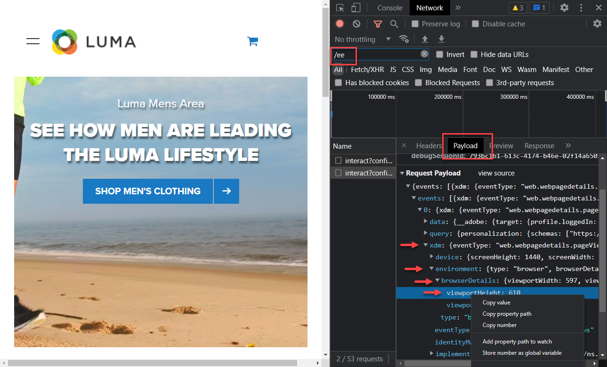
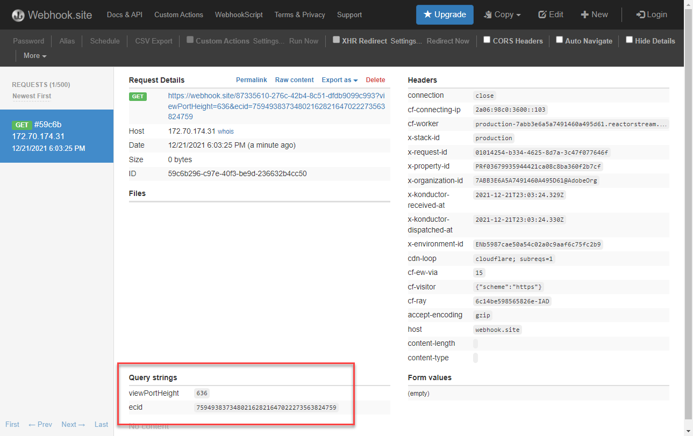

# Einrichten der Ereignisweiterleitung mit Platform Web SDK-Daten

Erfahren Sie, wie Sie die Ereignisweiterleitung mit Daten von Adobe Experience Platform Web SDK verwenden.

Die Ereignisweiterleitung ist ein neuer Eigenschaftstyp, der in der Datenerfassung verfügbar ist. Die Ereignisweiterleitung bietet Ihnen die Möglichkeit, Daten direkt vom Adobe Experience Platform-Edge Network an Drittanbieter zu senden, die keine Adobe sind, und nicht an den herkömmlichen Client-seitigen Browser. Weitere Informationen zu den Vorteilen der Ereignisweiterleitung finden Sie in der Übersicht über die [Ereignisweiterleitung](https://experienceleague.adobe.com/en/docs/experience-platform/tags/event-forwarding/overview) .

Um die Ereignisweiterleitung in Adobe Experience Platform zu verwenden, müssen Daten zunächst mit einer oder mehreren der folgenden drei Optionen an das Adobe Experience Platform-Edge Network gesendet werden:

* [Adobe Experience Platform Web SDK](overview.md)
* [Adobe Experience Platform Mobile SDK](https://developer.adobe.com/client-sdks/home/)
  <!--* [Server-to-Server API](https://experienceleague.adobe.com/en/docs/audience-manager/user-guide/api-and-sdk-code/dcs/dcs-apis/dcs-s2s)-->

>[!NOTE]
>Das Platform Web SDK und Platform Mobile SDK erfordern keine Implementierung über Tags. Es wird jedoch empfohlen, zum Bereitstellen dieser SDKs Tags zu verwenden.

Nach Abschluss der vorherigen Lektionen in diesem Tutorial sollten Sie mithilfe des Web SDK Daten an Platform Edge Network senden. Sobald sich die Daten im Platform Edge Network befinden, können Sie die Ereignisweiterleitung aktivieren und eine Ereignisweiterleitungseigenschaft verwenden, um Daten an Nicht-Adobe-Lösungen zu senden.

## Lernziele

Am Ende dieser Lektion können Sie:

* Erstellen einer Ereignisweiterleitungs-Eigenschaft
* Verknüpfen einer Ereignisweiterleitungs-Eigenschaft mit einem Platform Web SDK-Datenspeicher
* Machen Sie sich mit den Unterschieden zwischen den Datenelementen und Regeln der Tag-Eigenschaft und den Datenelementen und Regeln der Ereignisweiterleitung vertraut.
* Erstellen eines Datenelements für die Ereignisweiterleitung
* Ereignisweiterleitungsregel konfigurieren
* Überprüfen, ob eine Ereignisweiterleitungseigenschaft Daten erfolgreich sendet

## Voraussetzungen

* Eine Softwarelizenz, die die Ereignisweiterleitung enthält. Die Ereignisweiterleitung ist eine gebührenpflichtige Funktion der Datenerfassung. Weitere Informationen erhalten Sie von Ihrem Adobe-Account-Team.
* Die Ereignisweiterleitung ist in Ihrer Experience Cloud-Organisation aktiviert.
* Benutzerberechtigung für die Ereignisweiterleitung. (In [Admin Console](https://adminconsole.adobe.com/), unter dem Adobe Experience Platform Launch-Produkt, Berechtigungselemente für [!UICONTROL Plattformen] > [!UICONTROL Edge] und alle [!UICONTROL Eigenschaftsrechte]). Nach der Erteilung sollten Sie die [!UICONTROL Ereignisweiterleitung] im linken Navigationsbereich der Datenerfassungs-Oberfläche sehen:
  

* Adobe Experience Platform Web oder Mobile SDK ist so konfiguriert, dass Daten an Edge Network gesendet werden. Sie müssen die folgenden Lektionen dieses Tutorials abgeschlossen haben:

   * Erstkonfiguration

      * [Konfigurieren eines XDM-Schemas](configure-schemas.md)
      * [Identitäts-Namespace konfigurieren](configure-identities.md)
      * [Konfigurieren eines Datenstroms](configure-datastream.md)

   * Tag-Konfiguration

      * [Installieren der Web SDK-Erweiterung](install-web-sdk.md)
      * [Erstellen von Datenelementen](create-data-elements.md)
      * [Erstellen von Identitäten](create-identities.md)
      * [Erstellen von Tag-Regeln](create-tag-rule.md)
      * [Überprüfen mit dem Adobe Experience Platform-Debugger](validate-with-debugger.md)

## Erstellen einer Ereignisweiterleitungs-Eigenschaft

Erstellen Sie zunächst eine Ereignisweiterleitungs-Eigenschaft:

1. Öffnen Sie die [Datenerfassungsschnittstelle](https://experience.adobe.com/#/data-collection) .
1. Wählen Sie **[!UICONTROL Ereignisweiterleitung]** aus der linken Navigation aus.
1. Wählen Sie **[!UICONTROL Neue Eigenschaft]** aus.
   

1. Benennen Sie die Eigenschaft. In diesem Fall `Server-Side - Web SDK Course`

1. Wählen Sie **[!UICONTROL Speichern]** aus.
   

## Konfigurieren des Datenspeichers

Damit die Ereignisweiterleitung die an das Platform-Edge Network gesendeten Daten verwenden kann, müssen Sie die neu erstellte Ereignisweiterleitungs-Eigenschaft mit demselben Datastream verknüpfen, der zum Senden von Daten an Adobe-Lösungen verwendet wird.

So konfigurieren Sie Target im Datastream:

1. Wechseln Sie zur Oberfläche [Datenerfassung](https://experience.adobe.com/#/data-collection){target="blank"} .
1. Wählen Sie im linken Navigationsbereich **[!UICONTROL Datastreams]** aus.
1. Wählen Sie den zuvor erstellten `Luma Web SDK: Development Environment`-Datastream aus.

   

1. Wählen Sie **[!UICONTROL Dienst hinzufügen]** aus
   
1. Wählen Sie **[!UICONTROL Ereignisweiterleitung]** als **[!UICONTROL Dienst]** aus.

1. Wählen Sie im Dropdown-Menü **[!UICONTROL Eigenschaften-ID]** den Namen aus, den Sie Ihrer Ereignisweiterleitungs-Eigenschaft gegeben haben, in diesem Fall `Server-Side - Web SDK Course`

1. Wählen Sie im Dropdown-Menü **[!UICONTROL Umgebungs-ID]** die Tag-Umgebung aus, mit der Sie die Ereignisweiterleitungsumgebung verknüpfen, in diesem Fall `Development` .

   >[!TIP]
   >
   >    Um Daten an eine Ereignisweiterleitungsumgebung außerhalb der Adobe-Org zu senden, wählen Sie **[!UICONTROL IDs manuell eingeben]** und fügen Sie eine ID ein. Die ID wird bereitgestellt, wenn Sie eine Ereignisweiterleitungs-Eigenschaft erstellen.

1. Wählen Sie **[!UICONTROL Speichern]** aus.

   

Wiederholen Sie diese Schritte für Staging- und Produktionsdatenspeicher, wenn Sie bereit sind, Ihre Änderungen durch den Veröffentlichungsfluss zu fördern.

## Weiterleiten von Daten vom Platform-Edge Network an eine Nicht-Adobe-Lösung

In dieser Übung erfahren Sie, wie Sie ein Datenelement für die Ereignisweiterleitung einrichten, eine Regel für die Ereignisweiterleitung konfigurieren und mit einem Tool eines Drittanbieters namens [Webhook.site](https://webhook.site/) validieren.

>[!NOTE]
>
>Ein Webhook ist eine Möglichkeit, verschiedene Systeme in halbEchtzeit zu integrieren. [Webhook.site](https://webhook.site/) ist ein Tool eines Drittanbieters, mit dem Sie eingehende HTTP-Anforderungen oder E-Mails einfach überprüfen, testen und automatisieren können (mit dem visuellen benutzerdefinierten Aktionen-Builder oder WebhookScript).

>[!IMPORTANT]
>
>Sie müssen bereits Datenelemente erstellt und einem XDM-Objekt zugeordnet sowie konfigurierte Tag-Regeln erstellt und diese Änderungen in einer Bibliothek in eine Tag-Umgebung erstellt haben, um fortfahren zu können. Ist dies nicht der Fall, lesen Sie die Schritte zur **Tag-Konfiguration** im Abschnitt [Voraussetzungen](setup-event-forwarding.md#prerequisites) . Diese Schritte stellen sicher, dass Daten an das Platform-Edge Network gesendet werden, und von dort können Sie eine Ereignisweiterleitungs-Eigenschaft konfigurieren, um Daten an eine Nicht-Adobe-Lösung weiterzuleiten.

### Erstellen eines Datenelements für die Ereignisweiterleitung

Das XDM-Objekt, das Sie zuvor mit der Platform Web SDK-Tag-Erweiterung konfiguriert haben, wird zur Datenquelle für Datenelemente in einer Ereignisweiterleitungs-Eigenschaft. Sie verwenden dieselben Daten, die Sie bereits in der Tag-Eigenschaft konfiguriert haben, als Datenquelle für die Ereignisweiterleitung.

>[!IMPORTANT]
>
>Es gibt einen wichtigen Syntaxunterschied beim Referenzieren von XDM-Feldern in der Ereignisweiterleitung gegenüber anderen Kontexten. Um Daten in einer Ereignisweiterleitungs-Eigenschaft zu referenzieren, muss der Datenelementpfad das Präfix `arc.event` enthalten:
>
> * `arc` steht für Adobe Response Context.
> * Beispiel: `arc.event.xdm.web.webPageDetails.URL`
>
>Wenn dieser Pfad falsch angegeben ist, werden keine Daten erfasst.

In dieser Übung leiten Sie die Höhe des Browser-Viewports und die Experience Cloud-ID vom XDM-Objekt an einen Webhook weiter. Der Pfad des XDM-Felds wird durch das XDM-Schema bestimmt, das während der Lektion [Konfigurieren eines XDM-Schemas](configure-schemas.md) erstellt wurde.

>[!TIP]
>
>Sie können den XDM-Objektpfad auch finden, indem Sie die Netzwerkwerkzeuge Ihres Webbrowsers verwenden, nach `/ee` -Anforderungen filtern, das Beacon [!UICONTROL **Payload**] öffnen und bis zur gesuchten Variable weiterleiten. Klicken Sie dann mit der rechten Maustaste und wählen Sie &quot;Eigenschaftspfad kopieren&quot;. Im Folgenden finden Sie ein Beispiel für die Höhe des Browser Viewports:
> 

1. Navigieren Sie zur Eigenschaft **[!UICONTROL Ereignisweiterleitung]** , die Sie kürzlich erstellt haben.

1. Wählen Sie im linken Navigationsbereich **[!UICONTROL Datenelemente]** aus.

1. Wählen Sie &quot;**[!UICONTROL Neues Datenelement erstellen]**&quot;aus.

   

1. **[!UICONTROL Name]** das Datenelement `environment.browserDetails.viewportHeight`

1. Lassen Sie unter **[!UICONTROL Erweiterung]** den Wert `CORE`

1. Wählen Sie unter **[!UICONTROL Datenelementtyp]** die Option `Path`

1. Geben Sie in den XDM-Objektpfad ein, der die Browser Viewport-Höhe `arc.event.xdm.environment.browserDetails.viewportHeight` enthält.

1. Wählen Sie **[!UICONTROL Speichern]** aus.

   

1. Erstellen eines weiteren Datenelements

1. **[!UICONTROL Name]** it `ecid`

1. Lassen Sie unter **[!UICONTROL Erweiterung]** den Wert `CORE`

1. Wählen Sie unter **[!UICONTROL Datenelementtyp]** die Option `Path`

1. Geben Sie den XDM-Objektpfad ein, der die Experience Cloud-ID `arc.event.xdm.identityMap.ECID.0.id` enthält

1. Wählen Sie **[!UICONTROL Speichern]** aus.

   

   >[!CAUTION]
   >
   > Stellen Sie sicher, dass Sie das Präfix `arc.event.` in den Pfad einschließen. Achten Sie außerdem darauf, den genauen Fall als XDM-Objektfeldname zu befolgen. Der ECID-Namespace muss in Großbuchstaben sein.

   >[!TIP]
   >
   >Wenn Sie mit Ihrer eigenen Website arbeiten, können Sie den XDM-Objektpfad mit Ihren Webbrowser-Netzwerkwerkzeugen finden, nach `/ee` -Anforderungen filtern, das Beacon [!UICONTROL **Payload**] öffnen und bis zur gesuchten Variable weiterleiten. Klicken Sie dann mit der rechten Maustaste und wählen Sie &quot;Eigenschaftspfad kopieren&quot;. Im Folgenden finden Sie ein Beispiel für die Höhe des Browser Viewports:
   > 

### Installieren der Adobe Cloud Connector-Erweiterung

Um Daten an Drittanbieterstandorte zu senden, installieren Sie zunächst die Erweiterung [!UICONTROL Adobe Cloud Connector] .

1. Wählen Sie **[!UICONTROL Erweiterungen]** im linken Navigationsbereich aus.

1. Wählen Sie die Registerkarte **[!UICONTROL Katalog]** aus.

1. Suchen Sie nach dem **[!UICONTROL Adobe Cloud Connector]**, wählen Sie **[!UICONTROL Installieren]** aus.

   

Es ist keine Erweiterungskonfiguration erforderlich. Mit dieser Erweiterung können Sie jetzt Daten an eine Nicht-Adobe-Lösung weiterleiten!

### Erstellen einer Ereignisweiterleitungsregel

Es gibt einige Hauptunterschiede zwischen dem Konfigurieren von Regeln in einer Tag-Eigenschaft und einer Regel in einer Ereignisweiterleitungs-Eigenschaft:

* **[!UICONTROL Ereignisse] &amp; [!UICONTROL Bedingungen]**:

   * **Tags**: Alle Regeln werden durch ein Ereignis ausgelöst, das in der Regel angegeben werden muss, z. B. `Library Loaded - Page Top`. Bedingungen sind optional.
   * **Ereignisweiterleitung**: Es wird davon ausgegangen, dass jedes an Platform Edge Network gesendete Ereignis ein Trigger zur Weiterleitung von Daten ist. Daher müssen in den Ereignisweiterleitungsregeln keine [!UICONTROL Ereignisse] ausgewählt werden. Um zu verwalten, welche Ereignisse Trigger einer Ereignisweiterleitungsregel sind, müssen Sie Bedingungen konfigurieren.

* **Datenelement-Tokenisierung**:

   * **Tags**: Datenelementnamen werden bei Verwendung in einer Regel am Anfang und am Ende des Datenelementnamens mit einem 2-Token versehen. `%` Beispiel: `%viewportHeight%`.

   * **Ereignisweiterleitung**: Datenelementnamen werden mit `{{` am Anfang und `}}` am Ende des Datenelementnamens markiert, wenn sie in einer Regel verwendet werden. Beispiel: `{{viewportHeight}}`.

* **Sequenz von Regelaktionen**:

   * Der Abschnitt Aktionen einer Ereignisweiterleitungsregel wird immer nacheinander ausgeführt. Stellen Sie beim Speichern einer Regel sicher, dass die Reihenfolge der Aktionen korrekt ist. Diese Ausführungsreihenfolge kann im Gegensatz zu Tags nicht asynchron ausgeführt werden.

<!--
  * **Tags**: Rule actions can easily be reordered using drag-and-drop functionality.
  * **Event forwarding**: Rule actions are always executed sequentially. Make sure the order of actions is correct when you save a rule.
-->

Um eine Regel zum Weiterleiten von Daten an Ihren Webhook zu konfigurieren, müssen Sie zunächst Ihren persönlichen Webhook abrufen:

1. Wechseln Sie zu [webhook.site](https://webhook.site)

1. Suchen Sie nach **Ihrer eindeutigen URL**. Verwenden Sie diese als URL-Anforderung in Ihrer Ereignisweiterleitungsregel.

1. Wählen Sie **[!UICONTROL In Zwischenablage kopieren]** aus.

1. Lassen Sie dieses Fenster geöffnet, da Sie die Ereignisweiterleitungsdaten in Echtzeit überprüfen können, die von Webhook erfasst werden

   

1. Kehren Sie **[!UICONTROL Datenerfassung]** > **[!UICONTROL Ereignisweiterleitung]** > **[!UICONTROL Regeln]** aus der linken Navigation zurück.

1. Wählen Sie **[!UICONTROL Neue Regel erstellen]** aus

   

1. Benennen Sie es `all events - ad cloud connector - webhook`

1. Hinzufügen einer Aktion

1. Wählen Sie unter **[!UICONTROL Erweiterung]** **[!UICONTROL Adobe Cloud Connector]** aus.

1. Wählen Sie unter **[!UICONTROL Aktionstyp]** die Option **[!UICONTROL Abruf durchführen]** aus.

1. Fügen Sie Ihre Webhook-URL in das Feld **[!UICONTROL URL]** ein.

   

1. Unter **[Abfrageparameter]** fügen Sie beide zuvor erstellten Datenelemente hinzu.

1. Geben Sie für den Spaltentyp **[!UICONTROL Schlüssel]** in `viewPortHeight` ein. Geben Sie in der Spalte **[!UICONTROL Wert]** das Datenelement `{{environment.browserDetails.viewportHeight}}` ein, indem Sie es entweder in eingeben oder über das Symbol für die Datenelementauswahl auswählen

1. Wählen Sie [!UICONTROL **+ Add Other**] aus, um einen weiteren Abfrageparameter hinzuzufügen.

1. Geben Sie für den Spaltentyp **[!UICONTROL Schlüssel]** in `ecid` ein. Geben Sie in der Spalte Wert das Datenelement `{{ecid}}` ein.

1. Wählen Sie **[!UICONTROL Änderungen beibehalten]** aus

   

1. Ihre Regel sollte wie unten aussehen

1. Wählen Sie **[!UICONTROL Speichern]** aus.

   

### Erstellen und Erstellen der Bibliothek

Erstellen Sie eine Bibliothek und erstellen Sie alle Änderungen an Ihrer Entwicklungsumgebung für die Ereignisweiterleitung, wie Sie es normalerweise in einer Tag-Eigenschaft tun würden.

>[!NOTE]
>
>Wenn Sie die Eigenschaften für die Staging- und Produktions-Ereignisweiterleitung nicht mit Ihrem Datastream verknüpft haben, sehen Sie die Entwicklungsumgebung als einzige Option zum Erstellen einer Bibliothek für .

## Validieren der Ereignisweiterleitungsregel

Jetzt können Sie Ihre Eigenschaft für die Ereignisweiterleitung mit dem Platform Debugger und Webhook.site validieren:

1. Führen Sie die Schritte aus, um [die Tag-Bibliothek](validate-with-debugger.md#use-the-experience-platform-debugger-to-map-to-your-tag-property) auf der [Luma Demo-Site](https://luma.enablementadobe.com/content/luma/us/en/men.html) in die Web SDK-Tag-Eigenschaft zu wechseln, der Sie Ihre Eigenschaft für die Ereignisweiterleitung im Datastream zugeordnet haben.

1. Bevor Sie die Seite neu laden, öffnen Sie im Experience Platform Debugger **[!UICONTROL Protokolle]** im linken Navigationsbereich

1. Wählen Sie die Registerkarte **[!UICONTROL Edge]** und dann **[!UICONTROL Connect]** aus, um die Anforderungen des Platform Edge Network anzuzeigen

   

1. Seite neu laden

1. Es werden zusätzliche Anfragen angezeigt, die Ihnen einen Einblick in die serverseitigen Anforderungen geben, die vom Platform-Edge Network an WebHook gesendet werden.

1. Die Anfrage, die Validierung auf zu konzentrieren, zeigt die vollständig erstellte URL an, die vom Edge-Netzwerk gesendet wird

   

1. Beachten Sie die Abfragezeichenfolgenparameter viewPortHeight und ecid .

   

1. Sie stimmen mit den im XDM-Objekt angezeigten Daten überein.

   

1. Überprüfen Sie abschließend auch die Übereinstimmung der Daten mit [Webhook.site](https://webhook.site), indem Sie Ihr geöffnetes Webhook-Fenster anzeigen.

   

Herzlichen Glückwunsch! Sie haben die Ereignisweiterleitung konfiguriert!

[Weiter: ](conclusion.md)

>[!NOTE]
>
>Vielen Dank, dass Sie Ihre Zeit investiert haben, um mehr über das Adobe Experience Platform Web SDK zu erfahren. Wenn Sie Fragen haben, ein allgemeines Feedback teilen oder Anregungen zu künftigen Inhalten haben möchten, teilen Sie diese bitte in diesem [Experience League Community-Diskussionsbeitrag](https://experienceleaguecommunities.adobe.com/t5/adobe-experience-platform-data/tutorial-discussion-implement-adobe-experience-cloud-with-web/td-p/444996) mit.
