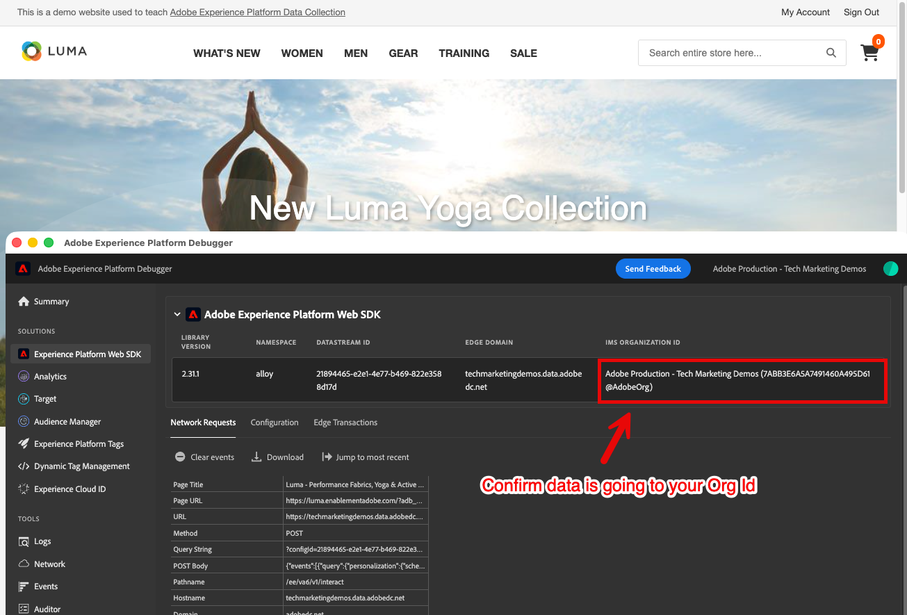
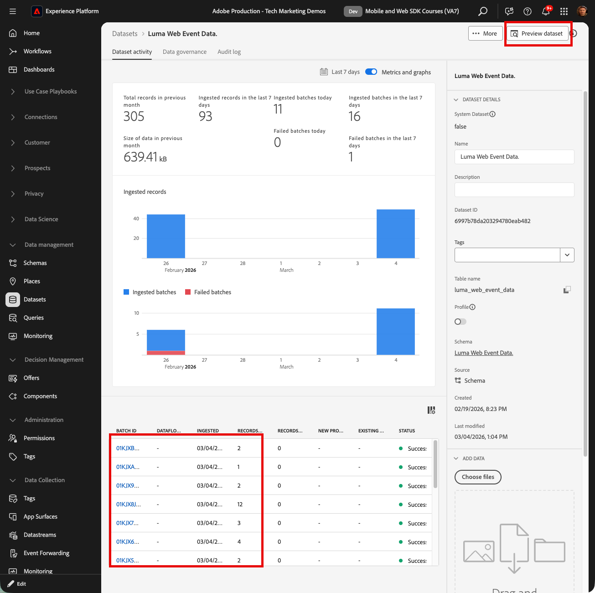

# Streamen von Daten an Experience Platform mit Web SDK

Erfahren Sie, wie Sie Webdaten mit Platform Web SDK an Adobe Experience Platform streamen.

Experience Platform ist das Rückgrat aller neuen Experience Cloud-Programme wie Adobe Real-Time Customer Data Platform, Adobe Customer Journey Analytics und Adobe Journey Optimizer. Diese Programme sind für die Verwendung von Platform Web SDK als optimale Methode zur Web-Datenerfassung konzipiert.

Experience Platform verwendet dasselbe XDM-Schema, das Sie zuvor erstellt haben, um Ereignisdaten von der Luma-Website zu erfassen. Wenn diese Daten an Platform Edge Network gesendet werden, kann die Datenstromkonfiguration sie an Experience Platform weiterleiten.

## Lernziele

Am Ende dieser Lektion können Sie:

* Erstellen eines Datensatzes in Adobe Experience Platform
* Konfigurieren des Datenstroms zum Senden von Web SDK-Daten an Adobe Experience Platform
* Streaming-Webdaten für Echtzeit-Kundenprofil aktivieren
* Überprüfen Sie, ob die Daten sowohl im Platform-Datensatz als auch im Echtzeit-Kundenprofil gespeichert sind
* Nehmen Sie Beispieldaten von Treueprogrammen in Platform auf
* Erstellen einer einfachen Platform-Zielgruppe

## Voraussetzungen

Um diese Lektion abzuschließen, müssen Sie zunächst:

* Zugriff auf ein Adobe Experience Platform-Programm wie Real-Time Customer Data Platform, Journey Optimizer oder Customer Journey Analytics
* Die vorherigen Lektionen in den Abschnitten Erstkonfiguration und Tags-Konfiguration dieses Tutorials absolvieren.

>[!NOTE]
>
>Wenn Sie über keine Platform-Programme verfügen, können Sie diese Lektion überspringen oder mitlesen.

## Erstellen eines Datensatzes

Alle Daten, die erfolgreich in Adobe Experience Platform aufgenommen werden, bleiben als Datensätze im Data Lake erhalten. Ein [Datensatz](https://experienceleague.adobe.com/de/docs/experience-platform/catalog/datasets/overview) ist ein Konstrukt zur Speicherung und Verwaltung von Daten, normalerweise eine Tabelle, die ein Schema (Spalten) und Felder (Zeilen) enthält. Datensätze enthalten auch Metadaten, die verschiedene Aspekte der in ihnen gespeicherten Daten beschreiben.

Richten wir einen Datensatz für Ihre Luma-Web-Ereignisdaten ein:

1. Wechseln Sie zur Benutzeroberfläche von [Experience Platform](https://experience.adobe.com/platform/) oder [Journey Optimizer](https://experience.adobe.com/journey-optimizer/).
1. Bestätigen Sie, dass Sie sich in der Entwicklungs-Sandbox befinden, die Sie für dieses Tutorial verwenden
1. Öffnen Sie **[!UICONTROL Daten-Management > Datensätze]** über die linke Navigation
1. Wählen Sie **[!UICONTROL Datensatz erstellen]**

   

1. Wählen Sie die **[!UICONTROL Datensatz aus Schema erstellen]** aus

   

1. Wählen Sie das in der `Luma Web Event Data` Lektion erstellte [&#x200B; Schema &#x200B;](configure-schemas.md) und klicken Sie dann auf **[!UICONTROL Weiter]**

   

1. Geben Sie einen **[!UICONTROL Namen]** und optional **[!UICONTROL Beschreibung]** für den Datensatz an. Verwenden Sie für diese Übung `Luma Web Event Data` und wählen Sie dann **[!UICONTROL Beenden]**

   

Ein Datensatz ist jetzt so konfiguriert, dass er mit der Erfassung von Daten aus Ihrer Platform Web SDK-Implementierung beginnt.

## Konfigurieren des Datenstroms

Jetzt können Sie Ihren [!UICONTROL Datenstrom) so konfigurieren] dass Daten an [!UICONTROL Adobe Experience Platform gesendet &#x200B;]. Der Datenstrom ist die Verknüpfung zwischen Ihrer Tag-Eigenschaft, der Platform Edge Network und dem Experience Platform-Datensatz.

1. Öffnen Sie die [Datenerfassung](https://experience.adobe.com/#/data-collection){target="blank"}.
1. Wählen **[!UICONTROL Datenströme]** in der linken Navigationsleiste aus
1. Öffnen Sie den Datenstrom, den Sie in der Lektion [Konfigurieren eines Datenstroms](configure-datastream.md) erstellt haben `Luma Web SDK: Development Environment`

   

1. Wählen Sie **[!UICONTROL Service hinzufügen]**
   
1. Wählen Sie **[!UICONTROL Adobe Experience Platform]** als **[!UICONTROL Service]**
1. Wählen Sie **[!UICONTROL Aktiviert]** aus
1. Wählen Sie `Luma Web Event Data` als **[!UICONTROL Ereignisdatensatz]**

1. Wählen Sie **[!UICONTROL Speichern]**

   

Wenn Sie Traffic auf der [Demo-Website von Luma](https://luma.enablementadobe.com) generieren, der Ihrer Tag-Eigenschaft zugeordnet ist, werden die Daten in den Datensatz in Experience Platform eingefügt!

## Validieren des Datensatzes

Dieser Schritt ist wichtig, um sicherzustellen, dass die Daten im Datensatz gelandet sind. Es gibt mehrere Möglichkeiten, den Pfad von Daten zu überprüfen, die an den Datensatz gesendet werden.

* Validieren mit dem [!UICONTROL Experience Platform Debugger]
* Validieren mit [!UICONTROL Experience Platform Assurance]
* Validieren mit [!UICONTROL Vorschau des Datensatzes]
* Validieren mit [!UICONTROL Query Service]

### Debugger

Diese Schritte sind mehr oder weniger die gleichen wie in der [Debugger-Lektion](validate-with-debugger.md). Da Daten jedoch erst dann an Platform gesendet werden, nachdem Sie sie im Datenstrom aktiviert haben, müssen Sie weitere Beispieldaten generieren:

1. Öffnen Sie die [Demo-Website von Luma](https://luma.enablementadobe.com) und wählen Sie das Erweiterungssymbol [!UICONTROL Experience Platform Debugger] aus

1. Konfigurieren Sie den Debugger, um die Tag-Eigenschaft *Entwicklungsumgebung zuzuordnen* wie in der Lektion [Mit Debugger validieren](validate-with-debugger.md) beschrieben

   

1. Durchsuchen Sie die Website. Einige Produkte anzeigen und einige zum Warenkorb hinzufügen

1. Öffnen Sie im Debugger die Zeile „Ereignisse“, um nach einigen Ihrer XDM-Variablen zu suchen

Sie haben bestätigt, dass die Daten den Browser verlassen und an den Datenstrom gesendet haben!

### Assurance

Da wir jetzt einen Service im Datenstrom aktiviert haben, können wir in Assurance noch mehr sehen:

1. Öffnen Sie eine Assurance-Sitzung oder beginnen Sie eine neue
1. Öffnen Sie das **[!UICONTROL Datenstrom]**-Ereignis
1. Hier können Sie die Konfiguration des Platform-Service anzeigen, einschließlich der ID des Datenstroms, den Sie zuvor in dieser Lektion erstellt haben.

   

1. Öffnen Sie das **[!UICONTROL generisch]**-Ereignis, das zum Anbieter **[!UICONTROL com.adobe.streaming.validation]** gehört. Dies zeigt, dass die Anfrage mit den zugehörigen XDM-Daten an den Datensatz gesendet wurde

   

Sie haben bestätigt, dass die Anfrage von Platform Edge Network empfangen und an den Platform-Datensatz weitergeleitet wurde.

### Vorschau des Datensatzes

Schauen wir uns den Datensatz an! Eine schnelle Option besteht darin, die Funktion **[!UICONTROL Datensatz in der Vorschau anzeigen]** zu verwenden. Web SDK-Daten werden in Mikro-Batches mit dem Data Lake verknüpft und in der Platform-Oberfläche regelmäßig aktualisiert. Es kann 10-15 Minuten dauern, bis die von Ihnen generierten Daten angezeigt werden.

1. Wählen Sie in der [&#x200B; von &#x200B;](https://experience.adobe.com/platform/)Experience Platform **[!UICONTROL im linken]** die Option Daten-Management > Datensätze aus, um das Dashboard **[!UICONTROL Datensätze]** zu öffnen.

   Das Dashboard listet alle verfügbaren Datensätze für Ihre Organisation auf. Zu jedem aufgelisteten Datensatz werden Details angezeigt, einschließlich seines Namens, des Schemas, dem der Datensatz entspricht, und des Status des letzten Aufnahmelaufs.

1. Wählen Sie Ihren `Luma Web Event Data` Datensatz aus, um den Bildschirm **[!UICONTROL Datensatzaktivität]** zu öffnen.

   

   Der Aktivitätsbildschirm enthält ein Diagramm, das die Rate der konsumierten Nachrichten sowie eine Liste erfolgreicher und fehlgeschlagener Batches visualisiert.
1. Da es sich um einen neuen Datensatz handelt, ist das ein positives Zeichen, wenn auch nur ein Batch mit aufgenommenen Datensätzen angezeigt wird:

1. Wählen Sie **[!UICONTROL Bildschirm Datensatzaktivität]** rechts oben **[!UICONTROL Bildschirm die Option Vorschau des Datensatzes]** aus, um eine Vorschau von bis zu 100 Datenzeilen anzuzeigen. Wenn der Datensatz leer ist, wird der Vorschau-Link deaktiviert.

   

1. Es wird eine Abfrage ausgeführt, um 100 aktuelle Datenzeilen aus Ihrem Datensatz abzurufen. Sie können einzelne XDM-Felder aufschlüsseln, z. B. web.webPageDetails.name:

   

### Daten abfragen

Sie können auch benutzerdefinierte Abfragen der Daten ausführen, um die Datenaufnahme zu validieren:

1. Wählen Sie in der [&#x200B; von &#x200B;](https://experience.adobe.com/platform/)Experience Platform **[!UICONTROL im linken Navigationsbereich die Option Daten-Management > Abfragen]** aus, um den Bildschirm **[!UICONTROL Abfragen]** zu öffnen.
1. Wählen Sie **[!UICONTROL Abfrage erstellen]**
1. Führen Sie zunächst eine Abfrage aus, um alle Namen der Tabellen im Data Lake anzuzeigen. Geben Sie `SHOW TABLES` im Abfrage-Editor ein und klicken Sie auf das Wiedergabesymbol, um die Abfrage auszuführen.
1. Beachten Sie in den Ergebnissen, wie der Tabellenname `luma_web_event_data` ist
1. Fragen Sie nun die Tabelle mit einer einfachen Abfrage ab, die auf Ihre Tabelle verweist (beachten Sie, dass die Abfrage standardmäßig auf 100 Ergebnisse beschränkt ist): `SELECT * FROM "luma_web_event_data"`
1. Nach einigen Augenblicken sollten Sie Beispieldatensätze Ihrer Web-Daten sehen.

   

>[!ERROR]
>
>Wenn der Fehler „Tabelle nicht bereitgestellt“ angezeigt wird, überprüfen Sie den Namen Ihrer Tabelle. Es könnte auch sein, dass der Mikro-Batch von Daten noch nicht im Data Lake gelandet ist. Versuchen Sie es in 10-15 Minuten erneut.

>[!INFO]
>
>  Query Service ist ein sehr leistungsstarkes Tool für Dateningenieure und Analysten. Weitere Informationen zum Abfrage-Service von Adobe Experience Platform finden Sie unter [Erkunden von Daten](https://experienceleague.adobe.com/de/docs/platform-learn/tutorials/queries/explore-data) im Abschnitt Platform-Tutorials .

>[!NOTE]
>
>Vielen Dank, dass Sie sich Zeit genommen haben, um mehr über Adobe Experience Platform Web SDK zu erfahren. Wenn Sie Fragen haben, allgemeines Feedback geben möchten oder Vorschläge für zukünftige Inhalte haben, teilen Sie diese bitte auf diesem [Experience League Community-Diskussionsbeitrag](https://experienceleaguecommunities.adobe.com/adobe-experience-platform-18/tutorial-discussion-implement-adobe-experience-cloud-with-web-sdk-tutorial-248848?profile.language=de)
