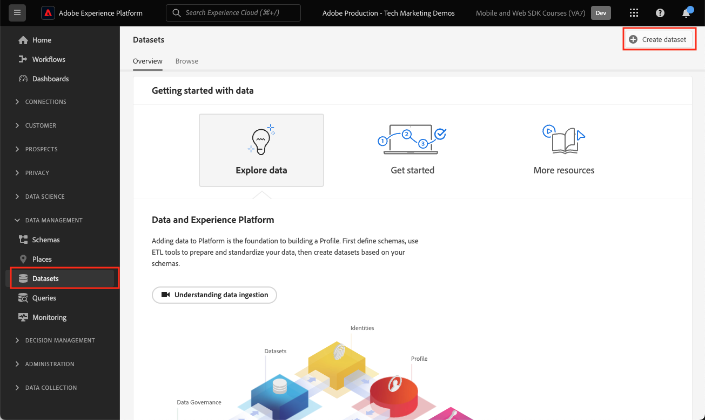
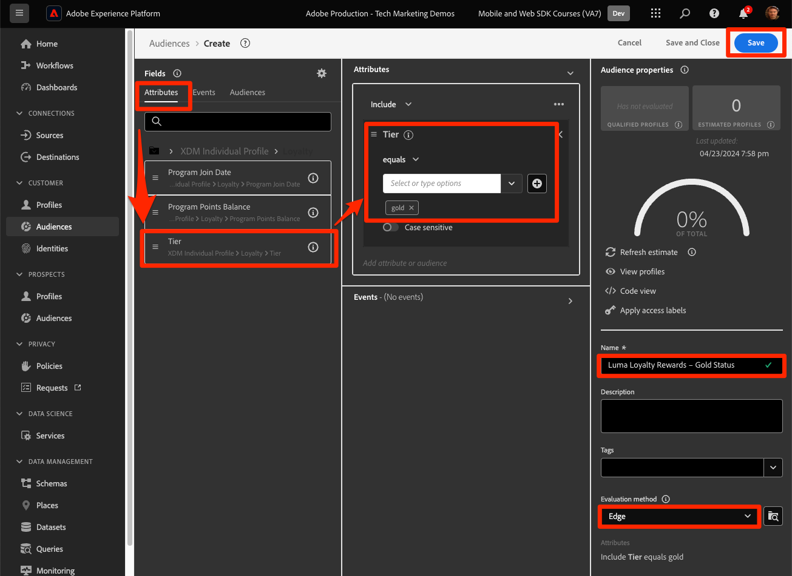

# Streamen von Daten an Experience Platform mit dem Web SDK

Erfahren Sie, wie Sie Webdaten mit Platform Web SDK an Adobe Experience Platform streamen.

Experience Platform ist das Rückgrat aller neuen Experience Cloud-Applikationen wie Adobe Real-time Customer Data Platform, Adobe Customer Journey Analytics und Adobe Journey Optimizer. Diese Anwendungen sind so konzipiert, dass sie das Platform Web SDK als optimale Methode zur Webdatenerfassung verwenden.

Experience Platform verwendet dasselbe XDM-Schema, das Sie zuvor erstellt haben, um Ereignisdaten von der Luma-Website zu erfassen. Wenn diese Daten an Platform Edge Network gesendet werden, kann die Datastream-Konfiguration sie an Experience Platform weiterleiten.

## Lernziele

Am Ende dieser Lektion können Sie:

* Datensatz in Adobe Experience Platform erstellen
* Konfigurieren des Datenspeichers zum Senden von Web SDK-Daten an Adobe Experience Platform
* Streaming-Webdaten für Echtzeit-Kundenprofil aktivieren
* Überprüfen, ob die Daten sowohl im Platform-Datensatz als auch im Echtzeit-Kundenprofil gelandet sind
* Aufnehmen von Beispieldaten zum Treueprogramm in Platform
* Einfache Platform-Audience erstellen

## Voraussetzungen

Um diese Lektion abzuschließen, müssen Sie zunächst:

* Zugriff auf eine Adobe Experience Platform-Anwendung wie Real-time Customer Data Platform, Journey Optimizer oder Customer Journey Analytics
* Schließen Sie die früheren Lektionen in den Abschnitten Erstkonfiguration und Tags-Konfiguration dieses Tutorials ab.

>[!NOTE]
>
>Wenn Sie keine Platform-Anwendungen haben, können Sie diese Lektion überspringen oder lesen.

## Erstellen eines Datensatzes

Alle Daten, die erfolgreich in Adobe Experience Platform aufgenommen wurden, werden im Data Lake als Datensätze persistiert. A [Datensatz](https://experienceleague.adobe.com/de/docs/experience-platform/catalog/datasets/overview) ist ein Speicher- und Verwaltungskonstrukt für eine Datenerfassung, normalerweise eine Tabelle, die ein Schema (Spalten) und Felder (Zeilen) enthält. Datensätze enthalten auch Metadaten, die verschiedene Aspekte der in ihnen gespeicherten Daten beschreiben.

Richten wir einen Datensatz für Ihre Luma-Web-Ereignisdaten ein:

1. Navigieren Sie zu [Experience Platform](https://experience.adobe.com/platform/) oder [Journey Optimizer](https://experience.adobe.com/journey-optimizer/) Benutzeroberfläche
1. Bestätigen, dass Sie sich in der Entwicklungs-Sandbox befinden, die Sie für dieses Tutorial verwenden
1. Öffnen **[!UICONTROL Datenverwaltung > Datensätze]** über die linke Navigation
1. Auswählen **[!UICONTROL Datensatz erstellen]**

   

1. Wählen Sie die **[!UICONTROL Datensatz aus Schema erstellen]** option

   

1. Wählen Sie die `Luma Web Event Data` Schema, das im [frühere Lektion](configure-schemas.md) und wählen Sie **[!UICONTROL Nächste]**

   

1. Stellen Sie eine **[!UICONTROL Name]** und optional **[!UICONTROL Beschreibung]** für den Datensatz. Verwenden Sie für diese Übung `Luma Web Event Data`, wählen Sie **[!UICONTROL Beenden]**

   

Ein Datensatz ist jetzt so konfiguriert, dass Daten aus Ihrer Platform Web SDK-Implementierung erfasst werden.

## Konfigurieren des Datenspeichers

Jetzt können Sie Ihre [!UICONTROL datastream] zum Senden von Daten an [!UICONTROL Adobe Experience Platform]. Der Datastream ist die Verknüpfung zwischen Ihrer Tag-Eigenschaft, dem Platform-Edge Network und dem Experience Platform-Datensatz.

1. Öffnen Sie die [Datenerfassung](https://experience.adobe.com/#/data-collection){target="blank"} Benutzeroberfläche
1. Auswählen **[!UICONTROL Datenspeicher]** über die linke Navigation
1. Öffnen Sie den von Ihnen im Abschnitt [Konfigurieren eines Datenspeichers](configure-datastream.md) Lektion, `Luma Web SDK`

   

1. Auswählen **[!UICONTROL Dienst hinzufügen]**
   
1. Auswählen **[!UICONTROL Adobe Experience Platform]** als **[!UICONTROL Dienst]**
1. Auswählen `Luma Web Event Data` als **[!UICONTROL Ereignis-Datensatz]**

1. Wählen Sie **[!UICONTROL Speichern]** aus.

   

Beim Generieren des Traffics auf [Demosite &quot;Luma&quot;](https://luma.enablementadobe.com/content/luma/us/en.html) Ihrer Tag-Eigenschaft zugeordnet sind, füllen die Daten den Datensatz in Experience Platform aus!

## Datensatz validieren

Dieser Schritt ist wichtig, um sicherzustellen, dass die Daten im Datensatz gelandet sind. Es gibt zwei Aspekte bei der Validierung von Daten, die an den Datensatz gesendet werden.

* Validieren mit [!UICONTROL Experience Platform Debugger]
* Validieren mit [!UICONTROL Vorschau eines Datensatzes anzeigen]
* Validieren mit [!UICONTROL Query Service]

### Experience Platform Debugger

Diese Schritte entsprechen mehr oder weniger den Schritten in der [Debugger-Lektion](validate-with-debugger.md). Da Daten jedoch erst nach der Aktivierung im Datastream an Platform gesendet werden, müssen Sie weitere Beispieldaten generieren:

1. Öffnen Sie die [Demosite &quot;Luma&quot;](https://luma.enablementadobe.com/content/luma/us/en.html) und wählen Sie die [!UICONTROL Experience Platform Debugger] Erweiterungssymbol

1. Konfigurieren des Debuggers für die Zuordnung der Tag-Eigenschaft zu *Ihre* Entwicklungsumgebung, wie im Abschnitt [Validieren mit Debugger](validate-with-debugger.md) Lektion

   

1. Melden Sie auf der Site „Luma“ sich mit den folgenden Anmeldeinformationen an: `test@adobe.com`/`test`

1. Kehren Sie zur [Startseite „Luma“](https://luma.enablementadobe.com/content/luma/us/en.html) zurück.

1. Wählen Sie im vom Debugger angezeigten Platform Web SDK-Netzwerk-Beacon die Zeile &quot;Ereignisse&quot;aus, um Details in einem Popup-Fenster zu erweitern.

   

1. Suchen Sie im Popup nach der &quot;identityMap&quot;. Hier sollten Sie lumaCrmId mit drei Schlüsseln von authenticatedState, id und primary sehen.
   

Jetzt sollten Daten in die `Luma Web Event Data` Datensatz und bereit für die Validierung des Datensatzes in der Vorschau.

### Vorschau des Datensatzes anzeigen

Um zu bestätigen, dass die Daten im Data Lake von Platform gelandet sind, können Sie schnell mithilfe der **[!UICONTROL Datensatz-Vorschau]** Funktion. Web SDK-Daten werden in Mikro-Batches an den Data Lake gesendet und in der Platform-Oberfläche regelmäßig aktualisiert. Es kann 10-15 Minuten dauern, bis die von Ihnen generierten Daten angezeigt werden.

1. Im [Experience Platform](https://experience.adobe.com/platform/) Benutzeroberfläche, wählen Sie **[!UICONTROL Datenverwaltung > Datensätze]** im linken Navigationsbereich, um die **[!UICONTROL Datensätze]** Dashboard.

   Das Dashboard listet alle verfügbaren Datensätze für Ihre Organisation auf. Zu jedem aufgelisteten Datensatz werden Details angezeigt, einschließlich seines Namens, des Schemas, dem der Datensatz entspricht, und des Status des letzten Erfassungslaufs.

1. Wählen Sie `Luma Web Event Data` Datensatz, um seine **[!UICONTROL Datensatzaktivität]** angezeigt.

   

   Der Aktivitätsbildschirm enthält ein Diagramm, das die Rate der konsumierten Nachrichten sowie eine Liste erfolgreicher und fehlgeschlagener Batches visualisiert.

1. Aus dem **[!UICONTROL Datensatzaktivität]** Bildschirm, auswählen **[!UICONTROL Datensatz-Vorschau]** in der oberen rechten Ecke des Bildschirms eine Vorschau von bis zu 100 Datenzeilen anzeigen. Wenn der Datensatz leer ist, wird der Vorschau-Link deaktiviert.

   

   Im Vorschaufenster wird rechts für den Datensatz die hierarchische Ansicht des Schemas angezeigt.

   

### Abfragen der Daten

1. Im [Experience Platform](https://experience.adobe.com/platform/) Benutzeroberfläche, wählen Sie **[!UICONTROL Datenverwaltung > Abfragen]** im linken Navigationsbereich, um die **[!UICONTROL Abfragen]** angezeigt.
1. Auswählen **[!UICONTROL Abfrage erstellen]**
1. Führen Sie zunächst eine Abfrage aus, um alle Namen der Tabellen im Data Lake anzuzeigen. Eingabe `SHOW TABLES` Klicken Sie im Abfrageeditor auf das Wiedergabesymbol, um die Abfrage auszuführen.
1. Beachten Sie in den Ergebnissen, wie der Name der Tabelle ungefähr `luma_web_event_data`
1. Abfragen Sie nun die Tabelle mit einer einfachen Abfrage, die auf Ihre Tabelle verweist (beachten Sie, dass die Abfrage standardmäßig auf 100 Ergebnisse begrenzt ist): `SELECT * FROM "luma_web_event_data"`
1. Nach einigen Augenblicken sollten Sie Beispieldatensätze Ihrer Web-Daten sehen.

>[!ERROR]
>
>Wenn die Fehlermeldung &quot;Tabelle nicht bereitgestellt&quot;angezeigt wird, überprüfen Sie den Namen Ihrer Tabelle. Es könnte auch sein, dass die Mikrostapel von Daten noch nicht im Data Lake gelandet ist. Versuchen Sie es in 10-15 Minuten erneut.

>[!INFO]
>
>  Weitere Informationen zum Abfragedienst von Adobe Experience Platform finden Sie unter [Daten durchsuchen](https://experienceleague.adobe.com/en/docs/platform-learn/tutorials/queries/explore-data) im Abschnitt Platform-Tutorials .

## Datensatz und Schema für Echtzeit-Kundenprofil aktivieren

Für Kunden von Real-time Customer Data Platform und Journey Optimizer besteht der nächste Schritt darin, den Datensatz und das Schema für das Echtzeit-Kundenprofil zu aktivieren. Das Daten-Streaming vom Web SDK ist eine von vielen Datenquellen, die in Platform fließen. Sie möchten Ihre Web-Daten mit anderen Datenquellen verbinden, um 360-Grad-Kundenprofile zu erstellen. Weitere Informationen zum Echtzeit-Kundenprofil finden Sie in diesem kurzen Video:

>[!VIDEO](https://video.tv.adobe.com/v/27251?learn=on&captions=eng)

>[!CAUTION]
>
>Wenn Sie mit Ihrer eigenen Website und Ihren eigenen Daten arbeiten, empfehlen wir eine zuverlässigere Validierung der Daten, bevor Sie sie für das Echtzeit-Kundenprofil aktivieren.

**So aktivieren Sie den Datensatz:**

1. Öffnen Sie den von Ihnen erstellten Datensatz, `Luma Web Event Data`

1. Wählen Sie die **[!UICONTROL Profil-Umschalter]** zum Aktivieren

   

1. Bestätigen, dass Sie **[!UICONTROL Aktivieren]** den Datensatz

   

**So aktivieren Sie das Schema:**

1. Öffnen Sie das von Ihnen erstellte Schema, `Luma Web Event Data`

1. Wählen Sie die **[!UICONTROL Profil-Umschalter]** zum Aktivieren

   

1. Auswählen **[!UICONTROL Daten für dieses Schema enthalten eine primäre Identität im Feld identityMap .]**

   >[!IMPORTANT]
   >
   >    Primäre Identitäten sind in jedem Datensatz erforderlich, der an das Echtzeit-Kundenprofil gesendet wird. Normalerweise werden Identitätsfelder innerhalb des Schemas beschriftet. Bei der Verwendung von Identitätszuordnungen sind die Identitätsfelder jedoch nicht im Schema sichtbar. In diesem Dialogfeld wird bestätigt, dass Sie eine primäre Identität im Hinterkopf haben und diese beim Senden Ihrer Daten in einer Identitätszuordnung angeben. Wie Sie wissen, verwendet das Web SDK eine Identitätszuordnung mit der Experience Cloud ID (ECID) als primäre Standardidentität und einer authentifizierten ID als primäre Identität, sofern verfügbar.

1. Auswählen **[!UICONTROL Aktivieren]**

   

1. Auswählen **[!UICONTROL Speichern]** Speichern des aktualisierten Schemas

Jetzt ist das Schema auch für das Profil aktiviert.

>[!IMPORTANT]
>
>    Nachdem ein Schema für Profil aktiviert wurde, kann es nicht mehr deaktiviert oder gelöscht werden, ohne die gesamte Sandbox zurückzusetzen oder zu löschen. Außerdem können Felder nach diesem Punkt nicht mehr aus dem Schema entfernt werden.
>
>   
> Wir empfehlen, beim Arbeiten mit Ihren eigenen Daten die folgenden Schritte auszuführen:
> 
> * Erfassen Sie zunächst einige Daten in Ihren Datensätzen.
> * Beheben Sie alle Probleme, die während des Datenerfassungsprozesses auftreten (z. B. bei der Datenvalidierung oder bei der Zuordnung).
> * Datensätze und Schemata für Profile aktivieren
> * Erfassen Sie die Daten bei Bedarf neu.

### Profil überprüfen

Sie können in der Benutzeroberfläche von Platform (oder Journey Optimizer) nach einem Kundenprofil suchen, um zu bestätigen, dass die Daten im Echtzeit-Kundenprofil gelandet sind. Wie der Name schon sagt, werden Profile in Echtzeit ausgefüllt, sodass es keine Verzögerung gibt, wie es bei der Validierung von Daten im Datensatz der Fall war.

Zunächst müssen Sie weitere Beispieldaten generieren. Wiederholen Sie die Schritte aus dieser Lektion, um sich bei der Website Luma anzumelden, wenn sie Ihrer Tag-Eigenschaft zugeordnet ist. Inspect die Platform Web SDK-Anforderung, um sicherzustellen, dass Daten mit dem `lumaCRMId`.

1. Im [Experience Platform](https://experience.adobe.com/platform/) Benutzeroberfläche, wählen Sie **[!UICONTROL Kunde]** > **[!UICONTROL Profile]** im linken Navigationsbereich

1. Als **[!UICONTROL Identitäts-Namespace]** use `lumaCRMId`
1. Kopieren und Einfügen des Werts des `lumaCRMId` den Aufruf übergeben, den Sie im Experience Platform Debugger überprüft haben, in diesem Fall `112ca06ed53d3db37e4cea49cc45b71e`.

   

1. Wenn im Profil ein gültiger Wert für `lumaCRMId`, wird in der Konsole eine Profil-ID eingetragen:

   

1. So zeigen Sie die vollständige **[!UICONTROL Kundenprofil]** Wählen Sie für jede ID die **[!UICONTROL Profil-ID]** im Hauptfenster.

   >[!NOTE]
   >
   >Beachten Sie, dass Sie den Hyperlink der Profil-ID auswählen können. Wenn Sie die Zeile auswählen, wird ein rechtes Menü geöffnet, in dem Sie den Profil-ID-Hyperlink auswählen können.
   > 

   Hier können Sie alle Identitäten sehen, die mit dem `lumaCRMId`, beispielsweise die `ECID`.

   

Sie haben jetzt das Platform Web SDK für Experience Platform (und Real-Time CDP) aktiviert! Und Journey Optimizer! Und Customer Journey Analytics!).

### Erstellen eines Loyalitätsschemas und Erfassen von Beispieldaten

Der Abschluss dieser Übung wird für Kunden von Real-time Customer Data Platform und Journey Optimizer erwartet.

Wenn Web SDK-Daten in Adobe Experience Platform erfasst werden, können sie durch andere Datenquellen angereichert werden, die Sie in Platform erfasst haben. Wenn sich ein Benutzer beispielsweise bei der Site &quot;Luma&quot;anmeldet, wird ein Identitätsdiagramm in Experience Platform erstellt und alle anderen profilaktivierten Datensätze können möglicherweise zusammengeführt werden, um Echtzeit-Kundenprofile zu erstellen. Um dies in Aktion zu sehen, erstellen Sie schnell einen weiteren Datensatz in Adobe Experience Platform mit Beispielloyalitätsdaten, damit Sie Echtzeit-Kundenprofile mit Real-time Customer Data Platform und Journey Optimizer verwenden können. Da Sie bereits ähnliche Übungen durchgeführt haben, werden die Anweisungen kurz sein.

Erstellen Sie das Treueschema:

1. Erstellen eines neuen Schemas
1. Auswählen **[!UICONTROL Individuelles Profil]** als [!UICONTROL Basisklasse]
1. Benennen Sie das Schema. `Luma Loyalty Schema`
1. Fügen Sie die [!UICONTROL Treuedetails] Feldergruppe
1. Fügen Sie die [!UICONTROL Demografische Details] Feldergruppe
1. Wählen Sie die `Person ID` und markieren Sie es als [!UICONTROL Identität] und [!UICONTROL Primäre Identität] mithilfe der `Luma CRM Id` [!UICONTROL Identitäts-Namespace].
1. Aktivieren des Schemas für [!UICONTROL Profil]. Wenn Sie den Profil -Umschalter nicht finden, klicken Sie oben links auf den Schemanamen.
1. Schema speichern

   

So erstellen Sie den Datensatz und erfassen die Beispieldaten:

1. Erstellen Sie einen neuen Datensatz aus der `Luma Loyalty Schema`
1. Benennen Sie den Datensatz. `Luma Loyalty Dataset`
1. Datensatz aktivieren für [!UICONTROL Profil]
1. Beispieldatei herunterladen [luma-loyalty-forWeb.json](assets/luma-loyalty-forWeb.json)
1. Ziehen Sie die Datei per Drag-and-Drop in Ihren Datensatz
1. Überprüfen Sie, ob die Daten erfolgreich erfasst wurden.

   

### Erstellen einer Zielgruppe

Zielgruppen gruppieren Profile um allgemeine Eigenschaften. Erstellen Sie eine schnelle Zielgruppe, die Sie in Ihrer Web-Kampagne verwenden können:

1. Navigieren Sie in der Experience Platform- oder Journey Optimizer-Benutzeroberfläche zu **[!UICONTROL Kunde]** > **[!UICONTROL Zielgruppen]** in der linken Navigation
1. Auswählen **[!UICONTROL Erstellen einer Zielgruppe]**
1. Auswählen **[!UICONTROL Regel erstellen]**
1. Auswählen **[!UICONTROL Erstellen]**

   

1. Auswählen **[!UICONTROL Attribute]**
1. Suchen Sie die **[!UICONTROL Treue]** > **[!UICONTROL Ebene]** und ziehen Sie es auf das **[!UICONTROL Attribute]** Abschnitt
1. Definieren Sie die Zielgruppe als Benutzer, deren `tier` is `gold`
1. Benennen der Zielgruppe `Luma Loyalty Rewards – Gold Status`
1. Auswählen **[!UICONTROL Edge]** als **[!UICONTROL Auswertungsmethode]**
1. Auswählen **[!UICONTROL Speichern]**

   

Da es sich um eine sehr einfache Zielgruppe handelt, können wir die Edge-Auswertungsmethode verwenden. Edge-Zielgruppen werden am Edge-Rand ausgewertet. In der gleichen Anfrage des Web SDK an Platform Edge Network können wir die Zielgruppendefinition auswerten und sofort bestätigen, ob sich der Benutzer qualifiziert.

[Weiter: ](setup-analytics.md)

>[!NOTE]
>
>Vielen Dank, dass Sie Ihre Zeit investiert haben, um mehr über das Adobe Experience Platform Web SDK zu erfahren. Wenn Sie Fragen haben, ein allgemeines Feedback teilen möchten oder Vorschläge zu künftigen Inhalten haben, teilen Sie diese bitte mit. [Experience League Community-Diskussionsbeitrag](https://experienceleaguecommunities.adobe.com/t5/adobe-experience-platform-data/tutorial-discussion-implement-adobe-experience-cloud-with-web/td-p/444996)
