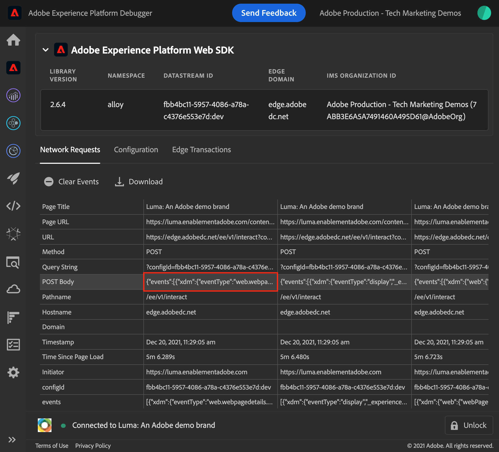
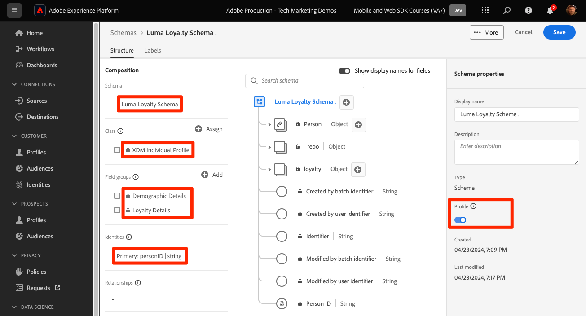

# Streamen von Daten auf Experience Platform mit Web SDK

Erfahren Sie, wie Sie Webdaten mit Platform Web SDK an Adobe Experience Platform streamen.

Experience Platform ist das Rückgrat aller neuen Experience Cloud-Anwendungen wie Adobe Real-time Customer Data Platform, Adobe Customer Journey Analytics und Adobe Journey Optimizer. Diese Programme sind für die Verwendung von Platform Web SDK als optimale Methode zur Web-Datenerfassung konzipiert.

Experience Platform verwendet dasselbe XDM-Schema, das Sie zuvor erstellt haben, um Ereignisdaten von der Luma-Website zu erfassen. Wenn diese Daten an das Platform-Edge Network gesendet werden, kann die Datenstromkonfiguration sie an Experience Platform weiterleiten.

## Lernziele

Am Ende dieser Lektion können Sie:

* Erstellen eines Datensatzes in Adobe Experience Platform
* Konfigurieren des Datenstroms zum Senden von Web SDK-Daten an Adobe Experience Platform
* Streaming-Webdaten für Echtzeit-Kundenprofil aktivieren
* Überprüfen Sie, ob die Daten sowohl im Platform-Datensatz als auch im Echtzeit-Kundenprofil gespeichert sind
* Nehmen Sie Beispieldaten von Treueprogrammen in Platform auf
* Erstellen einer einfachen Platform-Zielgruppe

## Voraussetzungen

Um diese Lektion abzuschließen, müssen Sie zunächst:

* Zugriff auf eine Adobe Experience Platform-Anwendung wie Real-time Customer Data Platform, Journey Optimizer oder Customer Journey Analytics
* Die vorherigen Lektionen in den Abschnitten Erstkonfiguration und Tags-Konfiguration dieses Tutorials absolvieren.

>[!NOTE]
>
>Wenn Sie über keine Platform-Programme verfügen, können Sie diese Lektion überspringen oder mitlesen.

## Erstellen eines Datensatzes

Alle Daten, die erfolgreich in Adobe Experience Platform aufgenommen werden, bleiben als Datensätze im Data Lake erhalten. Ein [Datensatz](https://experienceleague.adobe.com/de/docs/experience-platform/catalog/datasets/overview) ist ein Konstrukt zur Speicherung und Verwaltung von Daten, normalerweise eine Tabelle, die ein Schema (Spalten) und Felder (Zeilen) enthält. Datensätze enthalten auch Metadaten, die verschiedene Aspekte der in ihnen gespeicherten Daten beschreiben.

Richten wir einen Datensatz für Ihre Luma-Web-Ereignisdaten ein:

1. Zur [Experience Platform](https://experience.adobe.com/platform/)- oder [Journey Optimizer](https://experience.adobe.com/journey-optimizer/)-Benutzeroberfläche
1. Bestätigen Sie, dass Sie sich in der Entwicklungs-Sandbox befinden, die Sie für dieses Tutorial verwenden
1. Öffnen Sie **[!UICONTROL Daten-Management > Datensätze]** über die linke Navigation
1. Wählen Sie **[!UICONTROL Datensatz erstellen]**

   

1. Wählen Sie die **[!UICONTROL Datensatz aus Schema erstellen]** aus

   

1. Wählen Sie das in der [ Lektion erstellte `Luma Web Event Data` Schema ](configure-schemas.md) und klicken Sie dann auf **[!UICONTROL Weiter]**

   

1. Geben Sie einen **[!UICONTROL Namen]** und optional **[!UICONTROL Beschreibung]** für den Datensatz an. Verwenden Sie für diese Übung `Luma Web Event Data` und wählen Sie dann **[!UICONTROL Beenden]**

   

Ein Datensatz ist jetzt so konfiguriert, dass er mit der Erfassung von Daten aus Ihrer Platform Web SDK-Implementierung beginnt.

## Konfigurieren des Datenstroms

Jetzt können Sie Ihren [!UICONTROL Datenstrom) so konfigurieren] dass Daten an [!UICONTROL Adobe Experience Platform gesendet &#x200B;]. Der Datenstrom ist die Verknüpfung zwischen Ihrer Tag-Eigenschaft, dem Platform-Edge Network und dem Experience Platform-Datensatz.

1. Öffnen Sie die [Datenerfassung](https://experience.adobe.com/#/data-collection){target="blank"}.
1. Wählen **[!UICONTROL Datenströme]** in der linken Navigationsleiste aus
1. Öffnen Sie den Datenstrom, den Sie in der Lektion [Konfigurieren eines Datenstroms](configure-datastream.md) erstellt haben `Luma Web SDK`

   

1. Wählen Sie **[!UICONTROL Service hinzufügen]**
   
1. Wählen Sie **[!UICONTROL Adobe Experience Platform]** als **[!UICONTROL Service]**
1. Wählen Sie `Luma Web Event Data` als **[!UICONTROL Ereignisdatensatz]**

1. Wählen Sie **[!UICONTROL Speichern]** aus.

   

Wenn Sie Traffic auf der [Demo-Site von Luma](https://luma.enablementadobe.com/content/luma/us/en.html) generieren, der Ihrer Tag-Eigenschaft zugeordnet ist, befüllen die Daten den Datensatz in Experience Platform!

## Validieren des Datensatzes

Dieser Schritt ist wichtig, um sicherzustellen, dass die Daten im Datensatz gelandet sind. Es gibt zwei Aspekte beim Validieren von Daten, die an den Datensatz gesendet werden.

* Validieren mit dem [!UICONTROL Experience Platform-Debugger]
* Validieren mit [!UICONTROL Vorschau des Datensatzes]
* Validieren mit [!UICONTROL Query Service]

### Experience Platform Debugger

Diese Schritte sind mehr oder weniger die gleichen wie in der [Debugger-Lektion](validate-with-debugger.md). Da Daten jedoch erst dann an Platform gesendet werden, nachdem Sie sie im Datenstrom aktiviert haben, müssen Sie weitere Beispieldaten generieren:

1. Öffnen Sie die [Demo-Site von Luma](https://luma.enablementadobe.com/content/luma/us/en.html) und wählen Sie das Erweiterungssymbol [!UICONTROL Experience Platform Debugger] aus

1. Konfigurieren Sie den Debugger, um die Tag-Eigenschaft *Entwicklungsumgebung zuzuordnen* wie in der Lektion [Mit Debugger validieren](validate-with-debugger.md) beschrieben

   

1. Melden Sie auf der Site „Luma“ sich mit den folgenden Anmeldedaten an: `test@adobe.com`/`test`

1. Kehren Sie zur [Startseite „Luma“](https://luma.enablementadobe.com/content/luma/us/en.html) zurück.

1. Wählen Sie in den vom Debugger angezeigten Beacons des Platform Web SDK-Netzwerks die Zeile „Ereignisse“ aus, um die Details in einem Popup zu erweitern

   

1. Suchen Sie im Popup-Fenster nach „identityMap“. Hier sollte lumaCrmId mit drei Schlüsseln, AuthentifiedState, ID und primary, angezeigt werden
   

Jetzt sollten die Daten im `Luma Web Event Data` Datensatz ausgefüllt und für die Validierung des „Datensatzvorschau“ bereit sein.

### Vorschau des Datensatzes

Um zu bestätigen, dass die Daten im Data Lake von Platform gelandet sind, besteht eine schnelle Option darin, die Funktion **[!UICONTROL Datensatz in der Vorschau anzeigen]** zu verwenden. Web SDK-Daten werden in Mikro-Batches mit dem Data Lake verknüpft und in der Platform-Oberfläche regelmäßig aktualisiert. Es kann 10-15 Minuten dauern, bis die von Ihnen generierten Daten angezeigt werden.

1. Wählen Sie in der [&#128279;](https://experience.adobe.com/platform/) Experience Platform **[!UICONTROL im linken Navigationsbereich die Option Daten-Management > Datensätze]** aus, um das Dashboard **[!UICONTROL Datensätze]** zu öffnen.

   Das Dashboard listet alle verfügbaren Datensätze für Ihre Organisation auf. Zu jedem aufgelisteten Datensatz werden Details angezeigt, einschließlich seines Namens, des Schemas, dem der Datensatz entspricht, und des Status des letzten Erfassungslaufs.

1. Wählen Sie Ihren `Luma Web Event Data` Datensatz aus, um den Bildschirm **[!UICONTROL Datensatzaktivität]** zu öffnen.

   

   Der Aktivitätsbildschirm enthält ein Diagramm, das die Rate der konsumierten Nachrichten sowie eine Liste erfolgreicher und fehlgeschlagener Batches visualisiert.

1. Wählen Sie **[!UICONTROL Bildschirm Datensatzaktivität]** rechts oben **[!UICONTROL Bildschirm die Option Vorschau des Datensatzes]** aus, um eine Vorschau von bis zu 100 Datenzeilen anzuzeigen. Wenn der Datensatz leer ist, wird der Vorschau-Link deaktiviert.

   

   Im Vorschaufenster wird rechts für den Datensatz die hierarchische Ansicht des Schemas angezeigt.

   

### Daten abfragen

1. Wählen Sie in der [&#128279;](https://experience.adobe.com/platform/) Experience Platform **[!UICONTROL im linken Navigationsbereich die Option Daten-Management >]** Abfragen) aus, um den Bildschirm **[!UICONTROL Abfragen]** zu öffnen.
1. Wählen Sie **[!UICONTROL Abfrage erstellen]**
1. Führen Sie zunächst eine Abfrage aus, um alle Namen der Tabellen im Data Lake anzuzeigen. Geben Sie `SHOW TABLES` im Abfrage-Editor ein und klicken Sie auf das Wiedergabesymbol, um die Abfrage auszuführen.
1. Beachten Sie in den Ergebnissen, dass der Tabellenname in etwa `luma_web_event_data` lautet
1. Fragen Sie nun die Tabelle mit einer einfachen Abfrage ab, die auf Ihre Tabelle verweist (beachten Sie, dass die Abfrage standardmäßig auf 100 Ergebnisse beschränkt ist): `SELECT * FROM "luma_web_event_data"`
1. Nach einigen Augenblicken sollten Sie Beispieldatensätze Ihrer Web-Daten sehen.

>[!ERROR]
>
>Wenn der Fehler „Tabelle nicht bereitgestellt“ angezeigt wird, überprüfen Sie den Namen Ihrer Tabelle. Es könnte auch sein, dass der Mikro-Batch von Daten noch nicht im Data Lake gelandet ist. Versuchen Sie es in 10-15 Minuten erneut.

>[!INFO]
>
>  Weitere Informationen zum Abfrage-Service von Adobe Experience Platform finden Sie unter [Erkunden von Daten](https://experienceleague.adobe.com/de/docs/platform-learn/tutorials/queries/explore-data) im Abschnitt Platform-Tutorials .

## Aktivieren von Datensatz und Schema für das Echtzeit-Kundenprofil

Für Kunden von Real-time Customer Data Platform und Journey Optimizer besteht der nächste Schritt darin, den Datensatz und das Schema für das Echtzeit-Kundenprofil zu aktivieren. Das Daten-Streaming aus Web SDK ist eine von vielen Datenquellen, die in Platform fließen, und Sie möchten Ihre Web-Daten mit anderen Datenquellen verbinden, um 360-Grad-Kundenprofile zu erstellen. Weitere Informationen zum Echtzeit-Kundenprofil finden Sie in diesem kurzen Video:

>[!VIDEO](https://video.tv.adobe.com/v/31581?learn=on&captions=ger)

>[!CAUTION]
>
>Bei der Arbeit mit Ihrer eigenen Website und Ihren eigenen Daten empfehlen wir eine robustere Validierung von Daten, bevor sie für das Echtzeit-Kundenprofil aktiviert werden.

**So aktivieren Sie den Datensatz:**

1. Öffnen Sie den von Ihnen erstellten Datensatz `Luma Web Event Data`

1. Wählen Sie den **[!UICONTROL Umschalter Profil]** aus, um ihn zu aktivieren

   

1. Bestätigen Sie, dass Sie **[!UICONTROL Datensatz]** möchten

   

**So aktivieren Sie das Schema:**

1. Öffnen Sie das von Ihnen erstellte Schema `Luma Web Event Data`

1. Wählen Sie den **[!UICONTROL Umschalter Profil]** aus, um ihn zu aktivieren

   

1. Wählen Sie **[!UICONTROL Daten für dieses Schema enthalten eine primäre Identität im identityMap -Feld.]**

   >[!IMPORTANT]
   >
   >    Für jeden Datensatz, der an das Echtzeit-Kundenprofil gesendet wird, sind Primäre Identitäten erforderlich. Normalerweise werden Identitätsfelder innerhalb des Schemas beschriftet. Bei Verwendung von Identitätszuordnungen sind die Identitätsfelder jedoch nicht innerhalb des Schemas sichtbar. In diesem Dialogfeld bestätigen Sie, dass Sie eine primäre Identität im Sinn haben und diese beim Senden Ihrer Daten in einer Identitätszuordnung angeben. Wie Sie wissen, verwendet Web SDK eine Identitätszuordnung mit der Experience Cloud-ID (ECID) als standardmäßige primäre Identität und eine authentifizierte ID als primäre Identität, sofern verfügbar.

1. Wählen Sie **[!UICONTROL Aktivieren]** aus

   

1. Wählen Sie **[!UICONTROL Speichern]**, um das aktualisierte Schema zu speichern

Jetzt ist das Schema auch für das Profil aktiviert.

>[!IMPORTANT]
>
>    Nachdem ein Schema für das Profil aktiviert wurde, kann es nicht mehr deaktiviert oder gelöscht werden, ohne dass die gesamte Sandbox zurückgesetzt oder gelöscht wird. Außerdem können nach diesem Punkt keine Felder mehr aus dem Schema entfernt werden.
>
>   
> Bei der Arbeit mit Ihren eigenen Daten empfehlen wir, die Dinge in der folgenden Reihenfolge zu erledigen:
> 
> * Nehmen Sie zunächst einige Daten in Ihre Datensätze auf.
> * Beheben Sie alle Probleme, die während der Datenaufnahme auftreten (z. B. Probleme bei der Datenvalidierung oder -zuordnung).
> * Aktivieren von Datensätzen und Schemata für Profile
> * Nehmen Sie die Daten bei Bedarf erneut auf

### Überprüfen eines Profils

Sie können in der Platform-Benutzeroberfläche (oder der Journey Optimizer-Benutzeroberfläche) nach einem Kundenprofil suchen, um zu bestätigen, dass die Daten im Echtzeit-Kundenprofil gelandet sind. Wie der Name schon sagt, werden Profile in Echtzeit gefüllt, sodass es keine Verzögerung gibt, wie sie bei der Validierung von Daten im Datensatz aufgetreten ist.

Zunächst müssen Sie mehr Beispieldaten generieren. Wiederholen Sie die Schritte oben in dieser Lektion, um sich bei der Luma-Website anzumelden, wenn sie Ihrer Tag-Eigenschaft zugeordnet ist. Inspect stellt die Anforderung von Platform Web SDK bereit, um sicherzustellen, dass Daten mit dem `lumaCRMId` gesendet werden.

1. Wählen Sie in der [&#128279;](https://experience.adobe.com/platform/) Experience Platform **[!UICONTROL im linken Navigationsbereich]** Kunde > **[!UICONTROL Profile]** aus

1. Verwenden Sie `lumaCRMId` als **[!UICONTROL Identity]** Namespace
1. Kopieren Sie den Wert der `lumaCRMId`, die in dem von Ihnen im Experience Platform-Debugger überprüften Aufruf übergeben wurde, und fügen Sie ihn ein, in diesem Fall `112ca06ed53d3db37e4cea49cc45b71e`.

   

1. Wenn im Profil ein gültiger Wert für `lumaCRMId` vorhanden ist, wird in der Konsole eine Profil-ID ausgefüllt:

   

1. Um das vollständige **[!UICONTROL Kundenprofil]** für jede ID anzuzeigen, wählen Sie **[!UICONTROL Profil-ID]** im Hauptfenster aus.

   >[!NOTE]
   >
   >Beachten Sie, dass Sie den Hyperlink der Profil-ID auswählen können. Wenn Sie die Zeile auswählen, wird ein rechtes Menü geöffnet, in dem Sie den Profil-ID-Hyperlink auswählen können
   > 

   Hier können Sie alle mit der `lumaCRMId` verknüpften Identitäten sehen, z. B. die `ECID`.

   

Sie haben jetzt Platform Web SDK für Experience Platform (und Real-Time CDP! Und Journey Optimizer! Und Customer Journey Analytics!).

### Erstellen eines Treueschemas und Aufnehmen von Beispieldaten

Der Abschluss dieser Übung wird für Kunden von Real-time Customer Data Platform und Journey Optimizer erwartet.

Wenn Web SDK-Daten in Adobe Experience Platform aufgenommen werden, können sie durch andere Datenquellen angereichert werden, die Sie in Platform aufgenommen haben. Wenn sich ein Benutzer beispielsweise bei der Luma-Site anmeldet, wird ein Identitätsdiagramm als Experience Platform erstellt und alle anderen profilaktivierten Datensätze können möglicherweise zusammengeführt werden, um Echtzeit-Kundenprofile zu erstellen. Um dies in Aktion zu sehen, erstellen Sie schnell einen anderen Datensatz in Adobe Experience Platform mit einigen Beispiel-Treuedaten, damit Sie Echtzeit-Kundenprofile mit Real-time Customer Data Platform und Journey Optimizer verwenden können. Da Sie bereits ähnliche Übungen durchgeführt haben, werden die Anweisungen kurz sein.

Erstellen Sie das Treueschema:

1. Erstellen eines neuen Schemas
1. Wählen Sie **[!UICONTROL Individuelles Profil]** als [!UICONTROL Basisklasse]
1. Benennen des `Luma Loyalty Schema`
1. Fügen Sie die [!UICONTROL Treuedetails] hinzu
1. Fügen Sie die [!UICONTROL Demografische Details] hinzu
1. Wählen Sie das Feld `Person ID` aus und markieren Sie es als [!UICONTROL Identität] und [!UICONTROL Primäre &#x200B;] mithilfe des `Luma CRM Id`[!UICONTROL Identity-Namespace].
1. Aktivieren Sie das Schema für [!UICONTROL Profil]. Wenn Sie den Umschalter Profil nicht finden können, klicken Sie oben links auf den Schemanamen.
1. Schema speichern

   

So erstellen Sie den Datensatz und nehmen die Beispieldaten auf:

1. Erstellen eines neuen Datensatzes aus dem `Luma Loyalty Schema`
1. Benennen des Datensatzes `Luma Loyalty Dataset`
1. Aktivieren des Datensatzes für [!UICONTROL Profil]
1. Laden Sie die Beispieldatei [luma-loyalty-forWeb.json) ](assets/luma-loyalty-forWeb.json)
1. Ziehen Sie die Datei per Drag-and-Drop in den Datensatz
1. Bestätigen, dass die Daten erfolgreich aufgenommen wurden

   

### Erstellen einer Zielgruppe

Zielgruppen gruppieren Profile anhand gemeinsamer Eigenschaften. Erstellen Sie eine schnelle Audience, die Sie in Ihrer Web-Kampagne verwenden können:

1. Navigieren Sie auf der Experience Platform- oder Journey Optimizer **[!UICONTROL Benutzeroberfläche im linken Navigationsbereich zu]** Kunde > **[!UICONTROL Zielgruppen]** .
1. Wählen Sie **[!UICONTROL Zielgruppe erstellen]**
1. Wählen Sie **[!UICONTROL Regel erstellen]**
1. Wählen Sie **[!UICONTROL Erstellen]**

   

1. Wählen Sie **[!UICONTROL Attribute]**
1. Suchen Sie das Feld **[!UICONTROL Treue]** > **[!UICONTROL Ebene]** und ziehen Sie es in den Abschnitt **[!UICONTROL Attribute]**
1. Zielgruppe als Benutzer definieren, deren `tier` `gold` ist
1. Benennen der `Luma Loyalty Rewards – Gold Status`
1. Wählen Sie **[!UICONTROL Edge]** als **[!UICONTROL Auswertungsmethode]**
1. Wählen Sie **[!UICONTROL Speichern]**

   

Da es sich um eine sehr einfache Zielgruppe handelt, können wir die Edge-Auswertungsmethode verwenden. Edge-Zielgruppen werden am Edge ausgewertet. Daher können wir mit derselben Anfrage, die das Web SDK-to-Platform-Edge Network stellt, die Zielgruppendefinition auswerten und sofort bestätigen, ob der Benutzer sich qualifiziert.

[Weiter: ](setup-analytics.md)

>[!NOTE]
>
>Vielen Dank, dass Sie sich Zeit genommen haben, um mehr über Adobe Experience Platform Web SDK zu erfahren. Wenn Sie Fragen haben, allgemeines Feedback geben möchten oder Vorschläge für zukünftige Inhalte haben, teilen Sie diese bitte auf diesem [Experience League-Community-Diskussionsbeitrag](https://experienceleaguecommunities.adobe.com/t5/adobe-experience-platform-data/tutorial-discussion-implement-adobe-experience-cloud-with-web/td-p/444996?profile.language=de)
