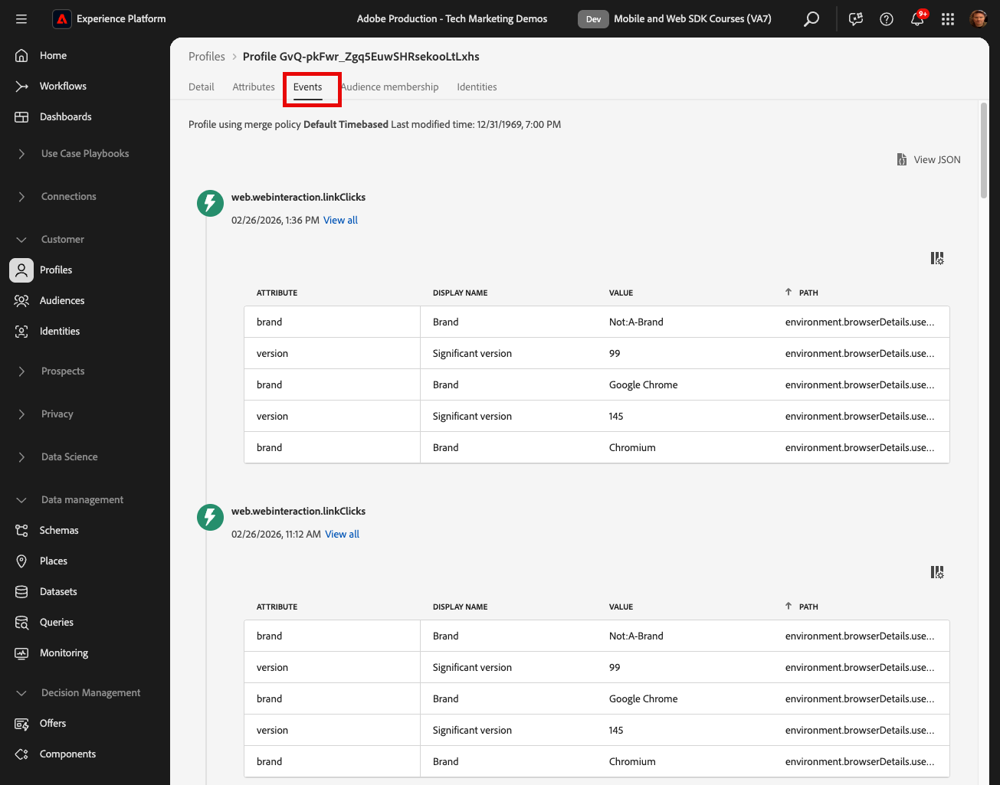
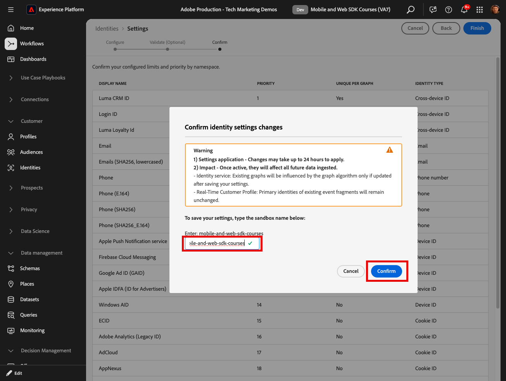

# Echtzeit-Kundenprofile und Edge-Segmentierung

## Aktivieren von Datensatz und Schema für das Echtzeit-Kundenprofil

Für Kunden von Real-Time Customer Data Platform und Journey Optimizer besteht der nächste Schritt darin, den Datensatz und das Schema für das Echtzeit-Kundenprofil zu aktivieren. Das Daten-Streaming aus Web SDK ist eine von vielen Datenquellen, die in Platform fließen, und Sie möchten Ihre Web-Daten mit anderen Datenquellen verbinden, um 360-Grad-Kundenprofile zu erstellen. Weitere Informationen zum Echtzeit-Kundenprofil finden Sie in diesem kurzen Video:

>[!VIDEO](https://video.tv.adobe.com/v/27251?learn=on&captions=eng)

>[!CAUTION]
>
>Bei der Arbeit mit Ihrer eigenen Website und Ihren eigenen Daten empfehlen wir eine robustere Validierung von Daten, bevor sie für das Echtzeit-Kundenprofil aktiviert werden.

### Aktivieren des Schemas

So aktivieren Sie das Schema für das Profil:

1. Öffnen Sie das von Ihnen erstellte Schema `Luma Web Event Data`

1. Wählen Sie den **[!UICONTROL Umschalter Profil]** aus, um ihn zu aktivieren

   

1. Wählen Sie **[!UICONTROL Daten für dieses Schema enthalten eine primäre Identität im identityMap -Feld.]**

1. Wählen Sie **[!UICONTROL Aktivieren]** aus

   

   >[!IMPORTANT]
   >
   >    Für jeden Datensatz, der an das Echtzeit-Kundenprofil gesendet wird, sind Primäre Identitäten erforderlich. Jeder Datensatz wird zu einem „Profilfragment“, und die primären Identitäten sind die Schlüssel zum Nachschlagen dieser Fragmente.
   > 
   > Bei einigen Datentypen werden Identitätsfelder innerhalb des Schemas gekennzeichnet. Bei den von Experience Platform SDKs erfassten Ereignisdaten sind jedoch Identitätszuordnungen typisch, und die Identitätsfelder sind nicht im Schema sichtbar.
   >
   > In diesem Dialogfeld wird bestätigt, dass eine primäre Identität im Sinn hat und dass Sie sie beim Senden Ihrer Daten in einer Identitätszuordnung angeben, mit Regeln zur Verknüpfung von Identitätsdiagrammen konfigurieren oder beides. Wir empfehlen, beides zu tun.
   >
   > Wie Sie wissen, verwendet unsere Luma-Implementierung eine Identitätszuordnung mit der authentifizierten lumaCrmId als primäre Identität, sofern verfügbar, andernfalls wird standardmäßig die Experience Cloud-ID (ECID) verwendet.

1. Wählen Sie **[!UICONTROL Speichern]**, um das aktualisierte Schema zu speichern

Jetzt ist das Schema für das Profil aktiviert.

### Aktivieren des Datensatzes

So aktivieren Sie den Datensatz:

1. Öffnen Sie den von Ihnen erstellten Datensatz `Luma Web Event Data`

1. Wählen Sie den **[!UICONTROL Umschalter Profil]** aus, um ihn zu aktivieren

   

1. Bestätigen Sie, dass Sie **[!UICONTROL Datensatz]** möchten

>[!IMPORTANT]
>
>  Nachdem ein Schema für das Profil aktiviert und Daten in den Datensatz aufgenommen wurden, können sie nicht mehr deaktiviert oder gelöscht werden, ohne die gesamte Sandbox zurückzusetzen oder zu löschen. Außerdem können Felder, die Daten erhalten haben, nach diesem Punkt nicht mehr aus dem Schema entfernt werden.
>
>   
> Bei der Arbeit mit Ihren eigenen Daten empfehlen wir, die Dinge in der folgenden Reihenfolge zu erledigen:
> 
> * Nehmen Sie zunächst einige Daten in Ihre Datensätze auf.
> * Beheben Sie alle Probleme, die während der Datenaufnahme auftreten (z. B. Probleme bei der Datenvalidierung oder -zuordnung).
> * Aktivieren von Datensätzen und Schemata für Profile
> * Nehmen Sie die Daten bei Bedarf erneut auf

### Überprüfen eines Profils

Sie können in der Platform-Benutzeroberfläche (oder der Journey Optimizer-Benutzeroberfläche) nach einem Kundenprofil suchen, um zu bestätigen, dass die Daten im Echtzeit-Kundenprofil gelandet sind. Wie der Name schon sagt, werden Profile in Echtzeit gefüllt, sodass es keine Verzögerung gibt, wie sie bei der Validierung von Daten im Datensatz aufgetreten ist.

Zunächst müssen Sie weitere Beispieldaten in Ihren profilaktivierten Datensatz generieren:

1. Öffnen Sie die [Demo-Website von Luma](https://luma.enablementadobe.com) und wählen Sie das Erweiterungssymbol [!UICONTROL Experience Platform Debugger] aus

1. Konfigurieren Sie den Debugger, um die Tag-Eigenschaft *Entwicklungsumgebung zuzuordnen* wie in der Lektion [Mit Debugger validieren](validate-with-debugger.md) beschrieben

   

1. Durchsuchen Sie die Website. Einige Produkte anzeigen und einige zum Warenkorb hinzufügen.

1. Melden Sie sich bei der Luma-Website mit den Anmeldeinformationen `test@test.com`/`test` an (Wenn Sie die Nachricht „Ungültige E-Mail-Adresse oder ungültiges Kennwort“ erhalten, erstellen Sie ein Konto mit diesen Anmeldeinformationen)

1. Öffnen Sie die Zeile „Ereignisse“, um nach einigen Ihrer XDM-Variablen zu suchen
1. Suchen Sie im Popup-Fenster nach „identityMap“. Hier sollte lumaCrmId mit drei Schlüsseln, authentifiziertState, id und primary, angezeigt werden. Beachten Sie, wie der lumaCrmId-Wert für diese Anmeldung `f660ab912ec121d1b1e928a0bb4bc61b` ist.

   

Suchen wir nun nach unserem Profil in Experience Platform:

1. Experience Platform Wählen Sie in der [ von ](https://experience.adobe.com/platform/)im linken Navigationsbereich **[!UICONTROL Kunde]** > **[!UICONTROL Profile]** aus

1. Verwenden Sie **[!UICONTROL als]** Identity`Luma CRM ID`Namespace
1. Kopieren Sie den Wert der `lumaCrmId`, die bei dem von Ihnen im Experience Platform Debugger geprüften Aufruf übergeben wurde, und fügen Sie ihn ein, in diesem Fall `f660ab912ec121d1b1e928a0bb4bc61b`

1. Wenn im Profil ein gültiger Wert für `lumaCRMId` vorhanden ist, wird in der Konsole eine Profil-ID ausgefüllt

1. Um das vollständige **[!UICONTROL Kundenprofil“ anzuzeigen]** wählen Sie **[!UICONTROL Anzeigen]**:

   

1. Zunächst wird eine Zusammenfassung des Profils angezeigt. Es gibt noch nicht viel in diesem Profil, aber hier die mit dem Profil verknüpften Identitäten, die `lumaCRMId` und `ECID`:

   

1. Zu diesem Zeitpunkt sind die meisten verfügbaren Profildaten die Ereignisdaten aus der Web-Aktivität. Wählen Sie **[!UICONTROL Ereignisse]** aus, um die Clickstream-Daten anzuzeigen:

   

## Vermeiden des Profilzusammenbruchs

Betrachten wir nun etwas, das Sie in Ihrer eigenen Implementierung niemals erleben möchten - das Reduzieren von Diagrammen.

### Das Problem verstehen

Zunächst generieren wir einige weitere Beispieldaten, damit wir das Problem erkennen können:

1. Ohne Cookies oder LocalStorage-Objekte zu löschen, öffnen Sie die [Demo-Website von Luma](https://luma.enablementadobe.com) und wählen Sie das Erweiterungssymbol [!UICONTROL Experience Platform Debugger] aus

1. Konfigurieren Sie den Debugger, um die Tag-Eigenschaft *Entwicklungsumgebung zuzuordnen* wie in der Lektion [Mit Debugger validieren](validate-with-debugger.md) beschrieben

   

1. Ich hoffe, Sie sind weiterhin mit den Anmeldedaten `test@test.com`/`test` bei der Luma-Site angemeldet. Wenn nicht, melden Sie sich wieder an.

1. Durchsuchen Sie die Website. Einige Produkte anzeigen und einige zum Warenkorb hinzufügen.

1. Jetzt abmelden.

1. Melden Sie sich jetzt erneut an und erstellen Sie ein Konto als anderer Benutzer (`spouse@test.com/test`). Wir versuchen, ein Szenario mit einem „gemeinsamen Gerät“ zu replizieren, bei dem zwei Benutzer denselben Webbrowser verwenden, sich auf derselben Website authentifizieren und denselben `ECID` teilen.
1. Bestätigen Sie im Debugger, dass Sie eine andere lumaCrmId `98d73957f59c67617611d56ba7e8dbaa` zum `spouse@test.com/test` haben.

   

1. Einige zusätzliche Produkte anzeigen

Schlagen Sie nun das Profil erneut nach:

1. Erneut nach `Luma CRM ID` Gleich `f660ab912ec121d1b1e928a0bb4bc61b` suchen
1. Beachten Sie, dass das Profil jetzt mit zwei verschiedenen Luma CRM-IDs verknüpft ist

1. Wählen Sie **[!UICONTROL Identitätsdiagramm anzeigen]**

   

1. Das Identitätsdiagramm hilft bei der Visualisierung dieses Profils, in dem aufgrund der gemeinsamen Nutzung von Geräten zwei `lumaCrmId` Werte durch einen gemeinsamen `ECID` verbunden sind.

   

Dies kann bei einer Experience Platform-Implementierung ein großes Problem darstellen. Die Ereignisdaten beider Benutzer werden nicht nur in einem einzigen Profil zusammengeführt, sondern auch andere Datentypen, die mit diesen `lumaCrmId` in Platform erfasst werden, werden zusammengeführt.

### Korrigieren Sie sie mit Regeln zur Verknüpfung von Identitätsdiagrammen

Um das Problem des Diagrammreduzierens vorab zu beheben, verwenden Sie die Funktion Regeln für die Identitätsdiagramm-Verknüpfung in Adobe Experience Platform , bevor Sie Ihre Web SDK-Implementierung aktivieren.

>[!WARNING]
>
> Diese Schritte werden normalerweise von einem Datenarchitekten konfiguriert, der die gesamte Platform-Implementierung verwaltet. Es gibt viel mehr an der Funktion als hier gezeigt wird und viele komplexe Szenarien, die zuerst sorgfältig simuliert werden sollten.
>
> Führen Sie diese Schritte nur aus, wenn Sie dieses Tutorial in einer dedizierten Entwicklungs-Sandbox abschließen, die nach Abschluss dieses Tutorials gelöscht werden kann. Diese Änderungen an der Sandbox können nicht rückgängig gemacht werden. Weitere Informationen finden [ in den Tutorials ](https://experienceleague.adobe.com/de/docs/platform-learn/tutorials/identities/graph-linking-rules/overview) Identitätsdiagramm-Verknüpfungsregeln .

So aktivieren Sie die Verknüpfungsregeln für Identitätsdiagramme:

1. Öffnen Sie auf einem beliebigen Bildschirm „Identitäten“ **[!UICONTROL Einstellungen]**:

   

1. Überprüfen Sie die Warnungen im Modal und wählen Sie **[!UICONTROL Fortfahren]**
1. Ziehen Sie die `Luma CRM ID` so, dass sie der Namespace mit der höchsten Priorität in der Liste ist
1. Überprüfen Sie die **[!UICONTROL Eindeutig pro Diagramm]** für die `Luma CRM ID`
1. Wählen Sie **[!UICONTROL Weiter]**
   
1. Überprüfen Sie das Modal und **[!UICONTROL Bestätigen]**
1. Wählen Sie **[!UICONTROL Weiter]**, um den Simulationsschritt zu überspringen

   >[!WARNING]
   >
   > Auch hier gilt: Schließen Sie diesen Workflow zum Aktivieren dieser Identitätseinstellungen nicht ab, wenn Sie nicht in Ihrer eigenen dedizierten Entwicklungs-Sandbox arbeiten.

1. Geben Sie den Sandbox-Namen ein und wählen Sie **[!UICONTROL Bestätigen]**

   

Kehren Sie innerhalb von 24 Stunden zur Website zurück, melden Sie sich als `test@test.com` oder `spouse@test.com` an und überprüfen Sie, ob Ihre Profile getrennt wurden.

## Erstellen einer von Edge evaluierten Zielgruppe

Der Abschluss dieser Übung wird für Kunden von Real-Time Customer Data Platform und Journey Optimizer empfohlen.

Wenn Web SDK-Daten in Adobe Experience Platform aufgenommen werden, können sie durch andere Datenquellen angereichert werden, die Sie in Platform aufgenommen haben. Wenn sich ein Benutzer beispielsweise bei der Luma-Website anmeldet, wird in Experience Platform ein Identitätsdiagramm erstellt und alle anderen profilaktivierten Datensätze können möglicherweise zusammengeführt werden, um Echtzeit-Kundenprofile zu erstellen. Um dies in Aktion zu sehen, erstellen Sie schnell einen weiteren Datensatz in Adobe Experience Platform mit einigen Beispiel-Treuedaten, damit Sie Echtzeit-Kundenprofile mit Real-Time Customer Data Platform und Journey Optimizer verwenden können. Auf Grundlage dieser Daten erstellen Sie dann eine Audience.

### Erstellen eines Treueschemas und Aufnehmen von Beispieldaten

Da Sie bereits ähnliche Übungen durchgeführt haben, werden die Anweisungen kurz sein.

Erstellen Sie das Treueschema:

1. Erstellen eines neuen Schemas
1. Wählen Sie **[!UICONTROL Individuelles Profil]** als [!UICONTROL Basisklasse]
1. Benennen des `Luma Loyalty Schema`
1. Fügen Sie die [!UICONTROL Treuedetails] hinzu
1. Fügen Sie die [!UICONTROL Demografische Details] hinzu
1. Wählen Sie das Feld `Person ID` aus und markieren Sie es als [!UICONTROL Identität] und [!UICONTROL Primäre ] mithilfe des `Luma CRM Id`[!UICONTROL Identity-Namespace].
1. Aktivieren Sie das Schema für [!UICONTROL Profil]. Wenn Sie den Umschalter Profil nicht finden können, klicken Sie oben links auf den Schemanamen.
1. Schema speichern

   

So erstellen Sie den Datensatz und nehmen die Beispieldaten auf:

1. Erstellen eines neuen Datensatzes aus dem `Luma Loyalty Schema`
1. Benennen des Datensatzes `Luma Loyalty Dataset`
1. Aktivieren des Datensatzes für [!UICONTROL Profil]
1. Laden Sie die Beispieldatei [luma-loyalty-forWeb.json) ](assets/luma-loyalty-forWeb.json)
1. Ziehen Sie die Datei per Drag-and-Drop in den Datensatz
1. Bestätigen, dass die Daten erfolgreich aufgenommen wurden

   

### Festlegen einer Active-On-Edge-Zusammenführungsrichtlinie

Alle Zielgruppen werden mit einer Zusammenführungsrichtlinie erstellt. Zusammenführungsrichtlinien erstellen verschiedene „Ansichten“ eines Profils, können eine Untergruppe von Datensätzen enthalten und eine Prioritätsreihenfolge festlegen, wenn verschiedene Datensätze dieselben Profilattribute beitragen. Um im Randbereich bewertet zu werden, muss eine Zielgruppe eine Zusammenführungsrichtlinie verwenden, bei der die **[!UICONTROL Zusammenführungsrichtlinie Active-On-Edge]** festgelegt ist.

>[!IMPORTANT]
>
>Die Einstellung **[!UICONTROL Zusammenführungsrichtlinie „Active-On-Edge&quot; kann nur eine Zusammenführungsrichtlinie pro Sandbox]**.

1. Öffnen Sie die Benutzeroberfläche von Experience Platform oder Journey Optimizer und stellen Sie sicher, dass Sie sich in der Entwicklungsumgebung befinden, die Sie für das Tutorial verwenden.
1. Navigieren Sie **[!UICONTROL Seite Kunde]** > **[!UICONTROL Profile]** > **[!UICONTROL Zusammenführungsrichtlinien]**
1. Öffnen Sie die **[!UICONTROL Standard-Zusammenführungsrichtlinie]** (wahrscheinlich `Default Timebased` genannt)
   
1. Aktivieren **[!UICONTROL Zusammenführungsrichtlinien-Einstellung „Active]** On-Edge&quot;
1. Wählen Sie **[!UICONTROL Weiter]**

   
1. Klicken Sie **[!UICONTROL auf]**, um mit den anderen Schritten des Workflows fortzufahren, und wählen Sie **[!UICONTROL Beenden]**, um Ihre Einstellungen zu speichern
   

Sie können jetzt Zielgruppen erstellen, die in der Edge ausgewertet werden.

### Erstellen einer Zielgruppe

Zielgruppen gruppieren Profile anhand gemeinsamer Eigenschaften. Erstellen Sie eine einfache Zielgruppe, die Sie in Real-Time CDP oder Journey Optimizer verwenden können:

1. Navigieren Sie in der Benutzeroberfläche von Experience Platform oder Journey Optimizer **[!UICONTROL Kunde]** > **[!UICONTROL Zielgruppen]** im linken Navigationsbereich
1. Wählen Sie **[!UICONTROL Zielgruppe erstellen]**
1. Wählen Sie **[!UICONTROL Regel erstellen]**
1. Wählen Sie **[!UICONTROL Erstellen]**

   

1. Wählen Sie **[!UICONTROL Attribute]**
1. Suchen Sie das Feld **[!UICONTROL Treue]** > **[!UICONTROL Ebene]** und ziehen Sie es in den Abschnitt **[!UICONTROL Attribute]**
1. Zielgruppe als Benutzer definieren, deren `tier` `gold` ist
1. Benennen der `Luma Loyalty Rewards – Gold Status`
1. Wählen Sie **[!UICONTROL Edge]** als **[!UICONTROL Auswertungsmethode]**
1. Wählen Sie **[!UICONTROL Speichern]**

   

>[!NOTE]
>
> Da wir die standardmäßige Zusammenführungsrichtlinie als **[!UICONTROL Active-On-Edge-Zusammenführungsrichtlinie“ festlegen]** wird die von Ihnen erstellte Zielgruppe automatisch mit dieser Zusammenführungsrichtlinie verknüpft.

Da es sich um eine sehr einfache Zielgruppe handelt, können wir die Edge-Auswertungsmethode verwenden. Edge-Zielgruppen werden am Edge ausgewertet. Daher können wir mit derselben Anfrage, die der Web SDK an Platform Edge Network gestellt hat, die Zielgruppendefinition auswerten und sofort bestätigen, ob der Benutzer sich qualifiziert.

>[!NOTE]
>
>Vielen Dank, dass Sie sich Zeit genommen haben, um mehr über Adobe Experience Platform Web SDK zu erfahren. Wenn Sie Fragen haben, allgemeines Feedback geben möchten oder Vorschläge für zukünftige Inhalte haben, teilen Sie diese bitte auf diesem [Experience League Community-Diskussionsbeitrag](https://experienceleaguecommunities.adobe.com/adobe-experience-platform-18/tutorial-discussion-implement-adobe-experience-cloud-with-web-sdk-tutorial-248848)
