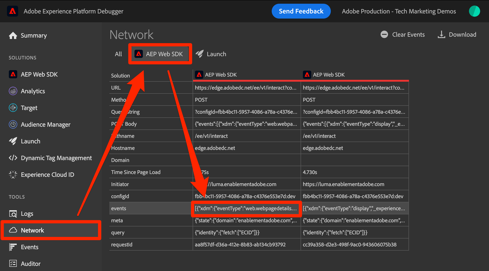

# Einrichten von Adobe Target mit Platform Web SDK

Erfahren Sie, wie Sie Adobe Target mit Adobe Experience Platform Web SDK implementieren. Erfahren Sie, wie Sie Erlebnisse bereitstellen und zusätzliche Parameter an Target übergeben.

[Adobe Target](https://experienceleague.adobe.com/en/docs/target/using/target-home) ist die Adobe Experience Cloud-Anwendung, die Ihnen alle Tools bereitstellt, die Sie benötigen, um das Kundenerlebnis anzupassen und zu personalisieren, damit Sie Umsätze auf Ihren Websites, mobilen Sites, Apps und anderen digitalen Kanälen maximieren können.


## Lernziele

Am Ende dieser Lektion können Sie mit einer Web SDK-Implementierung von Target Folgendes durchführen:

* Fügen Sie das vorab ausgeblendete Snippet hinzu, um ein Flackern zu verhindern.
* Konfigurieren eines Datenstroms zur Aktivierung der Target-Funktion
* Rendern von Visual Experience Composer-Aktivitäten
* Rendern von Formular-Composer-Aktivitäten
* Übergeben von XDM-Daten an Target und Verstehen der Zuordnung zu Target-Parametern
* Übergeben benutzerdefinierter Daten an Target, z. B. Profil- und Entitätsparameter
* eine Target-Implementierung überprüfen
* Trennen von Personalisierungsanfragen von Analytics-Anfragen

>[!TIP]
>
>In unserem [Tutorial zum Migrieren von Target von at.js 2.x zu Platform Web SDK](/help/tutorial-migrate-target-websdk/introduction.md) finden Sie eine schrittweise Anleitung zum Migrieren Ihrer bestehenden at.js-Implementierung.


## Voraussetzungen

Um die Lektionen in diesem Abschnitt abzuschließen, müssen Sie zunächst:

* Schließen Sie alle Lektionen für die Erstkonfiguration von Platform Web SDK ab, einschließlich der Einrichtung von Datenelementen und Regeln.
* Adobe Target Stellen Sie sicher, dass Sie in [ über eine ](https://experienceleague.adobe.com/en/docs/target/using/administer/manage-users/enterprise/properties-overview#section_8C425E43E5DD4111BBFC734A2B7ABC80)- oder Genehmigerrolle verfügen.
* Installieren Sie die [Visual Experience Composer Helper](https://experienceleague.adobe.com/en/docs/target/using/experiences/vec/troubleshoot-composer/vec-helper-browser-extension)-Erweiterung, wenn Sie den Google Chrome-Browser verwenden.
* Wissen, wie Sie Aktivitäten in Target einrichten. Wenn Sie eine Auffrischung benötigen, sind die folgenden Tutorials und Handbücher für diese Lektion hilfreich:
   * [Verwenden der Visual Experience Composer (VEC) Helper-Erweiterung](https://experienceleague.adobe.com/en/docs/target/using/experiences/vec/troubleshoot-composer/vec-helper-browser-extension)
   * [Visual Experience Composer verwenden](https://experienceleague.adobe.com/en/docs/target-learn/tutorials/experiences/use-the-visual-experience-composer)
   * [Verwenden des formularbasierten Experience Composers](https://experienceleague.adobe.com/en/docs/target-learn/tutorials/experiences/use-the-form-based-experience-composer)
   * [Erstellen von Experience Targeting-Aktivitäten](https://experienceleague.adobe.com/de/docs/target-learn/tutorials/activities/create-experience-targeting-activities)

## Flackerhandhabung hinzufügen

Stellen Sie vor dem Start fest, ob eine zusätzliche Lösung für den Umgang mit Flackern erforderlich ist, je nachdem, wie die Tag-Bibliothek geladen wird.

>[!NOTE]
>
>In diesem Tutorial wird die [Luma-Website](https://luma.enablementadobe.com/content/luma/us/en.html){target=_blank} verwendet, die über eine asynchrone Implementierung von Tags und Flimmerschutz verfügt. Dieser Abschnitt dient als Referenz, um zu verstehen, wie die Flimmerreduzierung mit Platform Web SDK funktioniert.


### Asynchrone Implementierung

Wenn eine Tag-Bibliothek asynchron geladen wird, kann das Rendern der Seite abgeschlossen sein, bevor Target den Standardinhalt durch personalisierten Inhalt ersetzt hat. Dieses Verhalten kann zu einem so genannten „Flackern“ führen, bei dem Standardinhalte kurz angezeigt werden, bevor sie durch personalisierte Inhalte ersetzt werden. Wenn Sie dieses Flackern vermeiden möchten, empfiehlt Adobe, unmittelbar vor dem asynchronen Tag-Einbettungs-Code ein spezielles pre-hiding-Snippet hinzuzufügen.

Dieses Snippet ist bereits auf der Luma-Site vorhanden. Sehen wir uns jedoch genauer an, um zu verstehen, was dieser Code tut:

```html
<script>
  !function(e,a,n,t){var i=e.head;if(i){
  if (a) return;
  var o=e.createElement("style");
  o.id="alloy-prehiding",o.innerText=n,i.appendChild(o),setTimeout(function(){o.parentNode&&o.parentNode.removeChild(o)},t)}}
  (document, document.location.href.indexOf("adobe_authoring_enabled") !== -1, ".personalization-container { opacity: 0 !important }", 3000);
</script>
```

Durch das pre-hiding-Snippet wird ein Stil-Tag im Kopf der Seite mit der gewünschten CSS-Definition erstellt. Dieses Stil-Tag wird entfernt, wenn eine Antwort von Target empfangen wird oder die Zeitüberschreitung erreicht wird.

Das Pre-hiding-Verhalten wird durch zwei Konfigurationen am Ende des Snippets gesteuert.

* `body { opacity: 0 !important }` gibt die CSS-Definition an, die für das Vorab-Ausblenden bis zum Laden von Target verwendet werden soll. Standardmäßig ist die gesamte Seite ausgeblendet. Sie können diese Definition aktualisieren, damit die Selektoren, die Sie vorab ausblenden möchten, sowie die Art und Weise, wie Sie sie ausblenden möchten, angezeigt werden. Sie können mehrere Definitionen aufnehmen, da dieser Wert einfach in das Stil-Tag vor dem Ausblenden eingefügt wird. Wenn Sie ein leicht identifizierbares Container-Element haben, das den Inhalt unter Ihrer Navigation umschließt, können Sie diese Einstellung verwenden, um das Vorab-Ausblenden auf dieses Container-Element zu beschränken.
* `3000` Gibt den Timeout-Wert in Millisekunden für das Vorab-Ausblenden an. Wenn vor Ablauf der maximalen Wartezeit keine Antwort von Target eingeht, wird das vorab ausgeblendete Stil-Tag entfernt. Das Erreichen dieser maximalen Wartezeit sollte selten sein.

>[!NOTE]
>
>Das pre-hiding-Snippet für Platform Web SDK unterscheidet sich geringfügig von dem, das mit der Target at.js-Bibliothek verwendet wird. Stellen Sie sicher, dass Sie das richtige Snippet für Platform Web SDK verwenden, da es eine andere Stil-ID als `alloy-prehiding` verwendet. Wenn das pre-hiding-Snippet für at.js verwendet wird, funktioniert es möglicherweise nicht richtig.

Das pre-hiding-Snippet ist auch in Tags verfügbar:

1. Navigieren Sie zum Abschnitt **[!UICONTROL Erweiterungen]** der Tags
1. Wählen Sie **[!UICONTROL Konfigurieren]** für die Adobe Experience Platform Web SDK-Erweiterung aus.
1. Wählen Sie die Schaltfläche **[!UICONTROL Code-Ausschnitt in Zwischenablage kopieren]**

   

   >[!NOTE]
   >
   >Das standardmäßige pre-hiding-Snippet, das aus der Platform Web SDK-Erweiterung kopiert wurde, kann eine CSS-Definition enthalten, die nicht auf Ihrer Site vorhanden ist, z. B. `.personalization-container { opacity: 0 !important }`. Prüfen Sie, ob das pre-hiding-Snippet für Ihre Site geeignet ist.

### Synchrone Implementierung

Adobe empfiehlt, Tags asynchron zu implementieren, wie auf der Luma-Site gezeigt. Wenn die Tag-Bibliothek jedoch synchron geladen wird, ist das pre-hiding-Snippet nicht erforderlich. Stattdessen wird der Stil zum Vorab-Ausblenden in den Erweiterungsparametern der Platform Web SDK festgelegt.

Der Stil zum Vorab-Ausblenden für synchrone Implementierungen kann wie folgt konfiguriert werden:

1. Navigieren Sie zum Abschnitt **[!UICONTROL Erweiterungen]** der Tags
1. Klicken Sie auf **[!UICONTROL Schaltfläche „Konfigurieren]** für die Platform Web SDK-Erweiterung
1. Klicken Sie auf **[!UICONTROL Schaltfläche (Stil zum Vorab-Ausblenden bearbeiten]**.

   

1. Ändern Sie das CSS, um die Selektoren und Ausblendmethoden einzuschließen, die Sie verwenden möchten, z. B. `body { opacity: 0 !important }`, wenn Sie den gesamten Seitentext vorab ausblenden möchten.
1. Speichern Sie Ihre Änderungen und erstellen Sie sie in einer Bibliothek

>[!NOTE]
>
>Die Einstellung für den vorab ausgeblendeten Stil soll nur für synchrone Implementierungen verwendet werden. Dieser Stil sollte leer sein oder auskommentiert sein, wenn Sie eine asynchrone Implementierung von Tags verwenden.

Weitere Informationen zur Verwaltung von Flackern in Platform Web SDK finden Sie im Abschnitt Handbuch: [ von Flackern für personalisierte Erlebnisse](https://experienceleague.adobe.com/en/docs/experience-platform/edge/personalization/manage-flicker).


## Konfigurieren des Datenstroms

Target muss in der Datenstromkonfiguration aktiviert sein, bevor Target-Aktivitäten von Platform Web SDK bereitgestellt werden können.

So konfigurieren Sie Target im Datenstrom:

1. Wechseln Sie zur [Datenerfassung](https://experience.adobe.com/#/data-collection){target="blank"}.
1. Wählen Sie in der linken Navigation **[!UICONTROL Datenströme]**
1. Wählen Sie den zuvor erstellten `Luma Web SDK: Development Environment` aus

   

1. Wählen Sie **[!UICONTROL Service hinzufügen]**
   
1. Wählen Sie **[!UICONTROL Adobe Target]** als **[!UICONTROL Service]**
1. Geben Sie bei Bedarf die optionalen Details zu Ihrer Target-Implementierung ein. Befolgen Sie dazu die folgenden Anweisungen.
1. Wählen Sie **[!UICONTROL Speichern]**

   

### Eigenschafts-Token

Target Premium-Kunden haben die Möglichkeit, Benutzerberechtigungen mit Eigenschaften zu verwalten. Mit den Target-Eigenschaften können Sie Grenzen für Benutzerinnen und Benutzer festlegen, an denen Target-Aktivitäten ausgeführt werden können. Weitere Informationen finden Sie [ Abschnitt ](https://experienceleague.adobe.com/en/docs/target/using/administer/manage-users/enterprise/properties-overview)Enterprise-Berechtigungen“ in der Target-Dokumentation.

Um Eigenschafts-Token einzurichten oder zu finden, navigieren Sie zu **Adobe Target** > **[!UICONTROL Administration]** > **[!UICONTROL Eigenschaften]**. Das Symbol `</>` zeigt den Implementierungs-Code an. Der `at_property` Wert ist das Eigenschafts-Token, das Sie in Ihrem Datenstrom verwenden würden.


<a id="advanced-pto"></a>

Pro Datenstrom kann nur ein Eigenschafts-Token angegeben werden, aber mit Eigenschafts-Token-Überschreibungen können Sie alternative Eigenschafts-Token angeben, die das im Datenstrom definierte primäre Eigenschafts-Token ersetzen. Außerdem ist eine Aktualisierung der `sendEvent` Aktion erforderlich, um den Datenstrom zu überschreiben.


### Zielumgebungs-ID

[Umgebungen](https://experienceleague.adobe.com/en/docs/target/using/administer/environments) in Target helfen Ihnen in allen Entwicklungsphasen bei der Implementierung. Diese optionale Einstellung gibt an, welche Zielumgebung für jeden Datenstrom verwendet werden soll.

Adobe empfiehlt, für jeden Entwicklungs-, Staging- und Produktionsdatenstrom die Zielumgebungs-ID unterschiedlich festzulegen, um die Dinge einfach zu halten. Alternativ können Sie Ihre Umgebungen in der Benutzeroberfläche von Target mithilfe der Funktion [hosts](https://experienceleague.adobe.com/en/docs/target/using/administer/hosts) organisieren.

Um Umgebungs-IDs einzurichten oder zu finden, navigieren Sie zu **Adobe Target** > **[!UICONTROL Administration]** > **[!UICONTROL Umgebungen]**.


>[!NOTE]
>
>Wenn keine Zielumgebungs-ID angegeben ist, wird von der Produktions-Zielumgebung ausgegangen.

### Namespace der Target-Drittanbieter-ID

Mit dieser optionalen Einstellung können Sie angeben, welches Identitätssymbol für die Target-Drittanbieter-ID verwendet werden soll. Target unterstützt nur die Profilsynchronisierung für ein einzelnes Identitätssymbol oder einen Namespace. Weitere Informationen finden Sie im Abschnitt [Echtzeit-Profilsynchronisierung für mbox3rdPartyId](https://experienceleague.adobe.com/en/docs/target/using/audiences/visitor-profiles/3rd-party-id) des Target-Handbuchs.

Die Identitätssymbole befinden sich in der Identitätsliste unter **Datenerfassung** > **[!UICONTROL Kunde]** > **[!UICONTROL Identitäten]**.


Für dieses Tutorial zur Verwendung der Luma-Site verwenden Sie das Identitätssymbol, `lumaCrmId` während der Lektion über (Identitäten[ eingerichtet ](configure-identities.md).


## Rendern von visuellen Personalisierungsentscheidungen

Visuelle Personalisierungsentscheidungen beziehen sich auf die in Visual Experience Composer von Adobe Target erstellten Erlebnisse. Zunächst sollten Sie die in den Schnittstellen von Target und Tags verwendete Terminologie verstehen:

* **Aktivität**: Eine Reihe von Erlebnissen, die auf eine oder mehrere Zielgruppen ausgerichtet sind. Ein einfacher A/B-Test könnte beispielsweise eine Aktivität mit zwei Erlebnissen sein.
* **Erlebnis**: Eine Reihe von Aktionen, die auf einen oder mehrere Standorte oder Entscheidungsumfänge ausgerichtet sind.
* **Entscheidungsumfang**: Ein Ort, an dem ein Target-Erlebnis bereitgestellt wird. Entscheidungsumfänge entsprechen „mboxes“, wenn Sie mit der Verwendung älterer Versionen von Target vertraut sind.
* **Personalization-Entscheidung**: Eine Aktion, deren Anwendung nach Serverfestlegung erforderlich ist. Diese Entscheidungen können auf Zielgruppenkriterien und Target-Aktivitätsprioritäten basieren.
* **Vorschlag**: Das Ergebnis von Entscheidungen, die vom Server getroffen und in der Antwort von Platform Web SDK bereitgestellt werden. Es kann sich beispielsweise als Vorschlag erweisen, ein Bannerbild zu ersetzen.

### Aktualisieren der Aktion [!UICONTROL Ereignis senden]

Visuelle Personalisierungsentscheidungen aus Target werden von Platform Web SDK bereitgestellt, wenn Target im Datenstrom aktiviert ist. Sie _jedoch nicht automatisch gerendert_. Sie müssen die Aktion [!UICONTROL Ereignis senden] aktualisieren, um das automatische Rendering zu aktivieren.

1. Öffnen Sie in der [Datenerfassung](https://experience.adobe.com/#/data-collection){target="blank"} die Tag-Eigenschaft, die Sie für dieses Tutorial verwenden
1. `all pages - library loaded - send event - 50` öffnen
1. `Adobe Experience Platform Web SDK - Send event` auswählen
1. Aktivieren Sie **[!UICONTROL Visuelle Personalisierungsentscheidungen rendern]** mit dem Kontrollkästchen

   

<!--
1. In the **[!UICONTROL Datastream configuration overrides**] the **[!UICONTROL Target Property Token]** can be overridden either as a static value or with a data element. Only property tokens defined in the [**Advanced Property Token Overrides**](#advanced-pto) section in **Datastream Configuration** will return results.
   
   
   -->

1. Speichern Sie die Änderungen und erstellen Sie dann eine Bibliothek

Mit der Einstellung Visuelle Personalisierungsentscheidungen rendern wendet Platform Web SDK automatisch alle Änderungen an, die mit dem Visual Experience Composer oder der globalen Mbox von Target angegeben wurden.

>[!NOTE]
>
>In der Regel sollte [!UICONTROL &#x200B; Einstellung „Visuelle Personalisierungsentscheidungen rendern] nur für eine einzige Sendeereignis-Aktion pro vollständigem Seitenladevorgang aktiviert sein. Wenn diese Einstellung für mehrere Sendeereignis-Aktionen aktiviert ist, werden nachfolgende Render-Anfragen ignoriert.

Wenn Sie es vorziehen, diese Entscheidungen selbst mit benutzerdefiniertem Code zu rendern oder zu bearbeiten, können Sie die Einstellung [!UICONTROL Visuelle Personalisierungsentscheidungen rendern] deaktiviert lassen. Platform Web SDK ist flexibel und bietet diese Funktion, um Ihnen vollständige Kontrolle zu geben. Weitere Informationen zum manuellen Rendern personalisierter Inhalte [ Sie im Handbuch ](https://experienceleague.adobe.com/en/docs/experience-platform/edge/personalization/rendering-personalization-content).


### Einrichten einer Target-Aktivität mit dem Visual Experience Composer

Nachdem die grundlegende Implementierung abgeschlossen ist, erstellen Sie eine Experience Targeting (XT)-Aktivität in Target, um zu überprüfen, ob alles ordnungsgemäß funktioniert. Weitere Informationen finden Sie im Target-Tutorial zum Erstellen [ Experience Targeting](https://experienceleague.adobe.com/de/docs/target-learn/tutorials/activities/create-experience-targeting-activities)Aktivitäten .

>[!NOTE]
>
>Wenn Sie Google Chrome als Browser verwenden, ist die [Visual Experience Composer (VEC) Helper-Erweiterung](https://experienceleague.adobe.com/en/docs/target/using/experiences/vec/troubleshoot-composer/vec-helper-browser-extension) erforderlich, um die Site ordnungsgemäß zur Bearbeitung im VEC zu laden.

1. Navigieren Sie zur Adobe Target-Benutzeroberfläche
1. Erstellen Sie eine Experience Targeting-(XT)-Aktivität unter Verwendung der Luma-Homepage für die Aktivitäts-URL.

   

1. Ändern Sie die Seite, z. B. ändern Sie den Text im Hero-Banner der Startseite.  Wenn Sie fertig sind, wählen **[!UICONTROL Speichern]** und dann **[!UICONTROL Weiter]**.

   

1. Aktualisieren Sie den Ereignisnamen und klicken Sie dann auf **[!UICONTROL Weiter]**.

   

1. Wählen Sie Adobe Analytics als Berichtsquelle mit der entsprechenden Report Suite und der Metrik Bestellungen als Ziel

   

   >[!NOTE]
   >
   >Wenn Sie Adobe Analytics nicht verwenden, wählen Sie Target als Berichtsquelle und wählen Sie stattdessen eine andere Metrik wie **Interaktion > Seitenansichten**. Zum Speichern und Anzeigen einer Vorschau der Aktivität ist eine Zielmetrik erforderlich.

1. Speichern der Aktivität
1. Wenn Sie mit Ihren Änderungen vertraut sind, können Sie Ihre Aktivität aktivieren. Wenn Sie das Erlebnis ohne Aktivierung in der Vorschau anzeigen möchten, können Sie andernfalls die [QA-Vorschau-URL](https://experienceleague.adobe.com/en/docs/target/using/activities/activity-qa/activity-qa) kopieren.
1. Laden Sie die Luma-Homepage. Ihre Änderungen sollten angewendet werden
1. Nach einigen Stunden sollten Sie in Adobe Analytics die Target-Aktivitätsdaten und -konversionen sehen können. Ausführliche Informationen zur Berichterstellung von [Analytics for Target (A4T)) finden Sie im Target](https://experienceleague.adobe.com/en/docs/target/using/integrate/a4t/reporting)Handbuch .


### Validieren mit dem Debugger

Wenn Sie eine Aktivität einrichten, sollte der Inhalt auf der Seite gerendert werden. Selbst wenn keine Aktivitäten aktiv sind, können Sie sich jedoch auch den Netzwerkaufruf „Ereignis senden“ ansehen, um zu bestätigen, dass Target ordnungsgemäß konfiguriert ist.

>[!CAUTION]
>
>Wenn Sie Google Chrome verwenden und die [Visual Experience Composer (VEC) Helper-Erweiterung](https://experienceleague.adobe.com/en/docs/target/using/experiences/vec/troubleshoot-composer/vec-helper-browser-extension) installiert haben, stellen Sie sicher, dass die Einstellung **Target-Bibliotheken**) deaktiviert ist. Die Aktivierung dieser Einstellung führt zu zusätzlichen Target-Anforderungen.

1. Öffnen der Adobe Experience Platform Debugger-Browser-Erweiterung
1. Wechseln Sie zur [Demo-Site von Luma](https://luma.enablementadobe.com/content/luma/us/en.html) und verwenden Sie den Debugger, [ die Tag-Eigenschaft auf der Site in Ihre eigene Entwicklungseigenschaft zu wechseln](validate-with-debugger.md#use-the-experience-platform-debugger-to-map-to-your-tags-property)
1. Seite neu laden
1. Wählen Sie das **[!UICONTROL Netzwerk]**-Tool im Debugger aus
1. Filtern nach **[!UICONTROL Experience Platform Web SDK]**
1. Wählen Sie den Wert in der Ereigniszeile für den ersten Aufruf aus

   

1. Beachten Sie, dass unter `query` > `personalization` Schlüssel vorhanden sind und `decisionScopes` den Wert `__view__` hat. Dieser Umfang entspricht dem `target-global-mbox`. Dieser Platform Web SDK-Aufruf fordert Entscheidungen von Target an.

   

1. Schließen Sie die Überlagerung und wählen Sie die Ereignisdetails für den zweiten Netzwerkaufruf aus. Dieser Aufruf ist nur vorhanden, wenn Target eine Aktivität zurückgegeben hat.
1. Beachten Sie, dass es Details zur Aktivität und zum Erlebnis gibt, die von Target zurückgegeben werden. Dieser Platform Web SDK-Aufruf sendet eine Benachrichtigung, dass eine Target-Aktivität für den Benutzer gerendert wurde, und inkrementiert eine Impression.

   

## Einrichten und Rendern eines benutzerdefinierten Entscheidungsumfangs

Benutzerdefinierte Entscheidungsumfänge (ehemals als „Mboxes“ bezeichnet) können verwendet werden, um HTML- oder JSON-Inhalte mithilfe des formularbasierten Experience Composers von Target strukturiert bereitzustellen. Inhalte, die für einen dieser benutzerdefinierten Bereiche bereitgestellt werden, werden von Platform Web SDK nicht automatisch gerendert. Sie kann mithilfe einer Aktion in Tags gerendert werden.

### Fügen Sie der [!UICONTROL Aktion „Ereignis senden“ einen Bereich &#x200B;]

Ändern Sie Ihre Seitenladeregel, um einen benutzerdefinierten Entscheidungsumfang hinzuzufügen:

1. `all pages - library loaded - send event - 50` öffnen
1. `Adobe Experience Platform Web SDK - Send Event` auswählen
1. Fügen Sie einen oder mehrere Bereiche hinzu, die Sie verwenden möchten. Verwenden Sie für dieses Beispiel `homepage-hero`.

   

1. Speichern Sie Ihre Änderungen und erstellen Sie sie in Ihrer Bibliothek

>[!TIP]
>
>In diesem Tutorial verwenden Sie einen einzigen manuell definierten Bereich zu Demonstrationszwecken. Wenn Sie sich für die Verwendung mehrerer Entscheidungsumfänge entscheiden, die für bestimmte Seiten vorgesehen sind, sollten Sie die Verwendung eines Datenelements in Betracht ziehen, das ein Array von Bereichen abhängig vom Seitenpfad zurückgibt. Dieser Ansatz trägt dazu bei, Ihre Implementierung einfach und skalierbar zu halten.

### Verarbeiten der Target-Antwort

Nachdem Sie nun Platform Web SDK so konfiguriert haben, dass Inhalte für den `homepage-hero` angefordert werden, müssen Sie etwas mit der Antwort tun. Die Tag-Erweiterung von Platform Web SDK bietet ein [!UICONTROL send event complete]-Ereignis, mit dem sofort eine neue Regel Trigger werden kann, wenn eine Antwort von einer „send event[!UICONTROL -]-Aktion eingeht.

1. Erstellen Sie eine Regel mit dem Namen `homepage - send event complete - render homepage-hero`.
1. Fügen Sie der Regel ein Ereignis hinzu. Verwenden Sie die Erweiterung **Adobe Experience Platform Web** SDK **[!UICONTROL und den Ereignistyp send event complete]**.
1. Fügen Sie eine Bedingung hinzu, um die Regel auf die Luma-Homepage zu beschränken (Pfad ohne Abfragezeichenfolge entspricht `/content/luma/us/en.html`).
1. Fügen Sie der Regel eine Aktion hinzu. Verwenden Sie die Erweiterung **Adobe Experience Platform Web** SDK **und den Aktionstyp** Vorschläge anwenden“.

   

   >[!TIP]
   >
   >Geben Sie Ihren Regelereignissen, Bedingungen und Aktionen beschreibende Namen, anstatt die Standardnamen zu verwenden. Robuste Namen von Regelkomponenten machen die Suchergebnisse viel nützlicher.

1. Geben Sie `%event.propositions%` in das Feld Vorschläge ein, da wir das Ereignis „Versandereignis abgeschlossen“ als Trigger für diese Regel verwenden.
1. Wählen Sie im Abschnitt „Vorschlagsmetadaten“ die Option **[!UICONTROL Formular verwenden]**
1. Für die **&#x200B;**&#x200B;Umfang`homepage-hero` des Felds
1. Für die **[!UICONTROL Selektor]**-`div.heroimage`
1. Wählen Sie **[!UICONTROL Aktionstyp]** die Option **[!UICONTROL HTML festlegen]**
1. Wählen **[!UICONTROL Änderungen beibehalten]**

   

   Zusätzlich zum Rendern der Aktivität müssen Sie einen zusätzlichen Aufruf an Target ausführen, um anzugeben, dass die formularbasierte Aktivität gerendert wurde:

1. Fügen Sie der Regel eine weitere Aktion hinzu. Verwenden Sie die **Core**-Erweiterung und den Aktionstyp **[!UICONTROL Benutzerdefinierter Code]**:
1. Fügen Sie den folgenden JavaScript-Code ein:

   ```javascript
   var propositions = event.propositions;
   var heroProposition;
   if (propositions) {
      // Find the hero proposition, if it exists.
      for (var i = 0; i < propositions.length; i++) {
         var proposition = propositions[i];
         if (proposition.scope === "homepage-hero") {
            heroProposition = proposition;
            break;
         }
      }
   }
   // Send a "display" event
   if (heroProposition !== undefined){
      alloy("sendEvent", {
         xdm: {
            eventType: "display",
            _experience: {
               decisioning: {
                  propositions: [{
                     id: heroProposition.id,
                     scope: heroProposition.scope,
                     scopeDetails: heroProposition.scopeDetails
                  }]
               }
            }
         }
      });
   }
   ```

   

1. Wählen **[!UICONTROL Änderungen beibehalten]**

1. Speichern Sie Ihre Änderungen und erstellen Sie sie in Ihrer Bibliothek
1. Laden Sie die Luma-Homepage einige Male. Dies sollte ausreichen, um den neuen `homepage-hero` Entscheidungsumfang in der Target-Oberfläche zu registrieren.


### Einrichten einer Target-Aktivität mit dem formularbasierten Experience Composer

Nachdem Sie nun über eine Regel zum manuellen Rendern eines benutzerdefinierten Entscheidungsumfangs verfügen, können Sie in Target eine weitere Experience Targeting-(XT)-Aktivität erstellen. Verwenden Sie dieses Mal den formularbasierten Experience Composer.

1. [Adobe Target öffnen](https://experience.adobe.com/target)
1. Deaktivieren der in der vorherigen Lektion verwendeten Aktivität
1. Erstellen einer Experience Targeting-(XT)-Aktivität mit der Option „Form-Based Experience Composer“

   

1. Wählen Sie den **`homepage-hero`** aus der Dropdown-Liste Speicherort und **[!UICONTROL HTML-Angebot erstellen]** aus der Dropdown-Liste Inhalt . Wenn der Speicherort nicht verfügbar ist, können Sie ihn eingeben. Target füllt regelmäßig neue Standortnamen, nachdem es Anfragen für diesen Standort oder Bereich erhält.

   

1. Fügen Sie den folgenden Code in das Feld Inhalt ein. Dieser Code ist ein einfaches Hero-Banner mit einem anderen Hintergrundbild:

   ```html
   <div class="we-HeroImage jumbotron" style="background-image: url('/content/luma/us/en/women/_jcr_content/root/hero_image.coreimg.jpeg');">
      <div class="container cq-dd-image">
         <div class="we-HeroImage-wrapper">
            <p class="h3">New Luma Yoga Collection</p>
            <strong class="we-HeroImage-title h1">Be active with style&nbsp;</strong>
            <p>
               <a class="btn btn-primary btn-action" href="/content/luma/us/en/products.html" role="button">Shop Now</a>
            </p>
         </div>
      </div>
   </div>
   ```

1. Wählen Sie im Schritt [!UICONTROL Ziele und Einstellungen] die Berichtsquelle Adobe Target und [!UICONTROL Interaktion] > [!UICONTROL Seitenansichten] aus
1. Speichern der Aktivität
1. Wenn Sie mit Ihren Änderungen vertraut sind, können Sie Ihre Aktivität aktivieren. Wenn Sie das Erlebnis ohne Aktivierung in der Vorschau anzeigen möchten, können Sie andernfalls die [QA-Vorschau-URL](https://experienceleague.adobe.com/en/docs/target/using/activities/activity-qa/activity-qa) kopieren.
1. Laden Sie die Luma-Homepage. Ihre Änderungen sollten angewendet werden

>[!NOTE]
>
>Das Konversionsziel „Auf mbox geklickt“ funktioniert nicht automatisch. Da Platform Web SDK benutzerdefinierte Bereiche nicht automatisch rendert, werden Klicks auf Orte, auf die Sie den Inhalt anwenden möchten, nicht verfolgt. Sie können mit der `eventType`-Aktion Ihr eigenes Klick-Tracking für jeden Bereich mit dem `_experience` „Klick“ mit den entsprechenden `sendEvent` erstellen.

### Validieren mit dem Debugger

Wenn Sie Ihre Aktivität aktiviert haben, sollte der gerenderte Inhalt auf der Seite angezeigt werden. Selbst wenn keine Aktivitäten live sind, können Sie sich jedoch auch den Netzwerkaufruf [!UICONTROL Ereignis senden] ansehen, um zu bestätigen, dass Target Inhalte für Ihre benutzerdefinierten Bereiche anfordert.

1. Öffnen Sie die Browser-Erweiterung Adobe Experience Platform Debugger .
1. Wechseln Sie zur [Demo-Site von Luma](https://luma.enablementadobe.com/content/luma/us/en.html) und verwenden Sie den Debugger, [ die Tag-Eigenschaft auf der Site in Ihre eigene Entwicklungseigenschaft zu wechseln](validate-with-debugger.md#use-the-experience-platform-debugger-to-map-to-your-tags-property)
1. Seite neu laden
1. Wählen Sie im Debugger **[!UICONTROL Tool]** Netzwerk“ aus.
1. Filtern nach **[!UICONTROL Adobe Experience Platform Web SDK]**
1. Wählen Sie den Wert in der Ereigniszeile für den ersten Aufruf aus

   

1. Beachten Sie, dass unter `query` > `personalization` Schlüssel vorhanden sind und `decisionScopes` wie zuvor einen Wert von `__view__` hat, aber jetzt ist auch ein `homepage-hero` enthalten. Dieser Platform Web SDK-Aufruf ruft Target auf, Entscheidungen für Änderungen zu treffen, die mithilfe des VEC und des spezifischen `homepage-hero`-Speicherorts vorgenommen wurden.

   

1. Schließen Sie die Überlagerung und wählen Sie die Ereignisdetails für den zweiten Netzwerkaufruf aus. Dieser Aufruf ist nur vorhanden, wenn Target eine Aktivität zurückgegeben hat.
1. Beachten Sie, dass es Details zur Aktivität und zum Erlebnis gibt, die von Target zurückgegeben werden. Dieser Platform Web SDK-Aufruf sendet eine Benachrichtigung, dass eine Target-Aktivität für den Benutzer gerendert wurde, und inkrementiert eine Impression. Sie wurde durch die zuvor hinzugefügte Aktion mit benutzerdefiniertem Code initiiert.

   

## Parameter an Target senden

In diesem Abschnitt übergeben Sie Target-spezifische Daten und sehen sich genauer an, wie XDM-Daten den Target-Parametern zugeordnet werden.

### Seitenparameter (Mbox) und XDM

Alle XDM-Felder werden automatisch als [Seitenparameter](https://experienceleague.adobe.com/en/docs/target-dev/developer/implementation/methods/page-parameters) oder Mbox-Parameter an Target übergeben.

Einige dieser XDM-Felder werden speziellen Objekten im Backend von Target zugeordnet. Beispielsweise stehen `web.webPageDetails.URL` beim Erstellen von Profilskripten automatisch zum Erstellen URL-basierter Zielgruppenbestimmungsbedingungen oder als `page.url` zur Verfügung.

Sie können Seitenparameter auch mithilfe des Datenobjekts hinzufügen.

### Spezielle Parameter und das Datenobjekt

Es gibt einige Datenpunkte, die für Target nützlich sein können und nicht vom XDM-Objekt zugeordnet sind. Zu diesen speziellen Zielgruppen-Parametern gehören:

* [Profilattribute](https://experienceleague.adobe.com/en/docs/target-dev/developer/implementation/methods/in-page-profile-attributes)
* [Recommendations-Entitätsattribute](https://experienceleague.adobe.com/en/docs/target/using/recommendations/entities/entity-attributes)
* [Reservierte Parameter für Recommendations](https://experienceleague.adobe.com/en/docs/target/using/recommendations/plan-implement#pass-behavioral)
* Kategoriewerte für [Kategorieaffinität](https://experienceleague.adobe.com/en/docs/target/using/audiences/visitor-profiles/category-affinity)

Diese Parameter müssen im `data`-Objekt gesendet werden, anstatt im `xdm`-Objekt. Darüber hinaus können auch Seiten- (oder Mbox-)Parameter in das `data`-Objekt aufgenommen werden.

Um das Datenobjekt auszufüllen, erstellen Sie das folgende Datenelement und verwenden Sie Datenelemente wieder, die in der Lektion [Datenelemente erstellen](create-data-elements.md) erstellt wurden:

* **`data.content`** mit dem folgenden benutzerdefinierten Code:

  ```javascript
  var data = {
     __adobe: {
        target: {
           "entity.id": _satellite.getVar("product.productInfo.sku"),
           "entity.name": _satellite.getVar("product.productInfo.title"),
           "profile.loggedIn": _satellite.getVar("user.profile.attributes.loggedIn"),
           "user.categoryId": _satellite.getVar("product.category")
        }
     }
  }
  return data;
  ```


### Aktualisieren der Seitenladeregel

Wenn Sie zusätzliche Daten für Target außerhalb des XDM-Objekts übergeben möchten, müssen alle anwendbaren Regeln aktualisiert werden. In diesem Beispiel müssen Sie nur das neue Datenelement **data.content** in die allgemeine Seitenladeregel und die Produktseitenansichtsregel einbeziehen.

1. `all pages - library loaded - send event - 50` öffnen
1. `Adobe Experience Platform Web SDK - Send event` auswählen
1. Hinzufügen des `data.content` Datenelements zum Datenfeld

   

1. Speichern Sie Ihre Änderungen und erstellen Sie sie in Ihrer Bibliothek

>[!NOTE]
>
>Im obigen Beispiel wird ein `data` verwendet, das nicht bei allen Seitentypen vollständig aufgefüllt ist. Tags handhabt diese Situation angemessen und lässt Schlüssel mit einem undefinierten Wert aus. Beispielsweise würden `entity.id` und `entity.name` auf keiner Seite außer den Produktdetails weitergegeben.


## Aufteilen von Personalization- und Analytics-Anfragen

Die Datenschicht auf der Luma-Site wird vollständig definiert, bevor der Tag-Einbettungs-Code verwendet wird. Auf diese Weise können wir mit einem einzigen Aufruf personalisierte Inhalte abrufen (z. B. aus Adobe Target) und Analysedaten senden (z. B. an Adobe Analytics).

Auf vielen Websites kann die Datenschicht jedoch nicht früh genug oder schnell genug geladen werden, um für beide Anwendungen einen einzigen Aufruf zu verwenden. In diesen Situationen können Sie zwei Aktionen vom Typ [!UICONTROL Ereignis senden] auf einer einzelnen Seite verwenden und die erste für die Personalisierung und die zweite für die Analyse verwenden. Wenn Sie die Ereignisse auf diese Weise aufteilen, kann das Personalisierungsereignis so früh wie möglich ausgelöst werden, während Sie warten, bis die Datenschicht vollständig geladen ist, bevor Sie das Analytics-Ereignis senden. Dies ist ähnlich wie bei vielen SDK-Implementierungen vor dem Web, bei denen Adobe Target den `target-global-mbox` oben auf der Seite und Adobe Analytics den `s.t()`-Aufruf unten auf der Seite auslöste

So erstellen Sie die „Personalization-on-top“-Anfrage:

1. `all pages - library loaded - send event - 50` öffnen
1. Öffnen der Aktion **Ereignis senden**
1. Wählen Sie **[!UICONTROL Geführte Ereignisse verwenden]** und dann **[!UICONTROL Personalisierung anfordern]**
1. Dadurch wird der **Typ** als **[!UICONTROL Entscheidungsvorschlag abrufen]**

   

So erstellen Sie die Analytics-On-Bottom-Anfrage:

1. Erstellen Sie eine neue Regel mit dem Namen `all pages - page bottom - send event - 50`
1. Fügen Sie der Regel ein Ereignis hinzu. Verwenden der **Core**-Erweiterung und des Ereignistyps **[!UICONTROL Seitenende]**
1. Fügen Sie der Regel eine Aktion hinzu. Verwenden der Erweiterung **Adobe Experience Platform Web** SDK **und des Aktionstyps** Ereignis senden“
1. Wählen Sie **[!UICONTROL Geführte Ereignisse verwenden]** und dann **[!UICONTROL Analytics erfassen]** aus
1. Dadurch wird das Kontrollkästchen **[!UICONTROL Ausstehende Anzeigebenachrichtigungen einschließen]** aktiviert, damit die Anzeigebenachrichtigung aus der Entscheidungsanfrage in der Warteschlange gesendet wird.


>[!TIP]
>
>Wenn auf das Ereignis, für das Sie einen Entscheidungsvorschlag abrufen, kein Adobe Analytics-Ereignis folgt, verwenden Sie **Stil des geführten Ereignisses** **[!UICONTROL Nicht angeleitet - Alle Felder anzeigen]**. Sie müssen alle Optionen manuell auswählen, aber dadurch wird die Option zum **[!UICONTROL automatischen Senden einer Anzeigebenachrichtigung]** zusammen mit Ihrer Abrufanfrage freigeschaltet.


### Validieren mit dem Debugger

Nachdem die Regeln aktualisiert wurden, können Sie mit der Adobe Debugger überprüfen, ob die Daten korrekt weitergeleitet werden.

1. Navigieren Sie zur [Demo-Site von Luma](https://luma.enablementadobe.com/content/luma/us/en.html) und melden Sie sich mit der E-Mail-`test@test.com` und dem `test` an
1. Navigieren zu einer Produktdetailseite
1. Öffnen Sie die Browser-Erweiterung Adobe Experience Platform Debugger und [ Sie die Tag-Eigenschaft in Ihre eigene Entwicklungseigenschaft](validate-with-debugger.md#use-the-experience-platform-debugger-to-map-to-your-tags-property)
1. Seite neu laden
1. Wählen Sie das **Netzwerk**-Tool im Debugger aus und filtern Sie nach **Adobe Experience Platform Web SDK**
1. Wählen Sie den Wert in der Ereigniszeile für den ersten Aufruf aus
1. Beachten Sie, dass unter `data` > `__adobe` > `target` Schlüssel vorhanden sind und diese mit Informationen über das Produkt, die Kategorie und den Anmeldestatus gefüllt sind.

   

### Validieren in der Target-Oberfläche

Überprüfen Sie anschließend in der Target-Oberfläche, ob Daten empfangen wurden und für die Verwendung in Zielgruppen und Aktivitäten verfügbar sind. XDM-Daten werden automatisch benutzerdefinierten Target-Parametern zugeordnet. Sie können überprüfen, ob XDM-Daten von Target empfangen wurden und verfügbar sind, indem Sie eine Zielgruppe erstellen.

1. [Adobe Target öffnen](https://experience.adobe.com/target)
1. Navigieren Sie zum Abschnitt **[!UICONTROL Zielgruppen]**
1. Erstellen Sie eine Zielgruppe und wählen Sie **[!UICONTROL Attributtyp]** Benutzerdefiniert“ aus
1. Suchen Sie im **[!UICONTROL Parameter]** nach `web`. Das Dropdown-Menü sollte mit allen XDM-Feldern gefüllt werden, die sich auf die Web-Seitendetails beziehen.

   

Überprüfen Sie als Nächstes, ob das Profilattribut für den Anmeldestatus erfolgreich übergeben wurde.

1. Wählen Sie **[!UICONTROL Attributtyp]** Besucherprofil“
2. Suchen Sie nach `loggedIn`. Wenn das Attribut im Dropdown-Menü verfügbar ist, wurde das Attribut korrekt an Target übergeben. Es kann mehrere Minuten dauern, bis neue Attribute in der Target-Benutzeroberfläche verfügbar werden.

   

Wenn Sie über Target Premium verfügen, können Sie auch überprüfen, ob die Entitätsdaten korrekt weitergeleitet wurden und die Produktdaten in den Recommendations-Produktkatalog geschrieben wurden.

1. Navigieren Sie zum Abschnitt **[!UICONTROL Recommendations]**
1. Wählen **[!UICONTROL Katalogsuche]** in der linken Navigationsleiste aus.
1. Suchen Sie nach der Produkt-SKU oder dem Produktnamen, die Sie zuvor auf der Luma-Site besucht haben. Das Produkt sollte im Produktkatalog angezeigt werden. Es kann mehrere Minuten dauern, bis neue Produkte im Recommendations-Produktkatalog durchsucht werden können.

   

### Mit Assurance validieren

Darüber hinaus können Sie bei Bedarf Assurance verwenden, um zu bestätigen, dass Target-Entscheidungsanfragen die richtigen Daten erhalten und dass alle Server-seitigen Transformationen korrekt ausgeführt werden. Sie können auch bestätigen, dass die Kampagnen- und Erlebnisinformationen in den Adobe Analytics-Aufrufen enthalten sind, selbst wenn die Target-Entscheidungsaufrufe und die Adobe Analytics-Aufrufe separat gesendet werden.

1. [Assurance öffnen](https://experience.adobe.com/assurance)
1. Starten Sie eine neue Assurance-Sitzung, geben Sie **[!UICONTROL Sitzungsnamen]** und die **[!UICONTROL Basis-URL]** für Ihre Site oder eine andere Seite ein, die Sie testen
1. Klicken Sie auf **[!UICONTROL Weiter]**

   

1. Wählen Sie Ihre Verbindungsmethode aus. In diesem Fall verwenden wir **[!UICONTROL Link kopieren]**
1. Kopieren Sie den Link und fügen Sie ihn in eine neue Browser-Registerkarte ein.
1. Klicken Sie auf **[!UICONTROL Fertig]**

   

1. Sobald Ihre Assurance-Sitzung gestartet wurde, werden auf der Registerkarte „Ereignisse“ die Ereignisse angezeigt
1. Filtern nach „tnta“
1. Wählen Sie den letzten Aufruf aus und erweitern Sie die Nachrichten, um sicherzustellen, dass er korrekt ausgefüllt wird, und beachten Sie die „tnta“-Werte

   

1. Behalten Sie als Nächstes den Filter „tnta“ bei und wählen Sie das Ereignis analytics.mapping aus, das nach dem soeben betrachteten Zielereignis auftritt.
1. Überprüfen Sie „context.mappedQueryParams“.\&lt;yourSchemaName\>&quot; Wert, um zu bestätigen, dass er ein „tnta“-Attribut mit einer verketteten Zeichenfolge enthält, die mit den „tnta“-Werten übereinstimmt, die im vorangehenden Zielereignis gefunden wurden.

   

Dadurch wird bestätigt, dass die A4T-Informationen, die zur späteren Übermittlung in die Warteschlange gestellt wurden, als der Target Decisioning-Aufruf durchgeführt wurde, ordnungsgemäß gesendet wurden, als der Analytics-Tracking-Aufruf später auf der Seite ausgelöst wurde.

Nachdem Sie nun diese Lektion abgeschlossen haben, sollten Sie über eine funktionierende Implementierung von Adobe Target mit der Platform Web SDK verfügen.

>[!NOTE]
>
>Vielen Dank, dass Sie sich Zeit genommen haben, um mehr über Adobe Experience Platform Web SDK zu erfahren. Wenn Sie Fragen haben, allgemeines Feedback geben möchten oder Vorschläge für zukünftige Inhalte haben, teilen Sie diese bitte auf diesem [Experience League Community-Diskussionsbeitrag](https://experienceleaguecommunities.adobe.com/t5/adobe-experience-platform-data/tutorial-discussion-implement-adobe-experience-cloud-with-web/td-p/444996)
