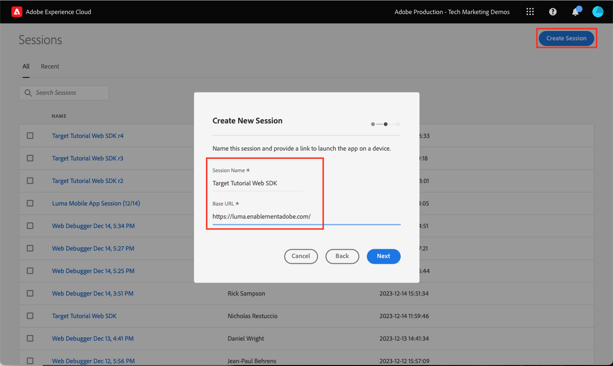

# Einrichten von Adobe Target mit dem Platform Web SDK

Erfahren Sie, wie Sie Adobe Target mit dem Platform Web SDK implementieren. Erfahren Sie, wie Sie Erlebnisse bereitstellen und zusätzliche Parameter an Target übergeben.

[Adobe Target](https://experienceleague.adobe.com/en/docs/target/using/target-home) ist die Adobe Experience Cloud-Anwendung, die Ihnen all das bietet, was Sie benötigen, um die Erlebnisse Ihrer Kunden anzupassen und zu personalisieren, sodass Sie Umsätze auf Ihren Web- und mobilen Sites, in Apps und anderen digitalen Kanälen maximieren können.


## Lernziele

Am Ende dieser Lektion können Sie Folgendes mit einer Web SDK-Implementierung von Target tun:

* Codeausschnitt zur Vorab-Ausblendung hinzufügen, um Flackern zu verhindern
* Konfigurieren eines Datenspeichers zur Aktivierung der Target-Funktion
* Rendern von Visual Experience Composer-Aktivitäten
* Render Form Composer-Aktivitäten
* Übergeben von XDM-Daten an Target und Verstehen der Zuordnung zu Target-Parametern
* Übergeben benutzerdefinierter Daten an Target, z. B. Profil- und Entitätsparameter
* eine Target-Implementierung überprüfen
* Trennen von Personalisierungsanforderungen von Analyseanforderungen

>[!TIP]
>
>Siehe unsere [Migrieren von Target von at.js 2.x zum Platform Web SDK](/help/tutorial-migrate-target-websdk/introduction.md) Tutorial für eine schrittweise Anleitung zum Migrieren Ihrer vorhandenen at.js-Implementierung.


## Voraussetzungen

Um die Lektionen in diesem Abschnitt abzuschließen, müssen Sie zunächst:

* Schließen Sie alle Lektionen für die Erstkonfiguration des Platform Web SDK ab, einschließlich der Einrichtung von Datenelementen und Regeln.
* Vergewissern Sie sich, dass [Editor- oder Genehmigerrolle](https://experienceleague.adobe.com/docs/target/using/administer/manage-users/enterprise/properties-overview.html#section_8C425E43E5DD4111BBFC734A2B7ABC80) in Adobe Target.
* Installieren Sie die [Visual Experience Composer Helper-Erweiterung](https://experienceleague.adobe.com/en/docs/target/using/experiences/vec/troubleshoot-composer/vec-helper-browser-extension) wenn Sie den Google Chrome-Browser verwenden.
* Erfahren Sie, wie Sie Aktivitäten in Target einrichten. Wenn Sie einen Auffrischungskurs benötigen, sind die folgenden Tutorials und Handbücher für diese Lektion hilfreich:
   * [Verwenden der Visual Experience Composer (VEC) Helper-Erweiterung](https://experienceleague.adobe.com/en/docs/target/using/experiences/vec/troubleshoot-composer/vec-helper-browser-extension)
   * [Visual Experience Composer verwenden](https://experienceleague.adobe.com/en/docs/target-learn/tutorials/experiences/use-the-visual-experience-composer)
   * [Verwenden des formularbasierten Experience Composer](https://experienceleague.adobe.com/en/docs/target-learn/tutorials/experiences/use-the-form-based-experience-composer)
   * [Erstellen von Erlebnis-Targeting-Aktivitäten](https://experienceleague.adobe.com/en/docs/target-learn/tutorials/activities/create-experience-targeting-activities)

## Flackernde Behandlung hinzufügen

Stellen Sie vor dem Start fest, ob je nachdem, wie die Tag-Bibliothek geladen wird, eine zusätzliche Lösung zur Flackerverarbeitung erforderlich ist.

>[!NOTE]
>
>In diesem Tutorial wird die [Site &quot;Luma&quot;](https://luma.enablementadobe.com/content/luma/us/en.html) , die eine asynchrone Implementierung von Tags und eine Flackerverhinderung aufweist. In diesem Abschnitt erhalten Sie Informationen dazu, wie die Flackerverhinderung mit dem Platform Web SDK funktioniert.


### Asynchrone Implementierung

Wenn eine Tag-Bibliothek asynchron geladen wird, kann das Rendern der Seite abgeschlossen sein, bevor Target Standardinhalte durch personalisierte Inhalte ersetzt hat. Dieses Verhalten kann zum so genannten &quot;Flackern&quot;führen. Dabei wird kurz der Standardinhalt angezeigt, bevor er durch den von Target angegebenen personalisierten Inhalt ersetzt wird. Wenn Sie dieses Flimmern vermeiden möchten, empfiehlt Adobe, unmittelbar vor dem asynchronen Tag-Einbettungscode einen speziellen Codeausschnitt zur Vorab-Ausblendung hinzuzufügen.

Dieses Snippet ist bereits auf der Site &quot;Luma&quot;vorhanden, aber schauen wir uns genauer an, um zu verstehen, was dieser Code bewirkt:

```html
<script>
  !function(e,a,n,t){var i=e.head;if(i){
  if (a) return;
  var o=e.createElement("style");
  o.id="alloy-prehiding",o.innerText=n,i.appendChild(o),setTimeout(function(){o.parentNode&&o.parentNode.removeChild(o)},t)}}
  (document, document.location.href.indexOf("adobe_authoring_enabled") !== -1, ".personalization-container { opacity: 0 !important }", 3000);
</script>
```

Der vorab ausgeblendete Ausschnitt erstellt ein Stil-Tag im Seitenkopf mit der CSS-Definition Ihrer Wahl. Dieses Stil-Tag wird entfernt, wenn eine Antwort von Target empfangen wird oder die Zeitüberschreitung erreicht wird.

Das Verhalten der Vorab-Ausblendung wird durch zwei Konfigurationen am Ende des Ausschnitts gesteuert.

* `body { opacity: 0 !important }` gibt die CSS-Definition an, die für die Vorab-Ausblendung verwendet werden soll, bis Target geladen wird. Standardmäßig ist die gesamte Seite ausgeblendet. Sie können diese Definition auf die Selektoren aktualisieren, die Sie vorab ausblenden möchten, sowie auf die Art und Weise, wie Sie sie ausblenden möchten. Sie können mehrere Definitionen einbeziehen, da dieser Wert einfach in das vorab ausgeblendete Stil-Tag eingefügt wird. Wenn Sie über ein leicht identifizierbares Container-Element verfügen, das den Inhalt unter Ihrer Navigation einschließt, können Sie diese Einstellung verwenden, um die Vorab-Ausblendung auf dieses Container-Element zu beschränken.
* `3000` gibt die Zeitüberschreitung in Millisekunden für die Vorab-Ausblendung an. Wenn vor der Zeitüberschreitung keine Antwort von Target empfangen wird, wird das Stil-Tag für die Vorab-Ausblendung entfernt. Das Erreichen dieser Zeitüberschreitung sollte selten sein.

>[!NOTE]
>
>Der Codeausschnitt zur Vorab-Ausblendung für das Platform Web SDK unterscheidet sich geringfügig von dem für die at.js-Bibliothek von Target verwendeten. Stellen Sie sicher, dass Sie das richtige Snippet für das Platform Web SDK verwenden, da es eine andere Stil-ID verwendet als `alloy-prehiding`. Wenn der vorab ausgeblendete Ausschnitt für at.js verwendet wird, funktioniert er möglicherweise nicht ordnungsgemäß.

Der vorab ausgeblendete Ausschnitt ist auch innerhalb von Tags verfügbar:

1. Navigieren Sie zu **[!UICONTROL Erweiterungen]** -Abschnitt von Tags
1. Auswählen **[!UICONTROL Konfigurieren]** für die Adobe Experience Platform Web SDK-Erweiterung
1. Wählen Sie die **[!UICONTROL Codeausschnitt zur Vorab-Ausblendung in die Zwischenablage kopieren]** button

   

   >[!NOTE]
   >
   >Der standardmäßige Codeausschnitt zur Vorab-Ausblendung, der aus der Platform Web SDK-Erweiterung kopiert wird, kann eine CSS-Definition enthalten, die auf Ihrer Site nicht vorhanden ist, z. B. `.personalization-container { opacity: 0 !important }`. Stellen Sie sicher, dass Sie das vorab ausgeblendete Snippet für Ihre Site entsprechend überprüfen und ändern.

### Synchrone Implementierung

Adobe empfiehlt die asynchrone Implementierung von Tags, wie auf der Site &quot;Luma&quot;gezeigt. Wenn die Tag-Bibliothek jedoch synchron geladen wird, ist das vorab ausgeblendete Snippet nicht erforderlich. Stattdessen wird der Vorab-Ausblendestil in den Einstellungen der Platform Web SDK-Erweiterung angegeben.

Der Vorab-Ausblendestil für synchrone Implementierungen kann wie folgt konfiguriert werden:

1. Navigieren Sie zu **[!UICONTROL Erweiterungen]** -Abschnitt von Tags
1. Wählen Sie die **[!UICONTROL Konfigurieren]** Schaltfläche für die Platform Web SDK-Erweiterung
1. Wählen Sie die **[!UICONTROL Vorab-Ausblendungsstil bearbeiten]** button

   

1. Ändern Sie das CSS, um die Selektoren und Ausblendemethoden einzuschließen, die Sie verwenden möchten, z. B.: `body { opacity: 0 !important }` , wenn Sie den gesamten Text der Seite vorab ausblenden möchten.
1. Speichern Sie Ihre Änderungen und erstellen Sie sie in einer Bibliothek.

>[!NOTE]
>
>Die Einstellung für den Stil vor der Ausblendung sollte nur für synchrone Implementierungen verwendet werden. Dieser Stil sollte leer sein oder auskommentiert sein, wenn Sie eine asynchrone Implementierung von Tags verwenden.

Weiterführende Informationen zur Verwaltung von Flackern mit dem Platform Web SDK finden Sie im Abschnitt zum Handbuch: [Beheben von Flackern bei personalisierten Erlebnissen](https://experienceleague.adobe.com/en/docs/experience-platform/edge/personalization/manage-flicker).


## Konfigurieren des Datenspeichers

Target muss in der Datastream-Konfiguration aktiviert sein, bevor Target-Aktivitäten vom Platform Web SDK bereitgestellt werden können.

So konfigurieren Sie Target im Datastream:

1. Navigieren Sie zu [Datenerfassung](https://experience.adobe.com/#/data-collection){target="blank"} Benutzeroberfläche
1. Wählen Sie im linken Navigationsbereich die Option **[!UICONTROL Datenspeicher]**
1. Wählen Sie die zuvor erstellte `Luma Web SDK: Development Environment` datastream

   

1. Wählen Sie **[!UICONTROL Service hinzufügen]** aus
   
1. Auswählen **[!UICONTROL Adobe Target]** als **[!UICONTROL Dienst]**
1. Geben Sie bei Bedarf die optionalen Details zur Target-Implementierung ein. Befolgen Sie dabei die unten stehenden Anleitungen.
1. Wählen Sie **[!UICONTROL Speichern]** aus

   

### Eigenschafts-Token

Target Premium-Kunden haben die Möglichkeit, Benutzerberechtigungen mit Eigenschaften zu verwalten. Mit Target-Eigenschaften können Sie Grenzen festlegen, um die Benutzer Target-Aktivitäten ausführen können. Siehe Abschnitt [Unternehmensberechtigungen](https://experienceleague.adobe.com/en/docs/target/using/administer/manage-users/enterprise/properties-overview) in der Target-Dokumentation .

Um Eigenschafts-Token einzurichten oder zu finden, navigieren Sie zu **Adobe Target** > **[!UICONTROL Administration]** > **[!UICONTROL Eigenschaften]**. Die `</>` zeigt den Implementierungscode an. Die `at_property` value ist das Eigenschafts-Token, das Sie in Ihrem Datastream verwenden würden.


<a id="advanced-pto"></a>

Pro Datastream kann nur ein Eigenschafts-Token angegeben werden, aber Eigenschafts-Token-Überschreibungen ermöglichen es Ihnen, alternative Eigenschafts-Token anzugeben, um das im Datastream definierte primäre Eigenschafts-Token zu ersetzen. Aktualisierung der `sendEvent` Außerdem ist eine Aktion erforderlich, um den Datastream zu überschreiben.


### Target-Umgebungs-ID

[Umgebungen](https://experienceleague.adobe.com/en/docs/target/using/administer/environments) in Target können Sie Ihre Implementierung in allen Entwicklungsstadien verwalten. Diese optionale Einstellung gibt an, welche Target-Umgebung Sie für jeden Datastream verwenden werden.

Adobe empfiehlt, die Target-Umgebungs-ID für jeden Ihrer Entwicklungs-, Staging- und Produktionsdatastreams unterschiedlich festzulegen, um die Dinge einfach zu halten. Alternativ können Sie Ihre Umgebungen in der Target-Oberfläche mithilfe der [hosts](https://experienceleague.adobe.com/en/docs/target/using/administer/hosts) Funktion.

Um Umgebungs-IDs einzurichten oder zu finden, navigieren Sie zu **Adobe Target** > **[!UICONTROL Administration]** > **[!UICONTROL Umgebungen]**.


>[!NOTE]
>
>Wenn keine Target-Umgebungs-ID angegeben ist, wird von der Target-Produktionsumgebung ausgegangen.

### Target-Drittanbieter-ID-Namespace

Mit dieser optionalen Einstellung können Sie angeben, welches Identitätssymbol für die Target-Drittanbieter-ID verwendet werden soll. Target unterstützt nur die Profilsynchronisierung für ein einzelnes Identitätssymbol oder Namespace. Weitere Informationen finden Sie im Abschnitt [Echtzeit-Profilsynchronisierung für mbox3rdPartyId](https://experienceleague.adobe.com/en/docs/target/using/audiences/visitor-profiles/3rd-party-id) Abschnitt des Target-Handbuchs.

Die Identitätssymbole befinden sich in der Identitätsliste unter **Datenerfassung** > **[!UICONTROL Kunde]** > **[!UICONTROL Identitäten]**.


Verwenden Sie für diese Anleitung mit der Site &quot;Luma&quot;das Identitätssymbol `lumaCrmId` eingerichtet während der Lektion über [Identitäten](configure-identities.md).


## visuelle Personalisierungsentscheidungen rendern

Entscheidungen zur visuellen Personalisierung beziehen sich auf Erlebnisse, die im Visual Experience Composer von Adobe Target erstellt wurden. Zunächst sollten Sie die in den Target- und Tag-Schnittstellen verwendete Terminologie verstehen:

* **Aktivität**: Ein Satz von Erlebnissen, die auf eine oder mehrere Zielgruppen ausgerichtet sind. Ein einfacher A/B-Test könnte beispielsweise eine Aktivität mit zwei Erlebnissen sein.
* **Erlebnis**: Eine Reihe von Aktionen, die auf einen oder mehrere Standorte oder Entscheidungsbereiche ausgerichtet sind.
* **Entscheidungsbereich**: Ein Ort, an dem ein Target-Erlebnis bereitgestellt wird. Entscheidungsbereiche entsprechen &quot;Mboxes&quot;, wenn Sie mit älteren Target-Versionen vertraut sind.
* **Personalisierungsentscheidung**: Eine vom Server festgelegte Aktion, die angewendet werden soll. Diese Entscheidungen können auf Zielgruppenkriterien und der Priorisierung der Target-Aktivität basieren.
* **Vorschlag**: Das Ergebnis der vom Server getroffenen Entscheidungen, die in der Platform Web SDK-Antwort bereitgestellt werden. Ein Tausch eines Bannerbilds wäre beispielsweise ein Vorschlag.

### Aktualisieren Sie die [!UICONTROL Ereignis senden] action

Entscheidungen zur visuellen Personalisierung von Target werden vom Platform Web SDK bereitgestellt, wenn Target im Datastream aktiviert ist. Allerdings _sie werden nicht automatisch gerendert_. Sie müssen die [!UICONTROL Ereignis senden] Aktion zum Aktivieren des automatischen Renderings.

1. Im [Datenerfassung](https://experience.adobe.com/#/data-collection){target="blank"} -Schnittstelle die Tag-Eigenschaft öffnen, die Sie für dieses Tutorial verwenden
1. Öffnen Sie die `all pages - library loaded - send event - 50` Regel
1. Wählen Sie die `Adobe Experience Platform Web SDK - Send event` action
1. Aktivieren **[!UICONTROL visuelle Personalisierungsentscheidungen rendern]** mit dem Kontrollkästchen

   

<!--
1. In the **[!UICONTROL Datastream configuration overrides**] the **[!UICONTROL Target Property Token]** can be overridden either as a static value or with a data element. Only property tokens defined in the [**Advanced Property Token Overrides**](#advanced-pto) section in **Datastream Configuration** will return results.
   
   
   -->

1. Speichern Sie Ihre Änderungen und erstellen Sie sie dann in Ihrer Bibliothek.

Durch die Einstellung der visuellen Personalisierungsentscheidungen beim Rendern wendet das Platform Web SDK automatisch alle Änderungen an, die mit dem Target Visual Experience Composer oder der &quot;globalen Mbox&quot;angegeben wurden.

>[!NOTE]
>
>In der Regel wird die [!UICONTROL visuelle Personalisierungsentscheidungen rendern] sollte nur für eine einzelne Aktion &quot;Ereignis senden&quot;pro vollständigem Laden der Seite aktiviert werden. Wenn diese Einstellung für mehrere Aktionen vom Typ Ereignis senden aktiviert ist, werden nachfolgende Renderanforderungen ignoriert.

Wenn Sie diese Entscheidungen mithilfe von benutzerdefiniertem Code lieber selbst rendern oder bearbeiten möchten, können Sie die [!UICONTROL visuelle Personalisierungsentscheidungen rendern] Einstellung deaktiviert. Das Platform Web SDK ist flexibel und bietet diese Möglichkeit, Ihnen vollständige Kontrolle zu geben. Weitere Informationen zu [Manuelles Rendern von personalisiertem Inhalt](https://experienceleague.adobe.com/en/docs/experience-platform/edge/personalization/rendering-personalization-content).


### Target-Aktivität mit dem Visual Experience Composer einrichten

Nachdem der grundlegende Implementierungsabschnitt abgeschlossen ist, erstellen Sie eine Erlebnis-Targeting-Aktivität (XT) in Target, um zu überprüfen, ob alles ordnungsgemäß funktioniert. Sie können das Target-Tutorial für [Erstellen von Erlebnis-Targeting-Aktivitäten](https://experienceleague.adobe.com/en/docs/target-learn/tutorials/activities/create-experience-targeting-activities) wenn Sie Hilfe benötigen.

>[!NOTE]
>
>Wenn Sie Google Chrome als Browser verwenden, wird die [Visual Experience Composer (VEC) Helper-Erweiterung](https://experienceleague.adobe.com/en/docs/target/using/experiences/vec/troubleshoot-composer/vec-helper-browser-extension) ist erforderlich, um die Site ordnungsgemäß zur Bearbeitung im VEC zu laden.

1. Navigieren zur Adobe Target-Benutzeroberfläche
1. Erstellen Sie eine Erlebnis-Targeting-Aktivität (XT) mit der Startseite &quot;Luma&quot;für die Aktivitäts-URL

   

1. Ändern Sie die Seite, z. B. ändern Sie den Text auf dem Hero Banner der Homepage.  Wählen Sie zum Abschluss **[!UICONTROL Speichern]** then **[!UICONTROL Nächste]**.

   

1. Aktualisieren Sie den Ereignisnamen und wählen Sie **[!UICONTROL Nächste]**.

   

1. Wählen Sie Adobe Analytics als Berichtsquelle mit der entsprechenden Report Suite und der Bestellungsmetrik als Ziel aus.

   

   >[!NOTE]
   >
   >Wenn Sie Adobe Analytics nicht verwenden, wählen Sie Target als Berichtsquelle aus und wählen Sie eine andere Metrik wie **Interaktion > Seitenansichten** anstatt. Zum Speichern und Anzeigen der Vorschau der Aktivität ist eine Zielmetrik erforderlich.

1. Speichern Sie die Aktivität
1. Wenn Sie mit Ihren Änderungen vertraut sind, können Sie Ihre Aktivität aktivieren. Wenn Sie andernfalls eine Vorschau des Erlebnisses ohne Aktivierung anzeigen möchten, können Sie die [QA-Vorschau-URL](https://experienceleague.adobe.com/en/docs/target/using/activities/activity-qa/activity-qa).
1. Laden Sie die Startseite von Luma und Sie sollten sehen, wie Ihre Änderungen angewendet wurden.
1. Nach einigen Stunden sollten Target-Aktivitätsdaten und -konversionen in Adobe Analytics angezeigt werden. Ausführliche Informationen finden Sie im Target-Handbuch . [Berichterstellung von Analytics for Target (A4T)](https://experienceleague.adobe.com/en/docs/target/using/integrate/a4t/reporting).


### Validieren mit dem Debugger

Wenn Sie eine Aktivität einrichten, sollten Ihre Inhalte auf der Seite wiedergegeben werden. Selbst wenn keine Aktivitäten live sind, können Sie sich auch den Netzwerkaufruf &quot;Ereignis senden&quot;ansehen, um zu bestätigen, dass Target ordnungsgemäß konfiguriert ist.

>[!CAUTION]
>
>Wenn Sie Google Chrome verwenden und die Variable [Visual Experience Composer (VEC) Helper-Erweiterung](https://experienceleague.adobe.com/en/docs/target/using/experiences/vec/troubleshoot-composer/vec-helper-browser-extension) installiert ist, stellen Sie sicher, dass die **Target-Bibliotheken einfügen** ist deaktiviert. Die Aktivierung dieser Einstellung führt zu zusätzlichen Target-Anforderungen.

1. Öffnen Sie die Adobe Experience Platform Debugger-Browsererweiterung
1. Navigieren Sie zu [Demosite &quot;Luma&quot;](https://luma.enablementadobe.com/content/luma/us/en.html) und verwenden Sie den Debugger zum [Ändern Sie die Tag-Eigenschaft auf der Site in Ihre eigene Entwicklungseigenschaft.](validate-with-debugger.md#use-the-experience-platform-debugger-to-map-to-your-tags-property)
1. Seite neu laden
1. Wählen Sie die **[!UICONTROL Netzwerk]** -Tool im Debugger
1. Filtern nach **[!UICONTROL Adobe Experience Platform Web SDK]**
1. Wählen Sie den Wert in der Ereigniszeile für den ersten Aufruf aus

   

1. Beachten Sie, dass es unter Schlüssel gibt. `query` > `personalization` und  `decisionScopes` hat den Wert von `__view__`. Dieser Bereich entspricht dem `target-global-mbox`. Bei diesem Platform Web SDK-Aufruf wurden Entscheidungen von Target angefordert.

   

1. Schließen Sie die Überlagerung und wählen Sie die Ereignisdetails für den zweiten Netzwerkaufruf aus. Dieser Aufruf ist nur vorhanden, wenn Target eine Aktivität zurückgegeben hat.
1. Beachten Sie, dass es Details zur Aktivität und zum Erlebnis gibt, die von Target zurückgegeben werden. Dieser Platform Web SDK-Aufruf sendet eine Benachrichtigung, dass eine Target-Aktivität an den Benutzer gerendert wurde, und erhöht eine Impression.

   

## Einrichten und Rendern eines benutzerdefinierten Entscheidungsbereichs

Benutzerdefinierte Entscheidungsbereiche (ehemals &quot;Mboxes&quot;) können verwendet werden, um HTML- oder JSON-Inhalte mit dem formularbasierten Experience Composer von Target strukturiert bereitzustellen. Inhalte, die an einen dieser benutzerdefinierten Bereiche gesendet werden, werden nicht automatisch vom Platform Web SDK gerendert. Sie kann mithilfe einer Aktion in Tags gerendert werden.

### Hinzufügen eines Umfangs zum [!UICONTROL Ereignisaktion senden]

Ändern Sie Ihre Seitenladeregel, um einen benutzerdefinierten Entscheidungsbereich hinzuzufügen:

1. Öffnen Sie die `all pages - library loaded - send event - 50` Regel
1. Wählen Sie die `Adobe Experience Platform Web SDK - Send Event` action
1. Fügen Sie einen oder mehrere Bereiche hinzu, die Sie verwenden möchten. Verwenden Sie für dieses Beispiel `homepage-hero`.

   

1. Speichern Sie Ihre Änderungen und erstellen Sie in Ihrer Bibliothek.

>[!TIP]
>
>Für dieses Tutorial verwenden Sie einen einzigen manuell definierten Bereich zu Demonstrationszwecken. Wenn Sie sich für die Verwendung mehrerer Entscheidungsbereiche entscheiden, die für bestimmte Seiten vorgesehen sind, sollten Sie in Erwägung ziehen, ein Datenelement zu verwenden, das abhängig vom Seitenpfad ein Array von Bereichen zurückgibt. Dieser Ansatz hilft, Ihre Implementierung einfach und skalierbar zu halten.

### Antwort von Target verarbeiten

Nachdem Sie das Platform Web SDK konfiguriert haben, um Inhalte für die `homepage-hero` -Bereich, müssen Sie etwas mit der Antwort tun. Die Tag-Erweiterung des Platform Web SDK bietet eine [!UICONTROL Ereignis-Abschluss senden] -Ereignis, mit dem eine neue Regel sofort Trigger werden kann, wenn eine Antwort von einer [!UICONTROL Ereignis senden] -Aktion empfangen wird.

1. Erstellen Sie eine Regel mit dem Namen `homepage - send event complete - render homepage-hero`.
1. Fügen Sie der Regel ein Ereignis hinzu. Verwenden Sie die **Adobe Experience Platform Web SDK** und **[!UICONTROL Abschluss des Ereignisses senden]** Ereignistyp.
1. Fügen Sie eine Bedingung hinzu, um die Regel auf die Startseite von Luma zu beschränken (Pfad ohne Abfragezeichenfolge ist gleich `/content/luma/us/en.html`).
1. Fügen Sie der Regel eine Aktion hinzu. Verwenden Sie die **Adobe Experience Platform Web SDK** Erweiterung und **Vorschläge anwenden** Aktionstyp.

   

   >[!TIP]
   >
   >Geben Sie Ihren Regelereignissen, Bedingungen und Aktionen beschreibende Namen, anstatt die Standardnamen zu verwenden. Robuste Komponentennamen von Regeln machen die Suchergebnisse viel nützlicher.

1. Eingabe `%event.propositions%` in das Feld Vorschläge ein, da wir das Ereignis &quot;Ereignis-Abschluss senden&quot;als Trigger für diese Regel verwenden.
1. Wählen Sie im Abschnitt &quot;Vorschlagsmetadaten&quot;die **[!UICONTROL Formular verwenden]**
1. Für **[!UICONTROL Anwendungsbereich]** Feldeingabe `homepage-hero`
1. Für **[!UICONTROL Selektor]** Feldeingabe `div.heroimage`
1. Für **[!UICONTROL Aktionstyp]** select **[!UICONTROL HTML festlegen]**

   

1. Speichern Sie Ihre Änderungen und erstellen Sie in Ihrer Bibliothek.
1. Laden Sie die Startseite von Luma einige Male, was ausreicht, um die neue Seite zu erstellen. `homepage-hero` Entscheidungsumfang in der Target-Oberfläche registrieren.

### Target-Aktivität mit dem formularbasierten Experience Composer einrichten

Nachdem Sie jetzt über eine Regel verfügen, um einen benutzerdefinierten Entscheidungsbereich manuell zu rendern, können Sie eine weitere Erlebnis-Targeting-Aktivität (XT) in Target erstellen. Verwenden Sie diesmal den formularbasierten Experience Composer.

1. Öffnen [Adobe Target](https://experience.adobe.com/target)
1. Deaktivieren Sie die für die vorherige Lektion verwendete Aktivität
1. Erstellen einer Erlebnis-Targeting-Aktivität (XT) mit der Option Form-Based Experience Composer

   

1. Wählen Sie die **`homepage-hero`** Standort aus der Dropdown-Liste &quot;Position&quot;und **[!UICONTROL HTML-Angebot erstellen]** aus der Dropdown-Liste Inhalt . Wenn der Speicherort nicht verfügbar ist, können Sie ihn eingeben. Target füllt regelmäßig neue Ortsnamen aus, nachdem Anforderungen für diesen Ort oder Bereich empfangen wurden.

   

1. Fügen Sie den folgenden Code in das Inhaltsfeld ein. Dieser Code ist ein einfaches Hero-Banner mit einem anderen Hintergrundbild:

   ```html
   <div class="we-HeroImage jumbotron" style="background-image: url('/content/luma/us/en/women/_jcr_content/root/hero_image.coreimg.jpeg');">
      <div class="container cq-dd-image">
         <div class="we-HeroImage-wrapper">
            <p class="h3">New Luma Yoga Collection</p>
            <strong class="we-HeroImage-title h1">Be active with style&nbsp;</strong>
            <p>
               <a class="btn btn-primary btn-action" href="/content/luma/us/en/products.html" role="button">Shop Now</a>
            </p>
         </div>
      </div>
   </div>
   ```

1. Im [!UICONTROL Ziele und Einstellungen] wählen Sie Adobe Target als Berichtsquelle und [!UICONTROL Interaktion] > [!UICONTROL Seitenansichten] als Ziel
1. Speichern Sie die Aktivität
1. Wenn Sie mit Ihren Änderungen vertraut sind, können Sie Ihre Aktivität aktivieren. Wenn Sie andernfalls eine Vorschau des Erlebnisses ohne Aktivierung anzeigen möchten, können Sie die [QA-Vorschau-URL](https://experienceleague.adobe.com/en/docs/target/using/activities/activity-qa/activity-qa).
1. Laden Sie die Startseite von Luma und Sie sollten sehen, wie Ihre Änderungen angewendet wurden.

>[!NOTE]
>
>Das Konversionsziel &quot;Auf mbox geklickt&quot;funktioniert nicht automatisch. Da das Platform Web SDK benutzerdefinierte Bereiche nicht automatisch rendert, werden Klicks nicht an Orte verfolgt, an denen Sie den Inhalt anwenden möchten. Sie können Ihr eigenes Klick-Tracking für jeden Bereich mit dem Klick erstellen `eventType` mit dem entsprechenden `_experience` Details mithilfe der `sendEvent` Aktion.

### Validieren mit dem Debugger

Wenn Sie Ihre Aktivität aktiviert haben, sollte Ihr Inhalt auf der Seite gerendert werden. Selbst wenn keine Aktivitäten live sind, können Sie auch die [!UICONTROL Ereignis senden] Netzwerkaufruf zur Bestätigung, dass Target Inhalte für Ihre benutzerdefinierten Bereiche anfordert.

1. Öffnen Sie die Adobe Experience Platform Debugger-Browsererweiterung
1. Navigieren Sie zu [Demosite &quot;Luma&quot;](https://luma.enablementadobe.com/content/luma/us/en.html) und verwenden Sie den Debugger zum [Ändern Sie die Tag-Eigenschaft auf der Site in Ihre eigene Entwicklungseigenschaft.](validate-with-debugger.md#use-the-experience-platform-debugger-to-map-to-your-tags-property)
1. Seite neu laden
1. Wählen Sie die **[!UICONTROL Netzwerk]** im Debugger
1. Filtern nach **[!UICONTROL Adobe Experience Platform Web SDK]**
1. Wählen Sie den Wert in der Ereigniszeile für den ersten Aufruf aus

   

1. Beachten Sie, dass es unter Schlüssel gibt. `query` > `personalization` und  `decisionScopes` hat den Wert von `__view__` wie zuvor, aber jetzt gibt es auch eine `homepage-hero` umfasst. Durch diesen Platform Web SDK-Aufruf wurden Entscheidungen von Target für Änderungen angefordert, die mithilfe des VEC und der spezifischen `homepage-hero` Standort.

   

1. Schließen Sie die Überlagerung und wählen Sie die Ereignisdetails für den zweiten Netzwerkaufruf aus. Dieser Aufruf ist nur vorhanden, wenn Target eine Aktivität zurückgegeben hat.
1. Beachten Sie, dass es Details zur Aktivität und zum Erlebnis gibt, die von Target zurückgegeben werden. Dieser Platform Web SDK-Aufruf sendet eine Benachrichtigung, dass eine Target-Aktivität an den Benutzer gerendert wurde, und erhöht eine Impression.

   

## Parameter an Target senden

In diesem Abschnitt übergeben Sie Target-spezifische Daten und sehen sich genauer an, wie XDM-Daten Target-Parametern zugeordnet werden.

### Seiten- (Mbox-)Parameter und XDM

Alle XDM-Felder werden automatisch als [Seitenparameter](https://experienceleague.adobe.com/en/docs/target-dev/developer/implementation/methods/page) oder Mbox-Parameter.

Einige dieser XDM-Felder werden bestimmten Objekten im Target-Backend zugeordnet. Beispiel: `web.webPageDetails.URL` automatisch verfügbar sind, um URL-basierte Targeting-Bedingungen zu erstellen, oder als `page.url` -Objekt beim Erstellen von Profilskripten.

### Spezielle Parameter und das Datenobjekt

Es gibt einige Datenpunkte, die für Target nützlich sein können und nicht vom XDM-Objekt zugeordnet sind. Zu diesen speziellen Target-Parametern gehören:

* [Profilattribute](https://experienceleague.adobe.com/en/docs/target/using/implement-target/before-implement/methods/in-page-profile-attributes)
* [Recommendations-Entitätsattribute](https://experienceleague.adobe.com/en/docs/target/using/recommendations/entities/entity-attributes)
* [Recommendations-reservierte Parameter](https://experienceleague.adobe.com/en/docs/target/using/recommendations/plan-implement#pass-behavioral)
* Kategoriewerte für [Kategorieaffinität](https://experienceleague.adobe.com/en/docs/target/using/audiences/visitor-profiles/category-affinity)

Diese Parameter müssen im `data` -Objekt anstelle von im `xdm` -Objekt. Darüber hinaus können auch Seiten- (oder Mbox-) Parameter in die `data` -Objekt.

Um das Datenobjekt auszufüllen, erstellen Sie das folgende Datenelement, indem Sie die Datenelemente, die im [Erstellen von Datenelementen](create-data-elements.md) Lektion:

* **`data.content`** unter Verwendung des folgenden benutzerspezifischen Codes:

  ```javascript
  var data = {
     __adobe: {
        target: {
           "entity.id": _satellite.getVar("product.productInfo.sku"),
           "entity.name": _satellite.getVar("product.productInfo.title"),
           "profile.loggedIn": _satellite.getVar("user.profile.attributes.loggedIn"),
           "user.categoryId": _satellite.getVar("product.category")
        }
     }
  }
  return data;
  ```


### Seitenladeregel aktualisieren

Das Übergeben zusätzlicher Daten für Target außerhalb des XDM-Objekts erfordert die Aktualisierung der entsprechenden Regeln. Für dieses Beispiel müssen Sie nur die neue **data.content** -Datenelement zur generischen Seitenladeregel und Produktseitenansichtsregel hinzugefügt.

1. Öffnen Sie die `all pages - library loaded - send event - 50` Regel
1. Wählen Sie die `Adobe Experience Platform Web SDK - Send event` action
1. Fügen Sie die `data.content` Datenelement zum Datenfeld

   

1. Speichern Sie Ihre Änderungen und erstellen Sie in Ihrer Bibliothek.
1. Wiederholen Sie die Schritte 1 bis 4 für die **eCommerce - Bibliothek geladen - Festlegen von Produktdetailvariablen - 20** Regel

>[!NOTE]
>
>Im obigen Beispiel wird eine `data` -Objekt, das nicht vollständig mit allen Seitentypen gefüllt ist. Tags handhabt diese Situation ordnungsgemäß und lässt Schlüssel mit einem nicht definierten Wert aus. Beispiel: `entity.id` und `entity.name` auf keinen Seiten außer Produktdetails übergeben werden.


## Aufteilen von Personalisierungs- und Analytics-Anforderungen

Die Datenschicht auf der Site &quot;Luma&quot;ist vor dem Einbettungscode der Tags vollständig definiert. Auf diese Weise können wir einen einzigen Aufruf verwenden, um sowohl personalisierte Inhalte (z. B. aus Adobe Target) abzurufen als auch Analysedaten (z. B. an Adobe Analytics) zu senden.

Auf vielen Websites kann die Datenschicht jedoch nicht früh genug oder schnell genug geladen werden, um einen einzelnen Aufruf für beide Anwendungen zu verwenden. In diesen Situationen können Sie zwei [!UICONTROL Ereignis senden] Aktionen beim Laden einer einzelnen Seite verwenden und die erste für die Personalisierung und die zweite für die Analyse verwenden. Wenn Sie die Ereignisse auf diese Weise aufschlüsseln, kann das Personalisierungsereignis so früh wie möglich ausgelöst werden, während darauf gewartet wird, dass die Datenschicht vollständig geladen wird, bevor das Analytics-Ereignis gesendet wird. Dies ähnelt vielen Implementierungen des Pre-Web-SDK, bei denen Adobe Target die `target-global-mbox` oben auf der Seite und Adobe Analytics löst die `s.t()` Aufruf am Ende der Seite

So erstellen Sie die Personalisierungsanforderung:

1. Öffnen Sie die `all pages - library loaded - send event - 50` Regel
1. Öffnen Sie die **Ereignis senden** action
1. Auswählen **[!UICONTROL Geführte Ereignisse verwenden]** und wählen Sie **[!UICONTROL Personalisierung anfordern]**
1. Dadurch wird die **Typ** as **[!UICONTROL Abrufen von Entscheidungsvorschlägen]**

   

So erstellen Sie die Analytics-on-bottom-Anforderung:

1. Erstellen Sie eine neue Regel mit dem Namen `all pages - page bottom - send event - 50`
1. Fügen Sie der Regel ein Ereignis hinzu. Verwenden Sie die **Core** und **[!UICONTROL Seitenende]** Ereignistyp
1. Fügen Sie der Regel eine Aktion hinzu. Verwenden Sie die **Adobe Experience Platform Web SDK** Erweiterung und **Ereignis senden** Aktionstyp
1. Auswählen **[!UICONTROL Geführte Ereignisse verwenden]** und wählen Sie **[!UICONTROL Analyse erfassen]**
1. Dadurch wird die **[!UICONTROL Benachrichtigungen bezüglich ausstehender Anzeige einschließen]** aktivieren, damit die Benachrichtigung zur Anzeige in der Warteschlange aus der Entscheidungsanfrage gesendet wird.


>[!TIP]
>
>Wenn das Ereignis, für das Sie einen Entscheidungsvorschlag abrufen, nach dem kein Adobe Analytics-Ereignis aufweist, verwenden Sie die **Geführter Ereignisstil** **[!UICONTROL Nicht geführt - alle Felder anzeigen]**. Sie müssen alle Optionen manuell auswählen. Sie entsperrt jedoch die Option **[!UICONTROL Benachrichtigungs-Versand]** zusammen mit Ihrer Abrufanforderung.


### Validieren mit dem Debugger

Nachdem die Regeln aktualisiert wurden, können Sie überprüfen, ob die Daten mithilfe des Adobe Debuggers korrekt übergeben wurden.

1. Navigieren Sie zum [Demosite &quot;Luma&quot;](https://luma.enablementadobe.com/content/luma/us/en.html) und melden Sie sich mit der E-Mail an `test@adobe.com` und Kennwort `test`
1. Navigieren zu einer Produktdetailseite
1. Öffnen Sie die Adobe Experience Platform Debugger-Browsererweiterung und [Ändern Sie die Tag-Eigenschaft in Ihre eigene Entwicklungseigenschaft.](validate-with-debugger.md#use-the-experience-platform-debugger-to-map-to-your-tags-property)
1. Seite neu laden
1. Wählen Sie die **Netzwerk** im Debugger verwenden und nach **Adobe Experience Platform Web SDK**
1. Wählen Sie den Wert in der Ereigniszeile für den ersten Aufruf aus
1. Beachten Sie, dass es unter Schlüssel gibt. `data` > `__adobe` > `target` und sie werden mit Informationen zum Produkt, zur Kategorie und zum Anmeldestatus gefüllt.

   

### Validierung in der Target-Oberfläche

Überprüfen Sie dann in der Target-Oberfläche, ob Daten empfangen wurden und für Zielgruppen und Aktivitäten verfügbar sind. XDM-Daten werden automatisch benutzerdefinierten Target-Parametern zugeordnet. Sie können überprüfen, ob XDM-Daten von Target empfangen wurden und durch Erstellen einer Zielgruppe verfügbar sind.

1. Öffnen [Adobe Target](https://experience.adobe.com/target)
1. Navigieren Sie zum **[!UICONTROL Zielgruppen]** Abschnitt
1. Erstellen Sie eine Zielgruppe und wählen Sie die **[!UICONTROL Benutzerdefiniert]** Attributtyp
1. Suchen Sie die **[!UICONTROL Parameter]** -Feld für `web`. Das Dropdown-Menü sollte mit allen XDM-Feldern gefüllt werden, die sich auf die Webseitendetails beziehen.

   

Überprüfen Sie anschließend, ob das Profilattribut für den Anmeldestatus erfolgreich übergeben wurde.

1. Wählen Sie die **[!UICONTROL Besucherprofil]** Attributtyp
2. Suchen Sie nach `loggedIn`. Wenn das Attribut im Dropdown-Menü verfügbar ist, wurde das Attribut korrekt an Target übergeben. Es kann mehrere Minuten dauern, bis neue Attribute in der Target-Benutzeroberfläche verfügbar sind.

   

Wenn Sie über Target Premium verfügen, können Sie auch überprüfen, ob die Entitätsdaten korrekt übergeben wurden und die Produktdaten in den Recommendations-Produktkatalog geschrieben wurden.

1. Navigieren Sie zum **[!UICONTROL Recommendations]** Abschnitt
1. Auswählen **[!UICONTROL Katalogsuche]** in der linken Seitennavigation
1. Suchen Sie nach der Produkt-SKU oder dem Produktnamen, den Sie zuvor auf der Site &quot;Luma&quot;besucht haben. Das Produkt sollte im Produktkatalog angezeigt werden. Es kann mehrere Minuten dauern, bis neue Produkte im Recommendations-Produktkatalog durchsucht werden können.

   

### Validierung mit Versicherung

Darüber hinaus können Sie gegebenenfalls mithilfe von Assurance überprüfen, ob Target-Entscheidungsanfragen die richtigen Daten erhalten und ob serverseitige Umwandlungen korrekt durchgeführt werden. Sie können auch überprüfen, ob die Kampagnen- und Erlebnisinformationen in den Adobe Analytics-Aufrufen enthalten sind, selbst wenn die Target-Entscheidungsfindungs- und Adobe Analytics-Aufrufe separat gesendet werden.

1. Öffnen [Assurance](https://experience.adobe.com/assurance)
1. Starten Sie eine neue Sicherheitssitzung, geben Sie die **[!UICONTROL Sitzungsname]** und geben Sie die **[!UICONTROL base url]** für Ihre Site oder eine andere Seite, die Sie testen
1. Klicken Sie auf **[!UICONTROL Weiter]**

   

1. Wählen Sie Ihre Verbindungsmethode aus. In diesem Fall werden wir **[!UICONTROL Link kopieren]**
1. Kopieren Sie den Link und fügen Sie ihn in eine neue Browser-Registerkarte ein
1. Klicken Sie auf **[!UICONTROL Fertig]**.

   

1. Nach dem Start Ihrer Assurance-Sitzung werden Ereignisse auf der Registerkarte &quot;Ereignisse&quot;angezeigt
1. Filtern nach &quot;tnta&quot;
1. Wählen Sie den letzten Aufruf aus und erweitern Sie die Nachrichten, um sicherzustellen, dass sie korrekt ausgefüllt sind, und notieren Sie die &quot;tnta&quot;-Werte.

   

1. Behalten Sie als Nächstes den Filter &quot;tnta&quot;bei und wählen Sie das Ereignis analytics.mapping aus, das nach dem soeben angezeigten Zielereignis auftritt.
1. Überprüfen Sie &quot;context.mappedQueryParams&quot;.\&lt;yourschemaname>&quot;-Wert, um zu bestätigen, dass er ein &quot;tnta&quot;-Attribut mit einer verketteten Zeichenfolge enthält, die mit den &quot;tnta&quot;-Werten übereinstimmt, die im vorherigen Zielereignis gefunden wurden.

   

Dadurch wird bestätigt, dass die A4T-Informationen, die bei der Zielbestimmungsaufruf zur späteren Übertragung in die Warteschlange gestellt wurden, ordnungsgemäß gesendet wurden, wenn der Analytics-Tracking-Aufruf später auf der Seite ausgelöst wurde.

Nachdem Sie diese Lektion abgeschlossen haben, sollten Sie über eine funktionierende Implementierung von Adobe Target mit dem Platform Web SDK verfügen.

[Weiter: ](setup-web-channel.md)

>[!NOTE]
>
>Vielen Dank, dass Sie Ihre Zeit investiert haben, um mehr über das Adobe Experience Platform Web SDK zu erfahren. Wenn Sie Fragen haben, ein allgemeines Feedback teilen möchten oder Vorschläge zu künftigen Inhalten haben, teilen Sie diese bitte mit. [Experience League Community-Diskussionsbeitrag](https://experienceleaguecommunities.adobe.com/t5/adobe-experience-platform-launch/tutorial-discussion-implement-adobe-experience-cloud-with-web/td-p/444996)
