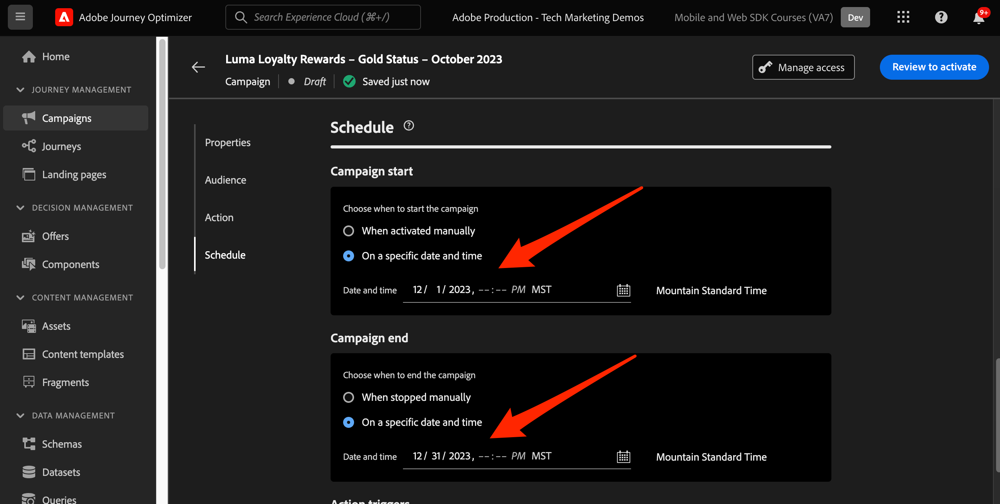
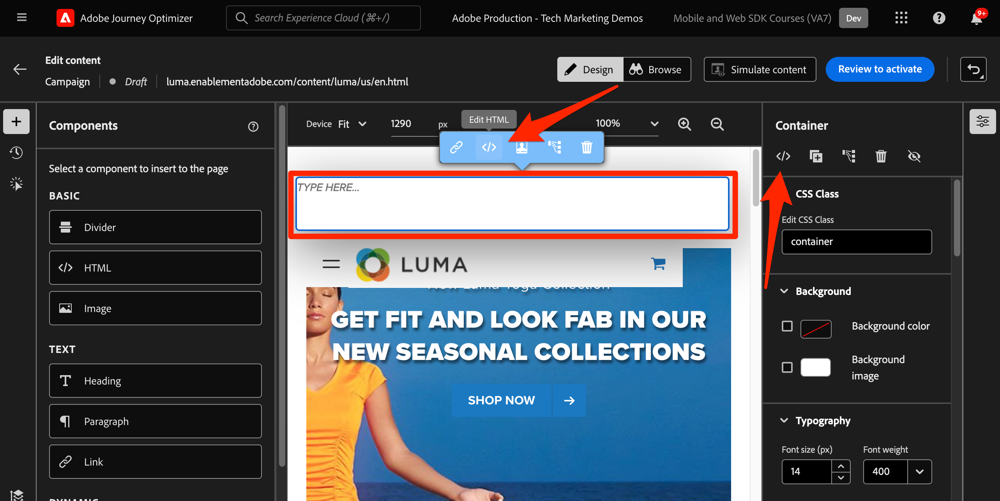

# Einrichten des Journey Optimizer-Webkanals mit dem Web SDK

Erfahren Sie, wie Sie den Adobe Journey Optimizer [Webkanal](https://experienceleague.adobe.com/en/docs/journey-optimizer/using/web/get-started-web) mithilfe des Adobe Experience Platform Web SDK implementieren. In dieser Lektion werden die grundlegenden Voraussetzungen für Webkanäle, detaillierte Konfigurationsschritte und ein tiefer Einblick in einen Anwendungsfall zum Treuestatus gegeben.

In dieser Lektion werden Journey Optimizer-Benutzer für eine erweiterte Online-Personalisierung mit dem Journey Optimizer-Webdesigner mit dem Webkanal ausgestattet.

## Lernziele

Am Ende dieser Lektion können Sie:

* Erfahren Sie mehr über die Funktion und Bedeutung des Web SDK bei der Bereitstellung des Webkanalerlebnisses.
* Machen Sie sich mit dem Erstellen einer Webkanal-Kampagne von Anfang bis Ende vertraut, indem Sie das Anwendungsbeispiel &quot;Prämien für Treue zu Luma&quot;verwenden.
* Konfigurieren Sie die Kampagneneigenschaften, Aktionen und Zeitpläne auf der Benutzeroberfläche.
* Machen Sie sich mit der Funktionalität und den Vorteilen der Adobe Experience Cloud Visual Editing Helper-Erweiterung vertraut.
* Erfahren Sie, wie Sie mit dem Webdesigner Webseiteninhalte bearbeiten, einschließlich Bildern, Kopfzeilen und anderen Elementen.
* Erfahren Sie, wie Sie mithilfe der Komponente Angebotsentscheidung Angebote in eine Webseite einfügen.
* Machen Sie sich mit Best Practices vertraut, um die Qualität und den Erfolg einer Webkanalkampagne sicherzustellen.

## Voraussetzungen

Um die Lektionen in diesem Abschnitt abzuschließen, müssen Sie zunächst:

* Schließen Sie alle Lektionen für die Erstkonfiguration des Platform Web SDK ab, einschließlich der Einrichtung von Datenelementen und Regeln.
* Stellen Sie sicher, dass die Adobe Experience Platform Web SDK-Tag-Erweiterungsversion 2.16 oder höher ist.
* Wenn Sie den Journey Optimizer-Webdesigner verwenden, um Ihr Webkanalerlebnis zu erstellen, stellen Sie sicher, dass Sie entweder die Google Chrome- oder Microsoft® Edge-Browser verwenden.
* Vergewissern Sie sich außerdem, dass Sie die Browsererweiterung [Adobe Experience Cloud Visual Editing Helper Browser](https://chromewebstore.google.com/detail/adobe-experience-cloud-vi/kgmjjkfjacffaebgpkpcllakjifppnca) heruntergeladen und aktiviert haben.
* Stellen Sie sicher, dass in Ihrem Browser Drittanbieter-Cookies zulässig sind. Es kann erforderlich sein, auch alle Anzeigensperren in Ihrem Browser zu deaktivieren.

  >[!CAUTION]
  >
  > Im Journey Optimizer-Webdesigner können bestimmte Websites aus einem der folgenden Gründe nicht zuverlässig geöffnet werden:
  > 
  > 1. Die Website hat strenge Sicherheitsrichtlinien.
  > 1. Die Website ist in einen iframe eingebettet.
  > 1. Die QA- oder Staging-Site des Kunden ist nicht extern zugänglich (es handelt sich um eine interne Site).

* Beim Erstellen von Web-Erlebnissen und Einschließen von Inhalten aus der Adobe Experience Manager Assets Essentials-Bibliothek ist es erforderlich, die Subdomain für die Veröffentlichung dieses Inhalts zu konfigurieren.](https://experienceleague.adobe.com/en/docs/journey-optimizer/using/web/configure-web-channel/web-delegated-subdomains)[
* Stellen Sie bei Verwendung der Inhaltsexperimentierungsfunktion sicher, dass Ihr Webdatensatz auch in Ihrer Berichtskonfiguration enthalten ist.
* Derzeit werden zwei Arten von Implementierungen unterstützt, um die Erstellung und Bereitstellung von Webkanalkampagnen in Ihren Webeigenschaften zu ermöglichen:
   * Nur Client-seitig: Um Ihre Website zu ändern, müssen Sie das Adobe Experience Platform Web SDK implementieren.
   * Hybridmodus: Sie können die Platform Edge Network Server-API verwenden, um eine serverseitige Personalisierung anzufordern. Die Antwort von der API wird dann dem Adobe Experience Platform Web SDK zur Client-seitigen Wiedergabe von Änderungen bereitgestellt. Weitere Informationen finden Sie in der Dokumentation zur Adobe Experience Platform Edge Network Server API . Weitere Details und Implementierungsbeispiele für den Hybridmodus finden Sie in diesem Blogpost.

  >[!NOTE]
  >
  >Die serverseitige Implementierung wird derzeit nicht unterstützt.

## Terminologie

Zunächst sollten Sie die in Webkanalkampagnen verwendete Terminologie verstehen.

* **Webkanal**: Ein Medium für die Kommunikation oder die Bereitstellung von Inhalten über das Internet. Im Kontext dieses Handbuchs bezieht sich es auf den Mechanismus, mit dem personalisierte Inhalte mithilfe des Platform Web SDK innerhalb von Adobe Journey Optimizer an Website-Besucher bereitgestellt werden.
* **Weboberfläche**: Bezieht sich auf eine Webeigenschaft, die durch eine URL identifiziert wird, in der Inhalte bereitgestellt werden. Sie kann eine oder mehrere Webseiten umfassen.
* **Journey Optimizer-Webdesigner**: Ein bestimmtes Tool oder eine bestimmte Benutzeroberfläche in der Journey Optimizer, über das Benutzer ihre Webkanalerlebnisse entwerfen können.
* **Adobe Experience Cloud Visual Editing Helper**: Eine Browsererweiterung, die die visuelle Bearbeitung und Gestaltung von Webkanalerlebnissen unterstützt.
* **Datastream**: Eine Konfiguration innerhalb des Adobe Experience Platform-Dienstes, die sicherstellt, dass Webkanalerlebnisse bereitgestellt werden können.
* **Zusammenführungsrichtlinie**: Eine Konfiguration, die die genaue Aktivierung und Veröffentlichung eingehender Kampagnen sicherstellt.
* **Zielgruppe**: Ein bestimmtes Segment von Benutzern oder Site-Besuchern, die bestimmte Kriterien erfüllen.
* **Web-Designer**: Eine Benutzeroberfläche oder ein Tool, die bei der visuellen Bearbeitung und dem Design von Web-Erlebnissen hilft, ohne tief in den Code zu tauchen.
* **Ausdruckseditor**: Ein Tool im Web-Designer, mit dem Benutzer Web-Inhalten Personalisierungen hinzufügen können, die möglicherweise auf Datenattributen oder anderen Kriterien basieren.
* **Komponente für Angebotsentscheidungen**: Eine Komponente im Webdesigner, die bei der Entscheidung hilft, welches Angebot basierend auf der Entscheidungsverwaltung für einen bestimmten Besucher am besten geeignet ist.
* **Inhaltsexperiment**: Eine Methode, mit der verschiedene Inhaltsvarianten getestet werden können, um herauszufinden, welche Inhaltsvarianten hinsichtlich der gewünschten Metrik am besten funktionieren, z. B. eingehende Klicks.
* **Behandlung**: Im Rahmen von Inhaltsexperimenten bezieht sich eine Behandlung auf eine bestimmte Inhaltsvariante, die mit einer anderen getestet wird.
* **Simulation**: Ein Vorschaumechanismus zur Visualisierung des Webkanalerlebnisses, bevor es für Live-Zielgruppen aktiviert wird.

## Konfigurieren des Datenspeichers

Sie haben den Adobe Experience Platform-Dienst bereits zu Ihrem Datastream hinzugefügt. Jetzt müssen Sie die Adobe Journey Optimizer-Option aktivieren, damit Sie Webkanalerlebnisse bereitstellen können.

So konfigurieren Sie Adobe Journey Optimizer im Datastream:

1. Wechseln Sie zur Oberfläche [Datenerfassung](https://experience.adobe.com/#/data-collection){target="blank"} .
1. Wählen Sie im linken Navigationsbereich **[!UICONTROL Datenspeicher]** aus.
1. Wählen Sie den zuvor erstellten Datenspeicher des Luma Web SDK aus.

   

1. Wählen Sie **[!UICONTROL Bearbeiten]** im Adobe Experience Platform-Dienst aus.

   

1. Aktivieren Sie das Kontrollkästchen **[!UICONTROL Adobe Journey Optimizer]** .

   

1. Wählen Sie **[!UICONTROL Speichern]** aus.

Dadurch wird sichergestellt, dass eingehende Ereignisse für Journey Optimizer vom Adobe Experience Platform-Edge Network ordnungsgemäß verarbeitet werden.

## Zusammenführungsrichtlinie konfigurieren

Stellen Sie sicher, dass eine Zusammenführungsrichtlinie mit der aktivierten Option **[!UICONTROL Active-On-Edge Merge Policy]** definiert ist. Diese Option für Zusammenführungsrichtlinien wird von eingehenden Journey Optimizer-Kanälen verwendet, um die genaue Aktivierung und Veröffentlichung eingehender Kampagnen am Edge-Server sicherzustellen.

So konfigurieren Sie die Option in der Zusammenführungsrichtlinie:

1. Rufen Sie die Seite **[!UICONTROL Kunde]** > **[!UICONTROL Profile]** in der Experience Platform- oder Journey Optimizer-Benutzeroberfläche auf.
1. Wählen Sie die Registerkarte **[!UICONTROL Zusammenführungsrichtlinien]** aus.
1. Wählen Sie Ihre Richtlinie aus (in der Regel ist es am besten, die [!UICONTROL standardmäßige zeitbasierte] Richtlinie zu verwenden) und schalten Sie die Option **[!UICONTROL Active-On-Edge-Zusammenführungsrichtlinie]** im Schritt **[!UICONTROL Konfigurieren]** um.

   

## Konfigurieren des Webdatensatzes für Inhaltsexperimente

Um Inhaltsexperimente in Webkanalkampagnen zu verwenden, müssen Sie sicherstellen, dass der verwendete Webdatensatz auch in Ihrer Berichtskonfiguration enthalten ist. Das Journey Optimizer-Berichterstattungssystem verwendet den Datensatz schreibgeschützt, um native Inhaltsexperimentierungsberichte auszufüllen.

[Das Hinzufügen von Datensätzen für die Berichterstellung zu Inhaltsexperimenten wird in diesem Abschnitt beschrieben.](https://experienceleague.adobe.com/en/docs/journey-optimizer/using/content-management/content-experiment/reporting-configuration#add-datasets)

## Nutzungsszenario - Überblick über Treuebelohnungen

In dieser Lektion wird ein Anwendungsbeispiel für Treuebelohnungen verwendet, um die Implementierung eines Webkanalerlebnisses mit dem Web SDK detailliert zu beschreiben.

In diesem Anwendungsbeispiel wird erläutert, wie Journey Optimizer mithilfe von Journey Optimizer-Kampagnen und Webdesigner dazu beitragen kann, die besten eingehenden Erlebnisse für Ihre Kunden bereitzustellen.

Da dieses Tutorial auf Implementierer ausgerichtet ist, ist zu beachten, dass diese Lektion umfangreiche Arbeit an der Benutzeroberfläche in Journey Optimizer erfordert. Während solche Aufgaben normalerweise von Marketing-Experten verarbeitet werden, können Implementierer Einblicke in den Prozess erhalten, selbst wenn sie normalerweise nicht für die Erstellung von Webkanal-Kampagnen verantwortlich sind.

### Kampagne &quot;Treuebelohnungen erstellen&quot;

Nachdem Sie nun unsere Beispielloyalitätsdaten erfasst und unser Segment erstellt haben, erstellen Sie die Webkanalkampagne &quot;Treuebelohnungen&quot;in Adobe Journey Optimizer.

So erstellen Sie die Beispielkampagne:

1. Öffnen Sie die Oberfläche [Journey Optimizer](https://experience.adobe.com/journey-optimizer/home){target="_blank"} .

   >[!NOTE]
   >
   > Schema, Datensätze und Zielgruppen können auch in der Journey Optimizer-Oberfläche erstellt werden, da es sich um allgemeine Experience Platform-Konstrukte handelt.

1. Navigieren Sie im linken Navigationsbereich zu **[!UICONTROL Journey-Management]** > **[!UICONTROL Kampagnen]** .
1. Klicken Sie oben rechts auf **[!UICONTROL Kampagne erstellen]** .
1. Geben Sie im Abschnitt **[!UICONTROL Eigenschaften]** an, wann Sie die Kampagne ausführen möchten. Wählen Sie für den Anwendungsfall Treuebelohnungen **Geplant** aus.

   

1. Wählen Sie im Abschnitt **[!UICONTROL Aktionen]** den **[!UICONTROL Webkanal]** aus. Wählen Sie als **[!UICONTROL Weboberfläche]** **[!UICONTROL Seiten-URL]** aus.

   >[!NOTE]
   >
   >Eine Weboberfläche bezieht sich auf eine Webeigenschaft, die durch eine URL identifiziert wird, in der Inhalte bereitgestellt werden. Sie kann einer einzelnen Seiten-URL entsprechen oder mehrere Seiten umfassen, sodass Sie Änderungen auf eine oder mehrere Webseiten anwenden können.

1. Wählen Sie die Weboberflächen-Option **[!UICONTROL Seiten-URL]** aus, um das Erlebnis auf einer Seite für diese Kampagne bereitzustellen. Geben Sie die URL für die Seite &quot;Luma&quot;ein, `https://luma.enablementadobe.com/content/luma/us/en.html`

1. Nachdem die Weboberfläche definiert wurde, wählen Sie **[!UICONTROL Erstellen]** aus.

   

1. Fügen Sie nun einige zusätzliche Details zur neuen Webkanalkampagne hinzu. Benennen Sie zuerst die Kampagne. Nennen Sie es &quot;`Luma Loyalty Rewards – Gold Status`&quot;. Optional können Sie der Kampagne eine Beschreibung hinzufügen. Fügen Sie außerdem **[!UICONTROL Tags]** hinzu, um die Gesamttaxonomie der Kampagne zu verbessern.

   

1. Standardmäßig ist die Kampagne für alle Site-Besucher aktiv. Für die Zwecke dieses Anwendungsbeispiels sollte nur Mitgliedern mit Gold-Status-Belohnungen das Erlebnis angezeigt werden. Klicken Sie dazu auf **[!UICONTROL Zielgruppe auswählen]** und wählen Sie die Zielgruppe `Luma Loyalty Rewards – Gold Status` aus.

1. Wählen Sie im Feld **[!UICONTROL Identitäts-Namespace]** den Namespace zur Identifizierung von Einzelpersonen innerhalb des ausgewählten Segments aus. Da Sie die Kampagne auf der Site &quot;Luma&quot;bereitstellen, können Sie den ECID-Namespace auswählen. Profile innerhalb der `Luma Loyalty Rewards – Gold Status` -Zielgruppe, denen der ECID-Namespace unter den verschiedenen Identitäten fehlt, werden von der Webkanalkampagne nicht angesprochen.

   

1. Planen Sie die Kampagne so, dass sie am heutigen Datum beginnt, indem Sie die Option **[!UICONTROL Kampagnenstart]** verwenden und mit der Option **[!UICONTROL Kampagnenende]** in einer Woche enden.

   

>[!NOTE]
>
>Beachten Sie, dass bei Webkanal-Kampagnen das Web-Erlebnis angezeigt wird, wenn der Besucher die Seite öffnet. Im Gegensatz zu anderen Kampagnentypen in Adobe Journey Optimizer ist der Abschnitt **[!UICONTROL Action Trigger]** daher nicht konfigurierbar.

### Experimentieren mit Treuebelohnungsinhalten

Wenn Sie nach oben scrollen, können Sie im Abschnitt **[!UICONTROL Aktion]** optional ein Experiment erstellen, um herauszufinden, welcher Inhalt für die `Luma Loyalty Rewards – Gold Status`-Zielgruppe besser funktioniert. Erstellen und testen wir zwei Behandlungen als Komponente der Kampagnenkonfiguration.

So erstellen Sie das Inhaltsexperiment:

1. Klicken Sie auf **[!UICONTROL Experiment erstellen]**.

   

1. Wählen Sie zuerst eine **[!UICONTROL Erfolgsmetrik]** aus. Dies ist die Metrik zur Bestimmung der Inhaltseffizienz. Wählen Sie **[!UICONTROL Eindeutige eingehende Klicks]** aus, um zu sehen, durch welche Inhaltsbehandlung mehr Klicks auf den Web-Erlebnis-CTA generiert werden.

   

1. Wenn Sie ein Experiment mit einem Webkanal einrichten und die Metriken **[!UICONTROL Eingehende Klicks]**, **[!UICONTROL Eindeutige eingehende Klicks]**, **[!UICONTROL Seitenansichten]** oder **[!UICONTROL Eindeutige Seitenansichten]** auswählen, können Sie mit der Dropdown-Liste **[!UICONTROL Klickaktion]** Klicks und Ansichten auf bestimmten Seiten genau verfolgen und überwachen.

1. Optional können Sie einen **[!UICONTROL Holdout]** festlegen, der keine der beiden Behandlungen erhält. Lassen Sie das vorerst deaktiviert.

1. Wählen Sie optional auch &quot;**[!UICONTROL Gleichmäßig verteilen]**&quot;. Aktivieren Sie diese Option, um sicherzustellen, dass die Behandlungsaufteilungen immer gleichmäßig aufgeteilt sind.

[Erfahren Sie mehr über Inhaltsexperimente im Adobe Journey Optimizer-Webkanal](https://experienceleague.adobe.com/en/docs/journey-optimizer/using/content-management/content-experiment/get-started-experiment).

### Bearbeiten von Inhalten mit Visual Helper

Lassen Sie uns nun das Webkanalerlebnis erstellen. Verwenden Sie dazu den Adobe Experience Cloud **[!UICONTROL Visual Helper]**. Dieses Tool ist eine Browsererweiterung, die mit Google Chrome und Microsoft® Edge kompatibel ist. Vergewissern Sie sich, dass Sie die Erweiterung heruntergeladen haben, bevor Sie versuchen, Ihre Erlebnisse zu erstellen. Stellen Sie außerdem sicher, dass die Webseite das Web SDK enthält.

1. Klicken Sie auf der Registerkarte **[!UICONTROL Aktion]** der Kampagne auf **[!UICONTROL Inhalt bearbeiten]**. Da Sie eine einseitige URL als Oberfläche eingegeben haben, sollten Sie bereit sein, mit der Arbeit im Composer zu beginnen.

   

1. Klicken Sie nun auf **[!UICONTROL Web-Seite bearbeiten]** , um mit dem Authoring zu beginnen.

   

1. Bearbeiten Sie zunächst einige Elemente mithilfe des Web Composer. Bearbeiten Sie über das Kontextmenü die Kopfzeile des Luma-Hero-Bilds. Passen Sie den Stil des Kontextbereichs auf der rechten Seite an.

   

1. Fügen Sie dem Container außerdem mithilfe des Ausdruckseditors **[!UICONTROL Ausdruck-Editors]** Personalisierung hinzu.

   

1. Stellen Sie sicher, dass das Erlebnis ordnungsgemäß nach Klicks verfolgt wird. Wählen Sie **[!UICONTROL Element verfolgen]** aus dem Kontextmenü.

   

1. Verwenden Sie die Komponente **[!UICONTROL Angebotsentscheidung]** , um Angebote in die Webseite einzufügen. Diese Komponente verwendet **[!UICONTROL Entscheidungsverwaltung]** , um das beste Angebot für die Bereitstellung an Luma-Besucher auszuwählen.

### HTML-Designänderungen

Es gibt einige Methoden, wenn Sie erweiterte oder benutzerdefinierte Änderungen an der Site als Komponente der Kampagne &quot;Treuebelohnungen&quot;vornehmen möchten.

Verwenden Sie den Bereich **[!UICONTROL Komponenten]** , um HTML oder anderen Inhalt direkt zur Site &quot;Luma&quot;hinzuzufügen.

Fügen Sie oben auf der Seite eine neue HTML-Komponente hinzu. Bearbeiten Sie die HTML innerhalb der Komponente über die Design-Oberfläche oder den Bereich **[!UICONTROL Kontextuell]** .

Alternativ können Sie HTML-Bearbeitungen aus dem Bereich **[!UICONTROL Änderungen]** hinzufügen. In diesem Bereich können Sie eine Komponente auf der Seite auswählen und sie über die Designer-Benutzeroberfläche bearbeiten.

Fügen Sie im Editor die HTML für die Audience `Luma Loyalty Rewards – Gold Status` hinzu. Wählen Sie **[!UICONTROL Validieren]** aus.

Überprüfen Sie jetzt die neue benutzerdefinierte HTML-Komponente für &quot;fit and Feeling&quot;.

Bearbeiten Sie eine bestimmte Komponente mit der Änderung des **[!UICONTROL CSS-Selektortyps]**.

Fügen Sie benutzerdefinierten Code mithilfe der Änderung **Seite `<head>` Typ** hinzu.

Die Möglichkeiten sind mit dem **[!UICONTROL Visual Helper]** endlos.

### Inhalt der Treuebelohnungen simulieren

Sehen Sie sich eine Vorschau der geänderten Webseite an, bevor Sie die Kampagne aktivieren. Beachten Sie, dass Sie Testprofile für die Simulation von Webkanalerlebnissen konfiguriert haben müssen.

So simulieren Sie das Erlebnis:

1. Wählen Sie **[!UICONTROL Inhalt simulieren]** innerhalb der Kampagne aus.

   

1. Wählen Sie ein Testprofil aus, um die Simulation zu erhalten. Beachten Sie, dass sich das Testprofil in der Audience `Luma Loyalty Rewards – Gold Status` befinden sollte, um die richtige Behandlung zu erhalten.

1. Die Vorschau wird für das Testprofil angezeigt.

### Aktivieren der Kampagne &quot;Treuebelohnungen&quot;

Aktivieren Sie abschließend die Webkanal-Kampagne.

1. Wählen Sie **Überprüfen, um zu aktivieren**.

1. Sie werden aufgefordert, die Kampagnendetails ein letztes Mal zu bestätigen. Wählen Sie **[!UICONTROL Aktivieren]** aus. Es kann bis zu 15 Minuten dauern, bis die Kampagne auf der Site live ist.

### Treuebelohnungen QA

Es gibt einige Anmeldungen, mit denen Sie Benutzer mit dem Status &quot;Gold&quot;simulieren und sich für Ihre Kampagne qualifizieren können:

1. `cleavlandeuler@emailsim.io`/`test`
1. `leftybeagen@emailsim.io`/`test`
1. `jenimartinho@emailsim.io`/`test`

Als Best Practice wird empfohlen, den Tab **[!UICONTROL Web]** der Live- und globalen Berichte der Kampagne für die kampagnenspezifischen KPIs zu überwachen. Überwachen Sie für diese Kampagne Erlebnisimpressionen und Klickrate.

### Webkanalvalidierung mithilfe von Adobe Experience Platform Debugger

Die Adobe Experience Platform Debugger-Erweiterung, die sowohl für Chrome als auch Firefox verfügbar ist, analysiert Ihre Webseiten, um Probleme bei der Implementierung von Adobe Experience Cloud-Lösungen zu identifizieren.

Sie können den Debugger auf der Site &quot;Luma&quot;verwenden, um das Webkanalerlebnis in der Produktion zu überprüfen. Dies ist eine Best Practice, sobald der Anwendungsfall &quot;Loyalitätsbelohnungen&quot;aktiv ist, um sicherzustellen, dass alles korrekt konfiguriert ist.

[Erfahren Sie hier, wie Sie den Debugger in Ihrem Browser mithilfe des Leitfadens konfigurieren](https://experienceleague.adobe.com/en/docs/platform-learn/data-collection/debugger/overview).

So starten Sie die Validierung mit dem Debugger:

1. Navigieren Sie zur Webseite &quot;Luma&quot;mit dem Webkanal-Erlebnis.
   <!--
    
    -->
1. Öffnen Sie auf der Webseite den Adobe Experience Platform Debugger **[!UICONTROL 1}.]**
   <!--
    
    -->
1. Navigieren Sie zu **Zusammenfassung**. Stellen Sie sicher, dass die **[!UICONTROL Datastream-ID]** mit dem **[!UICONTROL Datastream]** in der **[!UICONTROL Adobe-Datenerfassung]** übereinstimmt, für den Sie Adobe Journey Optimizer aktiviert haben.
   <!--
    
    -->
1. Anschließend können Sie sich mit verschiedenen Treuekonten von Luma bei der Site anmelden und den Debugger verwenden, um die an das Adobe Experience Platform-Edge Network gesendeten Anforderungen zu validieren.
   <!--
    
    -->
1. Navigieren Sie unter **[!UICONTROL Lösungen]** zum **[!UICONTROL Experience Platform Web SDK]**.
   <!--
    
    -->
1. Schalten Sie auf der Registerkarte **Konfiguration** die Option **[!UICONTROL Debugging aktivieren]** um. Dadurch wird die Protokollierung für die Sitzung in einer **[!UICONTROL Adobe Experience Platform Assurance]**-Sitzung aktiviert.
   <!--
    
    -->
1. Melden Sie sich mit verschiedenen Treuekonten von Luma bei der Site an und validieren Sie mithilfe des Debuggers die an das Adobe Experience Platform Edge-Netzwerk gesendeten Anforderungen.]****[!UICONTROL  Alle diese Anfragen sollten in **[!UICONTROL Assurance]** für die Protokollverfolgung erfasst werden.
<!--
   
-->

[Weiter: ](setup-decision-management.md)

>[!NOTE]
>
>Vielen Dank, dass Sie Ihre Zeit investiert haben, um mehr über das Adobe Experience Platform Web SDK zu erfahren. Wenn Sie Fragen haben, ein allgemeines Feedback teilen oder Anregungen zu künftigen Inhalten haben möchten, teilen Sie diese bitte in diesem [Experience League Community-Diskussionsbeitrag](https://experienceleaguecommunities.adobe.com/t5/adobe-experience-platform-data/tutorial-discussion-implement-adobe-experience-cloud-with-web/td-p/444996) mit.
