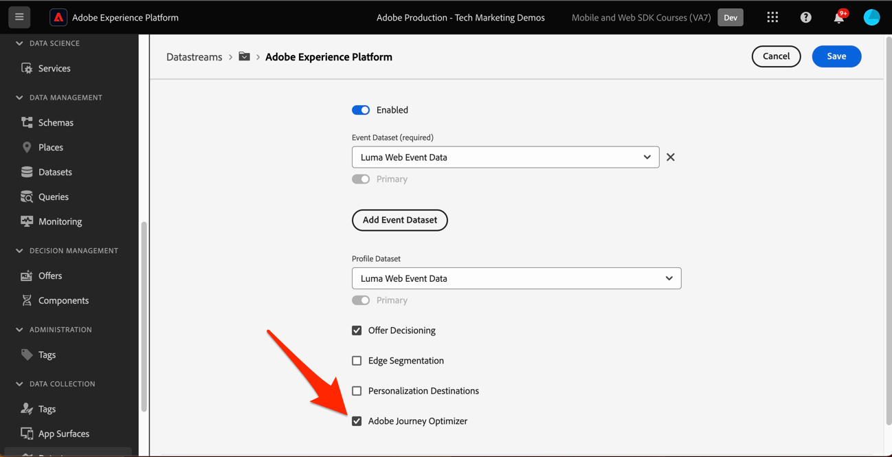
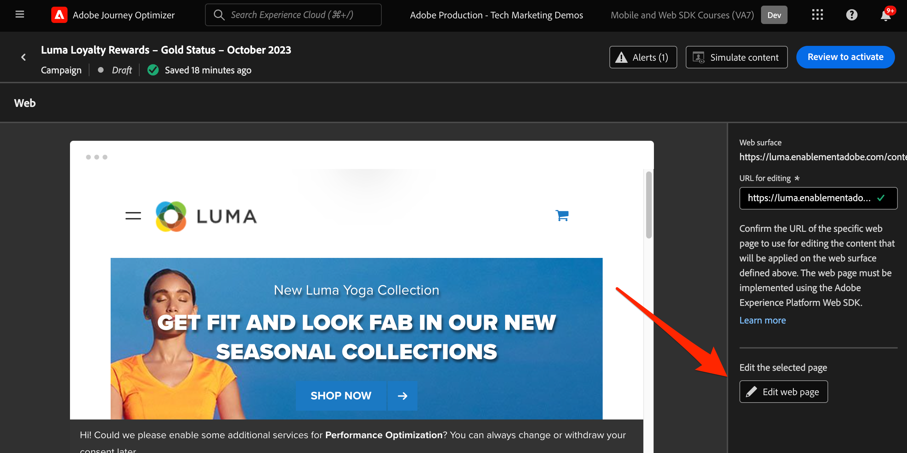

# Einrichten des Journey Optimizer-Webkanals mit Web SDK

Erfahren Sie, wie Sie den Adobe Journey Optimizer [Webkanal) &#x200B;](https://experienceleague.adobe.com/de/docs/journey-optimizer/using/web/get-started-web) Adobe Experience Platform Web SDK implementieren. In dieser Lektion werden die grundlegenden Voraussetzungen für den Web-Kanal, detaillierte Schritte für die Konfiguration und ein tiefer Einblick in einen Anwendungsfall mit Schwerpunkt auf dem Treuestatus behandelt.

In dieser Lektion können Journey Optimizer-Benutzer den Web-Kanal für die erweiterte Online-Personalisierung mit dem Journey Optimizer-Web-Designer verwenden.

>[!WARNING]
>
> Die in diesem Tutorial verwendete Luma-Website wird voraussichtlich in der Woche vom 16. Februar 2026 ersetzt. Die im Rahmen dieses Tutorials durchgeführten Arbeiten sind möglicherweise nicht auf die neue Website anwendbar.

## Lernziele

Am Ende dieser Lektion können Sie:

* Machen Sie sich mit der Funktion und Bedeutung von Web SDK bei der Bereitstellung des Web-Kanalerlebnisses vertraut.
* Verstehen Sie den Prozess der Erstellung einer Web-Kanal-Kampagne von Anfang bis Ende unter Verwendung des Beispiels für den Anwendungsfall „Luma-Treueprämien“.
* Konfigurieren Sie Kampagneneigenschaften, Aktionen und Zeitpläne in der Benutzeroberfläche.
* Machen Sie sich mit der Funktionalität und den Vorteilen der Adobe Experience Cloud Visual Editing Helper-Erweiterung vertraut.
* Erfahren Sie, wie Sie Web-Seiteninhalte, einschließlich Bilder, Kopfzeilen und anderer Elemente, mit dem Web-Designer bearbeiten.
* Erfahren Sie, wie Sie mithilfe der Komponente Angebotsentscheidung Angebote in eine Web-Seite einfügen können.
* Machen Sie sich mit den Best Practices vertraut, um die Qualität und den Erfolg einer Web-Kanal-Kampagne sicherzustellen.

## Voraussetzungen

Um die Lektionen in diesem Abschnitt abzuschließen, müssen Sie zunächst:

* Schließen Sie alle Lektionen für die Erstkonfiguration von Platform Web SDK ab, einschließlich der Einrichtung von Datenelementen und Regeln.
* Stellen Sie sicher, dass Ihre Adobe Experience Platform Web SDK Tags-Erweiterungsversion 2.16 oder höher ist.
* Wenn Sie den Journey Optimizer-Web-Designer zum Erstellen Ihres Web-Kanal-Erlebnisses verwenden, stellen Sie sicher, dass Sie entweder den Google Chrome- oder den Microsoft® Edge-Browser verwenden.
* Stellen Sie außerdem sicher, dass Sie die Browser-Erweiterung [Adobe Experience Cloud Visual Editing Helper heruntergeladen und aktiviert &#x200B;](https://chromewebstore.google.com/detail/adobe-experience-cloud-vi/kgmjjkfjacffaebgpkpcllakjifppnca).
* Stellen Sie sicher, dass Drittanbieter-Cookies in Ihrem Browser zulässig sind. Möglicherweise müssen Sie auch alle Anzeigenblocker in Ihrem Browser deaktivieren.

  >[!CAUTION]
  >
  > Im Journey Optimizer-Web-Designer können bestimmte Websites aus einem der folgenden Gründe nicht zuverlässig geöffnet werden:
  > 
  > 1. Die Website verfügt über strenge Sicherheitsrichtlinien.
  > 1. Die Website ist in einen iframe eingebettet.
  > 1. Die QA- oder Staging-Site des Kunden ist nicht von außen zugänglich (es handelt sich um eine interne Site).

* Beim Erstellen von Web-Erlebnissen und Einschließen von Inhalten aus der Adobe Experience Manager Assets Essentials-Bibliothek ist es erforderlich, [die Subdomain zum Veröffentlichen dieses Inhalts zu konfigurieren](https://experienceleague.adobe.com/de/docs/journey-optimizer/using/web/configure-web-channel/web-delegated-subdomains).
* Wenn Sie die Funktion für Inhaltsexperimente verwenden, stellen Sie sicher, dass Ihr Web-Datensatz auch in Ihrer Berichtskonfiguration enthalten ist.
* Derzeit werden zwei Arten von Implementierungen unterstützt, um die Erstellung und Bereitstellung von Web-Kanal-Kampagnen in Ihren Web-Eigenschaften zu ermöglichen:
   * Nur Client-seitig: Um Ihre Website zu ändern, müssen Sie die Adobe Experience Platform Web SDK implementieren.
   * Hybridmodus: Sie können die Platform Edge Network Server-API verwenden, um eine Personalisierung Server-seitig anzufordern. Die Antwort der API wird dann zur Client-seitigen Rendering-Änderung an die Adobe Experience Platform Web SDK übermittelt. Weitere Informationen finden Sie in der Dokumentation zur Adobe Experience Platform Edge Network-Server-API . Weitere Details und Implementierungsbeispiele für den Hybridmodus finden Sie in diesem Blogpost .

  >[!NOTE]
  >
  >Die Implementierung nur auf Server-Seite wird derzeit nicht unterstützt.

## Terminologie

Zunächst sollten Sie die in Web-Kanal-Kampagnen verwendete Terminologie verstehen.

* **Web-Kanal**: Ein Medium für die Kommunikation oder die Bereitstellung von Inhalten über das Web. Im Kontext dieses Handbuchs bezieht es sich auf den Mechanismus, mit dem personalisierte Inhalte für Website-Besuchende mithilfe der Platform Web SDK in Adobe Journey Optimizer bereitgestellt werden.
* **Web-Oberfläche**: Bezieht sich auf eine Web-Eigenschaft, die durch eine URL identifiziert wird, über die Inhalte bereitgestellt werden. Es kann eine einzelne oder mehrere Web-Seiten umfassen.
* **Journey Optimizer-Web-Designer**: Ein bestimmtes Tool oder eine bestimmte Benutzeroberfläche innerhalb der Journey Optimizer, mit dem bzw. der Benutzende ihre Web-Kanal-Erlebnisse entwerfen können.
* **Adobe Experience Cloud Visual Editing Helper**: Eine Browser-Erweiterung, die bei der visuellen Bearbeitung und Gestaltung von Web-Kanal-Erlebnissen hilft.
* **Datenstrom**: Eine Konfiguration innerhalb des Adobe Experience Platform-Service, die sicherstellt, dass Web-Kanalerlebnisse bereitgestellt werden können.
* **Zusammenführungsrichtlinie**: Eine Konfiguration, die die genaue Aktivierung und Veröffentlichung eingehender Kampagnen sicherstellt.
* **Audience**: Ein bestimmtes Segment von Benutzern oder Website-Besuchern, die bestimmte Kriterien erfüllen.
* **Web-Designer**: Eine Oberfläche oder ein Tool, die bzw. das die visuelle Bearbeitung und Gestaltung von Web-Erlebnissen unterstützt, ohne tief in Code einzutauchen.
* **Ausdruckseditor**: Ein Tool innerhalb des Web-Designers, mit dem Benutzer Web-Inhalten Personalisierungen hinzufügen können, möglicherweise basierend auf Datenattributen oder anderen Kriterien.
* **Komponente Angebotsentscheidung**: Eine Komponente im Web-Designer, die bei der Entscheidung hilft, welches Angebot basierend auf dem Entscheidungs-Management am besten für einen bestimmten Besucher angezeigt werden kann.
* **Inhaltsexperiment**: Eine Methode zum Testen verschiedener Inhaltsvarianten, um herauszufinden, welche bei der gewünschten Metrik am besten abschneidet, z. B. eingehende Klicks.
* **Behandlung**: Im Kontext von Inhaltsexperimenten bezieht sich eine Behandlung auf eine bestimmte Inhaltsvariante, die gegen eine andere getestet wird.
* **Simulation**: Ein Vorschaumechanismus, mit dem das Web-Kanalerlebnis vor der Aktivierung für Live-Zielgruppen visualisiert wird.

## Konfigurieren des Datenstroms

Sie haben den Adobe Experience Platform-Service bereits zu Ihrem Datenstrom hinzugefügt. Jetzt müssen Sie die Option Adobe Journey Optimizer aktivieren, damit Sie Web-Kanalerlebnisse bereitstellen können.

So konfigurieren Sie Adobe Journey Optimizer im Datenstrom:

1. Navigieren Sie zur [Datenerfassung](https://experience.adobe.com/#/data-collection){target="blank"}.
1. Wählen Sie in der linken Navigation **[!UICONTROL Datenströme]** aus.
1. Wählen Sie den zuvor erstellten Luma Web SDK-Datenstrom aus.

   

1. Wählen Sie **[!UICONTROL Bearbeiten]** im Adobe Experience Platform-Service aus.

   

1. Aktivieren Sie das Kontrollkästchen **&#x200B;**&#x200B;Adobe Journey Optimizer.

   

1. Wählen Sie **[!UICONTROL Speichern]** aus.

Dadurch wird sichergestellt, dass eingehende Ereignisse für Journey Optimizer von Adobe Experience Platform Edge Network korrekt verarbeitet werden.

## Konfigurieren der Zusammenführungsrichtlinie

Stellen Sie sicher, dass eine Zusammenführungsrichtlinie definiert ist, wenn **[!UICONTROL Option „Active-On-Edge-Zusammenführungsrichtlinie]** aktiviert ist. Diese Option für Zusammenführungsrichtlinien wird von eingehenden Journey Optimizer-Kanälen verwendet, um eine genaue Aktivierung und Veröffentlichung eingehender Kampagnen am Edge sicherzustellen.

So konfigurieren Sie die Option in der Zusammenführungsrichtlinie:

1. Gehen Sie auf die **[!UICONTROL Kunde]** > **[!UICONTROL Profile]** in der Benutzeroberfläche von Experience Platform oder Journey Optimizer.
1. Wählen Sie die **[!UICONTROL Zusammenführungsrichtlinien]** aus.
1. Wählen Sie Ihre Richtlinie aus (es ist in der Regel am besten, die Richtlinie [!UICONTROL Standardzeitbasiert] zu verwenden) und schalten Sie die **[!UICONTROL Zusammenführungsrichtlinie von Active]** On-Edge) im **[!UICONTROL Konfigurieren]** ein.

   

## Konfigurieren des Web-Datensatzes für Inhaltsexperimente

Um Inhaltsexperimente in Web-Kanal-Kampagnen zu verwenden, müssen Sie sicherstellen, dass der verwendete Web-Datensatz auch in Ihrer Berichtskonfiguration enthalten ist. Das Journey Optimizer-Berichtssystem verwendet den Datensatz schreibgeschützt, um vordefinierte Inhaltsexperimentberichte auszufüllen.

[Das Hinzufügen von Datensätzen für das Reporting zu Inhaltsexperimenten wird in diesem Abschnitt beschrieben](https://experienceleague.adobe.com/de/docs/journey-optimizer/using/reporting/channel-report/reporting-configuration#add-datasets).

## Anwendungsfall - Übersicht - Treueprämien

In dieser Lektion wird ein Beispiel für einen Anwendungsfall mit Treueprämien verwendet, um die Implementierung eines Web-Kanalerlebnisses mithilfe der Web-SDK detailliert zu beschreiben.

In diesem Anwendungsbeispiel erfahren Sie, wie Journey Optimizer Ihren Kunden mithilfe von Journey Optimizer-Kampagnen und dem Web-Designer die besten eingehenden Erlebnisse bereitstellen kann.

Da sich dieses Tutorial an Implementierer richtet, sollten Sie beachten, dass diese Lektion umfangreiche Schnittstellenarbeiten in Journey Optimizer umfasst. Obwohl diese Schnittstellenaufgaben normalerweise von Marketing-Experten durchgeführt werden, kann es für Implementierer von Vorteil sein, insight in den Prozess zu integrieren, auch wenn sie normalerweise nicht für die Erstellung von Web-Kanal-Kampagnen verantwortlich sind.

### Erstellen einer Treueprämien-Kampagne

Nachdem Sie nun unsere Beispiel-Treueprogramm-Daten aufgenommen und unser Segment erstellt haben, erstellen Sie in Adobe Journey Optimizer die Web-Kanalkampagne für Treueprämien .

So erstellen Sie eine Beispielkampagne:

1. Öffnen der [Journey Optimizer](https://experience.adobe.com/journey-optimizer/home){target="_blank"}-Benutzeroberfläche

   >[!NOTE]
   >
   > Schema, Datensätze und Zielgruppen können auch in der Journey Optimizer-Benutzeroberfläche erstellt werden, da sie alle gängige Experience Platform-Konstrukte sind.

1. Navigieren Sie im linken Navigationsbereich zu &lbrace;0 **[!UICONTROL JourneyManagement >]** Kampagnen **[!UICONTROL .]**
1. Klicken **[!UICONTROL oben]** auf „Kampagne erstellen“.
1. Geben Sie im Abschnitt **[!UICONTROL Eigenschaften]** an, wann Sie die Kampagne ausführen möchten. Wählen Sie für den Anwendungsfall „Treueprämien“ die Option **Geplant**.

   

1. Wählen Sie **[!UICONTROL Abschnitt]** Aktionen“ den **[!UICONTROL Webkanal]**. Wählen Sie als **[!UICONTROL Web-Oberfläche]** die Option **[!UICONTROL Seiten-URL]**.

   >[!NOTE]
   >
   >Eine Web-Oberfläche bezieht sich auf eine Web-Eigenschaft, die durch eine URL identifiziert wird, über die Inhalte bereitgestellt werden. Sie kann einer einzelnen Seiten-URL entsprechen oder mehrere Seiten umfassen, sodass Sie Änderungen auf eine oder mehrere Web-Seiten anwenden können.

1. Wählen Sie die Option **[!UICONTROL Seiten-URL]** Web-Oberfläche aus, um das Erlebnis für diese Kampagne auf einer Seite bereitzustellen. Geben Sie die URL für die Luma-Seite `https://luma.enablementadobe.com/content/luma/us/en.html`

1. Nachdem die Web-Oberfläche definiert wurde, wählen Sie **[!UICONTROL Erstellen]** aus.

   

1. Fügen Sie der neuen Web-Kanal-Kampagne jetzt einige zusätzliche Details hinzu. Nennen Sie zunächst die Kampagne. Nennen Sie es `Luma Loyalty Rewards – Gold Status`. Optional können Sie der Kampagne eine Beschreibung hinzufügen. Fügen Sie außerdem **[!UICONTROL Tags]** hinzu, um die allgemeine Kampagnentaxonomie zu verbessern.

   

1. Standardmäßig ist die Kampagne für alle Site-Besucher aktiv. Für die Zwecke dieses Anwendungsfalls sollten nur Gold Status-Belohnungsmitglieder das Erlebnis sehen. Klicken Sie dazu auf **[!UICONTROL Zielgruppe auswählen]** und wählen Sie die `Luma Loyalty Rewards – Gold Status` Zielgruppe aus.

1. Wählen Sie im Feld **[!UICONTROL Identity]** Namespace den Namespace aus, mit dem Einzelpersonen innerhalb des ausgewählten Segments identifiziert werden können. Da Sie die Kampagne auf der Luma-Site bereitstellen, können Sie den ECID-Namespace auswählen. Profile innerhalb der `Luma Loyalty Rewards – Gold Status` Zielgruppe, denen der ECID-Namespace unter den verschiedenen Identitäten fehlt, werden nicht in die Web-Kanal-Kampagne einbezogen.

   

1. Planen Sie die Kampagne so, dass sie am heutigen Datum beginnt, indem Sie die Option **[!UICONTROL Kampagnenstart]** verwenden, und endet in einer Woche mit der Option **[!UICONTROL Kampagnenende]**.

   

>[!NOTE]
>
>Beachten Sie, dass bei Web-Kanal-Kampagnen das Web-Erlebnis angezeigt wird, wenn der Besucher die Seite öffnet. Im Gegensatz zu anderen Kampagnentypen in Adobe Journey Optimizer Trigger kann daher **[!UICONTROL Abschnitt]** Aktionskampagnen“ nicht konfiguriert werden.

### Experimentieren mit Inhalten aus Treueprämien

Wenn Sie im Abschnitt **[!UICONTROL Aktion]** nach oben scrollen, können Sie optional ein Experiment erstellen, um zu testen, welche Inhalte für die `Luma Loyalty Rewards – Gold Status` Zielgruppe besser funktionieren. Als Komponente der Kampagnenkonfiguration erstellen und testen wir zwei Behandlungen.

So erstellen Sie das Inhaltsexperiment:

1. Klicken Sie auf **[!UICONTROL Experiment erstellen]**.

   

1. Wählen Sie zunächst eine **[!UICONTROL Erfolgsmetrik]**. Dies ist die Metrik zur Bestimmung der Content-Effektivität. Wählen Sie **[!UICONTROL Eindeutige eingehende Klicks]**, um zu sehen, durch welche Inhaltsbehandlung mehr Klicks auf das Web-Erlebnis-CTA generiert werden.

   

1. Beim Einrichten eines Experiments mit dem Webkanal und Auswählen der Metriken **[!UICONTROL Eingehende Klicks]**, **[!UICONTROL Eindeutige eingehende Klicks]**, **[!UICONTROL Seitenansichten]** oder **[!UICONTROL Eindeutige Seitenansichten]** ermöglicht Ihnen das Dropdown-Menü **[!UICONTROL Klick-Aktion]**, Klicks und Ansichten auf bestimmten Seiten präzise zu verfolgen und zu überwachen.

1. Optional können Sie einen &quot;**[!UICONTROL &quot; festlegen]** der keine der beiden Behandlungen erhält. Lassen Sie diese Option vorerst deaktiviert.

1. Wählen Sie optional „Gleichmäßig **[!UICONTROL &quot;]**. Aktivieren Sie diese Option, um sicherzustellen, dass die Abwandlungsverteilungen immer gleichmäßig aufgeteilt werden.

[Erfahren Sie mehr über Inhaltsexperimente im Adobe Journey Optimizer-Webkanal](https://experienceleague.adobe.com/de/docs/journey-optimizer/using/content-management/content-experiment/get-started-experiment).

### Bearbeiten von Inhalten mit dem Visual Helper

Lassen Sie uns nun das Web-Kanal-Erlebnis erstellen. Verwenden Sie dazu die Adobe Experience Cloud **[!UICONTROL Visual Helper]**. Dieses Tool ist eine Browser-Erweiterung, die mit Google Chrome und Microsoft® Edge kompatibel ist. Stellen Sie sicher, dass Sie die Erweiterung heruntergeladen haben, bevor Sie versuchen, Ihre Erlebnisse zu erstellen. Stellen Sie außerdem sicher, dass die Web-Seite die Web-SDK enthält.

1. Klicken Sie auf **[!UICONTROL Registerkarte]** Aktion“ der Kampagne auf **[!UICONTROL Inhalt bearbeiten]**. Da Sie eine einzelne Seiten-URL als Oberfläche eingegeben haben, sollten Sie bereit sein, im Composer zu arbeiten.

   

1. Klicken Sie jetzt auf **[!UICONTROL Web-Seite bearbeiten]** um mit dem Authoring zu beginnen.

   

1. Bearbeiten Sie zunächst einige Elemente mit dem Web-Composer. Verwenden Sie das Kontextmenü, um die Bildkopfzeile „Luma Hero“ zu bearbeiten. Passen Sie den Stil des kontextuellen Bereichs auf der rechten Seite an.

   

1. Fügen Sie dem Container auch mithilfe des **[!UICONTROL Ausdruckseditors“ eine Personalisierung]**.

   

1. Stellen Sie sicher, dass das Erlebnis für Klicks ordnungsgemäß verfolgt wird. Wählen Sie **[!UICONTROL Klick-Tracking]** aus dem Kontextmenü aus.

   

1. Verwenden Sie die Komponente **[!UICONTROL Angebotsentscheidung]**, um Angebote in die Web-Seite einzufügen. Diese Komponente verwendet **[!UICONTROL Entscheidungs-Management]**, um das beste Angebot für Luma-Besucher auszuwählen.

### HTML-Design-Änderungen

Es stehen einige Methoden zur Verfügung, wenn Sie erweiterte oder benutzerdefinierte Änderungen an der Website als Komponente der Treuebelohnungs-Kampagne vornehmen möchten.

Verwenden Sie den Bereich **[!UICONTROL Komponenten]**, um HTML oder andere Inhalte direkt zur Luma-Site hinzuzufügen.

Fügen Sie oben auf der Seite eine neue HTML-Komponente hinzu. Bearbeiten Sie die HTML innerhalb der Komponente über die Design-Oberfläche oder den **[!UICONTROL kontextuellen]** Bereich.

Alternativ können Sie HTML-Bearbeitungen über den Bereich **[!UICONTROL Änderungen]** hinzufügen. In diesem Bereich können Sie eine Komponente auf der Seite auswählen und sie über die Designer-Benutzeroberfläche bearbeiten.

Fügen Sie im Editor die HTML für die `Luma Loyalty Rewards – Gold Status` Audience hinzu. Wählen Sie **[!UICONTROL Validieren]** aus.

Überprüfen Sie jetzt die neue benutzerdefinierte HTML-Komponente auf Anpassungsfähigkeit.

Bearbeiten Sie eine bestimmte Komponente mit der **[!UICONTROL CSS-Selektortyp]**-Änderung.

Fügen Sie benutzerdefinierten Code mit der **Page-`<head>`-Typ** hinzu.

Die Möglichkeiten sind endlos mit dem **[!UICONTROL Visual Helper]**.

### Inhalt von Treueprämien simulieren

Sehen Sie sich eine Vorschau der geänderten Web-Seite an, bevor Sie die Kampagne aktivieren. Beachten Sie, dass Sie Testprofile konfigurieren müssen, um Web-Kanal-Erlebnisse zu simulieren.

So simulieren Sie das Erlebnis:

1. Wählen Sie **[!UICONTROL Inhalt simulieren]** innerhalb der Kampagne aus.

   

1. Wählen Sie ein Testprofil aus, um die Simulation zu erhalten. Denken Sie daran, dass sich das Testprofil in der `Luma Loyalty Rewards – Gold Status` Zielgruppe befinden sollte, um die korrekte Behandlung zu erhalten.

1. Die Vorschau wird für das Testprofil angezeigt.

### Aktivieren der Kampagne „Treueprämien“

Aktivieren Sie abschließend die Web-Kanal-Kampagne .

1. Wählen Sie **Zum Aktivieren überprüfen** aus.

1. Sie werden aufgefordert, die Kampagnendetails ein letztes Mal zu bestätigen. Wählen Sie **[!UICONTROL Aktivieren]** aus. Es kann bis zu 15 Minuten dauern, bis die Kampagne auf der Website live geschaltet wird.

### Treueprämien-QA

Es gibt einige Anmeldedaten, mit denen Sie „Gold-Status“-Benutzer simulieren und sich für Ihre Kampagne qualifizieren können:

1. `cleavlandeuler@emailsim.io`/`test`
1. `leftybeagen@emailsim.io`/`test`
1. `jenimartinho@emailsim.io`/`test`

Es empfiehlt sich, für die kampagnenspezifischen KPIs die Registerkarte **[!UICONTROL Web]** der Live- und globalen Berichte der Kampagne zu überwachen. Überwachen Sie für diese Kampagne Erlebnis-Impressions und die Klickrate.

### Web-Kanalvalidierung mit Adobe Experience Platform Debugger

Die für Chrome und Firefox verfügbare Adobe Experience Platform Debugger-Erweiterung analysiert Ihre Web-Seiten, um Probleme bei der Implementierung von Adobe Experience Cloud-Lösungen zu identifizieren.

Sie können den Debugger auf der Luma-Site verwenden, um das Web-Kanalerlebnis in der Produktion zu validieren. Dies ist eine Best Practice, sobald der Anwendungsfall Treueprämien ausgeführt wird, um sicherzustellen, dass alles richtig konfiguriert ist.

[Hier erfahren Sie, wie Sie den Debugger in Ihrem Browser mithilfe des Handbuchs konfigurieren](https://experienceleague.adobe.com/de/docs/platform-learn/data-collection/debugger/overview).

So starten Sie die Validierung mit dem Debugger:

1. Navigieren Sie mit dem Web-Kanal zur Web-Seite von Luma .
   <!--
    
    -->
1. Öffnen Sie auf der Webseite die **[!UICONTROL Adobe Experience Platform Debugger]**.
   <!--
    
    -->
1. Navigieren Sie zu **Zusammenfassung**. Überprüfen Sie, ob **[!UICONTROL Datenstrom-ID]** mit dem **[!UICONTROL Datenstrom]** in der **[!UICONTROL Adobe-]** übereinstimmt, für den Sie Adobe Journey Optimizer aktiviert haben.
   <!--
    
    -->
1. Sie können sich dann mit verschiedenen Luma-Treuekonten bei der Website anmelden und den Debugger verwenden, um die an die Adobe Experience Platform-Edge Network gesendeten Anfragen zu validieren.
   <!--
    
    -->
1. Navigieren **[!UICONTROL unter &quot;]**&quot; zur **[!UICONTROL Experience Platform Web SDK]**.
   <!--
    
    -->
1. Schalten Sie auf der **Konfiguration** die Option **[!UICONTROL Debugging aktivieren]** ein. Dadurch wird die Protokollierung für die Sitzung innerhalb einer **[!UICONTROL Adobe Experience Platform Assurance]**-Sitzung aktiviert.
   <!--
    
    -->
1. Melden Sie sich bei der Site mit verschiedenen Luma-Treuekonten an und verwenden Sie den Debugger, um die an das **[!UICONTROL Adobe Experience Platform Edge-Netzwerk gesendeten Anfragen zu]**. Alle diese Anfragen sollten zur Protokollverfolgung in **[!UICONTROL Assurance]** erfasst werden.
<!--
   
-->

>[!NOTE]
>
>Vielen Dank, dass Sie sich Zeit genommen haben, um mehr über Adobe Experience Platform Web SDK zu erfahren. Wenn Sie Fragen haben, allgemeines Feedback geben möchten oder Vorschläge für zukünftige Inhalte haben, teilen Sie diese bitte auf diesem [Experience League Community-Diskussionsbeitrag](https://experienceleaguecommunities.adobe.com/t5/adobe-experience-platform-data/tutorial-discussion-implement-adobe-experience-cloud-with-web/td-p/444996?profile.language=de)
