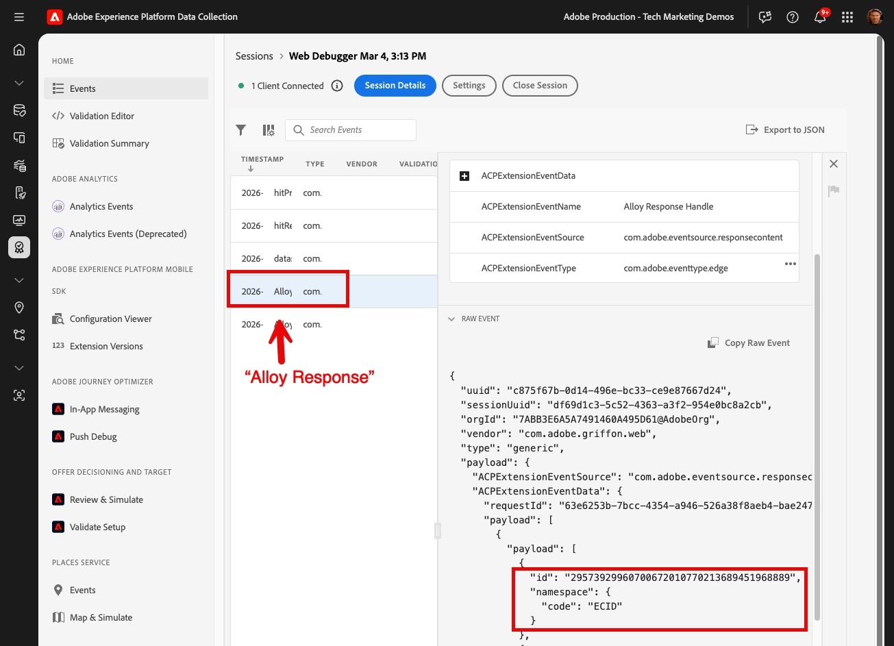

# Validieren von Web SDK-Implementierungen mit Experience Platform Assurance

[Adobe Experience Platform Assurance](https://experienceleague.adobe.com/de/docs/experience-platform/assurance/home) ist eine Funktion, mit der Sie die Datenerfassung und die Bereitstellung von Erlebnissen untersuchen, testen, simulieren und validieren können.

Wie Sie in der Lektion [Konfigurieren eines Datenstroms](configure-datastream.md) gelernt haben, sendet Platform Web SDK zunächst Daten von Ihrer digitalen Eigenschaft an Platform Edge Network. Anschließend leitet Platform Edge Network die Daten an die in Ihrem Datenstrom aktivierten Services weiter. Sie können die in und aus Platform Edge Network eingehenden Anfragen mithilfe von Assurance validieren.

## Lernziele

Am Ende dieser Lektion können Sie:

* Starten einer Assurance-Sitzung
* Anzeigen von Anfragen, die an und von Platform Edge Network gesendet werden

## Voraussetzungen

Sie sind mit Datenerfassungs-Tags und der [Demo-Site von Luma](https://luma.enablementadobe.com){target="_blank"} vertraut und haben die vorherigen Lektionen im Tutorial abgeschlossen:

* [Konfigurieren eines XDM-Schemas](configure-schemas.md)
* [Konfigurieren eines Identity-Namespace](configure-identities.md)
* [Konfigurieren eines Datenstroms](configure-datastream.md)
* [In der Tag-Eigenschaft installierte Web SDK-Erweiterung](install-web-sdk.md)
* [Datenelemente erstellen](create-data-elements.md)
* [Erfassen von Identitäten](create-identities.md)
* [Erstellen einer Tag-Regel](create-tag-rule.md)
* [Validieren mit Debugger](validate-with-debugger.md)

## Starten und Anzeigen einer Assurance-Sitzung

Es gibt mehrere Möglichkeiten, eine Assurance-Sitzung zu starten.

### Aktivieren von Edge Trace im Debugger

So aktivieren Sie Edge Trace:

1. Wechseln Sie zur [Demo-Site von Luma](https://luma.enablementadobe.com) und verwenden Sie den Debugger, [&#x200B; die Tag-Eigenschaft auf der Site in Ihre eigene Entwicklungseigenschaft zu wechseln](validate-with-debugger.md#use-the-experience-platform-debugger-to-map-to-your-tags-property)
1. Stellen Sie sicher, dass Sie beim Debugger angemeldet sind und der Name Ihrer Organisation angezeigt wird. Wenn stattdessen Ihr Benutzername angezeigt wird, melden Sie sich ab und versuchen Sie, sich wieder anzumelden.
1. Wählen Sie im linken Navigationsbereich von **[!UICONTROL Experience Platform Debugger]** die Option **[!UICONTROL Protokolle]**
1. Wählen Sie die Registerkarte **[!UICONTROL Edge]** und dann **[!UICONTROL Verbinden]**

   

1. Es ist vorerst leer

   

1. Aktualisieren Sie die [Luma-Startseite](https://luma.enablementadobe.com/) und überprüfen Sie **[!UICONTROL Experience Platform Debugger]** erneut, um zu sehen, wie die Daten in Platform Edge Network eingehen. In zukünftigen Lektionen können Sie ausgehende Anfragen sehen, während Sie Services in Ihrem Datenstrom aktivieren.

   

   Jedes Mal, wenn Sie Edge Trace in Adobe Experience Platform Debugger aktivieren, wird eine Assurance-Sitzung im Hintergrund gestartet. Sie können die Informationen hier zwar einsehen, die Benutzeroberfläche von Assurance erweist sich jedoch als viel nützlicher.

1. Wenn Edge Trace aktiviert ist, wird oben ein Symbol für ausgehende Links angezeigt. Wählen Sie das Symbol aus, um Assurance zu öffnen.

   

1. In der Benutzeroberfläche von Assurance wird eine neue Browser-Registerkarte geöffnet.

### Starten einer Assurance-Sitzung über die Assurance-Benutzeroberfläche

1. Öffnen Sie die [Datenerfassungsschnittstelle](https://experience.adobe.com/#/data-collection/home){target="_blank"}
1. Wählen Sie Assurance im linken Navigationsbereich aus.
1. Wählen Sie Sitzung erstellen aus
   
1. Verwenden der Option **[!UICONTROL Deep Link Connect]**
1. Wählen Sie **[!UICONTROL Starten]** aus
1. Geben Sie der Sitzung einen Namen, z. B. `Luma Web SDK validation`
1. Geben Sie als **[!UICONTROL Basis]** URL `https://luma.enablementadobe.com/` ein
   
1. Klicken Sie im nächsten Bildschirm auf **[!UICONTROL Link kopieren]**
1. Wählen Sie das Symbol aus, um den Link in die Zwischenablage zu kopieren
1. Fügen Sie die URL in Ihren Browser ein. Dadurch wird die Luma-Website mit einem speziellen URL-Parameter `adb_validation_sessionid` geöffnet und die Sitzung wird gestartet
1. Auf der Assurance-Benutzeroberfläche sollte eine Meldung angezeigt werden, die angibt, dass Sie erfolgreich eine Verbindung zur Sitzung hergestellt haben. Außerdem sollten Ereignisse angezeigt werden, die in der Assurance-Benutzeroberfläche erfasst wurden.
   

## Überprüfen des aktuellen Status Ihrer Web SDK-Implementierung

Es gibt nur begrenzte Informationen, die in diesem Stadium Ihrer Implementierung angezeigt werden können, da wir noch keine Services im Datenstrom aktiviert haben.

### Anzeigen eingehender Anfragen von Web SDK mit `Alloy Request`

Wir können den eingehenden Treffer von Web SDK so anzeigen, wie er vom Edge empfangen wird:

1. `Alloy Request` auswählen
1. Suchen Sie in „Raw Event“ (oder erweitern Sie Knoten in [!UICONTROL Payload] > `ACPExtensionEventData`), bis Sie Ihr XDM-Objekt mit bekannten Variablen finden:

   

### Anzeigen der Antwort in `Alloy Response Handle`

Wie Sie wissen, ist die Experience Cloud-ID (ECID) in der Web-SDK-Antwort sichtbar, nachdem sie in Platform Edge Network generiert wurde. Suchen wir danach in der Antwort, wie in Assurance angezeigt:

1. Filtern Sie die Zeile mit dem Ereignis `Alloy Response Handle` und wählen Sie sie aus.
1. Auf der rechten Seite wird ein Menü angezeigt. Klicken Sie auf das `+` neben `[!UICONTROL ACPExtensionEventData]`
1. Drilldown durch Auswahl von `[!UICONTROL payload > 0 > payload > 0 > namespace]` durchführen. Die unter dem letzten `0` angezeigte ID entspricht der `ECID`. Das wissen Sie anhand des Werts, der unter `namespace` entsprechenden `ECID` angezeigt wird

   

   >[!CAUTION]
   >
   >Aufgrund der Breite des Fensters wird möglicherweise ein gekürzter ECID-Wert angezeigt. Wählen Sie einfach den Ziehgriff in der Benutzeroberfläche aus und ziehen Sie ihn nach links, um die gesamte ECID anzuzeigen.

In zukünftigen Lektionen verwenden Sie Assurance, um vollständig verarbeitete Payloads zu validieren, sodass sie ein in Ihrem Datenstrom aktiviertes Adobe-Programm erreichen.

Da ein XDM-Objekt jetzt auf einer Seite ausgelöst wird und Sie wissen, wie Sie Ihre Datenerfassung validieren, können Sie Experience Platform und die einzelnen Adobe-Programme mithilfe von Platform Web SDK einrichten.

>[!NOTE]
>
>Vielen Dank, dass Sie sich Zeit genommen haben, um mehr über Adobe Experience Platform Web SDK zu erfahren. Wenn Sie Fragen haben, allgemeines Feedback geben möchten oder Vorschläge für zukünftige Inhalte haben, teilen Sie diese bitte auf diesem [Experience League Community-Diskussionsbeitrag](https://experienceleaguecommunities.adobe.com/adobe-experience-platform-18/tutorial-discussion-implement-adobe-experience-cloud-with-web-sdk-tutorial-248848)
