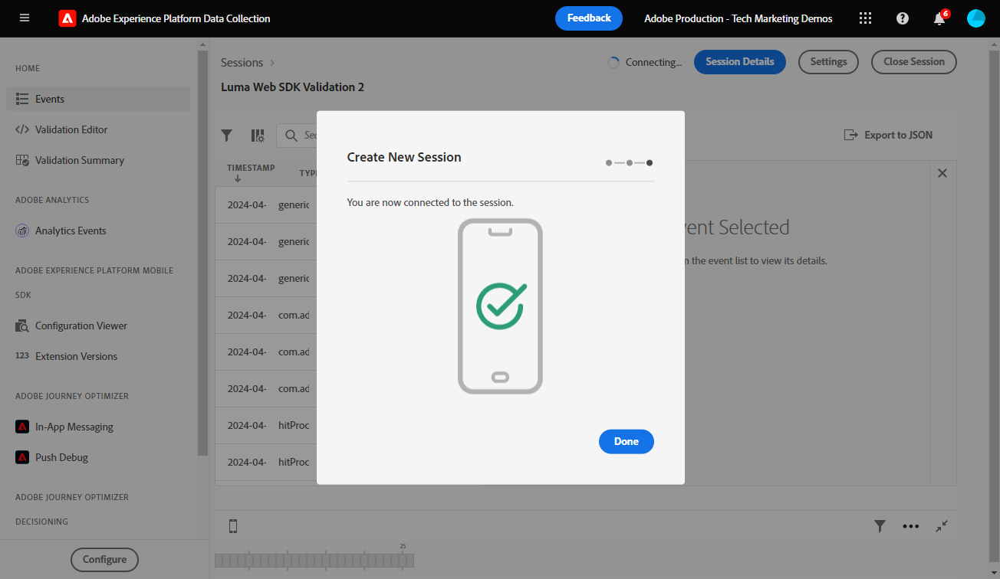

# Validieren von Web SDK-Implementierungen mit Experience Platform Assurance

Adobe Experience Platform Assurance ist eine Funktion, mit der Sie die Datenerfassung und die Bereitstellung von Erlebnissen untersuchen, testen, simulieren und validieren können. Lesen Sie mehr über [Adobe Assurance](https://experienceleague.adobe.com/de/docs/experience-platform/assurance/home).

>[!WARNING]
>
> Die in diesem Tutorial verwendete Luma-Website wird voraussichtlich in der Woche vom 16. Februar 2026 ersetzt. Die im Rahmen dieses Tutorials durchgeführten Arbeiten sind möglicherweise nicht auf die neue Website anwendbar.

## Lernziele

Am Ende dieser Lektion können Sie:

* Starten einer Assurance-Sitzung
* Anzeigen von Anfragen, die an und von Platform Edge Network gesendet werden

## Voraussetzungen

Sie sind mit Datenerfassungs-Tags und der [Demo-Site von Luma](https://luma.enablementadobe.com/content/luma/us/en.html){target="_blank"} vertraut und haben die vorherigen Lektionen im Tutorial abgeschlossen:

* [Konfigurieren eines XDM-Schemas](configure-schemas.md)
* [Konfigurieren eines Identity-Namespace](configure-identities.md)
* [Konfigurieren eines Datenstroms](configure-datastream.md)
* [In der Tag-Eigenschaft installierte Web SDK-Erweiterung](install-web-sdk.md)
* [Datenelemente erstellen](create-data-elements.md)
* [Erstellen von Identitäten](create-identities.md)
* [Erstellen einer Tag-Regel](create-tag-rule.md)
* [Validieren mit Debugger](validate-with-debugger.md)

## Starten und Anzeigen einer Assurance-Sitzung

Es gibt mehrere Möglichkeiten, eine Assurance-Sitzung zu starten.

### Starten einer Assurance-Sitzung im Debugger

Jedes Mal, wenn Sie Edge Trace in Adobe Experience Platform Debugger aktivieren, wird eine Assurance-Sitzung im Hintergrund gestartet.

Überprüfen Sie dies in der Debugger-Lektion:

1. Wechseln Sie zur [Demo-Site von Luma](https://luma.enablementadobe.com/content/luma/us/en.html) und verwenden Sie den Debugger, [ die Tag-Eigenschaft auf der Site in Ihre eigene Entwicklungseigenschaft zu wechseln](validate-with-debugger.md#use-the-experience-platform-debugger-to-map-to-your-tags-property)
1. Wählen Sie im linken Navigationsbereich von **[!UICONTROL Experience Platform Debugger]** die Option **[!UICONTROL Protokolle]**
1. Wählen Sie die Registerkarte **[!UICONTROL Edge]** und dann **[!UICONTROL Verbinden]**

   
1. Wenn Edge Trace aktiviert ist, wird oben ein Symbol für ausgehende Links angezeigt. Wählen Sie das Symbol aus, um Assurance zu öffnen.

   

1. In der Benutzeroberfläche von Assurance wird eine neue Browser-Registerkarte geöffnet.

### Starten einer Assurance-Sitzung über die Assurance-Benutzeroberfläche

1. Öffnen Sie die [Datenerfassungsschnittstelle](https://experience.adobe.com/#/data-collection/home){target="_blank"}
1. Wählen Sie Assurance im linken Navigationsbereich aus.
1. Wählen Sie Sitzung erstellen aus
   
1. Start auswählen
1. Geben Sie der Sitzung einen Namen, z. B. `Luma Web SDK validation`
1. Geben Sie als **[!UICONTROL Basis]** URL `https://luma.enablementadobe.com/` ein
   
1. Klicken Sie im nächsten Bildschirm auf **[!UICONTROL Link kopieren]**
1. Wählen Sie das Symbol aus, um den Link in die Zwischenablage zu kopieren
1. Fügen Sie die URL in Ihren Browser ein. Dadurch wird die Luma-Website mit einem speziellen URL-Parameter `adb_validation_sessionid` geöffnet und die Sitzung wird gestartet
1. Auf der Assurance-Benutzeroberfläche sollte eine Meldung angezeigt werden, die angibt, dass Sie erfolgreich eine Verbindung zur Sitzung hergestellt haben. Außerdem sollten Ereignisse angezeigt werden, die in der Assurance-Benutzeroberfläche erfasst wurden.
   

## Überprüfen des aktuellen Status Ihrer Web SDK-Implementierung

Es gibt nur wenige Informationen, die Sie in diesem Stadium Ihrer Implementierung anzeigen können. Ein möglicher Wert ist die Experience Cloud-ID (ECID), die in Platform Edge Network generiert wird:

1. Wählen Sie die Zeile mit dem Ereignis `Alloy Response Handle`.
1. Auf der rechten Seite wird ein Menü angezeigt. Klicken Sie auf das `+` neben `[!UICONTROL ACPExtensionEventData]`
1. Drilldown durch Auswahl von `[!UICONTROL payload > 0 > payload > 0 > namespace]` durchführen. Die unter dem letzten `0` angezeigte ID entspricht der `ECID`. Das wissen Sie anhand des Werts, der unter `namespace` entsprechenden `ECID` angezeigt wird

   

   >[!CAUTION]
   >
   >Aufgrund der Breite des Fensters wird möglicherweise ein gekürzter ECID-Wert angezeigt. Wählen Sie einfach den Ziehgriff in der Benutzeroberfläche aus und ziehen Sie ihn nach links, um die gesamte ECID anzuzeigen.

In zukünftigen Lektionen verwenden Sie Assurance, um vollständig verarbeitete Payloads zu validieren, sodass sie ein in Ihrem Datenstrom aktiviertes Adobe-Programm erreichen.

Da ein XDM-Objekt jetzt auf einer Seite ausgelöst wird und Sie wissen, wie Sie Ihre Datenerfassung validieren, können Sie Experience Platform und die einzelnen Adobe-Programme mithilfe von Platform Web SDK einrichten.

>[!NOTE]
>
>Vielen Dank, dass Sie sich Zeit genommen haben, um mehr über Adobe Experience Platform Web SDK zu erfahren. Wenn Sie Fragen haben, allgemeines Feedback geben möchten oder Vorschläge für zukünftige Inhalte haben, teilen Sie diese bitte auf diesem [Experience League Community-Diskussionsbeitrag](https://experienceleaguecommunities.adobe.com/t5/adobe-experience-platform-data/tutorial-discussion-implement-adobe-experience-cloud-with-web/td-p/444996)
