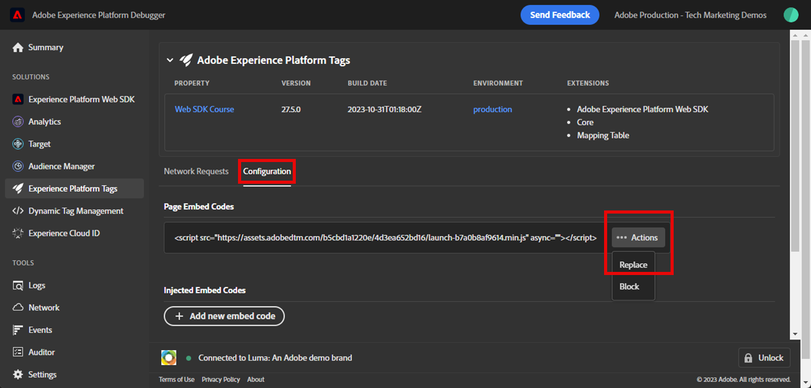

# Validieren von Web SDK-Implementierungen mit Experience Platform Debugger

Erfahren Sie, wie Sie Ihre Adobe Experience Platform Web SDK-Implementierung mit Adobe Experience Platform Debugger validieren.

Der Experience Platform Debugger ist eine Erweiterung, die für Chrome- und Firefox-Browser verfügbar ist und Ihnen dabei hilft, die in Ihren Web-Seiten implementierte Adobe-Technologie zu sehen. Laden Sie die Version für Ihren bevorzugten Browser herunter:

* [Firefox-Erweiterung](https://addons.mozilla.org/de/firefox/addon/adobe-experience-platform-dbg/)
* [Chrome-Erweiterung](https://chromewebstore.google.com/detail/adobe-experience-platform/bfnnokhpnncpkdmbokanobigaccjkpob)

Wenn Sie den Debugger noch nie verwendet haben, sollten Sie sich dieses 5-minütige Übersichtsvideo ansehen:

>[!VIDEO](https://video.tv.adobe.com/v/32156?learn=on)

In dieser Lektion verwenden Sie die Erweiterung [Adobe Experience Platform Debugger ](https://chromewebstore.google.com/detail/adobe-experience-platform/bfnnokhpnncpkdmbokanobigaccjkpob) um die Tag-Eigenschaft auf der Demo-Site [Luma“ hartcodiert durch ](https://luma.enablementadobe.com/content/luma/us/en.html) eigene Eigenschaft zu ersetzen.

Diese Technik wird als Umgebungsumschaltung bezeichnet und ist später hilfreich, wenn Sie auf Ihrer eigenen Website mit Tags arbeiten. Damit können Sie Ihre Produktions-Website in Ihren Browser laden, jedoch mit Ihrer *Entwicklungs-)*. Mit dieser Funktion können Sie Tag-Änderungen unabhängig von Ihren regulären Code-Versionen sicher vornehmen und validieren. Schließlich ist diese Trennung der Marketing-Tag-Versionen von Ihren regulären Code-Versionen einer der Hauptgründe, warum Kunden Tags überhaupt verwenden!

## Lernziele

Am Ende dieser Lektion können Sie den Debugger für folgende Aufgaben verwenden:

* Laden einer alternativen Tag-Bibliothek
* Überprüfen Sie, ob das Client-seitige XDM-Ereignis Daten wie erwartet erfasst und an das Platform-Edge Network sendet
* Aktivieren von Edge Trace, um Server-seitige Anforderungen anzuzeigen, die vom Platform-Edge Network gesendet werden

## Voraussetzungen

Sie sind mit Datenerfassungs-Tags und der [Demo-Site von Luma](https://luma.enablementadobe.com/content/luma/us/en.html){target="_blank"} vertraut und haben die vorherigen Lektionen im Tutorial abgeschlossen:

* [Konfigurieren eines XDM-Schemas](configure-schemas.md)
* [Konfigurieren eines Identity-Namespace](configure-identities.md)
* [Konfigurieren eines Datenstroms](configure-datastream.md)
* [In der Tag-Eigenschaft installierte Web SDK-Erweiterung](install-web-sdk.md)
* [Datenelemente erstellen](create-data-elements.md)
* [Erstellen von Identitäten](create-identities.md)
* [Tag-Regeln erstellen](create-tag-rule.md)

## Laden alternativer Tag-Bibliotheken mit Debugger

Der Experience Platform-Debugger verfügt über eine coole Funktion, mit der Sie eine vorhandene Tag-Bibliothek durch eine andere ersetzen können. Diese Technik ist für die Validierung nützlich und ermöglicht es uns, viele Implementierungsschritte in diesem Tutorial zu überspringen.

1. Vergewissern Sie sich, dass Sie die [Demo-Website von Luma](https://luma.enablementadobe.com/content/luma/us/en.html){target="_blank"} geöffnet haben, und wählen Sie das Symbol Experience Platform Debugger-Erweiterung aus
1. Der Debugger wird geöffnet und zeigt einige Details der hartcodierten Implementierung an (möglicherweise müssen Sie die Luma-Site nach dem Öffnen des Debuggers neu laden)
1. Vergewissern Sie sich, dass der Debugger **[!UICONTROL mit Luma verbunden]** ist, wie unten dargestellt, und wählen Sie dann das Symbol &quot;**[!UICONTROL lock]**&quot; aus, um den Debugger für die Luma-Site zu sperren.
1. Klicken Sie auf **[!UICONTROL Schaltfläche „Anmelden]** und melden Sie sich mit Ihrer Adobe-ID bei Adobe Experience Cloud an.
1. Experience Platform Wechseln Sie jetzt im linken Navigationsbereich zu ****-Tags .

   

1. Wählen Sie die **[!UICONTROL Konfiguration]** aus
1. Öffnen Sie rechts neben der Stelle, an der die **[!UICONTROL Seiteneinbettungs-Codes]** angezeigt werden, das **[!UICONTROL Aktionen]** und wählen Sie **[!UICONTROL Ersetzen]**

   

1. Da Sie authentifiziert sind, ruft der Debugger Ihre verfügbaren Tag-Eigenschaften und Umgebungen ab. Eigenschaft auswählen
1. `Development` auswählen
1. Klicken Sie auf die **[!UICONTROL Apply]**-Schaltfläche

   

1. Die Luma-Website wird jetzt neu geladen _mit Ihrer eigenen Tag-Eigenschaft_.

   

Während Sie mit dem Tutorial fortfahren, verwenden Sie diese Methode, um die Luma-Site Ihrer eigenen Tag-Eigenschaft zuzuordnen, um Ihre Implementierung von Platform Web SDK zu validieren. Wenn Sie Tags auf Ihrer eigenen Website verwenden, können Sie dieselbe Methode zur Validierung von Entwicklungs-Tag-Bibliotheken auf Ihrer Produktions-Website verwenden.

## Client-seitige Netzwerkanfragen mit Experience Platform Debugger überprüfen

Sie können den Debugger verwenden, um Client-seitige Beacons zu validieren, die von Ihrer Platform Web SDK-Implementierung ausgelöst werden, um die an das Platform-Edge Network gesendeten Daten anzuzeigen:

1. Navigieren Sie **[!UICONTROL linken]** zu „Zusammenfassung“, um die Details Ihrer Tag-Eigenschaft anzuzeigen

   

1. Wechseln Sie jetzt zum **[!UICONTROL Experience Platform Web SDK]** im linken Navigationsbereich, um die **[!UICONTROL Netzwerkanfragen“ anzuzeigen]**
1. Öffnen Sie die **[!UICONTROL Ereignisse]** Zeile

   

1. Beachten Sie, wie Sie den `web.webpagedetails.pageView` Ereignistyp, den Sie in Ihrer Aktion [!UICONTROL Variable aktualisieren] angegeben haben, und andere vordefinierte Variablen sehen können, die der `AEP Web SDK ExperienceEvent` Feldergruppe entsprechen

   

1. Scrollen Sie nach unten zum `web` Objekt, wählen Sie es aus, um es zu öffnen, und überprüfen Sie die `webPageDetails.name`, `webPageDetails.server` und `webPageDetails.siteSection`. Sie sollten mit den entsprechenden `digitalData` Datenschichtvariablen auf der Homepage übereinstimmen

>[!TIP]
>
> So zeigen Sie die `digitalData` Datenschicht auf der Homepage an und vergleichen sie:
>
> 1. Öffnen Sie auf der Luma-Homepage die Browser-Entwickler-Tools. Wählen Sie bei Chrome die Schaltfläche `F12` auf der Tastatur aus.
> 1. Wählen Sie die Registerkarte **[!UICONTROL Konsole]** aus
> 1. Geben Sie `digitalData` ein und wählen Sie `Enter` auf der Tastatur aus, um die Datenschichtwerte aufzurufen

Sie können auch die Details der Identitätszuordnung überprüfen:

1. Melden Sie sich mit den Anmeldedaten `test@adobe.com`/`test` bei der Luma-Site an

1. Kehren Sie zur [Startseite „Luma“](https://luma.enablementadobe.com/content/luma/us/en.html) zurück.

1. Öffnen Sie den Abschnitt **[!UICONTROL Experience Platform Web SDK]** im linken Navigationsbereich

   

1. Wählen Sie die **[!UICONTROL Ereignisse]** aus, um Details in einem Popup zu öffnen

   

1. Suchen Sie nach **identityMap** im Popup. Hier sollten `lumaCrmId` mit den drei Schlüsseln AuthenticatedState, ID und primary angezeigt werden:
   

### Validieren von Client-seitigen Anfragen mit Browser-Entwicklungs-Tools

Diese Arten von Anfragedetails sind auch auf der Registerkarte Web-Entwickler-Tools des Browsers **Netzwerk** sichtbar (vorausgesetzt, die Website lädt Ihre Tag-Bibliothek).

1. Öffnen Sie im Browser die Registerkarte Web-Entwickler-Tools **Netzwerk** und laden Sie die Seite neu. Filtern Sie nach Aufrufen mit `/ee`, um den Aufruf zu finden, ihn auszuwählen und dann auf der Registerkarte **Kopfzeilen** und auf der Registerkarte **Payload** zu suchen

   

1. Wechseln Sie zur Registerkarte **Antwort** und beachten Sie, wie der ECID-Wert in der Antwort enthalten ist.

   

   >[!NOTE]
   >
   > Der ECID-Wert ist in der Netzwerkantwort sichtbar. Sie ist nicht im `identityMap` Teil der Netzwerkanfrage enthalten und wird auch nicht in diesem Format in einem Cookie gespeichert.

## Validieren von Server-seitigen Netzwerkanfragen mit Experience Platform Debugger

Wie Sie in der Lektion [Konfigurieren eines Datenstroms](configure-datastream.md) gelernt haben, sendet Platform Web SDK zunächst Daten von Ihrer digitalen Eigenschaft an Platform Edge Network. Dann führt Platform Edge Network zusätzliche Server-seitige Anfragen an die entsprechenden Services durch, die in Ihrem Datenstrom aktiviert sind. Sie können die Server-seitigen Anforderungen von Platform Edge Network mithilfe von Edge Trace im Debugger überprüfen.

<!--Furthermore, you can also validate the fully processed payload after it reaches an Adobe application by using [Adobe Experience Platform Assurance](https://experienceleague.adobe.com/en/docs/experience-platform/assurance/home). -->

### Edge Trace aktivieren

So aktivieren Sie Edge Trace:

1. Wählen Sie im linken Navigationsbereich von **[!UICONTROL Experience Platform Debugger]** Protokolle **[!UICONTROL aus]**
1. Wählen Sie die Registerkarte **[!UICONTROL Edge]** und dann **[!UICONTROL Verbinden]**

   

1. Es ist vorerst leer

   

1. Aktualisieren Sie die [Luma-Startseite](https://luma.enablementadobe.com/) und überprüfen Sie **[!UICONTROL Experience Platform Debugger]** erneut, um zu sehen, wie die Daten durchlaufen werden.

   

Zu diesem Zeitpunkt können Sie keine Platform-Edge Network-Anfragen an Adobe-Programme anzeigen, da Sie keine im Datenstrom aktiviert haben. In zukünftigen Lektionen verwenden Sie Edge Trace, um die ausgehenden Server-seitigen Anforderungen an Adobe-Anwendungen und die Ereignisweiterleitung anzuzeigen. Lernen Sie jedoch zunächst ein anderes Tool zur Validierung von Server-seitigen Anfragen durch Platform Edge Network kennen: Adobe Experience Platform Assurance!

[Weiter: ](validate-with-assurance.md)

>[!NOTE]
>
>Vielen Dank, dass Sie sich Zeit genommen haben, um mehr über Adobe Experience Platform Web SDK zu erfahren. Wenn Sie Fragen haben, allgemeines Feedback geben möchten oder Vorschläge für zukünftige Inhalte haben, teilen Sie diese bitte auf diesem [Experience League-Community-Diskussionsbeitrag](https://experienceleaguecommunities.adobe.com/t5/adobe-experience-platform-data/tutorial-discussion-implement-adobe-experience-cloud-with-web/td-p/444996)
